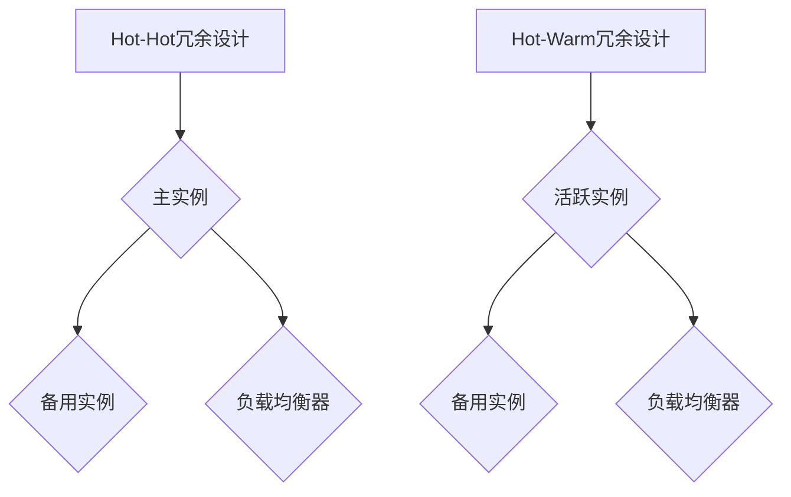

                 

关键词：冗余设计、Hot-Hot、Hot-Warm、系统高可用、容错机制、负载均衡

## 摘要

本文将详细介绍Hot-Hot与Hot-Warm冗余设计，这两种设计模式在确保系统高可用和容错方面扮演着重要角色。我们将首先探讨冗余设计的核心概念和重要性，然后深入分析Hot-Hot和Hot-Warm设计的具体原理、实现方法及其优缺点，并结合实际应用场景进行详细讲解。最后，我们将展望未来发展趋势和面临的挑战。

## 1. 背景介绍

### 1.1 冗余设计的核心概念

冗余设计（Redundancy Design）是指在系统架构中引入冗余组件，以增强系统的可靠性和可用性。冗余组件可以是硬件、软件或网络设备，其目的是在出现故障时提供备份，从而确保系统的连续运行。冗余设计是现代系统设计中不可或缺的一部分，尤其在关键业务系统中，如金融、电信、医疗等领域。

### 1.2 系统高可用与容错机制

系统高可用（High Availability，简称HA）是指系统在长时间内保持正常运行的能力。实现系统高可用需要依赖多种技术，其中包括冗余设计、负载均衡、故障转移等。容错机制（Fault Tolerance）则是指系统能够在出现故障时自动恢复，继续提供服务的机制。

## 2. 核心概念与联系

### 2.1 冗余设计的核心概念

冗余设计主要包括以下几种类型：

- **硬件冗余**：通过引入冗余硬件组件，如备用服务器、存储设备等，来提高系统的容错能力。
- **软件冗余**：通过在系统中部署冗余的软件组件，如备份应用程序、集群服务等，来增强系统的可用性。
- **网络冗余**：通过引入冗余的网络路径，如多重连接、多路径传输等，来提高数据传输的可靠性。

### 2.2 Hot-Hot与Hot-Warm冗余设计

#### 2.2.1 Hot-Hot冗余设计

Hot-Hot冗余设计是指两个或多个活跃的服务实例同时运行，并在主实例出现故障时，自动将负载转移到备用实例上。这种设计模式具有以下特点：

- **高可用性**：由于有两个或多个活跃实例，系统在主实例出现故障时能够快速切换到备用实例，确保服务的连续性。
- **负载均衡**：在多个实例之间分配负载，从而提高系统的性能和响应速度。

#### 2.2.2 Hot-Warm冗余设计

Hot-Warm冗余设计是指有一个活跃的服务实例和一个或多个备用服务实例。当活跃实例出现故障时，备用实例会立即接管服务。这种设计模式具有以下特点：

- **快速故障转移**：由于备用实例处于待机状态，故障转移的速度相对较快。
- **资源节约**：只有当主实例出现故障时，备用实例才会被激活，从而节省了资源。

### 2.3 Mermaid流程图

以下是Hot-Hot与Hot-Warm冗余设计的Mermaid流程图：



## 3. 核心算法原理 & 具体操作步骤

### 3.1 算法原理概述

Hot-Hot与Hot-Warm冗余设计的核心原理是利用冗余组件提高系统的可用性和容错能力。具体来说，Hot-Hot设计通过多个活跃实例实现负载均衡和故障转移，而Hot-Warm设计则通过活跃实例和备用实例的切换实现故障转移。

### 3.2 算法步骤详解

#### 3.2.1 Hot-Hot冗余设计步骤

1. 初始化：部署两个或多个服务实例，并将它们注册到负载均衡器。
2. 负载均衡：负载均衡器根据请求的负载情况，将请求分配到不同的实例。
3. 故障检测：监控系统定期检查实例的健康状态。
4. 故障转移：当主实例出现故障时，负载均衡器自动将请求转移到备用实例。

#### 3.2.2 Hot-Warm冗余设计步骤

1. 初始化：部署一个活跃实例和一个或多个备用实例。
2. 负载均衡：请求由负载均衡器分配到活跃实例。
3. 故障检测：监控系统定期检查实例的健康状态。
4. 故障转移：当活跃实例出现故障时，备用实例接管服务。

### 3.3 算法优缺点

#### Hot-Hot冗余设计

- **优点**：高可用性、负载均衡、故障转移速度快。
- **缺点**：需要部署多个实例，资源消耗较大。

#### Hot-Warm冗余设计

- **优点**：故障转移速度快、资源消耗较低。
- **缺点**：负载均衡能力相对较弱。

### 3.4 算法应用领域

Hot-Hot与Hot-Warm冗余设计可以应用于各种需要高可用性和容错能力的系统，如金融系统、电商系统、在线教育平台等。

## 4. 数学模型和公式 & 详细讲解 & 举例说明

### 4.1 数学模型构建

假设系统中有n个实例，其中m个实例处于活跃状态，其余实例处于备用状态。设每个实例的处理能力为C，系统的总负载为L，则系统的负载均衡系数α可以表示为：

$$
α = \frac{m \times C}{n \times C} = \frac{m}{n}
$$

### 4.2 公式推导过程

- 负载均衡系数α表示系统在活跃实例和备用实例之间的负载分配比例。
- 由于每个实例的处理能力相同，因此系统的总处理能力为nC。
- 系统的总负载为L，则活跃实例的处理能力为mL，备用实例的处理能力为(n-m)L。
- 将活跃实例和备用实例的处理能力相加，得到系统的总处理能力为nC，即：

$$
mL + (n-m)L = nC
$$

- 化简上式，得到：

$$
C = \frac{L}{n}
$$

- 将C代入负载均衡系数α的定义式，得到：

$$
α = \frac{m}{n}
$$

### 4.3 案例分析与讲解

假设一个系统中有3个实例，其中2个实例处于活跃状态，1个实例处于备用状态。每个实例的处理能力为1000个请求/秒。如果系统的总负载为3000个请求/秒，则系统的负载均衡系数α为：

$$
α = \frac{2}{3} = 0.67
$$

这意味着大约67%的请求会分配到活跃实例上，而33%的请求会分配到备用实例上。

## 5. 项目实践：代码实例和详细解释说明

### 5.1 开发环境搭建

为了更好地理解Hot-Hot与Hot-Warm冗余设计，我们使用一个简单的Web应用程序作为实例。首先，我们需要搭建一个开发环境，包括以下组件：

- **Docker**：用于容器化我们的应用程序。
- **Docker-Compose**：用于管理我们的容器。
- **Nginx**：用于负载均衡。
- **PostgreSQL**：用于数据存储。

### 5.2 源代码详细实现

下面是一个简单的Python Web应用程序的示例代码：

```python
# app.py

from flask import Flask, jsonify

app = Flask(__name__)

@app.route('/health')
def health_check():
    return jsonify({"status": "healthy"})

@app.route('/api/data')
def get_data():
    # 模拟从数据库获取数据
    data = {"count": 100}
    return jsonify(data)

if __name__ == '__main__':
    app.run(host='0.0.0.0', port=8080)
```

### 5.3 代码解读与分析

上面的代码是一个简单的Flask Web应用程序，提供了两个API接口：`/health`和`/api/data`。`/health`用于健康检查，`/api/data`用于获取模拟数据。

### 5.4 运行结果展示

我们使用Docker-Compose运行这个应用程序，并配置Nginx作为负载均衡器。以下是Docker-Compose的配置文件示例：

```yaml
# docker-compose.yml

version: '3.8'

services:
  web:
    build: .
    ports:
      - "8080:8080"
    depends_on:
      - db
    environment:
      - DATABASE_URL=postgresql://db:5432/myapp

  db:
    image: postgres:latest
    environment:
      - POSTGRES_USER=myapp
      - POSTGRES_PASSWORD=myapp
      - POSTGRES_DB=myapp

  nginx:
    image: nginx:latest
    ports:
      - "80:80"
    volumes:
      - ./nginx.conf:/etc/nginx/nginx.conf
    depends_on:
      - web

volumes:
  db_data:
```

在这个配置文件中，我们定义了三个服务：`web`、`db`和`nginx`。`web`服务是运行我们的Flask应用程序的容器，`db`服务是运行PostgreSQL数据库的容器，`nginx`服务是作为负载均衡器的容器。

## 6. 实际应用场景

### 6.1 金融系统

在金融系统中，冗余设计至关重要，以确保交易和数据的安全。例如，在银行系统中，可以使用Hot-Hot冗余设计来确保交易处理的高可用性和容错能力。

### 6.2 电商系统

电商系统需要处理大量的订单和用户请求。使用Hot-Warm冗余设计可以在系统负载较高时提供备用实例，从而确保服务的连续性和用户体验。

### 6.3 在线教育平台

在线教育平台需要处理大量用户同时在线学习。通过使用Hot-Hot冗余设计，可以确保课程内容和服务的高可用性，为用户提供流畅的学习体验。

## 7. 工具和资源推荐

### 7.1 学习资源推荐

- **《高可用架构》**：一本关于高可用系统设计的经典著作，详细介绍了各种冗余设计方法。
- **《Docker实战》**：一本关于容器化技术的入门书籍，适合初学者了解Docker的用法。

### 7.2 开发工具推荐

- **Kubernetes**：一个用于容器编排的工具，可以方便地部署和管理多实例应用。
- **Prometheus**：一个开源监控解决方案，可以用于监控系统状态和性能。

### 7.3 相关论文推荐

- **"High Availability in the Cloud: An Overview of HA Architectures and Technologies"**：一篇关于云环境中高可用性架构和技术的综述文章。
- **"Fault-Tolerant Systems: Principles and Methods"**：一篇关于容错系统原理和方法的学术论文。

## 8. 总结：未来发展趋势与挑战

### 8.1 研究成果总结

近年来，随着云计算和容器技术的普及，冗余设计在高可用性和容错领域取得了显著的进展。Hot-Hot与Hot-Warm冗余设计已经成为许多系统架构的标准组件。

### 8.2 未来发展趋势

未来，冗余设计将继续向智能化、自动化方向发展。例如，利用机器学习技术预测系统故障，提前采取预防措施。

### 8.3 面临的挑战

随着系统规模的不断扩大，冗余设计将面临更高的复杂性。如何高效地管理和调度冗余组件，以确保系统的高可用性和性能，是一个亟待解决的问题。

### 8.4 研究展望

在未来，我们有望看到更多创新性的冗余设计方法，如基于区块链的冗余设计，以及更智能的故障预测和恢复机制。

## 9. 附录：常见问题与解答

### 9.1 什么是Hot-Hot冗余设计？

Hot-Hot冗余设计是指两个或多个活跃的服务实例同时运行，并在主实例出现故障时，自动将负载转移到备用实例上。

### 9.2 什么是Hot-Warm冗余设计？

Hot-Warm冗余设计是指有一个活跃的服务实例和一个或多个备用服务实例。当活跃实例出现故障时，备用实例会立即接管服务。

### 9.3 冗余设计与负载均衡有何关系？

冗余设计可以增强系统的容错能力和可用性，而负载均衡则可以提高系统的性能和响应速度。两者相辅相成，共同保障系统的稳定运行。

作者：禅与计算机程序设计艺术 / Zen and the Art of Computer Programming
----------------------------------------------------------------


