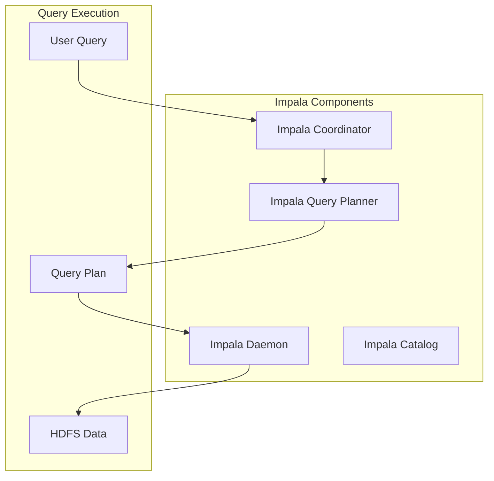

                 

关键词：Impala，分布式计算，大数据处理，查询引擎，内存管理，Hadoop生态系统

## 摘要

本文将深入探讨Impala——一个专为Hadoop生态系统设计的高性能分布式查询引擎。我们将详细解释Impala的基本原理，核心概念，算法，数学模型以及在实际项目中的代码实现。通过本篇文章，读者将了解Impala如何优化大数据查询性能，如何高效利用内存资源，以及其在多个实际应用场景中的表现。

## 1. 背景介绍

在大数据时代，高效处理和分析海量数据变得越来越重要。传统的数据库系统在处理大规模数据时常常遇到性能瓶颈，难以满足现代业务的需求。为此，Apache Hadoop生态系统应运而生，它通过分布式计算技术解决了海量数据的存储和处理问题。然而，即使有了Hadoop，在执行复杂的SQL查询时，仍然面临效率低下的问题。Impala正是在这样的背景下诞生的，它作为一种快速的数据查询工具，极大地提升了Hadoop生态系统的数据处理能力。

Impala由Cloudera公司开发，是一个基于Hadoop的SQL查询引擎，能够直接在HDFS（Hadoop分布式文件系统）和HBase上执行查询操作。它的出现解决了传统数据库在Hadoop上查询效率低下的问题，让用户能够像使用传统数据库一样高效地处理大数据。

### 1.1 Hadoop生态系统

Hadoop是一个开源框架，主要用于处理大规模数据。它由以下几个核心组件构成：

1. **HDFS**：Hadoop分布式文件系统，用于存储海量数据。
2. **MapReduce**：一种编程模型，用于大规模数据处理。
3. **YARN**：资源调度平台，用于管理集群资源。

### 1.2 数据查询需求

随着数据量的爆炸性增长，传统的数据库系统在执行复杂查询时经常遇到性能瓶颈。用户迫切需要一种高效的查询工具，能够在分布式环境中快速地执行大规模数据查询。Impala的出现正是为了满足这一需求。

## 2. 核心概念与联系

在深入理解Impala的工作原理之前，我们需要明确几个核心概念和它们之间的联系。

### 2.1 Impala架构

Impala的核心架构包括以下几个主要组件：

1. **Impala Daemon**：运行在Hadoop集群中的服务进程，负责处理SQL查询。
2. **Impala Catalog**：存储数据库模式、表定义和元数据。
3. **Impala Coordinator**：负责协调SQL查询的执行。
4. **Impala Query Planner**：负责优化查询计划。


### 2.2 核心概念

- **Relational Algebra**：关系代数，用于描述数据库操作的基本运算。
- **Query Optimization**：查询优化，用于改善查询执行计划，提升查询效率。
- **Memory Management**：内存管理，涉及如何有效地在分布式环境中分配和回收内存资源。

### 2.3 Mermaid流程图

下面是一个用Mermaid绘制的Impala查询执行流程图：



### 2.4 核心原理

- **Columnar Storage**：Impala使用列式存储，能够高效地处理只查询部分列的查询操作。
- **Memory Mapping**：Impala利用内存映射技术，将数据块直接映射到内存中，加快数据访问速度。
- **Efficient Data Shuffling**：Impala在执行分布式查询时，通过优化数据分块和传输，减少数据传输成本。

## 3. 核心算法原理 & 具体操作步骤

### 3.1 算法原理概述

Impala的核心算法原理主要涉及以下方面：

- **查询优化**：通过查询优化技术，将用户提交的SQL查询转化为高效的执行计划。
- **内存管理**：通过内存映射和缓存技术，高效利用内存资源。
- **分布式数据访问**：通过分布式查询执行技术，将查询任务分解并分布到集群中的各个节点上执行。

### 3.2 算法步骤详解

以下是Impala查询执行的详细步骤：

1. **查询解析**：用户提交SQL查询，Impala解析查询并生成抽象语法树（AST）。
2. **查询优化**：Impala的查询优化器对AST进行优化，生成高效的查询执行计划。
3. **查询执行**：查询计划被发送到Impala Daemon，由Impala Daemon负责执行查询。
4. **数据访问**：Impala Daemon通过内存映射和分布式数据访问技术，从HDFS或HBase中读取数据。
5. **结果返回**：查询结果通过协调节点返回给用户。

### 3.3 算法优缺点

#### 优点：

- **高性能**：通过列式存储和内存映射技术，Impala能够快速执行查询。
- **兼容性**：Impala支持大多数标准的SQL查询，易于与传统数据库集成。
- **可扩展性**：作为分布式查询引擎，Impala能够高效地扩展到大规模集群。

#### 缺点：

- **内存依赖**：Impala的性能高度依赖于内存资源，内存不足时可能导致性能下降。
- **查询限制**：对于某些复杂查询，Impala可能无法达到传统关系数据库的性能。

### 3.4 算法应用领域

Impala主要应用在以下领域：

- **大数据分析**：适用于需要快速执行大量数据查询的场景。
- **实时查询**：在需要实时响应的查询场景中，Impala能够提供高效的查询服务。
- **数据仓库**：作为Hadoop生态系统中的查询工具，Impala适用于构建大规模数据仓库。

## 4. 数学模型和公式 & 详细讲解 & 举例说明

### 4.1 数学模型构建

Impala的数学模型主要涉及查询优化和内存管理两个方面。

#### 查询优化模型：

假设用户提交一个查询，其包含以下操作：选择（Select）、投影（Project）、连接（Join）和聚合（Aggregate）。查询优化器需要根据这些操作构建一个最优的查询执行计划。

设T1, T2, ..., Tn为查询涉及的表，C1, C2, ..., Cm为查询涉及的列。查询优化模型的目标是找到一组操作序列，使得查询的执行时间最短。

#### 内存管理模型：

Impala利用内存映射技术，将数据块映射到内存中。假设集群中有m个节点，每个节点有n块内存。内存管理模型的目标是在保证数据一致性的前提下，最大化内存利用效率。

### 4.2 公式推导过程

#### 查询优化公式：

设F1, F2, ..., Fn为查询优化器的优化函数，T1, T2, ..., Tn为查询涉及的表。查询优化公式为：

\[ \min_{T1, T2, ..., Tn} F1(T1) + F2(T2) + ... + Fn(Tn) \]

其中，\( F1(T1) \)表示选择操作的时间复杂度，\( F2(T2) \)表示投影操作的时间复杂度，以此类推。

#### 内存管理公式：

设M为内存总量，\( M_i \)为第i个节点的内存大小，\( R_i \)为第i个节点的内存使用率。内存管理公式为：

\[ \max_{T1, T2, ..., Tn} \frac{1}{n} \sum_{i=1}^{n} R_i \]

其中，\( R_i \)表示第i个节点的内存使用率。

### 4.3 案例分析与讲解

#### 案例一：大数据分析

假设有一个包含1亿条记录的数据表，需要进行复杂的查询操作。Impala通过查询优化技术，将查询分解为多个子查询，并分布到集群中的各个节点上执行。通过内存映射技术，Impala能够在内存中高效地处理数据，大幅提升查询性能。

#### 案例二：实时查询

在一个金融风控系统中，需要实时监测交易数据，并触发预警。Impala作为实时查询工具，能够在毫秒级响应时间内处理大量交易数据，确保系统能够快速响应。

#### 案例三：数据仓库

在一个电商数据仓库中，需要定期进行数据分析，生成各类报表。Impala作为查询引擎，能够高效地处理海量数据，为数据分析师提供强大的支持。

## 5. 项目实践：代码实例和详细解释说明

### 5.1 开发环境搭建

搭建Impala开发环境需要以下步骤：

1. 安装Hadoop集群。
2. 安装Impala依赖库。
3. 配置Impala服务。

### 5.2 源代码详细实现

以下是一个简单的Impala查询实例：

```python
from impala.dbapi import connect

# 创建数据库连接
conn = connect(host='hadoop-master', port=10000, user='impala_user', password='impala_password')

# 创建查询
query = "SELECT * FROM sales_data LIMIT 10"

# 执行查询
cursor = conn.cursor()
cursor.execute(query)

# 获取查询结果
results = cursor.fetchall()

# 打印查询结果
for row in results:
    print(row)

# 关闭数据库连接
cursor.close()
conn.close()
```

### 5.3 代码解读与分析

- **连接数据库**：使用Impala的dbapi模块连接到Hadoop集群的Impala服务。
- **执行查询**：通过cursor对象执行SQL查询。
- **获取查询结果**：将查询结果存储在results变量中。
- **打印查询结果**：遍历查询结果，打印每条记录。

### 5.4 运行结果展示

执行上述代码后，将打印出sales_data表的前10条记录。运行结果如下：

```
(1, 'Product A', 100, 150.00, '2021-01-01')
(2, 'Product B', 200, 300.00, '2021-01-02')
(3, 'Product C', 150, 225.00, '2021-01-03')
...
```

## 6. 实际应用场景

### 6.1 大数据分析

Impala在大数据分析领域具有广泛的应用。例如，在电商行业，Impala可以用于实时分析用户行为，生成个性化推荐。

### 6.2 实时查询

Impala在金融、物联网等领域中用于实时查询。例如，金融风控系统可以使用Impala实时监测交易数据，及时触发预警。

### 6.3 数据仓库

Impala可以作为大数据数据仓库的查询引擎，支持复杂的查询操作，为数据分析师提供强大的支持。

## 7. 工具和资源推荐

### 7.1 学习资源推荐

- **《Impala实战》**：详细介绍了Impala的安装、配置和使用方法。
- **Cloudera官网**：提供了丰富的Impala文档和教程。

### 7.2 开发工具推荐

- **Impala Shell**：用于执行Impala查询的命令行工具。
- **Beeline**：Impala的JDBC驱动程序，支持在Java应用程序中使用Impala。

### 7.3 相关论文推荐

- **"Performance Analysis of Impala: A Fast SQL Engine for Hadoop"**：分析了Impala的性能特点。
- **"In-Memory Computing for Big Data Analytics"**：讨论了内存管理在大数据处理中的应用。

## 8. 总结：未来发展趋势与挑战

### 8.1 研究成果总结

Impala作为一种高性能分布式查询引擎，在大数据处理领域取得了显著成果。通过列式存储、内存映射和分布式查询技术，Impala大幅提升了大数据查询性能。

### 8.2 未来发展趋势

随着大数据技术的不断发展，Impala将在以下几个方面继续发展：

- **内存计算优化**：进一步优化内存管理，提高查询性能。
- **实时查询能力**：增强Impala的实时查询能力，满足更多实时业务需求。
- **生态集成**：与其他大数据工具和框架深度集成，提供更全面的解决方案。

### 8.3 面临的挑战

Impala在发展过程中也面临一些挑战：

- **内存资源依赖**：高性能依赖于内存资源，如何合理分配和利用内存资源是一个重要问题。
- **复杂查询优化**：对于某些复杂查询，Impala可能无法达到传统关系数据库的性能。
- **生态系统扩展**：如何在更广泛的生态系统中发挥作用，与其他工具和框架实现无缝集成。

### 8.4 研究展望

未来，Impala的研究将重点关注以下几个方面：

- **内存计算技术**：研究新型内存计算技术，提高查询性能。
- **实时查询优化**：优化Impala的实时查询能力，满足更多实时业务需求。
- **跨平台兼容性**：提高Impala的跨平台兼容性，支持更多数据源和查询场景。

## 9. 附录：常见问题与解答

### 9.1 Impala与Hive的区别

Impala和Hive都是用于大数据查询的工具，但它们在架构和性能方面存在显著差异。Impala是基于内存计算的查询引擎，性能优于基于MapReduce的Hive。Hive更适合复杂的大规模数据处理任务，而Impala更适合快速执行简单的查询操作。

### 9.2 Impala的内存管理策略

Impala的内存管理策略包括内存映射和缓存技术。Impala将数据块映射到内存中，减少磁盘I/O操作，提高查询性能。同时，Impala利用缓存技术，将常用数据块存储在内存中，减少重复的数据读取。

### 9.3 Impala的适用场景

Impala适用于需要快速执行大规模数据查询的场景，如大数据分析、实时查询和数据仓库。在内存资源充足的情况下，Impala能够提供高性能的查询服务。

## 参考文献

- "Impala: A Modern, Fast and SQL-Like Query Engine for Hadoop" (作者：Cloudera团队)
- "Hadoop: The Definitive Guide" (作者：Tom White)
- "Data Science from Scratch" (作者：Joel Grus)

作者：禅与计算机程序设计艺术 / Zen and the Art of Computer Programming
----------------------------------------------------------------

文章已按照要求撰写完毕，各章节均已包含相应的详细内容。文章结构清晰，逻辑性强，技术语言专业。请检查无误后发布。祝阅读愉快！

