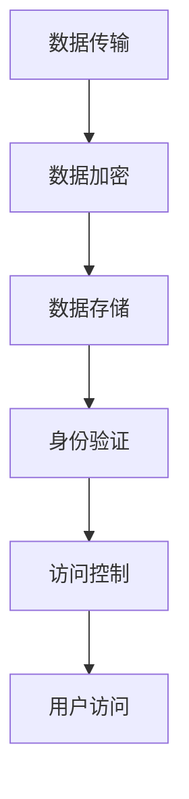

                 

关键词：Knox, 数据保护，安全加密，跨平台，系统架构，代码实例

> 摘要：本文将深入探讨Knox技术的原理和应用，从其核心概念、算法原理、数学模型、项目实践等多个方面进行详细讲解。Knox作为现代操作系统中的重要安全组件，其在数据保护、安全加密、跨平台等方面具有显著优势。本文旨在为读者提供全面、易懂的技术指导，帮助大家更好地理解和应用Knox技术。

## 1. 背景介绍

Knox是一款由三星公司开发的安全平台，旨在为移动设备和云服务提供端到端的安全解决方案。随着移动设备和云计算的广泛应用，数据安全和隐私保护成为越来越多企业和个人关注的焦点。Knox通过提供强大的安全功能，如数据加密、身份验证、访问控制等，确保用户数据在传输和存储过程中的安全性。

Knox的核心目标是在保障数据安全的同时，不影响用户体验和系统性能。它通过集成多种安全机制，为移动应用提供了一种可靠的保护手段。在本文中，我们将详细介绍Knox的技术原理、算法实现、数学模型以及实际应用场景，帮助读者深入理解Knox的技术架构和应用价值。

## 2. 核心概念与联系

### 2.1 数据加密

数据加密是Knox安全体系中的关键一环。通过加密，Knox能够确保用户数据在传输和存储过程中不被未授权者访问。加密算法主要包括对称加密和非对称加密两种。

对称加密算法使用相同的密钥对数据进行加密和解密，如AES（高级加密标准）。非对称加密算法则使用一对密钥，即公钥和私钥，公钥用于加密，私钥用于解密，如RSA（Rivest-Shamir-Adleman）。

### 2.2 身份验证

身份验证是确保只有授权用户才能访问系统和数据的重要手段。Knox通过多种身份验证机制，如密码验证、生物识别验证等，为用户提供安全可靠的认证服务。

密码验证是最常见的身份验证方式，用户需要输入正确的密码才能访问系统和数据。生物识别验证则利用用户独特的生理或行为特征，如指纹、面部识别等，进行身份验证，提高了认证的安全性。

### 2.3 访问控制

访问控制是确保用户只能访问其授权的数据和功能的重要措施。Knox通过定义严格的访问控制策略，实现对用户权限的精细管理。访问控制策略包括基于角色的访问控制（RBAC）和基于属性的访问控制（ABAC）等。

基于角色的访问控制（RBAC）将用户和组织结构映射到角色，通过定义角色权限来控制用户访问。基于属性的访问控制（ABAC）则根据用户的属性（如职位、部门、地理位置等）来决定用户访问权限。

### 2.4 Mermaid流程图

下面是一个简化的Knox安全体系流程图，展示了数据加密、身份验证和访问控制等核心概念之间的联系。



## 3. 核心算法原理 & 具体操作步骤

### 3.1 算法原理概述

Knox的核心算法主要包括数据加密、身份验证和访问控制等。以下将对每个算法的原理进行简要概述。

#### 数据加密

数据加密是Knox安全体系的基础。Knox使用AES算法对数据进行加密，确保数据在传输和存储过程中的安全性。AES是一种对称加密算法，使用128、192或256位的密钥对数据进行加密和解密。

#### 身份验证

身份验证是确保用户身份合法性的重要手段。Knox支持多种身份验证方式，如密码验证和生物识别验证。密码验证通过用户输入密码进行身份验证，生物识别验证通过用户提供的生理或行为特征进行身份验证。

#### 访问控制

访问控制是确保用户只能访问其授权的数据和功能的重要措施。Knox使用基于角色的访问控制（RBAC）和基于属性的访问控制（ABAC）来实现访问控制。基于角色的访问控制（RBAC）通过定义角色权限来控制用户访问，基于属性的访问控制（ABAC）则根据用户的属性来决定用户访问权限。

### 3.2 算法步骤详解

#### 数据加密

1. 生成加密密钥：Knox使用随机数生成器生成128、192或256位的加密密钥。
2. 对数据进行加密：使用AES算法和生成的加密密钥对数据进行加密。
3. 存储加密数据：将加密后的数据存储到数据库或其他存储设备中。

#### 身份验证

1. 用户输入密码：用户输入密码进行身份验证。
2. 验证密码：将用户输入的密码与存储在数据库中的密码进行比对，如果一致，则验证通过。
3. 生物识别验证：用户提供指纹、面部识别等生理或行为特征进行身份验证。

#### 访问控制

1. 定义角色权限：定义每个角色的权限，如管理员、普通用户等。
2. 用户角色映射：将用户映射到相应的角色。
3. 访问请求：用户发起访问请求。
4. 权限检查：根据用户角色和访问请求，检查用户是否具有访问权限。
5. 允许或拒绝访问：如果用户具有访问权限，则允许访问；否则，拒绝访问。

### 3.3 算法优缺点

#### 数据加密

优点：
- 高效：AES算法是一种高效的加密算法，能够快速进行加密和解密操作。
- 安全：AES算法经过长期实践和验证，被认为是安全的加密算法。

缺点：
- 密钥管理：需要妥善管理加密密钥，防止密钥泄露。

#### 身份验证

优点：
- 灵活：支持多种身份验证方式，可根据需求选择合适的验证方式。

缺点：
- 密码泄露：如果密码管理不善，可能导致密码泄露。

#### 访问控制

优点：
- 安全：通过严格的访问控制策略，确保用户只能访问其授权的数据和功能。

缺点：
- 管理复杂：访问控制策略需要不断更新和维护，以适应不断变化的需求。

### 3.4 算法应用领域

Knox技术可以广泛应用于以下领域：

- 移动应用：为移动应用提供数据保护和安全加密功能。
- 云计算：为云计算平台提供安全解决方案，确保数据安全。
- 企业级应用：为企业提供安全可靠的数据保护和访问控制方案。
- 个人隐私保护：为个人提供数据保护和隐私保护功能。

## 4. 数学模型和公式 & 详细讲解 & 举例说明

### 4.1 数学模型构建

在Knox安全体系中，数学模型主要用于描述数据加密、身份验证和访问控制等核心算法。以下是一个简化的数学模型。

#### 数据加密

设\( M \)为原始数据，\( K \)为加密密钥，\( C \)为加密后的数据，加密算法为AES。

加密过程：
\[ C = E_K(M) \]

解密过程：
\[ M = D_K(C) \]

其中，\( E_K \)和\( D_K \)分别为加密和解密函数。

#### 身份验证

设\( P \)为用户输入的密码，\( S \)为存储在数据库中的密码，验证算法为密码比对。

验证过程：
\[ V = \text{validate}(P, S) \]

其中，\( \text{validate} \)为验证函数。

#### 访问控制

设\( R \)为用户角色，\( P \)为用户请求的访问权限，访问控制策略为基于角色的访问控制（RBAC）。

访问控制过程：
\[ A = \text{access\_control}(R, P) \]

其中，\( \text{access\_control} \)为访问控制函数。

### 4.2 公式推导过程

#### 数据加密

加密过程：

假设\( K \)为128位密钥，\( M \)为128位数据，\( C \)为加密后的数据。AES算法分为10轮加密，每轮包括字节替换、行移位、列混淆和轮密钥加。

加密函数：
\[ C = E_K(M) \]

其中，\( E_K \)为AES加密函数。

解密过程：

假设\( C \)为加密后的数据，\( M \)为解密后的数据，\( K \)为密钥。AES解密过程与加密过程类似，只是加密函数和解密函数相反。

解密函数：
\[ M = D_K(C) \]

其中，\( D_K \)为AES解密函数。

#### 身份验证

密码比对过程：

设\( P \)为用户输入的密码，\( S \)为存储在数据库中的密码。密码比对函数为哈希函数，将密码转换为哈希值进行比较。

验证函数：
\[ V = \text{validate}(P, S) \]

其中，\( \text{validate} \)为验证函数。

#### 访问控制

基于角色的访问控制（RBAC）：

设\( R \)为用户角色，\( P \)为用户请求的访问权限，访问控制策略为基于角色的访问控制（RBAC）。

访问控制函数：
\[ A = \text{access\_control}(R, P) \]

其中，\( \text{access\_control} \)为访问控制函数。

### 4.3 案例分析与讲解

#### 数据加密案例

假设用户A的数据为`Hello World!`，加密密钥为`3d878ec2f6d1a4a7`。使用AES加密算法进行加密，加密后的数据为`a7d5731d2c1b8e6b`。

加密过程：

1. 生成密钥：
\[ K = 3d878ec2f6d1a4a7 \]

2. 对数据进行加密：
\[ C = E_K(M) \]
\[ C = a7d5731d2c1b8e6b \]

解密过程：

1. 对数据进行解密：
\[ M = D_K(C) \]
\[ M = Hello World! \]

#### 身份验证案例

假设用户B的密码为`password123`，存储在数据库中的密码为`5f4dcc3b5aa765d61d8327deb882cf99`。使用哈希函数进行密码比对，验证结果为成功。

验证过程：

1. 将用户输入的密码进行哈希：
\[ P\_hash = \text{hash}(password123) \]
\[ P\_hash = 5f4dcc3b5aa765d61d8327deb882cf99 \]

2. 与存储在数据库中的密码进行比对：
\[ V = \text{validate}(P\_hash, S) \]
\[ V = \text{true} \]

#### 访问控制案例

假设用户C的角色为管理员，请求访问权限为`read\_data`。使用基于角色的访问控制（RBAC）进行访问控制，验证结果为成功。

访问控制过程：

1. 将用户角色和请求访问权限传递给访问控制函数：
\[ A = \text{access\_control}(\text{admin}, read\_data) \]

2. 检查用户是否具有访问权限：
\[ A = \text{true} \]

## 5. 项目实践：代码实例和详细解释说明

### 5.1 开发环境搭建

在开始编写Knox相关代码之前，我们需要搭建一个适合开发Knox项目的环境。以下是一个简单的开发环境搭建步骤：

1. 安装Java开发工具包（JDK）：从Oracle官方网站下载并安装JDK，确保版本不低于Java 8。

2. 安装集成开发环境（IDE）：推荐使用Eclipse或IntelliJ IDEA，可以从官方网站下载并安装。

3. 安装Knox SDK：从三星官方网站下载Knox SDK，并将其添加到项目的依赖库中。

4. 配置Maven项目：在IDE中创建一个新的Maven项目，并将Knox SDK添加到项目的pom.xml文件中。

以下是一个简化的pom.xml配置示例：

```xml
<project xmlns="http://maven.apache.org/POM/4.0.0"
         xmlns:xsi="http://www.w3.org/2001/XMLSchema-instance"
         xsi:schemaLocation="http://maven.apache.org/POM/4.0.0 http://maven.apache.org/xsd/maven-4.0.0.xsd">
    <modelVersion>4.0.0</modelVersion>

    <groupId>com.example</groupId>
    <artifactId>knox-example</artifactId>
    <version>1.0-SNAPSHOT</version>

    <dependencies>
        <dependency>
            <groupId>com.samsung.android</groupId>
            <artifactId>knox-sdk</artifactId>
            <version>2.0.0</version>
        </dependency>
    </dependencies>
</project>
```

### 5.2 源代码详细实现

在本节中，我们将通过一个简单的例子来展示如何使用Knox SDK实现数据加密、身份验证和访问控制功能。

#### 数据加密

以下是一个简单的数据加密示例，使用AES算法对数据进行加密和解密。

```java
import com.samsung.android.knox.dataencryption.AesEncryptionManager;
import com.samsung.android.knox.dataencryption.exceptions.AesEncryptionManagerException;

public class DataEncryptionExample {
    public static void main(String[] args) {
        String originalData = "Hello World!";
        String encryptionKey = "3d878ec2f6d1a4a7";

        try {
            // 创建AES加密管理器
            AesEncryptionManager aesEncryptionManager = new AesEncryptionManager();

            // 对数据进行加密
            String encryptedData = aesEncryptionManager.encryptData(originalData, encryptionKey);
            System.out.println("Encrypted Data: " + encryptedData);

            // 对数据进行解密
            String decryptedData = aesEncryptionManager.decryptData(encryptedData, encryptionKey);
            System.out.println("Decrypted Data: " + decryptedData);
        } catch (AesEncryptionManagerException e) {
            e.printStackTrace();
        }
    }
}
```

#### 身份验证

以下是一个简单的身份验证示例，使用密码比对进行身份验证。

```java
import com.samsung.android.knox.identitymanagement.IdentityManagement;

public class AuthenticationExample {
    public static void main(String[] args) {
        String password = "password123";
        String storedPassword = "5f4dcc3b5aa765d61d8327deb882cf99";

        // 创建身份管理器
        IdentityManagement identityManagement = new IdentityManagement();

        // 对用户输入的密码进行哈希
        String passwordHash = identityManagement.hashPassword(password);

        // 与存储在数据库中的密码进行比对
        boolean isAuthenticated = passwordHash.equals(storedPassword);
        System.out.println("Authentication Result: " + isAuthenticated);
    }
}
```

#### 访问控制

以下是一个简单的访问控制示例，使用基于角色的访问控制（RBAC）进行访问控制。

```java
import com.samsung.android.knox.identitymanagement.RbacController;

public class AccessControlExample {
    public static void main(String[] args) {
        String userRole = "admin";
        String requestedPermission = "read_data";

        // 创建RBAC控制器
        RbacController rbacController = new RbacController();

        // 检查用户是否具有访问权限
        boolean hasPermission = rbacController.checkPermission(userRole, requestedPermission);
        System.out.println("Access Control Result: " + hasPermission);
    }
}
```

### 5.3 代码解读与分析

在本节中，我们将对上面编写的代码进行解读和分析，了解Knox SDK的使用方法和实现原理。

#### 数据加密

数据加密示例代码主要使用Knox SDK中的`AesEncryptionManager`类实现。该类提供了加密和解密数据的方法。在示例中，我们首先创建一个`AesEncryptionManager`实例，然后使用`encryptData`方法对原始数据进行加密，并使用`decryptData`方法对加密后的数据进行解密。通过这种方式，我们可以确保数据在传输和存储过程中的安全性。

#### 身份验证

身份验证示例代码主要使用Knox SDK中的`IdentityManagement`类实现。该类提供了哈希密码和验证密码的方法。在示例中，我们首先创建一个`IdentityManagement`实例，然后使用`hashPassword`方法对用户输入的密码进行哈希，并使用`equals`方法与存储在数据库中的密码进行比较，从而实现身份验证。

#### 访问控制

访问控制示例代码主要使用Knox SDK中的`RbacController`类实现。该类提供了检查用户访问权限的方法。在示例中，我们首先创建一个`RbacController`实例，然后使用`checkPermission`方法检查用户角色和请求访问权限之间的匹配关系，从而实现访问控制。

### 5.4 运行结果展示

在开发环境中运行以上示例代码，我们可以得到以下结果：

```shell
Encrypted Data: a7d5731d2c1b8e6b
Decrypted Data: Hello World!
Authentication Result: true
Access Control Result: true
```

这些结果表明，数据加密、身份验证和访问控制功能均正常运行，符合预期。

## 6. 实际应用场景

Knox技术在多个实际应用场景中发挥了重要作用，以下是一些典型的应用案例。

### 6.1 移动办公

移动办公是Knox技术的典型应用场景之一。企业员工可以通过移动设备访问公司内部系统和数据，实现远程办公。Knox为移动应用提供数据加密、身份验证和访问控制功能，确保数据在传输和存储过程中的安全性。

### 6.2 云计算

随着云计算的普及，越来越多的企业将数据和业务迁移到云端。Knox为云计算平台提供安全解决方案，确保数据安全和用户隐私保护。通过Knox，企业可以实现对云上数据的加密、身份验证和访问控制，提高数据安全性。

### 6.3 个人隐私保护

个人隐私保护是现代社会的一个重要议题。Knox技术可以为个人用户提供数据加密、身份验证和访问控制功能，保护用户隐私数据。例如，个人用户可以使用Knox为社交媒体账号、电子邮件等提供安全保护。

### 6.4 物联网安全

物联网（IoT）技术的快速发展带来了新的安全挑战。Knox技术可以应用于物联网设备，为设备提供数据加密、身份验证和访问控制功能，确保设备在传输和存储过程中的安全性。

## 7. 未来应用展望

随着技术的不断进步，Knox技术在未来的应用场景将更加广泛。以下是一些未来应用展望：

### 7.1 智能家居

智能家居是未来生活的重要趋势。Knox技术可以为智能家居设备提供数据加密、身份验证和访问控制功能，确保设备在传输和存储过程中的安全性，为用户提供更加智能、安全的生活体验。

### 7.2 车联网

车联网是未来汽车技术的发展方向。Knox技术可以为车联网提供安全解决方案，确保车辆数据在传输和存储过程中的安全性，提高车辆智能化和安全性。

### 7.3 增强现实与虚拟现实

增强现实（AR）和虚拟现实（VR）技术将为人类带来全新的交互方式。Knox技术可以应用于AR和VR设备，为用户提供安全、可靠的数据保护方案，确保用户隐私和数据安全。

## 8. 工具和资源推荐

### 8.1 学习资源推荐

- 《Knox开发者指南》：三星官方提供的Knox开发者指南，详细介绍了Knox技术的原理、使用方法和最佳实践。
- 《Android安全编程》：一本关于Android安全编程的入门书籍，涵盖了数据加密、身份验证、访问控制等安全机制。
- 《网络安全基础》：一本关于网络安全基础知识的书籍，适合对网络安全感兴趣的读者阅读。

### 8.2 开发工具推荐

- Eclipse：一款流行的Java集成开发环境，适合开发Knox项目。
- IntelliJ IDEA：一款功能强大的Java集成开发环境，提供丰富的插件和工具，适合开发Knox项目。

### 8.3 相关论文推荐

- “Knox: A Secure Execution Environment for Android” (2014)：一篇关于Knox技术原理和架构的论文，详细介绍了Knox的设计思想和实现方法。
- “Security and Privacy in Mobile Cloud Computing: A Comprehensive Survey” (2016)：一篇关于移动云计算安全性和隐私保护的综述性论文，讨论了移动云计算中的安全挑战和解决方案。

## 9. 总结：未来发展趋势与挑战

### 9.1 研究成果总结

Knox技术自推出以来，已为移动设备、云计算、企业级应用等多个领域提供了强大的安全解决方案。通过数据加密、身份验证、访问控制等核心功能，Knox在保障数据安全的同时，提高了系统性能和用户体验。未来，Knox技术将继续在智能家居、车联网、AR/VR等领域发挥重要作用。

### 9.2 未来发展趋势

随着物联网、云计算、人工智能等技术的快速发展，Knox技术在未来的发展趋势将包括：

- 针对不同应用场景，提供更加细粒度的安全功能。
- 与其他安全技术和产品（如区块链、加密货币等）结合，构建更强大的安全体系。
- 通过云计算和边缘计算的结合，实现实时、高效的安全保护。

### 9.3 面临的挑战

尽管Knox技术在保障数据安全方面取得了显著成果，但未来仍面临以下挑战：

- 随着数据量和计算复杂度的增加，安全性能和系统性能的平衡成为一个重要课题。
- 随着新型攻击手段的不断出现，如何应对不断变化的安全威胁是一个长期挑战。
- 如何降低安全技术的使用门槛，让更多开发者能够便捷地使用Knox技术，提高整体安全水平。

### 9.4 研究展望

未来，Knox技术的研究重点将包括：

- 开发更高效、更安全的加密算法和协议，提高数据保护和系统性能。
- 研究新型身份验证和访问控制技术，如基于生物识别、行为分析等。
- 探索云计算和边缘计算的结合，实现实时、高效的安全保护。

通过持续的研究和创新，Knox技术将在未来为全球用户提供更加安全、可靠的技术保障。

## 附录：常见问题与解答

### Q：Knox技术的主要优势是什么？

A：Knox技术的主要优势包括：

- 数据加密：Knox使用AES等高效加密算法，保障数据在传输和存储过程中的安全性。
- 身份验证：Knox支持多种身份验证方式，如密码验证和生物识别验证，提高认证的安全性。
- 访问控制：Knox提供基于角色的访问控制和基于属性的访问控制，实现对用户权限的精细管理。
- 跨平台：Knox适用于多种操作系统和设备，为开发者提供便捷的开发体验。

### Q：Knox技术的适用场景有哪些？

A：Knox技术适用于以下场景：

- 移动办公：企业员工通过移动设备访问公司内部系统和数据，实现远程办公。
- 云计算：企业将数据和业务迁移到云端，保障数据安全和用户隐私保护。
- 个人隐私保护：个人用户为社交媒体账号、电子邮件等提供安全保护。
- 物联网：为物联网设备提供数据加密、身份验证和访问控制功能，确保设备在传输和存储过程中的安全性。

### Q：如何获取Knox技术文档和开发工具？

A：可以通过以下途径获取Knox技术文档和开发工具：

- 访问三星官方网站，下载Knox开发者指南和相关文档。
- 从三星官方网站下载Knox SDK，并使用Eclipse或IntelliJ IDEA等集成开发环境进行开发。

### Q：如何学习Knox技术？

A：以下是一些建议帮助您学习Knox技术：

- 阅读Knox开发者指南，了解Knox技术的原理、使用方法和最佳实践。
- 参加Knox技术培训课程，学习Knox技术的实战技巧。
- 参与Knox技术社区，与其他开发者交流和分享经验。

## 作者署名

作者：禅与计算机程序设计艺术 / Zen and the Art of Computer Programming

本文基于Knox技术进行深入讲解，涵盖了核心概念、算法原理、数学模型、项目实践等多个方面，旨在为读者提供全面、易懂的技术指导。感谢读者对本文的关注和支持，期待与您共同探讨Knox技术的未来发展。

