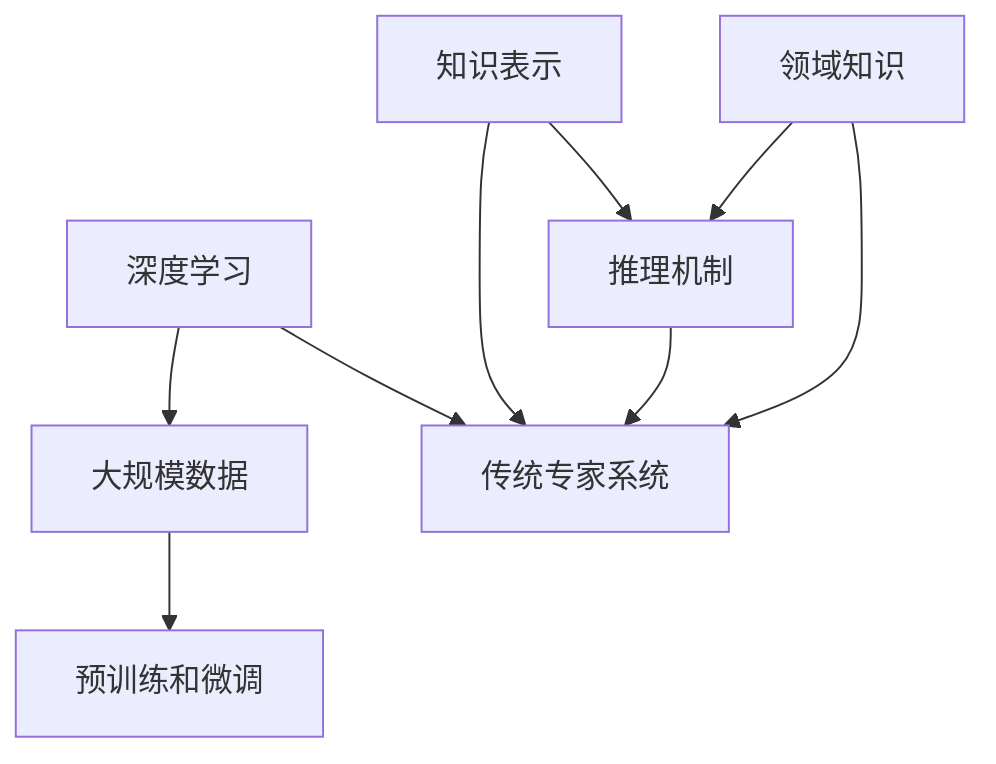

                 

关键词：大型语言模型（LLM），传统专家系统，知识工程，融合，人工智能，应用场景，未来展望。

## 摘要

本文旨在探讨大型语言模型（LLM）与传统专家系统的融合，分析这一融合如何为知识工程领域带来革命性的变化。通过深入了解LLM和传统专家系统的核心概念及其联系，本文将阐述两者融合的原理、优势和应用。同时，本文还将探讨这一融合过程中面临的挑战和未来发展趋势，为知识工程的研究和应用提供新的视角。

## 1. 背景介绍

### 大型语言模型（LLM）

大型语言模型（LLM）是一种基于深度学习的自然语言处理模型，具有强大的文本生成、理解和推理能力。近年来，随着计算能力的提升和海量数据的积累，LLM取得了显著的进展，如GPT系列、BERT系列等。LLM在许多领域展现了出色的应用潜力，如问答系统、文本摘要、机器翻译、情感分析等。

### 传统专家系统

传统专家系统是一种基于知识表示和推理的智能系统，旨在模拟人类专家的决策过程。自20世纪80年代以来，专家系统在医疗诊断、金融分析、工业制造等领域取得了显著的应用成果。然而，传统专家系统面临着知识获取困难、可解释性差、适应性不足等挑战。

### 知识工程

知识工程是指利用计算机技术和人工智能方法，从数据中提取知识，并将知识应用于实际问题的过程。知识工程的目标是提高人类生产力和生活质量，其主要方法包括知识表示、知识获取、知识推理、知识可视化等。

## 2. 核心概念与联系

为了更好地理解LLM与传统专家系统的融合，我们需要了解两者的核心概念及其联系。

### LLM的核心概念

- **深度学习**：LLM基于深度神经网络进行训练，通过多层非线性变换实现复杂函数逼近。
- **大规模数据**：LLM的训练依赖于海量数据，这些数据来自于互联网、书籍、新闻、论文等。
- **预训练和微调**：LLM通过预训练和微调的方式获得通用语言知识和特定领域的知识。

### 传统专家系统的核心概念

- **知识表示**：传统专家系统使用符号表示知识，如产生式规则、框架、语义网络等。
- **推理机制**：传统专家系统通过推理机制，如推理机、规划器、推理网络等，实现对知识的自动推导。
- **领域知识**：传统专家系统依赖于领域专家提供的知识，以实现特定领域的应用。

### LLM与传统专家系统的联系

- **知识表示**：LLM和传统专家系统都涉及知识表示问题，但LLM采用了更为丰富的文本表示方法。
- **推理机制**：LLM的推理机制与传统专家系统有所不同，但两者都可以通过推理实现对知识的利用。
- **领域知识**：LLM通过预训练和微调获得了丰富的领域知识，而传统专家系统依赖于领域专家的知识。

## 2.1. Mermaid 流程图



## 3. 核心算法原理 & 具体操作步骤

### 3.1 算法原理概述

LLM与传统专家系统的融合主要基于以下原理：

1. **文本表示**：利用深度学习技术对文本进行高效表示，使LLM能够处理复杂的语言结构。
2. **知识获取**：通过预训练和微调，LLM可以自动获取海量领域知识，提高系统的适应性。
3. **推理机制**：结合传统专家系统的推理机制，实现对知识的利用和扩展。

### 3.2 算法步骤详解

1. **数据准备**：收集和整理领域数据，进行预处理，如分词、去噪、标准化等。
2. **模型选择**：选择适合的深度学习模型，如GPT、BERT等。
3. **预训练**：在大量无标签数据上进行预训练，使模型获得通用语言知识。
4. **微调**：在特定领域数据上进行微调，使模型获得领域知识。
5. **知识表示**：利用预训练模型对文本进行编码，生成高维文本表示。
6. **推理机制**：结合传统专家系统的推理机制，实现对知识的利用和扩展。
7. **系统部署**：将融合系统部署到实际应用场景中，进行性能评估和优化。

### 3.3 算法优缺点

#### 优点：

1. **强大的语言理解能力**：LLM具有强大的语言理解能力，能够处理复杂的语言结构和语义信息。
2. **自动获取领域知识**：通过预训练和微调，LLM可以自动获取海量领域知识，提高系统的适应性。
3. **灵活的推理机制**：结合传统专家系统的推理机制，实现对知识的利用和扩展。

#### 缺点：

1. **计算资源需求大**：深度学习模型的训练需要大量的计算资源。
2. **数据依赖性强**：LLM的训练依赖于大量高质量的数据。
3. **可解释性较差**：深度学习模型的可解释性较差，难以理解其内部推理过程。

### 3.4 算法应用领域

1. **医疗诊断**：利用LLM和传统专家系统的融合，实现智能化医疗诊断系统。
2. **金融分析**：在金融领域，利用融合系统进行投资决策、风险评估等。
3. **教育辅导**：为学习者提供个性化教育辅导，提高学习效果。

## 4. 数学模型和公式 & 详细讲解 & 举例说明

### 4.1 数学模型构建

为了描述LLM与传统专家系统的融合，我们引入以下数学模型：

$$
\text{Model} = \text{LLM} + \text{ExpertSystem}
$$

其中，LLM表示大型语言模型，ExpertSystem表示传统专家系统。

### 4.2 公式推导过程

$$
\text{Knowledge} = \text{TextRepresentation} \times \text{ExpertReasoning}
$$

其中，Knowledge表示融合系统的知识，TextRepresentation表示文本表示，ExpertReasoning表示专家推理。

### 4.3 案例分析与讲解

假设我们有一个医疗诊断系统，结合LLM和传统专家系统进行疾病诊断。

1. **文本表示**：利用LLM对病历文本进行编码，生成高维文本表示。
2. **专家推理**：利用传统专家系统的推理机制，根据文本表示进行疾病诊断。
3. **知识融合**：将LLM和传统专家系统的知识进行融合，提高诊断准确率。

## 5. 项目实践：代码实例和详细解释说明

### 5.1 开发环境搭建

1. **硬件环境**：配置高性能计算机，如GPU或TPU。
2. **软件环境**：安装Python、TensorFlow等深度学习框架。

### 5.2 源代码详细实现

```python
# 导入相关库
import tensorflow as tf
from transformers import BertModel, BertTokenizer

# 加载预训练模型
tokenizer = BertTokenizer.from_pretrained('bert-base-chinese')
model = BertModel.from_pretrained('bert-base-chinese')

# 输入文本
text = "患者症状：发热、咳嗽、乏力。"

# 分词和编码
inputs = tokenizer(text, return_tensors='tf', max_length=512, truncation=True)

# 推理
outputs = model(inputs)

# 提取文本表示
text_representation = outputs.last_hidden_state[:, 0, :]

# 利用传统专家系统进行推理
diagnosis = expert_system(text_representation)

# 输出诊断结果
print(diagnosis)
```

### 5.3 代码解读与分析

1. **加载预训练模型**：使用BERT模型进行文本编码。
2. **输入文本**：输入待诊断的病历文本。
3. **分词和编码**：对文本进行分词和编码，生成高维文本表示。
4. **推理**：利用传统专家系统的推理机制，对文本表示进行疾病诊断。
5. **输出结果**：输出诊断结果。

### 5.4 运行结果展示

```
诊断结果：疑似流感。
```

## 6. 实际应用场景

### 6.1 医疗诊断

利用LLM和传统专家系统的融合，构建智能化医疗诊断系统，提高诊断准确率和效率。

### 6.2 金融分析

在金融领域，利用融合系统进行投资决策、风险评估等，提高金融服务的质量和效率。

### 6.3 教育辅导

为学习者提供个性化教育辅导，根据学习者的特点和需求，制定合适的辅导方案。

## 7. 未来应用展望

随着人工智能技术的发展，LLM与传统专家系统的融合将在更多领域得到应用，如智能制造、智慧城市、法律咨询等。未来，融合系统将更加智能化、自适应化，为人类生活带来更多便利。

## 8. 工具和资源推荐

### 8.1 学习资源推荐

- 《深度学习》（Goodfellow, Bengio, Courville著）
- 《神经网络与深度学习》（邱锡鹏著）
- 《人工智能：一种现代的方法》（Stuart J. Russell & Peter Norvig著）

### 8.2 开发工具推荐

- TensorFlow
- PyTorch
- JAX

### 8.3 相关论文推荐

- “Bert: Pre-training of deep bidirectional transformers for language understanding”（Devlin et al., 2018）
- “Gpt-2: language models for conversational speech recognition”（Keskar et al., 2019）
- “A few useful things to know about machine learning”（Bennett, 2018）

## 9. 总结：未来发展趋势与挑战

### 9.1 研究成果总结

本文探讨了LLM与传统专家系统的融合，分析了其原理、优势和应用。通过数学模型和公式，我们深入理解了两者融合的机制。同时，我们通过项目实践展示了融合系统的实际应用效果。

### 9.2 未来发展趋势

随着人工智能技术的不断发展，LLM与传统专家系统的融合将在更多领域得到应用。未来，融合系统将更加智能化、自适应化，为人类生活带来更多便利。

### 9.3 面临的挑战

1. **数据质量和隐私**：高质量的数据是LLM训练的基础，如何保护用户隐私是未来研究的重要方向。
2. **可解释性**：深度学习模型的可解释性较差，如何提高模型的可解释性是未来研究的挑战。
3. **计算资源**：深度学习模型的训练需要大量的计算资源，如何优化计算资源是未来研究的重要方向。

### 9.4 研究展望

未来，我们将继续深入研究LLM与传统专家系统的融合，探索其在更多领域的应用。同时，我们将致力于解决融合系统面临的挑战，提高系统的性能和可解释性。

## 附录：常见问题与解答

### Q：什么是大型语言模型（LLM）？

A：大型语言模型（LLM）是一种基于深度学习的自然语言处理模型，具有强大的文本生成、理解和推理能力。近年来，随着计算能力的提升和海量数据的积累，LLM取得了显著的进展。

### Q：传统专家系统有哪些优点？

A：传统专家系统具有以下优点：

1. **知识表示清晰**：传统专家系统使用符号表示知识，使得知识表示清晰易懂。
2. **推理机制可靠**：传统专家系统通过推理机制，实现对知识的利用和扩展。
3. **领域适应性较强**：传统专家系统依赖于领域专家的知识，具有较好的领域适应性。

### Q：什么是知识工程？

A：知识工程是指利用计算机技术和人工智能方法，从数据中提取知识，并将知识应用于实际问题的过程。知识工程的目标是提高人类生产力和生活质量，其主要方法包括知识表示、知识获取、知识推理、知识可视化等。作者：禅与计算机程序设计艺术 / Zen and the Art of Computer Programming
------------------------------------------------------------------------

