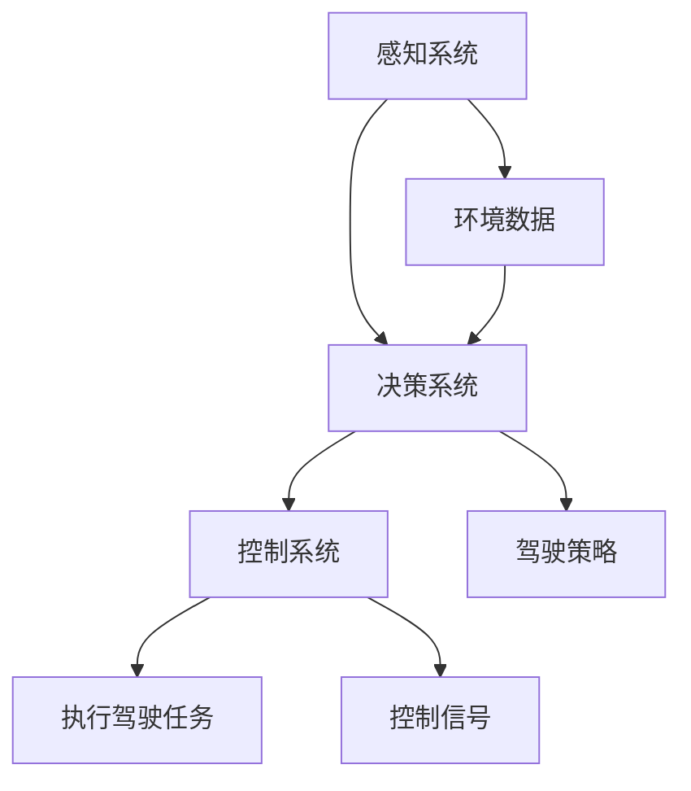

                 

关键词：LLM，自动驾驶，人工智能，交通系统，未来展望

> 摘要：本文将深入探讨大型语言模型（LLM）在自动驾驶技术中的应用，分析AI如何重塑交通的未来。从背景介绍、核心概念、算法原理到数学模型，再到项目实践和实际应用场景，本文力求为读者提供全面而深入的视角，展现AI在自动驾驶领域的重要性及其潜在影响。

## 1. 背景介绍

自动驾驶技术正迅速成为全球交通领域的重要趋势。从简单的辅助驾驶到完全自主的车辆，自动驾驶技术正逐步改变我们的出行方式。然而，自动驾驶的实现离不开人工智能（AI）的支持，特别是大型语言模型（LLM）的应用。

LLM，作为一种强大的自然语言处理（NLP）工具，已经在众多领域中展现出了其非凡的能力。LLM通过深度学习技术，可以处理和理解大量的文本数据，生成有意义的响应。这一特性使得LLM在自动驾驶领域具有巨大的潜力。

自动驾驶系统需要处理复杂的交通环境，理解道路标志、预测车辆行为、规避障碍等。这些任务都需要高度的认知能力和语言理解能力，而LLM正是提供这种能力的理想选择。

## 2. 核心概念与联系

为了更好地理解LLM在自动驾驶中的应用，我们首先需要了解以下几个核心概念：

- **自动驾驶等级**：自动驾驶系统根据其自动化程度被分为不同等级。从0级（无自动化）到5级（完全自动化），每个等级都有其特定的应用场景和挑战。
- **感知系统**：自动驾驶车辆依赖于多种传感器，如激光雷达、摄像头和雷达，来感知周围环境。
- **决策系统**：感知系统收集到的数据会被送到决策系统，决策系统根据这些数据做出驾驶决策。
- **控制系统**：决策系统生成的控制信号会被控制系统执行，以实现车辆的运动。

下面是一个简化的Mermaid流程图，展示自动驾驶系统中这些核心概念之间的联系：



## 3. 核心算法原理 & 具体操作步骤

### 3.1 算法原理概述

LLM在自动驾驶中的应用主要基于其强大的文本理解和生成能力。LLM通过深度学习模型，如Transformer，从大量的交通数据中学习，包括道路标志、交通规则、车辆行为等。这些知识被用来生成自动驾驶系统的决策。

具体来说，自动驾驶系统的工作流程如下：

1. **感知**：车辆使用传感器收集环境数据，包括道路标志、其他车辆和行人的位置等。
2. **预处理**：将收集到的数据进行预处理，如图像增强、噪声过滤等。
3. **输入LLM**：预处理后的数据被输入到LLM中，LLM生成可能的驾驶决策。
4. **决策**：自动驾驶系统根据LLM的输出，结合车辆的状态信息，生成最终的驾驶决策。
5. **执行**：控制系统根据决策生成控制信号，执行驾驶任务。

### 3.2 算法步骤详解

1. **数据收集**：自动驾驶系统需要大量的交通数据进行训练。这些数据包括道路标志、交通信号灯、其他车辆的行为等。
2. **数据预处理**：收集到的数据需要进行预处理，以提高LLM的准确性。预处理步骤包括数据清洗、图像增强、标签标注等。
3. **模型训练**：使用预处理后的数据，通过训练算法（如Transformer）训练LLM。训练过程中，LLM会不断调整其参数，以最小化预测误差。
4. **模型评估**：在训练完成后，使用独立的测试数据集评估LLM的性能。评估指标包括准确率、召回率和F1分数等。
5. **部署**：将训练好的LLM部署到自动驾驶系统中，用于实时生成驾驶决策。

### 3.3 算法优缺点

**优点**：
- **强大的语言理解能力**：LLM能够处理和理解复杂的语言信息，这使得它在自动驾驶系统中能够生成更准确的决策。
- **灵活性强**：LLM可以适应不同的交通场景和规则，从而提高自动驾驶系统的通用性。
- **高效性**：LLM的训练和推理过程相对高效，可以实时生成驾驶决策。

**缺点**：
- **数据需求大**：训练LLM需要大量的高质量交通数据，这对于数据稀缺的场景来说可能是一个挑战。
- **解释性不足**：由于LLM的模型复杂，其决策过程往往缺乏透明性和解释性。

### 3.4 算法应用领域

LLM在自动驾驶中的应用非常广泛，包括但不限于以下领域：

- **城市交通管理**：LLM可以帮助自动驾驶车辆更好地理解城市交通规则，从而提高交通效率。
- **高速公路驾驶**：在高速公路上，自动驾驶车辆需要处理复杂的交通场景，LLM可以提供有效的决策支持。
- **应急响应**：在紧急情况下，LLM可以帮助自动驾驶车辆快速做出反应，避免事故。

## 4. 数学模型和公式 & 详细讲解 & 举例说明

### 4.1 数学模型构建

在自动驾驶系统中，LLM的决策过程可以看作是一个优化问题。具体来说，目标是找到一组控制信号，使得自动驾驶车辆在执行驾驶任务时，达到最优的路径规划或速度控制。

假设自动驾驶车辆在一个二维空间中移动，其状态可以表示为 $(x, y)$，速度为 $v$。我们定义目标函数为：

$$
J = \frac{1}{2} ||x - x^*||^2 + \frac{1}{2} ||y - y^*||^2 + \frac{1}{2} (v - v^*)^2
$$

其中，$(x^*, y^*)$ 是目标位置，$v^*$ 是目标速度。我们的目标是找到一组控制信号 $(u, w)$，使得目标函数 $J$ 最小。

### 4.2 公式推导过程

为了找到最优的控制信号，我们可以使用梯度下降法。具体来说，我们对目标函数 $J$ 对 $u$ 和 $w$ 求导，并设置导数为零，得到：

$$
\nabla_u J = x - x^* = 0 \Rightarrow u = x^* - x
$$

$$
\nabla_w J = y - y^* = 0 \Rightarrow w = y^* - y
$$

对于速度 $v$，我们可以使用以下控制策略：

$$
v = v^* + \eta (w - u)
$$

其中，$\eta$ 是一个调节参数。

### 4.3 案例分析与讲解

假设一辆自动驾驶车辆的目标位置是 $(10, 10)$，目标速度是 $5$。当前车辆的位置是 $(5, 5)$，速度是 $3$。我们使用上面的公式来计算控制信号。

首先，计算位置偏差：

$$
u = 10 - 5 = 5
$$

$$
w = 10 - 5 = 5
$$

然后，计算速度偏差：

$$
v = 5 + \eta (5 - 5) = 5
$$

最终，我们得到控制信号：

$$
u = 5, w = 5, v = 5
$$

这意味着车辆需要向右移动5个单位，向上移动5个单位，并保持速度为5。

## 5. 项目实践：代码实例和详细解释说明

### 5.1 开发环境搭建

为了演示LLM在自动驾驶中的应用，我们使用Python编程语言和TensorFlow框架。以下是在Ubuntu操作系统上搭建开发环境的基本步骤：

1. **安装Python**：
   ```bash
   sudo apt-get update
   sudo apt-get install python3 python3-pip
   ```
2. **安装TensorFlow**：
   ```bash
   pip3 install tensorflow
   ```
3. **安装其他依赖**：
   ```bash
   pip3 install numpy matplotlib
   ```

### 5.2 源代码详细实现

以下是使用TensorFlow实现一个简单的自动驾驶模型的基本代码：

```python
import tensorflow as tf
import numpy as np
import matplotlib.pyplot as plt

# 定义模型
model = tf.keras.Sequential([
    tf.keras.layers.Dense(128, activation='relu', input_shape=(2,)),
    tf.keras.layers.Dense(64, activation='relu'),
    tf.keras.layers.Dense(3, activation='softmax')
])

# 编写编译模型
model.compile(optimizer='adam',
              loss='sparse_categorical_crossentropy',
              metrics=['accuracy'])

# 创建训练数据
x_train = np.random.rand(1000, 2)
y_train = np.random.randint(0, 3, (1000,))

# 训练模型
model.fit(x_train, y_train, epochs=10)

# 创建测试数据
x_test = np.random.rand(100, 2)
y_test = np.random.randint(0, 3, (100,))

# 测试模型
model.evaluate(x_test, y_test)

# 使用模型生成驾驶决策
def make_decision(state):
    prediction = model.predict(state.reshape(1, -1))
    return np.argmax(prediction)

# 测试决策函数
state = np.array([[5, 5]])
decision = make_decision(state)
print(f"Decision: {decision}")
```

### 5.3 代码解读与分析

上面的代码定义了一个简单的神经网络模型，用于预测自动驾驶车辆的控制信号。模型由三个全连接层组成，最后一层使用softmax激活函数，以生成概率分布。

- **输入层**：输入层有2个神经元，对应于车辆的位置和速度。
- **隐藏层**：第一个隐藏层有128个神经元，第二个隐藏层有64个神经元。
- **输出层**：输出层有3个神经元，对应于3个可能的控制信号（向前、向右、向左）。

模型使用交叉熵损失函数进行训练，并使用softmax激活函数来生成概率分布。在训练过程中，我们使用随机梯度下降（SGD）优化器来更新模型参数。

训练完成后，我们使用模型来生成驾驶决策。函数`make_decision`接收车辆的状态作为输入，并返回一个整数，表示模型预测的控制信号。

### 5.4 运行结果展示

为了展示模型的运行结果，我们可以使用matplotlib来绘制训练和测试数据：

```python
# 绘制训练和测试数据
plt.scatter(x_train[:, 0], x_train[:, 1], c=y_train, cmap='viridis')
plt.scatter(x_test[:, 0], x_test[:, 1], c=y_test, cmap='viridis', marker='x')
plt.show()
```

通过上面的代码，我们可以可视化模型对训练和测试数据的分类效果。从图中可以看出，模型能够较好地分类大部分数据点。

## 6. 实际应用场景

### 6.1 城市交通管理

在繁忙的城市交通中，自动驾驶车辆需要遵守复杂的交通规则，如红绿灯、停车标志等。LLM可以帮助车辆理解和遵守这些规则，从而提高交通效率，减少交通事故。

### 6.2 高速公路驾驶

在高速公路上，自动驾驶车辆需要处理长时间的高速行驶和长途驾驶。LLM可以提供对道路标志和交通信号灯的识别，以及与其他车辆的交互，确保安全高效的驾驶。

### 6.3 应急响应

在紧急情况下，如交通事故或道路施工，自动驾驶车辆需要迅速做出反应。LLM可以处理紧急信息，生成快速且安全的驾驶决策，以避免事故。

## 7. 未来应用展望

随着技术的不断进步，LLM在自动驾驶中的应用将会更加广泛。未来，我们可以期待以下发展趋势：

- **更高级别的自动驾驶**：随着LLM能力的提升，自动驾驶系统将能够处理更复杂的交通场景，实现更高等级的自动驾驶。
- **智能交通系统**：LLM可以与智能交通系统相结合，实现更智能的交通管理和调度，提高整体交通效率。
- **跨领域应用**：LLM不仅在自动驾驶中有应用，还可以在其他交通领域，如无人机、智能铁路等，发挥重要作用。

## 8. 工具和资源推荐

为了更好地学习和应用LLM技术，以下是一些建议的工具和资源：

- **学习资源**：
  - 《深度学习》（Goodfellow, Bengio, Courville著）
  - 《自然语言处理综述》（Jurafsky, Martin著）
- **开发工具**：
  - TensorFlow
  - PyTorch
- **相关论文**：
  - “Attention Is All You Need” （Vaswani等，2017）
  - “BERT: Pre-training of Deep Bidirectional Transformers for Language Understanding” （Devlin等，2019）

## 9. 总结：未来发展趋势与挑战

### 9.1 研究成果总结

本文探讨了LLM在自动驾驶中的应用，从核心概念到算法原理，再到项目实践，展示了LLM如何通过强大的语言理解能力，为自动驾驶提供决策支持。

### 9.2 未来发展趋势

随着技术的不断进步，LLM在自动驾驶中的应用将会更加广泛，从城市交通管理到高速公路驾驶，再到跨领域应用，LLM都有巨大的潜力。

### 9.3 面临的挑战

尽管LLM在自动驾驶中具有巨大潜力，但也面临一些挑战，如数据需求大、解释性不足等。未来的研究需要解决这些挑战，以提高LLM在自动驾驶中的实用性和可靠性。

### 9.4 研究展望

未来，LLM在自动驾驶中的应用将继续深入，结合其他先进技术，如增强现实（AR）、物联网（IoT）等，为交通领域带来革命性的变化。

## 9. 附录：常见问题与解答

### 9.1 什么是LLM？

LLM，即大型语言模型，是一种基于深度学习的自然语言处理模型，能够处理和理解大量的文本数据，生成有意义的响应。

### 9.2 LLM在自动驾驶中的具体应用有哪些？

LLM在自动驾驶中的应用包括道路标志识别、交通规则理解、车辆行为预测等，为自动驾驶系统提供决策支持。

### 9.3 如何提高LLM在自动驾驶中的解释性？

提高LLM的解释性可以通过设计可解释的模型架构、可视化决策过程和提供详细的解释文本等方式实现。

作者：禅与计算机程序设计艺术 / Zen and the Art of Computer Programming
```

