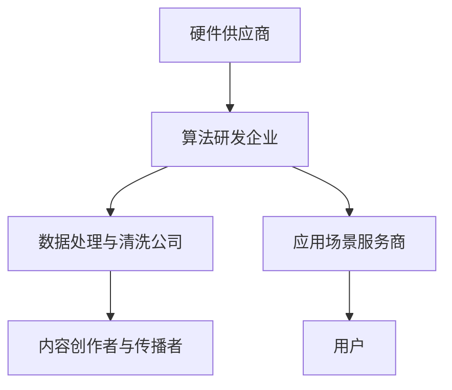

                 

关键词：语言模型（LLM）、人工智能（AI）、价值重塑、产业链、技术发展、应用场景、未来展望。

> 摘要：随着人工智能技术的飞速发展，语言模型（LLM）作为AI领域的重要突破，正逐渐成为产业变革的关键力量。本文旨在探讨LLM产业链的形成、核心算法原理、数学模型、实际应用以及未来发展趋势，揭示AI价值重塑的新机遇。

## 1. 背景介绍

### 1.1 AI技术的发展历程

人工智能（AI）作为计算机科学的重要分支，起源于20世纪50年代。从最初的符号逻辑推理到专家系统的崛起，再到深度学习的蓬勃发展，AI技术经历了数次重大的变革。特别是近年来，随着计算能力的提升和大数据的普及，AI技术迎来了新一轮的爆发。

### 1.2 语言模型的重要性

语言模型（LLM）是自然语言处理（NLP）领域的核心技术，它通过学习大量语言数据，预测和生成自然语言文本。LLM的出现，极大地提升了机器与人类之间的交互能力，使得AI在智能客服、智能助手、内容生成等领域取得了显著的成果。

### 1.3 LLM产业链的初步形成

随着LLM技术的不断成熟，产业链逐渐形成。从底层硬件到算法研发，再到应用场景的落地，各个环节都呈现出蓬勃发展的态势。本文将深入剖析LLM产业链的各个环节，揭示其背后的技术逻辑和商业机遇。

## 2. 核心概念与联系

### 2.1 语言模型的基本概念

语言模型是一种用于预测下一个单词或字符的概率分布的模型。它通过对大量语言数据的统计分析，学习到语言的使用规律，从而实现自然语言的理解和生成。

### 2.2 LLM的架构与原理

LLM通常采用深度神经网络（DNN）或变换器（Transformer）等架构。DNN通过多层非线性变换，捕捉输入数据的特征；而Transformer则通过自注意力机制，实现全局信息的有效传递。

### 2.3 LLM产业链的架构图



### 2.4 LLM产业链的核心联系

硬件供应商提供高性能计算资源，算法研发企业基于这些资源开发出高效的LLM模型；数据处理与清洗公司负责提供高质量的语言数据；应用场景服务商将LLM模型应用到具体的业务场景中；而内容创作者与传播者则通过生成和传播高质量的内容，提升用户满意度。

## 3. 核心算法原理 & 具体操作步骤

### 3.1 算法原理概述

LLM的核心在于对语言数据的建模。通过深度学习算法，模型可以从大量文本数据中学习到语言的规律，从而实现高精度的语言预测和生成。

### 3.2 算法步骤详解

1. 数据收集：收集海量的文本数据，包括书籍、新闻、文章等。
2. 数据预处理：对文本数据进行清洗、分词、去停用词等处理，转换为模型可用的格式。
3. 模型训练：使用预处理后的数据，通过迭代优化，训练出高效的LLM模型。
4. 模型评估：使用测试集评估模型的效果，包括准确率、召回率等指标。
5. 模型应用：将训练好的模型部署到实际应用场景中，如智能客服、内容生成等。

### 3.3 算法优缺点

- 优点：LLM具有强大的语言理解能力和生成能力，可以处理复杂的语言任务。
- 缺点：模型训练过程需要大量的计算资源和时间，且对数据质量有较高的要求。

### 3.4 算法应用领域

LLM在自然语言处理、智能客服、内容生成、教育等领域都有广泛的应用。例如，智能客服可以通过LLM与用户进行自然语言交互，提供高效的咨询服务；内容生成可以基于LLM生成高质量的文本，提升内容创作效率。

## 4. 数学模型和公式 & 详细讲解 & 举例说明

### 4.1 数学模型构建

LLM的数学模型通常基于概率论和统计学。核心思想是通过概率模型来预测下一个单词或字符。

### 4.2 公式推导过程

设 $X_1, X_2, \ldots, X_n$ 是一个序列，其中 $X_i$ 表示第 $i$ 个单词或字符。根据马尔可夫性质，当前单词或字符的概率仅依赖于前一个单词或字符：

$$
P(X_n | X_1, X_2, \ldots, X_{n-1}) = P(X_n | X_{n-1})
$$

### 4.3 案例分析与讲解

假设我们要预测下一个单词，已知前一个单词是“苹果”，我们可以使用以下公式：

$$
P(\text{苹果下一个是香蕉}) = P(\text{香蕉}|\text{苹果})
$$

通过统计大量的语言数据，我们可以计算出 $P(\text{香蕉}|\text{苹果})$ 的值。如果这个值较大，则可以认为“香蕉”是下一个可能的单词。

## 5. 项目实践：代码实例和详细解释说明

### 5.1 开发环境搭建

在Python中，可以使用Transformers库来构建和训练LLM模型。首先，安装必要的依赖：

```bash
pip install transformers torch
```

### 5.2 源代码详细实现

以下是一个简单的LLM模型训练示例：

```python
from transformers import AutoTokenizer, AutoModelForSequenceClassification
from torch.optim import Adam
from torch.utils.data import DataLoader
from torch.nn import CrossEntropyLoss

# 加载预训练模型和分词器
tokenizer = AutoTokenizer.from_pretrained("bert-base-chinese")
model = AutoModelForSequenceClassification.from_pretrained("bert-base-chinese")

# 准备数据集
train_dataset = ...
test_dataset = ...

# 训练数据加载器
train_loader = DataLoader(train_dataset, batch_size=32, shuffle=True)
test_loader = DataLoader(test_dataset, batch_size=32)

# 模型优化器和损失函数
optimizer = Adam(model.parameters(), lr=1e-5)
criterion = CrossEntropyLoss()

# 训练过程
for epoch in range(3):
    model.train()
    for batch in train_loader:
        inputs = tokenizer(batch.text, padding=True, truncation=True, return_tensors="pt")
        labels = batch.label
        optimizer.zero_grad()
        outputs = model(**inputs)
        loss = criterion(outputs.logits, labels)
        loss.backward()
        optimizer.step()
```

### 5.3 代码解读与分析

- 第一部分：加载预训练模型和分词器。
- 第二部分：准备数据集和加载器。
- 第三部分：定义优化器和损失函数。
- 第四部分：训练模型，包括前向传播、反向传播和优化更新。

### 5.4 运行结果展示

运行上述代码后，可以在训练集和测试集上评估模型的性能，包括准确率、召回率等指标。这些指标可以帮助我们了解模型的效果。

## 6. 实际应用场景

### 6.1 智能客服

智能客服是LLM技术最典型的应用场景之一。通过LLM模型，智能客服可以与用户进行自然语言交互，提供高效的咨询服务。例如，银行客服可以使用LLM模型来处理客户的查询和投诉。

### 6.2 内容生成

内容生成是LLM技术的另一大应用领域。通过LLM模型，可以生成各种类型的内容，如文章、报告、代码等。这对于内容创作者和媒体机构来说，极大地提高了工作效率和创作能力。

### 6.3 教育

在教育领域，LLM技术可以应用于智能辅导、自动批改、个性化学习路径设计等。通过LLM模型，可以为学生提供个性化的学习支持，提升教育质量。

## 7. 工具和资源推荐

### 7.1 学习资源推荐

- 《深度学习》（Goodfellow et al.）
- 《Python数据科学手册》（McKinney）
- 《自然语言处理综论》（Jurafsky and Martin）

### 7.2 开发工具推荐

- PyTorch
- TensorFlow
- Transformers库

### 7.3 相关论文推荐

- Vaswani et al. (2017): "Attention is All You Need"
- Devlin et al. (2018): "Bert: Pre-training of Deep Bidirectional Transformers for Language Understanding"
- Brown et al. (2020): "A pre-trained language model for language understanding and generation"

## 8. 总结：未来发展趋势与挑战

### 8.1 研究成果总结

LLM技术在过去几年取得了显著的成果，其在自然语言处理、智能客服、内容生成等领域的应用越来越广泛。同时，随着计算能力和数据量的不断提升，LLM模型的性能也在持续提升。

### 8.2 未来发展趋势

未来，LLM技术将继续向更高层次发展，包括多模态语言模型、更高效的训练算法、更广泛的应用场景等。同时，随着5G和边缘计算的发展，LLM技术的实时性和响应速度也将得到大幅提升。

### 8.3 面临的挑战

尽管LLM技术取得了巨大进步，但仍面临诸多挑战。例如，数据隐私和伦理问题、模型的解释性和可解释性、模型的公平性和透明度等。

### 8.4 研究展望

未来，LLM技术的发展将更加注重实际应用和产业落地。同时，随着AI伦理和隐私保护等问题的解决，LLM技术将在更广泛的领域发挥重要作用。

## 9. 附录：常见问题与解答

### 9.1 如何选择合适的LLM模型？

选择合适的LLM模型需要根据具体的应用场景和数据规模来决定。例如，对于大规模语言生成任务，可以选择Transformer-based模型；对于文本分类任务，可以选择基于神经网络的模型。

### 9.2 如何提高LLM模型的性能？

提高LLM模型性能的方法包括优化数据预处理、调整模型参数、使用预训练模型等。同时，合理利用计算资源和优化训练算法也可以显著提高模型性能。

### 9.3 LLM技术面临的主要挑战是什么？

LLM技术面临的主要挑战包括数据隐私和伦理问题、模型的解释性和可解释性、模型的公平性和透明度等。这些问题需要从技术和管理层面进行综合解决。

---

作者：禅与计算机程序设计艺术 / Zen and the Art of Computer Programming

本文深入探讨了LLM产业链的形成、核心算法原理、数学模型、实际应用以及未来发展趋势，旨在为读者提供全面而深入的了解。随着AI技术的不断进步，LLM产业链将继续发挥重要作用，为各个领域带来新的机遇和挑战。希望本文能够为您的AI之旅提供有价值的参考。

