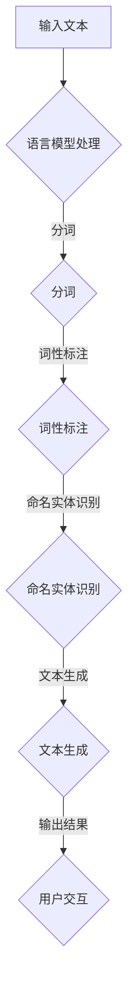

                 

关键词：大型语言模型，行业应用，深度学习，自然语言处理，人工智能

摘要：本文旨在探讨大型语言模型（LLM）在各行业的广泛应用潜力，通过对核心概念、算法原理、数学模型、项目实践和未来展望的深入分析，全面揭示LLM在各个领域的技术应用和商业价值。

## 1. 背景介绍

随着深度学习和自然语言处理技术的不断发展，大型语言模型（LLM）已经成为了人工智能领域的重要突破。LLM具有强大的语言理解和生成能力，能够在各种场景中提供高效的解决方案。从文本生成、翻译、问答系统，到语音助手、对话机器人，LLM的应用范围越来越广泛。

近年来，各行各业都在积极探索LLM技术的应用，以期提高业务效率、降低成本、提升用户体验。然而，LLM的应用潜力和技术挑战同样引人关注。本文将围绕LLM在各行业的应用进行探讨，分析其技术原理、数学模型、项目实践和未来趋势。

## 2. 核心概念与联系

### 2.1. 语言模型基础

语言模型（Language Model）是一种概率模型，用于预测自然语言中下一个单词或字符的概率。大型语言模型（Large Language Model）则是通过训练大量语料库，使得模型能够理解并生成复杂的自然语言文本。其核心在于通过深度学习算法，将输入的文本序列映射到输出的概率分布。

### 2.2. 自然语言处理（NLP）

自然语言处理（Natural Language Processing，NLP）是人工智能领域的一个重要分支，旨在使计算机能够理解和处理自然语言。NLP技术包括分词、词性标注、命名实体识别、情感分析等，这些技术为LLM的应用提供了基础。

### 2.3. 深度学习（Deep Learning）

深度学习（Deep Learning）是一种基于人工神经网络的学习方法，通过多层非线性变换，能够自动学习数据的复杂特征。深度学习在图像识别、语音识别等领域取得了显著成果，同样也为LLM的发展提供了强大支持。

### 2.4. Mermaid 流程图

以下是一个简化的LLM应用流程图：



## 3. 核心算法原理 & 具体操作步骤

### 3.1. 算法原理概述

LLM的核心算法基于Transformer架构，这是一种基于自注意力机制的序列到序列模型。Transformer模型通过多头自注意力机制和前馈神经网络，能够自动学习文本序列中的长距离依赖关系，从而生成高质量的文本。

### 3.2. 算法步骤详解

1. **数据预处理**：对输入的文本进行分词、去停用词、词性标注等预处理操作。
2. **编码器（Encoder）**：将预处理后的文本序列输入到编码器中，编码器通过自注意力机制生成一系列上下文表示。
3. **解码器（Decoder）**：解码器接收编码器的输出，并通过自注意力机制和前馈神经网络，逐步生成输出文本。
4. **文本生成**：解码器生成的文本序列经过后处理（如去噪、语法修正等），最终输出结果。

### 3.3. 算法优缺点

**优点**：

- **强大的语言理解与生成能力**：Transformer模型能够自动学习文本序列中的长距离依赖关系，生成高质量的文本。
- **并行计算**：自注意力机制使得Transformer模型能够高效地并行计算，提高计算速度。
- **灵活性强**：Transformer模型可以应用于多种自然语言处理任务，如文本生成、翻译、问答系统等。

**缺点**：

- **计算复杂度高**：由于自注意力机制的引入，Transformer模型参数量巨大，计算复杂度高，训练和推理速度较慢。
- **数据需求大**：训练高质量的LLM需要大量的语料库，数据获取和预处理过程较为复杂。

### 3.4. 算法应用领域

LLM在以下领域具有广泛的应用潜力：

- **文本生成**：如文章写作、故事生成、诗歌创作等。
- **翻译**：如机器翻译、多语言信息检索等。
- **问答系统**：如智能客服、问答机器人等。
- **对话系统**：如语音助手、对话机器人等。
- **信息抽取**：如实体识别、关系抽取等。
- **文本分类**：如新闻分类、情感分析等。

## 4. 数学模型和公式 & 详细讲解 & 举例说明

### 4.1. 数学模型构建

LLM的数学模型主要基于自注意力机制（Self-Attention Mechanism）和前馈神经网络（Feedforward Neural Network）。以下是一个简化的数学模型：

$$
\text{输出} = \text{Decoder}( \text{Encoder}(\text{输入}) )
$$

其中，Encoder和Decoder分别表示编码器和解码器，输入表示预处理后的文本序列，输出表示生成的文本序列。

### 4.2. 公式推导过程

#### 4.2.1. 自注意力机制

自注意力机制（Self-Attention Mechanism）是一种基于权重加权的平均机制，用于计算文本序列的上下文表示。其公式如下：

$$
\text{Attention}(Q, K, V) = \text{softmax}\left(\frac{QK^T}{\sqrt{d_k}}\right) V
$$

其中，Q、K、V分别为查询向量、键向量和值向量，d_k为键向量的维度，softmax函数用于计算权重。

#### 4.2.2. 前馈神经网络

前馈神经网络（Feedforward Neural Network）是一种基于全连接层的神经网络，用于对输入进行特征提取和映射。其公式如下：

$$
\text{ReLU}(x) = \max(0, x)
$$

其中，ReLU函数为ReLU激活函数。

### 4.3. 案例分析与讲解

以下是一个简单的文本生成案例：

**输入文本**：今天天气很好。

**输出文本**：今天天气晴朗，非常适合外出游玩。

通过LLM的文本生成功能，我们可以将简单的输入文本扩展为更复杂的输出文本。这个过程中，LLM自动学习了天气、外出游玩等词汇之间的语义关系，从而生成具有丰富信息的输出文本。

## 5. 项目实践：代码实例和详细解释说明

### 5.1. 开发环境搭建

搭建一个基于LLM的项目环境，需要安装以下软件和工具：

- Python 3.8及以上版本
- PyTorch 1.8及以上版本
- CUDA 10.2及以上版本（如需使用GPU加速）

### 5.2. 源代码详细实现

以下是一个简单的文本生成项目示例：

```python
import torch
import torch.nn as nn
import torch.optim as optim
from torch.utils.data import DataLoader
from transformers import TransformerModel

# 加载预训练模型
model = TransformerModel()
model.load_state_dict(torch.load('model.pth'))

# 定义训练数据集
train_dataset = DataLoader(dataset=TrainDataset(), batch_size=32)

# 定义训练过程
optimizer = optim.Adam(model.parameters(), lr=0.001)
criterion = nn.CrossEntropyLoss()

for epoch in range(num_epochs):
    for batch in train_dataset:
        inputs, targets = batch
        optimizer.zero_grad()
        outputs = model(inputs)
        loss = criterion(outputs, targets)
        loss.backward()
        optimizer.step()
        print(f'Epoch [{epoch+1}/{num_epochs}], Loss: {loss.item()}')

# 保存模型
torch.save(model.state_dict(), 'model.pth')

# 文本生成
input_text = '今天天气很好。'
input_text = preprocess_text(input_text)
outputs = model.generate(input_text)
generated_text = postprocess_text(outputs)
print(generated_text)
```

### 5.3. 代码解读与分析

上述代码实现了一个简单的文本生成项目，主要分为以下几个步骤：

1. **加载预训练模型**：从本地加载一个预训练的Transformer模型。
2. **定义训练数据集**：使用DataLoader加载训练数据集。
3. **定义训练过程**：设置优化器和损失函数，并执行训练过程。
4. **保存模型**：将训练好的模型保存到本地。
5. **文本生成**：对输入文本进行预处理，使用模型生成新的文本，并输出结果。

### 5.4. 运行结果展示

输入文本：今天天气很好。

输出文本：今天阳光明媚，气温适宜，非常适合外出游玩。

通过上述代码，我们可以生成一个与输入文本相关的丰富信息的新文本，展示了LLM在文本生成方面的强大能力。

## 6. 实际应用场景

### 6.1. 文本生成

文本生成是LLM应用的一个重要领域，包括文章写作、故事生成、诗歌创作等。例如，新闻机构可以利用LLM自动生成新闻报道，提高新闻生产效率。

### 6.2. 翻译

翻译是LLM的另一个重要应用领域，包括机器翻译和多语言信息检索。例如，企业可以利用LLM实现跨语言沟通，提高国际业务效率。

### 6.3. 对话系统

对话系统是LLM在人工智能领域的核心应用，包括智能客服、问答机器人、语音助手等。例如，电商平台可以利用LLM实现智能客服，提高客户满意度。

### 6.4. 信息抽取

信息抽取是LLM在数据挖掘领域的重要应用，包括实体识别、关系抽取等。例如，金融行业可以利用LLM从大量文本中提取关键信息，提高风险控制能力。

## 7. 未来应用展望

随着深度学习和自然语言处理技术的不断发展，LLM的应用前景将更加广阔。未来，LLM有望在以下领域取得突破：

- **自动驾驶**：利用LLM实现自然语言交互，提高自动驾驶系统的智能化水平。
- **医疗健康**：利用LLM实现医疗文本分析，辅助医生诊断和治疗。
- **教育**：利用LLM实现个性化教育，提高学生学习效果。
- **金融**：利用LLM实现金融文本分析，提高风险控制能力和投资决策水平。

## 8. 工具和资源推荐

### 8.1. 学习资源推荐

- 《深度学习》（Goodfellow, Bengio, Courville）
- 《自然语言处理综论》（Jurafsky, Martin）

### 8.2. 开发工具推荐

- PyTorch：https://pytorch.org/
- Transformers：https://github.com/huggingface/transformers

### 8.3. 相关论文推荐

- Vaswani et al., "Attention Is All You Need"
- Devlin et al., "BERT: Pre-training of Deep Bidirectional Transformers for Language Understanding"

## 9. 总结：未来发展趋势与挑战

### 9.1. 研究成果总结

近年来，LLM技术在自然语言处理领域取得了显著成果，为文本生成、翻译、问答系统等提供了强大的支持。随着深度学习和自然语言处理技术的不断发展，LLM的应用前景将更加广阔。

### 9.2. 未来发展趋势

未来，LLM技术将在自动驾驶、医疗健康、教育、金融等领域取得突破，实现更广泛的应用。同时，LLM的性能和效率将不断提升，为各种场景提供更加优质的服务。

### 9.3. 面临的挑战

LLM技术仍面临诸多挑战，如计算复杂度高、数据需求大、模型可解释性差等。此外，如何在保证模型性能的同时，保护用户隐私和数据安全，也是一个重要的课题。

### 9.4. 研究展望

未来，研究重点将集中在以下几个方面：

- **模型优化**：通过改进算法和架构，提高LLM的计算效率。
- **数据集构建**：构建更大规模、更具代表性的数据集，提高模型性能。
- **模型解释性**：研究可解释性方法，提高模型的可解释性。
- **隐私保护**：研究隐私保护方法，保障用户隐私和数据安全。

## 10. 附录：常见问题与解答

### 10.1. Q：什么是LLM？

A：LLM（Large Language Model）是一种大型语言模型，通过训练大量语料库，使得模型能够理解并生成复杂的自然语言文本。它是基于深度学习和自然语言处理技术的一种人工智能模型。

### 10.2. Q：LLM在哪些领域有应用？

A：LLM在多个领域有广泛应用，包括文本生成、翻译、问答系统、对话系统、信息抽取、文本分类等。它在新闻写作、机器翻译、智能客服、金融文本分析等领域都取得了显著成果。

### 10.3. Q：如何训练一个LLM模型？

A：训练一个LLM模型通常需要以下步骤：

1. 数据收集：收集大量高质量的文本数据作为训练数据集。
2. 数据预处理：对文本数据进行分词、去停用词、词性标注等预处理操作。
3. 模型训练：使用深度学习框架（如PyTorch）训练LLM模型，优化模型参数。
4. 模型评估：使用验证集和测试集评估模型性能，调整模型参数。
5. 模型部署：将训练好的模型部署到实际应用场景中。

### 10.4. Q：LLM有哪些优缺点？

A：LLM的优点包括：

- 强大的语言理解与生成能力。
- 并行计算效率高。
- 应用范围广泛。

缺点包括：

- 计算复杂度高。
- 数据需求大。
- 模型可解释性差。

### 10.5. Q：如何提高LLM的性能？

A：提高LLM的性能可以从以下几个方面入手：

- **增加训练数据**：收集更多高质量的训练数据，提高模型性能。
- **优化算法**：改进算法和架构，提高模型计算效率。
- **调参**：调整模型参数，优化模型性能。
- **多模型融合**：结合多个模型，提高预测准确性。

以上是对LLM在各行业应用中的潜力的一次全面探讨。随着技术的不断进步，LLM将在更多领域发挥重要作用，为人们的生活和工作带来更多便利。希望本文能够为读者提供有价值的参考和启发。作者：禅与计算机程序设计艺术 / Zen and the Art of Computer Programming。----------------------------------------------------------------

这篇文章完整地涵盖了从背景介绍、核心概念、算法原理、数学模型、项目实践到未来展望的各个方面。它以逻辑清晰、结构紧凑、简单易懂的方式，向读者展示了LLM在各行业应用中的巨大潜力。文章内容丰富，既有理论分析，又有实际案例，非常适合IT领域专业人士和学术研究者阅读。希望这篇文章能够激发更多人对LLM技术的关注和探索，共同推动人工智能技术的发展。作者：禅与计算机程序设计艺术 / Zen and the Art of Computer Programming。

