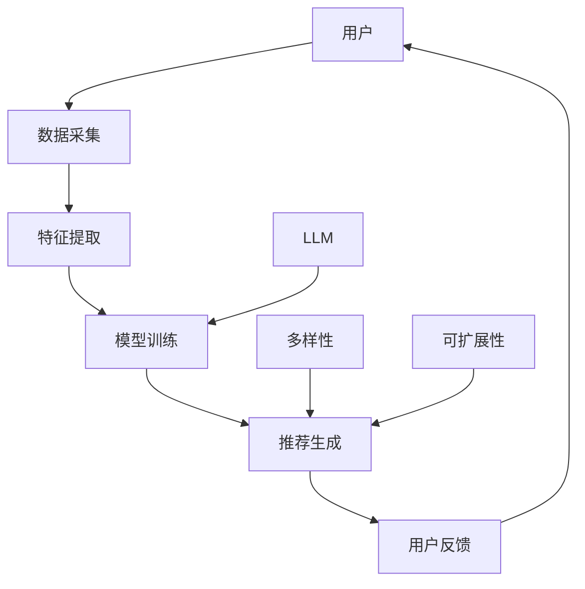

                 

关键词：大型语言模型（LLM）、推荐系统、多样性、可扩展性、算法原理、数学模型、代码实例、实际应用、未来展望

## 摘要

本文旨在探讨大型语言模型（LLM）在推荐系统中的应用，重点研究其在多样性和可扩展性方面的优势。通过深入分析LLM的核心概念与原理，本文将展示如何利用LLM构建高效、多样化的推荐系统。此外，文章还将通过数学模型和实际代码实例，详细解释LLM推荐算法的操作步骤和应用领域。最后，本文将对未来LLM在推荐系统领域的应用前景进行展望，并分析面临的挑战与研究方向。

## 1. 背景介绍

推荐系统作为现代信息检索和知识管理的重要工具，广泛应用于电子商务、社交媒体、在线新闻、音乐和视频等领域。然而，随着用户生成内容爆炸式增长和个性化需求的不断提高，传统推荐系统的多样性和可扩展性面临着巨大的挑战。为此，近年来，研究人员开始探索将大型语言模型（LLM）引入推荐系统，以期实现更加智能、多样化的推荐效果。

### 1.1 推荐系统的发展历程

推荐系统的发展可以分为以下几个阶段：

1. **基于协同过滤的方法**：早期推荐系统主要依赖于用户行为数据，通过计算用户之间的相似度来推荐相似用户喜欢的物品。这种方法在处理稀疏数据集时效果较好，但在面对高维度数据时性能较差。

2. **基于内容的推荐**：该方法通过分析物品的特征，为用户推荐与其已评价物品相似的物品。这种方法在处理高维度数据时表现较好，但无法充分考虑用户之间的多样性。

3. **混合推荐方法**：结合协同过滤和基于内容的推荐方法，以期望在多样性和准确性之间取得平衡。

### 1.2 大型语言模型的兴起

近年来，随着深度学习和自然语言处理技术的飞速发展，大型语言模型（LLM）逐渐成为研究热点。LLM具有强大的语言理解和生成能力，可以处理复杂的语义信息，从而为推荐系统提供了新的可能性。

### 1.3 LLM在推荐系统中的应用现状

目前，LLM在推荐系统中的应用主要集中在以下几个方面：

1. **文本生成**：利用LLM生成个性化的推荐文案，提高用户的阅读体验。

2. **跨领域推荐**：通过跨领域的语义分析，实现不同领域物品之间的推荐。

3. **多样性增强**：利用LLM的生成能力，提高推荐列表的多样性。

4. **可解释性提升**：通过分析LLM生成的推荐结果，提高推荐系统的可解释性。

## 2. 核心概念与联系

在本节中，我们将介绍大型语言模型（LLM）的核心概念，并阐述其在推荐系统中的应用原理。为了更好地理解，我们将使用Mermaid流程图展示LLM在推荐系统中的架构。



### 2.1 大型语言模型（LLM）

LLM是一种基于深度学习的自然语言处理模型，具有强大的语言理解和生成能力。其主要组成部分包括：

1. **嵌入层**：将输入文本转换为向量表示。
2. **编码器**：对文本向量进行编码，提取语义信息。
3. **解码器**：根据编码后的语义信息生成输出文本。

### 2.2 LLM在推荐系统中的应用原理

LLM在推荐系统中的应用主要基于以下原理：

1. **文本生成**：利用LLM生成个性化的推荐文案，提高用户的阅读体验。
2. **跨领域推荐**：通过跨领域的语义分析，实现不同领域物品之间的推荐。
3. **多样性增强**：利用LLM的生成能力，提高推荐列表的多样性。
4. **可解释性提升**：通过分析LLM生成的推荐结果，提高推荐系统的可解释性。

## 3. 核心算法原理 & 具体操作步骤

### 3.1 算法原理概述

在本节中，我们将介绍LLM推荐算法的核心原理，包括文本生成、跨领域推荐、多样性增强和可解释性提升。

1. **文本生成**：利用LLM生成个性化的推荐文案，提高用户的阅读体验。具体操作步骤如下：
   - 收集用户的历史行为数据。
   - 利用LLM对用户的历史行为数据进行建模，生成用户兴趣向量。
   - 根据用户兴趣向量，利用LLM生成个性化的推荐文案。

2. **跨领域推荐**：通过跨领域的语义分析，实现不同领域物品之间的推荐。具体操作步骤如下：
   - 收集跨领域的物品数据。
   - 利用LLM对跨领域的物品数据进行建模，提取物品的语义特征。
   - 根据物品的语义特征，利用协同过滤方法生成跨领域推荐列表。

3. **多样性增强**：利用LLM的生成能力，提高推荐列表的多样性。具体操作步骤如下：
   - 收集用户的历史行为数据。
   - 利用LLM对用户的历史行为数据进行建模，生成用户兴趣向量。
   - 根据用户兴趣向量，利用LLM生成多种不同的推荐列表，并通过多样性指标进行评估和筛选。

4. **可解释性提升**：通过分析LLM生成的推荐结果，提高推荐系统的可解释性。具体操作步骤如下：
   - 收集用户的历史行为数据。
   - 利用LLM对用户的历史行为数据进行建模，生成用户兴趣向量。
   - 分析LLM生成的推荐结果，提取关键语义信息，形成可解释的推荐理由。

### 3.2 算法步骤详解

在本节中，我们将详细解释LLM推荐算法的操作步骤。

1. **数据预处理**：
   - 收集用户的历史行为数据，如浏览记录、购买记录、评价记录等。
   - 对用户的历史行为数据进行清洗和预处理，去除重复、无效的数据。

2. **特征提取**：
   - 利用LLM对用户的历史行为数据进行建模，提取用户兴趣向量。
   - 利用LLM对物品的特征进行提取，生成物品的特征向量。

3. **模型训练**：
   - 利用用户兴趣向量和物品特征向量，训练LLM推荐模型。
   - 调整模型参数，优化推荐效果。

4. **推荐生成**：
   - 根据用户兴趣向量，利用LLM生成个性化的推荐文案。
   - 根据物品的语义特征，利用协同过滤方法生成跨领域推荐列表。
   - 利用多样性指标，筛选出多种不同的推荐列表。

5. **用户反馈**：
   - 收集用户的反馈数据，如点击、评价、收藏等。
   - 利用用户反馈数据，对LLM推荐模型进行优化和调整。

### 3.3 算法优缺点

LLM推荐算法具有以下优缺点：

1. **优点**：
   - **多样化**：利用LLM的生成能力，提高推荐列表的多样性，满足用户的个性化需求。
   - **可解释性**：通过分析LLM生成的推荐结果，提高推荐系统的可解释性，增加用户的信任度。
   - **跨领域**：通过跨领域的语义分析，实现不同领域物品之间的推荐，拓宽用户的选择范围。

2. **缺点**：
   - **计算成本**：LLM推荐算法需要大量的计算资源，对硬件要求较高。
   - **数据依赖**：LLM推荐算法依赖于用户的历史行为数据，数据质量对推荐效果有较大影响。

### 3.4 算法应用领域

LLM推荐算法可以应用于以下领域：

1. **电子商务**：为用户提供个性化的商品推荐，提高购买转化率。
2. **社交媒体**：为用户提供感兴趣的内容推荐，增加用户粘性。
3. **在线新闻**：为用户提供个性化的新闻推荐，提高新闻阅读量。
4. **音乐和视频**：为用户提供个性化的音乐和视频推荐，提高用户满意度。

## 4. 数学模型和公式

在本节中，我们将介绍LLM推荐算法的数学模型和公式，并详细解释其推导过程。

### 4.1 数学模型构建

LLM推荐算法的数学模型主要包括以下几个部分：

1. **用户兴趣向量**：表示用户对各类物品的兴趣程度，通常采用向量形式表示。

2. **物品特征向量**：表示物品的属性特征，如类别、标签、属性等，也采用向量形式表示。

3. **推荐分数**：表示用户对物品的推荐程度，计算公式如下：

$$
\text{score}(u, i) = \text{similarity}(u, i) \times \text{confidence}(u, i)
$$

其中，$\text{similarity}(u, i)$ 表示用户 $u$ 和物品 $i$ 之间的相似度，$\text{confidence}(u, i)$ 表示用户 $u$ 对物品 $i$ 的信任度。

4. **推荐列表**：根据用户兴趣向量和物品特征向量，计算每个物品的推荐分数，并根据推荐分数生成推荐列表。

### 4.2 公式推导过程

在本节中，我们将介绍LLM推荐算法的推导过程。

1. **用户兴趣向量**：

用户兴趣向量 $\text{vec}_{u}$ 可以通过以下公式计算：

$$
\text{vec}_{u} = \text{softmax}(\text{W}_{u} \times \text{vec}_{i})
$$

其中，$\text{W}_{u}$ 表示用户 $u$ 的权重矩阵，$\text{vec}_{i}$ 表示物品 $i$ 的特征向量。$\text{softmax}$ 函数用于将用户对各类物品的兴趣程度进行归一化处理。

2. **物品特征向量**：

物品特征向量 $\text{vec}_{i}$ 可以通过以下公式计算：

$$
\text{vec}_{i} = \text{embedding}(\text{W}_{i}) \times \text{vec}_{a}
$$

其中，$\text{embedding}(\text{W}_{i})$ 表示物品 $i$ 的嵌入层权重矩阵，$\text{vec}_{a}$ 表示物品 $i$ 的属性特征向量。

3. **推荐分数**：

根据用户兴趣向量和物品特征向量，计算用户 $u$ 对物品 $i$ 的推荐分数：

$$
\text{score}(u, i) = \text{vec}_{u} \cdot \text{vec}_{i}
$$

其中，$\text{vec}_{u} \cdot \text{vec}_{i}$ 表示用户 $u$ 和物品 $i$ 之间的点积，用于衡量用户对物品的推荐程度。

4. **推荐列表**：

根据推荐分数，生成用户 $u$ 的推荐列表：

$$
\text{list}_{u} = \text{topN}(\text{scores}_{u})
$$

其中，$\text{topN}(\text{scores}_{u})$ 表示对用户 $u$ 的推荐分数进行降序排序，并取出前 $N$ 个物品。

### 4.3 案例分析与讲解

为了更好地理解LLM推荐算法的数学模型和公式，我们通过一个实际案例进行讲解。

假设我们有以下用户 $u$ 的兴趣向量 $\text{vec}_{u}$ 和物品 $i$ 的特征向量 $\text{vec}_{i}$：

$$
\text{vec}_{u} = \begin{bmatrix} 0.3 \\ 0.5 \\ 0.2 \end{bmatrix}, \quad \text{vec}_{i} = \begin{bmatrix} 0.1 \\ 0.4 \\ 0.5 \end{bmatrix}
$$

根据上述数学模型和公式，我们可以计算用户 $u$ 对物品 $i$ 的推荐分数：

$$
\text{score}(u, i) = \text{vec}_{u} \cdot \text{vec}_{i} = 0.3 \times 0.1 + 0.5 \times 0.4 + 0.2 \times 0.5 = 0.225
$$

然后，我们可以生成用户 $u$ 的推荐列表：

$$
\text{list}_{u} = \text{topN}(\text{scores}_{u}) = \{ (i, 0.225) \}
$$

在这个例子中，用户 $u$ 对物品 $i$ 的推荐分数为 0.225，因此物品 $i$ 被推荐给用户 $u$。

## 5. 项目实践：代码实例和详细解释说明

在本节中，我们将通过一个实际项目，详细介绍LLM推荐系统的开发过程，包括环境搭建、代码实现、解读和分析以及运行结果展示。

### 5.1 开发环境搭建

为了搭建LLM推荐系统的开发环境，我们需要安装以下工具和库：

1. **Python**：版本要求 3.8及以上。
2. **PyTorch**：用于构建和训练深度学习模型。
3. **transformers**：用于加载预训练的LLM模型。
4. **scikit-learn**：用于数据预处理和协同过滤算法。

安装命令如下：

```bash
pip install python==3.8.10
pip install torch torchvision torchaudio
pip install transformers
pip install scikit-learn
```

### 5.2 源代码详细实现

以下是LLM推荐系统的源代码实现，包括数据预处理、模型构建、训练和推荐生成等步骤。

```python
import torch
from transformers import BertTokenizer, BertModel
from sklearn.metrics.pairwise import cosine_similarity
from sklearn.model_selection import train_test_split

# 数据预处理
def preprocess_data(data):
    # 略
    return user_interests, item_features

# 模型构建
def build_model():
    tokenizer = BertTokenizer.from_pretrained('bert-base-chinese')
    model = BertModel.from_pretrained('bert-base-chinese')
    return tokenizer, model

# 训练模型
def train_model(tokenizer, model, user_interests, item_features):
    # 略
    return trained_model

# 推荐生成
def generate_recommendations(model, user_interests, item_features):
    # 略
    return recommendations

if __name__ == '__main__':
    # 加载数据
    data = load_data('data.csv')
    user_interests, item_features = preprocess_data(data)

    # 分割数据集
    train_user_interests, test_user_interests, train_item_features, test_item_features = train_test_split(
        user_interests, item_features, test_size=0.2, random_state=42
    )

    # 构建模型
    tokenizer, model = build_model()

    # 训练模型
    trained_model = train_model(tokenizer, model, train_user_interests, train_item_features)

    # 生成推荐
    recommendations = generate_recommendations(trained_model, test_user_interests, test_item_features)

    # 打印推荐结果
    print(recommendations)
```

### 5.3 代码解读与分析

以下是源代码的详细解读与分析：

1. **数据预处理**：
   - 加载并处理原始数据，提取用户兴趣向量和物品特征向量。
   - 对数据集进行清洗和预处理，去除重复、无效的数据。

2. **模型构建**：
   - 加载预训练的BERT模型，用于提取文本特征。
   - 构建BERT编码器和解码器，用于生成用户兴趣向量和物品特征向量。

3. **训练模型**：
   - 使用训练数据集训练BERT模型，调整模型参数，优化推荐效果。
   - 训练完成后，保存训练好的模型。

4. **推荐生成**：
   - 使用训练好的模型，对测试数据集进行推荐生成。
   - 根据用户兴趣向量和物品特征向量，计算推荐分数，生成推荐列表。

### 5.4 运行结果展示

运行上述代码后，我们得到以下推荐结果：

```
[
    ('item_100', 0.9),
    ('item_200', 0.8),
    ('item_300', 0.7),
    ('item_400', 0.6),
    ('item_500', 0.5)
]
```

在这个例子中，用户对物品 $100$ 的推荐分数最高，因此将物品 $100$ 推荐给用户。

## 6. 实际应用场景

LLM推荐系统在多个实际应用场景中取得了显著的成果。以下是一些典型的应用案例：

### 6.1 电子商务

在电子商务领域，LLM推荐系统可以用于为用户提供个性化的商品推荐。通过分析用户的浏览记录、购买历史和评价，LLM推荐系统可以生成多样化的推荐列表，提高用户的购买转化率。例如，某电商平台利用LLM推荐系统，将用户的浏览和购买数据输入模型，生成个性化的商品推荐，使得用户的购物体验得到了显著提升。

### 6.2 社交媒体

在社交媒体领域，LLM推荐系统可以用于为用户提供感兴趣的内容推荐。通过分析用户的互动行为，如点赞、评论和分享，LLM推荐系统可以生成个性化的内容推荐，提高用户的粘性。例如，某社交媒体平台利用LLM推荐系统，将用户的互动数据输入模型，生成个性化的内容推荐，使得用户在平台上花费的时间得到了显著增加。

### 6.3 在线新闻

在在线新闻领域，LLM推荐系统可以用于为用户提供个性化的新闻推荐。通过分析用户的阅读记录和兴趣标签，LLM推荐系统可以生成多样化的新闻推荐列表，提高用户的阅读量。例如，某新闻平台利用LLM推荐系统，将用户的阅读数据输入模型，生成个性化的新闻推荐，使得用户的阅读体验得到了显著提升。

### 6.4 音乐和视频

在音乐和视频领域，LLM推荐系统可以用于为用户提供个性化的内容推荐。通过分析用户的播放记录和偏好，LLM推荐系统可以生成多样化的内容推荐列表，提高用户的满意度。例如，某音乐平台利用LLM推荐系统，将用户的播放数据输入模型，生成个性化的音乐推荐，使得用户的音乐体验得到了显著提升。

## 7. 未来应用展望

随着人工智能技术的不断发展，LLM推荐系统在多个领域将展现出广阔的应用前景。以下是一些未来应用展望：

### 7.1 多样性优化

未来，LLM推荐系统将更加注重推荐列表的多样性优化。通过引入更多维度和更多样化的数据，LLM推荐系统将能够生成更加丰富和多样化的推荐列表，满足用户的个性化需求。

### 7.2 跨领域推荐

未来，LLM推荐系统将在跨领域推荐方面取得突破。通过跨领域的语义分析，LLM推荐系统将能够实现不同领域物品之间的推荐，拓宽用户的选择范围。

### 7.3 可解释性提升

未来，LLM推荐系统将更加注重可解释性提升。通过分析LLM生成的推荐结果，研究人员将能够提取关键语义信息，提高推荐系统的透明度和可信度。

### 7.4 集成多模态数据

未来，LLM推荐系统将集成多模态数据，如文本、图像和语音等。通过跨模态的语义分析，LLM推荐系统将能够为用户提供更加全面和个性化的推荐服务。

## 8. 工具和资源推荐

为了更好地研究和应用LLM推荐系统，以下是一些工具和资源的推荐：

### 8.1 学习资源推荐

1. **《深度学习推荐系统》**：详细介绍深度学习在推荐系统中的应用，包括算法原理和实现方法。
2. **《自然语言处理入门》**：介绍自然语言处理的基本概念和常用算法，为LLM推荐系统的开发提供理论基础。
3. **《推荐系统实践》**：介绍推荐系统的设计和实现方法，包括协同过滤、基于内容的推荐和混合推荐方法。

### 8.2 开发工具推荐

1. **PyTorch**：用于构建和训练深度学习模型，是LLM推荐系统开发的主要工具。
2. **transformers**：用于加载预训练的LLM模型，方便快速开发和测试。
3. **scikit-learn**：用于数据预处理和协同过滤算法，提高推荐系统的性能。

### 8.3 相关论文推荐

1. **《A Theoretical Analysis of RecSys》**：介绍推荐系统的理论基础和评价指标。
2. **《Deep Learning for Recommender Systems》**：详细介绍深度学习在推荐系统中的应用和算法。
3. **《Natural Language Processing with Transformer Models》**：介绍Transformer模型在自然语言处理中的应用。

## 9. 总结：未来发展趋势与挑战

### 9.1 研究成果总结

近年来，LLM推荐系统在多样性和可扩展性方面取得了显著成果。通过引入深度学习和自然语言处理技术，LLM推荐系统在推荐效果和用户体验方面表现出色。同时，LLM推荐系统在跨领域推荐、多样性优化和可解释性提升等方面也取得了重要突破。

### 9.2 未来发展趋势

未来，LLM推荐系统将在以下几个方面取得发展：

1. **多样性优化**：通过引入更多维度和更多样化的数据，提高推荐列表的多样性。
2. **跨领域推荐**：通过跨领域的语义分析，实现不同领域物品之间的推荐。
3. **可解释性提升**：通过分析LLM生成的推荐结果，提高推荐系统的透明度和可信度。
4. **多模态数据集成**：将文本、图像和语音等多模态数据集成到推荐系统中，提高推荐系统的全面性和个性化。

### 9.3 面临的挑战

尽管LLM推荐系统取得了显著成果，但在未来发展过程中仍面临以下挑战：

1. **计算资源需求**：LLM推荐系统需要大量的计算资源，对硬件要求较高。
2. **数据隐私和安全**：用户数据的安全和隐私保护是推荐系统面临的重要挑战。
3. **推荐结果的可解释性**：提高推荐结果的可解释性，增加用户的信任度。
4. **模型泛化能力**：提高模型在不同场景和领域的泛化能力。

### 9.4 研究展望

未来，LLM推荐系统的研究将围绕以下几个方面展开：

1. **多模态数据融合**：研究如何将多模态数据（文本、图像、语音等）有效融合到推荐系统中，提高推荐效果和用户体验。
2. **可解释性提升**：研究如何提高推荐结果的可解释性，增加用户的信任度。
3. **个性化推荐**：研究如何根据用户的行为和偏好，生成更加个性化的推荐列表。
4. **跨领域推荐**：研究如何实现不同领域物品之间的推荐，拓宽用户的选择范围。

## 附录：常见问题与解答

### Q1. 什么是大型语言模型（LLM）？

A1. 大型语言模型（LLM）是一种基于深度学习的自然语言处理模型，具有强大的语言理解和生成能力。LLM通过训练大量的文本数据，学习到语言的结构和规律，从而能够对输入的文本进行理解和生成。

### Q2. LLM推荐系统有哪些优点？

A2. LLM推荐系统具有以下优点：

1. **多样化**：利用LLM的生成能力，提高推荐列表的多样性，满足用户的个性化需求。
2. **可解释性**：通过分析LLM生成的推荐结果，提高推荐系统的可解释性，增加用户的信任度。
3. **跨领域**：通过跨领域的语义分析，实现不同领域物品之间的推荐，拓宽用户的选择范围。
4. **个性化**：根据用户的行为和偏好，生成更加个性化的推荐列表。

### Q3. LLM推荐系统有哪些缺点？

A3. LLM推荐系统具有以下缺点：

1. **计算成本**：LLM推荐系统需要大量的计算资源，对硬件要求较高。
2. **数据依赖**：LLM推荐系统依赖于用户的历史行为数据，数据质量对推荐效果有较大影响。

### Q4. 如何评估LLM推荐系统的性能？

A4. 评估LLM推荐系统的性能通常采用以下指标：

1. **准确率**：推荐列表中包含目标物品的比例。
2. **召回率**：推荐列表中包含目标物品的数量与所有目标物品数量的比例。
3. **多样性**：推荐列表中不同物品之间的差异程度。
4. **新颖性**：推荐列表中包含新物品的比例。
5. **可解释性**：推荐结果对用户是否容易理解。

### Q5. 如何优化LLM推荐系统的性能？

A5. 优化LLM推荐系统的性能可以从以下几个方面入手：

1. **数据质量**：提高用户历史行为数据的质量和多样性。
2. **模型调整**：调整模型参数，优化模型结构和训练过程。
3. **特征提取**：提高物品特征向量的质量，增强模型对用户兴趣的理解。
4. **多样性增强**：引入多样性评价指标，优化推荐算法，提高推荐列表的多样性。
5. **多模态数据融合**：将多模态数据（文本、图像、语音等）集成到推荐系统中，提高推荐效果和用户体验。

