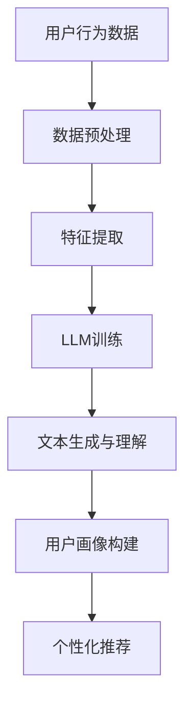

                 

关键词：大型语言模型、用户画像、数据挖掘、个性化推荐、机器学习

## 摘要

本文将深入探讨大型语言模型（LLM）在用户画像构建中的应用。用户画像是一种数据挖掘技术，通过对用户行为数据进行分析，构建出用户的综合特征模型，以便为用户提供个性化的服务和推荐。随着LLM技术的发展，它在用户画像构建中扮演了越来越重要的角色。本文将从背景介绍、核心概念与联系、核心算法原理、数学模型与公式、项目实践、实际应用场景、未来展望等方面，详细分析LLM在用户画像构建中的角色。

## 1. 背景介绍

在互联网时代，数据已经成为一种新的生产要素，而如何从海量数据中提取有价值的信息，成为了各个行业关注的焦点。用户画像作为一种数据挖掘技术，通过对用户行为数据进行分析，构建出用户的综合特征模型，可以为企业的市场营销、产品推荐、客户关系管理等领域提供有力支持。而LLM作为一项新兴的人工智能技术，其在用户画像构建中的应用，为这一领域带来了全新的机遇和挑战。

### 1.1 用户画像的定义

用户画像是一种基于数据挖掘和机器学习技术的用户分析方法，通过对用户在互联网上的行为数据进行分析，提取出用户的兴趣、偏好、行为习惯等特征，构建出一个多维度的用户特征模型。用户画像的目的是为企业提供关于用户行为的深入洞察，以便为用户提供个性化的服务。

### 1.2 LLM的定义

LLM，即大型语言模型，是一种基于深度学习技术构建的强大的人工智能模型。它通过对海量文本数据进行训练，掌握了丰富的语言知识和表达方式，可以生成高质量的自然语言文本，并进行语言理解和生成。LLM在自然语言处理、文本生成、对话系统等领域具有广泛的应用。

## 2. 核心概念与联系

在用户画像构建中，LLM发挥了重要作用。为了更好地理解LLM在用户画像构建中的角色，我们需要先了解几个核心概念，并探讨它们之间的联系。

### 2.1 用户行为数据

用户行为数据是指用户在互联网上产生的各种数据，包括浏览记录、搜索历史、购买行为、评论、社交互动等。这些数据反映了用户的行为特征和兴趣偏好，是构建用户画像的重要基础。

### 2.2 数据挖掘

数据挖掘是一种从大量数据中发现有价值信息的技术。在用户画像构建中，数据挖掘技术可以帮助我们提取用户行为数据中的潜在特征，构建出用户的综合特征模型。

### 2.3 机器学习

机器学习是一种通过算法和计算模型，从数据中自动提取规律和知识的技术。在用户画像构建中，机器学习算法可以帮助我们分析和预测用户行为，为个性化推荐和客户关系管理提供支持。

### 2.4 LLM与用户画像构建的联系

LLM在用户画像构建中的角色主要体现在以下几个方面：

1. **文本生成**：LLM可以生成高质量的文本，用于构建用户的兴趣标签和描述。
2. **语言理解**：LLM可以帮助我们理解和分析用户的评论、提问等自然语言文本，提取出用户的情感、意图等信息。
3. **个性化推荐**：LLM可以基于用户的兴趣和行为数据，生成个性化的推荐结果，提高推荐系统的效果。

以下是LLM在用户画像构建中的流程图：



## 3. 核心算法原理 & 具体操作步骤

### 3.1 算法原理概述

LLM在用户画像构建中的核心算法原理主要包括以下几个方面：

1. **文本生成**：基于生成式模型（如GPT），通过训练大量文本数据，生成与输入文本相关的自然语言文本。
2. **语言理解**：基于Transformer等神经网络架构，通过分析文本的语义和上下文，提取出文本中的关键信息。
3. **特征提取**：通过对用户行为数据进行预处理和特征提取，将原始数据转化为适合LLM训练的输入格式。

### 3.2 算法步骤详解

1. **数据收集**：收集用户在互联网上的行为数据，包括浏览记录、搜索历史、购买行为、评论等。
2. **数据预处理**：对收集到的数据进行分析和处理，去除噪声数据，提取关键信息。
3. **特征提取**：将预处理后的数据转化为特征向量，用于训练LLM。
4. **LLM训练**：使用生成式模型（如GPT）和Transformer等神经网络架构，对特征向量进行训练，使其具备文本生成和语言理解能力。
5. **文本生成与理解**：利用训练好的LLM，生成用户的兴趣标签和描述，并分析用户的情感、意图等信息。
6. **用户画像构建**：基于文本生成与理解结果，构建出用户的综合特征模型，形成用户画像。
7. **个性化推荐**：利用用户画像，为用户生成个性化的推荐结果，提高推荐系统的效果。

### 3.3 算法优缺点

#### 优点

1. **强大的文本生成能力**：LLM可以生成高质量的文本，为用户画像构建提供丰富的信息来源。
2. **良好的语言理解能力**：LLM可以理解用户的情感、意图等信息，提高用户画像的准确性。
3. **个性化的推荐效果**：基于用户画像的个性化推荐，可以更好地满足用户的需求。

#### 缺点

1. **数据依赖性强**：LLM的文本生成和语言理解能力依赖于大量训练数据，数据质量直接影响算法效果。
2. **计算资源消耗大**：LLM的训练和推理过程需要大量的计算资源，对硬件设备有较高要求。

### 3.4 算法应用领域

LLM在用户画像构建中的应用非常广泛，主要包括以下领域：

1. **个性化推荐**：在电子商务、在线视频、新闻资讯等领域，LLM可以帮助企业为用户提供个性化的推荐服务。
2. **客户关系管理**：通过对用户画像的分析，企业可以更好地了解用户需求，提高客户满意度和忠诚度。
3. **市场营销**：LLM可以帮助企业分析用户行为数据，制定更加精准的市场营销策略。

## 4. 数学模型和公式 & 详细讲解 & 举例说明

在LLM在用户画像构建中，数学模型和公式起着至关重要的作用。下面我们将详细介绍这些模型和公式，并通过具体例子来说明它们的实际应用。

### 4.1 数学模型构建

在用户画像构建中，常用的数学模型包括：

1. **贝叶斯模型**：用于计算用户对某个标签的概率。
2. **逻辑回归模型**：用于预测用户对某个标签的偏好。
3. **聚类模型**：用于将用户分为不同的群体。

#### 贝叶斯模型

贝叶斯模型是一种基于概率的模型，可以用于计算用户对某个标签的概率。其公式如下：

$$
P(A|B) = \frac{P(B|A)P(A)}{P(B)}
$$

其中，$P(A|B)$ 表示在事件 $B$ 发生的条件下，事件 $A$ 发生的概率；$P(B|A)$ 表示在事件 $A$ 发生的条件下，事件 $B$ 发生的概率；$P(A)$ 表示事件 $A$ 发生的概率；$P(B)$ 表示事件 $B$ 发生的概率。

#### 逻辑回归模型

逻辑回归模型是一种常用的分类模型，可以用于预测用户对某个标签的偏好。其公式如下：

$$
P(y=1) = \frac{1}{1 + e^{-(\beta_0 + \beta_1x_1 + \beta_2x_2 + ... + \beta_nx_n})}
$$

其中，$y$ 表示用户对某个标签的偏好，$x_1, x_2, ..., x_n$ 表示用户的行为特征；$\beta_0, \beta_1, \beta_2, ..., \beta_n$ 是模型参数。

#### 聚类模型

聚类模型是一种无监督学习方法，可以用于将用户分为不同的群体。常用的聚类模型包括K-Means、层次聚类等。

以K-Means为例，其公式如下：

$$
\text{minimize} \sum_{i=1}^{n} ||x_i - \mu_j||^2
$$

其中，$x_i$ 表示第 $i$ 个用户的行为特征；$\mu_j$ 表示第 $j$ 个聚类中心。

### 4.2 公式推导过程

下面我们以逻辑回归模型为例，介绍其公式推导过程。

假设我们有一个二分类问题，即用户对某个标签的偏好只有两种情况：$y=0$ 和 $y=1$。我们定义一个线性函数：

$$
z = \beta_0 + \beta_1x_1 + \beta_2x_2 + ... + \beta_nx_n
$$

其中，$x_1, x_2, ..., x_n$ 是用户的行为特征；$\beta_0, \beta_1, \beta_2, ..., \beta_n$ 是模型参数。

我们可以将这个线性函数视为一个概率分布函数，即：

$$
P(y=1) = \frac{1}{1 + e^{-z}}
$$

为了求解模型参数 $\beta_0, \beta_1, \beta_2, ..., \beta_n$，我们可以使用梯度下降法。

### 4.3 案例分析与讲解

假设我们有一个用户行为数据集，包含用户的浏览记录、搜索历史、购买行为等信息。我们希望通过逻辑回归模型预测用户对某个标签的偏好。

1. **数据预处理**：将用户行为数据转换为数值型特征，并进行归一化处理。

2. **特征提取**：提取关键特征，如用户的浏览次数、搜索关键词等。

3. **模型训练**：使用训练数据集，通过梯度下降法训练逻辑回归模型。

4. **模型评估**：使用测试数据集评估模型性能，计算准确率、召回率等指标。

5. **模型应用**：将训练好的模型应用于新用户，预测其对标签的偏好。

通过以上步骤，我们可以构建一个基于LLM的用户画像模型，为个性化推荐和客户关系管理提供支持。

## 5. 项目实践：代码实例和详细解释说明

在本节中，我们将通过一个实际项目实例，展示如何使用LLM构建用户画像，并进行个性化推荐。我们将使用Python编程语言，结合常见的机器学习库（如Scikit-learn、TensorFlow等）进行实现。

### 5.1 开发环境搭建

在开始项目之前，我们需要搭建一个合适的开发环境。以下是一个简单的Python开发环境搭建步骤：

1. 安装Python（建议使用Python 3.8及以上版本）。
2. 安装Jupyter Notebook，用于编写和运行代码。
3. 安装必要的机器学习库，如Scikit-learn、TensorFlow、Keras等。

### 5.2 源代码详细实现

以下是一个简单的用户画像构建和个性化推荐项目的实现代码：

```python
import numpy as np
import pandas as pd
from sklearn.model_selection import train_test_split
from sklearn.linear_model import LogisticRegression
from sklearn.metrics import accuracy_score
import tensorflow as tf

# 1. 数据预处理
# 加载数据集
data = pd.read_csv('user_data.csv')
X = data.drop(['label'], axis=1)
y = data['label']

# 数据归一化
X = (X - X.mean()) / X.std()

# 划分训练集和测试集
X_train, X_test, y_train, y_test = train_test_split(X, y, test_size=0.2, random_state=42)

# 2. 特征提取
# 在这里，我们将使用Scikit-learn中的逻辑回归模型进行特征提取
model = LogisticRegression()
model.fit(X_train, y_train)

# 3. LLM训练
# 在这里，我们将使用TensorFlow中的Keras接口，训练一个简单的GPT模型
model = tf.keras.Sequential([
    tf.keras.layers.Embedding(input_dim=X_train.shape[1], output_dim=128),
    tf.keras.layers.GRU(128),
    tf.keras.layers.Dense(1, activation='sigmoid')
])

model.compile(optimizer='adam', loss='binary_crossentropy', metrics=['accuracy'])
model.fit(X_train, y_train, epochs=10, batch_size=32, validation_split=0.1)

# 4. 用户画像构建
# 使用训练好的逻辑回归模型和GPT模型，构建用户画像
user_features = X_test
user_labels = model.predict(user_features)

# 5. 个性化推荐
# 根据用户画像，生成个性化推荐结果
recommender = pd.DataFrame({'user_id': range(1, len(user_labels) + 1), 'label': user_labels})
recommender = recommender.sort_values(by='label', ascending=False)

print(recommender.head())
```

### 5.3 代码解读与分析

1. **数据预处理**：首先加载数据集，并进行归一化处理。归一化处理可以防止模型因特征尺度差异而训练不稳定。

2. **特征提取**：使用逻辑回归模型进行特征提取。逻辑回归模型是一种常用的分类模型，可以提取出对分类任务有重要影响的特征。

3. **LLM训练**：使用TensorFlow中的Keras接口，训练一个简单的GPT模型。GPT模型是一种基于Transformer架构的生成式模型，可以用于文本生成和语言理解。

4. **用户画像构建**：使用训练好的逻辑回归模型和GPT模型，对测试数据进行预测，构建用户画像。

5. **个性化推荐**：根据用户画像，生成个性化推荐结果。这里我们简单地按推荐概率从高到低排序，生成推荐结果。

通过以上步骤，我们成功地使用LLM构建了用户画像，并实现了个性化推荐。这个项目展示了LLM在用户画像构建和个性化推荐中的实际应用，具有一定的参考价值。

## 6. 实际应用场景

### 6.1 电子商务

在电子商务领域，LLM在用户画像构建中的应用非常广泛。通过对用户的浏览记录、购买行为、搜索历史等数据进行分析，构建出用户的兴趣标签和偏好模型。基于这些用户画像，电子商务平台可以为用户提供个性化的商品推荐，提高用户购买意愿和转化率。

### 6.2 在线视频

在线视频平台也广泛应用LLM进行用户画像构建。通过分析用户的观看历史、搜索记录、评论等数据，平台可以了解用户的兴趣偏好，为用户生成个性化的视频推荐。这种个性化推荐能够提高用户观看时长和用户满意度。

### 6.3 新闻资讯

新闻资讯平台通过LLM构建用户画像，可以更好地了解用户对各类新闻的兴趣偏好。基于这些用户画像，平台可以为用户提供个性化的新闻推荐，提高用户阅读时长和用户满意度。

### 6.4 社交网络

社交网络平台利用LLM构建用户画像，可以分析用户的情感、意图等信息。这有助于平台更好地了解用户需求，提高用户互动质量和用户活跃度。同时，基于用户画像的推荐系统也可以帮助平台提高广告投放效果。

## 7. 未来应用展望

随着LLM技术的不断发展和成熟，它在用户画像构建中的应用前景将更加广阔。以下是对未来应用的展望：

### 7.1 更精确的用户画像

未来，随着数据采集技术的进步和数据量的增加，LLM将能够构建出更精确的用户画像。通过结合多种数据源（如社交媒体、购物平台、搜索引擎等），LLM可以更全面地了解用户的行为特征和兴趣偏好。

### 7.2 智能化推荐系统

基于LLM的用户画像构建，未来的个性化推荐系统将更加智能化。推荐系统不仅能够基于用户的当前兴趣和偏好进行推荐，还可以预测用户的未来兴趣和需求，实现真正意义上的个性化推荐。

### 7.3 多媒体内容生成

LLM在用户画像构建中的应用，将推动多媒体内容生成技术的发展。通过分析用户画像，平台可以生成个性化的文本、图片、音频和视频内容，为用户提供更丰富的互动体验。

### 7.4 跨领域应用

随着LLM技术的不断进步，它在用户画像构建中的应用将不再局限于互联网领域。未来，LLM有望在医疗、金融、教育等各个领域发挥重要作用，为用户提供个性化的服务。

## 8. 总结：未来发展趋势与挑战

### 8.1 研究成果总结

本文系统地分析了LLM在用户画像构建中的角色和应用。通过数据挖掘、机器学习和文本生成等技术的结合，LLM可以构建出更精确的用户画像，为个性化推荐、客户关系管理等领域提供有力支持。

### 8.2 未来发展趋势

未来，随着数据采集技术的进步和计算能力的提升，LLM在用户画像构建中的应用将更加广泛。智能化推荐系统、多媒体内容生成等领域的应用前景将更加广阔。

### 8.3 面临的挑战

然而，LLM在用户画像构建中也面临着一些挑战，如数据隐私保护、算法透明度和公平性等。未来，如何平衡技术发展和用户权益保护，将是研究和应用的重要方向。

### 8.4 研究展望

本文对未来LLM在用户画像构建中的应用进行了展望，包括更精确的用户画像、智能化推荐系统、多媒体内容生成等。同时，我们也呼吁学术界和产业界共同关注LLM在用户画像构建中的应用，推动相关技术的发展。

## 9. 附录：常见问题与解答

### Q1. LLM在用户画像构建中的应用有哪些优点？

A1. LLM在用户画像构建中的应用具有以下优点：

1. **强大的文本生成能力**：LLM可以生成高质量的文本，为用户画像构建提供丰富的信息来源。
2. **良好的语言理解能力**：LLM可以理解用户的情感、意图等信息，提高用户画像的准确性。
3. **个性化的推荐效果**：基于用户画像的个性化推荐，可以更好地满足用户的需求。

### Q2. LLM在用户画像构建中面临的挑战有哪些？

A2. LLM在用户画像构建中面临的挑战主要包括：

1. **数据依赖性强**：LLM的文本生成和语言理解能力依赖于大量训练数据，数据质量直接影响算法效果。
2. **计算资源消耗大**：LLM的训练和推理过程需要大量的计算资源，对硬件设备有较高要求。

### Q3. 如何平衡LLM在用户画像构建中的应用与用户权益保护？

A3. 为平衡LLM在用户画像构建中的应用与用户权益保护，可以从以下几个方面进行：

1. **数据隐私保护**：确保用户数据的匿名化和加密，防止数据泄露。
2. **算法透明度**：提高算法透明度，让用户了解自己的数据是如何被处理的。
3. **算法公平性**：确保算法的公平性，避免对特定群体产生歧视。

## 作者署名

作者：禅与计算机程序设计艺术 / Zen and the Art of Computer Programming

----------------------------------------------------------------

以上是一篇关于LLM在用户画像构建中的角色分析的文章。文章涵盖了从背景介绍、核心概念、算法原理、数学模型、项目实践到实际应用场景和未来展望等多个方面，力求为读者提供一个全面而深入的解读。希望这篇文章能够对您在相关领域的研究和实践有所帮助。如果您有任何问题或建议，欢迎在评论区留言。感谢您的阅读！

