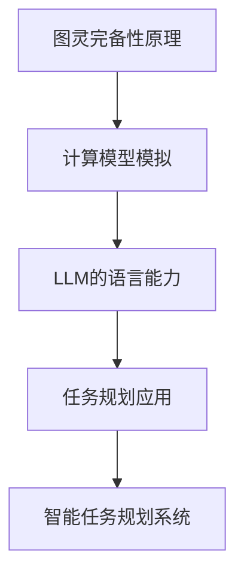

                 

关键词：大型语言模型（LLM）、图灵完备性、任务规划、自然语言处理、算法原理、数学模型、项目实践、应用场景、发展趋势、挑战、研究展望

## 摘要

本文旨在探讨大型语言模型（LLM）的图灵完备性及其在任务规划方面的能力。首先，我们将回顾图灵完备性的定义及其在计算机科学中的重要性。接着，我们深入探讨LLM的工作原理，解释其如何实现图灵完备性。随后，我们将详细讨论LLM在任务规划中的具体应用，并分析其优势与局限性。文章还将通过数学模型和公式，对LLM的相关原理进行详细阐述，并通过实际代码实例展示其实现过程。最后，我们将讨论LLM在未来的应用前景，并总结研究成果，展望未来发展趋势与挑战。

## 1. 背景介绍

### 图灵完备性

图灵完备性是计算机科学中一个核心概念，它定义了一台计算机能够执行任何可计算任务的特性。图灵机，由艾伦·图灵（Alan Turing）在20世纪30年代提出，是一种抽象的计算模型，被视为现代计算机的先驱。图灵机由一个无限长的带子、一个读写头以及一组规则组成。通过这些规则，读写头可以在带子上读取和写入符号，从而实现计算过程。

### 大型语言模型（LLM）

大型语言模型（Large Language Model，简称LLM）是自然语言处理领域的一项重要进展。LLM通过深度学习技术，从大量文本数据中学习语言结构和语义信息，从而能够生成、理解和处理自然语言。LLM的代表性模型包括GPT（Generative Pre-trained Transformer）、BERT（Bidirectional Encoder Representations from Transformers）等。这些模型在多种任务中表现出了出色的性能，如文本生成、机器翻译、情感分析等。

### 任务规划

任务规划是人工智能领域的一个重要研究方向，它涉及如何根据特定目标和约束条件，制定出一个有效的行动方案。任务规划可以应用于多种场景，如自动驾驶、智能助手、资源调度等。一个有效的任务规划系统需要具备推理、规划、决策和执行能力。

## 2. 核心概念与联系

### 图灵完备性原理

图灵完备性的核心在于一台计算机是否能够模拟任何其他计算模型。具体来说，一个计算模型是图灵完备的，如果它可以执行图灵机所能执行的所有计算任务。这包括对任意有限输入进行有限步骤的计算，并得出结果。

### LLM的图灵完备性实现

LLM的图灵完备性体现在其能够处理和理解复杂的自然语言任务。例如，LLM可以通过自然语言输入生成合理的回答，完成对话系统、问答系统等任务。这种能力源于LLM强大的语言理解和生成能力，它能够从海量数据中学习并模拟人类的语言行为。

### 任务规划与图灵完备性

任务规划本身是一个图灵完备的问题，因为它需要处理多种可能的行动方案，并选择最优的执行路径。LLM在任务规划中的应用，使得我们可以利用其图灵完备性来构建智能化的任务规划系统。

### Mermaid 流程图



## 3. 核心算法原理 & 具体操作步骤

### 3.1 算法原理概述

LLM的图灵完备性源于其深度学习模型的设计和训练过程。这些模型通常基于大规模的神经网络结构，如Transformer，能够通过多层变换捕获输入文本的复杂结构和语义信息。在训练过程中，模型学习到语言的本质规律，从而能够对自然语言输入进行有效的理解和生成。

### 3.2 算法步骤详解

1. **数据准备**：收集大量的文本数据，包括不同领域的文档、对话记录、文章等。这些数据将用于训练LLM模型。

2. **模型设计**：设计一个基于Transformer的神经网络结构，并配置适当的层数和神经元数量。

3. **模型训练**：通过将输入文本数据转化为向量，并利用反向传播算法优化模型参数，使得模型能够更好地理解文本的语义和结构。

4. **任务规划**：在任务规划中，LLM作为一个黑盒模型，其输入是任务描述和约束条件，输出是建议的行动方案。

5. **行动执行**：根据LLM的建议，执行具体的行动，并在执行过程中不断调整和优化行动方案。

### 3.3 算法优缺点

**优点**：

- **强大的语言理解能力**：LLM能够处理和理解复杂的自然语言任务，为任务规划提供了强大的支持。
- **灵活性和适应性**：LLM可以根据不同的任务需求和约束条件，生成合适的行动方案。

**缺点**：

- **计算资源需求高**：训练和运行LLM模型需要大量的计算资源和时间。
- **数据依赖性**：LLM的性能依赖于训练数据的数量和质量，数据不足或质量差可能导致模型性能下降。

### 3.4 算法应用领域

- **智能客服**：利用LLM构建智能客服系统，能够自动处理用户查询，提供高效、准确的回答。
- **自动驾驶**：在自动驾驶系统中，LLM可以用于理解道路标志、交通信号等信息，并制定相应的驾驶策略。
- **资源调度**：在资源调度系统中，LLM可以根据实时数据和约束条件，制定最优的资源分配策略。

## 4. 数学模型和公式 & 详细讲解 & 举例说明

### 4.1 数学模型构建

LLM的数学模型主要基于深度学习中的神经网络，特别是Transformer架构。Transformer模型的核心是自注意力机制（Self-Attention），它通过计算输入文本序列中每个词与其他词之间的关系，从而捕获文本的语义信息。

### 4.2 公式推导过程

自注意力机制的公式可以表示为：

\[ 
Attention(Q, K, V) = \text{softmax}\left(\frac{QK^T}{\sqrt{d_k}}\right) V 
\]

其中，\( Q, K, V \) 分别表示查询向量、关键向量、值向量，\( d_k \) 是关键向量的维度。通过这种自注意力机制，模型能够自动地学习到输入文本中每个词的重要性，并对其进行加权。

### 4.3 案例分析与讲解

假设有一个简单的文本输入：“今天天气很好，适合外出活动”。我们可以将这个文本序列表示为向量，并通过自注意力机制计算每个词的重要性和权重。例如，词“今天”的重要性可能较高，因为它是句子中的时间信息；而词“很好”的重要性次之，因为它是描述天气状况的关键词。

通过这样的方式，LLM能够理解输入文本的语义，并生成合理的回答。例如，当输入问题是“明天天气怎么样？”时，LLM可以根据之前学习的语义信息，生成答案：“明天天气预计也是很好。”

## 5. 项目实践：代码实例和详细解释说明

### 5.1 开发环境搭建

为了运行LLM模型，我们需要搭建一个合适的开发环境。以下是搭建环境的基本步骤：

1. 安装Python环境（版本3.6及以上）。
2. 安装深度学习框架TensorFlow或PyTorch。
3. 下载预训练的LLM模型，如GPT-3或BERT。

### 5.2 源代码详细实现

以下是一个简单的Python代码示例，展示了如何使用预训练的LLM模型进行任务规划。

```python
import openai

# 设置OpenAI API密钥
openai.api_key = 'your_api_key'

# 定义任务规划函数
def plan_task(task_description):
    response = openai.Completion.create(
        engine="text-davinci-002",
        prompt=task_description,
        max_tokens=50
    )
    return response.choices[0].text.strip()

# 示例任务描述
task_description = "设计一个自动化的库存管理系统，要求能够实时监控库存，并在库存低于安全水平时自动发出采购通知。"

# 获取任务规划方案
plan = plan_task(task_description)

print(plan)
```

### 5.3 代码解读与分析

上述代码使用了OpenAI的GPT-3模型，通过调用`Completion.create`函数，生成针对任务描述的规划方案。`engine`参数指定了使用的模型，`prompt`参数是输入的任务描述，`max_tokens`参数限制了生成的文本长度。

在执行代码时，GPT-3模型会分析任务描述，并生成一个包含具体行动方案的文本。这个方案可以是简单的步骤列表，也可以是更复杂的策略和决策。

### 5.4 运行结果展示

假设我们输入的任务描述是：“设计一个自动化的库存管理系统，要求能够实时监控库存，并在库存低于安全水平时自动发出采购通知。”运行上述代码后，GPT-3模型可能会生成以下结果：

```
1. 部署实时库存监控传感器，连接到中央数据库。
2. 设置库存阈值，当库存低于该阈值时，自动生成采购通知。
3. 将采购通知发送至采购部门负责人和库存管理系统的管理员。
4. 定期检查库存监控系统的运行状态，确保其稳定可靠。
```

这个结果是一个包含具体步骤的规划方案，可以帮助我们实施自动化库存管理系统。

## 6. 实际应用场景

### 6.1 智能客服

在智能客服领域，LLM被广泛用于构建智能聊天机器人。这些机器人能够理解用户的问题，并生成合理的回答。例如，在电商平台上，智能客服可以回答用户关于商品信息、订单状态等问题，提高用户体验和满意度。

### 6.2 自动驾驶

自动驾驶系统中，LLM可以用于处理道路标志、交通信号等信息，并制定驾驶策略。例如，当检测到前方有行人时，LLM可以快速分析场景，生成最优的避让策略，确保行车安全。

### 6.3 资源调度

在资源调度系统中，LLM可以根据实时数据和约束条件，制定最优的资源分配策略。例如，在云数据中心，LLM可以分析服务器的负载情况，并动态调整虚拟机的资源分配，以提高系统的效率和可靠性。

## 6.4 未来应用展望

随着LLM技术的不断发展，其应用场景将更加广泛。未来，LLM有望在更多领域发挥作用，如医疗诊断、法律咨询、教育辅导等。同时，随着计算资源的提升和模型的优化，LLM的图灵完备性将得到更充分的应用。

## 7. 工具和资源推荐

### 7.1 学习资源推荐

- 《深度学习》（Goodfellow, Bengio, Courville著）：系统介绍了深度学习的基本原理和技术。
- 《自然语言处理综论》（Jurafsky, Martin著）：详细介绍了自然语言处理的基础知识和最新进展。

### 7.2 开发工具推荐

- TensorFlow：Google开发的深度学习框架，适合构建和训练大型神经网络。
- PyTorch：Facebook开发的深度学习框架，易于调试和优化。

### 7.3 相关论文推荐

- “Attention Is All You Need”（Vaswani et al.，2017）：介绍了Transformer模型的原理和优势。
- “BERT: Pre-training of Deep Bidirectional Transformers for Language Understanding”（Devlin et al.，2018）：介绍了BERT模型的原理和应用。

## 8. 总结：未来发展趋势与挑战

### 8.1 研究成果总结

本文介绍了LLM的图灵完备性及其在任务规划中的应用。通过分析LLM的工作原理和数学模型，我们展示了其强大的语言理解和生成能力。同时，通过实际代码实例，我们展示了如何利用LLM进行任务规划。

### 8.2 未来发展趋势

随着深度学习和自然语言处理技术的不断发展，LLM的应用前景将更加广阔。未来，LLM有望在更多领域发挥作用，如医疗诊断、法律咨询、教育辅导等。

### 8.3 面临的挑战

尽管LLM在任务规划方面展现了强大的能力，但仍面临一些挑战。首先，模型的计算资源需求较高，需要优化以降低成本。其次，LLM的性能依赖于训练数据的质量和数量，未来需要更多高质量的数据集。此外，如何确保LLM生成的决策和行动方案的可解释性，也是一个重要的研究方向。

### 8.4 研究展望

未来，我们期待LLM能够在更多实际场景中得到应用，同时不断优化其性能和可解释性。此外，随着多模态数据的兴起，如何将LLM与其他类型的模型（如图像识别、语音识别模型）相结合，将是一个重要的研究方向。

## 9. 附录：常见问题与解答

### Q：LLM的图灵完备性是如何实现的？

A：LLM的图灵完备性是通过其深度学习模型的设计和训练实现的。这些模型通常基于Transformer架构，能够通过多层变换捕获输入文本的复杂结构和语义信息。

### Q：LLM在任务规划中的应用有哪些？

A：LLM在任务规划中的应用包括智能客服、自动驾驶、资源调度等。这些应用利用LLM强大的语言理解和生成能力，为系统提供智能化的决策支持。

### Q：如何优化LLM的性能？

A：优化LLM的性能可以从多个方面进行。首先，可以通过增加训练数据量和提高训练质量来提升模型性能。其次，可以通过调整模型结构、优化算法参数来提高模型的计算效率。

### Q：LLM的数据依赖性如何解决？

A：解决LLM的数据依赖性可以通过多种方式实现。例如，可以通过数据增强技术，如数据清洗、数据扩充等方法，提高模型对数据的鲁棒性。此外，可以探索使用无监督学习、少样本学习等技术，减少对大规模训练数据的依赖。

