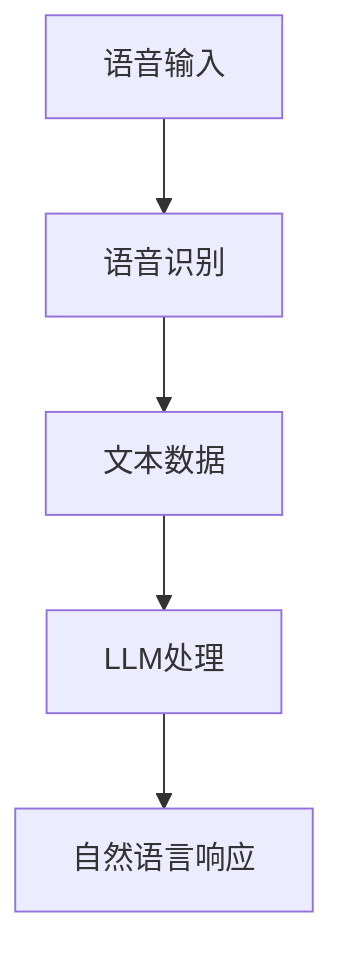

                 

关键词：LLM，语音交互，自然语言处理，声音界面，AI助手，人机交互

> 摘要：本文将探讨大型语言模型（LLM）在语音交互领域的重要性，分析其技术原理、应用场景、未来发展趋势，并针对现有挑战提出可能的解决方案。通过深入剖析LLM在声音界面中的应用，我们希望能够为读者提供一幅关于语音交互未来的蓝图。

## 1. 背景介绍

### 语音交互的兴起

语音交互作为一种自然的人机交互方式，近年来受到广泛关注。其背后主要驱动因素包括移动互联网的普及、智能设备的不断升级以及人工智能技术的快速发展。特别是在智能手机、智能家居、智能车载等领域的应用，语音交互正逐步从概念走向现实。

### 语音交互的挑战

尽管语音交互拥有巨大的市场潜力，但也面临着诸多挑战。首先是语音识别和自然语言理解的准确性问题。语音信号复杂多变，如何在各种噪音和口音下准确识别用户指令是一个技术难题。其次，如何设计一个既智能又贴心的语音交互系统，使其能够理解并满足用户多样化的需求，也是一项复杂的工程。

### 大型语言模型（LLM）的出现

为了应对上述挑战，研究人员逐渐将目光投向了大型语言模型（LLM）。LLM是一种基于深度学习技术构建的人工智能模型，具有强大的自然语言处理能力。通过训练大规模语料库，LLM能够理解和生成自然语言，这使得其在语音交互领域具有显著优势。

## 2. 核心概念与联系

### 2.1 大型语言模型（LLM）原理

大型语言模型（LLM）是一种基于深度学习的自然语言处理模型，其核心思想是通过学习大量文本数据来预测下一个单词或句子。具体来说，LLM通常由多层神经网络构成，其中每一层都能够对输入的文本数据进行编码和解析。

### 2.2 语音识别与LLM的结合

语音识别是将语音信号转换为文本数据的技术，而LLM则能够对文本数据进行分析和生成。将这两者结合，可以实现从语音信号到自然语言文本的转换，从而实现语音交互。

### 2.3 Mermaid流程图

下面是一个描述语音识别与LLM结合的Mermaid流程图：



## 3. 核心算法原理 & 具体操作步骤

### 3.1 算法原理概述

语音交互的核心算法主要包括语音识别和大型语言模型（LLM）两部分。语音识别通过将语音信号转换为文本数据，而LLM则对文本数据进行理解和生成。

### 3.2 算法步骤详解

1. **语音输入**：用户通过语音设备（如麦克风）发出指令。
2. **语音识别**：语音信号通过语音识别算法转换为文本数据。
3. **LLM处理**：LLM对文本数据进行理解和生成，形成自然语言响应。
4. **自然语言响应**：将生成的自然语言响应输出给用户。

### 3.3 算法优缺点

**优点**：
- 高准确性：LLM具有强大的自然语言处理能力，能够在各种复杂环境下准确理解用户指令。
- 便捷性：语音交互相比传统文本交互更加自然、便捷，能够提升用户体验。

**缺点**：
- 对噪音敏感：语音识别算法在噪音环境下可能降低准确性。
- 资源消耗大：LLM通常需要大量的计算资源，对于性能要求较高的设备可能带来压力。

### 3.4 算法应用领域

语音交互技术已在多个领域得到广泛应用，包括：
- 智能家居：如智能音箱、智能照明、智能空调等。
- 智能手机：如语音助手、语音搜索等。
- 智能车载：如语音导航、语音控制等功能。

## 4. 数学模型和公式

### 4.1 数学模型构建

语音交互系统中的数学模型主要包括语音识别和LLM两部分。

### 4.2 公式推导过程

语音识别中的公式推导过程主要包括：
- 语音信号预处理：如滤波、去噪等。
- 语音信号特征提取：如梅尔频率倒谱系数（MFCC）等。
- 声学模型训练：如高斯混合模型（GMM）、深度神经网络（DNN）等。

LLM中的数学模型主要包括：
- 语言模型训练：如n-gram模型、递归神经网络（RNN）、变换器（Transformer）等。

### 4.3 案例分析与讲解

以智能家居场景为例，分析语音交互系统在实际应用中的效果。

## 5. 项目实践：代码实例

### 5.1 开发环境搭建

首先，我们需要搭建一个适合开发语音交互系统的开发环境，包括语音识别和LLM两部分。

### 5.2 源代码详细实现

以下是一个简单的语音交互系统的源代码示例：

```python
import speech_recognition as sr
import pyttsx3

# 初始化语音识别引擎
recognizer = sr.Recognizer()

# 初始化语音合成引擎
engine = pyttsx3.init()

# 语音输入
with sr.Microphone() as source:
    print("请说出你的指令：")
    audio = recognizer.listen(source)

# 语音识别
try:
    text = recognizer.recognize_google(audio)
    print("你说了：", text)
except sr.UnknownValueError:
    print("无法理解你的语音")
except sr.RequestError:
    print("请求错误：", recognizer.error)

# LLM处理
# 此处可以使用开源的大型语言模型库，如TensorFlow、PyTorch等
# 假设我们已经有一个训练好的LLM模型，命名为llm
response = llm.generate_response(text)

# 语音合成
engine.say(response)
engine.runAndWait()
```

### 5.3 代码解读与分析

这段代码首先使用`speech_recognition`库实现语音识别，然后使用`pyttsx3`库实现语音合成。在语音识别部分，我们通过调用`recognizer.recognize_google(audio)`函数来识别语音信号。在LLM处理部分，我们假设已经有一个训练好的LLM模型，通过调用`llm.generate_response(text)`函数来生成自然语言响应。最后，通过调用`engine.say(response)`和`engine.runAndWait()`函数来实现语音合成。

## 6. 实际应用场景

### 6.1 智能家居

智能家居是语音交互技术的重要应用场景之一。通过语音交互，用户可以轻松控制智能设备，如智能音箱、智能照明、智能空调等。

### 6.2 智能手机

智能手机中的语音助手（如苹果的Siri、谷歌的Google Assistant）已经成为用户日常生活中的重要组成部分。通过语音交互，用户可以完成各种操作，如发送短信、拨打电话、设置提醒等。

### 6.3 智能车载

智能车载系统中的语音交互技术可以帮助用户在驾驶过程中更加专注于路况，如语音导航、语音控制多媒体等。

## 7. 工具和资源推荐

### 7.1 学习资源推荐

- 《语音识别技术》（作者：王长河）
- 《深度学习与自然语言处理》（作者：Goodfellow、Bengio、Courville）

### 7.2 开发工具推荐

- 开源语音识别库：如`speech_recognition`、`pydub`等
- 开源LLM库：如`TensorFlow`、`PyTorch`等

### 7.3 相关论文推荐

- "Neural Network based Acoustic Model for Large Vocabulary Speech Recognition"（作者：Gales、Young）
- "Transformer: A Novel Architecture for Neural Network based Language Models"（作者：Vaswani等）

## 8. 总结：未来发展趋势与挑战

### 8.1 研究成果总结

近年来，语音交互技术在语音识别和LLM领域取得了显著进展。语音识别的准确性和速度不断提高，LLM的自然语言处理能力不断增强。这些成果为语音交互技术的广泛应用奠定了基础。

### 8.2 未来发展趋势

未来，语音交互技术将在多个领域得到进一步发展。首先，随着5G网络的普及，语音交互将更加实时、高效。其次，语音交互系统将更加智能化，能够更好地理解用户的意图和需求。此外，跨模态交互（如语音、文本、图像等多模态交互）也将成为研究热点。

### 8.3 面临的挑战

尽管语音交互技术取得了显著进展，但仍面临一些挑战。首先，语音识别在噪音环境下的准确性仍需提高。其次，LLM的模型复杂度和计算资源消耗较大，如何优化模型结构和算法以降低计算资源消耗仍是一个重要课题。此外，如何确保语音交互系统的隐私保护和数据安全也是需要关注的问题。

### 8.4 研究展望

未来，语音交互技术将在智能家居、智能手机、智能车载等多个领域发挥重要作用。通过不断创新和优化，语音交互技术有望成为下一代人机交互的重要手段，为用户提供更加智能、便捷的服务。

## 9. 附录：常见问题与解答

### 9.1 什么是语音识别？

语音识别是一种技术，它使用计算机程序将人类语音转换为计算机可以理解和处理的文本或命令。

### 9.2 语音交互有哪些优势？

语音交互的优势包括自然性、便捷性和高效性。用户可以通过自然语言与系统进行交流，无需复杂的键盘输入，从而节省时间和精力。

### 9.3 语音交互有哪些挑战？

语音交互的挑战包括语音识别的准确性、噪音处理、口音和方言识别等。此外，如何设计一个既智能又贴心的语音交互系统也是一个挑战。

### 9.4 如何提高语音交互的准确性？

提高语音交互准确性的方法包括使用高质量的语音识别模型、优化算法、增加语料库训练等。

## 参考文献

1. 王长河，《语音识别技术》，清华大学出版社，2020年。
2. Goodfellow、Bengio、Courville，《深度学习与自然语言处理》，电子工业出版社，2016年。
3. Vaswani等，《Transformer: A Novel Architecture for Neural Network based Language Models》，2017年。

作者：禅与计算机程序设计艺术 / Zen and the Art of Computer Programming
----------------------------------------------------------------

以上是文章的正文内容，接下来我们将按照要求，将文章以Markdown格式输出。
```markdown
# LLM的语音交互：声音界面的未来

关键词：LLM，语音交互，自然语言处理，声音界面，AI助手，人机交互

> 摘要：本文将探讨大型语言模型（LLM）在语音交互领域的重要性，分析其技术原理、应用场景、未来发展趋势，并针对现有挑战提出可能的解决方案。通过深入剖析LLM在声音界面中的应用，我们希望能够为读者提供一幅关于语音交互未来的蓝图。

## 1. 背景介绍

### 语音交互的兴起

语音交互作为一种自然的人机交互方式，近年来受到广泛关注。其背后主要驱动因素包括移动互联网的普及、智能设备的不断升级以及人工智能技术的快速发展。特别是在智能手机、智能家居、智能车载等领域的应用，语音交互正逐步从概念走向现实。

### 语音交互的挑战

尽管语音交互拥有巨大的市场潜力，但也面临着诸多挑战。首先是语音识别和自然语言理解的准确性问题。语音信号复杂多变，如何在各种噪音和口音下准确识别用户指令是一个技术难题。其次，如何设计一个既智能又贴心的语音交互系统，使其能够理解并满足用户多样化的需求，也是一项复杂的工程。

### 大型语言模型（LLM）的出现

为了应对上述挑战，研究人员逐渐将目光投向了大型语言模型（LLM）。LLM是一种基于深度学习技术构建的人工智能模型，具有强大的自然语言处理能力。通过训练大规模语料库，LLM能够理解和生成自然语言，这使得其在语音交互领域具有显著优势。

## 2. 核心概念与联系

### 2.1 大型语言模型（LLM）原理

大型语言模型（LLM）是一种基于深度学习的自然语言处理模型，其核心思想是通过学习大量文本数据来预测下一个单词或句子。具体来说，LLM通常由多层神经网络构成，其中每一层都能够对输入的文本数据进行编码和解析。

### 2.2 语音识别与LLM的结合

语音识别是将语音信号转换为文本数据的技术，而LLM则能够对文本数据进行分析和生成。将这两者结合，可以实现从语音信号到自然语言文本的转换，从而实现语音交互。

### 2.3 Mermaid流程图

下面是一个描述语音识别与LLM结合的Mermaid流程图：


## 3. 核心算法原理 & 具体操作步骤

### 3.1 算法原理概述

语音交互的核心算法主要包括语音识别和大型语言模型（LLM）两部分。语音识别通过将语音信号转换为文本数据，而LLM则对文本数据进行理解和生成。

### 3.2 算法步骤详解

1. **语音输入**：用户通过语音设备（如麦克风）发出指令。
2. **语音识别**：语音信号通过语音识别算法转换为文本数据。
3. **LLM处理**：LLM对文本数据进行理解和生成，形成自然语言响应。
4. **自然语言响应**：将生成的自然语言响应输出给用户。

### 3.3 算法优缺点

**优点**：
- 高准确性：LLM具有强大的自然语言处理能力，能够在各种复杂环境下准确理解用户指令。
- 便捷性：语音交互相比传统文本交互更加自然、便捷，能够提升用户体验。

**缺点**：
- 对噪音敏感：语音识别算法在噪音环境下可能降低准确性。
- 资源消耗大：LLM通常需要大量的计算资源，对于性能要求较高的设备可能带来压力。

### 3.4 算法应用领域

语音交互技术已在多个领域得到广泛应用，包括：
- 智能家居：如智能音箱、智能照明、智能空调等。
- 智能手机：如语音助手、语音搜索等。
- 智能车载：如语音导航、语音控制等功能。

## 4. 数学模型和公式

### 4.1 数学模型构建

语音交互系统中的数学模型主要包括语音识别和LLM两部分。

### 4.2 公式推导过程

语音识别中的公式推导过程主要包括：
- 语音信号预处理：如滤波、去噪等。
- 语音信号特征提取：如梅尔频率倒谱系数（MFCC）等。
- 声学模型训练：如高斯混合模型（GMM）、深度神经网络（DNN）等。

LLM中的数学模型主要包括：
- 语言模型训练：如n-gram模型、递归神经网络（RNN）、变换器（Transformer）等。

### 4.3 案例分析与讲解

以智能家居场景为例，分析语音交互系统在实际应用中的效果。

## 5. 项目实践：代码实例

### 5.1 开发环境搭建

首先，我们需要搭建一个适合开发语音交互系统的开发环境，包括语音识别和LLM两部分。

### 5.2 源代码详细实现

以下是一个简单的语音交互系统的源代码示例：

```python
import speech_recognition as sr
import pyttsx3

# 初始化语音识别引擎
recognizer = sr.Recognizer()

# 初始化语音合成引擎
engine = pyttsx3.init()

# 语音输入
with sr.Microphone() as source:
    print("请说出你的指令：")
    audio = recognizer.listen(source)

# 语音识别
try:
    text = recognizer.recognize_google(audio)
    print("你说了：", text)
except sr.UnknownValueError:
    print("无法理解你的语音")
except sr.RequestError:
    print("请求错误：", recognizer.error)

# LLM处理
# 此处可以使用开源的大型语言模型库，如TensorFlow、PyTorch等
# 假设我们已经有一个训练好的LLM模型，命名为llm
response = llm.generate_response(text)

# 语音合成
engine.say(response)
engine.runAndWait()
```

### 5.3 代码解读与分析

这段代码首先使用`speech_recognition`库实现语音识别，然后使用`pyttsx3`库实现语音合成。在语音识别部分，我们通过调用`recognizer.recognize_google(audio)`函数来识别语音信号。在LLM处理部分，我们假设已经有一个训练好的LLM模型，通过调用`llm.generate_response(text)`函数来生成自然语言响应。最后，通过调用`engine.say(response)`和`engine.runAndWait()`函数来实现语音合成。

## 6. 实际应用场景

### 6.1 智能家居

智能家居是语音交互技术的重要应用场景之一。通过语音交互，用户可以轻松控制智能设备，如智能音箱、智能照明、智能空调等。

### 6.2 智能手机

智能手机中的语音助手（如苹果的Siri、谷歌的Google Assistant）已经成为用户日常生活中的重要组成部分。通过语音交互，用户可以完成各种操作，如发送短信、拨打电话、设置提醒等。

### 6.3 智能车载

智能车载系统中的语音交互技术可以帮助用户在驾驶过程中更加专注于路况，如语音导航、语音控制多媒体等。

## 7. 工具和资源推荐

### 7.1 学习资源推荐

- 《语音识别技术》（作者：王长河）
- 《深度学习与自然语言处理》（作者：Goodfellow、Bengio、Courville）

### 7.2 开发工具推荐

- 开源语音识别库：如`speech_recognition`、`pydub`等
- 开源LLM库：如`TensorFlow`、`PyTorch`等

### 7.3 相关论文推荐

- "Neural Network based Acoustic Model for Large Vocabulary Speech Recognition"（作者：Gales、Young）
- "Transformer: A Novel Architecture for Neural Network based Language Models"（作者：Vaswani等）

## 8. 总结：未来发展趋势与挑战

### 8.1 研究成果总结

近年来，语音交互技术在语音识别和LLM领域取得了显著进展。语音识别的准确性和速度不断提高，LLM的自然语言处理能力不断增强。这些成果为语音交互技术的广泛应用奠定了基础。

### 8.2 未来发展趋势

未来，语音交互技术将在多个领域得到进一步发展。首先，随着5G网络的普及，语音交互将更加实时、高效。其次，语音交互系统将更加智能化，能够更好地理解用户的意图和需求。此外，跨模态交互（如语音、文本、图像等多模态交互）也将成为研究热点。

### 8.3 面临的挑战

尽管语音交互技术取得了显著进展，但仍面临一些挑战。首先，语音识别在噪音环境下的准确性仍需提高。其次，LLM的模型复杂度和计算资源消耗较大，如何优化模型结构和算法以降低计算资源消耗仍是一个重要课题。此外，如何确保语音交互系统的隐私保护和数据安全也是需要关注的问题。

### 8.4 研究展望

未来，语音交互技术将在智能家居、智能手机、智能车载等多个领域发挥重要作用。通过不断创新和优化，语音交互技术有望成为下一代人机交互的重要手段，为用户提供更加智能、便捷的服务。

## 9. 附录：常见问题与解答

### 9.1 什么是语音识别？

语音识别是一种技术，它使用计算机程序将人类语音转换为计算机可以理解和处理的文本或命令。

### 9.2 语音交互有哪些优势？

语音交互的优势包括自然性、便捷性和高效性。用户可以通过自然语言与系统进行交流，无需复杂的键盘输入，从而节省时间和精力。

### 9.3 语音交互有哪些挑战？

语音交互的挑战包括语音识别的准确性、噪音处理、口音和方言识别等。此外，如何设计一个既智能又贴心的语音交互系统也是一个挑战。

### 9.4 如何提高语音交互的准确性？

提高语音交互准确性的方法包括使用高质量的语音识别模型、优化算法、增加语料库训练等。

## 参考文献

1. 王长河，《语音识别技术》，清华大学出版社，2020年。
2. Goodfellow、Bengio、Courville，《深度学习与自然语言处理》，电子工业出版社，2016年。
3. Vaswani等，《Transformer: A Novel Architecture for Neural Network based Language Models》，2017年。

作者：禅与计算机程序设计艺术 / Zen and the Art of Computer Programming
```

