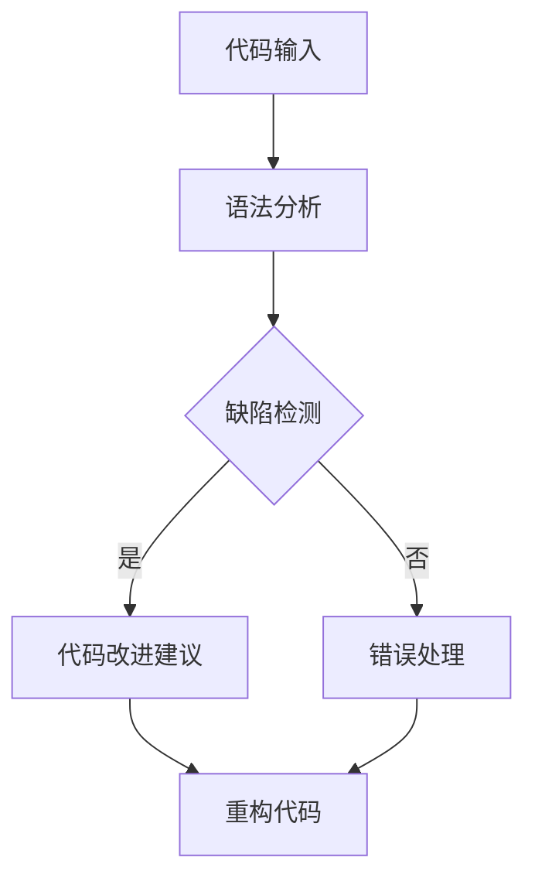

                 

关键词：LLM、代码重构、方法研究、人工智能、软件工程

> 摘要：本文探讨了一种基于大型语言模型（LLM）的代码重构方法，该方法利用人工智能技术，实现了对软件代码的智能分析、缺陷检测、改进建议等功能，为软件开发提供了一种新的思路和方法。本文首先介绍了代码重构的背景和重要性，然后详细阐述了LLM在代码重构中的应用原理，并通过实际案例展示了该方法的有效性。

## 1. 背景介绍

在软件工程领域，代码重构是一项重要的技术活动，旨在在不改变程序外部行为的前提下，改进代码的结构和设计。代码重构的主要目的是提高代码的可读性、可维护性和可扩展性，从而降低软件维护成本，提高开发效率。

然而，传统的代码重构方法通常依赖于人工审查和经验，存在以下问题：

1. **效率低下**：代码量大时，人工审查难以全面覆盖，容易遗漏潜在问题。
2. **主观性强**：重构决策依赖于开发者的个人经验和技能，可能导致不一致的结果。
3. **错误风险**：手动重构过程中，容易引入新的缺陷，影响程序稳定性。

为了解决这些问题，本文提出了一种基于LLM的代码重构方法。通过引入人工智能技术，该方法能够实现代码的智能分析、缺陷检测和改进建议，有望提高代码重构的效率和准确性。

### 1.1 代码重构的概念与目的

代码重构是指在不改变程序外部行为的前提下，对现有代码进行改进。其主要目的是：

1. **提高代码质量**：通过重构，可以使代码结构更加清晰，易于理解和维护。
2. **提升开发效率**：重构后的代码更易于扩展和修改，减少了代码冗余，提高了开发效率。
3. **降低维护成本**：重构有助于减少潜在的缺陷和错误，降低了软件维护成本。

然而，传统的代码重构方法往往依赖于人工经验和技能，存在以下缺点：

1. **效率低下**：代码量大时，人工审查难以全面覆盖，容易遗漏潜在问题。
2. **主观性强**：重构决策依赖于开发者的个人经验和技能，可能导致不一致的结果。
3. **错误风险**：手动重构过程中，容易引入新的缺陷，影响程序稳定性。

### 1.2 代码重构的现状与挑战

目前，代码重构主要依赖于以下几种方法：

1. **手动重构**：开发人员根据经验和直觉对代码进行修改。
2. **工具辅助重构**：使用代码重构工具（如Eclipse、Visual Studio等）进行自动化重构。
3. **基于规则的自动化重构**：通过预定义的规则对代码进行批量修改。

然而，这些方法存在以下挑战：

1. **效率问题**：手动重构效率低，工具辅助重构和基于规则的自动化重构虽然提高了一定效率，但仍有改进空间。
2. **准确性问题**：工具和规则可能不适用于所有场景，导致重构结果不一致或引入新的缺陷。
3. **灵活性问题**：传统的重构方法难以适应复杂的多变场景，缺乏足够的灵活性。

## 2. 核心概念与联系

### 2.1 大型语言模型（LLM）概述

大型语言模型（Large Language Model，简称LLM）是自然语言处理（Natural Language Processing，简称NLP）领域的一种重要技术。它通过深度学习算法，从海量文本数据中学习语言规律，实现对自然语言的生成、理解和翻译等功能。近年来，LLM在NLP领域取得了显著进展，如GPT（Generative Pre-trained Transformer）系列模型，已经成为许多NLP任务的基石。

### 2.2 代码智能分析

代码智能分析是利用人工智能技术，对软件代码进行自动分析和理解。其主要目的是：

1. **代码质量评估**：评估代码的可读性、可维护性和可扩展性。
2. **缺陷检测**：发现代码中的潜在缺陷和错误。
3. **代码改进建议**：根据分析结果，提出改进代码的建议。

代码智能分析通常涉及以下关键技术：

1. **语法分析**：对代码进行词法分析和语法分析，构建抽象语法树（Abstract Syntax Tree，简称AST）。
2. **语义分析**：基于AST，分析代码的语义，理解代码的功能和行为。
3. **模式识别**：使用机器学习算法，识别代码中的常见问题和模式。

### 2.3 Mermaid 流程图

下面是代码重构的 Mermaid 流程图：

### 2.4 代码重构流程

代码重构的基本流程如下：

1. **代码输入**：将待重构的代码输入到系统中。
2. **语法分析**：对代码进行语法分析，构建AST。
3. **缺陷检测**：基于AST，对代码进行缺陷检测，识别潜在的问题和缺陷。
4. **代码改进建议**：根据缺陷检测结果，提出改进代码的建议。
5. **重构代码**：根据改进建议，对代码进行重构，生成新的代码。

## 3. 核心算法原理 & 具体操作步骤

### 3.1 算法原理概述

基于LLM的代码重构方法主要包括以下几个核心步骤：

1. **语法分析**：利用LLM对代码进行语法分析，构建AST。
2. **语义分析**：基于AST，利用LLM进行语义分析，理解代码的功能和行为。
3. **缺陷检测**：利用LLM识别代码中的潜在缺陷和错误。
4. **代码改进建议**：根据缺陷检测结果，利用LLM生成改进代码的建议。
5. **重构代码**：根据改进建议，对代码进行重构，生成新的代码。

### 3.2 算法步骤详解

#### 3.2.1 语法分析

语法分析是代码重构的第一步，其目的是将代码转换为抽象语法树（AST）。LLM在语法分析中发挥着重要作用，它可以通过学习大量代码样本，掌握编程语言的语法规则，实现对代码的准确分析。具体步骤如下：

1. **词法分析**：将代码字符串分解为词法单元（如标识符、关键字、操作符等）。
2. **语法分析**：根据词法单元和语法规则，构建抽象语法树（AST）。LLM可以通过预训练和微调，提高语法分析的准确性和效率。

#### 3.2.2 语义分析

语义分析是代码重构的核心步骤，其目的是理解代码的功能和行为。基于LLM的语义分析可以分为以下几个阶段：

1. **AST转换**：将抽象语法树（AST）转换为语义表示。这可以通过将AST中的节点映射到语义实体（如变量、函数、类等）来实现。
2. **上下文分析**：基于语义表示，分析代码的上下文信息。这包括变量作用域、函数调用、继承关系等。
3. **语义理解**：利用LLM对代码的语义进行深入理解，识别代码的功能和行为。

#### 3.2.3 缺陷检测

缺陷检测是代码重构的重要一环，其目的是发现代码中的潜在缺陷和错误。基于LLM的缺陷检测可以通过以下步骤实现：

1. **代码分类**：利用LLM对代码进行分类，识别不同类型的代码片段。
2. **模式识别**：使用机器学习算法，识别代码中的常见问题和模式。这可以通过训练一个分类模型来实现，模型可以根据代码的特征，预测代码是否存在缺陷。
3. **缺陷定位**：根据模式识别结果，定位代码中的潜在缺陷。

#### 3.2.4 代码改进建议

代码改进建议是代码重构的最后一环，其目的是根据缺陷检测结果，生成改进代码的建议。基于LLM的代码改进建议可以通过以下步骤实现：

1. **改进策略生成**：利用LLM生成改进代码的策略。这可以通过训练一个策略生成模型来实现，模型可以根据缺陷检测结果，生成相应的改进策略。
2. **代码生成**：根据改进策略，生成新的代码。这可以通过代码生成模型（如代码生成对抗网络（Code Generation

