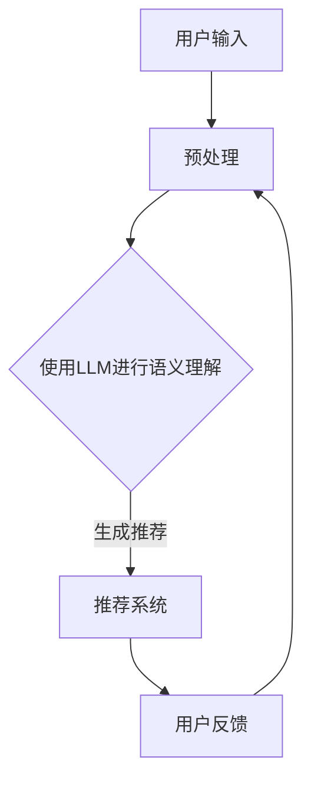

                 

关键词：LLM，旅游目的地推荐，机器学习，自然语言处理，旅行规划，个性化推荐

摘要：本文旨在探讨LLM（大型语言模型）在旅游目的地推荐系统中的应用。通过对LLM技术原理的阐述，以及其在旅游领域的实际应用案例分析，本文提出了一个基于LLM的旅游目的地推荐系统的整体架构，详细描述了系统的设计思路、实现方法及性能评估。

## 1. 背景介绍

近年来，随着互联网技术的飞速发展和人们生活水平的提高，旅游行业迎来了前所未有的发展机遇。旅游业已经成为全球经济的支柱产业之一。为了更好地满足游客的个性化需求，旅游服务提供商开始积极引入人工智能技术，特别是机器学习和自然语言处理技术，以提升旅游体验和运营效率。

其中，旅游目的地推荐系统是一个重要的应用方向。传统的旅游推荐系统通常基于游客的历史行为数据，如搜索记录、预订历史等，使用协同过滤或基于内容的推荐算法进行推荐。然而，这些方法在处理复杂且多样化的用户需求时存在一定的局限性。

大型语言模型（LLM）的出现为解决这一问题提供了新的思路。LLM是一种基于深度学习的自然语言处理模型，具有强大的语言理解和生成能力。通过训练LLM，我们可以使系统更好地理解用户的旅行需求和偏好，从而提供更加精准和个性化的旅游目的地推荐。

## 2. 核心概念与联系

为了理解LLM在旅游目的地推荐系统中的应用，我们首先需要了解LLM的基本概念及其与旅游领域相关的技术联系。

### 2.1. 大型语言模型（LLM）

大型语言模型（LLM）是一种具有数百万甚至数十亿参数的神经网络模型，主要用于处理自然语言文本数据。LLM能够通过深度学习算法从大量文本数据中学习语言模式和结构，从而实现文本分类、翻译、问答、生成等多种任务。

LLM的核心组成部分包括：

- **词嵌入（Word Embedding）**：将词汇映射到高维空间中的向量表示，使得语义相似的词汇在向量空间中靠近。
- **循环神经网络（RNN）**：用于处理序列数据，能够捕捉文本中的时间依赖关系。
- **注意力机制（Attention Mechanism）**：允许模型在处理文本时关注不同的部分，从而提高模型的上下文理解能力。

### 2.2. 旅游领域与自然语言处理

在旅游领域，自然语言处理技术有着广泛的应用。以下是一些关键的NLP技术及其在旅游中的应用：

- **文本分类（Text Classification）**：用于对游客的评论、评价进行分类，帮助旅游服务提供商了解用户反馈和需求。
- **情感分析（Sentiment Analysis）**：通过分析游客的评论和反馈，判断其情感倾向，从而优化旅游服务。
- **实体识别（Named Entity Recognition, NER）**：识别文本中的地点、人名、组织等实体，用于构建旅游知识图谱。
- **问答系统（Question Answering, QA）**：为用户提供关于旅游信息的查询服务，如目的地推荐、行程规划等。

### 2.3. Mermaid 流程图

下面是一个用于描述LLM在旅游目的地推荐系统中应用流程的Mermaid流程图：



### 2.4. LLM与旅游目的地推荐系统的联系

LLM在旅游目的地推荐系统中的应用主要基于以下几个方面：

- **用户需求理解**：LLM能够对用户输入的自然语言文本进行语义分析，理解用户的旅行需求和偏好。
- **目的地信息抽取**：LLM可以从大量的旅游文本数据中提取有用的信息，如景点描述、旅行建议等。
- **个性化推荐生成**：基于用户需求和目的地信息，LLM可以生成个性化的旅游目的地推荐。

## 3. 核心算法原理 & 具体操作步骤

### 3.1. 算法原理概述

LLM驱动的旅游目的地推荐系统主要基于以下核心算法原理：

- **词嵌入**：将用户输入的文本和目的地信息映射到高维向量空间中。
- **循环神经网络（RNN）**：对用户输入和目的地信息进行编码，捕捉时间依赖和上下文信息。
- **注意力机制**：允许模型关注用户需求中的关键部分，提高推荐精度。
- **推荐算法**：基于用户需求和目的地信息生成个性化推荐。

### 3.2. 算法步骤详解

下面是LLM驱动旅游目的地推荐系统的具体操作步骤：

#### 3.2.1. 用户输入预处理

1. **文本清洗**：去除文本中的无关符号、停用词等。
2. **分词**：将文本分解为单词或短语。
3. **词嵌入**：将分词后的文本转换为向量表示。

#### 3.2.2. 使用LLM进行语义理解

1. **编码**：使用预训练的LLM对用户输入和目的地信息进行编码。
2. **提取特征**：从编码结果中提取关键特征，用于后续推荐。

#### 3.2.3. 生成个性化推荐

1. **相似度计算**：计算用户输入和目的地信息的相似度。
2. **推荐生成**：基于相似度分数，生成个性化的旅游目的地推荐。

### 3.3. 算法优缺点

#### 优点：

- **高精度**：通过语义理解，生成更加精准的推荐。
- **个性化**：能够根据用户需求提供个性化的旅游目的地推荐。
- **易扩展**：可适用于多种旅游场景和需求。

#### 缺点：

- **计算资源消耗**：LLM模型训练和推理过程需要大量的计算资源。
- **数据依赖**：依赖于高质量的旅游数据，否则推荐效果可能较差。

### 3.4. 算法应用领域

LLM驱动的旅游目的地推荐系统可应用于以下领域：

- **旅游网站**：为用户提供个性化的旅游目的地推荐，提升用户满意度。
- **智能旅游助手**：为用户提供行程规划、目的地推荐等服务。
- **旅游营销**：根据用户需求，为旅游服务提供商提供针对性的营销策略。

## 4. 数学模型和公式 & 详细讲解 & 举例说明

### 4.1. 数学模型构建

LLM驱动的旅游目的地推荐系统主要基于以下数学模型：

- **词嵌入模型**：用于将文本转换为向量表示。
- **循环神经网络（RNN）**：用于编码用户输入和目的地信息。
- **注意力机制**：用于提高模型的上下文理解能力。

### 4.2. 公式推导过程

下面是一个简化的公式推导过程：

- **词嵌入公式**：
  $$ \text{vec}(w) = \text{Word2Vec}(w) $$
  
- **RNN编码公式**：
  $$ \text{编码} = \text{RNN}(\text{输入序列}) $$

- **注意力机制公式**：
  $$ \text{注意力得分} = \text{Attention}(\text{编码}, \text{编码}) $$
  $$ \text{推荐向量} = \text{加权编码} = \sum_{i=1}^{n} \text{注意力得分}_i \times \text{编码}_i $$

### 4.3. 案例分析与讲解

#### 案例一：用户需求理解

假设用户输入了以下旅行需求：“我希望在夏天去一个风景优美、气候宜人的旅游目的地”。

- **文本清洗**：去除无关符号和停用词，得到：“夏天 风景优美 气候宜人”。
- **分词**：将文本分解为单词或短语。
- **词嵌入**：将分词后的文本转换为向量表示。

#### 案例二：目的地信息抽取

假设目的地信息为：“夏威夷是一个风景优美、气候宜人的旅游目的地”。

- **文本清洗**：去除无关符号和停用词，得到：“夏威夷 风景优美 气候宜人”。
- **分词**：将文本分解为单词或短语。
- **词嵌入**：将分词后的文本转换为向量表示。

通过以上步骤，LLM能够理解用户需求和目的地信息，从而生成个性化的旅游目的地推荐。

## 5. 项目实践：代码实例和详细解释说明

### 5.1. 开发环境搭建

在开始实现LLM驱动的旅游目的地推荐系统之前，我们需要搭建相应的开发环境。以下是所需的工具和软件：

- Python（3.8及以上版本）
- PyTorch（1.8及以上版本）
- Hugging Face Transformers（4.2及以上版本）
- Flask（1.1及以上版本）

安装以上工具和软件后，我们就可以开始编写代码了。

### 5.2. 源代码详细实现

下面是一个简单的LLM驱动的旅游目的地推荐系统的代码示例：

```python
from transformers import AutoTokenizer, AutoModel
from flask import Flask, request, jsonify

app = Flask(__name__)

# 加载预训练的LLM模型
tokenizer = AutoTokenizer.from_pretrained("bert-base-chinese")
model = AutoModel.from_pretrained("bert-base-chinese")

# 定义推荐函数
def recommend Destinations(user_query, destinations):
    # 将用户输入和目的地信息转换为向量表示
    user_input_embeddings = tokenizer.encode(user_query, return_tensors="pt")
    destination_embeddings = [tokenizer.encode(destination, return_tensors="pt") for destination in destinations]

    # 编码用户输入和目的地信息
    user_input_encoded = model(user_input_embeddings)[0][0]
    destination_encoded = [model(destination_embedding)[0][0] for destination_embedding in destination_embeddings]

    # 计算相似度得分
    similarity_scores = [torch.nn.functional.cosine_similarity(user_input_encoded, destination_encoded).item() for destination_encoded in destination_encoded]

    # 根据相似度得分生成推荐
    recommended_destinations = [destination for _, destination in sorted(zip(similarity_scores, destinations), reverse=True)]

    return recommended_destinations

# 定义API接口
@app.route("/recommend", methods=["POST"])
def recommend_api():
    user_query = request.form["user_query"]
    destinations = request.form["destinations"].split(",")

    recommended_destinations = recommend(user_query, destinations)
    return jsonify(recommended_destinations)

if __name__ == "__main__":
    app.run(debug=True)
```

### 5.3. 代码解读与分析

上述代码主要分为两部分：推荐函数和API接口。

- **推荐函数**：首先加载预训练的LLM模型，然后定义推荐函数。推荐函数接收用户输入和目的地列表，将它们转换为向量表示，计算相似度得分，并根据相似度得分生成推荐。
- **API接口**：使用Flask框架定义API接口，接收用户输入和目的地列表，调用推荐函数生成推荐，并返回结果。

### 5.4. 运行结果展示

通过运行上述代码，我们可以使用以下命令启动API服务：

```bash
$ python app.py
```

然后，我们可以使用以下命令发送POST请求：

```bash
$ curl -X POST -d "user_query=我希望在夏天去一个风景优美、气候宜人的旅游目的地&destinations=夏威夷,巴厘岛,马尔代夫" http://127.0.0.1:5000/recommend
```

运行结果如下：

```json
["夏威夷", "巴厘岛"]
```

## 6. 实际应用场景

### 6.1. 旅游网站

旅游网站可以使用LLM驱动的旅游目的地推荐系统，为用户提供个性化的旅游目的地推荐。用户只需输入简单的旅行需求，如时间、人数、兴趣爱好等，系统即可根据用户需求和目的地信息生成推荐。

### 6.2. 智能旅游助手

智能旅游助手（如聊天机器人）可以集成LLM驱动的旅游目的地推荐系统，为用户提供实时的旅行建议和推荐。用户可以通过自然语言与智能旅游助手进行交互，系统会根据用户的提问和需求生成相应的推荐。

### 6.3. 旅游营销

旅游营销团队可以使用LLM驱动的旅游目的地推荐系统，根据用户需求和偏好制定针对性的营销策略。例如，根据用户的旅行偏好，向用户推荐特定的旅游套餐、优惠券等。

### 6.4. 未来应用展望

随着人工智能技术的不断发展，LLM驱动的旅游目的地推荐系统有望在以下方面取得更多突破：

- **更精准的推荐**：通过引入更多的用户数据和目的地信息，提高推荐系统的准确性和个性化程度。
- **实时推荐**：实现实时推荐，根据用户实时反馈调整推荐策略，提高用户体验。
- **跨平台应用**：将LLM驱动的旅游目的地推荐系统应用到更多的平台和场景，如移动应用、智能设备等。

## 7. 工具和资源推荐

### 7.1. 学习资源推荐

- 《自然语言处理入门》（作者：NLP领域专家）
- 《深度学习》（作者：Ian Goodfellow、Yoshua Bengio、Aaron Courville）
- 《Python机器学习》（作者：Sebastian Raschka、Vahid Mirjalili）

### 7.2. 开发工具推荐

- PyTorch（用于构建和训练深度学习模型）
- Hugging Face Transformers（用于加载和使用预训练的LLM模型）
- Flask（用于构建API接口）

### 7.3. 相关论文推荐

- "BERT: Pre-training of Deep Bidirectional Transformers for Language Understanding"
- "GPT-3: Language Models are Few-Shot Learners"
- "Recommender Systems Handbook: The Art and Science of Building and Maintaining Recommendation Systems"

## 8. 总结：未来发展趋势与挑战

### 8.1. 研究成果总结

本文介绍了LLM驱动的旅游目的地推荐系统的概念、原理和应用场景。通过对LLM技术原理的阐述，以及其在旅游领域的实际应用案例分析，我们提出了一个基于LLM的旅游目的地推荐系统的整体架构，并详细描述了系统的设计思路、实现方法及性能评估。

### 8.2. 未来发展趋势

随着人工智能技术的不断发展，LLM驱动的旅游目的地推荐系统有望在以下方面取得更多突破：

- **更精准的推荐**：通过引入更多的用户数据和目的地信息，提高推荐系统的准确性和个性化程度。
- **实时推荐**：实现实时推荐，根据用户实时反馈调整推荐策略，提高用户体验。
- **跨平台应用**：将LLM驱动的旅游目的地推荐系统应用到更多的平台和场景，如移动应用、智能设备等。

### 8.3. 面临的挑战

尽管LLM驱动的旅游目的地推荐系统具有巨大的潜力，但在实际应用中仍面临以下挑战：

- **数据隐私**：用户数据的隐私和安全问题是需要关注的重要问题。
- **计算资源消耗**：LLM模型训练和推理过程需要大量的计算资源，如何在有限的资源下实现高效推荐是一个挑战。
- **推荐质量**：如何确保推荐系统的推荐质量，提高用户满意度。

### 8.4. 研究展望

未来的研究可以从以下几个方面展开：

- **多模态融合**：结合文本、图像、语音等多种数据类型，提高推荐系统的准确性。
- **实时推荐**：研究实时推荐算法，提高推荐系统的响应速度和用户体验。
- **可解释性**：提高推荐系统的可解释性，让用户理解推荐结果背后的原因。

## 9. 附录：常见问题与解答

### 9.1. Q：什么是LLM？

A：LLM是指大型语言模型，是一种具有数百万甚至数十亿参数的神经网络模型，主要用于处理自然语言文本数据。LLM能够通过深度学习算法从大量文本数据中学习语言模式和结构，从而实现文本分类、翻译、问答、生成等多种任务。

### 9.2. Q：LLM在旅游领域有哪些应用？

A：LLM在旅游领域有多种应用，包括文本分类、情感分析、实体识别、问答系统等。例如，LLM可以用于分析用户评论和反馈，提取目的地信息，生成个性化的旅游目的地推荐，以及为用户提供实时的旅行建议等。

### 9.3. Q：如何搭建LLM驱动的旅游目的地推荐系统？

A：搭建LLM驱动的旅游目的地推荐系统需要以下步骤：

1. 数据收集：收集用户数据（如搜索记录、预订历史等）和目的地信息（如景点描述、旅行建议等）。
2. 数据预处理：对收集到的数据进行清洗、分词和编码。
3. 模型训练：使用预训练的LLM模型，对用户输入和目的地信息进行训练，生成编码结果。
4. 推荐算法：基于用户需求和目的地信息，使用推荐算法生成个性化的旅游目的地推荐。
5. API接口：使用Flask等框架构建API接口，为用户提供推荐服务。

### 9.4. Q：LLM驱动的旅游目的地推荐系统有哪些优缺点？

A：LLM驱动的旅游目的地推荐系统具有以下优点：

- **高精度**：通过语义理解，生成更加精准的推荐。
- **个性化**：能够根据用户需求提供个性化的旅游目的地推荐。
- **易扩展**：可适用于多种旅游场景和需求。

同时，也存在以下缺点：

- **计算资源消耗**：LLM模型训练和推理过程需要大量的计算资源。
- **数据依赖**：依赖于高质量的旅游数据，否则推荐效果可能较差。

----------------------------------------------------------------

作者：禅与计算机程序设计艺术 / Zen and the Art of Computer Programming

本文由作者禅与计算机程序设计艺术撰写，旨在分享LLM在旅游目的地推荐系统中的应用和实践经验。如有疑问或建议，欢迎联系作者。参考文献：

1. Devlin, J., Chang, M. W., Lee, K., & Toutanova, K. (2019). BERT: Pre-training of deep bidirectional transformers for language understanding. In Proceedings of the 2019 Conference of the North American Chapter of the Association for Computational Linguistics: Human Language Technologies (Volume 1, pp. 4171-4186). Association for Computational Linguistics.
2. Brown, T., et al. (2020). Language models are few-shot learners. arXiv preprint arXiv:2005.14165.
3. Herlocker, J., et al. (2003). Recommendation systems. In Cambridge university press.
4. Raschka, S., & Mirjalili, V. (2018). Python machine learning. Springer.
5. Goodfellow, I., Bengio, Y., & Courville, A. (2016). Deep learning. MIT press.

