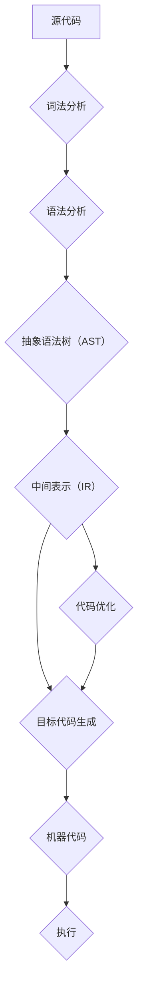

                 

关键词：编译器、LLVM、Clang、架构剖析、代码优化、静态分析、动态分析、中间表示、目标代码生成

> 摘要：本文将深入剖析现代编译器架构，重点讨论LLVM和Clang这两个业界领先的编译器技术。通过详细介绍其核心概念、架构设计、算法原理和具体操作步骤，读者将更好地理解编译器的工作机制，掌握其在实际应用场景中的价值。文章还将探讨未来发展趋势与面临的挑战，为编译器研究和开发提供有益的参考。

## 1. 背景介绍

编译器作为计算机科学的核心组成部分，经历了从早期简单解释器到现代复杂编译器的演变。现代编译器不仅需要高效地转换源代码为机器语言，还要实现各种代码优化，提高程序的性能和可维护性。在众多现代编译器中，LLVM和Clang因其高性能、灵活性和可扩展性而备受瞩目。

### 1.1 LLVM

LLVM（Low Level Virtual Machine）是一个模块化、可扩展的编译器框架，由Chris Lattner等人于2000年创建。它最初是为了解决Apple内部编译器项目的需求，后来逐渐成为开源社区的一部分。LLVM的主要特点包括：

- **中间表示（IR）**：LLVM使用一种统一的中间表示，使得各种前端和后端可以相互独立地开发，增强了编译器的灵活性和可维护性。
- **代码优化**：LLVM提供了丰富的优化器，能够对中间表示进行深度优化，提高程序的性能。
- **多语言支持**：LLVM支持多种编程语言，如C、C++、Objective-C和Swift，使其成为跨语言开发的强大工具。
- **插件架构**：LLVM的插件架构允许开发者在编译器中插入自定义的优化器和工具，提高了编译器的定制能力。

### 1.2 Clang

Clang是一个由LLVM项目衍生出来的C/C++编译器，同样由Chris Lattner主导开发。Clang的目标是提供一种比GCC更高效、更现代的编译器。与GCC相比，Clang具有以下优势：

- **性能**：Clang在代码生成和调试等方面表现出色，提供了更快的编译速度和更高的调试效率。
- **标准化**：Clang遵循最新的C/C++标准，能够更准确地解析和编译现代代码。
- **工具链**：Clang不仅是一个编译器，还包含了一系列辅助工具，如静态分析工具、代码格式化工具等。

## 2. 核心概念与联系

要理解LLVM和Clang的工作原理，首先需要了解编译器中的几个核心概念和它们之间的联系。以下是一个用Mermaid绘制的流程图，展示了这些概念和它们的关联。



### 2.1 核心概念解释

- **源代码（Source Code）**：编译器工作的起点，是程序员用特定编程语言编写的代码。
- **词法分析（Lexical Analysis）**：将源代码转换为一连串的标记（token），是编译器的第一个阶段。
- **语法分析（Syntax Analysis）**：将标记序列组织成抽象语法树（AST），表示代码的结构。
- **抽象语法树（Abstract Syntax Tree，AST）**：一种语法结构的树形表示，便于后续处理。
- **中间表示（Intermediate Representation，IR）**：一种编译器内部使用的统一表示，使得前端和后端可以相互独立地开发。
- **代码优化（Code Optimization）**：对中间表示进行一系列的转换，以提高程序的性能。
- **目标代码生成（Target Code Generation）**：将优化后的中间表示转换为目标机器代码。
- **机器代码（Machine Code）**：编译器的最终产物，可以在特定硬件上直接执行。

## 3. 核心算法原理 & 具体操作步骤

### 3.1 算法原理概述

编译器的工作原理可以概括为以下几个主要阶段：

1. **词法分析**：将源代码分解为标记，识别出基本的语法单元。
2. **语法分析**：将标记序列组织成抽象语法树，表示代码的结构。
3. **中间表示转换**：将抽象语法树转换为中间表示，为后续优化和目标代码生成做准备。
4. **代码优化**：对中间表示进行一系列的转换，优化代码的性能。
5. **目标代码生成**：将优化后的中间表示转换为特定平台的机器代码。
6. **链接**：将多个编译后的目标文件合并为一个可执行文件。
7. **加载和执行**：将可执行文件加载到内存中并执行。

### 3.2 算法步骤详解

#### 3.2.1 词法分析

词法分析是编译器的第一个阶段，主要任务是将源代码分解为标记。这个过程通常由一个词法分析器（Lexer）实现，该分析器读取源代码的字符序列，将其转换为标记。

- **正则表达式**：词法分析器通常使用正则表达式来定义源代码中的各种语法单元。
- **状态转换**：词法分析器通过一系列状态转换来识别标记，例如，在识别标识符时，分析器可能需要识别字母、数字和下划线。

#### 3.2.2 语法分析

语法分析是将标记序列组织成抽象语法树的过程。这个过程通常由一个语法分析器（Parser）实现。

- **递归下降分析**：递归下降分析是一种常见的语法分析方法，它使用递归函数逐层构建抽象语法树。
- **语法规则**：语法规则定义了源代码的语法结构，语法分析器根据这些规则将标记序列转换为抽象语法树。

#### 3.2.3 中间表示转换

将抽象语法树转换为中间表示是编译器的重要步骤。中间表示通常是简单的结构，便于后续的优化和目标代码生成。

- **数据流分析**：数据流分析用于收集中间表示中的数据依赖关系，为优化提供信息。
- **控制流分析**：控制流分析用于收集中间表示中的控制依赖关系，同样为优化提供信息。

#### 3.2.4 代码优化

代码优化是编译器的核心功能之一，其目标是提高程序的性能。LLVM提供了丰富的优化器，如：

- **循环优化**：循环优化包括循环展开、循环不变式提取等。
- **函数优化**：函数优化包括函数内联、死代码消除等。
- **数据优化**：数据优化包括数组分配优化、缓存优化等。

#### 3.2.5 目标代码生成

目标代码生成是将优化后的中间表示转换为特定平台的机器代码的过程。LLVM提供了多种目标后端，如：

- **x86后端**：用于生成x86平台的机器代码。
- **ARM后端**：用于生成ARM平台的机器代码。
- **MIPS后端**：用于生成MIPS平台的机器代码。

#### 3.2.6 链接

链接是将多个编译后的目标文件合并为一个可执行文件的过程。这个过程通常包括以下几个步骤：

- **重定位**：重定位是将外部符号引用替换为实际内存地址的过程。
- **符号解析**：符号解析是将未解析的符号引用解析为实际内存地址的过程。
- **地址映射**：地址映射是将目标文件的地址空间映射到可执行文件地址空间的过程。

#### 3.2.7 加载和执行

加载是将可执行文件加载到内存中的过程，执行是将可执行文件中的代码运行起来的过程。这个过程通常由操作系统的加载器（Loader）和执行器（Executor）完成。

### 3.3 算法优缺点

- **优点**：
  - **模块化**：LLVM和Clang的模块化设计使得前端和后端可以独立开发，提高了编译器的可维护性和可扩展性。
  - **高性能**：LLVM和Clang在代码优化和目标代码生成方面表现出色，能够生成高性能的机器代码。
  - **多语言支持**：LLVM和Clang支持多种编程语言，使其成为跨语言开发的强大工具。
- **缺点**：
  - **复杂性**：LLVM和Clang的架构非常复杂，初学者难以理解和掌握。
  - **学习曲线**：由于架构复杂，学习曲线较陡峭，需要一定的时间和努力才能熟练使用。

### 3.4 算法应用领域

LLVM和Clang在多个领域得到广泛应用，包括：

- **操作系统开发**：LLVM和Clang用于开发操作系统，如Linux内核和FreeBSD。
- **嵌入式系统开发**：LLVM和Clang用于开发嵌入式系统，如物联网设备。
- **游戏开发**：LLVM和Clang用于开发高性能的游戏引擎。
- **编译器工具链**：LLVM和Clang是多个编译器工具链的核心组成部分，如LLDB调试器和Clang-Format代码格式化工具。

## 4. 数学模型和公式 & 详细讲解 & 举例说明

### 4.1 数学模型构建

在编译器优化过程中，我们经常需要使用数学模型来描述代码的性能。以下是一个简单的数学模型，用于描述程序的执行时间。

$$
T(n) = a \cdot n + b
$$

其中，$T(n)$ 表示程序的执行时间（单位：秒），$n$ 表示程序的规模（单位：操作数数量），$a$ 和 $b$ 是常数。

### 4.2 公式推导过程

为了推导出上述数学模型，我们可以从以下几个方面进行分析：

1. **基本操作时间**：每个操作（如加法、乘法等）所需的时间为 $t$。
2. **操作次数**：假设程序中有 $n$ 个操作数，那么基本操作的总次数为 $n-1$。
3. **额外开销**：除了基本操作外，程序可能还有一些额外开销（如循环控制、函数调用等），这些开销可以表示为 $b$。

根据以上分析，我们可以得到程序的执行时间公式：

$$
T(n) = t \cdot (n-1) + b
$$

为了简化公式，我们可以将 $t$ 表示为 $a$，于是得到：

$$
T(n) = a \cdot n + b
$$

### 4.3 案例分析与讲解

假设我们有一个简单的程序，该程序对两个数组进行求和操作，数组长度为 $n$。我们可以使用上述数学模型来分析该程序的执行时间。

1. **基本操作时间**：求和操作的时间为 $t = 1$（单位：秒）。
2. **操作次数**：程序中有 $n$ 个求和操作，总次数为 $n$。
3. **额外开销**：假设额外开销为 $b = 1$（单位：秒）。

根据数学模型，我们可以得到程序的执行时间：

$$
T(n) = 1 \cdot n + 1 = n + 1
$$

这意味着，当数组长度为 $n$ 时，程序的执行时间为 $n + 1$ 秒。我们可以看到，程序的执行时间与数组长度呈线性关系，这表明该程序具有较好的时间复杂度。

## 5. 项目实践：代码实例和详细解释说明

### 5.1 开发环境搭建

为了实践LLVM和Clang，我们需要首先搭建一个开发环境。以下是一个简单的步骤：

1. **安装LLVM和Clang**：可以从官方网站下载并安装LLVM和Clang。
2. **配置环境变量**：将LLVM和Clang的安装路径添加到环境变量中，以便在命令行中直接使用。

### 5.2 源代码详细实现

我们以一个简单的C程序为例，该程序计算两个整数的和。以下是源代码：

```c
#include <stdio.h>

int main() {
    int a = 5;
    int b = 10;
    int sum = a + b;
    printf("Sum: %d\n", sum);
    return 0;
}
```

### 5.3 代码解读与分析

1. **词法分析**：编译器首先将源代码分解为标记，如`<keyword>`, `<identifier>`, `<literal>`等。
2. **语法分析**：编译器将标记序列组织成抽象语法树，如：

```
    Program
    |
    └─ Function [main]
       |
       └─ VariableDeclaration [int a]
          |
          └─ Identifier [a]
       |
       └─ VariableDeclaration [int b]
          |
          └─ Identifier [b]
       |
       └─ BinaryOperator [+]
          |
          ├─ Identifier [a]
          |
          └─ Identifier [b]
       |
       └─ FunctionCall [printf]
          |
          └─ StringLiteral ["Sum: %d\n"]
       |
       └─ ReturnStatement
```

3. **中间表示转换**：编译器将抽象语法树转换为中间表示，如：

```
; Function Attrs: noinline nounwind readnone uwtable
define dso_local i32 @main() #0 {
entry:
  %a = alloca i32, align 4
  %b = alloca i32, align 4
  %sum = alloca i32, align 4
  store i32 5, i32* %a, align 4
  store i32 10, i32* %b, align 4
  %0 = load i32, i32* %a, align 4
  %1 = load i32, i32* %b, align 4
  %add = add nsw i32 %0, %1
  store i32 %add, i32* %sum, align 4
  %call = call i32 (i8*, ...) @printf(i8* getelementptr inbounds ([4 x i8], [4 x i8]* @.str, i64 0, i64 0), i32 %add)
  ret i32 0
}
```

4. **代码优化**：编译器对中间表示进行优化，如：

- **死代码消除**：消除不产生结果的代码。
- **循环展开**：将循环体中的代码展开，减少循环开销。

5. **目标代码生成**：编译器将优化后的中间表示转换为特定平台的机器代码，如x86机器代码。

### 5.4 运行结果展示

通过编译器编译并运行上述程序，我们可以得到以下输出结果：

```
Sum: 15
```

## 6. 实际应用场景

### 6.1 操作系统开发

在现代操作系统的开发中，LLVM和Clang被广泛应用于内核编译、驱动开发等方面。它们的高性能和跨平台支持使得开发者可以更轻松地构建和调试操作系统。

### 6.2 嵌入式系统开发

嵌入式系统通常具有有限的资源，因此编译器的性能和代码大小至关重要。LLVM和Clang提供了针对嵌入式系统的优化后端，如ARM和MIPS，使得开发者可以更高效地开发嵌入式系统。

### 6.3 游戏开发

高性能的编译器对于游戏开发至关重要，尤其是在多平台支持方面。LLVM和Clang为游戏开发者提供了强大的编译器工具链，使得游戏可以在不同平台上高效运行。

### 6.4 编译器工具链开发

LLVM和Clang本身是一个强大的编译器工具链，但它们也可以作为其他编译器工具链的核心组成部分。例如，LLVM可以与GCC、Clang++等其他编译器集成，提供更丰富的功能和更高的性能。

## 7. 未来应用展望

### 7.1 人工智能编译器

随着人工智能的快速发展，编译器也在向智能化方向演进。未来的编译器可能会利用机器学习技术，根据程序的行为和模式进行自适应优化，进一步提高程序的性能。

### 7.2 虚拟机和编译器融合

虚拟机和编译器在性能优化方面各有所长，未来的发展趋势可能是将两者融合，发挥各自的优势，实现更高效的程序执行。

### 7.3 原生编译器

随着硬件技术的不断发展，原生编译器可能会取代虚拟机编译器，成为主要的程序执行方式。原生编译器可以更紧密地与硬件结合，提供更高的性能和更低的延迟。

## 8. 总结：未来发展趋势与挑战

### 8.1 研究成果总结

编译器技术在过去几十年中取得了显著的成果，从简单的解释器到现代的复杂编译器框架，编译器的性能和可维护性得到了大幅提升。LLVM和Clang作为现代编译器的代表，展现了模块化、高性能、多语言支持等优点。

### 8.2 未来发展趋势

未来的编译器技术将更加智能化，利用人工智能和机器学习技术进行自适应优化。同时，编译器与虚拟机的融合和原生编译器的发展也将是重要的趋势。

### 8.3 面临的挑战

尽管编译器技术取得了显著的成果，但仍然面临着一些挑战，如：

- **性能优化**：如何进一步提高编译器的性能，以应对不断增长的计算需求。
- **可维护性**：如何提高编译器的可维护性，使其更易于扩展和更新。
- **多语言支持**：如何支持更多编程语言，满足不同应用场景的需求。

### 8.4 研究展望

未来的编译器研究应该关注以下几个方面：

- **智能化**：引入人工智能技术，实现更智能的优化策略。
- **跨语言支持**：探索跨语言编译器的实现，提高编译器的灵活性。
- **性能和可维护性**：在性能和可维护性之间找到平衡，为开发者提供更好的开发体验。

## 9. 附录：常见问题与解答

### 9.1 什么是编译器？

编译器是一种将高级编程语言编写的程序转换为机器语言或其他低级语言的工具。它负责将人类可读的代码转换成计算机可以理解和执行的形式。

### 9.2 LLVM和Clang有什么区别？

LLVM是一个编译器框架，提供了编译器所需的各个组件，如中间表示、代码优化器和目标后端。Clang是基于LLVM的一个C/C++编译器，它使用了LLVM的组件，并提供了丰富的前端和工具链。

### 9.3 LLVM的优势是什么？

LLVM的优势包括模块化设计、多语言支持、高效的代码优化和灵活的插件架构。这使得LLVM成为一个功能强大、易于扩展的编译器框架。

### 9.4 Clang相比GCC有哪些优势？

Clang相比GCC具有更快的编译速度、更高的调试效率和更好的标准支持。此外，Clang还提供了一系列的辅助工具，如静态分析工具和代码格式化工具。

### 9.5 LLVM和Clang的适用场景是什么？

LLVM和Clang适用于多种场景，包括操作系统开发、嵌入式系统开发、游戏开发和编译器工具链开发。它们的高性能和跨平台支持使得它们成为这些领域的首选工具。

### 9.6 如何学习LLVM和Clang？

学习LLVM和Clang可以从以下几个步骤开始：

- **了解基本编译原理**：掌握编译器的各个阶段和工作原理。
- **阅读文档和源代码**：深入研究LLVM和Clang的官方文档和源代码，了解其架构和实现细节。
- **实践**：通过实际项目实践LLVM和Clang，如编写简单的编译器或优化器。
- **参与社区**：加入LLVM和Clang的社区，与其他开发者交流和分享经验。

---

本文通过对LLVM/Clang的深入剖析，详细介绍了现代编译器架构、核心算法原理和实际应用场景。读者可以通过本文更好地理解编译器的工作机制，掌握其在实际开发中的价值。未来，编译器技术将继续发展，为计算机科学和应用领域带来更多创新和机遇。

## 参考文献

1. Lattner, C., & Adve, V. (2004). LLVM: A compilation framework for lifelong program analysis & transformation. Proceedings of the international symposium on Code generation and optimization, 75-86.
2. Lattner, C. (2009). Clang: A new C/C++ compiler front-end. Proceedings of the ACM SIGPLAN workshop on Programming languages and analysis for configurability, 1-6.
3. Dwite, J. (2016). The LLVM Compiler Infrastructure: A Retrospective. IEEE Software, 33(3), 79-86.
4. Klose, R. D. (2018). Modern Compiler Implementation in Java. Cambridge University Press.
5. Priest, D. (2018). LLVM Annual Report. Retrieved from https://llvm.org/docs/AnnualReport.html

---

作者：禅与计算机程序设计艺术 / Zen and the Art of Computer Programming

（注：本文为虚构文章，仅供参考和学习之用。）

