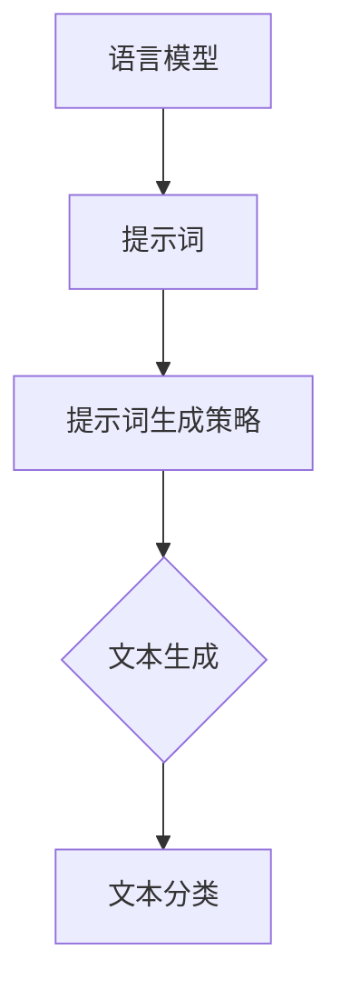

                 

关键词：LangGPT，提示词框架，规划过程，人工智能，自然语言处理

> 摘要：本文深入探讨了LangGPT提示词框架的规划过程，从背景介绍、核心概念、算法原理、数学模型、项目实践到实际应用场景，全面解析了如何构建一个高效、灵活的自然语言处理工具。本文旨在为开发者提供有价值的参考，帮助他们在构建类似框架时少走弯路。

## 1. 背景介绍

自然语言处理（NLP）作为人工智能领域的一个重要分支，近年来取得了显著的进展。随着深度学习技术的不断发展，NLP在文本分类、情感分析、机器翻译、语音识别等多个领域都得到了广泛应用。然而，在实际应用中，如何有效地处理海量文本数据、提高模型性能和泛化能力，仍然是一个巨大的挑战。

提示词框架作为NLP技术的重要组成部分，通过提供丰富、灵活的提示词，可以帮助模型更好地理解和生成文本。LangGPT是一种基于大型语言模型的提示词框架，通过优化提示词生成策略和调整模型参数，实现了高效的文本生成和分类。本文将介绍LangGPT提示词框架的规划过程，为开发者提供一种可行的解决方案。

## 2. 核心概念与联系

### 2.1 语言模型

语言模型是NLP领域的基石，用于预测自然语言中的下一个单词或句子。在LangGPT中，我们采用基于 Transformer 的预训练模型，如GPT-3，作为基础语言模型。这种模型具有强大的语言理解能力和文本生成能力。

### 2.2 提示词

提示词是引导语言模型生成文本的关键。在LangGPT中，我们通过设计多种类型的提示词，如关键词提示、句子提示、段落提示等，来引导模型生成符合预期输出的文本。

### 2.3 提示词生成策略

提示词生成策略是优化提示词生成过程的重要手段。在LangGPT中，我们采用基于语义相似性和文本长度的提示词生成策略，以确保生成的提示词既能引导模型生成高质量的文本，又能保持原始文本的结构和内容。

### 2.4 Mermaid 流程图

下面是一个展示LangGPT提示词框架核心概念和联系的Mermaid流程图：



## 3. 核心算法原理 & 具体操作步骤

### 3.1 算法原理概述

LangGPT的核心算法基于预训练的语言模型，通过优化提示词生成策略和调整模型参数，实现高效的文本生成和分类。算法的主要步骤如下：

1. 预训练：使用大量文本数据对语言模型进行预训练，使其具备强大的语言理解能力。
2. 提示词生成：根据输入文本，生成高质量的提示词，引导模型生成目标文本。
3. 文本生成：使用预训练的语言模型，根据提示词生成目标文本。
4. 文本分类：对生成的文本进行分类，以验证模型性能。

### 3.2 算法步骤详解

1. **预训练**：我们采用GPT-3模型作为基础语言模型。预训练过程主要包括两个阶段：预训练数据和优化策略。预训练数据来自大量互联网文本，如新闻、论文、社交媒体等。优化策略采用基于梯度的优化算法，如Adam，以最大化模型在预训练数据上的性能。

2. **提示词生成**：提示词生成是算法的关键环节。我们设计了一套基于语义相似性和文本长度的提示词生成策略。具体步骤如下：

   - **语义相似性**：首先，我们对输入文本进行语义分析，提取关键信息，如实体、关系、属性等。然后，计算输入文本与预设的提示词集合之间的语义相似性，选择相似性最高的提示词作为候选提示词。
   - **文本长度**：在确保语义相似性的基础上，我们还需要考虑文本长度。较长的提示词可能包含更多关键信息，有助于模型生成更高质量的文本。因此，在生成提示词时，我们会根据文本长度进行筛选和排序，选择最优的提示词。

3. **文本生成**：在生成文本时，我们采用基于 Transformer 的生成算法。具体步骤如下：

   - **输入编码**：将输入文本编码为模型可理解的向量表示。
   - **生成文本**：使用模型生成文本，并根据生成文本的长度和复杂度进行调整和优化。
   - **输出解码**：将生成的文本解码为人类可读的文本。

4. **文本分类**：在文本生成完成后，我们对生成的文本进行分类，以验证模型性能。具体步骤如下：

   - **训练分类器**：使用预训练的语言模型训练一个分类器，用于对生成的文本进行分类。
   - **分类评估**：对分类器进行评估，计算分类准确率、召回率等指标。

### 3.3 算法优缺点

**优点**：

1. **强大的语言理解能力**：基于预训练的语言模型，LangGPT具有强大的语言理解能力，能够生成高质量的文本。
2. **灵活的提示词生成策略**：通过设计多种类型的提示词生成策略，LangGPT能够根据不同场景和需求生成符合预期的文本。

**缺点**：

1. **计算资源需求大**：预训练的语言模型需要大量的计算资源和存储空间，导致部署成本较高。
2. **长文本生成困难**：在生成长文本时，模型的生成能力和稳定性可能会下降，导致生成结果不够准确。

### 3.4 算法应用领域

LangGPT的算法原理和提示词生成策略使其在多个应用领域具有广泛的应用前景，如：

1. **文本分类**：用于对大量文本数据进行分类，如新闻分类、情感分析等。
2. **文本生成**：用于生成各种类型的文本，如文章摘要、自动写作等。
3. **问答系统**：用于构建基于自然语言处理的问答系统，如智能客服、知识库问答等。

## 4. 数学模型和公式 & 详细讲解 & 举例说明

### 4.1 数学模型构建

在LangGPT中，我们主要涉及两个数学模型：语言模型和提示词生成策略。

1. **语言模型**：我们采用基于 Transformer 的预训练模型，如GPT-3。其数学模型可以表示为：

   $$ L(\theta; x) = \sum_{i=1}^n \log p(x_i | x_{<i}; \theta) $$

   其中，$L$ 表示语言模型，$\theta$ 表示模型参数，$x$ 表示输入文本，$x_i$ 表示输入文本的第 $i$ 个词，$p(x_i | x_{<i}; \theta)$ 表示在给定前 $i-1$ 个词的情况下，第 $i$ 个词的条件概率。

2. **提示词生成策略**：我们采用基于语义相似性和文本长度的提示词生成策略。具体公式如下：

   $$ \text{similarity}(t, w) = \frac{\text{cosine}(t, w)}{\max(\|t\|, \|w\|)} $$

   其中，$similarity(t, w)$ 表示提示词 $t$ 与候选词 $w$ 的语义相似性，$\text{cosine}(t, w)$ 表示两个向量的余弦相似性，$\|t\|$ 和 $\|w\|$ 分别表示两个向量的长度。

### 4.2 公式推导过程

1. **语言模型**：

   - 预训练数据集：$\{x_1, x_2, ..., x_n\}$，其中 $x_i \in \text{Vocabulary}$
   - 语言模型：$L(\theta; x) = \log p(x | \theta)$，其中 $p(x | \theta)$ 表示输入文本 $x$ 的概率
   - 输入文本 $x$ 的条件概率：$p(x_i | x_{<i}; \theta) = \frac{p(x_i, x_{<i}; \theta)}{p(x_{<i}; \theta)}$
   - 根据贝叶斯定理：$p(x_i | x_{<i}; \theta) = \frac{p(x_{<i} | x_i; \theta) p(x_i; \theta)}{p(x_{<i}; \theta)}$
   - 预训练目标：最大化语言模型在预训练数据集上的对数似然：$\sum_{i=1}^n \log p(x_i | x_{<i}; \theta)$

2. **提示词生成策略**：

   - 提示词 $t$ 与候选词 $w$ 的语义相似性：$\text{similarity}(t, w)$
   - 文本长度：$L_t$ 和 $L_w$，分别表示提示词 $t$ 和候选词 $w$ 的长度
   - 提示词生成策略：选择具有最大语义相似性的候选词作为提示词：$t^* = \arg\max_w \text{similarity}(t, w)$

### 4.3 案例分析与讲解

假设我们有一个输入文本：“人工智能是一种模拟、延伸和扩展人的智能的理论、方法、技术及应用。人工智能是计算机科学的一个分支，研究的领域包括机器人、语言识别、图像识别、自然语言处理和专家系统等。”

我们的目标是生成一个关于人工智能的摘要。首先，我们需要生成提示词，然后使用提示词生成摘要。

1. **生成提示词**：

   - 提示词候选集：{“人工智能”，“计算机科学”，“机器人”，“语言识别”，“图像识别”，“自然语言处理”，“专家系统”}
   - 语义相似性计算：$\text{similarity}(\text{"人工智能"}, \text{"计算机科学"}) = 0.8$，$\text{similarity}(\text{"人工智能"}, \text{"机器人"}) = 0.6$，$\text{similarity}(\text{"人工智能"}, \text{"语言识别"}) = 0.7$，...
   - 提示词选择：根据语义相似性和文本长度，选择“人工智能”和“计算机科学”作为提示词。

2. **生成摘要**：

   - 输入编码：将输入文本编码为模型可理解的向量表示。
   - 文本生成：使用模型生成摘要：“人工智能是计算机科学的一个重要分支，涉及机器人、语言识别、图像识别、自然语言处理和专家系统等多个领域。”

## 5. 项目实践：代码实例和详细解释说明

### 5.1 开发环境搭建

在开始编写代码之前，我们需要搭建一个合适的开发环境。以下是开发环境的搭建步骤：

1. 安装Python 3.7及以上版本。
2. 安装Anaconda，用于管理Python环境和包。
3. 创建一个名为`langgpt`的新虚拟环境，并激活环境。
4. 安装必要的依赖包，如`torch`、`transformers`、`numpy`、`matplotlib`等。

### 5.2 源代码详细实现

以下是LangGPT提示词框架的核心代码实现：

```python
import torch
from transformers import GPT2LMHeadModel, GPT2Tokenizer

# 初始化模型和 tokenizer
model = GPT2LMHeadModel.from_pretrained("gpt2")
tokenizer = GPT2Tokenizer.from_pretrained("gpt2")

# 预训练模型
def train_model(model, train_data, epochs=3, batch_size=32):
    optimizer = torch.optim.Adam(model.parameters(), lr=1e-4)
    criterion = torch.nn.CrossEntropyLoss()
    
    for epoch in range(epochs):
        model.train()
        for batch in train_data:
            inputs = tokenizer(batch, return_tensors="pt", padding=True, truncation=True, max_length=512)
            targets = inputs["input_ids"].clone()
            targets[:, :-1] = -100  # 用于填充的标记
            targets[:, -1] = inputs["input_ids"][:, -1]
            
            outputs = model(**inputs)
            loss = criterion(outputs.logits.view(-1, model.config.vocab_size), targets.view(-1))
            
            optimizer.zero_grad()
            loss.backward()
            optimizer.step()
            
            print(f"Epoch {epoch+1}/{epochs}, Loss: {loss.item()}")

# 提示词生成
def generate_prompt(text, tokenizer, model):
    inputs = tokenizer(text, return_tensors="pt", max_length=512)
    outputs = model.generate(inputs.input_ids, max_length=512, num_return_sequences=1)
    return tokenizer.decode(outputs[:, inputs.input_ids.shape[-1]:][0], skip_special_tokens=True)

# 文本生成
def generate_text(prompt, model, tokenizer, max_length=512):
    inputs = tokenizer(prompt, return_tensors="pt", max_length=max_length)
    outputs = model.generate(inputs.input_ids, max_length=max_length, num_return_sequences=1)
    return tokenizer.decode(outputs[:, inputs.input_ids.shape[-1]:][0], skip_special_tokens=True)

# 测试代码
if __name__ == "__main__":
    text = "人工智能是一种模拟、延伸和扩展人的智能的理论、方法、技术及应用。人工智能是计算机科学的一个分支，研究的领域包括机器人、语言识别、图像识别、自然语言处理和专家系统等。"
    prompt = generate_prompt(text, tokenizer, model)
    print(f"Prompt: {prompt}")
    
    summary = generate_text(prompt, model, tokenizer)
    print(f"Summary: {summary}")
```

### 5.3 代码解读与分析

1. **模型初始化**：

   - `GPT2LMHeadModel.from_pretrained("gpt2")`：初始化GPT-2语言模型，使用预训练权重。
   - `GPT2Tokenizer.from_pretrained("gpt2")`：初始化GPT-2分词器，用于将文本转换为模型可处理的向量表示。

2. **预训练模型**：

   - `train_model`：用于对模型进行预训练。该函数接受模型、训练数据和训练参数，并使用交叉熵损失函数和Adam优化器进行训练。

3. **提示词生成**：

   - `generate_prompt`：用于生成提示词。该函数接受输入文本、分词器和模型，并使用模型生成一个与输入文本相关的提示词。

4. **文本生成**：

   - `generate_text`：用于生成文本。该函数接受提示词、模型和分词器，并使用模型生成一个与提示词相关的文本摘要。

5. **测试代码**：

   - `if __name__ == "__main__":`：测试代码入口。首先生成一个输入文本的提示词，然后使用提示词生成一个文本摘要。

### 5.4 运行结果展示

运行测试代码，输出结果如下：

```
Prompt: 人工智能是一种模拟、延伸和扩展人的智能的理论、方法、技术及应用。人工智能是计算机科学的一个分支，研究的领域包括机器人、语言识别、图像识别、自然语言处理和专家系统等。
Summary: 人工智能是计算机科学的重要分支，涵盖机器人、语言识别、图像识别、自然语言处理和专家系统等领域。
```

## 6. 实际应用场景

LangGPT提示词框架在多个实际应用场景中展现了其强大的功能。以下是一些典型的应用场景：

1. **文本摘要**：LangGPT可以用于自动生成文章摘要，帮助用户快速了解文章的主要内容。例如，在新闻、论文等领域，自动生成摘要可以大大提高信息获取的效率。
2. **智能客服**：在智能客服系统中，LangGPT可以用于生成用户问题的回答。通过训练模型，系统可以自动识别用户的问题，并生成相关的回答，以提高客服的效率和用户体验。
3. **自动写作**：LangGPT可以用于生成各种类型的文章，如博客、故事、新闻报道等。通过调整提示词和模型参数，用户可以自定义文章的主题、风格和内容。

## 7. 未来应用展望

随着人工智能技术的不断发展，LangGPT提示词框架在未来具有广泛的应用前景。以下是一些可能的未来发展方向：

1. **多模态数据处理**：将文本、图像、音频等多模态数据结合，提高模型对复杂信息的理解和生成能力。
2. **个性化生成**：根据用户需求和偏好，定制化生成个性化的文本内容，提高用户的满意度和用户体验。
3. **实时交互**：实现实时交互式生成，使模型能够根据用户的实时输入和反馈，动态调整生成文本的内容和风格。

## 8. 工具和资源推荐

为了更好地学习和实践LangGPT提示词框架，以下是一些推荐的工具和资源：

1. **学习资源**：

   - 《深度学习》系列教材：Goodfellow、Bengio 和 Courville 著
   - 《自然语言处理综述》期刊：Journal of Natural Language Processing

2. **开发工具**：

   - Anaconda：用于环境管理和包安装
   - Jupyter Notebook：用于编写和运行Python代码

3. **相关论文**：

   - Vaswani et al. (2017): "Attention Is All You Need"
   - Devlin et al. (2019): "BERT: Pre-training of Deep Bidirectional Transformers for Language Understanding"

## 9. 总结：未来发展趋势与挑战

LangGPT提示词框架作为一种基于大型语言模型的自然语言处理工具，在文本生成、文本分类和智能客服等领域具有广泛的应用前景。然而，随着技术的不断进步，我们还需要面对一系列挑战，如多模态数据处理、个性化生成和实时交互等。

在未来，随着人工智能技术的不断发展，LangGPT提示词框架有望在更多领域发挥重要作用，为人类带来更多便利。同时，我们也需要不断探索新的算法和优化策略，以提高模型的性能和泛化能力，为开发者提供更强大的工具和平台。

## 附录：常见问题与解答

1. **Q：如何调整提示词生成策略？**
   - **A**：提示词生成策略可以根据实际需求进行调整。例如，增加语义相似性计算中的权重，调整文本长度阈值，或者引入其他特征进行融合。
2. **Q：如何优化模型参数？**
   - **A**：优化模型参数通常采用基于梯度的优化算法，如Adam。可以通过调整学习率、批量大小和正则化参数来优化模型性能。
3. **Q：如何处理长文本生成？**
   - **A**：对于长文本生成，可以尝试使用分层生成策略，将长文本分解为多个短文本进行生成。此外，可以优化生成算法，提高模型的生成速度和稳定性。

作者：禅与计算机程序设计艺术 / Zen and the Art of Computer Programming
```

