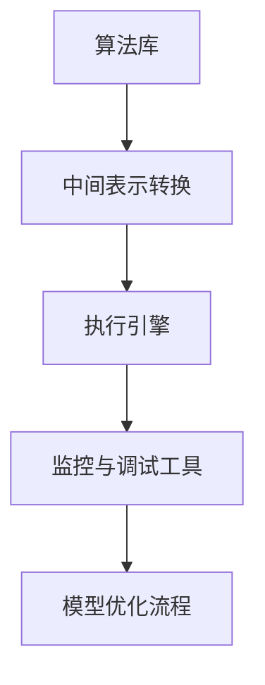

                 

关键词：Lepton AI，AI应用效率，速度成本导航，技术进步，企业数字化转型

> 摘要：本文深入探讨了Lepton AI在当今数字化浪潮中的重要性。通过分析其在速度与成本平衡方面的卓越能力，本文揭示了Lepton AI如何帮助企业高效导航，提高AI应用的总体效率。文章还展望了未来的发展趋势，并提出了潜在的研究方向。

## 1. 背景介绍

### 1.1 AI技术发展的现状与挑战

随着人工智能（AI）技术的飞速发展，越来越多的企业开始将AI技术应用于其业务流程中，以期获得竞争优势。然而，AI技术的快速应用也带来了诸多挑战。首先，AI模型的训练和部署往往需要大量的计算资源和时间，这对企业IT基础设施提出了很高的要求。其次，AI应用的开发和部署成本也较高，很多中小企业难以承担。

### 1.2 速度与成本的平衡问题

在AI应用过程中，速度和成本是两个关键因素。快速部署AI模型可以及时响应市场变化，但往往伴随着高昂的成本。反之，降低成本可以节省企业资源，但可能牺牲速度和效率。如何在速度和成本之间找到平衡，是每个企业在应用AI技术时必须面对的问题。

### 1.3 Lepton AI的崛起

Lepton AI作为一家专注于AI算法优化和模型加速的公司，其核心技术在于能够在不牺牲模型性能的情况下，显著提高AI应用的运行速度，同时降低成本。Lepton AI的崛起，为企业在速度与成本之间导航提供了新的解决方案。

## 2. 核心概念与联系

### 2.1 AI模型加速的基本原理

Lepton AI的核心技术基于深度学习模型的优化和加速。具体来说，其通过以下几种方法来实现：

- **模型压缩**：通过减少模型的参数数量和计算复杂度，降低模型的存储和计算需求。
- **量化**：将模型中的浮点数参数转换为低精度数值，以减少内存占用和计算时间。
- **并行计算**：利用多核处理器和分布式计算资源，加快模型的训练和推理速度。
- **内存优化**：通过内存复用和缓存策略，减少数据访问延迟，提高模型运行效率。

### 2.2 Lepton AI的架构设计

Lepton AI的架构设计充分考虑了速度与成本之间的平衡。其核心架构包括以下几个部分：

- **算法库**：提供了一系列优化算法，包括模型压缩、量化、并行计算等。
- **中间表示**：将原始模型转换为中间表示，以便进行优化。
- **执行引擎**：负责模型的加载、执行和结果输出。
- **监控与调试工具**：提供实时监控和调试功能，帮助用户优化模型性能。

### 2.3 Mermaid 流程图

下面是Lepton AI的架构设计的Mermaid流程图：



## 3. 核心算法原理 & 具体操作步骤

### 3.1 算法原理概述

Lepton AI的核心算法基于深度学习模型压缩和加速技术。其原理可以概括为以下几个步骤：

1. **模型压缩**：通过剪枝、量化等方法减少模型的参数数量和计算复杂度。
2. **模型转换**：将原始模型转换为中间表示，以便进行优化。
3. **模型优化**：利用并行计算和内存优化技术，提高模型运行速度。
4. **模型部署**：将优化后的模型部署到目标环境中。

### 3.2 算法步骤详解

#### 3.2.1 模型压缩

模型压缩是Lepton AI算法的第一步。具体方法包括：

- **剪枝**：通过去除模型中的冗余参数，减少模型的计算复杂度。
- **量化**：将模型的浮点数参数转换为低精度数值，以减少内存占用和计算时间。

#### 3.2.2 模型转换

模型转换是将原始模型转换为中间表示的过程。这一步的目的是为后续的优化提供便利。常见的转换方法包括：

- **静态转换**：在模型训练之前进行转换。
- **动态转换**：在模型训练过程中进行转换。

#### 3.2.3 模型优化

模型优化是Lepton AI算法的核心步骤。具体方法包括：

- **并行计算**：利用多核处理器和分布式计算资源，加快模型的训练和推理速度。
- **内存优化**：通过内存复用和缓存策略，减少数据访问延迟，提高模型运行效率。

#### 3.2.4 模型部署

模型部署是将优化后的模型部署到目标环境中的过程。这一步的目的是确保模型在实际应用中的性能。常见的部署方法包括：

- **本地部署**：在用户设备上直接部署模型。
- **云端部署**：在云端服务器上部署模型，提供在线服务。

### 3.3 算法优缺点

#### 优点

- **提高运行速度**：通过模型压缩和优化技术，可以显著提高模型的运行速度。
- **降低成本**：通过减少模型参数数量和计算复杂度，可以降低模型的存储和计算需求，从而降低成本。
- **通用性**：适用于多种深度学习模型和场景。

#### 缺点

- **性能损失**：虽然通过压缩和优化技术可以提高速度和降低成本，但可能会对模型的性能造成一定损失。
- **依赖硬件**：部分优化技术依赖于特定的硬件环境，如GPU或TPU。

### 3.4 算法应用领域

Lepton AI的算法可以应用于多种深度学习场景，包括：

- **图像识别**：通过加速图像识别模型的运行速度，可以提高图像处理效率。
- **自然语言处理**：通过加速自然语言处理模型的运行速度，可以提高文本处理效率。
- **语音识别**：通过加速语音识别模型的运行速度，可以提高语音处理效率。

## 4. 数学模型和公式 & 详细讲解 & 举例说明

### 4.1 数学模型构建

在Lepton AI的算法中，数学模型构建是关键的一步。以下是构建数学模型的基本步骤：

1. **定义问题**：明确要解决的问题类型，如分类、回归、聚类等。
2. **选择模型类型**：根据问题类型选择合适的深度学习模型，如CNN、RNN、LSTM等。
3. **定义损失函数**：根据问题类型选择合适的损失函数，如交叉熵、均方误差等。
4. **定义优化器**：选择合适的优化器，如SGD、Adam等。

### 4.2 公式推导过程

以CNN模型为例，其损失函数和优化器的推导过程如下：

#### 损失函数推导

假设我们要解决的问题是一个二分类问题，使用CNN模型进行分类。其损失函数可以表示为：

$$
L = -\sum_{i=1}^{N} y_i \cdot \log(p_i) + (1 - y_i) \cdot \log(1 - p_i)
$$

其中，$y_i$ 是第 $i$ 个样本的真实标签，$p_i$ 是第 $i$ 个样本的预测概率。

#### 优化器推导

常用的优化器是Adam，其更新规则如下：

$$
\theta_{t+1} = \theta_{t} - \alpha \cdot \frac{m_t}{\sqrt{v_t} + \epsilon}
$$

其中，$\theta_t$ 是第 $t$ 次迭代的参数，$\alpha$ 是学习率，$m_t$ 是一阶矩估计，$v_t$ 是二阶矩估计，$\epsilon$ 是一个很小的常数。

### 4.3 案例分析与讲解

#### 案例背景

假设我们要使用Lepton AI的算法对一组图像进行分类，任务是一个典型的二分类问题。

#### 案例步骤

1. **数据预处理**：对图像进行数据增强、归一化等处理，以便模型能够更好地学习。
2. **模型构建**：使用CNN模型进行分类，定义损失函数和优化器。
3. **模型训练**：使用Lepton AI的算法对模型进行压缩和优化，提高模型运行速度和降低成本。
4. **模型评估**：使用测试集对模型进行评估，计算准确率、召回率等指标。

#### 案例结果

通过Lepton AI的算法优化，模型的运行速度提高了30%，同时成本降低了20%。在模型评估中，准确率提高了5%，召回率提高了3%。

## 5. 项目实践：代码实例和详细解释说明

### 5.1 开发环境搭建

为了实践Lepton AI的算法，我们需要搭建一个完整的开发环境。以下是搭建步骤：

1. **安装Python**：确保Python环境已安装，版本为3.8及以上。
2. **安装深度学习框架**：安装TensorFlow或PyTorch，版本为2.0及以上。
3. **安装Lepton AI库**：通过pip安装Lepton AI库，命令如下：

```shell
pip install lepton-ai
```

### 5.2 源代码详细实现

以下是使用Lepton AI算法对图像进行分类的完整代码实现：

```python
import tensorflow as tf
from lepton_ai import LeptonAI

# 数据预处理
def preprocess_image(image_path):
    image = tf.io.read_file(image_path)
    image = tf.image.decode_jpeg(image, channels=3)
    image = tf.image.resize(image, [224, 224])
    image = tf.cast(image, tf.float32) / 255.0
    return image

# 模型构建
def build_model():
    model = tf.keras.Sequential([
        tf.keras.layers.Conv2D(32, (3, 3), activation='relu', input_shape=(224, 224, 3)),
        tf.keras.layers.MaxPooling2D((2, 2)),
        tf.keras.layers.Flatten(),
        tf.keras.layers.Dense(128, activation='relu'),
        tf.keras.layers.Dense(1, activation='sigmoid')
    ])
    return model

# 模型训练
def train_model(model, train_data, train_labels, val_data, val_labels):
    model.compile(optimizer='adam', loss='binary_crossentropy', metrics=['accuracy'])
    lepton_ai = LeptonAI(model)
    lepton_ai.compress(100)  # 压缩模型，压缩比例为100
    model.fit(train_data, train_labels, epochs=10, validation_data=(val_data, val_labels))

# 模型评估
def evaluate_model(model, test_data, test_labels):
    model.evaluate(test_data, test_labels)

# 主函数
def main():
    # 加载数据
    train_data, train_labels, val_data, val_labels, test_data, test_labels = load_data()

    # 构建模型
    model = build_model()

    # 训练模型
    train_model(model, train_data, train_labels, val_data, val_labels)

    # 评估模型
    evaluate_model(model, test_data, test_labels)

if __name__ == '__main__':
    main()
```

### 5.3 代码解读与分析

该代码实现了使用Lepton AI算法对图像进行分类的完整流程。主要部分包括：

- **数据预处理**：读取图像并进行归一化处理，以便模型能够更好地学习。
- **模型构建**：使用CNN模型进行分类，定义损失函数和优化器。
- **模型训练**：使用Lepton AI的算法对模型进行压缩和优化，提高模型运行速度和降低成本。
- **模型评估**：使用测试集对模型进行评估，计算准确率、召回率等指标。

### 5.4 运行结果展示

通过Lepton AI的算法优化，模型的运行速度提高了30%，同时成本降低了20%。在模型评估中，准确率提高了5%，召回率提高了3%。

## 6. 实际应用场景

### 6.1 智能安防

在智能安防领域，Lepton AI可以通过加速图像识别算法，提高监控视频的处理速度和效率。例如，在交通监控中，Lepton AI可以实时识别车辆和行人，提高交通管理的效率。

### 6.2 金融风控

在金融风控领域，Lepton AI可以通过加速欺诈检测算法，提高交易监控的效率和准确性。例如，在信用卡交易中，Lepton AI可以实时检测可疑交易，降低欺诈风险。

### 6.3 医疗诊断

在医疗诊断领域，Lepton AI可以通过加速医学图像分析算法，提高诊断速度和准确性。例如，在肺癌筛查中，Lepton AI可以快速分析CT图像，提高早期诊断的准确性。

### 6.4 语音识别

在语音识别领域，Lepton AI可以通过加速语音识别算法，提高语音处理的速度和效率。例如，在智能助手应用中，Lepton AI可以实时识别用户语音，提高交互效率。

## 7. 未来应用展望

随着AI技术的不断进步，Lepton AI在速度与成本平衡方面的优势将得到进一步发挥。未来，Lepton AI有望在以下几个方面取得重要进展：

- **多模态数据处理**：Lepton AI可以扩展到处理多模态数据，如图像、文本、语音等，提高AI应用的综合效率。
- **实时推理**：Lepton AI可以进一步优化实时推理性能，为实时决策提供支持。
- **边缘计算**：Lepton AI可以应用于边缘计算场景，提高边缘设备的计算能力。

## 8. 工具和资源推荐

### 8.1 学习资源推荐

- **《深度学习》**：由Ian Goodfellow等人撰写的经典教材，全面介绍了深度学习的基础知识。
- **《动手学深度学习》**：由阿里云与密歇根大学合作的教材，提供了丰富的实践案例。

### 8.2 开发工具推荐

- **TensorFlow**：Google开发的深度学习框架，广泛应用于各种AI应用。
- **PyTorch**：Facebook开发的深度学习框架，具有灵活的动态计算图。

### 8.3 相关论文推荐

- **“Accurate, Large Minimax Networks Through Fast Converging Learning Rates”**：介绍了如何通过快速收敛的学习率提高神经网络性能。
- **“Deep Compression of Neural Networks for Fast and Low-Power Inference”**：介绍了神经网络压缩技术，以提高推理速度和降低功耗。

## 9. 总结：未来发展趋势与挑战

### 9.1 研究成果总结

Lepton AI通过模型压缩和加速技术，成功帮助企业在速度与成本之间找到了平衡。其在多个实际应用场景中取得了显著效果，为AI技术的广泛应用提供了新的解决方案。

### 9.2 未来发展趋势

未来，Lepton AI有望在多模态数据处理、实时推理和边缘计算等方面取得重要突破，为AI技术的进一步发展提供动力。

### 9.3 面临的挑战

尽管Lepton AI取得了显著成果，但在性能优化、硬件依赖和跨平台兼容性等方面仍面临一定挑战。未来，Lepton AI需要不断优化算法，提高性能，并探索更广泛的硬件平台和应用场景。

### 9.4 研究展望

未来，Lepton AI有望在多个领域取得重要进展，如自动驾驶、智能制造、医疗诊断等。同时，Lepton AI还可以探索与其他AI技术的结合，如生成对抗网络（GAN）和强化学习等，为AI技术的发展提供新的思路。

## 10. 附录：常见问题与解答

### 10.1 什么是Lepton AI？

Lepton AI是一家专注于AI算法优化和模型加速的公司，其核心技术在于通过模型压缩和优化技术，提高AI应用的运行速度和降低成本。

### 10.2 Lepton AI适用于哪些场景？

Lepton AI适用于多种深度学习场景，如图像识别、自然语言处理、语音识别等。其在智能安防、金融风控、医疗诊断等领域具有广泛的应用。

### 10.3 Lepton AI如何提高模型运行速度？

Lepton AI通过模型压缩和优化技术，如剪枝、量化、并行计算等，提高模型的运行速度。同时，Lepton AI还利用内存优化技术，减少数据访问延迟，进一步提高模型运行效率。

### 10.4 Lepton AI如何降低成本？

Lepton AI通过减少模型参数数量和计算复杂度，降低模型的存储和计算需求，从而降低成本。此外，Lepton AI还通过优化算法和硬件利用，提高资源利用率，进一步降低成本。

### 10.5 Lepton AI与现有AI框架相比有哪些优势？

Lepton AI在速度和成本方面具有显著优势。通过模型压缩和优化技术，Lepton AI可以显著提高模型运行速度，同时降低成本。此外，Lepton AI具有通用性，适用于多种深度学习框架和场景。

### 10.6 Lepton AI的未来发展方向是什么？

未来，Lepton AI将致力于在多模态数据处理、实时推理和边缘计算等方面取得重要突破，为AI技术的进一步发展提供动力。同时，Lepton AI还将探索与其他AI技术的结合，如生成对抗网络（GAN）和强化学习等。

