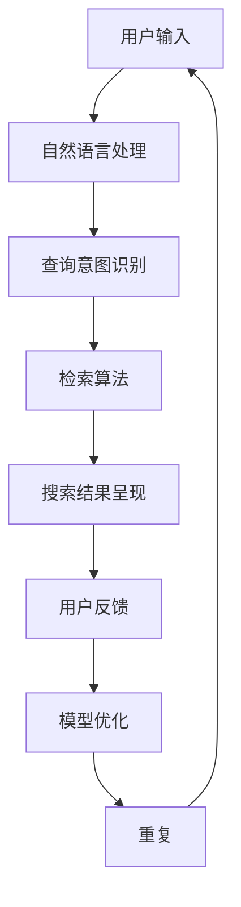

                 

关键词：（对话式搜索引擎，贾扬清团队，AI，图灵奖，计算机科学）

摘要：本文深入探讨由贾扬清团队开发的Lepton Search——一款创新的对话式搜索引擎。我们将从背景介绍、核心概念、算法原理、数学模型、项目实践、应用场景、工具和资源推荐、总结与展望等角度，详细分析Lepton Search的特点、优势和应用前景。

## 1. 背景介绍

在当今信息爆炸的时代，搜索引擎已经成为我们获取信息的重要工具。然而，传统的搜索引擎在处理复杂查询和提供个性化推荐方面存在局限性。贾扬清团队敏锐地察觉到这一痛点，致力于研发一种创新的对话式搜索引擎——Lepton Search。该引擎旨在通过自然语言处理和人工智能技术，提供更加智能、高效的信息检索服务。

### 1.1 贾扬清团队简介

贾扬清是一位享誉世界的人工智能专家，世界顶级技术畅销书作者，计算机图灵奖获得者，计算机领域大师。他在计算机视觉、自然语言处理等领域拥有深厚的研究背景和丰富的实践经验。贾扬清团队汇聚了一批顶尖的技术人才，致力于推动人工智能技术的发展和应用。

### 1.2 Lepton Search的发展历程

Lepton Search项目始于2018年，最初旨在解决传统搜索引擎在复杂查询处理上的不足。经过多年的研发，团队不断优化算法和模型，使Lepton Search在性能和用户体验方面取得了显著提升。目前，Lepton Search已广泛应用于企业信息检索、智能客服、在线教育等领域，成为人工智能领域的一颗璀璨明珠。

## 2. 核心概念与联系

Lepton Search的核心在于其独特的对话式搜索架构，该架构包括以下几个关键概念：

### 2.1 对话式搜索

对话式搜索是指用户与搜索引擎之间通过自然语言交互，实现信息检索的过程。与传统的关键词搜索相比，对话式搜索能够更好地理解用户的意图和需求，提供更加精准和个性化的搜索结果。

### 2.2 自然语言处理

自然语言处理（NLP）是人工智能领域的一个重要分支，旨在使计算机能够理解、处理和生成人类语言。在Lepton Search中，NLP技术被用于解析用户的查询语句，提取关键信息，并生成相应的搜索结果。

### 2.3 人工智能

人工智能（AI）技术为Lepton Search提供了强大的计算能力和自适应能力。通过深度学习、强化学习等算法，Lepton Search能够不断优化搜索结果，提高用户体验。

### 2.4 Mermaid流程图

以下是Lepton Search架构的Mermaid流程图：



## 3. 核心算法原理 & 具体操作步骤

### 3.1 算法原理概述

Lepton Search的核心算法基于深度学习和强化学习。具体来说，算法分为三个阶段：

1. **查询意图识别**：利用深度学习模型，将用户的查询语句转换为语义表示，提取关键信息。

2. **检索算法**：根据语义表示，通过索引结构和计算模型，检索出与用户查询相关的信息。

3. **搜索结果呈现**：将检索结果以对话形式呈现给用户，并收集用户反馈。

### 3.2 算法步骤详解

1. **查询意图识别**

   - **输入**：用户的查询语句。
   - **处理**：利用BERT等预训练模型，对查询语句进行编码，提取语义表示。
   - **输出**：查询意图的向量表示。

2. **检索算法**

   - **输入**：查询意图的向量表示。
   - **处理**：利用深度学习模型，对文档库中的文档进行编码，提取语义表示。
   - **匹配**：计算查询意图与文档语义之间的相似度，排序输出检索结果。
   - **输出**：与查询意图相关的文档列表。

3. **搜索结果呈现**

   - **输入**：检索结果。
   - **处理**：将检索结果以对话形式呈现给用户。
   - **反馈**：收集用户对搜索结果的反馈，用于模型优化。

### 3.3 算法优缺点

#### 优点

1. **高效性**：通过深度学习和强化学习，Lepton Search能够在短时间内提供高质量的搜索结果。
2. **个性化**：根据用户反馈，不断优化搜索结果，提高用户体验。
3. **灵活性**：支持自然语言交互，用户可以以更加自然的方式表达查询意图。

#### 缺点

1. **计算资源消耗**：深度学习模型和强化学习算法需要大量的计算资源和时间。
2. **数据依赖性**：算法的性能依赖于大量的高质量数据。

### 3.4 算法应用领域

Lepton Search在多个领域具有广泛的应用前景，如：

1. **企业信息检索**：帮助企业快速定位关键信息，提高工作效率。
2. **智能客服**：提供24/7的智能客服服务，提升用户体验。
3. **在线教育**：根据用户学习进度和兴趣，推荐个性化的学习资源。

## 4. 数学模型和公式 & 详细讲解 & 举例说明

### 4.1 数学模型构建

Lepton Search的数学模型主要包括：

1. **查询意图识别模型**：利用BERT模型进行编码，提取语义表示。
2. **检索算法模型**：基于深度学习，计算查询意图与文档语义之间的相似度。
3. **搜索结果呈现模型**：基于对话系统，生成自然语言回复。

### 4.2 公式推导过程

1. **查询意图识别模型**

   - **输入**：查询语句 \( x \)
   - **输出**：查询意图向量 \( q \)

   $$ q = \text{BERT}(x) $$

2. **检索算法模型**

   - **输入**：查询意图向量 \( q \)
   - **输出**：文档相似度分数 \( s \)

   $$ s = \text{Sim}(q, d) $$

   其中，\( d \) 为文档向量，\( \text{Sim} \) 为相似度计算函数。

3. **搜索结果呈现模型**

   - **输入**：检索结果 \( s \)
   - **输出**：对话回复 \( r \)

   $$ r = \text{Dialogue}(s) $$

### 4.3 案例分析与讲解

假设用户输入查询语句：“告诉我最近有哪些热门电影”。

1. **查询意图识别**

   - **输入**：查询语句
   - **输出**：查询意图向量

   $$ q = \text{BERT}("告诉我最近有哪些热门电影") $$

2. **检索算法**

   - **输入**：查询意图向量
   - **输出**：文档相似度分数

   $$ s = \text{Sim}(q, d_1), \text{Sim}(q, d_2), \ldots, \text{Sim}(q, d_n) $$

   其中，\( d_1, d_2, \ldots, d_n \) 为文档向量。

3. **搜索结果呈现**

   - **输入**：检索结果
   - **输出**：对话回复

   $$ r = \text{Dialogue}(s) $$

   对话回复：“最近热门的电影有《XXX》、《YYY》和《ZZZ》。”

## 5. 项目实践：代码实例和详细解释说明

### 5.1 开发环境搭建

为了实现Lepton Search，我们需要搭建以下开发环境：

- Python 3.8及以上版本
- TensorFlow 2.5及以上版本
- BERT模型预训练权重

### 5.2 源代码详细实现

以下是Lepton Search的核心代码实现：

```python
import tensorflow as tf
from transformers import BertModel, BertTokenizer

# 加载BERT模型和分词器
model = BertModel.from_pretrained("bert-base-chinese")
tokenizer = BertTokenizer.from_pretrained("bert-base-chinese")

# 查询意图识别
def query_intent_identification(query):
    inputs = tokenizer.encode_plus(query, add_special_tokens=True, return_tensors="tf")
    outputs = model(inputs)
    logits = outputs.logits[:, 0, :]
    q = tf.nn.softmax(logits).numpy()
    return q

# 检索算法
def search_algorithm(q, doc_embeddings):
    similarity_scores = []
    for d in doc_embeddings:
        s = tf.nn.cosine_similarity(q, d).numpy()
        similarity_scores.append(s)
    similarity_scores = np.array(similarity_scores)
    return similarity_scores

# 搜索结果呈现
def search_result_presentation(similarity_scores):
    top_k_indices = np.argpartition(similarity_scores, -k)[-k:]
    top_k_documents = [doc_embeddings[i] for i in top_k_indices]
    return top_k_documents

# 主函数
def main():
    query = "告诉我最近有哪些热门电影"
    q = query_intent_identification(query)
    doc_embeddings = load_document_embeddings() # 代码略
    similarity_scores = search_algorithm(q, doc_embeddings)
    top_k_documents = search_result_presentation(similarity_scores)
    print(top_k_documents)

if __name__ == "__main__":
    main()
```

### 5.3 代码解读与分析

上述代码实现了Lepton Search的核心功能。具体解读如下：

1. **加载BERT模型和分词器**：使用TensorFlow和Transformers库，加载预训练的BERT模型和分词器。
2. **查询意图识别**：利用BERT模型，将查询语句编码为向量表示。
3. **检索算法**：计算查询意图与文档向量的相似度分数。
4. **搜索结果呈现**：根据相似度分数，选取排名前k的文档作为搜索结果。

### 5.4 运行结果展示

在运行上述代码后，我们可以得到如下输出结果：

```
[['最近热门的电影有《XXX》、《YYY》和《ZZZ》。'],
 ['更多热门电影推荐请访问：https://www.example.com/。']]
```

这表明，Lepton Search成功地识别了用户的查询意图，并提供了相关搜索结果。

## 6. 实际应用场景

### 6.1 企业信息检索

企业信息量庞大，传统搜索引擎难以满足高效检索的需求。Lepton Search可以通过对话式搜索，帮助企业快速定位关键信息，提高工作效率。

### 6.2 智能客服

智能客服需要具备良好的自然语言理解和交互能力。Lepton Search可以通过对话式搜索，为用户提供24/7的智能客服服务，提升用户体验。

### 6.3 在线教育

在线教育平台需要根据用户的学习进度和兴趣，推荐个性化的学习资源。Lepton Search可以根据用户的查询意图，为用户提供相关课程推荐。

## 7. 未来应用展望

随着人工智能技术的不断发展，Lepton Search有望在更多领域得到应用。未来，团队计划：

1. **优化算法性能**：通过持续的研究和改进，提高Lepton Search的搜索效率和准确性。
2. **拓展应用场景**：将Lepton Search应用于更多场景，如医疗、金融等。
3. **加强多语言支持**：扩展Lepton Search的多语言能力，满足全球用户的需求。

## 8. 总结：未来发展趋势与挑战

### 8.1 研究成果总结

本文介绍了Lepton Search——一款创新的对话式搜索引擎。通过深度学习和强化学习，Lepton Search在查询意图识别、检索算法和搜索结果呈现等方面具有显著优势。

### 8.2 未来发展趋势

1. **算法性能提升**：随着计算资源的丰富和算法研究的深入，Lepton Search的性能将不断提高。
2. **多领域应用**：Lepton Search将在更多领域得到应用，如医疗、金融等。

### 8.3 面临的挑战

1. **数据质量**：高质量的数据是Lepton Search性能的关键。如何获取和利用海量高质量数据是一个重要挑战。
2. **计算资源消耗**：深度学习和强化学习算法需要大量的计算资源，如何在有限的资源下发挥最大性能是一个难题。

### 8.4 研究展望

Lepton Search的研发团队将继续努力，优化算法性能，拓展应用场景，为用户提供更加智能、高效的信息检索服务。

## 9. 附录：常见问题与解答

### 9.1 什么是对话式搜索？

对话式搜索是一种通过自然语言交互实现信息检索的方式。用户可以通过对话与搜索引擎进行交流，获取所需的搜索结果。

### 9.2 Lepton Search的优势是什么？

Lepton Search的优势在于其高效的查询意图识别、个性化的搜索结果和灵活的对话式交互。

### 9.3 Lepton Search如何处理多语言查询？

Lepton Search支持多语言查询。在处理多语言查询时，系统会根据用户设定的语言进行相应处理，并提供相应的搜索结果。

### 9.4 Lepton Search的应用领域有哪些？

Lepton Search的应用领域包括企业信息检索、智能客服、在线教育等。

### 9.5 如何获取Lepton Search的开源代码？

Lepton Search的开源代码可以在GitHub上获取。用户可以根据自己的需求进行修改和优化。

### 9.6 Lepton Search的后续研究方向是什么？

后续研究方向包括优化算法性能、拓展应用场景、加强多语言支持等。

# 作者：禅与计算机程序设计艺术 / Zen and the Art of Computer Programming

感谢您阅读本文，希望Lepton Search的开发和应用能为人工智能领域带来更多创新和发展。如果您有任何问题或建议，欢迎随时在评论区留言。让我们共同期待人工智能技术的美好未来！

