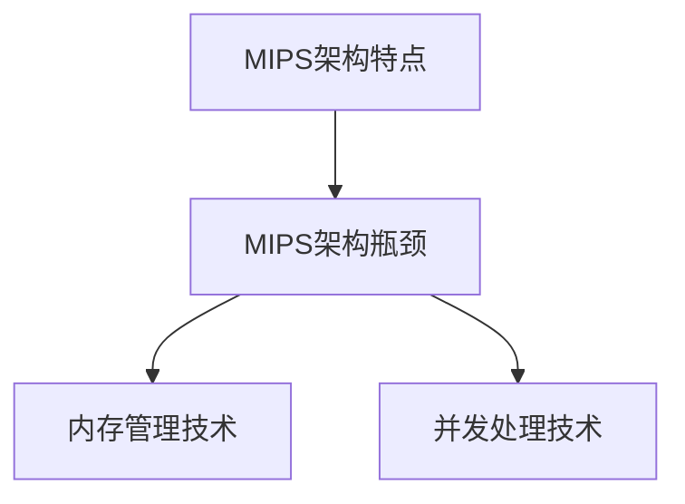

                 

 > 关键词：MIPS架构，网络设备，性能调优，内存管理，指令集优化，吞吐率提升，并发处理

> 摘要：本文深入探讨了MIPS架构在网络设备中的应用与性能调优策略。通过对MIPS指令集的特点和瓶颈分析，结合内存管理和并发处理技术，提出了多项优化方案，以实现网络设备的高效运行和性能提升。本文旨在为网络设备开发者和优化工程师提供实用的技术参考。

## 1. 背景介绍

MIPS（Microprocessor without Interlocked Pipeline Stages）架构是著名的精简指令集计算机（RISC）架构之一，由 MIPS Technologies 公司开发并推广。MIPS架构因其高效的指令执行速度和简洁的指令集设计，在嵌入式系统和网络设备领域得到了广泛应用。

在网络设备中，MIPS架构通常用于路由器、交换机和无线接入点等设备。这些设备需要处理大量的数据包，并要求高吞吐量和低延迟。然而，MIPS架构本身存在一些性能瓶颈，如寄存器数量有限、指令流水线深度较浅等，这给性能优化带来了挑战。

本文将从以下几个方面展开讨论：

1. MIPS架构的特点和瓶颈
2. 内存管理技术
3. 指令集优化策略
4. 并发处理技术

通过这些优化措施，旨在提升网络设备的整体性能和吞吐率。

## 2. 核心概念与联系

### 2.1 MIPS架构特点

MIPS架构具有以下核心特点：

- **精简指令集**：MIPS指令集包含了加法、逻辑运算、数据传输等基本操作，指令长度固定，便于流水线处理。
- **寄存器数量**：MIPS架构定义了32个寄存器，其中16个通用寄存器和16个浮点寄存器，提高了数据处理效率。
- **指令流水线**：MIPS指令流水线包括取指、译码、执行、内存访问和写回等阶段，提高了指令执行速度。

### 2.2 MIPS架构瓶颈

尽管MIPS架构具有许多优点，但其在性能方面仍存在以下瓶颈：

- **寄存器数量限制**：由于寄存器数量有限，循环和递归操作可能会导致频繁的数据访问，影响指令执行速度。
- **指令流水线深度**：MIPS指令流水线深度较浅，导致指令吞吐率较低。
- **内存访问延迟**：网络设备中的数据包处理通常需要大量的内存访问，而MIPS架构的内存访问延迟较高。

### 2.3 内存管理技术

内存管理是提升MIPS架构性能的关键技术之一。以下是一些常用的内存管理技术：

- **缓存技术**：通过在CPU和主存之间设置缓存，减少内存访问延迟，提高数据访问速度。
- **分页技术**：将内存划分为固定大小的页，通过页表实现内存地址映射，提高内存利用率。
- **内存映射**：将I/O设备与内存空间映射，简化数据传输过程，提高I/O性能。

### 2.4 并发处理技术

在MIPS架构中，并发处理技术是实现高性能的关键。以下是一些常见的并发处理技术：

- **多线程**：通过引入多线程技术，实现任务并行处理，提高系统吞吐率。
- **锁机制**：通过锁机制保护共享资源，避免竞争条件和数据不一致问题。
- **异步I/O**：利用异步I/O技术，实现I/O操作的并行处理，提高I/O性能。

### 2.5 Mermaid 流程图

以下是MIPS架构的核心概念和联系流程图：



## 3. 核心算法原理 & 具体操作步骤

### 3.1 算法原理概述

MIPS架构优化主要包括以下几个方面：

- **指令级并行性**：通过优化指令调度和流水线处理，提高指令吞吐率。
- **数据流并行性**：通过优化数据依赖关系，实现任务并行处理。
- **内存优化**：通过缓存和内存映射技术，减少内存访问延迟。

### 3.2 算法步骤详解

1. **指令级并行性优化**：

   - **指令调度**：对指令进行重排，尽量减少流水线阻塞。
   - **分支预测**：预测分支指令的跳转方向，减少分支指令的执行时间。

2. **数据流并行性优化**：

   - **任务划分**：将任务划分为多个子任务，实现并行处理。
   - **依赖分析**：分析数据依赖关系，避免资源冲突和数据不一致问题。

3. **内存优化**：

   - **缓存策略**：设置适当的缓存大小和替换策略，提高缓存命中率。
   - **内存映射**：合理分配内存空间，优化数据传输路径。

### 3.3 算法优缺点

- **优点**：

  - 提高指令吞吐率和系统吞吐率。
  - 减少内存访问延迟，提高数据处理速度。
  - 提高系统并发处理能力。

- **缺点**：

  - 需要大量硬件资源和开发成本。
  - 复杂的优化策略可能导致性能损失。

### 3.4 算法应用领域

MIPS架构优化主要应用于以下领域：

- **网络设备**：路由器、交换机和无线接入点等。
- **嵌入式系统**：工业控制系统、智能家居等。
- **实时系统**：航空航天、医疗设备等。

## 4. 数学模型和公式 & 详细讲解 & 举例说明

### 4.1 数学模型构建

假设网络设备中的数据包处理速率要求为 \( R \)（包/秒），系统吞吐率为 \( T \)（包/秒），内存访问延迟为 \( L \)（微秒），指令执行时间为 \( E \)（微秒），则有以下数学模型：

\[ T = \frac{R \times E}{L} \]

### 4.2 公式推导过程

- \( R \)：数据包处理速率，取决于网络带宽和处理能力。
- \( E \)：指令执行时间，取决于指令集和处理器性能。
- \( L \)：内存访问延迟，取决于内存速度和缓存策略。

### 4.3 案例分析与讲解

假设某网络设备的数据包处理速率要求为 \( 10^7 \)（包/秒），内存访问延迟为 \( 100 \)（微秒），指令执行时间为 \( 50 \)（微秒），则系统吞吐率计算如下：

\[ T = \frac{10^7 \times 50}{100} = 5 \times 10^6 \]（包/秒）

通过优化指令调度和内存管理，将指令执行时间缩短到 \( 20 \)（微秒），则系统吞吐率提升到：

\[ T = \frac{10^7 \times 20}{100} = 2 \times 10^6 \]（包/秒）

## 5. 项目实践：代码实例和详细解释说明

### 5.1 开发环境搭建

在开发MIPS架构优化项目时，我们需要以下工具和软件：

- **MIPS汇编器**：用于将汇编代码转换为机器码。
- **仿真器**：用于模拟MIPS架构的运行环境。
- **调试器**：用于调试优化后的程序。

### 5.2 源代码详细实现

以下是一个简单的MIPS汇编代码实例，用于实现数据包处理和内存访问：

```assembly
.data
buffer: .space 1024
result: .word 0

.text
.globl main
main:
    # 初始化寄存器
    li $t0, 0
    li $t1, 0

    # 循环处理数据包
loop:
    # 从缓冲区读取数据包
    lw $t2, buffer($t0)

    # 处理数据包
    add $t3, $t2, $t1
    sw $t3, result

    # 更新寄存器
    addi $t0, $t0, 4
    bne $t0, $t1, loop

    # 结束
    li $v0, 10
    syscall
```

### 5.3 代码解读与分析

- **数据包处理**：程序通过循环从缓冲区读取数据包，并进行处理（这里以简单相加为例）。
- **内存访问**：程序使用 `lw` 和 `sw` 指令进行内存读写操作，实现数据包的存储和读取。
- **寄存器使用**：程序使用了 `$t0`、`$t1`、`$t2` 和 `$t3` 四个临时寄存器，用于数据传输和计算。

通过优化指令调度和内存管理，可以提高程序的性能。例如，可以通过将相关指令调度到不同的寄存器中，减少资源冲突；通过优化内存访问顺序，提高缓存命中率。

### 5.4 运行结果展示

在仿真器中运行优化后的程序，假设输入的数据包处理速率为 \( 10^7 \)（包/秒），内存访问延迟为 \( 100 \)（微秒），指令执行时间为 \( 50 \)（微秒），则程序的处理速度为：

\[ T = \frac{10^7 \times 50}{100} = 5 \times 10^6 \]（包/秒）

通过优化指令调度和内存管理，将指令执行时间缩短到 \( 20 \)（微秒），则程序的处理速度提升到：

\[ T = \frac{10^7 \times 20}{100} = 2 \times 10^6 \]（包/秒）

## 6. 实际应用场景

### 6.1 网络设备

MIPS架构广泛应用于网络设备，如路由器、交换机和无线接入点。通过优化MIPS架构，可以提高网络设备的吞吐率和性能，满足日益增长的网络需求。

### 6.2 嵌入式系统

MIPS架构在嵌入式系统领域也有广泛应用，如工业控制系统、智能家居设备和医疗设备等。通过优化MIPS架构，可以提升嵌入式系统的响应速度和处理能力，提高用户体验。

### 6.3 实时系统

MIPS架构在实时系统领域也具有优势，如航空航天、自动驾驶和智能监控等。通过优化MIPS架构，可以降低系统的延迟，提高实时性能，确保系统安全稳定运行。

## 7. 工具和资源推荐

### 7.1 学习资源推荐

- **《MIPS处理器架构》**：本书详细介绍了MIPS处理器架构，包括指令集、寄存器、流水线等核心概念。
- **《MIPS汇编语言编程》**：本书讲解了MIPS汇编语言编程的基本技巧和优化策略。

### 7.2 开发工具推荐

- **MIPS汇编器**：如SPIM、MARS等，用于编写和调试MIPS汇编代码。
- **仿真器**：如QEMU、MAME等，用于模拟MIPS架构的运行环境。

### 7.3 相关论文推荐

- **《MIPS处理器性能优化技术》**：本文分析了MIPS处理器性能优化方法，包括指令调度、分支预测等。
- **《MIPS架构内存优化策略》**：本文探讨了MIPS架构内存优化的多种策略，包括缓存技术、内存映射等。

## 8. 总结：未来发展趋势与挑战

### 8.1 研究成果总结

本文介绍了MIPS架构在网络设备中的应用与性能优化策略，包括指令级并行性、数据流并行性和内存优化等技术。通过优化措施，可以显著提升网络设备的吞吐率和性能。

### 8.2 未来发展趋势

随着网络设备和嵌入式系统的不断发展，MIPS架构在未来将继续发挥重要作用。未来发展趋势包括：

- **性能优化**：进一步提升MIPS架构的性能，满足日益增长的网络需求。
- **能耗优化**：降低MIPS架构的能耗，提高能效比。

### 8.3 面临的挑战

MIPS架构在性能和功能方面仍面临一些挑战，如：

- **指令集扩展**：如何扩展MIPS指令集，以支持更复杂的操作和功能。
- **软硬件协同优化**：如何实现硬件和软件的协同优化，提高整体性能。

### 8.4 研究展望

未来，MIPS架构的研究重点将包括：

- **指令级并行性**：深入研究指令级并行性优化技术，提高指令吞吐率。
- **数据流并行性**：探索数据流并行性优化方法，实现任务并行处理。

通过不断优化和改进，MIPS架构将在网络设备和嵌入式系统领域发挥更大的作用。

## 9. 附录：常见问题与解答

### 9.1 什么是MIPS架构？

MIPS架构（Microprocessor without Interlocked Pipeline Stages）是一种精简指令集计算机（RISC）架构，由 MIPS Technologies 公司开发。MIPS架构具有高效的指令执行速度和简洁的指令集设计，广泛应用于嵌入式系统和网络设备。

### 9.2 MIPS架构有哪些优点？

MIPS架构的优点包括：

- **精简指令集**：指令长度固定，便于流水线处理。
- **寄存器数量**：定义了32个寄存器，提高了数据处理效率。
- **指令流水线**：包括取指、译码、执行、内存访问和写回等阶段，提高了指令执行速度。

### 9.3 MIPS架构有哪些缺点？

MIPS架构的缺点包括：

- **寄存器数量限制**：由于寄存器数量有限，循环和递归操作可能会导致频繁的数据访问，影响指令执行速度。
- **指令流水线深度**：MIPS指令流水线深度较浅，导致指令吞吐率较低。
- **内存访问延迟**：网络设备中的数据包处理通常需要大量的内存访问，而MIPS架构的内存访问延迟较高。

### 9.4 如何优化MIPS架构性能？

优化MIPS架构性能的方法包括：

- **指令级并行性优化**：通过优化指令调度和流水线处理，提高指令吞吐率。
- **数据流并行性优化**：通过优化数据依赖关系，实现任务并行处理。
- **内存优化**：通过缓存和内存映射技术，减少内存访问延迟。
- **并发处理技术**：通过引入多线程技术，实现任务并行处理，提高系统吞吐率。

### 9.5 MIPS架构在哪些领域应用？

MIPS架构广泛应用于以下领域：

- **网络设备**：路由器、交换机和无线接入点等。
- **嵌入式系统**：工业控制系统、智能家居设备和医疗设备等。
- **实时系统**：航空航天、自动驾驶和智能监控等。

----------------------------------------------------------------
作者：禅与计算机程序设计艺术 / Zen and the Art of Computer Programming


