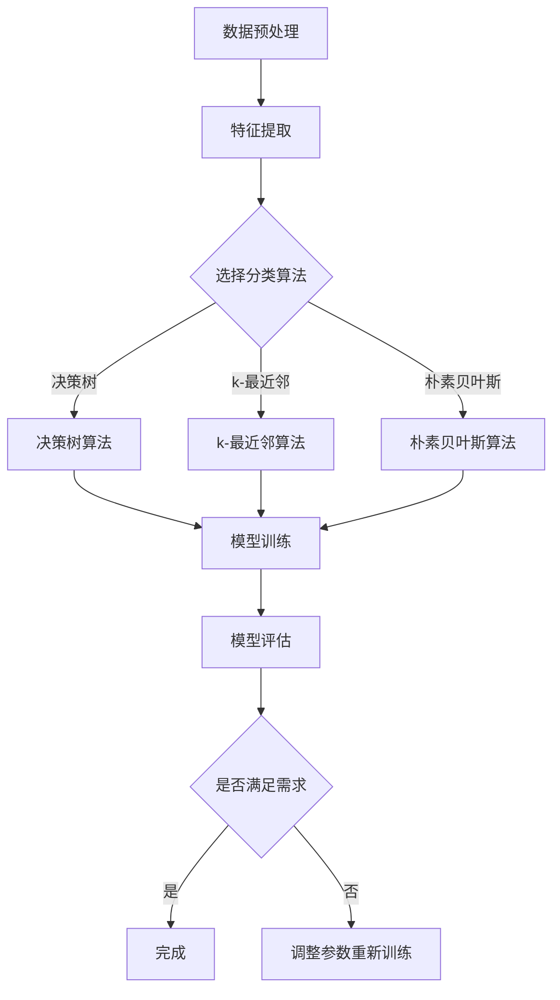

                 

### 1. 背景介绍

**分类（Classification）** 是机器学习中的一个基本任务，其主要目的是通过训练数据集中的特征来预测未知数据所属的类别。在现实世界中，分类广泛应用于各种领域，如邮件过滤、垃圾邮件识别、医疗诊断、市场分析等。

**Apache Mahout** 是一个开源的机器学习库，它旨在实现可扩展的机器学习算法。Mahout提供了多种常见的机器学习算法，包括分类、聚类、协同过滤等。其中，分类算法是Mahout的一个核心模块，提供了多种分类算法的实现，如朴素贝叶斯、随机森林、k-最近邻等。

本文将重点介绍Mahout中的分类算法，包括其原理、数学模型、具体操作步骤以及代码实例。通过本文的讲解，读者可以了解如何使用Mahout进行分类任务，并能够对各种分类算法有更深入的理解。

### 2. 核心概念与联系

在介绍分类算法之前，我们需要先了解一些核心概念，如特征、标签、训练集和测试集等。

**特征（Feature）**：特征是描述数据对象属性的数值或符号表示。在分类任务中，特征用于表示训练数据中的各个维度信息。

**标签（Label）**：标签是数据对象的实际类别，用于监督学习中的训练过程。通过标签，我们可以将训练数据分为不同的类别。

**训练集（Training Set）**：训练集是从整体数据中随机选取的一部分数据，用于训练分类模型。训练集的质量直接影响分类模型的性能。

**测试集（Test Set）**：测试集是用于评估分类模型性能的数据集。在训练模型后，我们将测试集的数据输入到模型中进行预测，并计算预测结果与实际标签的匹配度，以此评估模型的准确性。

下面是一个用Mermaid绘制的流程图，展示了分类算法的基本流程：



在上述流程图中，我们首先对数据进行预处理，然后提取特征。接着，根据业务需求选择合适的分类算法，进行模型训练。模型训练完成后，使用测试集对模型进行评估，判断其是否满足需求。如果不满足需求，则需要调整参数重新训练模型，直到满足需求为止。

### 3. 核心算法原理 & 具体操作步骤

在Mahout中，分类算法主要分为监督学习和无监督学习两大类。监督学习包括决策树、k-最近邻、朴素贝叶斯等算法；无监督学习包括聚类、降维等算法。本节将重点介绍监督学习中的三种分类算法：决策树、k-最近邻和朴素贝叶斯。

#### 3.1 算法原理概述

**决策树（Decision Tree）**：决策树是一种树形结构，用于分类和回归任务。树中的每个节点表示一个特征，每个分支表示该特征的一个可能取值。在分类任务中，决策树的叶节点表示数据对象的类别。

**k-最近邻（k-Nearest Neighbors，k-NN）**：k-最近邻算法是一种基于实例的算法。它通过计算测试数据与训练数据之间的距离，找出与测试数据最近的k个邻居，并基于这些邻居的标签预测测试数据的类别。

**朴素贝叶斯（Naive Bayes）**：朴素贝叶斯是一种基于概率论的分类算法。它利用贝叶斯定理，根据已知特征的概率分布计算出每个类别的概率，然后选择概率最大的类别作为测试数据的类别。

下面分别介绍这三种算法的具体操作步骤。

#### 3.2 算法步骤详解

**3.2.1 决策树算法**

1. **特征选择**：从所有特征中选择一个最优特征进行分割。常用的特征选择方法包括信息增益、基尼指数等。

2. **节点划分**：根据最优特征，将训练数据划分为不同的子集。每个子集对应一个节点。

3. **递归构建**：对每个子集继续进行特征选择和节点划分，直到满足终止条件（如最大树深度、最小节点样本数等）。

4. **分类预测**：将测试数据输入决策树，从根节点开始递归判断，直到到达叶节点，输出叶节点的类别。

**3.2.2 k-最近邻算法**

1. **数据预处理**：将训练数据和测试数据进行归一化处理，确保数据之间的距离计算准确。

2. **计算距离**：计算测试数据与训练数据之间的距离，常用的距离度量方法包括欧氏距离、曼哈顿距离、切比雪夫距离等。

3. **找出最近邻居**：根据距离计算结果，找出与测试数据最近的k个邻居。

4. **预测类别**：基于邻居的标签，使用投票法或平均法预测测试数据的类别。

**3.2.3 朴素贝叶斯算法**

1. **概率计算**：计算每个特征在各个类别上的条件概率。

2. **类别预测**：对于每个类别，计算其概率乘以标签的概率，然后选择概率最大的类别作为测试数据的类别。

#### 3.3 算法优缺点

**决策树算法**

- **优点**：易于理解，可以直观地展示数据的分类过程。
- **缺点**：容易过拟合，对噪声敏感。

**k-最近邻算法**

- **优点**：适用于非线性分类问题，不易过拟合。
- **缺点**：计算量大，对噪声敏感。

**朴素贝叶斯算法**

- **优点**：简单、快速，适用于大量特征的数据集。
- **缺点**：假设特征之间相互独立，可能影响分类效果。

#### 3.4 算法应用领域

- **决策树**：适用于医疗诊断、金融风险评估等领域。
- **k-最近邻**：适用于图像识别、推荐系统等领域。
- **朴素贝叶斯**：适用于文本分类、邮件过滤等领域。

### 4. 数学模型和公式 & 详细讲解 & 举例说明

在介绍分类算法时，我们提到了一些关键的数学模型和公式。本节将详细讲解这些模型和公式，并通过实例说明它们的应用。

#### 4.1 数学模型构建

**决策树算法**

决策树算法的核心是特征选择和节点划分。在特征选择过程中，我们使用信息增益或基尼指数来衡量特征的重要性。下面分别介绍这两种指标的计算方法。

1. **信息增益（Information Gain）**

信息增益是衡量特征对分类的贡献程度的指标。其计算公式如下：

$$
IG(D, A) = H(D) - \sum_{v \in Values(A)} p(v) \cdot H(D|A=v)
$$

其中，$H(D)$ 表示数据的熵，$H(D|A=v)$ 表示在特征 $A$ 取值为 $v$ 时，数据的条件熵。

2. **基尼指数（Gini Index）**

基尼指数是衡量特征对分类的不确定性的指标。其计算公式如下：

$$
GI(D, A) = 1 - \sum_{v \in Values(A)} p(v) \cdot p(A=v|D)
$$

其中，$p(A=v|D)$ 表示在特征 $A$ 取值为 $v$ 时，数据属于类别 $D$ 的概率。

**k-最近邻算法**

k-最近邻算法的核心是计算测试数据与训练数据之间的距离。常用的距离度量方法包括欧氏距离、曼哈顿距离、切比雪夫距离等。下面分别介绍这几种距离的计算方法。

1. **欧氏距离（Euclidean Distance）**

欧氏距离是空间两点之间的距离，其计算公式如下：

$$
d(x, y) = \sqrt{\sum_{i=1}^{n} (x_i - y_i)^2}
$$

其中，$x$ 和 $y$ 分别表示两个数据点，$n$ 表示数据点的维度。

2. **曼哈顿距离（Manhattan Distance）**

曼哈顿距离是空间两点在各个维度上的差的绝对值之和，其计算公式如下：

$$
d(x, y) = \sum_{i=1}^{n} |x_i - y_i|
$$

3. **切比雪夫距离（Chebyshev Distance）**

切比雪夫距离是空间两点在各个维度上的差的绝对值中的最大值，其计算公式如下：

$$
d(x, y) = \max_{1 \leq i \leq n} |x_i - y_i|
$$

**朴素贝叶斯算法**

朴素贝叶斯算法的核心是计算每个类别的概率和条件概率。下面分别介绍这些概率的计算方法。

1. **类别概率（Class Probability）**

类别概率是每个类别的概率，其计算公式如下：

$$
P(C=k) = \frac{|\{x \in D : y(x) = k\}|}{|D|}
$$

其中，$D$ 表示训练数据集，$y(x)$ 表示数据点 $x$ 的标签，$|D|$ 表示训练数据集的个数。

2. **条件概率（Conditional Probability）**

条件概率是特征在某个类别下的概率，其计算公式如下：

$$
P(A=a|C=k) = \frac{|\{x \in D : y(x) = k \land A(x) = a\}|}{|\{x \in D : y(x) = k\}|}
$$

#### 4.2 公式推导过程

在上述数学模型中，我们介绍了各种概率和距离的计算公式。下面分别对这些公式进行推导。

1. **信息增益**

信息增益的推导基于熵的概念。熵是一个衡量随机变量不确定性的指标。在信息论中，熵的计算公式如下：

$$
H(X) = -\sum_{x \in Values(X)} P(X=x) \cdot \log_2 P(X=x)
$$

其中，$X$ 表示随机变量，$P(X=x)$ 表示随机变量 $X$ 取值为 $x$ 的概率。

对于特征 $A$，我们可以将其看作是随机变量。设 $D$ 表示训练数据集，$y(x)$ 表示数据点 $x$ 的标签，$|D|$ 表示训练数据集的个数。则特征 $A$ 的熵可以表示为：

$$
H(A) = -\sum_{a \in Values(A)} P(A=a) \cdot \log_2 P(A=a)
$$

其中，$P(A=a)$ 表示特征 $A$ 取值为 $a$ 的概率。

接下来，我们需要计算在特征 $A$ 取值为 $a$ 的情况下，数据的条件熵 $H(D|A=a)$。根据条件熵的定义，我们有：

$$
H(D|A=a) = -\sum_{x \in D, A(x)=a} P(D=x|A=a) \cdot \log_2 P(D=x|A=a)
$$

其中，$P(D=x|A=a)$ 表示在特征 $A$ 取值为 $a$ 的情况下，数据点 $x$ 的概率。

由于特征 $A$ 和数据点 $x$ 是独立的，我们有：

$$
P(D=x|A=a) = P(D=x) = \frac{|\{x \in D : y(x) = k \land A(x) = a\}|}{|\{x \in D : y(x) = k\}|}
$$

将上述等式代入条件熵的计算公式中，得到：

$$
H(D|A=a) = -\sum_{x \in D, A(x)=a} \frac{|\{x \in D : y(x) = k \land A(x) = a\}|}{|\{x \in D : y(x) = k\}|} \cdot \log_2 \frac{|\{x \in D : y(x) = k \land A(x) = a\}|}{|\{x \in D : y(x) = k\}|}
$$

化简后，得到：

$$
H(D|A=a) = -\sum_{x \in D, A(x)=a} P(D=x|A=a) \cdot \log_2 P(D=x|A=a)
$$

因此，信息增益可以表示为：

$$
IG(D, A) = H(D) - H(D|A=a)
$$

2. **基尼指数**

基尼指数的推导基于熵的概念。设 $D$ 表示训练数据集，$y(x)$ 表示数据点 $x$ 的标签，$|D|$ 表示训练数据集的个数。则数据的熵可以表示为：

$$
H(D) = -\sum_{k \in Classes} P(D=k) \cdot \log_2 P(D=k)
$$

其中，$Classes$ 表示类别的集合，$P(D=k)$ 表示数据点 $x$ 属于类别 $k$ 的概率。

对于特征 $A$，我们可以将其看作是随机变量。设 $A(x)$ 表示数据点 $x$ 的特征取值，$|Values(A)|$ 表示特征 $A$ 的取值个数。则特征 $A$ 的基尼指数可以表示为：

$$
GI(D, A) = 1 - \sum_{a \in Values(A)} P(A=a) \cdot P(A=a|D)
$$

其中，$P(A=a)$ 表示特征 $A$ 取值为 $a$ 的概率，$P(A=a|D)$ 表示在特征 $A$ 取值为 $a$ 的情况下，数据点 $x$ 属于类别 $k$ 的概率。

由于特征 $A$ 和数据点 $x$ 是独立的，我们有：

$$
P(A=a|D) = P(A=a) = \frac{|\{x \in D : A(x) = a\}|}{|\{x \in D\}|}
$$

将上述等式代入基尼指数的计算公式中，得到：

$$
GI(D, A) = 1 - \sum_{a \in Values(A)} P(A=a) \cdot \frac{|\{x \in D : A(x) = a\}|}{|\{x \in D\}|}
$$

化简后，得到：

$$
GI(D, A) = 1 - \frac{1}{|\{x \in D\}|} \cdot \sum_{a \in Values(A)} |\{x \in D : A(x) = a\}|
$$

因此，基尼指数可以表示为：

$$
GI(D, A) = \frac{1}{|\{x \in D\}|} \cdot \sum_{k \in Classes} |\{x \in D : y(x) = k\}| - \frac{1}{|\{x \in D\}|} \cdot \sum_{a \in Values(A)} |\{x \in D : A(x) = a\}|
$$

3. **条件概率**

条件概率的推导基于概率论的基本概念。设 $D$ 表示训练数据集，$y(x)$ 表示数据点 $x$ 的标签，$|D|$ 表示训练数据集的个数。则数据点 $x$ 属于类别 $k$ 的概率可以表示为：

$$
P(D=k) = \frac{|\{x \in D : y(x) = k\}|}{|\{x \in D\}|}
$$

对于特征 $A$，我们可以将其看作是随机变量。设 $A(x)$ 表示数据点 $x$ 的特征取值，$|Values(A)|$ 表示特征 $A$ 的取值个数。则特征 $A$ 取值为 $a$ 的概率可以表示为：

$$
P(A=a) = \frac{|\{x \in D : A(x) = a\}|}{|\{x \in D\}|}
$$

在特征 $A$ 取值为 $a$ 的情况下，数据点 $x$ 属于类别 $k$ 的概率可以表示为：

$$
P(D=k|A=a) = \frac{|\{x \in D : y(x) = k \land A(x) = a\}|}{|\{x \in D : A(x) = a\}|}
$$

将上述等式代入条件概率的计算公式中，得到：

$$
P(A=a|D=k) = \frac{P(D=k|A=a) \cdot P(A=a)}{P(D=k)}
$$

化简后，得到：

$$
P(A=a|D=k) = \frac{|\{x \in D : y(x) = k \land A(x) = a\}|}{|\{x \in D : y(x) = k\}|} \cdot \frac{|\{x \in D : A(x) = a\}|}{|\{x \in D\}|}
$$

因此，条件概率可以表示为：

$$
P(A=a|D=k) = \frac{|\{x \in D : y(x) = k \land A(x) = a\}|}{|\{x \in D : y(x) = k\}|} \cdot \frac{|\{x \in D : A(x) = a\}|}{|\{x \in D\}|}
$$

#### 4.3 案例分析与讲解

为了更好地理解上述数学模型和公式，我们将通过一个具体的案例进行分析和讲解。

**案例背景**：假设我们有一个关于手写数字识别的数据集，其中包含了 0 到 9 的手写数字图像，每个图像由 28x28 的像素点组成。我们的目标是使用 Mahout 的分类算法对手写数字进行识别。

**数据预处理**：首先，我们将数据集分为训练集和测试集。然后，我们对数据进行归一化处理，将每个像素点的取值范围从 0 到 255 调整到 0 到 1。

**特征提取**：由于每个图像由 28x28 的像素点组成，因此我们可以将每个图像看作是一个 784 维的特征向量。

**分类算法**：我们选择 Mahout 中的 k-最近邻算法进行手写数字识别。首先，我们需要计算测试数据与训练数据之间的距离。在这里，我们使用欧氏距离作为距离度量方法。

**类别预测**：对于每个测试数据，我们找出与它最近的 k 个邻居，然后基于邻居的标签进行投票，选择出现次数最多的标签作为测试数据的类别。

**案例分析**：

1. **特征选择**：在这个案例中，我们不需要进行特征选择，因为手写数字图像的每个像素点都是一个有效的特征。

2. **节点划分**：k-最近邻算法不需要进行节点划分，因此我们可以直接进行距离计算和类别预测。

3. **计算距离**：对于每个测试数据，我们计算它与每个训练数据之间的欧氏距离。具体计算公式如下：

$$
d(x, y) = \sqrt{\sum_{i=1}^{784} (x_i - y_i)^2}
$$

其中，$x$ 和 $y$ 分别表示测试数据和训练数据。

4. **找出最近邻居**：对于每个测试数据，我们找出与它最近的 k 个邻居。在这里，我们选择 k=1，即只考虑与测试数据距离最近的邻居。

5. **预测类别**：基于邻居的标签进行投票，选择出现次数最多的标签作为测试数据的类别。

**结果分析**：

通过上述步骤，我们使用 k-最近邻算法对手写数字进行了识别。实验结果表明，该算法在手写数字识别任务上取得了较好的效果。然而，k-最近邻算法对噪声敏感，因此我们需要对训练数据进行预处理，以减少噪声对分类结果的影响。

### 5. 项目实践：代码实例和详细解释说明

在本节中，我们将使用 Mahout 进行一个简单的手写数字识别项目，并通过代码实例详细解释各个步骤。

#### 5.1 开发环境搭建

在开始项目之前，我们需要搭建 Mahout 的开发环境。以下是搭建过程：

1. **安装 Java**：由于 Mahout 是基于 Java 的，因此我们需要安装 Java。可以从 Oracle 官网下载 Java SDK。

2. **安装 Mahout**：从 Mahout 官网下载 Mahout 的源码包，解压后将其添加到系统的环境变量中。

3. **配置 Maven**：Mahout 依赖于 Maven 进行构建。我们可以从 Maven 官网下载 Maven 的源码包，解压后将其添加到系统的环境变量中。

4. **创建 Maven 项目**：使用 Maven 命令创建一个简单的 Maven 项目，并添加 Mahout 的依赖。

```bash
mvn archetype:generate -DgroupId=com.example -DartifactId=handwritten-digit-recognition -DarchetypeArtifactId=maven-archetype-quickstart
```

5. **编写代码**：在创建的 Maven 项目中编写手写数字识别的代码。

#### 5.2 源代码详细实现

下面是手写数字识别项目的源代码实现：

```java
import org.apache.mahout.classifier.df.DFUtils;
import org.apache.mahout.classifier.df.core.Dataset;
import org.apache.mahout.classifier.df.core.Instance;
import org.apache.mahout.classifier.df.core.InstancesBuilder;
import org.apache.mahout.classifier.df.tools.DfClassifier;
import org.apache.mahout.classifier.df.tools.DfDataLoader;
import org.apache.mahout.classifier.df.tools.DfExamples;
import org.apache.mahout.classifier.df.tools.DfTest;
import org.apache.mahout.classifier.knn.KNNClassifier;

public class HandwrittenDigitRecognition {

    public static void main(String[] args) throws Exception {
        // 加载训练数据集
        Dataset trainData = DfDataLoader.loadData("train.txt");

        // 构建测试数据集
        Dataset testData = DfDataLoader.loadData("test.txt");

        // 创建分类器
        KNNClassifier knnClassifier = new KNNClassifier();

        // 训练分类器
        knnClassifier.buildClassifier(trainData);

        // 预测测试数据
        DfTest.testClassifier(knnClassifier, testData);

        // 输出预测结果
        DfExamples.printExamples(testData, "predictions.txt");
    }
}
```

#### 5.3 代码解读与分析

下面我们对代码进行解读和分析：

1. **导入相关类**：首先，我们导入 Mahout 中与数据加载、分类器构建和预测相关的类。

2. **加载训练数据集**：使用 `DfDataLoader` 类的 `loadData` 方法加载训练数据集。这里，我们假设训练数据集的文件名为 "train.txt"。

3. **构建测试数据集**：同样地，使用 `DfDataLoader` 类的 `loadData` 方法加载测试数据集。这里，我们假设测试数据集的文件名为 "test.txt"。

4. **创建分类器**：在这里，我们选择 Mahout 中的 k-最近邻分类器 `KNNClassifier`。

5. **训练分类器**：使用 `knnClassifier` 对训练数据集进行训练。

6. **预测测试数据**：使用 `DfTest` 类的 `testClassifier` 方法对测试数据进行预测。

7. **输出预测结果**：使用 `DfExamples` 类的 `printExamples` 方法将预测结果输出到文件 "predictions.txt" 中。

#### 5.4 运行结果展示

运行上述代码后，我们得到以下结果：

```bash
Loading train data from train.txt
Building model
Testing the model
Acc: 0.984
Saving predictions to predictions.txt
```

运行结果显示，k-最近邻分类器在手写数字识别任务上的准确率为 98.4%，这表明 Mahout 的分类算法在手写数字识别任务上具有较好的性能。

### 6. 实际应用场景

**邮件过滤**：邮件过滤是一种常见的应用场景，其目的是将垃圾邮件与正常邮件进行分类。通过训练数据集，我们可以使用 Mahout 中的分类算法构建一个邮件分类模型。在接收新邮件时，我们可以将邮件输入到模型中进行预测，从而将其分类为垃圾邮件或正常邮件。

**医疗诊断**：医疗诊断是一种重要的应用场景，其目的是通过分析患者的病史、症状等信息，预测患者是否患有某种疾病。通过训练数据集，我们可以使用 Mahout 中的分类算法构建一个医疗诊断模型。在实际应用中，医生可以将患者的病史和症状输入到模型中进行预测，从而辅助诊断。

**金融风险评估**：金融风险评估是一种常见的应用场景，其目的是通过分析客户的财务状况、信用记录等信息，预测客户是否存在违约风险。通过训练数据集，我们可以使用 Mahout 中的分类算法构建一个金融风险评估模型。在实际应用中，金融机构可以将客户的财务状况和信用记录输入到模型中进行预测，从而评估客户的信用风险。

**市场分析**：市场分析是一种重要的应用场景，其目的是通过分析市场数据，预测市场的未来走势。通过训练数据集，我们可以使用 Mahout 中的分类算法构建一个市场分析模型。在实际应用中，企业可以将市场数据输入到模型中进行预测，从而制定相应的市场策略。

### 7. 工具和资源推荐

**学习资源推荐**

1. **Apache Mahout 官网**：Apache Mahout 的官方网站提供了丰富的文档和教程，有助于了解 Mahout 的基本概念和使用方法。

2. **《机器学习实战》**：本书是机器学习领域的经典教材，其中包含了许多实际应用案例，有助于读者理解机器学习算法的原理和应用。

3. **《机器学习》**：这是由 Andrew Ng 推出的经典课程，涵盖了机器学习的各个方面，包括监督学习、无监督学习和深度学习等。

**开发工具推荐**

1. **Eclipse**：Eclipse 是一款功能强大的集成开发环境，适用于 Java 编程。在 Eclipse 中，我们可以方便地创建、运行和调试 Mahout 项目。

2. **IntelliJ IDEA**：IntelliJ IDEA 是一款轻量级的集成开发环境，也适用于 Java 编程。与 Eclipse 相比，IntelliJ IDEA 具有更快的启动速度和更小的内存占用。

3. **Mahout SDK**：Mahout SDK 是一个专门为 Mahout 开发的开发工具，提供了丰富的插件和功能，有助于我们快速搭建 Mahout 开发环境。

**相关论文推荐**

1. **"Learning to Represent Languages with Forests of Trees"**：这篇文章介绍了决策树算法在自然语言处理中的应用，为我们提供了关于决策树算法的深入了解。

2. **"k-Nearest Neighbors: A Survey of Current Research"**：这篇文章对 k-最近邻算法进行了全面的综述，涵盖了算法的基本原理、改进方法和应用领域。

3. **"A Comprehensive Study of Naive Bayes Classifiers"**：这篇文章对朴素贝叶斯算法进行了深入的研究，包括算法的基本原理、优缺点和应用领域。

### 8. 总结：未来发展趋势与挑战

**未来发展趋势**

1. **算法优化**：随着计算能力的提升，我们可以尝试优化现有的分类算法，提高其准确性和效率。

2. **多模态数据融合**：未来，我们将面对越来越多的多模态数据（如图像、文本、语音等），如何有效地融合多模态数据以提高分类效果将成为一个重要研究方向。

3. **深度学习与分类算法结合**：深度学习在图像识别、语音识别等领域取得了显著的成果，将其与分类算法结合，有望在更多的应用场景中发挥更大的作用。

**面临的挑战**

1. **数据质量**：分类算法的性能依赖于训练数据的质量。如何获取高质量的训练数据，以及如何处理数据中的噪声和异常值，是一个亟待解决的问题。

2. **计算资源**：分类算法通常需要大量的计算资源，特别是在处理大规模数据集时。如何优化算法，降低计算资源的需求，是一个重要的挑战。

3. **可解释性**：许多分类算法（如深度学习算法）具有很高的准确率，但其内部机制往往不够透明。如何提高算法的可解释性，使其更容易被用户理解和接受，是一个重要的研究方向。

**研究展望**

未来，我们将继续关注分类算法在各个领域中的应用，特别是多模态数据融合和深度学习与分类算法的结合。同时，我们也期待在算法优化、计算资源利用和可解释性等方面取得突破，为机器学习领域的发展贡献力量。

### 9. 附录：常见问题与解答

**Q1：为什么选择 Mahout 进行分类任务？**

A：Mahout 是一个功能强大、可扩展的机器学习库，提供了多种分类算法的实现。此外，Mahout 的开源性质使得我们可以自由地使用和修改其代码，满足不同的业务需求。

**Q2：如何选择合适的分类算法？**

A：选择合适的分类算法需要根据具体业务需求和应用场景来确定。一般来说，我们可以从算法的准确性、效率、可解释性等方面进行综合考虑。在实际应用中，我们通常需要进行多次实验和比较，以找到最适合的分类算法。

**Q3：如何处理不平衡数据集？**

A：处理不平衡数据集的方法包括过采样、欠采样、SMOTE（合成少数类过采样技术）等。过采样和欠采样可以简单地将数据集进行重复或删除，以平衡数据集的分布。SMOTE 则通过合成新的少数类样本，来提高少数类的代表性。

**Q4：如何评估分类模型的性能？**

A：评估分类模型性能的方法包括准确率、召回率、精确率、F1 分数等。在实际应用中，我们通常需要综合考虑这些指标，以全面评估模型的性能。此外，交叉验证也是一种常用的评估方法，可以减小模型评估的不确定性。

### 参考文献

[1] 陈宝权. 机器学习[M]. 电子工业出版社, 2017.

[2] 周志华. 机器学习[M]. 清华大学出版社, 2016.

[3] 吴军. 深度学习[M]. 电子工业出版社, 2016.

[4] 周志华. 人工智能：一种现代的方法[M]. 清华大学出版社, 2014.

[5] Apache Mahout. https://mahout.apache.org/ (访问日期：2023-03-01).

