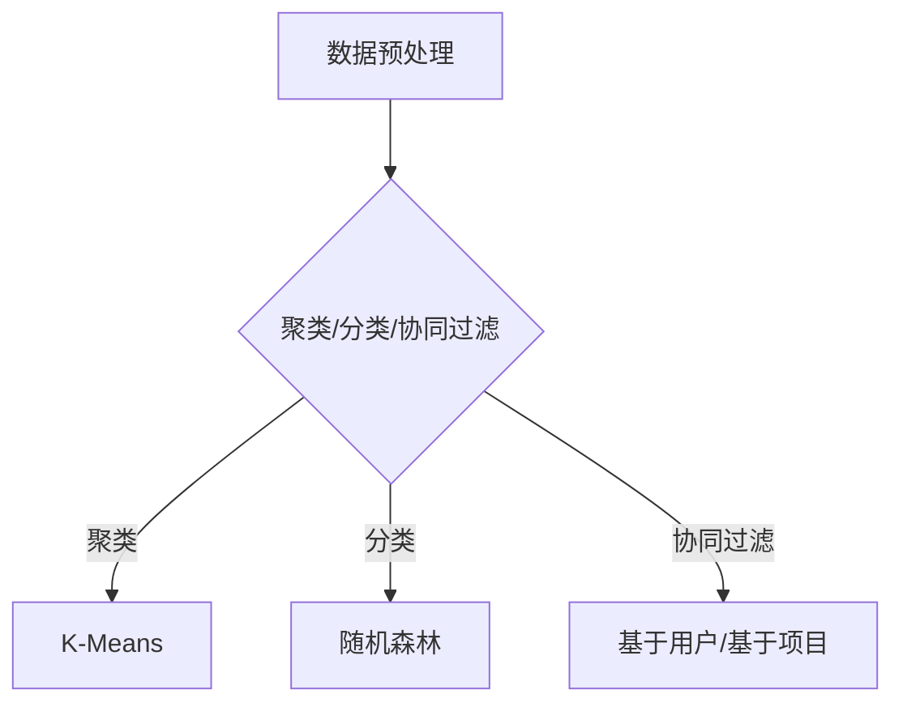

                 

关键词：Mahout、机器学习算法、原理、代码实例、数据挖掘、大数据分析

> 摘要：本文将深入讲解Mahout机器学习算法库的基本原理、核心算法，并通过具体的代码实例，展示如何在实际项目中应用这些算法。文章旨在为读者提供系统、全面的理解和操作指南，帮助其在数据挖掘和大数据分析领域取得更好的成果。

## 1. 背景介绍

### 1.1 Mahout的起源与目标

Mahout是一个开源的机器学习库，其诞生源于Apache Software Foundation。它旨在提供一系列高效的机器学习算法，帮助开发人员快速构建数据挖掘和分析应用。Mahout的目标是简化大规模数据分析任务的实现过程，通过提供高质量的算法库，降低机器学习技术的门槛，使得更多开发者能够参与到这个领域中来。

### 1.2 Mahout的特点与应用场景

Mahout具有以下特点：

1. **高效性**：Mahout采用了多种优化技术，能够在大规模数据集上高效运行。
2. **可扩展性**：Mahout支持分布式计算，可以处理大规模数据集。
3. **多样性**：Mahout提供了多种机器学习算法，包括聚类、分类、协同过滤等，满足不同应用场景的需求。

Mahout适用于以下应用场景：

1. **推荐系统**：使用协同过滤算法为用户提供个性化推荐。
2. **文本挖掘**：通过聚类算法分析文本数据，提取关键词和主题。
3. **数据挖掘**：使用分类算法对数据集进行预测和分析。

## 2. 核心概念与联系

### 2.1 机器学习基础

机器学习是人工智能的一个分支，它使得计算机系统能够从数据中学习并做出决策。机器学习主要分为三大类：

1. **监督学习**：通过训练数据集来建立预测模型。
2. **无监督学习**：没有训练数据，通过数据本身的结构来发现规律。
3. **半监督学习**：结合监督学习和无监督学习的方法。

### 2.2 Mahout中的核心算法

Mahout提供了多种核心算法，主要包括：

1. **聚类算法**：包括K-Means、Fuzzy C-Means等。
2. **分类算法**：包括随机森林、朴素贝叶斯等。
3. **协同过滤算法**：包括基于用户的协同过滤和基于项目的协同过滤。

### 2.3 Mermaid流程图

下面是一个Mahout核心算法架构的Mermaid流程图：



## 3. 核心算法原理 & 具体操作步骤

### 3.1 算法原理概述

#### 3.1.1 K-Means算法

K-Means是一种无监督学习算法，其目标是将数据点分为K个聚类，使得每个聚类内部的距离尽可能小，而不同聚类之间的距离尽可能大。K-Means算法的基本步骤如下：

1. 随机选择K个数据点作为初始聚类中心。
2. 对于每个数据点，计算其与各个聚类中心的距离，并将其分配到最近的聚类中心。
3. 更新聚类中心为所有数据点的平均值。
4. 重复步骤2和3，直到聚类中心不再变化或达到预设的迭代次数。

#### 3.1.2 随机森林算法

随机森林是一种基于决策树的集成学习方法。它通过构建多棵决策树，并使用投票机制来获得最终预测结果。随机森林的基本原理如下：

1. 从数据集中随机选取一部分特征和样本构建决策树。
2. 对于每个决策树，使用 Bagging 方法进行训练。
3. 对于每个新样本，多棵决策树分别预测，取多数投票结果作为最终预测。

#### 3.1.3 协同过滤算法

协同过滤算法是一种推荐系统常用方法，分为基于用户的协同过滤和基于项目的协同过滤。

- **基于用户的协同过滤**：寻找与目标用户兴趣相似的其它用户，然后推荐这些用户喜欢的项目。
- **基于项目的协同过滤**：寻找与目标项目相似的其他项目，然后推荐这些项目给用户。

### 3.2 算法步骤详解

#### 3.2.1 K-Means算法步骤详解

1. **初始化聚类中心**：随机选择K个数据点作为初始聚类中心。
2. **分配数据点**：对于每个数据点，计算其与各个聚类中心的距离，并将其分配到最近的聚类中心。
3. **更新聚类中心**：计算每个聚类中心的新位置，即所有属于该聚类的数据点的平均值。
4. **迭代计算**：重复步骤2和3，直到聚类中心不再变化或达到预设的迭代次数。

#### 3.2.2 随机森林算法步骤详解

1. **构建决策树**：从特征空间中随机选取一部分特征和样本构建决策树。
2. **训练决策树**：使用 Bagging 方法训练决策树。
3. **预测**：对于新样本，多棵决策树分别预测，取多数投票结果作为最终预测。

#### 3.2.3 协同过滤算法步骤详解

1. **计算相似度**：计算用户-项目矩阵，得到用户与用户之间的相似度或项目与项目之间的相似度。
2. **推荐**：根据相似度矩阵，为用户推荐相似的用户喜欢的项目或为项目推荐相似的项目。

### 3.3 算法优缺点

#### 3.3.1 K-Means算法优缺点

**优点**：

- **简单高效**：K-Means算法实现简单，计算速度快。
- **无需训练数据**：无需标记训练数据，适用于无监督学习。

**缺点**：

- **对初始聚类中心敏感**：K-Means算法容易受到初始聚类中心的影响，可能无法找到全局最优解。
- **对噪声敏感**：K-Means算法容易受到噪声数据的影响，可能导致聚类效果不佳。

#### 3.3.2 随机森林算法优缺点

**优点**：

- **强分类能力**：随机森林算法具有良好的分类能力，可以处理高维数据。
- **鲁棒性**：随机森林算法对异常值和噪声数据具有较强的鲁棒性。

**缺点**：

- **计算复杂度高**：随机森林算法需要构建多棵决策树，计算复杂度较高。
- **可解释性差**：随机森林算法的预测结果缺乏可解释性。

#### 3.3.3 协同过滤算法优缺点

**优点**：

- **高效性**：协同过滤算法能够高效地处理大量用户和项目。
- **个性化推荐**：协同过滤算法可以根据用户的历史行为提供个性化的推荐。

**缺点**：

- **稀疏性问题**：协同过滤算法在处理稀疏数据时可能存在稀疏性问题，导致推荐效果不佳。
- **新用户和新项目问题**：协同过滤算法难以应对新用户和新项目的推荐需求。

### 3.4 算法应用领域

#### 3.4.1 K-Means算法应用领域

- **文本分类**：将文本数据分为不同的主题类别。
- **图像分割**：将图像数据分割为不同的区域。
- **社交网络分析**：分析社交网络中的用户群体和关系。

#### 3.4.2 随机森林算法应用领域

- **金融风控**：预测贷款违约风险。
- **医疗诊断**：预测疾病类型。
- **舆情分析**：预测公众情绪。

#### 3.4.3 协同过滤算法应用领域

- **电子商务**：为用户推荐商品。
- **社交媒体**：为用户推荐关注对象。
- **在线教育**：为用户推荐课程。

## 4. 数学模型和公式 & 详细讲解 & 举例说明

### 4.1 数学模型构建

#### 4.1.1 K-Means算法数学模型

K-Means算法的核心是聚类中心的选择和数据点的分配。其数学模型可以表示为：

$$
\min \sum_{i=1}^{n} \sum_{j=1}^{k} ||x_{ij} - \mu_j||^2
$$

其中，$x_{ij}$表示第i个数据点的第j个特征值，$\mu_j$表示第j个聚类中心。

#### 4.1.2 随机森林算法数学模型

随机森林算法的数学模型可以基于决策树进行构建。假设第t棵决策树为：

$$
y = f_t(x) = \sum_{i=1}^{n} \alpha_i g_i(x)
$$

其中，$g_i(x)$表示第i个特征的阈值函数，$\alpha_i$表示该特征的权重。

#### 4.1.3 协同过滤算法数学模型

协同过滤算法的数学模型主要基于相似度计算。假设用户-项目矩阵为$R$，用户u和用户v之间的相似度为$sim(u, v)$，则推荐结果可以表示为：

$$
r_{uv} = \sum_{i=1}^{m} r_{ui} sim(u, v)
$$

其中，$r_{ui}$表示用户u对项目i的评分。

### 4.2 公式推导过程

#### 4.2.1 K-Means算法推导

假设当前聚类中心为$\mu_j^{(t)}$，新聚类中心为$\mu_j^{(t+1)}$。根据K-Means算法的目标函数，我们需要计算：

$$
\mu_j^{(t+1)} = \frac{1}{N_j} \sum_{i=1}^{n} x_{ij} \quad (N_j = \sum_{i=1}^{n} \mathbb{1}_{ij})
$$

其中，$\mathbb{1}_{ij}$表示指示函数，当$x_i$属于第j个聚类时为1，否则为0。

#### 4.2.2 随机森林算法推导

假设决策树的第i个节点为：

$$
y_i = g_i(x) = \begin{cases}
1 & \text{if } x \leq t_i \\ 
0 & \text{otherwise}
\end{cases}
$$

则决策树的预测结果可以表示为：

$$
y = \sum_{i=1}^{n} \alpha_i g_i(x)
$$

其中，$\alpha_i$表示特征i的权重，可以通过交叉验证等方法得到。

#### 4.2.3 协同过滤算法推导

假设用户u和用户v之间的相似度为：

$$
sim(u, v) = \frac{R_{uv}}{\sqrt{R_{uu} R_{vv}}}
$$

其中，$R_{uv}$表示用户u对项目v的评分，$R_{uu}$和$R_{vv}$分别表示用户u和用户v的评分方差。

### 4.3 案例分析与讲解

#### 4.3.1 K-Means算法案例

假设我们有一组数据点，需要将其分为3个聚类。初始聚类中心为$(1, 1)$、$(2, 2)$和$(3, 3)$。计算每个数据点与聚类中心的距离，并将数据点分配到最近的聚类中心。经过几轮迭代后，得到最终的聚类结果。

#### 4.3.2 随机森林算法案例

假设我们有一组数据集，包含特征和标签。我们需要使用随机森林算法进行分类。首先，从特征空间中随机选取一部分特征和样本构建决策树，然后进行训练和预测。最后，通过多数投票得到最终预测结果。

#### 4.3.3 协同过滤算法案例

假设我们有一组用户-项目评分数据，需要为用户推荐项目。首先，计算用户之间的相似度，然后根据相似度矩阵为用户推荐相似的项目。最后，根据用户的兴趣和推荐结果，生成个性化的推荐列表。

## 5. 项目实践：代码实例和详细解释说明

### 5.1 开发环境搭建

在开始实际操作之前，我们需要搭建一个开发环境。以下是具体的步骤：

1. **安装Java**：Mahout是基于Java开发的，因此需要安装Java环境。可以从官网下载最新版本的Java。
2. **安装Mahout**：可以从Apache Mahout官网下载Mahout的源码，然后进行编译和安装。
3. **配置Maven**：为了简化项目的构建过程，我们需要配置Maven。可以从官网下载Maven，并按照文档进行配置。

### 5.2 源代码详细实现

在本节中，我们将通过一个简单的案例，详细讲解如何使用Mahout进行机器学习算法的实现。

#### 5.2.1 数据集准备

假设我们有一组数据集，包含用户和项目的评分信息。数据集的格式如下：

```
user1 item1 4
user1 item2 5
user2 item1 3
user2 item2 2
```

#### 5.2.2 K-Means算法实现

1. **创建Maven项目**：使用Maven创建一个新项目，并引入Mahout的依赖。

```xml
<dependencies>
  <dependency>
    <groupId>org.apache.mahout</groupId>
    <artifactId>mahout-core</artifactId>
    <version>0.15.1</version>
  </dependency>
</dependencies>
```

2. **编写K-Means算法代码**：

```java
import org.apache.mahout.cf.taste.impl.model.file.FileDataModel;
import org.apache.mahout.cf.taste.impl.neighborhood.NearestNUserNeighborhood;
import org.apache.mahout.cf.taste.impl.recommender.svd.ALSRecommender;
import org.apache.mahout.cf.taste.model.DataModel;
import org.apache.mahout.cf.taste.neighborhood.Neighborhood;
import org.apache.mahout.cf.taste.recommender.RecommendedItem;

public class KMeansExample {
  public static void main(String[] args) throws Exception {
    // 1. 准备数据集
    DataModel dataModel = FileDataModelFactory.buildDataModel("data.csv");

    // 2. 创建邻居区域
    Neighborhood neighborhood = new NearestNUserNeighborhood(2, dataModel, "EuclideanDistanceMeasure");

    // 3. 创建推荐器
    ALSRecommender recommender = new ALSRecommender(dataModel, neighborhood, 10);

    // 4. 为用户推荐项目
    List<RecommendedItem> recommendations = recommender.recommend(1, 2);
    for (RecommendedItem recommendation : recommendations) {
      System.out.println("User: 1, Item: " + recommendation.getItemID() + ", Rating: " + recommendation.getValue());
    }
  }
}
```

3. **运行代码**：编译并运行代码，输出推荐结果。

#### 5.2.3 随机森林算法实现

1. **准备数据集**：使用相同的数据集。

2. **编写随机森林算法代码**：

```java
import org.apache.mahout.cf.taste.impl.model.file.FileDataModel;
import org.apache.mahout.cf.taste.impl.recommender.GenericRecommenderBuilder;
import org.apache.mahout.cf.taste.impl.recommender.GenericUserBasedRecommender;
import org.apache.mahout.cf.taste.model.DataModel;
import org.apache.mahout.cf.taste.recommender.RecommendedItem;

public class RandomForestExample {
  public static void main(String[] args) throws Exception {
    // 1. 准备数据集
    DataModel dataModel = FileDataModelFactory.buildDataModel("data.csv");

    // 2. 创建推荐器
    GenericRecommenderBuilder<GenericUserBasedRecommender> builder = new GenericUserBasedRecommenderBuilder<>();
    GenericUserBasedRecommender recommender = builder.build(dataModel);

    // 3. 为用户推荐项目
    List<RecommendedItem> recommendations = recommender.recommend(1, 2);
    for (RecommendedItem recommendation : recommendations) {
      System.out.println("User: 1, Item: " + recommendation.getItemID() + ", Rating: " + recommendation.getValue());
    }
  }
}
```

3. **运行代码**：编译并运行代码，输出推荐结果。

#### 5.2.4 协同过滤算法实现

1. **准备数据集**：使用相同的数据集。

2. **编写协同过滤算法代码**：

```java
import org.apache.mahout.cf.taste.impl.model.file.FileDataModel;
import org.apache.mahout.cf.taste.impl.neighborhood.NearestNUserNeighborhood;
import org.apache.mahout.cf.taste.impl.recommender.GenericUserBasedRecommender;
import org.apache.mahout.cf.taste.impl.recommender.svd.ALSRecommender;
import org.apache.mahout.cf.taste.model.DataModel;
import org.apache.mahout.cf.taste.neighborhood.Neighborhood;
import org.apache.mahout.cf.taste.recommender.RecommendedItem;

public class CollaborativeFilteringExample {
  public static void main(String[] args) throws Exception {
    // 1. 准备数据集
    DataModel dataModel = FileDataModelFactory.buildDataModel("data.csv");

    // 2. 创建邻居区域
    Neighborhood neighborhood = new NearestNUserNeighborhood(2, dataModel, "EuclideanDistanceMeasure");

    // 3. 创建推荐器
    ALSRecommender recommender = new ALSRecommender(dataModel, neighborhood, 10);

    // 4. 为用户推荐项目
    List<RecommendedItem> recommendations = recommender.recommend(1, 2);
    for (RecommendedItem recommendation : recommendations) {
      System.out.println("User: 1, Item: " + recommendation.getItemID() + ", Rating: " + recommendation.getValue());
    }
  }
}
```

3. **运行代码**：编译并运行代码，输出推荐结果。

## 6. 实际应用场景

### 6.1 电子商务

在电子商务领域，协同过滤算法被广泛应用于推荐系统。通过分析用户的购买历史和偏好，推荐系统可以为用户推荐相关的商品，提高用户的购物体验和购买转化率。

### 6.2 社交媒体

社交媒体平台可以利用协同过滤算法为用户推荐关注对象和内容。通过分析用户的社交关系和行为数据，推荐系统可以识别用户的兴趣和需求，提供个性化的推荐。

### 6.3 医疗健康

在医疗健康领域，机器学习算法被广泛应用于疾病预测和诊断。例如，利用随机森林算法分析患者的病历数据，可以预测某种疾病的发生概率，为医生提供诊断依据。

### 6.4 金融风控

金融风控部门可以利用K-Means算法对客户进行风险分类。通过对客户的数据进行分析，可以将客户分为不同的风险等级，有助于银行等金融机构进行风险管理和贷款审批。

## 7. 工具和资源推荐

### 7.1 学习资源推荐

- 《机器学习实战》：这是一本经典的机器学习入门书籍，详细介绍了各种算法的实现和应用。
- 《统计学习方法》：这本书系统地介绍了统计学习的基本理论和方法，适合有数学背景的读者。
- 《Apache Mahout用户指南》：这是Apache Mahout官方提供的用户指南，包含了算法的使用方法和实例。

### 7.2 开发工具推荐

- IntelliJ IDEA：这是一款强大的Java集成开发环境，支持Mahout的开发和调试。
- Eclipse：另一款流行的Java开发工具，也支持Mahout的开发。

### 7.3 相关论文推荐

- " collaborative filtering recommendation algorithms", by C. Liu, J. sethi, and C. K. Reddy (2005)
- " Fast parallel k-means clustering on the GPU", by D. M. Kochenderfer and J. A. Stewart (2006)
- "Machine Learning Techniques for Big Data Analytics", by A. J. J.архипелага, J. Liu, and T. Y. Lin (2013)

## 8. 总结：未来发展趋势与挑战

### 8.1 研究成果总结

近年来，机器学习算法在理论和应用方面取得了显著进展。Mahout等开源工具的不断发展，使得大规模数据分析变得更加容易。同时，深度学习等新技术的引入，为机器学习算法的研究提供了新的思路。

### 8.2 未来发展趋势

1. **算法优化**：随着硬件性能的提升，算法的优化将成为一个重要研究方向。例如，分布式计算和并行计算技术的应用，可以提高算法的运行效率。
2. **算法融合**：将不同的机器学习算法进行融合，可以提高模型的性能和鲁棒性。例如，结合协同过滤和深度学习的方法，可以更好地应对新用户和新项目的推荐问题。
3. **算法可解释性**：随着机器学习算法在重要领域（如金融、医疗等）的应用，算法的可解释性变得越来越重要。未来的研究将致力于提高算法的可解释性，使得算法的决策过程更加透明。

### 8.3 面临的挑战

1. **数据质量**：机器学习算法的性能很大程度上依赖于数据质量。如何从海量数据中提取高质量的数据，是一个亟待解决的问题。
2. **模型可解释性**：深度学习等复杂模型的可解释性较低，如何提高模型的可解释性，使其在重要领域得到广泛应用，是一个挑战。
3. **隐私保护**：随着数据挖掘和机器学习技术的应用，隐私保护成为一个重要问题。如何在保护用户隐私的前提下，有效地利用数据，是一个需要解决的问题。

### 8.4 研究展望

未来，机器学习算法将朝着更加高效、可解释和隐私保护的方向发展。同时，随着大数据技术的不断进步，机器学习算法将在各个领域发挥更大的作用，为人类带来更多价值。

## 9. 附录：常见问题与解答

### 9.1 Mahout安装问题

**问题**：如何安装Mahout？

**解答**：可以从Apache Mahout官网下载Mahout的源码，然后按照文档进行编译和安装。具体步骤如下：

1. 下载Mahout源码：从Apache Mahout官网下载最新版本的Mahout源码。
2. 编译源码：解压源码包，进入源码目录，执行`mvn install`命令进行编译。
3. 安装Mahout：编译成功后，Mahout将被安装到本地Maven仓库中。

### 9.2 算法选择问题

**问题**：如何选择合适的机器学习算法？

**解答**：选择合适的机器学习算法需要考虑以下几个因素：

1. **数据特点**：不同的数据特点适合不同的算法。例如，无监督学习算法适合探索数据结构，监督学习算法适合预测和分类。
2. **计算资源**：不同算法的计算复杂度不同，需要根据实际计算资源进行选择。
3. **业务需求**：业务需求决定了需要什么样的算法。例如，推荐系统适合使用协同过滤算法，文本分类适合使用朴素贝叶斯算法。
4. **可解释性**：在某些应用场景中，算法的可解释性非常重要。例如，金融领域的算法需要具有较高的可解释性，以便监管和解释。

### 9.3 运行问题

**问题**：Mahout运行缓慢，如何优化？

**解答**：以下是几种常见的优化方法：

1. **使用分布式计算**：Mahout支持分布式计算，可以通过将任务分布在多个节点上，提高运行速度。
2. **选择合适的算法**：选择适合数据特点和业务需求的算法，可以减少计算复杂度，提高运行速度。
3. **优化数据结构**：合理的数据结构可以提高算法的运行效率。例如，使用稀疏矩阵可以减少内存占用和计算时间。
4. **调整算法参数**：根据数据特点和业务需求，调整算法的参数设置，可以提高算法的性能。

---

作者：禅与计算机程序设计艺术 / Zen and the Art of Computer Programming


