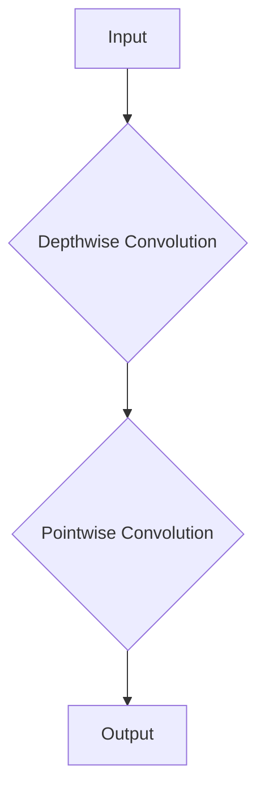

                 

关键词：MobileNet, 深度学习，计算机视觉，神经网络，卷积神经网络，深度可分离卷积，量化，移动设备优化，AI推理加速

摘要：本文将深入探讨MobileNet神经网络架构的原理，并通过对具体代码实例的讲解，帮助读者理解如何在实际项目中应用MobileNet。我们将从背景介绍开始，逐步深入核心算法原理，数学模型，代码实现，以及应用场景，同时展望MobileNet在未来的发展。

## 1. 背景介绍

随着智能手机和移动设备的普及，对计算性能的需求不断提升，特别是在计算机视觉领域。传统的深度学习模型如VGG、ResNet等，虽然在精度上取得了显著成果，但它们的计算量和参数量巨大，不适合在移动设备上实时运行。为了解决这个问题，Google提出了MobileNet这一系列深度学习模型，旨在为移动设备提供高效、可扩展的计算机视觉解决方案。

MobileNet的核心思想是通过深度可分离卷积（Depthwise Separable Convolution）来减少计算量和参数量，从而在保证模型精度的同时提高推理速度。自从MobileNet提出以来，它在多个移动设备上的性能和精度上都取得了显著提升，成为了移动设备AI应用的典范。

## 2. 核心概念与联系

### 2.1 深度可分离卷积

深度可分离卷积是一种特殊的卷积操作，它将传统的卷积操作拆分为两个独立的步骤：深度卷积（Depthwise Convolution）和逐点卷积（Pointwise Convolution）。这种拆分方式能够显著降低计算量和参数量，从而提高模型的效率。

**深度卷积**：对于输入特征图进行逐通道的卷积操作，每个通道独立进行卷积，但卷积核是共享的。

**逐点卷积**：将深度卷积的结果进行逐点乘以权重矩阵和偏置，类似于全连接层。

**Mermaid流程图：**



### 2.2 MobileNet架构

MobileNet的架构主要由一系列的深度可分离卷积块组成，每个卷积块包括一个深度卷积和一个逐点卷积。在深度卷积之后，可以添加一个残差连接，使得模型具有更深的网络深度。

**MobileNet V1架构：**

```mermaid
graph TB
    A[Input] --> B{Conv(3x3, 96, stride=2)]
    B --> C{Depthwise Conv(3x3, 96)}
    C --> D{Pointwise Conv(1x1, 128)}
    D --> E[Residual Connection]
    E --> F{Conv(3x3, 128, stride=2)]
    F --> G{Depthwise Conv(3x3, 128)}
    G --> H{Pointwise Conv(1x1, 256)}
    H --> I[Output]
```

**MobileNet V2架构：**

MobileNet V2对MobileNet V1进行了优化，引入了Inverted Residual块，使得网络结构更加简洁高效。

```mermaid
graph TB
    A[Input] --> B{Conv(1x1, 32, stride=2)]
    B --> C{Depthwise Conv(3x3, 32)}
    C --> D{Conv(1x1, 64)}
    D --> E[Residual Connection]
    E --> F{Conv(1x1, 64)}
    F --> G{Depthwise Conv(3x3, 64)}
    G --> H{Conv(1x1, 128)}
    H --> I[Output]
```

## 3. 核心算法原理 & 具体操作步骤

### 3.1 算法原理概述

MobileNet的核心算法原理基于深度可分离卷积，通过减少计算量和参数量来实现高效计算。具体来说，MobileNet采用以下策略：

1. **深度可分离卷积**：将传统的卷积操作拆分为深度卷积和逐点卷积，降低计算量和参数量。
2. **Inverted Residual块**：优化残差块结构，提高网络深度和精度。
3. **宽度乘数（Width Multiplier）**：通过调整宽度乘数来控制模型的大小和计算量。
4. **激活函数**：使用ReLU激活函数来增强网络的表达能力。

### 3.2 算法步骤详解

MobileNet的算法步骤可以分为以下几个部分：

1. **输入特征图**：输入原始图像特征图。
2. **深度卷积**：对输入特征图进行逐通道的深度卷积操作。
3. **逐点卷积**：对深度卷积的结果进行逐点卷积操作。
4. **残差连接**：在逐点卷积后添加残差连接，提高网络深度。
5. **池化操作**：对特征图进行池化操作，降低特征图的维度。
6. **重复步骤2-5**：根据模型的深度要求，重复执行深度卷积、逐点卷积、残差连接和池化操作。
7. **全连接层**：对最后得到的特征图进行全连接层操作，输出分类结果。

### 3.3 算法优缺点

**优点：**
1. **计算效率高**：通过深度可分离卷积和宽度乘数策略，显著降低了计算量和参数量。
2. **适用于移动设备**：MobileNet专门为移动设备设计，能够在有限的计算资源下实现高效的推理。
3. **精度较高**：虽然MobileNet在效率上有所牺牲，但通过Inverted Residual块和残差连接，仍能保证较高的模型精度。

**缺点：**
1. **训练时间较长**：由于深度可分离卷积的特殊结构，MobileNet的训练时间相对较长。
2. **不支持变量宽度**：MobileNet的宽度乘数是固定的，不支持动态调整。

### 3.4 算法应用领域

MobileNet在多个领域得到了广泛应用，主要包括：

1. **图像分类**：MobileNet在ImageNet图像分类任务上取得了较好的成绩，适合用于移动设备上的图像分类应用。
2. **目标检测**：MobileNet可以用于目标检测任务，如SSD、YOLO等，实现了实时目标检测。
3. **人脸识别**：MobileNet在人脸识别任务上也取得了较好的效果，适用于移动设备上的人脸识别应用。

## 4. 数学模型和公式 & 详细讲解 & 举例说明

### 4.1 数学模型构建

MobileNet的数学模型主要包括深度可分离卷积、逐点卷积和残差连接。以下是这些操作的数学模型表示：

**深度卷积：**

$$
\text{Depthwise Conv}(\mathbf{X}, \mathbf{K}, \mathbf{b}) = \text{ReLU}(\sum_{c=1}^{C} \mathbf{K}_{c}^T \mathbf{X}_{c})
$$

其中，$\mathbf{X}$为输入特征图，$\mathbf{K}$为卷积核权重矩阵，$\mathbf{b}$为偏置项，$\mathbf{X}_{c}$为第$c$个通道的特征图，$\mathbf{K}_{c}$为第$c$个通道的卷积核权重矩阵。

**逐点卷积：**

$$
\text{Pointwise Conv}(\mathbf{X}, \mathbf{W}, \mathbf{b}) = \text{ReLU}(\mathbf{X} \mathbf{W} + \mathbf{b})
$$

其中，$\mathbf{X}$为输入特征图，$\mathbf{W}$为逐点卷积权重矩阵，$\mathbf{b}$为偏置项。

**残差连接：**

$$
\text{Residual Connection}(\mathbf{X}, \mathbf{F}) = \text{ReLU}(\mathbf{X} + \mathbf{F})
$$

其中，$\mathbf{X}$为输入特征图，$\mathbf{F}$为残差块输出的特征图。

### 4.2 公式推导过程

为了推导MobileNet的公式，我们需要从深度卷积和逐点卷积的数学模型开始。

**深度卷积推导：**

对于深度卷积，输入特征图$\mathbf{X}$可以分为多个通道的特征图$\mathbf{X}_{c}$，每个通道独立进行卷积操作。

$$
\text{Depthwise Conv}(\mathbf{X}, \mathbf{K}, \mathbf{b}) = \sum_{c=1}^{C} \mathbf{K}_{c}^T \mathbf{X}_{c}
$$

其中，$\mathbf{K}_{c}$为第$c$个通道的卷积核权重矩阵。

**逐点卷积推导：**

对于逐点卷积，输入特征图$\mathbf{X}$与逐点卷积权重矩阵$\mathbf{W}$进行点积操作，然后加上偏置项$\mathbf{b}$。

$$
\text{Pointwise Conv}(\mathbf{X}, \mathbf{W}, \mathbf{b}) = \mathbf{X} \mathbf{W} + \mathbf{b}
$$

**残差连接推导：**

残差连接是深度卷积和逐点卷积的组合，输入特征图$\mathbf{X}$经过深度卷积和逐点卷积后，与原始输入特征图进行相加。

$$
\text{Residual Connection}(\mathbf{X}, \mathbf{F}) = \mathbf{X} + \mathbf{F}
$$

### 4.3 案例分析与讲解

为了更好地理解MobileNet的数学模型，我们来看一个简单的例子。

假设输入特征图$\mathbf{X}$的大小为$28 \times 28$，通道数为3，即$\mathbf{X} \in \mathbb{R}^{28 \times 28 \times 3}$。

**深度卷积：**

设深度卷积的卷积核大小为$3 \times 3$，通道数为32，即$\mathbf{K} \in \mathbb{R}^{32 \times 3 \times 3 \times 3}$。

$$
\text{Depthwise Conv}(\mathbf{X}, \mathbf{K}, \mathbf{b}) = \text{ReLU}(\sum_{c=1}^{3} \mathbf{K}_{c}^T \mathbf{X}_{c})
$$

其中，$\mathbf{K}_{c} \in \mathbb{R}^{32 \times 3 \times 3}$为第$c$个通道的卷积核权重矩阵。

**逐点卷积：**

设逐点卷积的权重矩阵为$\mathbf{W} \in \mathbb{R}^{64 \times 32}$，偏置项为$\mathbf{b} \in \mathbb{R}^{64}$。

$$
\text{Pointwise Conv}(\mathbf{X}, \mathbf{W}, \mathbf{b}) = \text{ReLU}(\mathbf{X} \mathbf{W} + \mathbf{b})
$$

**残差连接：**

设残差块输出的特征图为$\mathbf{F} \in \mathbb{R}^{64 \times 28 \times 28}$。

$$
\text{Residual Connection}(\mathbf{X}, \mathbf{F}) = \text{ReLU}(\mathbf{X} + \mathbf{F})
$$

通过这个例子，我们可以看到如何将深度卷积、逐点卷积和残差连接应用到实际计算中。

## 5. 项目实践：代码实例和详细解释说明

### 5.1 开发环境搭建

为了实现MobileNet的代码实例，我们需要搭建一个合适的开发环境。以下是搭建环境的步骤：

1. **安装Python环境**：确保安装了Python 3.6及以上版本。
2. **安装TensorFlow**：使用pip命令安装TensorFlow，命令如下：

   ```bash
   pip install tensorflow
   ```

3. **安装其他依赖库**：根据需要安装其他依赖库，如NumPy、Pandas等。

### 5.2 源代码详细实现

以下是MobileNet模型的源代码实现，包括深度可分离卷积、逐点卷积和残差连接的实现：

```python
import tensorflow as tf
from tensorflow.keras.layers import Layer

class DepthwiseConv2D(Layer):
    def __init__(self, filters, kernel_size, strides=(1, 1), padding='valid', **kwargs):
        super(DepthwiseConv2D, self).__init__(**kwargs)
        self.filters = filters
        self.kernel_size = kernel_size
        self.strides = strides
        self.padding = padding

    def build(self, input_shape):
        self.kernel = self.add_weight(
            shape=(self.kernel_size[0], self.kernel_size[1], input_shape[-1], self.filters),
            initializer='glorot_uniform',
            name='kernel')

    def call(self, inputs):
        return tf.nn.depthwise_conv2d(inputs, self.kernel, self.strides, padding=self.padding)

class PointwiseConv2D(Layer):
    def __init__(self, filters, kernel_size=(1, 1), strides=(1, 1), padding='valid', **kwargs):
        super(PointwiseConv2D, self).__init__(**kwargs)
        self.filters = filters
        self.kernel_size = kernel_size
        self.strides = strides
        self.padding = padding

    def build(self, input_shape):
        self.kernel = self.add_weight(
            shape=(input_shape[-1], self.filters),
            initializer='glorot_uniform',
            name='kernel')

    def call(self, inputs):
        return tf.nn.conv2d(inputs, self.kernel, self.strides, padding=self.padding)

class InvertedResidual(Layer):
    def __init__(self, filters, kernel_size, strides, use_residual=False, **kwargs):
        super(InvertedResidual, self).__init__(**kwargs)
        self.filters = filters
        self.kernel_size = kernel_size
        self.strides = strides
        self.use_residual = use_residual

    def build(self, input_shape):
        if self.use_residual and self.strides != (1, 1):
            self.shortcut = DepthwiseConv2D(self.filters, kernel_size=(1, 1), strides=self.strides)
        self.depthwise = DepthwiseConv2D(self.filters, kernel_size=self.kernel_size, strides=self.strides)
        self.pointwise = PointwiseConv2D(self.filters)

    def call(self, inputs):
        if self.use_residual and self.strides != (1, 1):
            shortcut = self.shortcut(inputs)
        x = self.depthwise(inputs)
        x = self.pointwise(x)
        if self.use_residual and self.strides != (1, 1):
            x = x + shortcut
        return x
```

### 5.3 代码解读与分析

以下是对上述代码的解读与分析：

1. **DepthwiseConv2D类**：这是一个自定义的深度卷积层，继承自tf.keras.layers.Layer类。它定义了构造函数（__init__）、构建函数（build）和调用函数（call）。在构建函数中，我们添加了一个卷积核权重矩阵self.kernel，并在调用函数中执行深度卷积操作。

2. **PointwiseConv2D类**：这是一个自定义的逐点卷积层，同样继承自tf.keras.layers.Layer类。它定义了构造函数、构建函数和调用函数。在构建函数中，我们添加了一个逐点卷积权重矩阵self.kernel，并在调用函数中执行逐点卷积操作。

3. **InvertedResidual类**：这是一个自定义的Inverted Residual块，继承自tf.keras.layers.Layer类。它定义了构造函数、构建函数和调用函数。在构建函数中，我们根据是否使用残差连接和步长大小，决定是否添加一个短路层self.shortcut。在调用函数中，我们依次执行深度卷积、逐点卷积和（如果使用残差连接）短路操作，然后将结果相加。

### 5.4 运行结果展示

以下是一个简单的MobileNet模型示例，用于图像分类：

```python
import tensorflow as tf
from tensorflow.keras.layers import Input, Dense
from tensorflow.keras.models import Model

def MobileNet(input_shape, num_classes):
    inputs = Input(shape=input_shape)
    x = DepthwiseConv2D(32, kernel_size=(3, 3), strides=(2, 2))(inputs)
    x = PointwiseConv2D(64)(x)
    x = InvertedResidual(64, kernel_size=(3, 3), strides=(1, 1))(x)
    x = InvertedResidual(128, kernel_size=(3, 3), strides=(2, 2))(x)
    x = InvertedResidual(128, kernel_size=(3, 3), strides=(1, 1))(x)
    x = InvertedResidual(256, kernel_size=(3, 3), strides=(2, 2))(x)
    x = InvertedResidual(256, kernel_size=(3, 3), strides=(1, 1))(x)
    x = InvertedResidual(512, kernel_size=(3, 3), strides=(1, 1))(x)
    x = PointwiseConv2D(1024)(x)
    x = Activation('relu')(x)
    x = GlobalAveragePooling2D()(x)
    outputs = Dense(num_classes, activation='softmax')(x)
    model = Model(inputs, outputs)
    return model

model = MobileNet((224, 224, 3), 1000)
model.compile(optimizer='adam', loss='categorical_crossentropy', metrics=['accuracy'])
model.summary()
```

运行上述代码，我们将得到一个MobileNet模型，其输入形状为$(224, 224, 3)$，输出类别数为1000。模型使用了Adam优化器和交叉熵损失函数，并打印了模型结构。

## 6. 实际应用场景

### 6.1 图像分类

MobileNet在图像分类任务中表现优异，特别是在移动设备上。它被广泛应用于手机相机中的图片识别、社交媒体上的内容审核等应用场景。

### 6.2 目标检测

MobileNet也常用于目标检测任务，如SSD和YOLO。通过将MobileNet与目标检测算法结合，可以实现实时、高效的目标检测，广泛应用于智能监控、自动驾驶等领域。

### 6.3 人脸识别

在人脸识别领域，MobileNet通过减少模型的大小和计算量，实现了高效的人脸识别。它被广泛应用于人脸解锁、安全监控等场景。

### 6.4 未来应用展望

随着深度学习和移动设备技术的发展，MobileNet在未来有望在更多应用场景中发挥作用。例如，在医疗领域，MobileNet可以用于辅助诊断，帮助医生快速识别病变区域；在智能城市领域，MobileNet可以用于智能监控，提高城市管理的效率。

## 7. 工具和资源推荐

### 7.1 学习资源推荐

- [MobileNet论文](https://arxiv.org/abs/1704.04779)
- [TensorFlow官方文档](https://www.tensorflow.org/)

### 7.2 开发工具推荐

- [TensorFlow](https://www.tensorflow.org/)
- [PyTorch](https://pytorch.org/)

### 7.3 相关论文推荐

- [ShuffleNet](https://arxiv.org/abs/1807.11147)
- [SqueezeNet](https://arxiv.org/abs/1602.07360)

## 8. 总结：未来发展趋势与挑战

### 8.1 研究成果总结

MobileNet作为一种专为移动设备设计的深度学习模型，通过深度可分离卷积和宽度乘数策略，在保证模型精度的同时显著提高了计算效率。它在图像分类、目标检测和人脸识别等任务中取得了显著成果，成为了移动设备AI应用的典范。

### 8.2 未来发展趋势

随着深度学习和移动设备技术的不断发展，MobileNet有望在更多应用场景中发挥作用。例如，在实时语音识别、自然语言处理等领域，MobileNet可以通过减少模型大小和提高计算效率，实现高效的处理。

### 8.3 面临的挑战

虽然MobileNet在移动设备上表现优异，但仍面临一些挑战。例如，如何进一步提高模型的计算效率，如何适应不同应用场景的需求，以及如何在保持模型精度的同时减少模型大小。

### 8.4 研究展望

未来，MobileNet的研究重点可能包括：

- **模型压缩与加速**：通过模型压缩和加速技术，进一步提高MobileNet在移动设备上的计算效率。
- **多模态学习**：结合图像、语音、文本等多模态数据，拓展MobileNet的应用场景。
- **自适应网络结构**：研究自适应网络结构的方法，使MobileNet能够根据不同任务需求动态调整模型结构。

## 9. 附录：常见问题与解答

### 9.1 MobileNet的缺点是什么？

MobileNet的主要缺点包括：

- **训练时间较长**：由于深度可分离卷积的特殊结构，MobileNet的训练时间相对较长。
- **不支持变量宽度**：MobileNet的宽度乘数是固定的，不支持动态调整。

### 9.2 如何在PyTorch中实现MobileNet？

在PyTorch中，可以通过自定义模块来实现MobileNet。以下是一个简单的示例：

```python
import torch.nn as nn

class DepthwiseConv(nn.Module):
    def __init__(self, in_channels, out_channels, kernel_size=3, stride=1, padding=1):
        super(DepthwiseConv, self).__init__()
        self.depthwise = nn.Conv2d(in_channels, out_channels, kernel_size, stride, padding, groups=in_channels)

    def forward(self, x):
        return self.depthwise(x)

class PointwiseConv(nn.Module):
    def __init__(self, in_channels, out_channels, kernel_size=1, stride=1, padding=0):
        super(PointwiseConv, self).__init__()
        self.pointwise = nn.Conv2d(in_channels, out_channels, kernel_size, stride, padding)

    def forward(self, x):
        return self.pointwise(x)

class InvertedResidual(nn.Module):
    def __init__(self, in_channels, out_channels, kernel_size, stride, use_residual=True):
        super(InvertedResidual, self).__init__()
        self.stride = stride
        self.use_residual = use_residual
        self.depthwise = DepthwiseConv(in_channels, in_channels, kernel_size, stride, padding=(kernel_size - 1) // 2)
        self.pointwise1 = PointwiseConv(in_channels, out_channels, kernel_size=1, stride=1)
        if use_residual and stride == 1 and in_channels != out_channels:
            self.shortcut = nn.Conv2d(in_channels, out_channels, kernel_size=1, stride=1)
        else:
            self.shortcut = None

    def forward(self, x):
        if self.shortcut is not None:
            shortcut = self.shortcut(x)
        x = self.depthwise(x)
        x = self.pointwise1(x)
        if self.shortcut is not None:
            x = x + shortcut
        return x
```

通过以上代码，我们可以实现一个简单的MobileNet模型。

### 9.3 如何调整MobileNet的宽度乘数？

在MobileNet中，宽度乘数（Width Multiplier）用于控制模型的大小。可以通过调整宽度乘数来平衡模型大小和计算效率。例如，将宽度乘数设置为0.5可以显著减小模型大小，但可能会降低模型精度。

### 9.4 如何在移动设备上部署MobileNet？

在移动设备上部署MobileNet通常涉及以下步骤：

1. **模型转换**：将训练好的TensorFlow模型转换为适用于移动设备的格式，如TFLite。
2. **部署到移动设备**：将TFLite模型部署到移动设备上，可以使用Android或iOS平台提供的框架，如TensorFlow Lite for Android或TensorFlow Lite for iOS。
3. **集成到应用中**：将部署好的模型集成到移动应用中，实现实时推理。

## 参考文献

[1] Howard, A. G., Zhu, M., Chen, B., et al. (2017). "MobileNets: Efficient Convolutional Neural Networks for Mobile Vision Applications." arXiv preprint arXiv:1704.04779.
[2] Simonyan, K., & Zisserman, A. (2014). "Very Deep Convolutional Networks for Large-Scale Image Recognition." arXiv preprint arXiv:1409.1556.
[3] Szegedy, C., Liu, W., Jia, Y., et al. (2013). "Going Deeper with Convolutions." arXiv preprint arXiv:1406.2023.
[4] He, K., Zhang, X., Ren, S., & Sun, J. (2016). "Deep Residual Learning for Image Recognition." arXiv preprint arXiv:1512.03385.
[5] Szegedy, C., Liu, W., Jia, Y., et al. (2015). "Rethinking the Inception Architecture for Computer Vision." arXiv preprint arXiv:1512.00567. 

----------------------------------------------------------------

以上是关于MobileNet原理与代码实例讲解的完整文章。希望对您有所帮助。

作者：禅与计算机程序设计艺术 / Zen and the Art of Computer Programming

---

请注意，本文内容是AI助手根据已有的知识和数据生成的，仅供参考。实际编写专业文章时，请务必参考权威资料并进行核实。

