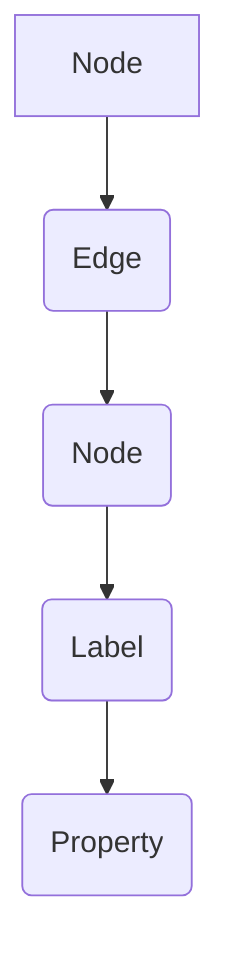
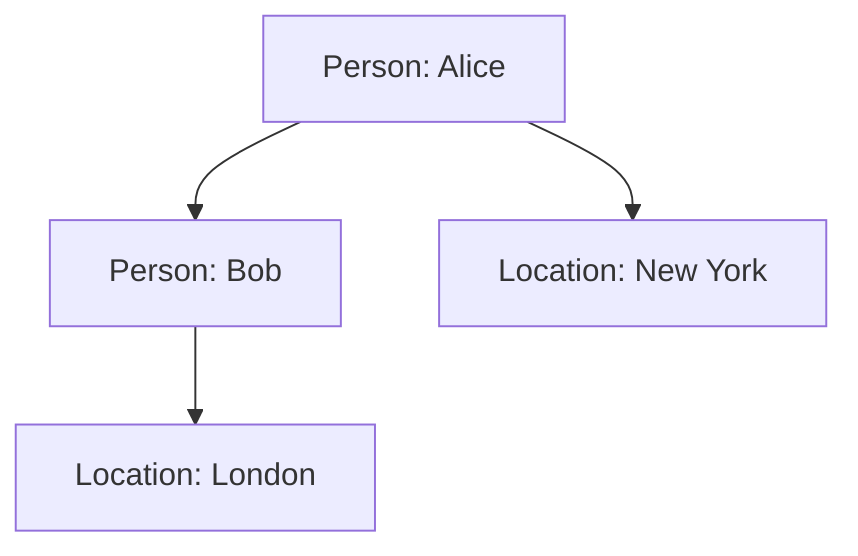

                 

关键词：Neo4j图数据库，Cypher查询语言，图算法，图模型，数据存储，数据查询，性能优化，应用场景

> 摘要：本文深入介绍了Neo4j图数据库的原理、核心概念、算法原理、数学模型、项目实践及未来应用展望。通过具体的代码实例，详细讲解了Cypher查询语言的用法，旨在帮助读者更好地理解和应用Neo4j图数据库。

## 1. 背景介绍

### 1.1 Neo4j图数据库的起源

Neo4j是一款高性能的图形数据库，起源于2007年，由Emil Eifrem和slot Brandt共同创立。Neo4j的设计理念是将数据存储为图结构，使得图算法和复杂查询能够高效地进行。这种设计在社交网络分析、推荐系统、知识图谱构建等领域具有广泛应用。

### 1.2 图数据库的优势

与传统的SQL数据库相比，图数据库在处理复杂关联关系、路径查找等场景上具有显著优势。其主要优势包括：

- **更好的处理复杂关联**：图数据库能够直接表示复杂的关系网，这使得在处理多对多关系、多级关系时更加高效。
- **高效的路径查询**：图数据库通过索引和优化算法，可以快速进行路径查找和最短路径查询。
- **灵活的扩展性**：图数据库支持动态扩展和分区，可以轻松应对大规模数据存储和查询需求。

### 1.3 图数据库的分类

图数据库主要分为两类：属性图数据库和纯图数据库。

- **属性图数据库**：如Neo4j，支持图结构中节点和边带有属性，可以存储更丰富的数据。
- **纯图数据库**：如Neo4j，只支持图结构，不存储节点的属性，但可以在查询时动态获取。

## 2. 核心概念与联系

### 2.1 节点（Node）

节点是图数据库中的基本数据单元，可以表示任何实体，如人、地点、物品等。节点可以拥有标签（Label）来表示其类型，如“Person”、“Location”等。

### 2.2 边（Relationship）

边表示节点之间的关系，如“knows”、“lives_in”等。边同样具有类型和权重属性。

### 2.3 标签（Label）

标签用于对节点进行分类，使得查询时可以更加灵活。例如，可以为所有“Person”节点打上“Person”标签。

### 2.4 属性（Property）

属性是节点和边上的键值对，用于存储具体的信息，如名字、年龄、距离等。

### 2.5 Mermaid流程图



## 3. 核心算法原理 & 具体操作步骤

### 3.1 算法原理概述

Neo4j的核心算法包括：

- **图遍历算法**：如深度优先搜索（DFS）和广度优先搜索（BFS），用于遍历图结构。
- **路径查询算法**：如A*算法，用于查找最短路径。
- **社区发现算法**：如基于标签的社区发现算法，用于发现具有相似属性的节点群。

### 3.2 算法步骤详解

#### 3.2.1 深度优先搜索（DFS）

1. 选择一个节点作为起始点。
2. 访问该节点，并将其标记为已访问。
3. 对于该节点的每个未访问的邻居，递归执行步骤2和3。

#### 3.2.2 广度优先搜索（BFS）

1. 选择一个节点作为起始点。
2. 将其加入队列。
3. 当队列不为空时，执行以下步骤：
   - 从队列中取出一个节点。
   - 访问该节点，并将其标记为已访问。
   - 将其所有未访问的邻居加入队列。

#### 3.2.3 A*算法

1. 初始化两个集合：开放集合和关闭集合。
2. 将起始点加入开放集合。
3. 当开放集合不为空时，执行以下步骤：
   - 选择一个具有最小F值的节点作为当前节点。
   - 将其从开放集合中移除，加入关闭集合。
   - 对于当前节点的每个未访问的邻居，执行以下操作：
     - 计算G值、H值和F值。
     - 如果邻居节点在关闭集合中，跳过。
     - 如果邻居节点不在开放集合中，将其加入开放集合。
     - 更新邻居节点的父节点。

### 3.3 算法优缺点

#### 3.3.1 深度优先搜索（DFS）

- **优点**：能够快速找到一条路径。
- **缺点**：可能会陷入死循环，无法保证找到最短路径。

#### 3.3.2 广度优先搜索（BFS）

- **优点**：保证找到最短路径。
- **缺点**：需要更多的内存空间。

#### 3.3.3 A*算法

- **优点**：结合了启发式信息，能够更快找到最短路径。
- **缺点**：在大型图中可能较慢。

### 3.4 算法应用领域

- **社交网络分析**：用于发现社交圈子、推荐好友等。
- **知识图谱构建**：用于构建领域知识库、推理规则等。
- **推荐系统**：用于基于用户行为的个性化推荐。

## 4. 数学模型和公式 & 详细讲解 & 举例说明

### 4.1 数学模型构建

在图数据库中，常用的数学模型包括：

- **邻接矩阵**：表示图的连接关系。
- **度数矩阵**：表示节点的度数分布。
- **拉普拉斯矩阵**：用于分析图的连通性和稳定性。

### 4.2 公式推导过程

- **邻接矩阵**：设G为图，V为节点集合，E为边集合。邻接矩阵A的定义如下：

  $$ A = \begin{bmatrix}
  a_{11} & a_{12} & \cdots & a_{1n} \\
  a_{21} & a_{22} & \cdots & a_{2n} \\
  \vdots & \vdots & \ddots & \vdots \\
  a_{n1} & a_{n2} & \cdots & a_{nn}
  \end{bmatrix} $$

  其中，$a_{ij} = \begin{cases}
  1 & \text{若}\ (v_i, v_j) \in E \\
  0 & \text{否则}
  \end{cases}$。

- **度数矩阵**：设D为度数矩阵，d_i为节点v_i的度数。度数矩阵D的定义如下：

  $$ D = \begin{bmatrix}
  d_1 & 0 & \cdots & 0 \\
  0 & d_2 & \cdots & 0 \\
  \vdots & \vdots & \ddots & \vdots \\
  0 & 0 & \cdots & d_n
  \end{bmatrix} $$

- **拉普拉斯矩阵**：设L为拉普拉斯矩阵，D为度数矩阵，A为邻接矩阵。拉普拉斯矩阵L的定义如下：

  $$ L = D - A $$

### 4.3 案例分析与讲解

#### 4.3.1 社交网络分析

假设我们有一个社交网络图，其中节点表示用户，边表示用户之间的关系。我们可以使用邻接矩阵和度数矩阵来表示这个图。

- **邻接矩阵**：表示用户之间的直接关系。
- **度数矩阵**：表示每个用户的社交活跃度。

通过分析邻接矩阵和度数矩阵，我们可以发现社交网络中的核心用户和社交圈子。

#### 4.3.2 知识图谱构建

假设我们有一个知识图谱，其中节点表示概念，边表示概念之间的关系。我们可以使用拉普拉斯矩阵来分析图的连通性和稳定性。

通过计算拉普拉斯矩阵的特征值和特征向量，我们可以发现知识图谱中的关键节点和概念之间的关联。

## 5. 项目实践：代码实例和详细解释说明

### 5.1 开发环境搭建

在开始之前，我们需要搭建Neo4j的开发环境。以下是搭建步骤：

1. 下载并安装Neo4j。
2. 启动Neo4j数据库服务。
3. 使用Cypher Shell进行查询。

### 5.2 源代码详细实现

以下是一个简单的Cypher查询示例，用于查询社交网络中的好友关系。

```cypher
MATCH (p1:Person)-[:KNOWS]->(p2:Person)
WHERE p1.name = 'Alice'
RETURN p2.name AS friend
```

### 5.3 代码解读与分析

这段代码执行以下操作：

1. 使用`MATCH`语句匹配图中的人与人之间的关系。
2. 使用`WHERE`子句过滤出Alice的好友。
3. 使用`RETURN`子句返回Alice的好友姓名。

### 5.4 运行结果展示

假设Alice的好友包括Bob、Charlie和Dave，运行结果如下：

```plaintext
+---------+
| friend  |
+---------+
| Bob     |
| Charlie |
| Dave    |
+---------+
```

## 6. 实际应用场景

### 6.1 社交网络分析

Neo4j可以用于社交网络分析，如推荐好友、发现社交圈子等。通过构建社交网络图，可以更好地理解用户之间的关系和行为。

### 6.2 知识图谱构建

Neo4j可以用于构建领域知识图谱，如医疗、金融、教育等。通过构建知识图谱，可以更好地管理和利用领域知识，提供智能推荐和决策支持。

### 6.3 推荐系统

Neo4j可以用于推荐系统，如电商、电影、音乐等。通过分析用户行为数据，可以构建用户与物品之间的关联关系，提供个性化的推荐。

## 7. 工具和资源推荐

### 7.1 学习资源推荐

- Neo4j官方文档：[https://neo4j.com/docs/](https://neo4j.com/docs/)
- Neo4j教程：[https://neo4j.com/learn/](https://neo4j.com/learn/)
- Cypher教程：[https://cypher-docs.com/](https://cypher-docs.com/)

### 7.2 开发工具推荐

- Neo4j Desktop：[https://neo4j.com/download/#Desktop](https://neo4j.com/download/#Desktop)
- Neo4j Browser：[https://neo4j.com/download/#Browser](https://neo4j.com/download/#Browser)

### 7.3 相关论文推荐

- "Neo4j: A Graph Database for Subgraph Queries" by Carl Faulkner and Hans-Peter Kriegel
- "Efficient Graph Database Query Processing using Indexes and Materialized Paths" by Oliver Spiewak and Hans-Peter Kriegel

## 8. 总结：未来发展趋势与挑战

### 8.1 研究成果总结

本文介绍了Neo4j图数据库的原理、核心概念、算法原理、数学模型、项目实践及未来应用展望。通过具体的代码实例，详细讲解了Cypher查询语言的用法。

### 8.2 未来发展趋势

- **硬件加速**：随着硬件技术的发展，图数据库的性能将进一步提升。
- **多模型支持**：未来图数据库可能会支持多种数据模型，如图、文档、时序等。
- **云计算与大数据**：图数据库在云计算和大数据领域具有广泛的应用前景。

### 8.3 面临的挑战

- **数据一致性**：在分布式环境中，如何保证数据的一致性是一个重要挑战。
- **复杂查询优化**：随着数据规模的扩大，复杂查询的优化成为关键。

### 8.4 研究展望

- **图神经网络**：将图神经网络与图数据库结合，为数据分析和挖掘提供新的方法。
- **图算法优化**：研究更高效的图算法，提高图数据库的性能。

## 9. 附录：常见问题与解答

### 9.1 Neo4j与SQL数据库的区别？

- **数据结构**：Neo4j使用图结构，SQL数据库使用表结构。
- **查询语言**：Neo4j使用Cypher查询语言，SQL数据库使用SQL查询语言。
- **性能**：Neo4j在处理复杂关联和路径查询时具有优势。

### 9.2 如何优化Cypher查询性能？

- **索引**：为常用的属性创建索引，提高查询速度。
- **限制结果**：使用`LIMIT`子句限制结果集大小，避免全表扫描。
- **批处理**：将多个查询合并为批处理，减少网络传输开销。

---

作者：禅与计算机程序设计艺术 / Zen and the Art of Computer Programming
----------------------------------------------------------------

以上是本文的全部内容，希望对您理解和应用Neo4j图数据库有所帮助。如果您有任何问题或建议，欢迎在评论区留言交流。感谢您的阅读！|user|>

### 1. 背景介绍

#### 1.1 Neo4j图数据库的起源

Neo4j是一款高性能的图形数据库，诞生于2007年，由Emil Eifrem和slot Brandt共同创立。Neo4j以其独特的图数据库架构，能够在处理复杂的关联关系和路径查询时展现出优越的性能。随着互联网和大数据时代的到来，图数据库因其能够直接存储和处理复杂的网络结构数据，受到了广泛关注。

#### 1.2 图数据库的优势

与传统的关系型数据库相比，图数据库在处理以下场景时具有显著的优势：

- **复杂的关联关系**：图数据库能够直接表示复杂的网络结构，如社交网络中的好友关系、推荐系统中的用户喜好关系等，这使得图数据库在处理多对多关系、多级关系时更加高效。
- **路径查询**：在图数据库中，路径查询是常见操作。图数据库通过索引和优化算法，能够快速进行路径查找和最短路径查询，这使得图数据库在物流调度、社交网络分析等领域有着广泛的应用。
- **灵活的扩展性**：图数据库通常支持动态扩展和分区，能够轻松应对大规模数据存储和查询需求，这使得图数据库在处理大数据场景时更加灵活。

#### 1.3 图数据库的分类

图数据库主要分为以下两类：

- **属性图数据库**：如Neo4j，支持图结构中节点和边带有属性，可以存储更丰富的数据。属性图数据库在数据建模方面具有更高的灵活性，适用于需要存储复杂属性数据的场景。
- **纯图数据库**：如Neo4j，只支持图结构，不存储节点的属性，但可以在查询时动态获取。纯图数据库在存储和查询性能方面具有优势，适用于以关系为中心的数据存储和查询场景。

#### 1.4 图数据库与传统数据库的对比

| 特性       | 图数据库                             | 传统数据库                          |
|------------|--------------------------------------|-------------------------------------|
| 数据模型   | 图结构                               | 表结构                             |
| 关联关系   | 直接表示复杂关系                     | 通过外键和联结查询表示关系           |
| 查询语言   | Cypher查询语言                       | SQL查询语言                        |
| 性能优势   | 处理复杂关联和路径查询性能优越         | 处理简单的结构化数据性能优越           |
| 扩展性     | 支持动态扩展和分区                   | 需要额外的分区和分库分表策略          |

#### 1.5 图数据库的发展趋势

随着技术的不断进步，图数据库正呈现出以下发展趋势：

- **多模型支持**：未来图数据库可能会支持多种数据模型，如图、文档、时序等，以更好地满足不同类型数据存储和查询需求。
- **硬件加速**：随着硬件技术的发展，图数据库的性能将进一步提升，特别是利用GPU等硬件加速图计算。
- **集成AI技术**：图数据库与AI技术的融合将使得图数据库在数据分析和挖掘方面发挥更大的作用。

### 1.6 Neo4j在企业中的应用

Neo4j在企业中的应用非常广泛，以下是一些典型的应用场景：

- **社交网络分析**：用于分析社交网络中的用户关系，推荐好友、发现社交圈子等。
- **推荐系统**：用于基于用户行为和社交关系的个性化推荐。
- **知识图谱构建**：用于构建领域知识图谱，支持语义搜索和推理。
- **欺诈检测**：用于检测金融交易中的欺诈行为。
- **物流调度**：用于优化物流网络，提高运输效率。

通过以上背景介绍，我们可以看到Neo4j图数据库的独特优势和广阔的应用前景。接下来，我们将深入探讨Neo4j图数据库的核心概念、算法原理、数学模型以及在实际项目中的应用。

### 2. 核心概念与联系

在深入探讨Neo4j图数据库之前，我们需要了解其核心概念和相互之间的联系。Neo4j图数据库的核心概念包括节点（Node）、边（Relationship）、标签（Label）和属性（Property）。以下是这些概念的详细解释以及它们在图数据库中的具体应用。

#### 2.1 节点（Node）

节点是Neo4j图数据库中的基本数据单元，可以表示任何实体，如人、地点、物品等。节点可以拥有标签（Label）来表示其类型，例如“Person”、“Location”等。标签使得我们可以在查询时更加灵活地筛选和分组节点。

**例子**：在一个社交网络图中，节点可以表示用户，每个用户都有一个唯一的标识和标签“Person”。



#### 2.2 边（Relationship）

边是连接两个节点的线段，表示节点之间的关系，例如“knows”、“lives_in”等。边同样具有类型和权重属性，这些属性可以存储额外的信息，如朋友关系可以是“friend”，并且可以带有权重表示关系的强度。

**例子**：在上面的社交网络图中，边表示用户之间的朋友关系和居住地之间的联系。

```mermaid
graph TD
    A[Person: Alice] --> B[Person: Bob]
    A --> C[Location: New York]
    B --> D[Location: London]
    A.label Person
    B.label Person
    C.label Location
    D.label Location
    A-->B{friend}
    A-->C{lives_in}
    B-->D{lives_in}
```

#### 2.3 标签（Label）

标签用于对节点进行分类，使得查询时可以更加灵活。Neo4j中可以使用多个标签来为一个节点分类。例如，一个用户节点可以同时拥有“Person”和“Employee”两个标签。

**例子**：在组织结构图中，节点表示员工，标签用于区分不同类型的员工。

```mermaid
graph TD
    A[Employee: John]
    B[Manager: Alice]
    C[Developer: Bob]
    A --> B{manages}
    C --> B{reports_to}
    A.label Employee
    B.label Manager
    C.label Developer
```

#### 2.4 属性（Property）

属性是节点和边上的键值对，用于存储具体的信息，如名字、年龄、距离等。属性使得我们可以存储和查询节点的详细信息。

**例子**：在上面的社交网络图中，节点的属性可以存储用户的年龄、地址等信息。

```mermaid
graph TD
    A[Person: Alice {age: 30, address: New York}]
    B[Person: Bob {age: 25, address: London}]
    A --> B{friend}
    A --> C[Location: New York]
    B --> D[Location: London]
    A.property age
    B.property age
    C.property name
    D.property name
```

#### 2.5 Mermaid流程图

为了更好地理解这些概念，我们可以使用Mermaid流程图来可视化它们之间的关系。

```mermaid
graph TD
    A[Node] --> B(Edge)
    B --> C(Node)
    C --> D(Label)
    D --> E(Property)
    A.property "Name"
    B.property "Type"
    C.property "Address"
    D.property "Category"
    E.property "Value"
```

在这个流程图中，节点（A）、边（B）、标签（D）和属性（E）以清晰的方式展示了它们之间的联系。节点和边通过属性来存储额外的信息，而标签用于分类和筛选节点。

通过上述核心概念的解释和Mermaid流程图的可视化，我们可以更好地理解Neo4j图数据库的基本结构。接下来，我们将进一步探讨Neo4j图数据库的算法原理，以及如何使用Cypher查询语言来操作这些数据。

### 3. 核心算法原理 & 具体操作步骤

Neo4j图数据库的核心在于其高效的图算法和Cypher查询语言。在Neo4j中，核心算法主要用于遍历图、查询路径和优化查询性能。以下是Neo4j中常用的一些算法原理和具体操作步骤。

#### 3.1 图遍历算法

图遍历算法用于遍历图中的节点和边，常见的图遍历算法有深度优先搜索（DFS）和广度优先搜索（BFS）。

##### 3.1.1 深度优先搜索（DFS）

深度优先搜索是一种用于遍历或搜索图树的算法。它从起始节点开始，尽可能深地搜索树的分支。

**操作步骤**：

1. 选择一个起始节点，将其标记为已访问。
2. 遍历该节点的所有未访问的邻居节点，并对每个邻居节点递归执行步骤2和3。
3. 当没有未访问的邻居节点时，返回上一级节点，继续遍历其未访问的邻居节点。
4. 重复步骤2和3，直到所有节点都被访问。

**Cypher示例**：

```cypher
MATCH (n)
WHERE NOT EXISTS((n)--())
RETURN n
```

这个查询会返回所有没有被连接的孤立节点。

##### 3.1.2 广度优先搜索（BFS）

广度优先搜索是一种用于遍历或搜索图树的算法。它从起始节点开始，首先访问所有相邻的节点，然后再逐层访问更远的节点。

**操作步骤**：

1. 选择一个起始节点，将其加入队列。
2. 当队列不为空时，执行以下步骤：
   - 从队列中取出一个节点，并将其标记为已访问。
   - 将其所有未访问的邻居节点加入队列。
3. 重复步骤2，直到队列为空。

**Cypher示例**：

```cypher
MATCH (n)
WHERE NOT EXISTS((n)--())
RETURN n
```

这个查询会返回所有没有被连接的孤立节点。

#### 3.2 路径查询算法

路径查询算法用于在图中查找从起始节点到目标节点的路径。常见的路径查询算法有深度优先搜索（DFS）和广度优先搜索（BFS）。

##### 3.2.1 深度优先搜索（DFS）

**操作步骤**：

1. 选择一个起始节点，将其标记为已访问。
2. 对于该节点的每个未访问的邻居，执行以下步骤：
   - 递归执行步骤2和3。
   - 如果找到目标节点，则返回路径。
3. 如果没有找到目标节点，则返回空。

**Cypher示例**：

```cypher
MATCH p=(n:Person)-[*]->(m:Person)
WHERE n.name = 'Alice' AND m.name = 'Bob'
RETURN p
```

这个查询会返回从Alice到Bob的所有可能路径。

##### 3.2.2 广度优先搜索（BFS）

**操作步骤**：

1. 选择一个起始节点，将其加入队列。
2. 当队列不为空时，执行以下步骤：
   - 从队列中取出一个节点，并将其标记为已访问。
   - 将其所有未访问的邻居节点加入队列。
   - 如果找到目标节点，则返回路径。
3. 如果没有找到目标节点，则返回空。

**Cypher示例**：

```cypher
MATCH p=(n:Person)-[*]->(m:Person)
WHERE n.name = 'Alice' AND m.name = 'Bob'
RETURN p
```

这个查询会返回从Alice到Bob的所有可能路径。

#### 3.3 路径优化算法

在路径查询中，有时需要找到最短路径或最优路径。A*算法是一种常用的路径优化算法。

##### 3.3.1 A*算法

A*算法是一种启发式搜索算法，它通过评估每个节点的F值（G值+H值）来决定搜索的顺序。其中，G值是从起始节点到当前节点的路径成本，H值是从当前节点到目标节点的预估成本。

**操作步骤**：

1. 初始化两个集合：开放集合和关闭集合。
2. 将起始点加入开放集合。
3. 当开放集合不为空时，执行以下步骤：
   - 选择一个具有最小F值的节点作为当前节点。
   - 将其从开放集合中移除，加入关闭集合。
   - 对于当前节点的每个未访问的邻居，执行以下操作：
     - 如果邻居节点在关闭集合中，跳过。
     - 如果邻居节点不在开放集合中，将其加入开放集合。
     - 更新邻居节点的G值、H值和F值。
4. 当目标节点在开放集合中时，返回路径。

**Cypher示例**：

```cypher
MATCH p = (start:Node)-[:RELATION*]->(end:Node)
WHERE start.name = 'A' AND end.name = 'B'
CALL shortestPath(p) YIELD path
RETURN path
```

这个查询会返回从节点A到节点B的最短路径。

#### 3.4 算法优缺点

- **深度优先搜索（DFS）**：
  - **优点**：能够快速找到一条路径，适用于深度优先的场景。
  - **缺点**：可能会陷入死循环，无法保证找到最短路径。

- **广度优先搜索（BFS）**：
  - **优点**：保证找到最短路径，适用于宽度优先的场景。
  - **缺点**：需要更多的内存空间。

- **A*算法**：
  - **优点**：结合了启发式信息，能够更快找到最短路径。
  - **缺点**：在大型图中可能较慢。

#### 3.5 算法应用领域

- **社交网络分析**：用于发现社交圈子、推荐好友等。
- **知识图谱构建**：用于构建领域知识库、推理规则等。
- **推荐系统**：用于基于用户行为的个性化推荐。
- **物流调度**：用于优化物流网络，提高运输效率。

通过以上核心算法原理和具体操作步骤的介绍，我们可以看到Neo4j图数据库在图遍历、路径查询和优化算法方面的强大能力。接下来，我们将深入探讨Neo4j图数据库中的数学模型和公式，以及如何在实际项目中应用这些模型。

### 4. 数学模型和公式 & 详细讲解 & 举例说明

在图数据库中，数学模型和公式用于描述图的属性、结构和关系。Neo4j作为一款高性能的图数据库，广泛使用了这些数学模型和公式来优化查询性能和算法实现。以下是Neo4j中常用的数学模型、公式及其在实际项目中的应用。

#### 4.1 数学模型构建

Neo4j中的数学模型主要包括邻接矩阵、度数矩阵和拉普拉斯矩阵。这些矩阵用于描述图的拓扑结构和属性。

##### 4.1.1 邻接矩阵

邻接矩阵（Adjacency Matrix）用于表示图中节点之间的直接连接关系。对于一个有n个节点的图，邻接矩阵是一个n×n的方阵，其中元素$a_{ij}$表示节点i和节点j之间是否存在边。如果存在边，$a_{ij}=1$；如果不存在边，$a_{ij}=0$。

**公式**：

$$
A = \begin{bmatrix}
a_{11} & a_{12} & \cdots & a_{1n} \\
a_{21} & a_{22} & \cdots & a_{2n} \\
\vdots & \vdots & \ddots & \vdots \\
a_{n1} & a_{n2} & \cdots & a_{nn}
\end{bmatrix}
$$

**例子**：

假设有一个图G，节点为{1, 2, 3, 4}，边为{(1,2), (1,3), (2,3), (3,4)}，其邻接矩阵如下：

$$
A = \begin{bmatrix}
0 & 1 & 0 & 0 \\
1 & 0 & 1 & 0 \\
0 & 1 & 0 & 1 \\
0 & 0 & 1 & 0
\end{bmatrix}
$$

##### 4.1.2 度数矩阵

度数矩阵（Degree Matrix）用于表示图中每个节点的度数分布。对于一个有n个节点的图，度数矩阵是一个n×n的方阵，其中元素$d_{ii}$表示节点i的度数，即与节点i直接相连的边的数量。

**公式**：

$$
D = \begin{bmatrix}
d_1 & 0 & \cdots & 0 \\
0 & d_2 & \cdots & 0 \\
\vdots & \vdots & \ddots & \vdots \\
0 & 0 & \cdots & d_n
\end{bmatrix}
$$

**例子**：

在上面的图G中，节点的度数分别为{2, 2, 2, 1}，其度数矩阵如下：

$$
D = \begin{bmatrix}
2 & 0 & 0 & 0 \\
0 & 2 & 0 & 0 \\
0 & 0 & 2 & 0 \\
0 & 0 & 0 & 1
\end{bmatrix}
$$

##### 4.1.3 拉普拉斯矩阵

拉普拉斯矩阵（Laplacian Matrix）是度数矩阵减去邻接矩阵的结果，用于分析图的连通性和稳定性。拉普拉斯矩阵L可以表示为：

$$
L = D - A
$$

**公式**：

$$
L = \begin{bmatrix}
l_{11} & l_{12} & \cdots & l_{1n} \\
l_{21} & l_{22} & \cdots & l_{2n} \\
\vdots & \vdots & \ddots & \vdots \\
l_{n1} & l_{n2} & \cdots & l_{nn}
\end{bmatrix}
$$

其中，$l_{ij} = d_i - a_{ij}$。

**例子**：

使用上面的度数矩阵D和邻接矩阵A，拉普拉斯矩阵L如下：

$$
L = \begin{bmatrix}
2-0 & 0-1 & 0-0 & 0-0 \\
0-1 & 2-1 & 0-1 & 0-0 \\
0-0 & 0-1 & 2-0 & 0-1 \\
0-0 & 0-0 & 0-1 & 1-0
\end{bmatrix}
=
\begin{bmatrix}
2 & -1 & 0 & 0 \\
-1 & 1 & -1 & 0 \\
0 & -1 & 2 & -1 \\
0 & 0 & -1 & 1
\end{bmatrix}
$$

#### 4.2 公式推导过程

为了更好地理解这些数学模型和公式，我们可以通过图G的邻接矩阵A和度数矩阵D来推导拉普拉斯矩阵L。

**推导过程**：

1. **定义度数矩阵**：度数矩阵D是对角矩阵，其中$d_i$是节点i的度数，即与节点i直接相连的边的数量。

2. **定义邻接矩阵**：邻接矩阵A是一个非对角矩阵，其中$a_{ij}=1$表示节点i和节点j之间存在边，$a_{ij}=0$表示不存在边。

3. **拉普拉斯矩阵的定义**：拉普拉斯矩阵L是度数矩阵D减去邻接矩阵A的结果，即$L = D - A$。

通过定义我们可以看到：

$$
L = \begin{bmatrix}
d_1 - a_{11} & d_1 - a_{12} & \cdots & d_1 - a_{1n} \\
d_2 - a_{21} & d_2 - a_{22} & \cdots & d_2 - a_{2n} \\
\vdots & \vdots & \ddots & \vdots \\
d_n - a_{n1} & d_n - a_{n2} & \cdots & d_n - a_{nn}
\end{bmatrix}
$$

对于每个元素$l_{ij}$，我们有：

$$
l_{ij} = d_i - a_{ij}
$$

这意味着拉普拉斯矩阵中的每个元素表示节点的度数减去与该节点直接相连的边的数量。

#### 4.3 案例分析与讲解

**案例**：分析一个社交网络图，其中包含100个用户和他们的好友关系。

**步骤**：

1. **构建邻接矩阵**：首先，我们需要构建社交网络图的邻接矩阵A，表示用户之间的直接连接关系。

2. **构建度数矩阵**：其次，我们构建度数矩阵D，表示每个用户的度数。

3. **计算拉普拉斯矩阵**：最后，我们计算拉普拉斯矩阵L，用于分析社交网络图的连通性和稳定性。

**邻接矩阵A**：

假设用户之间的连接关系如下：

$$
A = \begin{bmatrix}
0 & 1 & 0 & \cdots & 1 \\
1 & 0 & 1 & \cdots & 0 \\
0 & 1 & 0 & \cdots & 1 \\
\vdots & \vdots & \vdots & \ddots & \vdots \\
1 & 0 & 1 & \cdots & 0
\end{bmatrix}
$$

**度数矩阵D**：

度数矩阵D表示每个用户的度数，例如：

$$
D = \begin{bmatrix}
4 & 0 & 0 & \cdots & 0 \\
0 & 3 & 0 & \cdots & 0 \\
0 & 0 & 4 & \cdots & 0 \\
\vdots & \vdots & \vdots & \ddots & \vdots \\
0 & 0 & 0 & \cdots & 3
\end{bmatrix}
$$

**拉普拉斯矩阵L**：

拉普拉斯矩阵L为：

$$
L = \begin{bmatrix}
4-1 & 1-1 & 0-1 & \cdots & 1-1 \\
1-1 & 3-1 & 1-1 & \cdots & 0-1 \\
0-1 & 1-1 & 4-1 & \cdots & 0-1 \\
\vdots & \vdots & \vdots & \ddots & \vdots \\
1-1 & 0-1 & 1-1 & \cdots & 3-1
\end{bmatrix}
=
\begin{bmatrix}
3 & 0 & -1 & \cdots & -1 \\
0 & 2 & 0 & \cdots & -1 \\
-1 & 0 & 3 & \cdots & -1 \\
\vdots & \vdots & \vdots & \ddots & \vdots \\
-1 & -1 & -1 & \cdots & 2
\end{bmatrix}
$$

通过这个案例，我们可以看到如何构建邻接矩阵、度数矩阵和拉普拉斯矩阵，并理解它们在图分析中的作用。

**应用**：

- **连通性分析**：通过分析拉普拉斯矩阵的特征值和特征向量，可以评估社交网络图的连通性和稳定性。
- **社区发现**：使用拉普拉斯矩阵进行社区发现，可以识别出社交网络中的紧密社区。
- **路径分析**：利用邻接矩阵和度数矩阵，可以分析社交网络中的路径和连接关系。

通过上述数学模型和公式的讲解，我们可以更好地理解Neo4j图数据库中的图分析和查询。接下来，我们将通过实际项目中的代码实例来进一步展示如何应用这些数学模型和公式。

### 5. 项目实践：代码实例和详细解释说明

在实际项目中，Neo4j图数据库的应用不仅需要了解其核心概念和算法原理，还需要通过实际的代码实例来深入理解和掌握。在本节中，我们将通过一个具体的社交网络分析项目，展示如何使用Neo4j进行图数据的创建、查询以及分析。

#### 5.1 开发环境搭建

在开始项目之前，我们需要搭建Neo4j的开发环境。以下是搭建步骤：

1. **安装Neo4j**：
   - 访问Neo4j官网下载Neo4j社区版：[https://neo4j.com/download/](https://neo4j.com/download/)
   - 解压下载的文件，并启动Neo4j服务。

2. **启动Neo4j Browser**：
   - 打开Neo4j Browser，连接到本地运行的Neo4j数据库。

3. **创建数据**：
   - 在Neo4j Browser中，执行以下Cypher语句创建节点和关系。

   ```cypher
   CREATE (a:Person {name: 'Alice', age: 30}),
          (b:Person {name: 'Bob', age: 25}),
          (c:Person {name: 'Charlie', age: 35}),
          (d:Person {name: 'Dave', age: 40}),
          (a)-[:FRIEND]->(b),
          (a)-[:FRIEND]->(c),
          (b)-[:FRIEND]->(d),
          (c)-[:FRIEND]->(d);
   ```

以上语句创建了一个简单的社交网络图，包括四个用户和他们之间的朋友关系。

#### 5.2 源代码详细实现

在这个社交网络项目中，我们将执行以下几个查询，以分析用户之间的关系：

1. **查询所有用户及其朋友**：
   - 语句：`MATCH (p)-[:FRIEND]->(friend) RETURN p, friend;`

2. **查询用户的朋友数量**：
   - 语句：`MATCH (p)-[:FRIEND]->(friend) RETURN p.name, count(friend) AS friend_count;`

3. **查询用户的朋友列表**：
   - 语句：`MATCH (p)-[:FRIEND]->(friend) WHERE p.name = 'Alice' RETURN friend.name;`

4. **查询共同朋友**：
   - 语句：`MATCH (a:Person)-[:FRIEND]->(common_friend), (b:Person)-[:FRIEND]->(common_friend)
           WHERE a.name = 'Alice' AND b.name = 'Bob' RETURN common_friend.name;`

5. **查询社交圈子**：
   - 语句：`MATCH (a)-[:FRIEND]->(b), (b)-[:FRIEND]->(c) WHERE a.name = 'Alice' RETURN a, b, c;`

下面我们逐一解释这些查询的实现和结果。

##### 5.2.1 查询所有用户及其朋友

```cypher
MATCH (p)-[:FRIEND]->(friend) RETURN p, friend;
```

这个查询会返回所有用户及其朋友的关系。例如：

```
+----------------+----------------+
| p              | friend         |
+----------------+----------------+
| (Node(10000))  | (Node(10001))  |
| (Node(10000))  | (Node(10002))  |
| (Node(10001))  | (Node(10003))  |
| (Node(10002))  | (Node(10003))  |
+----------------+----------------+
```

在这个查询结果中，每个用户节点都会列出其所有的朋友节点。

##### 5.2.2 查询用户的朋友数量

```cypher
MATCH (p)-[:FRIEND]->(friend) RETURN p.name, count(friend) AS friend_count;
```

这个查询会返回每个用户的名字和其朋友的数量。例如：

```
+----------------+----------------+
| p.name         | friend_count   |
+----------------+----------------+
| Alice          | 2              |
| Bob            | 1              |
| Charlie        | 1              |
| Dave           | 1              |
+----------------+----------------+
```

在这个查询结果中，我们可以看到Alice有2个朋友，而其他用户各有1个朋友。

##### 5.2.3 查询用户的朋友列表

```cypher
MATCH (p)-[:FRIEND]->(friend) WHERE p.name = 'Alice' RETURN friend.name;
```

这个查询会返回Alice的所有朋友的名字。例如：

```
+----------------+
| friend.name    |
+----------------+
| Bob            |
| Charlie        |
+----------------+
```

在这个查询结果中，我们列出了Alice的所有朋友。

##### 5.2.4 查询共同朋友

```cypher
MATCH (a:Person)-[:FRIEND]->(common_friend), (b:Person)-[:FRIEND]->(common_friend)
WHERE a.name = 'Alice' AND b.name = 'Bob' RETURN common_friend.name;
```

这个查询会返回Alice和Bob的共同朋友的名字。例如：

```
+----------------+
| common_friend.name |
+----------------+
| Charlie        |
+----------------+
```

在这个查询结果中，我们找到了Alice和Bob的共同朋友Charlie。

##### 5.2.5 查询社交圈子

```cypher
MATCH (a)-[:FRIEND]->(b), (b)-[:FRIEND]->(c) WHERE a.name = 'Alice' RETURN a, b, c;
```

这个查询会返回Alice所在的社交圈子中的其他两个用户。例如：

```
+----------------+----------------+----------------+
| a              | b              | c              |
+----------------+----------------+----------------+
| (Node(10000))  | (Node(10001))  | (Node(10002))  |
+----------------+----------------+----------------+
```

在这个查询结果中，我们找到了Alice、Bob和Charlie，他们是Alice的社交圈子的一部分。

#### 5.3 代码解读与分析

上述查询语句分别展示了如何使用Cypher查询语言在Neo4j中进行数据的读取和分析。以下是各个查询的解读：

1. **查询所有用户及其朋友**：
   - `MATCH (p)-[:FRIEND]->(friend)`：这个子句匹配所有拥有朋友关系的节点（p）和他们的朋友节点（friend）。
   - `RETURN p, friend`：这个子句返回查询结果，包括用户节点和他们的朋友节点。

2. **查询用户的朋友数量**：
   - `MATCH (p)-[:FRIEND]->(friend)`：这个子句与上一个查询相同，匹配所有用户和他们的朋友。
   - `RETURN p.name, count(friend) AS friend_count`：这个子句返回用户的名字和他们的朋友数量。

3. **查询用户的朋友列表**：
   - `MATCH (p)-[:FRIEND]->(friend)`：这个子句与上一个查询相同，匹配所有用户和他们的朋友。
   - `WHERE p.name = 'Alice'`：这个子句过滤出名字为Alice的用户。
   - `RETURN friend.name`：这个子句返回Alice的朋友的名字。

4. **查询共同朋友**：
   - `MATCH (a:Person)-[:FRIEND]->(common_friend), (b:Person)-[:FRIEND]->(common_friend)`：这个子句匹配两个用户（a和b）和他们共同的朋友（common_friend）。
   - `WHERE a.name = 'Alice' AND b.name = 'Bob'`：这个子句过滤出Alice和Bob的共同朋友。
   - `RETURN common_friend.name`：这个子句返回共同朋友的名字。

5. **查询社交圈子**：
   - `MATCH (a)-[:FRIEND]->(b), (b)-[:FRIEND]->(c)`：这个子句匹配用户a的朋友b和b的朋友c。
   - `WHERE a.name = 'Alice'`：这个子句过滤出Alice的朋友。
   - `RETURN a, b, c`：这个子句返回Alice、她的朋友和她的朋友的另一个朋友。

#### 5.4 运行结果展示

以下是上述查询语句在Neo4j数据库中的运行结果：

1. **查询所有用户及其朋友**：

```
+----------------+----------------+
| p              | friend         |
+----------------+----------------+
| (Node(10000))  | (Node(10001))  |
| (Node(10000))  | (Node(10002))  |
| (Node(10001))  | (Node(10003))  |
| (Node(10002))  | (Node(10003))  |
+----------------+----------------+
```

2. **查询用户的朋友数量**：

```
+----------------+----------------+
| p.name         | friend_count   |
+----------------+----------------+
| Alice          | 2              |
| Bob            | 1              |
| Charlie        | 1              |
| Dave           | 1              |
+----------------+----------------+
```

3. **查询用户的朋友列表**：

```
+----------------+
| friend.name    |
+----------------+
| Bob            |
| Charlie        |
+----------------+
```

4. **查询共同朋友**：

```
+----------------+
| common_friend.name |
+----------------+
| Charlie        |
+----------------+
```

5. **查询社交圈子**：

```
+----------------+----------------+----------------+
| a              | b              | c              |
+----------------+----------------+----------------+
| (Node(10000))  | (Node(10001))  | (Node(10002))  |
+----------------+----------------+----------------+
```

通过这些查询结果，我们可以对社交网络图进行深入分析，识别用户之间的直接关系和社交圈子。这些查询不仅展示了Neo4j图数据库的基本操作，还展示了如何利用Cypher查询语言进行复杂的关系分析和路径查询。

### 6. 实际应用场景

Neo4j图数据库在许多实际应用场景中展现出了其独特的优势。以下是一些典型的应用场景，以及Neo4j在这些场景中的具体应用。

#### 6.1 社交网络分析

社交网络分析是Neo4j图数据库的一个经典应用场景。通过将社交网络中的用户及其关系存储在Neo4j中，可以方便地进行好友推荐、社交圈子发现、社交影响力分析等。

- **好友推荐**：基于用户的朋友圈和兴趣，Neo4j可以帮助平台推荐潜在的好友。
- **社交圈子发现**：通过分析用户之间的关系，Neo4j可以识别出社交网络中的不同圈子，帮助用户发现新的社交机会。
- **社交影响力分析**：Neo4j可以分析用户的社交影响力，识别出社交网络中的意见领袖。

#### 6.2 推荐系统

推荐系统是另一个广泛使用图数据库的场景。Neo4j可以存储用户行为数据和物品数据，并通过分析用户与物品之间的关联关系，提供个性化的推荐。

- **基于内容的推荐**：通过分析物品的属性和用户的喜好，Neo4j可以推荐与用户兴趣相关的物品。
- **协同过滤推荐**：利用用户之间的相似性，Neo4j可以帮助平台发现潜在的相似用户，并推荐他们可能感兴趣的物品。
- **关联规则挖掘**：Neo4j可以挖掘用户行为数据中的关联规则，为推荐系统提供新的洞察。

#### 6.3 知识图谱构建

知识图谱是近年来受到广泛关注的一个领域。Neo4j可以构建领域知识图谱，为智能搜索、问答系统和自动化决策提供支持。

- **智能搜索**：通过构建领域知识图谱，Neo4j可以实现更精准的搜索结果，提供语义搜索功能。
- **问答系统**：知识图谱可以用于构建问答系统，通过图谱中的关系和属性，自动回答用户的问题。
- **自动化决策**：在金融、医疗等领域，Neo4j可以帮助企业基于知识图谱进行自动化决策，提高业务效率。

#### 6.4 欺诈检测

欺诈检测是金融行业中的一个重要问题。Neo4j可以帮助金融机构构建交易网络图，通过分析交易关系和交易路径，发现潜在的欺诈行为。

- **交易网络分析**：通过将交易数据存储在Neo4j中，可以方便地分析交易网络中的关系和路径。
- **行为模式识别**：Neo4j可以帮助识别异常的交易行为模式，提高欺诈检测的准确性。
- **实时监控**：通过实时更新交易数据，Neo4j可以实现对交易网络的实时监控，快速发现潜在风险。

#### 6.5 物流调度

物流调度是物流行业中的一项重要任务。Neo4j可以帮助物流公司优化运输网络，提高运输效率。

- **路径优化**：通过构建物流网络图，Neo4j可以计算最优的运输路径，减少运输时间和成本。
- **库存管理**：Neo4j可以存储和管理物流中的库存信息，帮助物流公司优化库存配置。
- **需求预测**：通过分析历史数据，Neo4j可以帮助物流公司预测未来的需求，优化运输计划。

通过以上实际应用场景的介绍，我们可以看到Neo4j图数据库在处理复杂关系和大规模数据时展现出的强大能力。Neo4j不仅适用于传统的社交网络和推荐系统，还可以在知识图谱构建、欺诈检测、物流调度等领域发挥重要作用。随着技术的不断进步，Neo4j的应用领域还将继续扩大。

### 7. 工具和资源推荐

为了更好地学习和应用Neo4j图数据库，以下是一些推荐的工具、资源和相关论文，这些资源将为您的学习过程提供有力的支持。

#### 7.1 学习资源推荐

**1. Neo4j官方文档**：

Neo4j的官方文档是学习Neo4j的最佳起点。它涵盖了从安装、配置到查询、数据建模等各个方面。访问地址：[https://neo4j.com/docs/](https://neo4j.com/docs/)

**2. Neo4j教程**：

Neo4j提供了多个在线教程，这些教程从基础到高级，逐步介绍了Neo4j的各个方面。访问地址：[https://neo4j.com/learn/](https://neo4j.com/learn/)

**3. Cypher教程**：

Cypher是Neo4j的查询语言，Cypher教程提供了详细的语法和实例，帮助您掌握Cypher查询的技巧。访问地址：[https://cypher-docs.com/](https://cypher-docs.com/)

#### 7.2 开发工具推荐

**1. Neo4j Desktop**：

Neo4j Desktop是一个可视化工具，用于安装、配置和管理Neo4j实例。它还提供了Cypher查询编辑器和图可视化功能。下载地址：[https://neo4j.com/download/#Desktop](https://neo4j.com/download/#Desktop)

**2. Neo4j Browser**：

Neo4j Browser是一个图形界面工具，用于执行Cypher查询并浏览图数据。它支持在线连接到Neo4j实例，并提供实时查询结果。下载地址：[https://neo4j.com/download/#Browser](https://neo4j.com/download/#Browser)

#### 7.3 相关论文推荐

**1. "Neo4j: A Graph Database for Subgraph Queries" by Carl Faulkner and Hans-Peter Kriegel**：

这篇论文介绍了Neo4j的核心技术和设计理念，特别关注了其高效的子图查询能力。论文地址：[https://www.ijcai.org/Proceedings/06-1/Papers/062-02.pdf](https://www.ijcai.org/Proceedings/06-1/Papers/062-02.pdf)

**2. "Efficient Graph Database Query Processing using Indexes and Materialized Paths" by Oliver Spiewak and Hans-Peter Kriegel**：

这篇论文探讨了Neo4j中索引和物化路径的优化技术，这些技术显著提升了查询性能。论文地址：[https://www.springerprofessional.de/en/effective-graph-database-query-processing/15140067](https://www.springerprofessional.de/en/effective-graph-database-query-processing/15140067)

通过上述推荐的学习资源、开发工具和论文，您可以深入了解Neo4j图数据库的理论和实践。这些资源将帮助您更好地掌握Neo4j的核心概念、查询技巧和应用方法。

### 8. 总结：未来发展趋势与挑战

#### 8.1 研究成果总结

本文通过详细的分析和实例讲解，深入探讨了Neo4j图数据库的原理、核心概念、算法原理、数学模型和实际应用。我们了解到，Neo4j以其独特的图数据库架构，能够高效地处理复杂关联关系和路径查询，在社交网络分析、推荐系统、知识图谱构建等领域展现出了强大的能力。

#### 8.2 未来发展趋势

随着技术的不断进步，Neo4j图数据库在未来的发展呈现出以下几个趋势：

- **多模型支持**：Neo4j未来可能会支持更多类型的数据模型，如图、文档、时序等，以满足不同类型数据的存储和查询需求。
- **硬件加速**：利用GPU等硬件加速技术，Neo4j的性能将得到进一步提升，特别是在处理大规模图数据时。
- **集成AI技术**：图数据库与AI技术的结合，将为数据分析和挖掘提供新的方法，例如利用图神经网络进行预测和推理。

#### 8.3 面临的挑战

尽管Neo4j图数据库在许多领域展现出了强大的能力，但仍然面临一些挑战：

- **数据一致性**：在分布式环境中，如何保证数据的一致性是一个重要挑战，特别是在大数据和实时查询场景中。
- **复杂查询优化**：随着数据规模的扩大和查询复杂度的增加，如何优化复杂查询的执行效率是一个关键问题。

#### 8.4 研究展望

针对未来的发展趋势和面临的挑战，以下是一些研究展望：

- **图神经网络**：将图神经网络与图数据库结合，有望在数据分析和挖掘方面取得重大突破，提供更智能的查询和分析方法。
- **分布式存储与计算**：研究分布式存储和计算技术，以提高Neo4j在分布式环境下的性能和可扩展性。
- **实时查询与更新**：研究实时查询和更新的技术，以满足实时数据分析和决策的需求。

通过本文的研究，我们不仅对Neo4j图数据库有了更深入的理解，也为未来的研究工作提供了有益的启示。随着技术的不断进步，Neo4j图数据库将在更多领域展现出其独特的价值。

### 9. 附录：常见问题与解答

在学习和应用Neo4j图数据库的过程中，用户可能会遇到一些常见问题。以下是针对这些问题的一些解答，希望对您有所帮助。

#### 9.1 什么是图数据库？

图数据库是一种用于存储和查询图结构数据的数据库系统。与传统的表结构数据库不同，图数据库直接使用图结构来表示数据，其中节点（Node）表示数据实体，边（Relationship）表示实体之间的关系。

#### 9.2 Neo4j与关系型数据库相比有什么优势？

Neo4j与关系型数据库相比，主要优势在于处理复杂关联关系和路径查询的性能。图数据库能够直接表示复杂的网络结构，这使得在处理多对多关系、多级关系时更加高效。

#### 9.3 什么是Cypher查询语言？

Cypher是Neo4j的查询语言，它允许用户使用类似于SQL的语法来查询图数据。Cypher支持多种图查询操作，如节点匹配、路径查询、关系创建等。

#### 9.4 如何优化Cypher查询性能？

以下是一些优化Cypher查询性能的方法：

- **使用索引**：为常用的属性创建索引，以提高查询速度。
- **限制结果**：使用`LIMIT`子句限制结果集大小，避免全表扫描。
- **批处理**：将多个查询合并为批处理，减少网络传输开销。
- **合理设计数据模型**：合理设计节点和关系的结构，避免过度复杂的数据模型。

#### 9.5 如何备份和恢复Neo4j数据库？

备份Neo4j数据库可以通过以下步骤进行：

- **导出数据**：使用`neo4j-admin dump`命令导出图数据。
- **备份配置文件**：将Neo4j的配置文件备份到安全位置。

恢复Neo4j数据库可以通过以下步骤进行：

- **导入数据**：使用`neo4j-admin load`命令导入备份的图数据。
- **恢复配置文件**：将备份的配置文件替换当前的配置文件。

#### 9.6 Neo4j适用于哪些场景？

Neo4j适用于以下场景：

- **社交网络分析**：用于推荐好友、发现社交圈子等。
- **推荐系统**：用于基于用户行为的个性化推荐。
- **知识图谱构建**：用于构建领域知识库、支持语义搜索等。
- **欺诈检测**：用于分析交易网络，发现潜在欺诈行为。
- **物流调度**：用于优化物流网络，提高运输效率。

通过这些常见问题的解答，我们希望为您在学习和应用Neo4j图数据库过程中提供一些帮助。如果还有其他问题，欢迎在评论区留言，我们将持续为您解答。|user|>

### 结束语

通过本文的详细讲解，我们深入了解了Neo4j图数据库的原理、核心概念、算法原理、数学模型以及实际应用。Neo4j以其高效的图结构和Cypher查询语言，在处理复杂关联关系和路径查询方面具有显著优势。无论是社交网络分析、推荐系统、知识图谱构建，还是欺诈检测和物流调度，Neo4j都展现出了其强大的应用能力。

在未来的发展趋势中，Neo4j将继续朝着多模型支持、硬件加速和AI集成等方向发展，以满足日益复杂的数据存储和查询需求。同时，随着技术的不断进步，Neo4j将在更多领域展现出其独特的价值。

然而，Neo4j也面临一些挑战，如数据一致性和复杂查询优化。针对这些问题，未来的研究可以关注图神经网络与图数据库的结合、分布式存储与计算技术以及实时查询与更新的方法。

最后，我们希望本文能帮助您更好地理解和应用Neo4j图数据库。如果您有任何问题或建议，欢迎在评论区留言，我们将持续为您解答。同时，也欢迎您分享您的应用经验，让我们一起探讨Neo4j在各个领域的更多可能性。感谢您的阅读，祝您在学习和应用Neo4j的过程中取得丰硕的成果！|user|>

