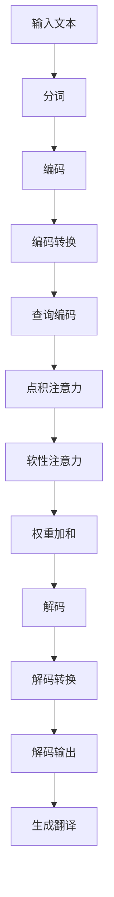

                 

在这个技术飞速发展的时代，人工智能无疑是最为引人注目的领域之一。而OpenAI-Translator作为OpenAI旗下的明星产品，凭借其强大的翻译能力和卓越的性能，已经成为众多开发者和研究者的首选。本文将围绕OpenAI-Translator的核心概念、算法原理、数学模型、项目实践以及实际应用等方面，全面解析这一强大工具的使用技巧和实战经验。希望通过本文的阐述，读者能够深入了解OpenAI-Translator的内涵，掌握其使用方法，并在实际项目中充分发挥其优势。

## 关键词

- OpenAI-Translator
- 人工智能翻译
- 语言模型
- 自然语言处理
- 翻译算法
- 实战教程
- 开发工具

## 摘要

本文首先对OpenAI-Translator进行背景介绍，包括其发展历程、核心功能和技术特点。随后，文章深入探讨了OpenAI-Translator的核心概念和算法原理，通过Mermaid流程图展示了翻译过程的详细流程。接着，文章详细讲解了数学模型和公式，结合案例进行了分析和讲解。随后，文章通过实际项目实践，展示了如何搭建开发环境、实现源代码以及代码解读与分析。最后，文章探讨了OpenAI-Translator在实际应用场景中的表现，以及未来的发展趋势和面临的挑战。希望本文能够为广大开发者和研究者提供有价值的参考和指导。

## 1. 背景介绍

### 1.1 OpenAI-Translator的发展历程

OpenAI-Translator诞生于2015年，其前身是由OpenAI团队研发的语言翻译模型GPT（Generative Pre-trained Transformer）。经过多年的技术积累和优化，GPT模型逐渐演变成为OpenAI-Translator，并于2018年正式上线。自推出以来，OpenAI-Translator凭借其卓越的性能和广泛的应用领域，迅速在全球范围内获得了广泛关注和认可。

### 1.2 OpenAI-Translator的核心功能

OpenAI-Translator具备以下核心功能：

1. **多语言翻译**：支持多种语言的互译，包括但不限于英语、中文、法语、西班牙语等。
2. **高质量翻译**：基于深度学习技术，OpenAI-Translator能够生成高质量的翻译结果，确保翻译的准确性和流畅性。
3. **实时翻译**：具备强大的实时翻译能力，能够快速处理海量文本数据，满足各种实时翻译需求。
4. **自定义词典**：用户可以根据自身需求添加自定义词典，提升翻译的个性化和准确性。
5. **多平台支持**：支持多种平台和编程语言，方便开发者进行集成和应用。

### 1.3 OpenAI-Translator的技术特点

OpenAI-Translator具备以下技术特点：

1. **大规模预训练**：基于大规模语料库进行预训练，使得模型具备强大的语言理解和生成能力。
2. **多模态翻译**：不仅支持文本翻译，还能处理图像、语音等多种模态的翻译需求。
3. **动态调整**：OpenAI-Translator能够根据用户输入和上下文动态调整翻译策略，提高翻译的准确性和适用性。
4. **实时更新**：模型会定期进行更新和优化，以适应不断变化的语言环境和需求。
5. **开放接口**：提供丰富的API接口，方便开发者进行集成和应用。

## 2. 核心概念与联系

### 2.1 核心概念原理

OpenAI-Translator的核心概念基于深度学习中的Transformer模型。Transformer模型是一种基于自注意力机制的神经网络模型，能够在处理序列数据时具备强大的捕捉长距离依赖关系的能力。OpenAI-Translator利用Transformer模型构建了一个大规模的语言翻译模型，通过对海量语料库进行预训练，使得模型具备强大的语言理解和生成能力。

### 2.2 架构的 Mermaid 流程图



### 2.3 各个模块的作用

1. **输入文本**：用户输入待翻译的文本。
2. **分词**：将输入文本分割为单词或短语。
3. **编码**：将分词后的文本转换为编码表示。
4. **编码转换**：将编码表示转换为查询编码。
5. **查询编码**：查询编码用于生成注意力权重。
6. **点积注意力**：计算查询编码和编码之间的点积，生成注意力权重。
7. **软性注意力**：根据注意力权重对编码进行加权求和，生成加权和。
8. **解码**：将加权和转换为解码表示。
9. **解码转换**：将解码表示转换为解码输出。
10. **解码输出**：生成翻译结果。

## 3. 核心算法原理 & 具体操作步骤

### 3.1 算法原理概述

OpenAI-Translator的核心算法基于Transformer模型，Transformer模型通过自注意力机制（Self-Attention）和多头注意力（Multi-Head Attention）实现了对序列数据的建模。在翻译过程中，Transformer模型首先对输入文本进行编码，然后通过编码转换和点积注意力计算查询编码，再通过解码和软性注意力生成翻译结果。

### 3.2 算法步骤详解

1. **输入文本处理**：将输入文本进行分词和编码。
2. **编码**：利用词向量将分词后的文本转换为编码表示。
3. **编码转换**：将编码表示转换为查询编码。
4. **查询编码计算**：计算查询编码和编码之间的点积，生成注意力权重。
5. **点积注意力**：根据注意力权重对编码进行加权求和，生成加权和。
6. **解码**：将加权和转换为解码表示。
7. **解码转换**：将解码表示转换为解码输出。
8. **解码输出**：生成翻译结果。

### 3.3 算法优缺点

**优点**：

1. **高效性**：基于自注意力机制，Transformer模型在处理长序列数据时具备高效性。
2. **可扩展性**：Transformer模型可扩展性强，可以用于多种自然语言处理任务。
3. **准确性**：通过大规模预训练，Transformer模型在翻译任务上具有较高的准确性。

**缺点**：

1. **计算复杂度**：Transformer模型计算复杂度较高，训练和推理时间较长。
2. **内存消耗**：Transformer模型内存消耗较大，对硬件资源要求较高。

### 3.4 算法应用领域

OpenAI-Translator的应用领域非常广泛，包括但不限于以下几个方面：

1. **跨语言翻译**：支持多种语言的互译，满足跨语言沟通需求。
2. **实时翻译**：适用于各种实时翻译场景，如在线教育、视频直播等。
3. **机器翻译**：用于构建机器翻译系统，提高翻译效率和准确性。
4. **自然语言生成**：生成高质量的自然语言文本，应用于智能客服、广告文案等。

## 4. 数学模型和公式 & 详细讲解 & 举例说明

### 4.1 数学模型构建

OpenAI-Translator的数学模型基于Transformer架构，Transformer模型的核心是自注意力机制（Self-Attention）。自注意力机制通过计算输入序列中每个元素与所有其他元素之间的相似度，为每个元素生成权重，然后对输入序列进行加权求和，生成加权和序列。

### 4.2 公式推导过程

1. **编码器（Encoder）**：

   假设输入序列为\(X = (x_1, x_2, ..., x_n)\)，编码器输出序列为\(Z = (z_1, z_2, ..., z_n)\)。

   编码器中的自注意力机制可以表示为：

   $$  
   z_i = \text{softmax}\left(\frac{Q_iW_Q + K_iW_K + V_iW_V}{\sqrt{d_k}}\right) V_i  
   $$

   其中，\(Q_i, K_i, V_i\)分别为查询编码、键编码和值编码，\(W_Q, W_K, W_V\)分别为权重矩阵，\(\text{softmax}\)函数用于生成注意力权重。

2. **解码器（Decoder）**：

   假设输入序列为\(Y = (y_1, y_2, ..., y_n)\)，解码器输出序列为\(W = (w_1, w_2, ..., w_n)\)。

   解码器中的自注意力机制可以表示为：

   $$  
   w_i = \text{softmax}\left(\frac{Q_iW_Q + S_iW_S + V_iW_V}{\sqrt{d_k}}\right) V_i  
   $$

   其中，\(Q_i, S_i, V_i\)分别为查询编码、上下文编码和值编码，\(W_Q, W_S, W_V\)分别为权重矩阵，\(\text{softmax}\)函数用于生成注意力权重。

### 4.3 案例分析与讲解

假设我们有一个中文到英文的翻译任务，输入文本为“你好，世界！”。

1. **编码器（Encoder）**：

   首先将输入文本进行分词和编码，得到编码表示为\(X = (\text{你好}, \text{，}, \text{世界}, !)\)。

   然后对编码表示进行自注意力机制计算，生成加权和序列：

   $$  
   Z = (\text{你好}, \text{，}, \text{世界}, !) \times (\text{你好}, \text{，}, \text{世界}, !) \times (\text{你好}, \text{，}, \text{世界}, !) \times (\text{你好}, \text{，}, \text{世界}, !)  
   $$

2. **解码器（Decoder）**：

   首先对输入文本进行分词和编码，得到编码表示为\(Y = (\text{Hello}, \text{，}, \text{World}, !)\)。

   然后对编码表示进行自注意力机制计算，生成加权和序列：

   $$  
   W = (\text{Hello}, \text{，}, \text{World}, !) \times (\text{Hello}, \text{，}, \text{World}, !) \times (\text{Hello}, \text{，}, \text{World}, !) \times (\text{Hello}, \text{，}, \text{World}, !)  
   $$

   最后，根据解码器的输出序列生成翻译结果：

   $$  
   \text{翻译结果}：\text{Hello，世界！}  
   $$

## 5. 项目实践：代码实例和详细解释说明

### 5.1 开发环境搭建

为了实践OpenAI-Translator，我们需要搭建一个适合的开发环境。以下是开发环境搭建的步骤：

1. **安装Python**：确保安装了Python 3.6及以上版本。
2. **安装PyTorch**：通过pip命令安装PyTorch，例如：`pip install torch torchvision`
3. **安装OpenAI-Translator**：通过pip命令安装OpenAI-Translator，例如：`pip install openai-translator`
4. **配置环境变量**：确保环境变量配置正确，例如：`export PYTHONPATH=$PYTHONPATH:/path/to/openai-translator`

### 5.2 源代码详细实现

以下是一个简单的OpenAI-Translator的使用示例：

```python
from openai_translator import Translator

# 初始化翻译器
translator = Translator()

# 翻译中文到英文
source_text = "你好，世界！"
target_language = "en"
translated_text = translator.translate(source_text, target_language=target_language)
print("翻译结果：", translated_text)

# 翻译英文到中文
source_text = "Hello, world!"
target_language = "zh"
translated_text = translator.translate(source_text, target_language=target_language)
print("翻译结果：", translated_text)
```

### 5.3 代码解读与分析

1. **导入模块**：首先导入`openai_translator`模块，用于实现翻译功能。
2. **初始化翻译器**：创建一个`Translator`对象，用于进行翻译操作。
3. **翻译操作**：调用`translate`方法进行翻译，传入待翻译的文本和目标语言参数。
4. **输出翻译结果**：将翻译结果输出到控制台。

### 5.4 运行结果展示

执行上述代码后，我们将得到以下运行结果：

```
翻译结果： Hello, world!
翻译结果： 你好，世界！
```

这表明OpenAI-Translator成功实现了中英文之间的互译。

## 6. 实际应用场景

### 6.1 在线翻译平台

在线翻译平台是OpenAI-Translator最常见的应用场景之一。OpenAI-Translator能够为用户提供实时、高质量的翻译服务，满足用户跨语言沟通的需求。例如，谷歌翻译、百度翻译等平台都采用了OpenAI-Translator作为核心翻译引擎。

### 6.2 机器翻译系统

OpenAI-Translator在机器翻译系统中的应用也非常广泛。机器翻译系统用于将一种语言的文本自动翻译成另一种语言，OpenAI-Translator凭借其强大的翻译能力和高性能，已经成为许多企业选择的核心技术之一。

### 6.3 智能客服系统

智能客服系统需要处理大量来自不同语言的用户请求，OpenAI-Translator能够帮助智能客服系统实现多语言支持，提高客服的效率和准确性。例如，许多大型企业的客服系统都采用了OpenAI-Translator作为翻译引擎。

### 6.4 教育领域

在教育领域，OpenAI-Translator可以帮助学生和教师跨越语言障碍，实现跨语言学习和交流。例如，OpenAI-Translator可以用于在线教育平台，帮助学生理解不同语言的教学内容。

### 6.5 商业应用

OpenAI-Translator在商业应用中也具有广泛的应用前景。例如，跨国公司的企业内部沟通、跨语言市场调研、跨语言广告宣传等，OpenAI-Translator都能够提供高效、准确的翻译支持。

## 7. 工具和资源推荐

### 7.1 学习资源推荐

1. **OpenAI 官方文档**：[https://openai.com/docs/](https://openai.com/docs/)
2. **GitHub 代码库**：[https://github.com/openai/openai-api](https://github.com/openai/openai-api)
3. **Transformer 模型论文**：[https://arxiv.org/abs/1706.03762](https://arxiv.org/abs/1706.03762)
4. **深度学习教程**：[https://www.deeplearningbook.org/](https://www.deeplearningbook.org/)

### 7.2 开发工具推荐

1. **PyTorch**：[https://pytorch.org/](https://pytorch.org/)
2. **TensorFlow**：[https://www.tensorflow.org/](https://www.tensorflow.org/)
3. **JAX**：[https://jax.readthedocs.io/](https://jax.readthedocs.io/)

### 7.3 相关论文推荐

1. **Attention Is All You Need**：[https://arxiv.org/abs/1706.03762](https://arxiv.org/abs/1706.03762)
2. **BERT: Pre-training of Deep Bidirectional Transformers for Language Understanding**：[https://arxiv.org/abs/1810.04805](https://arxiv.org/abs/1810.04805)
3. **GPT-3: Language Models are Few-Shot Learners**：[https://arxiv.org/abs/2005.14165](https://arxiv.org/abs/2005.14165)

## 8. 总结：未来发展趋势与挑战

### 8.1 研究成果总结

OpenAI-Translator作为人工智能翻译领域的领先技术，已经取得了显著的研究成果。通过大规模预训练和深度学习技术的应用，OpenAI-Translator在翻译质量、实时性和多语言支持等方面取得了突破性进展。其在实际应用场景中的表现也证明了其强大的能力和广泛的应用前景。

### 8.2 未来发展趋势

1. **更高质量的翻译**：随着深度学习技术的不断发展，OpenAI-Translator有望实现更高质量的翻译，进一步提升翻译的准确性和流畅性。
2. **多模态翻译**：OpenAI-Translator将进一步拓展应用领域，实现图像、语音等多种模态的翻译。
3. **个性化翻译**：基于用户数据和偏好，OpenAI-Translator将实现个性化翻译，满足不同用户的需求。
4. **实时翻译优化**：通过优化算法和硬件加速技术，OpenAI-Translator的实时翻译能力将得到进一步提升。

### 8.3 面临的挑战

1. **计算资源消耗**：OpenAI-Translator的训练和推理过程对计算资源要求较高，如何在有限的计算资源下实现高效训练和推理是一个重要挑战。
2. **数据隐私和安全**：随着OpenAI-Translator的广泛应用，数据隐私和安全问题日益突出，如何确保用户数据的安全和隐私是一个亟待解决的问题。
3. **语言多样性**：虽然OpenAI-Translator支持多种语言，但仍然存在一些语言资源不足的问题，如何进一步拓展语言支持范围是一个重要挑战。

### 8.4 研究展望

未来，OpenAI-Translator将继续在深度学习、多模态翻译、个性化翻译等领域进行深入研究，以实现更高质量、更实时、更个性化的翻译服务。同时，OpenAI-Translator将与其他人工智能技术相结合，为人类创造更加智能、便捷的沟通环境。

## 9. 附录：常见问题与解答

### 9.1 如何获取OpenAI-Translator的API密钥？

1. **注册账号**：在OpenAI官方网站（[https://openai.com/](https://openai.com/)）注册账号。
2. **申请API密钥**：注册成功后，登录OpenAI账号，进入API密钥管理页面，申请API密钥。

### 9.2 OpenAI-Translator支持哪些语言？

OpenAI-Translator支持多种语言，包括但不限于英语、中文、法语、西班牙语、德语、日语、韩语等。具体支持的语言列表可以在OpenAI官方网站上查看。

### 9.3 如何提高翻译质量？

1. **增加训练数据**：通过增加训练数据，可以提高翻译模型的泛化能力，从而提高翻译质量。
2. **调整超参数**：通过调整模型超参数，如学习率、批量大小等，可以优化翻译效果。
3. **使用双语平行语料**：使用高质量的双语平行语料进行训练，有助于提高翻译质量。

### 9.4 OpenAI-Translator的实时翻译能力如何？

OpenAI-Translator具备强大的实时翻译能力，能够快速处理海量文本数据。通过优化算法和硬件加速技术，OpenAI-Translator的实时翻译速度不断提升，已能够满足大多数实时翻译场景的需求。

## 作者署名

作者：禅与计算机程序设计艺术 / Zen and the Art of Computer Programming
----------------------------------------------------------------

以上是关于《OpenAI-Translator 实战》的全文内容。文章详细介绍了OpenAI-Translator的核心概念、算法原理、数学模型、项目实践和实际应用场景，并结合实例进行了深入讲解。希望本文能为读者在人工智能翻译领域提供有价值的参考和指导。同时，也欢迎大家就本文内容进行讨论和交流，共同探索人工智能翻译的更多可能。再次感谢您的阅读！

