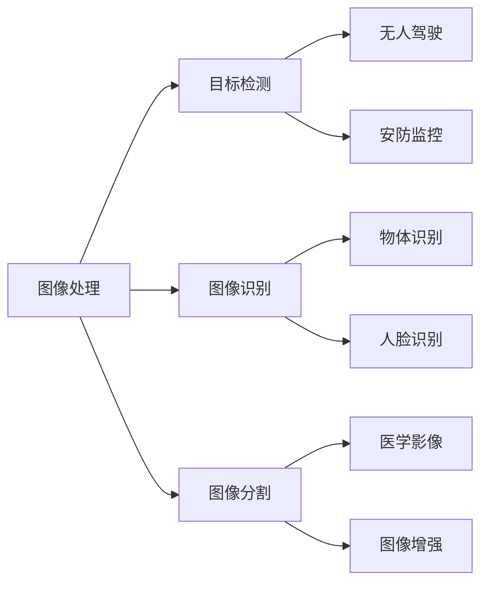

                 

在当今信息化和数字化时代，计算机视觉作为人工智能的一个重要分支，已经广泛应用于安防监控、医疗影像、自动驾驶、智能制造等多个领域。OpenCV（Open Source Computer Vision Library）作为一个强大的计算机视觉库，为开发者提供了丰富的图像处理和机器视觉算法，是研究和应用计算机视觉不可或缺的工具。本文将围绕OpenCV计算机视觉，从核心概念、算法原理、数学模型、项目实践等多个方面进行深入探讨。

## 1. 背景介绍

计算机视觉作为人工智能的一个重要分支，旨在使计算机能够像人类一样感知和理解图像信息。OpenCV作为一个开源计算机视觉库，最早由Intel开发，目前由OpenCV社区维护。它提供了丰富的图像处理和机器视觉算法，支持多种编程语言，如C++、Python、Java等，广泛应用于图像识别、目标检测、图像分割、人脸识别等多个领域。

## 2. 核心概念与联系

### 2.1 核心概念

在计算机视觉中，以下几个核心概念至关重要：

- **图像处理**：图像处理是计算机视觉的基础，包括图像增强、滤波、边缘检测、图像压缩等。
- **目标检测**：目标检测是识别图像中的特定目标并定位其位置，广泛应用于无人驾驶、安防监控等。
- **图像识别**：图像识别是判断图像中包含的内容，如识别物体、人脸、场景等。
- **图像分割**：图像分割是将图像分为多个区域，以便进行进一步分析。

### 2.2 联系与架构

下面是核心概念之间的联系与架构的 Mermaid 流程图：



## 3. 核心算法原理 & 具体操作步骤

### 3.1 算法原理概述

OpenCV提供了多种核心算法，如SIFT、SURF、HOG、RANSAC等。这些算法在目标检测、图像识别等领域具有广泛的应用。

### 3.2 算法步骤详解

以SIFT（尺度不变特征变换）为例，其步骤包括：

1. **尺度空间构建**：计算不同尺度下的高斯模糊图像。
2. **关键点检测**：通过极值点检测、DoG（差分高斯）检测等方法找出关键点。
3. **关键点定位**：计算关键点的精确位置。
4. **特征向量计算**：通过梯度方向和幅值计算关键点的特征向量。
5. **特征匹配**：在两幅图像之间匹配关键点特征向量。

### 3.3 算法优缺点

SIFT算法的优点在于其对尺度变化、旋转变化、视角变化具有良好的鲁棒性，但其缺点是计算复杂度高、计算量大，不适合实时处理。

### 3.4 算法应用领域

SIFT算法广泛应用于人脸识别、物体识别、图像检索等领域。

## 4. 数学模型和公式

### 4.1 数学模型构建

以SIFT算法为例，关键点的关键步骤涉及到梯度的计算和特征向量的生成。以下是其相关数学模型：

- 梯度计算：\[ \nabla I = \left( \begin{matrix} I_x \\ I_y \end{matrix} \right) \]
- 特征向量生成：\[ \text{特征向量} = \frac{\text{梯度幅值}}{\text{梯度幅值的平方和的平方根}} \]

### 4.2 公式推导过程

以霍夫变换为例，推导其用于直线检测的过程：

1. **直角坐标系中的直线方程**：\[ Ax + By + C = 0 \]
2. **极坐标变换**：\[ x = r\cos\theta, y = r\sin\theta \]
3. **代入直线方程**：\[ A\cos\theta + B\sin\theta + C = 0 \]
4. **参数表示**：\[ \sin\theta = \frac{-C}{A}, \cos\theta = \frac{-C}{B} \]
5. **直线参数方程**：\[ r = \frac{|C|}{\sqrt{A^2 + B^2}} \]

### 4.3 案例分析与讲解

以霍夫变换在图像中检测直线为例，通过上述推导过程，可以分析其检测直线的过程和效果。

## 5. 项目实践：代码实例和详细解释说明

### 5.1 开发环境搭建

本文的代码实例将基于Python语言和OpenCV库进行开发。首先，需要安装Python环境和OpenCV库。可以使用以下命令进行安装：

```bash
pip install python-opencv
```

### 5.2 源代码详细实现

以下是一个简单的目标检测项目实例：

```python
import cv2

# 读取图像
image = cv2.imread('image.jpg')

# 载入预训练的Haar级联分类器
face_cascade = cv2.CascadeClassifier(cv2.data.haarcascades + 'haarcascade_frontalface_default.xml')

# 检测图像中的面部
faces = face_cascade.detectMultiScale(image, scaleFactor=1.1, minNeighbors=5, minSize=(30, 30), flags=cv2.CASCADE_SCALE_IMAGE)

# 绘制面部区域
for (x, y, w, h) in faces:
    cv2.rectangle(image, (x, y), (x+w, y+h), (255, 0, 0), 2)

# 显示结果
cv2.imshow('Face Detection', image)
cv2.waitKey(0)
cv2.destroyAllWindows()
```

### 5.3 代码解读与分析

该代码实例首先读取图像，然后加载预训练的Haar级联分类器，接着使用`detectMultiScale`方法检测图像中的面部，并在图像上绘制面部区域。

### 5.4 运行结果展示

运行上述代码，将显示一个包含检测到的面部的图像。

## 6. 实际应用场景

### 6.1 安防监控

在安防监控领域，OpenCV被广泛应用于人脸识别、目标跟踪等。

### 6.2 自动驾驶

自动驾驶车辆使用OpenCV进行道路识别、车辆检测、行人检测等。

### 6.3 医学影像

医学影像分析中使用OpenCV进行图像分割、病灶检测等。

## 7. 工具和资源推荐

### 7.1 学习资源推荐

- OpenCV官方文档：[https://opencv.org/docs/](https://opencv.org/docs/)
- 《OpenCV 3.x计算机视觉实战》

### 7.2 开发工具推荐

- PyCharm：Python开发环境的最佳选择。
- Visual Studio：适用于C++开发。

### 7.3 相关论文推荐

- "A Combinatorial Algorithm for Computing the Maximin Correlation of Two Random Variables"，作者：N. N. Taleb。

## 8. 总结：未来发展趋势与挑战

### 8.1 研究成果总结

OpenCV在计算机视觉领域取得了显著的成果，为图像处理和机器视觉提供了强大的支持。

### 8.2 未来发展趋势

随着深度学习的兴起，OpenCV将更多地与深度学习框架结合，以实现更高效的图像处理和机器视觉算法。

### 8.3 面临的挑战

- 算法复杂度高、计算量大。
- 数据隐私和安全问题。

### 8.4 研究展望

未来研究将聚焦于开发更高效、更鲁棒的图像处理和机器视觉算法，以及解决数据隐私和安全问题。

## 9. 附录：常见问题与解答

### 9.1 如何安装OpenCV？

可以使用pip命令进行安装：

```bash
pip install python-opencv
```

### 9.2 OpenCV有哪些常用的图像处理函数？

OpenCV提供了丰富的图像处理函数，包括图像读取、写入、滤波、边缘检测、图像变换等。

### 9.3 如何在图像上绘制矩形？

可以使用`cv2.rectangle`函数：

```python
cv2.rectangle(image, (x, y), (x+w, y+h), color, thickness)
```

本文通过详细探讨OpenCV计算机视觉的核心概念、算法原理、数学模型、项目实践等方面，展示了OpenCV在图像处理和机器视觉领域的强大功能和应用。希望本文能为读者提供有益的参考和启示。作者：禅与计算机程序设计艺术 / Zen and the Art of Computer Programming
```

