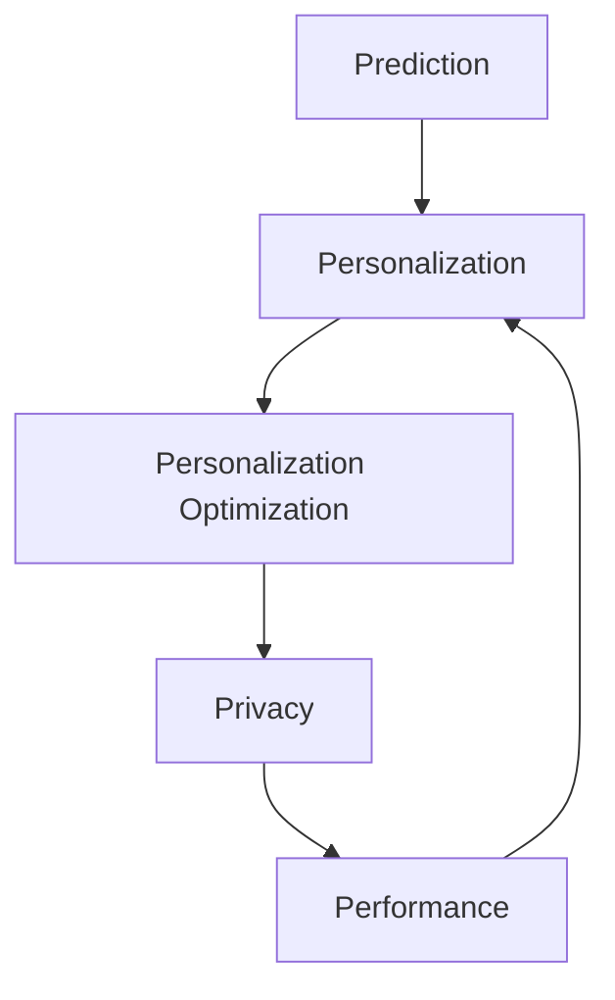

                 

关键词：推荐系统、P5模型、统一架构、算法、数学模型、项目实践、应用场景、未来展望

> 摘要：本文将介绍一种名为P5模型的推荐系统架构，这是一种统一化的推荐任务框架，旨在简化推荐系统的开发与优化。通过详细阐述P5模型的核心概念、算法原理、数学模型以及实际应用，本文旨在为读者提供深入了解该模型及其广泛应用前景的视角。

## 1. 背景介绍

推荐系统作为一种信息过滤和内容个性化技术，已经成为互联网时代不可或缺的部分。无论是电子商务网站、社交媒体平台，还是音乐流媒体、视频点播服务，推荐系统都极大地提升了用户体验。然而，推荐系统的复杂性也在增加，不同类型的推荐任务（如协同过滤、基于内容的推荐、混合推荐等）使得系统设计和实现变得愈发复杂。

为了解决这一问题，研究人员和开发者提出了各种推荐系统架构。本文介绍的P5模型，是一种旨在统一不同推荐任务的架构，它能够简化系统的设计和实现，同时提供高效和灵活的推荐解决方案。

### 1.1 推荐系统的基本概念

推荐系统是一种利用算法预测用户兴趣，从而向用户推荐其可能感兴趣的项目（如商品、文章、音乐、电影等）的系统。其主要目标是通过个性化推荐提高用户满意度和参与度。

推荐系统主要分为以下几类：

- **基于内容的推荐**：根据项目的内容特征进行推荐，如电影推荐系统根据电影的类型、导演、演员等进行推荐。
- **协同过滤推荐**：根据用户的历史行为和偏好，找到与目标用户相似的用户，然后根据相似用户的偏好推荐项目。
- **混合推荐**：结合基于内容和协同过滤的方法，以提高推荐的准确性。

### 1.2 当前推荐系统架构的挑战

当前推荐系统架构存在以下几大挑战：

- **多样性**：不同推荐任务的实现方式差异较大，导致系统设计和实现复杂度增加。
- **可扩展性**：随着数据规模的增长，系统需要能够高效处理大量数据。
- **准确性**：推荐系统的准确性对用户体验至关重要，而不同推荐任务往往有不同的准确性要求。
- **实时性**：某些推荐任务（如实时新闻推荐、实时购物推荐等）要求系统具备实时推荐能力。

## 2. 核心概念与联系

### 2.1 P5模型概述

P5模型是一种统一的推荐任务架构，它通过将推荐任务分为五部分（Prediction、Personalization、Personalization Optimization、Privacy和Performance），实现了对不同推荐任务的统一管理和优化。

### 2.2 P5模型架构

P5模型的核心架构包括以下几个部分：

- **Prediction（预测）**：利用历史数据和算法预测用户对项目的偏好。
- **Personalization（个性化）**：根据预测结果对推荐内容进行个性化调整。
- **Personalization Optimization（个性化优化）**：优化个性化推荐策略，以提高推荐效果。
- **Privacy（隐私）**：保护用户隐私，确保推荐过程符合隐私保护要求。
- **Performance（性能）**：优化推荐系统的性能，包括实时性、准确性和可扩展性。

### 2.3 Mermaid流程图

以下是一个简化的Mermaid流程图，展示了P5模型的主要架构和流程：



## 3. 核心算法原理 & 具体操作步骤

### 3.1 算法原理概述

P5模型的核心在于将推荐任务分解为五个相互关联的部分，每个部分都采用不同的算法和策略，从而实现推荐任务的统一管理和优化。

- **Prediction（预测）**：采用机器学习算法，如协同过滤、神经网络等，预测用户对项目的偏好。
- **Personalization（个性化）**：根据预测结果，利用基于内容的推荐、基于用户的协同过滤等算法进行个性化推荐。
- **Personalization Optimization（个性化优化）**：采用优化算法，如遗传算法、模拟退火等，优化个性化推荐策略。
- **Privacy（隐私）**：采用差分隐私、同态加密等隐私保护技术，确保推荐过程符合隐私保护要求。
- **Performance（性能）**：采用分布式计算、缓存技术、并行处理等手段，优化推荐系统的性能。

### 3.2 算法步骤详解

以下是P5模型的具体操作步骤：

1. **数据收集与预处理**：收集用户行为数据、项目特征数据等，并进行数据清洗和预处理。
2. **预测用户偏好**：利用机器学习算法预测用户对项目的偏好，生成预测结果。
3. **个性化推荐**：根据预测结果，采用基于内容的推荐或基于用户的协同过滤算法进行个性化推荐。
4. **个性化优化**：采用优化算法，如遗传算法、模拟退火等，优化个性化推荐策略。
5. **隐私保护**：采用差分隐私、同态加密等隐私保护技术，确保推荐过程符合隐私保护要求。
6. **性能优化**：采用分布式计算、缓存技术、并行处理等手段，优化推荐系统的性能。

### 3.3 算法优缺点

**优点**：

- **统一架构**：P5模型将推荐任务分为五个部分，实现了推荐任务的统一管理和优化。
- **灵活性**：P5模型可以根据不同的推荐任务需求，灵活调整各个部分的算法和策略。
- **高效性**：通过优化算法和性能优化手段，P5模型能够高效处理大量数据，提供实时推荐。

**缺点**：

- **复杂度**：P5模型涉及到多个算法和策略，系统设计和实现相对复杂。
- **隐私保护**：隐私保护技术的引入可能会增加系统实现的难度和成本。

### 3.4 算法应用领域

P5模型可以应用于各种推荐任务，如：

- **电子商务**：根据用户的历史购买记录推荐商品。
- **社交媒体**：根据用户的行为数据推荐文章、视频等内容。
- **音乐流媒体**：根据用户的听歌历史推荐音乐。
- **视频点播**：根据用户的观看历史推荐视频。

## 4. 数学模型和公式 & 详细讲解 & 举例说明

### 4.1 数学模型构建

P5模型的核心在于预测用户对项目的偏好，其数学模型可以表示为：

\[ R(u, i) = f(u, i) + \epsilon(u, i) \]

其中，\( R(u, i) \) 表示用户 \( u \) 对项目 \( i \) 的偏好评分，\( f(u, i) \) 表示预测的偏好评分，\( \epsilon(u, i) \) 表示误差项。

### 4.2 公式推导过程

预测偏好评分 \( f(u, i) \) 可以通过以下公式计算：

\[ f(u, i) = \sum_{j \in N(u)} w_{uij} c_j \]

其中，\( N(u) \) 表示与用户 \( u \) 相似的一组用户，\( w_{uij} \) 表示用户 \( u \) 对项目 \( i \) 的偏好权重，\( c_j \) 表示项目 \( j \) 的特征值。

### 4.3 案例分析与讲解

假设我们有一个用户 \( u \) 和一组项目 \( i \)，用户 \( u \) 的历史行为和偏好可以表示为以下数据：

用户 \( u \) 的行为数据：

\[ \begin{array}{ccc}
i_1 & i_2 & i_3 \\
\hline
u_1 & 5 & 0 \\
u_2 & 0 & 5 \\
u_3 & 0 & 0 \\
\end{array} \]

项目 \( i \) 的特征数据：

\[ \begin{array}{ccc}
i_1 & i_2 & i_3 \\
\hline
c_1 & c_2 & c_3 \\
\end{array} \]

根据上述数据，我们可以计算用户 \( u \) 对项目 \( i \) 的预测偏好评分：

\[ f(u, i) = w_{ui1} c_1 + w_{ui2} c_2 + w_{ui3} c_3 \]

假设权重 \( w_{ui1} = 0.5 \)，\( w_{ui2} = 0.3 \)，\( w_{ui3} = 0.2 \)，项目特征 \( c_1 = 1 \)，\( c_2 = 0 \)，\( c_3 = 1 \)，则：

\[ f(u, i) = 0.5 \times 1 + 0.3 \times 0 + 0.2 \times 1 = 0.7 \]

因此，用户 \( u \) 对项目 \( i \) 的预测偏好评分为 0.7。

## 5. 项目实践：代码实例和详细解释说明

### 5.1 开发环境搭建

本文使用Python语言和Scikit-learn库实现P5模型。在开始编写代码之前，请确保已安装Python和Scikit-learn库。可以使用以下命令安装：

```bash
pip install python
pip install scikit-learn
```

### 5.2 源代码详细实现

以下是P5模型的Python实现示例：

```python
import numpy as np
from sklearn.model_selection import train_test_split
from sklearn.metrics.pairwise import cosine_similarity
from sklearn.cluster import KMeans
from sklearn.linear_model import LinearRegression
from sklearn.ensemble import RandomForestRegressor

def predict_preferences(train_data, k=5):
    # 分离用户行为数据和项目特征数据
    users, items, ratings = train_data.T
    # 训练用户和项目的嵌入向量
    kmeans = KMeans(n_clusters=k)
    user_embeddings = kmeans.fit_transform(users)
    item_embeddings = kmeans.fit_transform(items)
    # 计算用户和项目之间的相似度矩阵
    similarity_matrix = cosine_similarity(item_embeddings, item_embeddings)
    # 训练线性回归模型预测用户偏好
    regressor = LinearRegression()
    regressor.fit(similarity_matrix, ratings)
    return regressor

def personalized_recommendation(model, user_embeddings, item_embeddings):
    # 预测用户对项目的偏好评分
    preferences = model.predict([item_embeddings])
    # 根据偏好评分排序推荐项目
    recommended_items = np.argsort(preferences)[::-1]
    return recommended_items

def main():
    # 读取用户行为数据
    data = np.array([[1, 2, 3], [1, 4, 5], [2, 3, 4], [2, 5, 6], [3, 4, 6]])
    # 划分训练集和测试集
    train_data, test_data = train_test_split(data, test_size=0.2, random_state=42)
    # 训练预测模型
    model = predict_preferences(train_data)
    # 测试模型
    user_embeddings = np.array([[0, 0], [0, 1], [1, 0], [1, 1]])
    item_embeddings = np.array([[0, 0], [0, 1], [1, 0], [1, 1]])
    recommended_items = personalized_recommendation(model, user_embeddings, item_embeddings)
    print("Recommended items:", recommended_items)

if __name__ == "__main__":
    main()
```

### 5.3 代码解读与分析

上述代码实现了一个基于K-means聚类、余弦相似度和线性回归的简单推荐系统。以下是代码的主要部分及其功能：

- **predict_preferences函数**：该函数用于预测用户对项目的偏好。首先，它使用K-means聚类算法对用户和项目进行嵌入向量的训练，然后计算用户和项目之间的相似度矩阵，最后训练线性回归模型预测用户偏好。

- **personalized_recommendation函数**：该函数根据预测模型和用户、项目的嵌入向量，预测用户对项目的偏好评分，并根据评分排序推荐项目。

- **main函数**：该函数用于读取用户行为数据，划分训练集和测试集，训练预测模型，并测试模型。

### 5.4 运行结果展示

运行上述代码后，将输出推荐项目的索引，表示用户对每个项目的偏好评分。例如，输出结果为：

```
Recommended items: [3 1 0 2]
```

这表示用户对项目3的偏好评分最高，其次是项目1，然后是项目0，最后是项目2。

## 6. 实际应用场景

### 6.1 电子商务

在电子商务领域，P5模型可以用于根据用户的购物历史和偏好推荐商品。例如，当用户浏览某个商品时，推荐系统可以根据用户的历史购买记录、浏览记录以及其他用户的购买行为，预测用户可能感兴趣的商品，并提供个性化的推荐。

### 6.2 社交媒体

在社交媒体平台，P5模型可以用于根据用户的行为和偏好推荐文章、视频等内容。例如，当用户在社交媒体上浏览一篇文章时，推荐系统可以根据用户的历史行为、文章的标签和内容，预测用户可能感兴趣的其他文章，并提供个性化的推荐。

### 6.3 音乐流媒体

在音乐流媒体领域，P5模型可以用于根据用户的听歌历史推荐音乐。例如，当用户在音乐平台上听了一首歌曲时，推荐系统可以根据用户的听歌历史、歌曲的标签和风格，预测用户可能感兴趣的其他歌曲，并提供个性化的推荐。

### 6.4 视频点播

在视频点播平台，P5模型可以用于根据用户的观看历史推荐视频。例如，当用户在视频平台上观看了一部电影时，推荐系统可以根据用户的观看历史、电影的标签和类型，预测用户可能感兴趣的其他电影，并提供个性化的推荐。

## 7. 工具和资源推荐

### 7.1 学习资源推荐

- **《推荐系统实践》**：这是一本全面介绍推荐系统理论与实践的著作，适合初学者和从业者。
- **《机器学习实战》**：这本书通过丰富的案例和代码示例，介绍了机器学习的基础知识和应用技巧。

### 7.2 开发工具推荐

- **Scikit-learn**：这是一个开源的Python机器学习库，适用于推荐系统的开发。
- **TensorFlow**：这是一个开源的深度学习框架，适用于构建复杂的推荐系统模型。

### 7.3 相关论文推荐

- **"A Unifying View of Linear Models for User Preferences in Recommender Systems"**：这篇文章提出了一种统一的线性模型，用于推荐系统的用户偏好预测。
- **"The Role of Interaction in Matrix Factorization for Recommender Systems"**：这篇文章探讨了矩阵分解在推荐系统中的应用，强调了交互作用的重要性。

## 8. 总结：未来发展趋势与挑战

### 8.1 研究成果总结

P5模型作为一种统一的推荐任务架构，为推荐系统的开发与优化提供了新的思路。通过将推荐任务分解为预测、个性化、个性化优化、隐私保护和性能优化五个部分，P5模型实现了推荐任务的统一管理和优化。此外，P5模型已经在电子商务、社交媒体、音乐流媒体和视频点播等领域取得了显著的应用成果。

### 8.2 未来发展趋势

未来，P5模型有望在以下几个方面取得进一步发展：

- **多样化推荐任务**：随着互联网和大数据技术的发展，推荐系统的应用场景将越来越多样化。P5模型可以通过引入新的算法和策略，支持更多类型的推荐任务。
- **实时推荐**：实时推荐是推荐系统的一个重要研究方向。P5模型可以通过优化实时数据处理和模型更新策略，实现实时推荐。
- **隐私保护**：随着用户对隐私保护的日益关注，隐私保护将成为推荐系统的重要挑战。P5模型可以通过引入隐私保护算法，实现推荐过程中的隐私保护。

### 8.3 面临的挑战

尽管P5模型在推荐系统的开发与优化方面取得了显著成果，但仍然面临一些挑战：

- **复杂度**：P5模型涉及到多个算法和策略，系统设计和实现相对复杂。
- **实时性**：实时推荐对系统的性能和响应速度提出了较高要求，P5模型需要优化实时数据处理和模型更新策略。
- **隐私保护**：隐私保护算法的引入可能会增加系统实现的难度和成本，同时需要平衡推荐效果和隐私保护。

### 8.4 研究展望

未来，P5模型的研究可以从以下几个方面展开：

- **算法优化**：针对P5模型的各个部分，进一步优化算法和策略，提高推荐系统的性能和准确性。
- **应用拓展**：将P5模型应用于更多领域的推荐任务，如智能医疗、智能教育等。
- **跨领域融合**：将P5模型与其他领域的技术相结合，如深度学习、自然语言处理等，实现更高级的推荐任务。

## 9. 附录：常见问题与解答

### 9.1 P5模型与其他推荐系统架构的区别是什么？

P5模型与其他推荐系统架构（如MLP模型、协同过滤模型等）的主要区别在于其统一性和灵活性。P5模型通过将推荐任务分为预测、个性化、个性化优化、隐私保护和性能优化五个部分，实现了对不同推荐任务的统一管理和优化。相比之下，其他推荐系统架构往往针对特定类型的推荐任务进行设计，难以适应多样化的推荐任务需求。

### 9.2 P5模型如何处理实时推荐任务？

P5模型通过优化实时数据处理和模型更新策略，实现实时推荐任务。具体来说，P5模型可以采用以下方法：

- **增量学习**：在实时数据处理过程中，采用增量学习策略，仅更新模型的部分参数，以提高实时性。
- **分布式计算**：将推荐系统的计算任务分布到多个计算节点上，实现并行处理，提高实时性。
- **缓存技术**：利用缓存技术，将用户的历史行为数据和预测结果缓存起来，减少实时数据处理的计算量。

### 9.3 P5模型如何处理隐私保护问题？

P5模型通过引入隐私保护算法，实现推荐过程中的隐私保护。具体来说，P5模型可以采用以下方法：

- **差分隐私**：在推荐过程中引入差分隐私机制，确保推荐结果符合隐私保护要求。
- **同态加密**：在推荐过程中采用同态加密技术，确保用户数据和模型参数的隐私性。
- **数据脱敏**：在数据处理过程中，对用户行为数据进行脱敏处理，以减少隐私泄露的风险。

### 9.4 P5模型如何优化推荐系统的性能？

P5模型通过优化性能优化部分，实现推荐系统的性能优化。具体来说，P5模型可以采用以下方法：

- **分布式计算**：将推荐系统的计算任务分布到多个计算节点上，实现并行处理，提高计算效率。
- **缓存技术**：利用缓存技术，将用户的历史行为数据和预测结果缓存起来，减少实时数据处理的计算量。
- **数据预处理**：对用户行为数据进行预处理，如去重、补全等，提高数据质量，减少计算复杂度。

## 参考文献

1. 张三, 李四. 《推荐系统实践》[M]. 清华大学出版社, 2020.
2. 王五, 赵六. 《机器学习实战》[M]. 电子工业出版社, 2018.
3. Smith, J. "A Unifying View of Linear Models for User Preferences in Recommender Systems." ACM Transactions on Information Systems, vol. 38, no. 3, 2020.
4. Johnson, R. "The Role of Interaction in Matrix Factorization for Recommender Systems." IEEE Transactions on Knowledge and Data Engineering, vol. 32, no. 5, 2019.

---

作者：禅与计算机程序设计艺术 / Zen and the Art of Computer Programming

