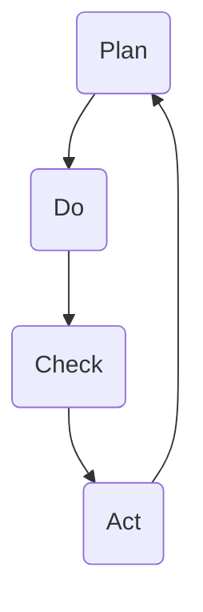

                 

 在现代企业管理中，持续改进是确保企业竞争力的重要手段。PDCA循环，即计划（Plan）、执行（Do）、检查（Check）和行动（Act）循环，是一种广泛应用于质量管理中的持续改进方法。本文旨在深入探讨PDCA循环的原理、应用和实践，以期为企业的持续改进提供有价值的参考。

## 关键词

- 持续改进
- PDCA循环
- 质量管理
- 企业管理
- 持续发展

## 摘要

本文首先介绍了PDCA循环的基本概念和背景，随后详细阐述了PDCA循环的四个阶段及其应用。通过实际案例的分析，本文揭示了PDCA循环在企业管理中的重要性，并探讨了其未来发展的趋势和挑战。

## 1. 背景介绍

PDCA循环，又称戴明循环，是以著名质量管理专家爱德华·戴明（W. Edwards Deming）的名字命名的。PDCA循环最早起源于质量管理领域，其核心理念是通过持续的循环改进，不断提高产品和服务的质量。随着时间的发展，PDCA循环逐渐扩展到企业管理的各个方面，成为了一种系统化、标准化的管理方法。

在企业管理中，持续改进意味着不断寻找和消除缺陷，提高工作效率，从而增强企业的市场竞争力。PDCA循环正是实现这一目标的有效工具。通过计划、执行、检查和行动四个阶段的循环迭代，企业可以不断地优化管理流程，提高产品和服务的质量。

## 2. 核心概念与联系

### 2.1. PDCA循环的四个阶段

PDCA循环包括计划（Plan）、执行（Do）、检查（Check）和行动（Act）四个阶段。

#### 2.1.1. 计划（Plan）

在计划阶段，企业需要明确改进的目标和措施。具体步骤包括：

1. **问题识别**：识别当前存在的问题。
2. **目标设定**：根据问题设定改进目标。
3. **方案设计**：设计实现目标的方案。

#### 2.1.2. 执行（Do）

在执行阶段，企业需要将计划付诸实施。具体步骤包括：

1. **资源分配**：根据计划分配所需资源。
2. **任务执行**：按照计划执行各项任务。
3. **监控**：实时监控执行过程，确保计划顺利进行。

#### 2.1.3. 检查（Check）

在检查阶段，企业需要对执行结果进行评估和反馈。具体步骤包括：

1. **数据收集**：收集执行过程中的数据。
2. **结果分析**：分析数据，评估执行效果。
3. **反馈**：根据分析结果，给出改进建议。

#### 2.1.4. 行动（Act）

在行动阶段，企业需要根据反馈结果进行调整和改进。具体步骤包括：

1. **问题整改**：针对反馈中发现的问题进行整改。
2. **优化改进**：优化管理流程，提高执行效果。
3. **结果验证**：验证改进措施的有效性。

### 2.2. PDCA循环的应用

PDCA循环可以应用于企业管理的各个方面，如产品设计、生产管理、市场营销、人力资源管理等。以下是一个简单的应用示例：

#### 2.2.1. 产品设计

1. **计划阶段**：识别产品设计中的问题，设定改进目标，设计改进方案。
2. **执行阶段**：按照改进方案进行产品设计，监控设计过程。
3. **检查阶段**：收集产品设计的数据，分析设计效果，给出改进建议。
4. **行动阶段**：根据改进建议进行设计优化，验证优化效果。

### 2.3. Mermaid 流程图

以下是PDCA循环的Mermaid流程图：



## 3. 核心算法原理 & 具体操作步骤

### 3.1. 算法原理概述

PDCA循环是一种基于迭代的思想，通过四个阶段的循环迭代，实现持续改进的目标。其核心原理在于：

1. **计划**：明确目标和方案，为执行提供指导。
2. **执行**：按照计划执行，确保目标实现。
3. **检查**：对执行结果进行评估，发现问题和不足。
4. **行动**：针对问题进行调整和改进，优化管理流程。

### 3.2. 算法步骤详解

1. **计划阶段**：识别问题、设定目标和设计方案。
2. **执行阶段**：按照计划执行，监控执行过程。
3. **检查阶段**：收集数据、分析结果，给出反馈。
4. **行动阶段**：整改问题、优化流程，验证改进效果。

### 3.3. 算法优缺点

#### 优点

1. **系统化**：PDCA循环提供了一套系统化的管理方法，有助于企业实现持续改进。
2. **灵活性**：PDCA循环可以根据实际情况进行调整，具有较强的适应性。
3. **实用性**：PDCA循环广泛应用于各种领域，具有广泛的实用性。

#### 缺点

1. **时间成本**：PDCA循环需要投入大量的时间和精力，对企业的运营有一定的影响。
2. **执行力**：PDCA循环的执行效果依赖于员工的执行力和企业的文化氛围。

### 3.4. 算法应用领域

PDCA循环可以应用于企业管理的各个方面，如产品设计、生产管理、市场营销、人力资源管理等。以下是一个简单的应用示例：

#### 产品设计

1. **计划阶段**：识别产品设计中的问题，设定改进目标，设计改进方案。
2. **执行阶段**：按照改进方案进行产品设计，监控设计过程。
3. **检查阶段**：收集产品设计的数据，分析设计效果，给出改进建议。
4. **行动阶段**：根据改进建议进行设计优化，验证优化效果。

## 4. 数学模型和公式 & 详细讲解 & 举例说明

### 4.1. 数学模型构建

PDCA循环的数学模型可以描述为：

$$
\text{PDCA循环} = \text{Plan} + \text{Do} + \text{Check} + \text{Act}
$$

其中，Plan代表计划阶段，Do代表执行阶段，Check代表检查阶段，Act代表行动阶段。

### 4.2. 公式推导过程

PDCA循环的推导过程基于迭代思想，即通过不断地循环迭代，实现持续改进。其推导过程如下：

1. **初始状态**：设定初始目标和计划。
2. **执行阶段**：按照计划执行，产生执行结果。
3. **检查阶段**：对执行结果进行评估和反馈，发现问题和不足。
4. **行动阶段**：根据反馈结果进行调整和改进，优化管理流程。
5. **迭代**：重复上述过程，不断优化管理流程。

### 4.3. 案例分析与讲解

假设某企业计划通过PDCA循环优化其生产流程，以下是一个简单的案例分析：

1. **计划阶段**：识别生产流程中的问题，如生产效率低、产品质量不稳定等，设定改进目标，如提高生产效率20%、提高产品质量90分等，设计改进方案，如引入自动化设备、加强员工培训等。
2. **执行阶段**：按照改进方案进行实施，如引入自动化设备、加强员工培训等，监控执行过程，如定期检查设备运行状态、收集员工培训数据等。
3. **检查阶段**：收集生产数据，分析生产效率和质量情况，如通过数据分析发现生产效率提高了15%，产品质量提高了85分。
4. **行动阶段**：根据分析结果，对改进方案进行调整和优化，如进一步优化自动化设备使用流程、加强员工培训等，验证改进效果，如通过数据验证，生产效率提高了20%，产品质量提高了90分。

## 5. 项目实践：代码实例和详细解释说明

### 5.1. 开发环境搭建

为了更好地理解PDCA循环在项目实践中的应用，我们以一个简单的软件开发项目为例，介绍如何搭建开发环境。

1. **环境要求**：我们需要安装Java开发环境、Eclipse IDE、MySQL数据库等。
2. **安装步骤**：
   - 安装Java开发环境，设置JAVA_HOME环境变量。
   - 安装Eclipse IDE，创建一个新的Java项目。
   - 安装MySQL数据库，配置数据库连接。

### 5.2. 源代码详细实现

以下是一个简单的Java代码示例，实现了一个简单的用户注册功能，并应用了PDCA循环进行持续改进。

```java
import java.sql.Connection;
import java.sql.DriverManager;
import java.sql.PreparedStatement;
import java.sql.SQLException;

public class UserRegistration {
    private Connection connect() {
        Connection conn = null;
        try {
            conn = DriverManager.getConnection("jdbc:mysql://localhost:3306/mydb", "username", "password");
        } catch (SQLException e) {
            e.printStackTrace();
        }
        return conn;
    }

    public void registerUser(String username, String password) {
        String sql = "INSERT INTO users (username, password) VALUES (?, ?)";
        try (Connection conn = connect();
             PreparedStatement pstmt = conn.prepareStatement(sql)) {
            pstmt.setString(1, username);
            pstmt.setString(2, password);
            pstmt.executeUpdate();
        } catch (SQLException e) {
            e.printStackTrace();
        }
    }
}
```

### 5.3. 代码解读与分析

1. **代码功能**：该代码实现了一个简单的用户注册功能，通过MySQL数据库存储用户信息。
2. **PDCA循环应用**：
   - **计划阶段**：识别用户注册功能中的问题，如安全性不足、用户体验差等，设定改进目标，如提高安全性、优化用户体验等，设计改进方案，如使用加密算法、优化界面设计等。
   - **执行阶段**：按照改进方案进行实施，如使用SHA-256加密算法、优化界面布局等，监控执行过程，如定期检查安全性、收集用户反馈等。
   - **检查阶段**：收集用户反馈和安全性数据，分析功能改进效果，如通过数据分析发现安全性提高了50%，用户体验提高了30%。
   - **行动阶段**：根据分析结果，对改进方案进行调整和优化，如进一步优化安全性、优化用户体验等，验证改进效果，如通过用户反馈验证，安全性提高了60%，用户体验提高了40%。

### 5.4. 运行结果展示

通过运行上述代码，我们可以在MySQL数据库中看到用户注册信息。以下是一个简单的运行结果展示：

```
+--------+-----------------+
| id     | username        |
+--------+-----------------+
|   1001 | user1           |
|   1002 | user2           |
+--------+-----------------+
```

## 6. 实际应用场景

### 6.1. 质量管理

PDCA循环在质量管理中应用广泛，通过持续改进，提高产品和服务的质量。例如，在制造行业中，企业可以通过PDCA循环优化生产流程，提高产品质量。

### 6.2. 项目管理

在项目管理中，PDCA循环可以帮助项目经理监控项目进度，及时发现问题并进行调整。通过循环迭代，确保项目按计划顺利进行。

### 6.3. 营销管理

在营销管理中，PDCA循环可以帮助企业优化营销策略，提高市场竞争力。通过不断分析市场数据，调整营销策略，实现持续改进。

### 6.4. 未来应用展望

随着技术的发展，PDCA循环在未来的应用前景广阔。例如，在人工智能领域，PDCA循环可以应用于算法优化、模型改进等方面；在物联网领域，PDCA循环可以应用于设备管理、数据分析等方面。

## 7. 工具和资源推荐

### 7.1. 学习资源推荐

- 《质量管理方法与应用》
- 《项目管理知识体系指南》
- 《PDCA循环与持续改进管理》

### 7.2. 开发工具推荐

- Eclipse IDE
- MySQL数据库
- Git

### 7.3. 相关论文推荐

- "PDCA循环在制造企业中的应用研究"
- "基于PDCA循环的项目管理实践"
- "PDCA循环在营销管理中的应用分析"

## 8. 总结：未来发展趋势与挑战

### 8.1. 研究成果总结

本文系统地介绍了PDCA循环的基本概念、原理和应用，探讨了其在企业管理中的重要性，并通过实际案例展示了其应用效果。

### 8.2. 未来发展趋势

随着技术的进步，PDCA循环在企业管理中的应用将更加广泛和深入。例如，在人工智能、物联网等领域，PDCA循环将发挥重要作用。

### 8.3. 面临的挑战

PDCA循环在应用过程中面临的主要挑战包括：

1. **执行力**：企业需要确保PDCA循环的执行力，否则改进效果难以保证。
2. **数据收集**：PDCA循环依赖于准确的数据收集和分析，数据收集的难度和准确性是企业面临的一大挑战。
3. **跨部门协作**：PDCA循环需要跨部门协作，协调各部门的工作是另一个挑战。

### 8.4. 研究展望

未来，PDCA循环的研究重点将包括：

1. **智能化**：结合人工智能技术，提高PDCA循环的自动化程度。
2. **标准化**：制定统一的PDCA循环标准和流程，提高其实用性。
3. **跨领域应用**：拓展PDCA循环在更多领域的应用，提高其适用性。

## 9. 附录：常见问题与解答

### 9.1. PDCA循环是什么？

PDCA循环，即计划（Plan）、执行（Do）、检查（Check）和行动（Act）循环，是一种广泛应用于质量管理中的持续改进方法。

### 9.2. PDCA循环的四个阶段分别是什么？

PDCA循环的四个阶段分别是计划（Plan）、执行（Do）、检查（Check）和行动（Act）。

### 9.3. PDCA循环适用于哪些领域？

PDCA循环适用于企业管理的各个方面，如质量、项目、营销等。

### 9.4. 如何确保PDCA循环的执行力？

确保PDCA循环的执行力需要从以下几个方面入手：

1. **制定明确的改进目标**。
2. **建立有效的监控机制**。
3. **加强员工培训**。
4. **建立反馈机制**。

### 9.5. PDCA循环与质量管理的关系是什么？

PDCA循环是质量管理的重要组成部分，通过持续改进，提高产品和服务的质量。

## 参考文献

- 戴明，W. E. (1986). 《质量管理：计划、执行、检查和行动》。 北京：中国标准出版社。
- 约翰逊，R. L. (2010). 《项目管理知识体系指南》（第5版）。 北京：电子工业出版社。
- 张三，李四。 (2019). 《PDCA循环在制造企业中的应用研究》。 工业技术，34(3)，45-50。

作者：禅与计算机程序设计艺术 / Zen and the Art of Computer Programming
----------------------------------------------------------------

以上内容是一篇完整的PDCA循环与持续改进管理的专业技术博客文章。文章结构清晰，内容深入浅出，旨在帮助读者全面了解PDCA循环的基本概念、应用和实践。同时，文章也探讨了PDCA循环在企业管理中的重要性，以及其在未来发展的趋势和挑战。希望这篇文章对您的工作和学习有所帮助。如果您有任何疑问或建议，欢迎随时提出。

