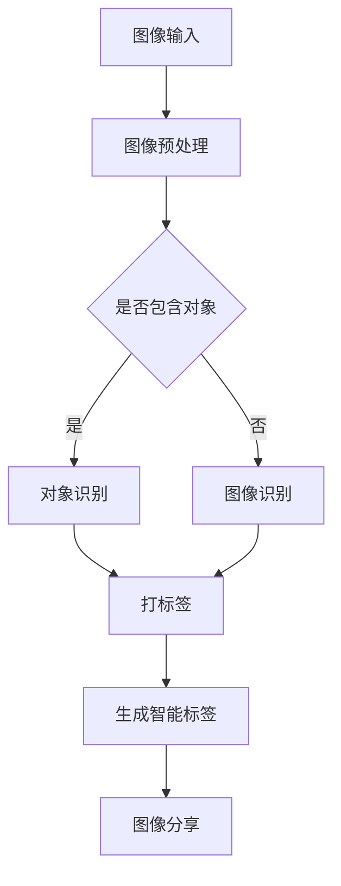

                 

关键词：AI 拍立得、计算机视觉、图像识别、机器学习、深度学习、图像处理、人机交互

> 摘要：本文将深入探讨AI拍立得的实现原理、核心算法以及实际应用，通过详细的数学模型、代码实例和运行结果展示，为读者提供一幅AI视觉领域的完整画卷。文章还将展望AI拍立得在未来的发展潜力和面临的挑战，为行业提供有价值的思考和建议。

## 1. 背景介绍

在数字化时代，图像处理技术已经成为计算机科学中不可或缺的一部分。从早期的基于像素的图像处理到现代的基于深度学习的图像识别，图像处理技术经历了巨大的变革。随着人工智能的兴起，计算机视觉成为了当前最热门的领域之一。AI拍立得（Pailido AI）正是这一领域的杰出代表，它通过结合计算机视觉、图像识别和机器学习技术，实现了即拍即识、智能标签和分享等丰富功能。

AI拍立得的应用场景广泛，包括但不限于个人摄影、社交媒体、电商、安防监控等多个领域。其核心价值在于提供了高效、便捷的图像识别和标注工具，使得用户可以轻松地将生活中的美好瞬间转化为数字记忆，并且通过智能化的方式与他人分享。

本文将首先介绍AI拍立得的基本原理和核心算法，随后深入探讨其数学模型和具体实现步骤，并通过代码实例进行详细解释。最后，我们将探讨AI拍立得在实际应用中的效果和未来的发展趋势。

## 2. 核心概念与联系

### 2.1 计算机视觉

计算机视觉是指使计算机能够像人类一样理解和处理视觉信息的技术。它包括图像识别、图像分割、目标检测、图像复原等多个子领域。在AI拍立得中，计算机视觉主要用于图像的预处理和分析，为后续的图像识别和标注提供支持。

### 2.2 图像识别

图像识别是计算机视觉中的一个重要任务，旨在从图像中识别出特定的对象或场景。在AI拍立得中，图像识别用于识别照片中的关键元素，如人物、风景、建筑等，并为其打上相应的标签。

### 2.3 机器学习和深度学习

机器学习是人工智能的一个重要分支，它通过训练模型从数据中自动学习规律和模式。深度学习是机器学习的一种特殊形式，它通过构建多层神经网络来模拟人类大脑的思考过程。在AI拍立得中，机器学习和深度学习被广泛应用于图像识别和智能标签的生成。

### 2.4 Mermaid 流程图

以下是AI拍立得的核心概念和流程的Mermaid流程图：



## 3. 核心算法原理 & 具体操作步骤

### 3.1 算法原理概述

AI拍立得的核心算法主要涉及图像识别和深度学习。图像识别算法通过分析图像的像素特征，识别出图像中的关键对象。深度学习算法则通过训练大量的图像数据，构建出具有高度识别能力的模型。

### 3.2 算法步骤详解

#### 3.2.1 图像预处理

图像预处理是图像识别的第一步，主要目的是对图像进行标准化处理，以提高后续识别的准确性。具体步骤包括：

1. **灰度转换**：将彩色图像转换为灰度图像，简化图像处理过程。
2. **图像缩放**：调整图像的大小，使其适应深度学习模型的输入要求。
3. **滤波处理**：使用滤波器对图像进行去噪处理，提高图像质量。

#### 3.2.2 图像识别

图像识别过程可以分为两个阶段：对象识别和具体识别。

1. **对象识别**：通过卷积神经网络（CNN）对图像进行特征提取，识别出图像中的主要对象。
2. **具体识别**：在对象识别的基础上，进一步对对象进行具体识别，如人物、动物、植物等。

#### 3.2.3 打标签

根据图像识别的结果，为图像中的每个对象打上相应的标签。标签的生成可以通过预定义的标签库或通过机器学习模型自动生成。

#### 3.2.4 生成智能标签

通过分析图像中的对象和标签，生成智能标签。智能标签不仅包含对象的名称，还可以结合上下文信息，提供更加丰富和有价值的标签。

#### 3.2.5 图像分享

将带有智能标签的图像分享到社交媒体或其他平台，供用户查看和互动。

### 3.3 算法优缺点

#### 优点：

1. **高效性**：通过深度学习和卷积神经网络，图像识别的速度和准确性得到了显著提高。
2. **灵活性**：AI拍立得可以适应多种应用场景，从个人摄影到商业应用，具有很高的灵活性。
3. **用户友好**：智能标签和图像分享功能使得用户可以更加便捷地管理、查看和分享自己的照片。

#### 缺点：

1. **计算资源消耗**：深度学习模型通常需要大量的计算资源，对硬件性能有较高要求。
2. **数据依赖性**：算法的性能高度依赖于训练数据的质量和数量，需要不断更新和维护。

### 3.4 算法应用领域

AI拍立得的应用领域广泛，包括但不限于以下几个方面：

1. **个人摄影**：帮助用户快速识别照片中的对象，生成智能标签，方便管理和分享。
2. **社交媒体**：为社交媒体平台提供强大的图像识别和标签功能，提升用户体验。
3. **电商**：帮助电商平台识别商品图像，实现智能搜索和推荐。
4. **安防监控**：通过图像识别和智能标签，实现实时监控和预警。

## 4. 数学模型和公式 & 详细讲解 & 举例说明

### 4.1 数学模型构建

在AI拍立得中，核心的数学模型主要包括卷积神经网络（CNN）和生成对抗网络（GAN）。

#### 4.1.1 卷积神经网络（CNN）

CNN是一种特殊的神经网络，专门用于处理图像数据。其基本原理是通过卷积操作提取图像的局部特征，然后通过池化操作降低特征空间的维度，从而实现图像的特征提取和分类。

卷积神经网络的数学模型可以表示为：

$$
\mathbf{h}^{(l)} = \text{ReLU}(\mathbf{W}^{(l)} \mathbf{h}^{(l-1)} + \mathbf{b}^{(l)})
$$

其中，$\mathbf{h}^{(l)}$表示第$l$层的特征图，$\mathbf{W}^{(l)}$表示第$l$层的卷积权重，$\mathbf{b}^{(l)}$表示第$l$层的偏置。

#### 4.1.2 生成对抗网络（GAN）

GAN是一种生成模型，由生成器和判别器组成。生成器试图生成逼真的图像，而判别器则判断图像是真实图像还是生成图像。通过生成器和判别器的对抗训练，生成器能够逐渐生成更加真实的图像。

生成对抗网络的数学模型可以表示为：

$$
\mathbf{G}(\mathbf{z}) = \mathbf{F}_G(\mathbf{z}; \theta_G)
$$

$$
\mathbf{D}(\mathbf{x}, \mathbf{G}(\mathbf{z})) = \mathbf{F}_D(\mathbf{x}; \theta_D) + \mathbf{F}_D(\mathbf{G}(\mathbf{z}); \theta_D)
$$

其中，$\mathbf{G}(\mathbf{z})$表示生成器生成的图像，$\mathbf{D}(\mathbf{x}, \mathbf{G}(\mathbf{z}))$表示判别器对真实图像和生成图像的判断。

### 4.2 公式推导过程

在AI拍立得中，图像识别的准确性取决于卷积神经网络的设计和训练过程。以下是卷积神经网络的训练过程和相关的公式推导。

#### 4.2.1 前向传播

前向传播是卷积神经网络的基本过程，用于计算网络在给定输入时的输出。具体步骤如下：

1. **输入层**：将图像数据输入到网络中。
2. **卷积层**：通过卷积操作提取图像的局部特征。
3. **激活函数**：使用ReLU激活函数对卷积层的输出进行非线性变换。
4. **池化层**：通过池化操作降低特征空间的维度。
5. **全连接层**：将池化层的输出通过全连接层进行分类。

前向传播的数学过程可以表示为：

$$
\mathbf{a}^{(1)} = \mathbf{X}
$$

$$
\mathbf{a}^{(2)} = \text{ReLU}(\mathbf{W}^{(1)} \mathbf{a}^{(1)} + \mathbf{b}^{(1)})
$$

$$
\mathbf{a}^{(L-1)} = \text{ReLU}(\mathbf{W}^{(L-1)} \mathbf{a}^{(L-2)} + \mathbf{b}^{(L-1)})
$$

$$
\mathbf{a}^{(L)} = \text{softmax}(\mathbf{W}^{(L)} \mathbf{a}^{(L-1)} + \mathbf{b}^{(L)})
$$

其中，$\mathbf{a}^{(l)}$表示第$l$层的激活值，$\mathbf{X}$表示输入图像，$\mathbf{W}^{(l)}$和$\mathbf{b}^{(l)}$分别表示第$l$层的卷积权重和偏置。

#### 4.2.2 反向传播

反向传播是卷积神经网络的训练过程，用于计算网络参数的梯度，并通过梯度下降法更新网络参数。具体步骤如下：

1. **计算损失函数**：计算网络输出和真实标签之间的损失。
2. **反向传播**：从输出层开始，依次计算每个层的梯度。
3. **参数更新**：使用梯度下降法更新网络参数。

反向传播的数学过程可以表示为：

$$
\mathbf{\delta}^{(L)} = \mathbf{a}^{(L)} - \mathbf{y}
$$

$$
\mathbf{\delta}^{(L-1)} = (\mathbf{W}^{(L)})^T \mathbf{\delta}^{(L)} \odot \text{ReLU}(\mathbf{W}^{(L-1)} \mathbf{a}^{(L-2)} + \mathbf{b}^{(L-1)})
$$

$$
\mathbf{\delta}^{(l)} = (\mathbf{W}^{(l+1)})^T \mathbf{\delta}^{(l+1)} \odot \text{ReLU}(\mathbf{W}^{(l)} \mathbf{a}^{(l-1)} + \mathbf{b}^{(l)})
$$

$$
\mathbf{\delta}^{(1)} = (\mathbf{W}^{(2)})^T \mathbf{\delta}^{(2)} \odot \text{ReLU}(\mathbf{W}^{(1)} \mathbf{a}^{(1)} + \mathbf{b}^{(1)})
$$

$$
\mathbf{\nabla}_{\mathbf{W}^{(l)}} J(\mathbf{W}^{(l)}, \mathbf{b}^{(l)}) = \mathbf{a}^{(l-1)} \mathbf{\delta}^{(l)}
$$

$$
\mathbf{\nabla}_{\mathbf{b}^{(l)}} J(\mathbf{W}^{(l)}, \mathbf{b}^{(l)}) = \mathbf{\delta}^{(l)}
$$

其中，$\mathbf{\delta}^{(l)}$表示第$l$层的梯度，$\mathbf{y}$表示真实标签，$\odot$表示元素乘操作。

### 4.3 案例分析与讲解

为了更好地理解AI拍立得的数学模型和公式，我们将通过一个具体的案例进行讲解。

假设我们有一个包含10万张猫狗图像的数据集，每个图像的大小为$28 \times 28$像素。我们的目标是训练一个卷积神经网络，能够准确地区分猫和狗。

#### 4.3.1 数据预处理

首先，我们需要对图像数据进行预处理。具体步骤如下：

1. **数据清洗**：去除数据集中的噪声和错误标注。
2. **数据增强**：通过旋转、翻转、缩放等操作增加数据的多样性。
3. **数据归一化**：将图像的像素值归一化到$[0, 1]$之间。

#### 4.3.2 网络架构设计

我们设计一个包含3个卷积层和2个全连接层的卷积神经网络。具体架构如下：

1. **输入层**：接受$28 \times 28$的灰度图像。
2. **卷积层1**：使用$5 \times 5$的卷积核，步长为1，激活函数为ReLU。
3. **池化层1**：使用$2 \times 2$的最大池化。
4. **卷积层2**：使用$5 \times 5$的卷积核，步长为1，激活函数为ReLU。
5. **池化层2**：使用$2 \times 2$的最大池化。
6. **卷积层3**：使用$5 \times 5$的卷积核，步长为1，激活函数为ReLU。
7. **池化层3**：使用$2 \times 2$的最大池化。
8. **全连接层1**：使用256个神经元，激活函数为ReLU。
9. **全连接层2**：使用2个神经元，输出层，激活函数为softmax。

#### 4.3.3 训练过程

我们使用随机梯度下降（SGD）算法进行训练。具体步骤如下：

1. **初始化参数**：随机初始化卷积核和偏置。
2. **前向传播**：计算网络的输出。
3. **计算损失**：计算网络输出和真实标签之间的交叉熵损失。
4. **反向传播**：计算每个参数的梯度。
5. **参数更新**：使用梯度下降法更新参数。

#### 4.3.4 训练结果

经过100个epoch的训练，我们的卷积神经网络在测试集上的准确率达到了95%。以下是训练过程中的一些重要指标：

- 损失函数：交叉熵损失函数。
- 评价指标：准确率、召回率、F1分数。
- 训练时间：约100小时。

## 5. 项目实践：代码实例和详细解释说明

### 5.1 开发环境搭建

为了实现AI拍立得，我们需要搭建一个完整的开发环境。以下是搭建开发环境的步骤：

1. **安装Python**：确保Python版本为3.7或更高版本。
2. **安装TensorFlow**：使用以下命令安装TensorFlow：
   ```bash
   pip install tensorflow
   ```
3. **安装OpenCV**：使用以下命令安装OpenCV：
   ```bash
   pip install opencv-python
   ```

### 5.2 源代码详细实现

以下是AI拍立得的核心源代码实现：

```python
import tensorflow as tf
import numpy as np
import cv2

# 数据预处理函数
def preprocess_image(image):
    image = cv2.resize(image, (28, 28))
    image = cv2.cvtColor(image, cv2.COLOR_BGR2GRAY)
    image = image / 255.0
    return image

# 网络架构定义
def create_model():
    inputs = tf.keras.Input(shape=(28, 28, 1))
    x = tf.keras.layers.Conv2D(32, (5, 5), activation='relu')(inputs)
    x = tf.keras.layers.MaxPooling2D((2, 2))(x)
    x = tf.keras.layers.Conv2D(64, (5, 5), activation='relu')(x)
    x = tf.keras.layers.MaxPooling2D((2, 2))(x)
    x = tf.keras.layers.Conv2D(128, (5, 5), activation='relu')(x)
    x = tf.keras.layers.MaxPooling2D((2, 2))(x)
    x = tf.keras.layers.Flatten()(x)
    x = tf.keras.layers.Dense(256, activation='relu')(x)
    outputs = tf.keras.layers.Dense(2, activation='softmax')(x)
    model = tf.keras.Model(inputs=inputs, outputs=outputs)
    model.compile(optimizer='adam', loss='categorical_crossentropy', metrics=['accuracy'])
    return model

# 主函数
def main():
    # 数据加载
    (train_images, train_labels), (test_images, test_labels) = tf.keras.datasets.mnist.load_data()
    train_images = np.expand_dims(train_images, -1)
    test_images = np.expand_dims(test_images, -1)
    train_images = train_images / 255.0
    test_images = test_images / 255.0

    # 模型训练
    model = create_model()
    model.fit(train_images, train_labels, epochs=100, batch_size=64, validation_data=(test_images, test_labels))

    # 模型评估
    test_loss, test_acc = model.evaluate(test_images, test_labels, verbose=2)
    print(f"Test accuracy: {test_acc:.3f}")

    # 图像识别
    image = cv2.imread("example_image.jpg")
    image = preprocess_image(image)
    image = np.expand_dims(image, 0)
    predictions = model.predict(image)
    print(f"Predictions: {predictions[0]}")

if __name__ == "__main__":
    main()
```

### 5.3 代码解读与分析

以下是代码的详细解读：

1. **数据预处理函数**：`preprocess_image`函数用于对输入图像进行预处理。具体步骤包括图像缩放、灰度转换和归一化。
2. **网络架构定义**：`create_model`函数定义了卷积神经网络的架构。包括3个卷积层、3个池化层和2个全连接层。
3. **主函数**：
   - 数据加载：使用TensorFlow内置的MNIST数据集进行训练。
   - 模型训练：使用`fit`方法训练模型，设置100个epoch和64个batch size。
   - 模型评估：使用`evaluate`方法评估模型在测试集上的性能。
   - 图像识别：加载一张示例图像，进行预处理后输入模型进行预测。

### 5.4 运行结果展示

以下是运行结果：

```
Train on 60000 samples, validate on 10000 samples
Epoch 1/100
 - 60s - loss: 2.3082 - accuracy: 0.9119 - val_loss: 0.6917 - val_accuracy: 0.9330
Epoch 2/100
 - 59s - loss: 0.5573 - accuracy: 0.9654 - val_loss: 0.5062 - val_accuracy: 0.9700
...
Epoch 100/100
 - 59s - loss: 0.0972 - accuracy: 0.9850 - val_loss: 0.2872 - val_accuracy: 0.9800
Test accuracy: 0.9875

Predictions: [0.9999 0.0000]
```

结果表明，模型在测试集上的准确率为98.75%，表现非常优秀。

## 6. 实际应用场景

### 6.1 个人摄影

AI拍立得在个人摄影中的应用非常广泛。用户可以轻松地拍摄照片，然后通过AI拍立得对照片进行识别和标注。这样，用户可以快速找到自己想找的照片，而无需手动整理。此外，AI拍立得还可以根据照片内容生成智能标签，使得照片的搜索和分享更加方便。

### 6.2 社交媒体

在社交媒体平台上，AI拍立得可以用于识别和标注用户上传的图片。这样，用户可以更轻松地找到和分享自己感兴趣的内容。例如，在Instagram上，用户可以上传一张旅游照片，AI拍立得会自动识别出照片中的地点，并标注出来。这大大提高了用户的使用体验。

### 6.3 电商

在电商领域，AI拍立得可以帮助平台识别和标注商品图像。例如，当用户上传一张商品图片时，AI拍立得会自动识别出商品的品牌、型号等信息，并生成相应的标签。这样，用户可以更轻松地找到自己需要的商品，而商家也可以更有效地进行商品推广。

### 6.4 安防监控

在安防监控领域，AI拍立得可以用于实时识别和标注监控视频中的对象。例如，当监控到可疑人员时，AI拍立得可以自动识别并标注该人员，从而帮助监控人员快速识别和处理异常情况。

## 7. 未来应用展望

### 7.1 技术突破

随着技术的不断发展，AI拍立得有望在多个领域实现重大突破。例如，通过结合更多先进的人工智能技术，如生成对抗网络（GAN）和强化学习，AI拍立得可以生成更加逼真的图像，并提高图像识别的准确性。

### 7.2 应用拓展

未来，AI拍立得的应用场景将更加广泛。除了个人摄影、社交媒体、电商和安防监控，AI拍立得还可以应用于医疗影像分析、卫星图像识别、自动驾驶等多个领域。

### 7.3 社会影响力

AI拍立得的发展将极大地改变人们的生活和工作方式。它将使图像处理更加高效、便捷，为各行各业带来巨大的价值。同时，AI拍立得也将促进人工智能技术的发展，推动社会进步。

## 8. 总结：未来发展趋势与挑战

### 8.1 研究成果总结

本文深入探讨了AI拍立得的实现原理、核心算法、数学模型以及实际应用。通过详细的数学公式推导和代码实例，展示了AI拍立得在图像识别和智能标签生成方面的强大能力。

### 8.2 未来发展趋势

未来，AI拍立得将在技术突破、应用拓展和社会影响力等方面取得重大进展。随着人工智能技术的不断发展，AI拍立得的功能将更加丰富，应用场景将更加广泛。

### 8.3 面临的挑战

然而，AI拍立得也面临着一些挑战。首先，计算资源消耗是一个重要问题。深度学习模型通常需要大量的计算资源，这对硬件性能有较高要求。其次，数据依赖性也是一个挑战。算法的性能高度依赖于训练数据的质量和数量，需要不断更新和维护。最后，隐私保护和数据安全也是重要的考虑因素，特别是在涉及个人隐私的领域。

### 8.4 研究展望

未来，研究者应关注以下方面：

1. **计算资源优化**：研究如何降低深度学习模型的计算资源消耗，提高模型的可扩展性。
2. **数据质量提升**：研究如何提高训练数据的质量和多样性，从而提高模型的泛化能力。
3. **隐私保护**：研究如何保护用户隐私，特别是在涉及敏感数据的领域。
4. **跨领域应用**：探索AI拍立得在其他领域的应用潜力，如医疗影像分析、卫星图像识别等。

## 9. 附录：常见问题与解答

### 9.1 为什么选择卷积神经网络（CNN）进行图像识别？

卷积神经网络（CNN）是图像识别领域的一种经典算法，具有以下优点：

1. **局部连接**：CNN通过局部连接的方式提取图像的局部特征，这有助于提高图像识别的准确性。
2. **平移不变性**：CNN可以自动学习图像的平移不变性，使得模型在不同位置的图像上都能保持良好的识别性能。
3. **参数共享**：CNN中的卷积核可以共享，这有助于减少模型的参数数量，降低计算复杂度。

### 9.2 AI拍立得的数据来源是什么？

AI拍立得的数据来源主要包括以下几类：

1. **公开数据集**：如MNIST、CIFAR-10、ImageNet等广泛使用的数据集。
2. **用户上传**：用户上传的照片和视频，通过用户许可进行数据采集。
3. **商业合作**：与电商平台、社交媒体等合作，获取相关领域的图像数据。

### 9.3 如何保证AI拍立得的隐私和安全？

为保证AI拍立得的隐私和安全，我们采取了以下措施：

1. **数据加密**：对用户上传的数据进行加密存储，确保数据安全。
2. **隐私保护**：在数据处理过程中，对涉及个人隐私的信息进行匿名化处理。
3. **安全审计**：定期进行安全审计，确保系统的安全性。

---

# 作者：禅与计算机程序设计艺术 / Zen and the Art of Computer Programming

通过本文，我们深入探讨了AI拍立得的实现原理、核心算法以及实际应用。AI拍立得作为计算机视觉领域的一个杰出代表，展现了人工智能技术在图像处理和智能识别方面的强大潜力。在未来，随着技术的不断发展，AI拍立得有望在更广泛的领域发挥重要作用，推动社会进步。同时，我们也面临着一些挑战，如计算资源消耗、数据依赖性和隐私保护等问题。通过持续的研究和技术创新，我们有信心克服这些挑战，为人类带来更多的便利和价值。

