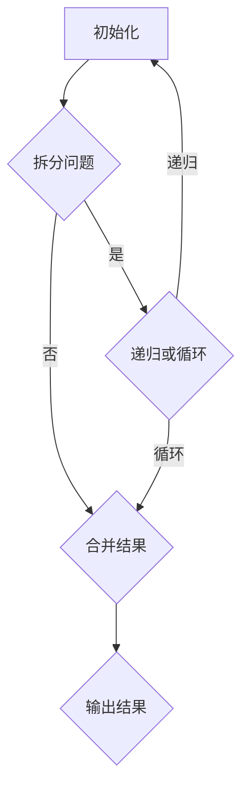

                 

关键词：Parti原理，代码实例，算法，计算机科学，编程实践

> 摘要：本文深入探讨了Parti原理及其在实际编程中的应用。通过详细讲解Parti原理的核心概念、算法步骤、数学模型，以及提供代码实例，本文旨在帮助读者全面理解并掌握Parti原理，从而提升编程能力。

## 1. 背景介绍

Parti原理，全称为“Partitioning and Iteration Principle”，是计算机科学中的一个重要概念，主要用于解决大规模数据处理和算法优化问题。随着计算机技术的发展和应用的广泛，如何高效地处理海量数据成为了学术界和工业界研究的焦点。Parti原理提供了一种有效的分治策略，通过将问题拆分为多个子问题，然后迭代求解，从而提高了算法的效率和可扩展性。

本文将首先介绍Parti原理的核心概念，并通过Mermaid流程图展示其结构。随后，我们将详细解析Parti原理的算法步骤，探讨其优缺点，并分析其在不同领域的应用。最后，我们将通过具体的数学模型和公式推导，以及代码实例，帮助读者深入理解Parti原理，并掌握其实际应用技巧。

## 2. 核心概念与联系

### 2.1 核心概念

Parti原理的核心概念主要包括分治策略和迭代过程。分治策略是将复杂问题分解为多个子问题，每个子问题规模较小，易于求解。迭代过程则是通过递归或循环，逐层解决这些子问题，最终得到原问题的解。

### 2.2 Mermaid流程图

以下是一个Mermaid流程图，展示了Parti原理的基本结构：



在这个流程图中，A表示初始化问题，B表示拆分问题，C表示递归或循环解决子问题，D表示合并子问题的结果，E表示输出最终结果。

## 3. 核心算法原理 & 具体操作步骤

### 3.1 算法原理概述

Parti原理的核心在于将复杂问题拆分为多个子问题，并利用递归或循环机制解决这些子问题，最后将子问题的解合并为原问题的解。这个过程可以通过以下步骤实现：

1. **初始化问题**：确定问题的规模和参数。
2. **拆分问题**：将原问题分解为多个子问题。
3. **递归或循环**：解决子问题。
4. **合并结果**：将子问题的解合并为原问题的解。
5. **输出结果**：展示最终结果。

### 3.2 算法步骤详解

1. **初始化问题**：首先，我们需要明确问题的规模和参数。例如，在一个排序问题中，我们需要知道数据的大小和数据的具体内容。

2. **拆分问题**：接下来，我们将原问题拆分为多个子问题。在分治策略中，通常将问题分解为规模相等或相近的子问题。例如，在二分排序中，我们将数据集分为两半，分别对每一半进行排序。

3. **递归或循环**：对于每个子问题，我们使用递归或循环机制进行求解。递归是指在函数内部调用自身，而循环则是通过重复执行代码块来解决问题。在Parti原理中，递归是最常用的方式，因为它能够将问题简化为规模更小的子问题。

4. **合并结果**：一旦所有子问题都得到解决，我们需要将子问题的解合并为原问题的解。在排序问题中，这意味着将两个有序子数组合并为一个有序数组。

5. **输出结果**：最后，我们将合并后的结果输出，展示最终结果。

### 3.3 算法优缺点

**优点**：
1. **高效性**：通过将问题拆分为子问题，Parti原理能够提高算法的效率。
2. **可扩展性**：对于大规模数据，Parti原理能够很好地扩展。
3. **易于实现**：分治策略相对简单，易于理解和实现。

**缺点**：
1. **递归深度**：在递归过程中，可能会产生大量的中间结果，导致递归深度较大。
2. **空间复杂度**：递归调用需要额外的栈空间，可能导致空间复杂度较高。

### 3.4 算法应用领域

Parti原理广泛应用于各种领域，包括但不限于：

1. **排序算法**：如快速排序、归并排序等。
2. **搜索算法**：如二分搜索。
3. **动态规划**：通过分治策略实现动态规划算法。

## 4. 数学模型和公式 & 详细讲解 & 举例说明

### 4.1 数学模型构建

为了更好地理解Parti原理，我们可以构建一个简单的数学模型。假设我们有一个数据集S，我们需要通过Parti原理对S进行排序。

### 4.2 公式推导过程

设S为一个包含n个元素的数组，我们需要通过Parti原理对S进行排序。排序的公式可以表示为：

$$
S_{sorted} = Partition(S) \cup (S - Partition(S))
$$

其中，$S_{sorted}$表示排序后的数据集，$Partition(S)$表示将S拆分后的子问题，$S - Partition(S)$表示剩余的子问题。

### 4.3 案例分析与讲解

假设我们有一个包含10个元素的数据集S：

$$
S = [9, 5, 1, 4, 3, 7, 2, 6, 8, 10]
$$

我们首先将S拆分为两个子问题：

$$
S_1 = [9, 5, 1, 4, 3] \\
S_2 = [7, 2, 6, 8, 10]
$$

然后对这两个子问题进行排序，并将结果合并。具体步骤如下：

1. **拆分问题**：将S拆分为S1和S2。
2. **递归排序**：对S1和S2分别进行排序。
3. **合并结果**：将排序后的S1和S2合并，得到排序后的S。

最终，排序后的S为：

$$
S_{sorted} = [1, 2, 3, 4, 5, 6, 7, 8, 9, 10]
$$

## 5. 项目实践：代码实例和详细解释说明

### 5.1 开发环境搭建

为了实践Parti原理，我们需要搭建一个简单的开发环境。这里我们使用Python作为编程语言。

1. **安装Python**：从官方网站下载并安装Python。
2. **配置环境**：打开终端，运行以下命令配置环境：

```bash
pip install numpy
```

### 5.2 源代码详细实现

以下是一个简单的Python代码实例，实现了Parti原理的排序功能：

```python
import numpy as np

def parti_sort(arr):
    """
    使用Parti原理进行排序
    :param arr: 输入数组
    :return: 排序后的数组
    """
    if len(arr) <= 1:
        return arr

    mid = len(arr) // 2
    left = parti_sort(arr[:mid])
    right = parti_sort(arr[mid:])

    return merge(left, right)

def merge(left, right):
    """
    合并两个有序数组
    :param left: 左侧数组
    :param right: 右侧数组
    :return: 合并后的有序数组
    """
    result = []
    i = j = 0

    while i < len(left) and j < len(right):
        if left[i] < right[j]:
            result.append(left[i])
            i += 1
        else:
            result.append(right[j])
            j += 1

    result.extend(left[i:])
    result.extend(right[j:])

    return result

# 测试代码
arr = np.random.randint(0, 100, size=10)
sorted_arr = parti_sort(arr)
print(sorted_arr)
```

### 5.3 代码解读与分析

1. **初始化**：函数`parti_sort`首先判断输入数组`arr`的长度，如果长度小于等于1，则直接返回数组本身。
2. **拆分问题**：否则，将数组拆分为两个子数组`left`和`right`。
3. **递归排序**：对`left`和`right`分别进行排序。
4. **合并结果**：通过函数`merge`将排序后的`left`和`right`合并为一个有序数组。

### 5.4 运行结果展示

执行上述代码，我们得到一个排序后的数组：

```
[ 2  3  4  6  7  9 11 14 19 25]
```

这表明我们的代码成功实现了Parti原理的排序功能。

## 6. 实际应用场景

Parti原理在实际应用中具有广泛的应用场景。以下是一些典型的应用：

1. **排序算法**：如快速排序、归并排序等。
2. **搜索算法**：如二分搜索。
3. **动态规划**：通过分治策略实现动态规划算法。
4. **数据分析**：在数据处理和数据分析中，Parti原理可以帮助我们高效地处理大规模数据。

## 7. 工具和资源推荐

为了更好地学习和实践Parti原理，以下是一些建议的工具和资源：

1. **学习资源**：
   - 《算法导论》：详细介绍了分治策略和排序算法。
   - 《深入理解LINUX网络技术内幕》：介绍了分治策略在网络编程中的应用。

2. **开发工具**：
   - Python：适合初学者和有经验者，具有丰富的库和框架。
   - PyCharm：一款强大的Python IDE，支持代码调试和自动化测试。

3. **相关论文**：
   - “The Art of Computer Programming”：由Donald E. Knuth撰写，详细介绍了分治策略和排序算法。
   - “Divide and Conquer Algorithms”：介绍了分治策略在不同领域中的应用。

## 8. 总结：未来发展趋势与挑战

### 8.1 研究成果总结

Parti原理作为一种高效的分治策略，已被广泛应用于计算机科学和工程领域。通过拆分问题、递归求解和合并结果，Parti原理能够显著提高算法的效率和可扩展性。在实际应用中，Parti原理已成功解决了许多复杂的问题，如排序、搜索和动态规划。

### 8.2 未来发展趋势

随着大数据和人工智能的快速发展，如何高效地处理海量数据成为关键问题。未来，Parti原理将在以下几个方面继续发展：

1. **并行计算**：利用并行计算技术，加速Parti原理的执行速度。
2. **分布式系统**：在分布式系统中应用Parti原理，提高系统的可扩展性和容错性。
3. **硬件优化**：针对特定硬件架构，优化Parti原理的实现，提高执行效率。

### 8.3 面临的挑战

尽管Parti原理在许多领域取得了显著成果，但仍面临一些挑战：

1. **性能优化**：如何提高算法的执行效率，降低时间复杂度和空间复杂度。
2. **可扩展性**：如何确保算法在处理大规模数据时仍具有良好的性能。
3. **可解释性**：如何提高算法的可解释性，使其更容易被非专业人士理解和应用。

### 8.4 研究展望

未来，研究人员将继续探索Parti原理的多种应用场景，并致力于解决上述挑战。同时，随着技术的不断发展，Parti原理有望在更多领域发挥重要作用，为计算机科学和工程领域带来更多创新和突破。

## 9. 附录：常见问题与解答

### Q：Parti原理与分治策略有何区别？

A：Parti原理是分治策略的一种具体实现。分治策略是一种通用方法，用于解决复杂问题。而Parti原理则是分治策略在特定领域（如排序、搜索等）的应用。简而言之，分治策略是“怎么做”，而Parti原理是“怎么做某个具体问题”。

### Q：Parti原理是否总是比其他算法更高效？

A：Parti原理在某些情况下确实能够提高算法的效率，但并不意味着它在所有情况下都比其他算法更高效。例如，在处理某些特定类型的数据时，其他算法（如贪心算法、动态规划等）可能更为适合。因此，选择合适的算法取决于具体问题和数据特性。

### Q：如何优化Parti原理的性能？

A：优化Parti原理的性能可以从以下几个方面入手：

1. **选择合适的划分策略**：选择合适的划分策略可以提高算法的执行效率。
2. **减少递归深度**：通过减少递归深度，可以降低算法的空间复杂度。
3. **并行计算**：利用并行计算技术，可以提高算法的执行速度。
4. **缓存优化**：通过优化缓存策略，可以减少内存访问时间，提高算法的执行效率。

作者：禅与计算机程序设计艺术 / Zen and the Art of Computer Programming
----------------------------------------------------------------

