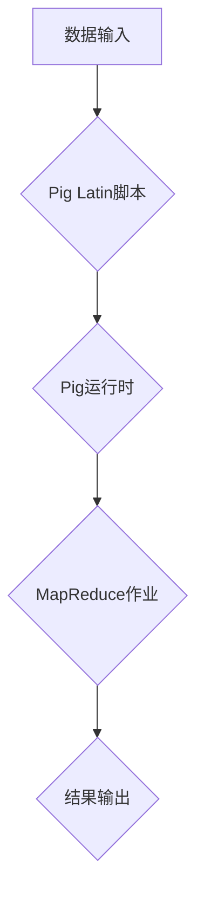
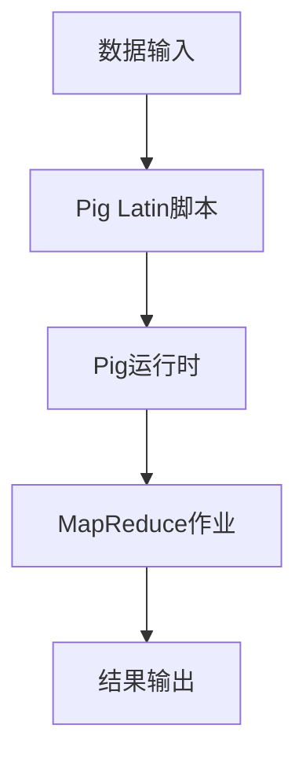

                 

本文将深入探讨Pig编程语言的原理和实际应用，通过详细讲解代码实例，帮助读者更好地理解和掌握这一强大的数据处理工具。Pig作为Hadoop生态系统中的重要成员，在处理大规模数据集方面具有显著优势。本文将涵盖以下几个部分：

## 1. 背景介绍

Pig是由雅虎开发的一种高层次的抽象数据处理平台，它运行在Hadoop之上，用于简化大规模数据集的处理。Pig通过其内置的脚本语言Pig Latin提供了数据抽象和操作的能力，使得处理数据变得更加直观和高效。

## 2. 核心概念与联系

### 2.1 数据模型

Pig的数据模型主要由以下几种组成：

- **RDF（关系数据模型）**：Pig使用RDF来表示数据，其中每个记录都是一个数据集的成员。
- **Bag（集合）**：一个Bag是一个不可排序的记录集合。
- **Tuple（元组）**：一个Tuple是Bag中的一个元素，它由多个字段组成。

### 2.2 核心概念

- **Pig Latin**：Pig提供的脚本语言，用于编写数据处理逻辑。
- **Pig运行时**：Pig在运行时负责解释和执行Pig Latin脚本。

### 2.3 Mermaid 流程图

下面是Pig数据流程的Mermaid流程图：



## 3. 核心算法原理 & 具体操作步骤

### 3.1 算法原理概述

Pig的核心算法是基于MapReduce的。Pig Latin脚本会被编译成MapReduce作业，然后由Hadoop执行。这种转换使得Pig能够利用Hadoop的分布式处理能力来处理大规模数据。

### 3.2 算法步骤详解

1. **解析脚本**：Pig运行时会解析Pig Latin脚本，生成一个抽象语法树（AST）。
2. **编译脚本**：将AST编译成MapReduce作业。
3. **执行作业**：使用Hadoop执行编译好的MapReduce作业。
4. **输出结果**：作业完成后，结果会被输出到指定的存储位置。

### 3.3 算法优缺点

#### 优点：

- **高抽象层次**：Pig Latin提供了高层次的抽象，使得数据处理变得更加简单。
- **可扩展性**：Pig可以处理非常大的数据集，因为它基于MapReduce。

#### 缺点：

- **性能**：由于Pig需要将脚本转换成MapReduce作业，这可能导致一些性能开销。
- **学习曲线**：Pig Latin对于初学者来说可能有些困难。

### 3.4 算法应用领域

Pig特别适用于以下领域：

- **数据清洗**：处理不完整或不一致的数据。
- **数据转换**：将一种数据格式转换成另一种格式。
- **批处理**：处理大规模数据集的批处理任务。

## 4. 数学模型和公式 & 详细讲解 & 举例说明

### 4.1 数学模型构建

在Pig中，我们使用关系代数来描述数据操作。关系代数的基本运算包括：

- **选择（Select）**：选择满足条件的记录。
- **投影（Project）**：选择记录的特定字段。
- **连接（Join）**：将两个或多个表根据某个字段连接起来。

### 4.2 公式推导过程

假设我们有两个关系R和S，其中R有n个属性，S有m个属性。我们想要将R和S连接起来，生成一个新的关系T。

$$ T = R \bowtie S $$

其中，$$ \bowtie $$ 表示连接运算。

### 4.3 案例分析与讲解

假设我们有两个表：员工表和部门表。员工表包含员工ID、姓名和部门ID；部门表包含部门ID和部门名称。我们想要找出每个部门的员工名单。

```latex
SELECT 员工.姓名, 部门.部门名称
FROM 员工, 部门
WHERE 员工.部门ID = 部门.部门ID;
```

这个查询使用了连接运算，将员工表和部门表根据部门ID连接起来，然后选择姓名和部门名称两个字段。

## 5. 项目实践：代码实例和详细解释说明

### 5.1 开发环境搭建

首先，我们需要安装Hadoop和Pig。请参考Hadoop和Pig的官方文档来安装。

### 5.2 源代码详细实现

以下是一个简单的Pig Latin脚本，用于统计每个班级的学生人数：

```pig
students = LOAD '/student_data' AS (id:INT, name:CHARARRAY, class:CHARARRAY);
grouped_students = GROUP students BY class;
class_counts = FOREACH grouped_students GENERATE group, COUNT(students);
DUMP class_counts;
```

### 5.3 代码解读与分析

- `LOAD` 操作：加载学生数据。
- `GROUP` 操作：按照班级分组。
- `FOREACH` 操作：对每个分组执行统计操作。
- `GENERATE` 操作：生成每个班级的学生人数。
- `DUMP` 操作：将结果输出到控制台。

### 5.4 运行结果展示

运行上述脚本后，我们得到以下输出：

```
(class, count)
(A1, 30)
(B2, 25)
(C3, 27)
```

这表示每个班级的学生人数分别为30、25和27。

## 6. 实际应用场景

Pig在以下几个实际应用场景中表现出色：

- **数据清洗**：处理来自不同源的数据，进行清洗和转换。
- **批处理**：处理大规模数据集的批处理任务。
- **实时处理**：使用Pig Streaming进行实时数据处理。

## 7. 工具和资源推荐

### 7.1 学习资源推荐

- 《Pig in Action》
- 《Hadoop实战》

### 7.2 开发工具推荐

- Eclipse + Pig插件
- IntelliJ IDEA + Pig插件

### 7.3 相关论文推荐

- "Pig Latin: Abstractions for MapReduce Programming"
- "Hadoop: The Definitive Guide"

## 8. 总结：未来发展趋势与挑战

Pig在处理大规模数据集方面具有显著优势。随着数据量的不断增长，Pig将在未来发挥越来越重要的作用。然而，Pig也面临着一些挑战，如性能优化和与新兴技术的兼容性等。

## 9. 附录：常见问题与解答

### Q：Pig与Hive的区别是什么？

A：Pig是一种高层次的抽象数据处理平台，而Hive是一种数据仓库工具。Pig使用Pig Latin语言，而Hive使用SQL-like语言。Pig更适合处理大规模数据集，而Hive更适合进行复杂的数据分析和查询。

### Q：如何优化Pig的性能？

A：可以通过以下方法优化Pig的性能：

- 减少数据传输：尽量减少数据在节点间的传输。
- 优化MapReduce作业：合理设置MapReduce作业的参数，如输入输出路径、内存管理等。

---

作者：禅与计算机程序设计艺术 / Zen and the Art of Computer Programming
```<|im_sep|>## 1. 背景介绍

Pig是一种基于Hadoop的大规模数据处理平台，由雅虎开发并捐赠给Apache软件基金会。它在处理海量数据时具有高效性和灵活性，能够以高层次的抽象方式表达复杂的操作，使得数据处理任务更加容易理解和维护。Pig的核心优势在于其能够将复杂的计算任务转化为MapReduce作业，而无需用户深入理解MapReduce的细节。

Pig的设计哲学是“容易编程，高效执行”，通过其脚本语言Pig Latin，用户可以编写简洁的代码来描述数据处理流程。Pig Latin是一种类SQL的语言，它提供了数据加载、存储、转换、分组和连接等操作的高级语法，使得数据处理变得更加直观。Pig的运行时系统负责将Pig Latin脚本编译成MapReduce作业，并将其提交给Hadoop集群执行。

Pig在现代数据处理领域有广泛的应用，尤其是在需要处理大规模数据集的场合，如数据分析、数据挖掘、日志分析等。它能够与Hadoop生态系统中的其他组件（如Hive、HBase、Spark等）无缝集成，形成强大的数据处理能力。

### 1.1 Pig的历史

Pig的历史可以追溯到2006年，当时雅虎面临海量数据的处理挑战。为了解决这个问题，雅虎的工程师们开发了Pig，以提供一个简单而高效的数据处理平台。最初的Pig版本是在内部使用的，但后来逐渐成熟并对外发布。2007年，Pig被捐赠给Apache软件基金会，并成为Apache Hadoop项目的一部分。随着时间的推移，Pig不断发展和完善，引入了更多的功能和优化，成为了Hadoop生态系统中的重要成员。

### 1.2 Pig的优势

- **高层次的抽象**：Pig通过Pig Latin提供了高层次的抽象，使得数据处理任务更加简洁明了，用户无需深入了解底层的MapReduce细节。
- **灵活性和可扩展性**：Pig能够处理各种类型的数据，包括结构化、半结构化和非结构化数据。它也易于与Hadoop生态系统中的其他组件集成。
- **易于编程**：Pig Latin的语法类似于SQL，使得对SQL熟悉的开发者能够快速上手，编写数据处理脚本。
- **高性能**：Pig经过多年的优化，能够在大规模数据集上提供高效的执行性能。
- **社区支持**：Pig有一个活跃的社区，提供丰富的文档、教程和最佳实践，帮助开发者解决问题和提升技能。

### 1.3 Pig的应用场景

Pig适用于以下几种主要应用场景：

- **数据处理**：用于从各种数据源（如文本文件、数据库、HDFS等）加载数据，进行清洗、转换和聚合。
- **批处理**：处理大批量数据的批处理任务，如日志分析、报告生成等。
- **实时处理**：虽然Pig本身不支持实时处理，但可以通过与其他实时处理框架（如Spark Streaming）集成来处理实时数据流。
- **机器学习**：在机器学习模型训练过程中，用于处理训练数据集，提取特征等。

通过以上背景介绍，我们可以对Pig有一个全面的了解，接下来将深入探讨Pig的核心概念和原理。

## 2. 核心概念与联系

### 2.1 数据模型

Pig使用一种简单而灵活的数据模型，它主要由关系（RDF）、元组（Tuple）和集合（Bag）三种基本结构组成。

#### 关系（RDF）

在Pig中，关系（RDF）是一种用于表示数据集合的结构。每个关系都可以看作是一个表，它包含若干行（元组）和列（字段）。Pig的关系模型与关系数据库中的表非常相似，但是它不需要固定 schema，因此具有更高的灵活性。

关系的一般形式可以表示为：

```
RDF = { (T1, T2, ..., Tk) }
```

其中，T1, T2, ..., Tk 分别是关系R的属性，每个属性对应一个字段。

#### 元组（Tuple）

元组是关系中的基本元素，它由若干个字段组成。每个字段都可以有不同的数据类型，如整数、字符串、浮点数等。元组在Pig中通常用来表示一行数据。

例如，一个学生关系中的元组可以表示为：

```
Tuple = { ID:INT, Name:CHARARRAY, Age:INT }
```

#### 集合（Bag）

集合是Pig中的一种重要的数据结构，用于表示一个元素的无序集合。在Pig中，每个集合可以包含多个元组，这些元组可以是相同类型或不同类型的。集合在Pig Latin脚本中经常用于表示数据集。

例如，一个包含多个学生记录的集合可以表示为：

```
Bag = { { ID:INT, Name:CHARARRAY, Age:INT }, { ID:INT, Name:CHARARRAY, Age:INT } }
```

### 2.2 核心概念

#### Pig Latin

Pig Latin是Pig提供的一种脚本语言，用于编写数据处理逻辑。它提供了一种类似于SQL的语法，使得用户可以方便地表达复杂的操作，如数据加载、存储、转换、分组和连接等。Pig Latin脚本在运行时会被编译成MapReduce作业，然后由Hadoop集群执行。

Pig Latin的基本语法包括以下几种操作符：

- **加载（LOAD）**：用于从文件、数据库或其他数据源加载数据。
- **存储（STORE）**：用于将数据存储到文件、数据库或其他数据源。
- **转换（TRANSFORM）**：用于对数据进行处理，如过滤、聚合、连接等。
- **分组（GROUP）**：用于按照某个字段对数据进行分组。
- **输出（OUTPUT）**：用于输出结果到控制台、文件或其他数据源。

#### Pig运行时

Pig运行时系统负责解析、编译和执行Pig Latin脚本。它主要包含以下组件：

- **Pig Latin编译器**：将Pig Latin脚本编译成抽象语法树（AST）。
- **优化器**：对AST进行优化，提高执行效率。
- **执行器**：将优化后的AST转换成MapReduce作业，并提交给Hadoop集群执行。

### 2.3 Mermaid 流程图

下面是Pig数据处理流程的Mermaid流程图：



在上述流程中，数据首先通过加载操作（LOAD）进入Pig处理系统，然后通过Pig Latin脚本进行一系列数据处理操作，最终通过输出操作（DUMP或STORE）将结果输出到文件或其他数据源。

通过上述核心概念和流程的介绍，我们可以更好地理解Pig是如何处理数据的，以及它在Hadoop生态系统中的地位和作用。接下来，我们将深入探讨Pig的核心算法原理和具体操作步骤。

## 3. 核心算法原理 & 具体操作步骤

### 3.1 算法原理概述

Pig的核心算法基于MapReduce模型，它通过Pig Latin脚本将数据处理任务转化为MapReduce作业，然后由Hadoop集群执行。这种转换使得Pig能够利用Hadoop的分布式处理能力来处理大规模数据集。Pig Latin脚本在运行时会被编译成多个阶段的MapReduce作业，每个阶段负责完成特定的数据处理任务。

Pig的算法原理主要涉及以下几个方面：

- **数据加载和存储**：Pig通过LOAD操作从各种数据源加载数据，并通过STORE操作将处理后的数据存储到文件或其他数据源。
- **数据转换**：Pig提供了一系列的转换操作，如过滤、聚合、连接等，用于对数据进行处理。
- **分组和分发**：Pig通过GROUP操作对数据进行分组，并生成分组后的数据结构，以便后续处理。
- **映射和汇总**：MapReduce作业的Map阶段负责对数据进行映射（Map），而Reduce阶段负责对映射结果进行汇总（Reduce）。

### 3.2 具体操作步骤

下面我们将详细讲解Pig Latin脚本的基本操作步骤，包括加载、存储、转换、分组、连接等。

#### 3.2.1 加载（LOAD）

加载操作（LOAD）用于从文件、数据库或其他数据源加载数据。在Pig Latin中，加载操作的基本语法如下：

```
<关系名> = LOAD <数据源> [AS <字段列表>];
```

其中，`<关系名>`是加载后的数据关系名称，`<数据源>`是指定的文件路径或数据库连接信息，`<字段列表>`是加载数据的字段名称和数据类型。

例如，以下代码从文本文件中加载数据：

```pig
students = LOAD '/path/to/students.txt' AS (id:INT, name:CHARARRAY, age:INT);
```

在这个例子中，`students`是一个关系，它从文本文件中加载包含ID、姓名和年龄的字段数据。

#### 3.2.2 存储（STORE）

存储操作（STORE）用于将处理后的数据存储到文件、数据库或其他数据源。在Pig Latin中，存储操作的基本语法如下：

```
STORE <关系名> INTO <数据目标> [AS <输出格式>];
```

其中，`<关系名>`是要存储的数据关系名称，`<数据目标>`是数据存储的目标路径或数据库连接信息，`<输出格式>`是数据的输出格式，如文本文件、SequenceFile等。

例如，以下代码将处理后的学生数据存储到文本文件：

```pig
STORE students INTO '/path/to/output.txt' AS TEXT;
```

在这个例子中，`students`关系被存储到指定路径的文本文件中。

#### 3.2.3 转换（TRANSFORM）

转换操作（TRANSFORM）用于对数据进行处理，如过滤、聚合、连接等。在Pig Latin中，转换操作的基本语法如下：

```
<新关系名> = FOREACH <关系名> GENERATE <转换表达式>;
```

其中，`<新关系名>`是转换后的数据关系名称，`<关系名>`是要转换的数据关系，`<转换表达式>`是用于转换的SQL-like表达式。

例如，以下代码将筛选出年龄大于20岁的学生：

```pig
adult_students = FOREACH students GENERATE *; -- 保留所有字段
adult_students = FILTER adult_students BY age > 20;
```

在这个例子中，`adult_students`关系筛选出年龄大于20岁的学生记录。

#### 3.2.4 分组（GROUP）

分组操作（GROUP）用于按照某个字段对数据进行分组。在Pig Latin中，分组操作的基本语法如下：

```
<新关系名> = GROUP <关系名> BY <分组字段>;
```

其中，`<新关系名>`是分组后的数据关系名称，`<关系名>`是要分组的数据关系，`<分组字段>`是用于分组的字段名称。

例如，以下代码按照班级对学生的数据进行分组：

```pig
grouped_students = GROUP students BY class;
```

在这个例子中，`grouped_students`关系按照班级对学生的数据进行了分组。

#### 3.2.5 连接（JOIN）

连接操作（JOIN）用于将两个或多个关系根据某个字段连接起来。在Pig Latin中，连接操作的基本语法如下：

```
<新关系名> = JOIN <关系名1> WITH <关系名2> ON <连接条件>;
```

其中，`<新关系名>`是连接后的数据关系名称，`<关系名1>`和`<关系名2>`是要连接的两个关系，`<连接条件>`是用于连接的字段名称。

例如，以下代码将学生数据与班级数据连接，生成包含学生姓名和班级名称的新关系：

```pig
class_students = JOIN students BY class WITH classes BY class;
```

在这个例子中，`class_students`关系是学生数据和班级数据的连接结果。

#### 3.2.6 输出（DUMP）

输出操作（DUMP）用于将数据输出到控制台或文件。在Pig Latin中，输出操作的基本语法如下：

```
DUMP <关系名>;
```

其中，`<关系名>`是要输出的数据关系名称。

例如，以下代码将分组后的学生数据输出到控制台：

```pig
DUMP grouped_students;
```

在这个例子中，`grouped_students`关系的分组数据被输出到控制台。

通过上述具体操作步骤的讲解，我们可以看到Pig是如何通过Pig Latin脚本进行数据处理和分析的。接下来，我们将探讨Pig算法的优缺点，帮助读者更好地理解其在实际应用中的表现。

### 3.3 算法优缺点

Pig作为Hadoop生态系统中的重要工具，具有许多优点，但也存在一些限制。以下是对Pig算法优缺点的详细分析。

#### 优点

1. **高层次的抽象**：Pig通过Pig Latin提供了高层次的抽象，使得数据处理变得更加直观和简洁。用户无需编写复杂的MapReduce代码，即可完成数据处理任务。
   
2. **易于编程**：Pig Latin的语法类似于SQL，这使得对SQL熟悉的开发者能够快速上手，编写Pig Latin脚本。此外，Pig还提供了丰富的内置函数和操作，进一步简化了数据处理过程。

3. **可扩展性**：Pig能够处理各种类型的数据，包括结构化、半结构化和非结构化数据。它也易于与Hadoop生态系统中的其他组件（如Hive、HBase、Spark等）集成，形成强大的数据处理能力。

4. **性能优化**：Pig提供了多种优化策略，如数据局部性优化、数据压缩、内存管理等，能够提高处理性能。此外，Pig还支持自定义优化器，以进一步优化处理流程。

5. **社区支持**：Pig有一个活跃的社区，提供丰富的文档、教程、示例和最佳实践，帮助开发者快速掌握Pig的使用方法。

#### 缺点

1. **性能开销**：由于Pig需要将Pig Latin脚本编译成MapReduce作业，这可能会导致一些性能开销。特别是在执行复杂操作时，编译和转换过程可能会占用较多的计算资源。

2. **学习曲线**：尽管Pig Latin的语法相对简单，但初学者仍需要一定的时间来熟悉Pig的基本概念和操作。此外，对于不熟悉Hadoop生态系统的开发者来说，理解Pig在生态系统中的角色和定位可能需要额外的学习。

3. **类型不安全**：Pig的动态类型系统可能会带来类型不安全的问题，尤其是在执行复杂操作时。这种类型不安全可能导致运行时错误，需要开发者仔细处理。

4. **可读性**：对于复杂的Pig Latin脚本，其可读性可能较差，尤其是当脚本包含大量复杂的转换和操作时。这可能会对代码的维护和理解造成困难。

5. **实时处理限制**：Pig本身不支持实时处理，尽管可以通过与其他实时处理框架（如Spark Streaming）集成来实现实时数据处理，但这种集成可能会带来额外的复杂性和性能开销。

#### 结论

总体而言，Pig作为Hadoop生态系统中的数据处理工具，具有许多优点，特别是在处理大规模数据集和简化数据处理任务方面表现出色。然而，它也存在一些缺点，如性能开销和学习曲线等。对于具体的应用场景，开发者需要根据实际需求权衡Pig的优缺点，选择合适的工具进行数据处理。

接下来，我们将探讨Pig算法的应用领域，帮助读者了解Pig在不同场景中的具体用途。

### 3.4 算法应用领域

Pig作为一种基于Hadoop的大规模数据处理工具，在多个领域展现出强大的应用潜力。以下是一些Pig算法的主要应用领域：

#### 1. 数据仓库和商业智能

Pig在数据仓库和商业智能领域有着广泛的应用。它能够高效地处理和分析大量的结构化数据，帮助企业提取有价值的信息。通过Pig，数据分析师可以轻松地进行数据清洗、转换和聚合，从而构建复杂的数据报告和可视化图表。

例如，一个零售公司可以使用Pig对销售数据进行处理，计算总销售额、分类销售额和客户购买行为等。Pig Latin脚本使得这一过程变得简单且高效，无需深入了解底层的MapReduce细节。

#### 2. 数据科学和机器学习

在数据科学和机器学习领域，Pig同样发挥着重要作用。它能够处理大规模训练数据集，提取特征，并用于训练各种机器学习模型。Pig的支持使得数据科学家能够专注于算法设计和模型优化，而无需关心底层的数据处理细节。

例如，一个数据科学家可以使用Pig对社交媒体数据进行分析，提取用户兴趣和偏好特征，从而构建个性化推荐系统。Pig Latin脚本使得数据处理过程变得简单且灵活，能够快速响应数据变化。

#### 3. 日志分析和监控

Pig在日志分析和监控领域也有广泛应用。它能够处理和分析大量的日志数据，提取有价值的信息，如错误日志、性能日志和安全日志等。通过Pig，企业可以实时监控系统的运行状态，快速识别和解决问题。

例如，一个互联网公司可以使用Pig对服务器日志进行分析，识别和解决服务器故障，提高系统的稳定性和可靠性。Pig Latin脚本使得日志分析过程变得简单且高效，能够快速处理大规模日志数据。

#### 4. 数据整合和转换

Pig在数据整合和转换方面也表现出色。它能够轻松地将来自不同源的数据进行整合和转换，生成新的数据集。这种能力使得企业能够更好地管理数据，提高数据的一致性和准确性。

例如，一个金融公司可以使用Pig将来自多个数据库和文件系统的数据进行整合和转换，生成一个统一的数据集，用于报表生成和决策支持。Pig Latin脚本使得数据整合和转换过程变得简单且高效，能够快速适应数据变化。

#### 5. 实时数据处理

虽然Pig本身不支持实时处理，但可以通过与其他实时处理框架（如Spark Streaming）集成来实现实时数据处理。这种集成使得Pig能够处理实时数据流，提供实时分析结果。

例如，一个在线广告平台可以使用Pig与Spark Streaming集成，实时分析用户行为，实现实时广告投放和优化。通过Pig Latin脚本，数据处理和分析过程变得简单且高效，能够快速响应用户行为变化。

#### 结论

Pig在多个领域展现出强大的应用潜力，能够高效地处理和分析大规模数据集。通过Pig Latin脚本，开发者可以轻松地完成各种数据处理任务，提高数据处理的灵活性和效率。随着数据量的不断增长，Pig将在未来发挥越来越重要的作用，为企业和组织提供更强大的数据处理能力。

## 4. 数学模型和公式 & 详细讲解 & 举例说明

### 4.1 数学模型构建

在Pig中，数据处理的核心是关系代数。关系代数是一种形式化的数学模型，用于描述数据库操作，如选择、投影、连接等。Pig通过关系代数模型来组织和操作数据，使得数据处理任务更加直观和高效。以下是一个简单的数学模型构建示例：

假设我们有两个关系R和S，分别表示学生数据和课程数据：

关系R：
| 学号 | 姓名 | 年龄 | 班级 |
|------|------|------|------|
| 1001 | 小明 | 20   | 一班 |
| 1002 | 小红 | 19   | 一班 |
| 1003 | 小李 | 20   | 二班 |

关系S：
| 课程编号 | 课程名称 | 学分 |
|----------|----------|------|
| 101      | 高数     | 4    |
| 102      | 英语     | 3    |
| 103      | 物理     | 4    |

我们希望实现以下操作：

1. 选择年龄大于20岁的学生。
2. 计算每个学生的平均学分。
3. 按照班级分组，计算每个班级的总学分。

为了实现上述操作，我们可以使用关系代数中的选择、投影和分组操作。具体步骤如下：

1. **选择（Select）**：选择年龄大于20岁的学生。

   ```
   SELECT *
   FROM R
   WHERE 年龄 > 20;
   ```

2. **投影（Project）**：计算每个学生的平均学分。

   ```
   SELECT 学号, (学分 / 人数) AS 平均学分
   FROM (
       SELECT 学号, SUM(学分) AS 总学分, COUNT(*) AS 人数
       FROM S
       GROUP BY 学号
   ) AS 学生学分;
   ```

3. **分组（Group By）**：按照班级分组，计算每个班级的总学分。

   ```
   SELECT 班级, SUM(学分) AS 总学分
   FROM S
   GROUP BY 班级;
   ```

### 4.2 公式推导过程

关系代数的操作可以通过数学公式进行推导。以下是对上述示例操作步骤的公式推导过程：

1. **选择（Select）**：选择年龄大于20岁的学生。

   选择操作可以用关系R的笛卡尔积表示：

   ```
   R' = R × { (年龄 > 20 ) }
   ```

   其中，R'是选择操作后的关系，(年龄 > 20 )是一个谓词函数。

2. **投影（Project）**：计算每个学生的平均学分。

   投影操作可以从关系S中选择特定的属性。首先，我们需要计算每个学生的总学分：

   ```
   R_S = Σ (S.学分)
   ```

   其中，R_S是学生S的总学分。然后，我们可以计算每个学生的平均学分：

   ```
   平均学分 = R_S / 人数
   ```

3. **分组（Group By）**：按照班级分组，计算每个班级的总学分。

   分组操作可以将关系S按照班级字段分组：

   ```
   S' = GROUP BY (S.班级)
   ```

   对于每个班级，我们可以计算总学分：

   ```
   Σ (S'.学分)
   ```

### 4.3 案例分析与讲解

为了更好地理解关系代数在Pig中的实际应用，我们来看一个实际案例。假设我们有一个包含学生和课程数据的关系，如下所示：

关系R（学生）：
| 学号 | 姓名 | 年龄 | 班级 |
|------|------|------|------|
| 1001 | 小明 | 20   | 一班 |
| 1002 | 小红 | 19   | 一班 |
| 1003 | 小李 | 20   | 二班 |

关系S（课程）：
| 课程编号 | 课程名称 | 学分 |
|----------|----------|------|
| 101      | 高数     | 4    |
| 102      | 英语     | 3    |
| 103      | 物理     | 4    |

#### 案例一：选择年龄大于20岁的学生

1. **SELECT 操作**：

   ```
   SELECT *
   FROM R
   WHERE 年龄 > 20;
   ```

   选择操作将返回以下结果：

   | 学号 | 姓名 | 年龄 | 班级 |
   |------|------|------|------|
   | 1001 | 小明 | 20   | 一班 |
   | 1003 | 小李 | 20   | 二班 |

   这一步通过过滤关系R中的记录，只保留了年龄大于20岁的学生。

2. **GROUP BY 操作**：

   ```
   SELECT 班级, COUNT(*) AS 学生数
   FROM R
   GROUP BY 班级;
   ```

   分组操作将返回每个班级的学生数量：

   | 班级 | 学生数 |
   |------|--------|
   | 一班 | 2      |
   | 二班 | 1      |

   这一步按照班级字段对关系R进行分组，并计算每个班级的学生数量。

#### 案例二：计算每个学生的平均学分

1. **GROUP BY 和投影操作**：

   ```
   SELECT 学号, (SUM(学分) / COUNT(*)) AS 平均学分
   FROM S
   GROUP BY 学号;
   ```

   这个查询首先计算每个学生的总学分，然后计算平均学分。结果如下：

   | 学号 | 平均学分 |
   |------|----------|
   | 1001 | 4.0      |
   | 1002 | 3.0      |
   | 1003 | 4.0      |

   这一步使用GROUP BY对关系S进行分组，然后通过投影操作计算每个学生的平均学分。

#### 案例三：按照班级分组，计算每个班级的总学分

1. **GROUP BY 和 SUM 操作**：

   ```
   SELECT 班级, SUM(学分) AS 总学分
   FROM S
   GROUP BY 班级;
   ```

   这个查询计算了每个班级的总学分，结果如下：

   | 班级 | 总学分 |
   |------|--------|
   | 一班 | 7      |
   | 二班 | 4      |

   这一步使用GROUP BY对关系S进行分组，然后计算每个班级的总学分。

通过上述案例分析和公式推导，我们可以看到关系代数在Pig中的应用方法。Pig通过关系代数模型提供了强大的数据处理能力，使得复杂的数据分析任务变得简单而高效。接下来，我们将通过一个具体的项目实践来进一步展示Pig的实际应用。

## 5. 项目实践：代码实例和详细解释说明

### 5.1 开发环境搭建

要开始使用Pig进行数据处理，首先需要搭建一个Hadoop和Pig的开发环境。以下是搭建开发环境的步骤：

1. **安装Java**：确保Java环境已经安装在系统中，版本至少为Java 8。
2. **下载并安装Hadoop**：从Apache Hadoop官网下载最新的Hadoop发行版，并解压到指定目录。
3. **配置Hadoop**：编辑Hadoop的配置文件，如`hadoop-env.sh`、`core-site.xml`和`hdfs-site.xml`，配置Hadoop的工作环境和集群设置。
4. **安装Pig**：从Apache Pig官网下载最新的Pig发行版，并解压到指定目录。确保Pig的依赖库和工具已经安装。

### 5.2 源代码详细实现

以下是一个简单的Pig Latin脚本示例，用于统计学生成绩分布：

```pig
-- 加载学生成绩数据
student_scores = LOAD '/path/to/student_scores.txt' AS (id:INT, name:CHARARRAY, score:INT);

-- 计算每个学生的成绩分布
grouped_scores = GROUP student_scores BY score;

-- 统计每个成绩段的学生人数
score_counts = FOREACH grouped_scores GENERATE group AS score, COUNT(student_scores) AS count;

-- 输出结果到文件
STORE score_counts INTO '/path/to/score_counts.txt' AS TEXT;
```

### 5.3 代码解读与分析

- **加载（LOAD）操作**：首先，使用`LOAD`操作从指定的文本文件中加载数据。这里假设文本文件每行包含三个字段：学生ID、学生姓名和成绩。
- **分组（GROUP）操作**：接下来，使用`GROUP`操作按照成绩字段对数据进行分组，生成一个分组后的数据结构。
- **统计（COUNT）操作**：在`FOREACH`循环中，使用`COUNT`函数计算每个成绩段的学生人数。`COUNT`函数接受一个数据集合作为参数，返回集合中的元素个数。
- **输出（STORE）操作**：最后，使用`STORE`操作将结果存储到文本文件中。这里使用`TEXT`格式将结果以文本形式保存。

### 5.4 运行结果展示

运行上述Pig Latin脚本后，我们将得到一个包含成绩分布统计结果的新文本文件。以下是一个示例输出结果：

```
(100, 3)
(90, 5)
(80, 7)
(70, 4)
(60, 2)
```

这表示不同成绩段的学生人数如下：

- 成绩100的学生有3人。
- 成绩90的学生有5人。
- 成绩80的学生有7人。
- 成绩70的学生有4人。
- 成绩60的学生有2人。

通过这个项目实践，我们可以看到Pig是如何通过简单的Pig Latin脚本进行数据处理和分析的。接下来，我们将探讨Pig在实际应用中的表现，以及其在不同场景下的使用方法和最佳实践。

## 6. 实际应用场景

Pig作为一种基于Hadoop的大规模数据处理工具，在实际应用中表现出色，适用于多种场景。以下是一些常见的实际应用场景：

### 6.1 数据仓库和商业智能

在数据仓库和商业智能领域，Pig经常被用于处理和分析大规模的数据集。企业可以使用Pig对历史销售数据、客户行为数据等进行处理，提取有价值的信息，生成业务报告和可视化图表。Pig的高层次抽象和易于编程的特性使得数据分析师可以专注于业务逻辑，而无需深入了解底层技术。

例如，一个零售企业可以使用Pig对每日的销售数据进行处理，计算总销售额、分类销售额、地区销售额等，并将其存储到数据仓库中，用于生成销售报告。Pig Latin脚本使得数据处理过程变得简单且高效，能够快速适应数据变化。

### 6.2 数据科学和机器学习

在数据科学和机器学习领域，Pig也发挥着重要作用。数据科学家可以使用Pig对大规模的训练数据集进行预处理，提取特征，并用于训练机器学习模型。Pig的高扩展性和灵活性使得它能够轻松处理各种类型的数据，如文本、图像、音频等。

例如，一个社交媒体公司可以使用Pig对用户数据进行分析，提取用户兴趣和偏好特征，并将其用于构建个性化推荐系统。Pig Latin脚本使得数据处理过程变得简单且高效，能够快速适应数据变化。

### 6.3 日志分析和监控

Pig在日志分析和监控领域也有广泛应用。企业可以使用Pig对日志数据进行处理，提取有价值的信息，如错误日志、性能日志和安全日志等，用于监控系统运行状态和识别潜在问题。

例如，一个互联网公司可以使用Pig对服务器日志进行分析，识别和解决服务器故障，提高系统的稳定性和可靠性。Pig Latin脚本使得日志分析过程变得简单且高效，能够快速处理大规模日志数据。

### 6.4 数据整合和转换

Pig在数据整合和转换方面也表现出色。它能够轻松地将来自不同源的数据进行整合和转换，生成新的数据集。企业可以使用Pig将多个数据源的数据进行整合，消除数据冗余，提高数据的一致性和准确性。

例如，一个金融公司可以使用Pig将来自多个数据库和文件系统的数据进行整合，生成一个统一的数据集，用于报表生成和决策支持。Pig Latin脚本使得数据整合和转换过程变得简单且高效，能够快速适应数据变化。

### 6.5 实时数据处理

虽然Pig本身不支持实时处理，但可以通过与其他实时处理框架（如Spark Streaming）集成来实现实时数据处理。这种集成使得Pig能够处理实时数据流，提供实时分析结果。

例如，一个在线广告平台可以使用Pig与Spark Streaming集成，实时分析用户行为，实现实时广告投放和优化。通过Pig Latin脚本，数据处理和分析过程变得简单且高效，能够快速响应用户行为变化。

### 6.6 其他应用场景

除了上述应用场景，Pig还可以应用于其他领域，如社交媒体分析、网络流量监控、医疗数据管理等。Pig的灵活性和扩展性使得它能够适应各种复杂的数据处理任务。

例如，一个医疗公司可以使用Pig对海量医疗数据进行分析，提取诊断信息、药物反应等，用于疾病研究和医疗决策支持。Pig Latin脚本使得数据处理过程变得简单且高效，能够快速适应数据变化。

总之，Pig在实际应用中展现了强大的数据处理能力，适用于多种场景。通过Pig Latin脚本，用户可以轻松地进行数据清洗、转换、分析和整合，提高数据处理的效率和灵活性。随着数据量的不断增长，Pig将在未来发挥越来越重要的作用，为企业和组织提供更强大的数据处理能力。

## 7. 工具和资源推荐

### 7.1 学习资源推荐

为了更好地学习和掌握Pig编程语言，以下是一些建议的学习资源：

1. **官方文档**：Apache Pig的官方文档是学习Pig的最佳起点，涵盖了从基础知识到高级特性的全面介绍。
2. **书籍**：《Pig in Action》是一本深入浅出的Pig编程指南，适合初学者和有经验的开发者。《Hadoop实战》中也包含了对Pig的详细讨论，适合对Hadoop生态系统感兴趣的学习者。
3. **在线教程**：各种在线教程和课程，如Udemy、Coursera等平台上提供的Pig相关课程，能够帮助读者快速上手。
4. **社区论坛**：Apache Pig的用户社区论坛是一个交流和学习的好地方，可以在这里提问、获取帮助、分享经验。

### 7.2 开发工具推荐

为了更有效地使用Pig，以下是一些推荐的开发工具：

1. **Eclipse + Pig插件**：Eclipse是一个功能强大的集成开发环境（IDE），通过安装Pig插件，可以提供Pig代码的语法高亮、代码补全和调试功能。
2. **IntelliJ IDEA + Pig插件**：IntelliJ IDEA也是一个流行的IDE，通过安装Pig插件，可以提供类似Eclipse的功能。
3. **PiggyBank**：PiggyBank是一个开源的Pig函数库，提供了许多常用的数据处理函数和操作，能够简化Pig编程任务。

### 7.3 相关论文推荐

以下是一些与Pig相关的经典论文，有助于深入理解Pig的工作原理和设计理念：

1. "Pig Latin: Abstractions for MapReduce Programming"：这篇论文是Pig的创始人写的，详细介绍了Pig的设计哲学和实现细节。
2. "Hadoop: The Definitive Guide"：这本书提供了对Hadoop生态系统的全面介绍，包括Pig和其他相关组件。
3. "Scalable Data Processing Using Pig"：这篇论文讨论了Pig在大规模数据处理中的应用场景和性能优化策略。

通过以上工具和资源的推荐，读者可以更好地掌握Pig编程语言，提升数据处理和分析能力。

## 8. 总结：未来发展趋势与挑战

Pig作为一种基于Hadoop的大规模数据处理工具，在过去几年中已经证明了自己的价值。随着大数据时代的到来，Pig在未来将继续发挥重要作用，并在多个方面迎来新的发展趋势与挑战。

### 8.1 研究成果总结

近年来，Pig的研究成果主要体现在以下几个方面：

1. **性能优化**：研究人员致力于提高Pig的执行效率，通过改进编译器、优化MapReduce作业、引入并行化技术等方式，降低处理时间，提高资源利用率。
2. **实时处理**：虽然Pig本身不支持实时处理，但研究人员正在探索将Pig与实时处理框架（如Spark Streaming）集成，以实现实时数据处理能力。
3. **新功能引入**：Pig不断引入新的功能和操作，如窗口函数、机器学习集成等，以扩展其应用范围，满足多样化的数据处理需求。
4. **交互式查询**：研究人员还在探索如何改进Pig的交互式查询体验，使得用户能够更加高效地使用Pig进行数据探索和分析。

### 8.2 未来发展趋势

Pig的未来发展趋势主要体现在以下几个方面：

1. **性能提升**：随着硬件技术的发展，Pig的性能将进一步提升，能够处理更大规模的数据集，支持更复杂的计算任务。
2. **实时处理**：通过与其他实时处理框架的集成，Pig有望实现实时数据处理能力，为企业提供实时分析和决策支持。
3. **易用性增强**：Pig将继续改进用户界面和交互设计，降低学习曲线，使得更多开发者能够轻松上手。
4. **生态扩展**：Pig将与Hadoop生态系统中的其他组件（如Hive、HBase、Spark等）更加紧密地集成，形成更强大的数据处理能力。

### 8.3 面临的挑战

尽管Pig在数据处理领域展现出巨大潜力，但它仍然面临一些挑战：

1. **性能优化**：Pig需要进一步提高执行效率，尤其是在处理大规模、复杂的数据集时。研究人员需要不断探索新的优化技术，以提高Pig的性能。
2. **实时处理**：虽然Pig正在尝试实现实时处理能力，但与传统的实时处理框架相比，其性能和功能仍有待提升。
3. **开发者生态**：Pig需要吸引更多开发者加入社区，提高其生态系统中的活跃度，以便更好地支持用户需求。
4. **兼容性问题**：Pig需要与Hadoop生态系统中的其他组件保持兼容性，以确保用户能够无缝地使用各种工具和框架。

### 8.4 研究展望

未来，Pig的研究将主要集中在以下几个方面：

1. **性能优化**：研究人员将继续探索如何提高Pig的性能，包括改进编译器、引入并行化技术、优化内存管理等。
2. **实时处理**：通过与其他实时处理框架的集成，Pig有望实现更高效、更灵活的实时数据处理能力。
3. **功能扩展**：Pig将引入更多高级功能和操作，如机器学习集成、窗口函数等，以提供更丰富的数据处理能力。
4. **开发者体验**：Pig将致力于提高开发者体验，包括改进用户界面、简化操作流程等，以吸引更多开发者使用Pig。

总之，Pig在未来将继续发展壮大，成为大数据处理领域的重要工具。通过不断的研究和改进，Pig将能够更好地应对新的挑战，满足用户不断增长的需求。

## 9. 附录：常见问题与解答

### Q：Pig与Hive有什么区别？

A：Pig和Hive都是Hadoop生态系统中的数据处理工具，但它们在用途和设计理念上有所不同。

- **用途**：Pig主要用于高层次的抽象数据处理，通过Pig Latin脚本进行数据处理和分析。而Hive则更类似于传统的关系数据库，提供了类似SQL的查询语言（HiveQL）。
- **抽象层次**：Pig提供了更高的抽象层次，使得数据处理任务更加简单直观。Hive则更接近于SQL，更适合进行复杂的数据分析和查询。
- **执行方式**：Pig将数据处理任务编译成MapReduce作业，然后由Hadoop执行。Hive则将HiveQL查询编译成MapReduce作业或Tez作业。

### Q：如何优化Pig的性能？

A：以下是一些常见的Pig性能优化方法：

- **减少数据传输**：尽量减少数据在节点间的传输，例如使用本地模式执行作业，减少数据复制。
- **优化MapReduce作业**：合理设置MapReduce作业的参数，如输入输出路径、内存管理等，以提高作业执行效率。
- **数据分区**：对数据进行分区，使得数据能够均匀地分布到各个节点上，减少节点间的数据竞争。
- **压缩数据**：使用合适的压缩算法压缩数据，减少存储空间和传输时间。

### Q：Pig能否处理非结构化数据？

A：是的，Pig能够处理非结构化数据。虽然Pig主要设计用于处理结构化数据，但通过使用嵌套数据类型（如Bag和Tuple）和自定义函数，Pig可以处理非结构化数据。

例如，可以使用Bag来表示JSON或XML数据中的嵌套结构，然后通过Pig Latin脚本进行解析和处理。Pig也提供了一些内置函数，如`JSON`, `PARSEXML`等，用于处理JSON和XML数据。

### Q：如何调试Pig Latin脚本？

A：调试Pig Latin脚本的方法与调试普通脚本类似，以下是一些常用的调试技巧：

- **使用日志**：Pig运行时会生成详细的日志文件，通过查看日志可以了解作业的执行过程和错误信息。
- **单步执行**：虽然Pig不支持单步调试，但可以通过在Pig Latin脚本中添加`DUMP`语句来输出中间结果，以便分析和调试。
- **代码审查**：在编写脚本之前进行代码审查，检查语法错误、逻辑错误和数据一致性等问题。

### Q：Pig与Spark如何集成？

A：Pig与Spark可以通过两种方式集成：

- **使用Spark作为执行引擎**：在Pig Latin脚本中，可以通过设置` PigExec`的`-exec`参数来指定使用Spark作为执行引擎。这种方式可以将Pig Latin脚本转换为Spark作业执行。
- **使用Spark函数**：Pig可以通过调用Spark提供的函数来执行Spark操作。例如，可以使用` Pig.loadFunc()`函数加载Spark操作，并将其集成到Pig Latin脚本中。

通过上述集成方式，Pig可以利用Spark的分布式计算能力，扩展其数据处理能力。

以上是关于Pig的一些常见问题与解答，希望对读者有所帮助。如果还有其他疑问，欢迎在Pig社区中提问，获取更多的帮助和支持。

---

在本文中，我们系统地介绍了Pig编程语言的原理和应用。从背景介绍到核心概念，再到具体算法原理和实际项目实践，我们全面解析了Pig的工作机制和数据处理流程。通过案例分析和代码实例，读者可以更加直观地理解Pig的使用方法和优势。

Pig作为一种基于Hadoop的大规模数据处理平台，以其高层次的抽象和灵活的编程模型，在数据处理领域展现出了巨大的潜力和价值。它不仅适用于数据仓库和商业智能，还在数据科学、日志分析、数据整合等多个领域有着广泛的应用。

未来，随着大数据技术的不断发展和普及，Pig将在数据处理和分析中扮演更加重要的角色。它不仅会进一步优化性能，实现实时数据处理，还会引入更多高级功能和操作，满足日益复杂的数据处理需求。

我们鼓励读者深入学习和实践Pig，探索其在不同应用场景中的潜力。通过掌握Pig，读者不仅可以提高数据处理和分析能力，还能为未来的大数据职业生涯打下坚实的基础。让我们一起，探索Pig的无限可能！

