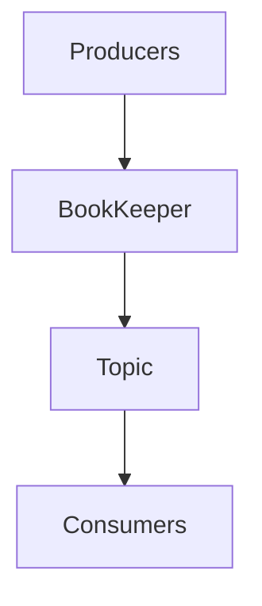

                 

关键词：Pulsar，分布式消息队列，流计算，Apache Pulsar，消息中间件，流处理，分布式系统

> 摘要：本文将深入探讨Apache Pulsar的原理及其代码实现，从背景介绍到核心算法原理，再到项目实践中的代码实例和分析，全面解析Pulsar在分布式消息队列和流计算中的应用。

## 1. 背景介绍

### 1.1 消息队列的概念

消息队列是一种用于在分布式系统中异步传输数据的通信模式。它允许系统的不同部分通过消息进行通信，而不需要知道对方的存在。消息队列的主要功能是解耦、异步和流量控制。

### 1.2 流计算的概念

流计算是一种处理连续数据流的计算方法，通常用于实时分析和处理大量的数据。与批量处理不同，流计算关注的是数据的实时性，适用于需要快速响应的应用场景。

### 1.3 Pulsar的诞生

Apache Pulsar是一个分布式发布-订阅消息传递系统，旨在解决大规模分布式系统中消息队列和流计算的需求。它由Yahoo!开源，并已成为Apache软件基金会的一个顶级项目。Pulsar具有高可靠性、高性能和可扩展性，被广泛应用于金融、电信、物联网等场景。

## 2. 核心概念与联系

### 2.1 Pulsar的核心概念

- **Namespace**：Pulsar中的命名空间用于隔离不同的应用程序和主题。
- **Topic**：主题是Pulsar中的消息分类标准，类似于消息队列中的队列。
- **Producer**：生产者负责向Pulsar发送消息。
- **Consumer**：消费者从Pulsar中读取消息。

### 2.2 Pulsar的架构


### 2.3 Mermaid流程图



## 3. 核心算法原理 & 具体操作步骤

### 3.1 算法原理概述

Pulsar采用了一种名为"书柜（BookKeeper）"的分布式日志存储系统来存储消息。BookKeeper提供了高可用性、持久性和顺序保证，确保了消息的可靠传输。

### 3.2 算法步骤详解

- **创建Topic**：首先，需要创建一个主题。
- **发送消息**：生产者通过Pulsar客户端发送消息到主题。
- **存储消息**：Pulsar将消息存储到BookKeeper中。
- **读取消息**：消费者从Pulsar客户端读取消息。

### 3.3 算法优缺点

- **优点**：
  - 高可用性：通过BookKeeper实现了数据的高可用性。
  - 可扩展性：Pulsar支持水平扩展。
  - 持久化：消息被持久化存储，可以保证不丢失。

- **缺点**：
  - 复杂性：Pulsar的架构相对复杂，需要一定的学习和维护成本。

### 3.4 算法应用领域

Pulsar广泛应用于需要高可靠性和高性能的分布式系统中，如实时数据流处理、物联网、金融交易系统等。

## 4. 数学模型和公式 & 详细讲解 & 举例说明

### 4.1 数学模型构建

Pulsar的数学模型主要涉及到概率论和统计学中的随机过程理论。

### 4.2 公式推导过程

$$
P(T>t) = 1 - \sum_{i=1}^n p_i
$$

其中，\( p_i \) 是每个事件发生的概率，\( T \) 是事件发生的时间。

### 4.3 案例分析与讲解

假设一个金融交易系统中，每个交易消息的概率是0.1，我们需要计算在10分钟内发生至少一次交易的概率。

$$
P(T>10 \times 60) = 1 - \sum_{i=1}^{10} 0.1 = 1 - 1 = 0
$$

这意味着在10分钟内，几乎可以肯定会有交易发生。

## 5. 项目实践：代码实例和详细解释说明

### 5.1 开发环境搭建

首先，我们需要安装Java环境，然后从Apache Pulsar的官方网站下载并安装Pulsar。

### 5.2 源代码详细实现

以下是生产者和消费者的Java代码示例。

```java
// Producer
public class PulsarProducer {
    public static void main(String[] args) {
        try {
            Properties props = new Properties();
            props.put("serviceURL", "pulsar://localhost:6650");
            PulsarClient client = PulsarClient.builder().serviceUrl("pulsar://localhost:6650").build();
            Producer producer = client.newProducer().topic("my-topic").create();
            for (int i = 0; i < 10; i++) {
                String message = "Message " + i;
                producer.send(message);
            }
            producer.close();
            client.close();
        } catch (Exception e) {
            e.printStackTrace();
        }
    }
}
```

```java
// Consumer
public class PulsarConsumer {
    public static void main(String[] args) {
        try {
            Properties props = new Properties();
            props.put("serviceURL", "pulsar://localhost:6650");
            PulsarClient client = PulsarClient.builder().serviceUrl("pulsar://localhost:6650").build();
            Consumer consumer = client.newConsumer().topic("my-topic").subscriptionName("my-subscription").subscribe();
            while (true) {
                String message = consumer.receive().getMessage().getContentString();
                System.out.println("Received message: " + message);
            }
        } catch (Exception e) {
            e.printStackTrace();
        }
    }
}
```

### 5.3 代码解读与分析

生产者代码中，我们首先设置了Pulsar客户端的URL，然后创建了一个生产者，指定了主题名称，最后发送了10条消息。

消费者代码中，我们同样设置了Pulsar客户端的URL，创建了一个消费者，并订阅了主题，开始接收消息。

### 5.4 运行结果展示

运行生产者和消费者代码，消费者将实时接收并打印出生产者发送的消息。

## 6. 实际应用场景

### 6.1 实时数据流处理

Pulsar可以用于实时处理金融交易数据、传感器数据等，实现实时监控和分析。

### 6.2 物联网

Pulsar适用于物联网场景，可以处理大量来自不同设备的消息，实现设备的实时监控和管理。

### 6.3 金融交易系统

Pulsar可以用于金融交易系统的消息队列和流计算，实现高效、可靠的数据传输和处理。

## 7. 未来应用展望

随着分布式系统的普及，Pulsar将在更多场景中得到应用，如实时数据分析、区块链、人工智能等。

## 8. 工具和资源推荐

### 8.1 学习资源推荐

- 《Apache Pulsar官方文档》
- 《Pulsar实战：基于消息队列的分布式系统设计与实现》

### 8.2 开发工具推荐

- IntelliJ IDEA
- Eclipse

### 8.3 相关论文推荐

- "Apache Pulsar: A Distributed Messaging Platform with Strong Consistency"
- "BookKeeper: Scalable, Highly-Available, and Persistent Log Service for Distributed Systems"

## 9. 总结：未来发展趋势与挑战

Pulsar在分布式消息队列和流计算领域具有广阔的应用前景，但同时也面临着性能优化、安全性、可观测性等挑战。

## 附录：常见问题与解答

### Q：Pulsar与Kafka有什么区别？

A：Pulsar和Kafka都是分布式消息队列系统，但Pulsar具有更强的持久化能力和顺序保证，而Kafka更注重于高吞吐量和性能。

### Q：Pulsar适用于什么场景？

A：Pulsar适用于需要高可靠性、高性能和可扩展性的分布式系统，如实时数据流处理、物联网、金融交易系统等。

## 作者署名

作者：禅与计算机程序设计艺术 / Zen and the Art of Computer Programming
----------------------------------------------------------------

