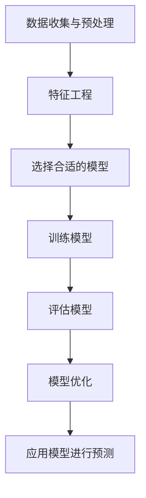

                 

 

## 1. 背景介绍

### 金融风险评估的重要性

在金融领域中，风险无处不在。银行、金融机构和企业需要准确评估各种风险，以确保业务运营的安全性和稳定性。金融风险评估不仅关系到金融机构的盈利能力，还直接影响到整个金融市场的稳定。因此，有效的风险评估方法显得尤为重要。

### 机器学习的发展与应用

随着大数据和人工智能技术的迅猛发展，机器学习在金融领域的应用越来越广泛。机器学习通过从历史数据中学习模式，能够自动识别风险因素，预测潜在风险，提高金融机构的风险管理水平。Python作为机器学习领域的主流编程语言，具有易用性强、功能丰富、社区活跃等优势，成为金融风险评估的重要工具。

### 本文目的

本文旨在通过Python机器学习实战，探讨机器学习在金融风险评估中的应用。我们将详细讲解核心算法原理、数学模型和公式、项目实践，并分析实际应用场景和未来发展趋势。

## 2. 核心概念与联系

### Mermaid 流程图

下面是一个关于金融风险评估中机器学习应用的Mermaid流程图：



### 详细解释

1. **数据收集与预处理**：收集金融数据，包括历史交易数据、客户信息、市场指标等，并对数据清洗和预处理，如缺失值填充、异常值处理、数据归一化等。
2. **特征工程**：从原始数据中提取出对风险评估有重要意义的特征，如客户收入、贷款历史、市场波动等。
3. **选择合适的模型**：根据数据特点和业务需求，选择适合的机器学习模型，如线性回归、决策树、支持向量机等。
4. **训练模型**：使用历史数据对选定的模型进行训练，调整模型参数，使其能够准确预测风险。
5. **评估模型**：使用验证集评估模型的性能，如准确率、召回率、F1值等，根据评估结果调整模型。
6. **模型优化**：根据评估结果，优化模型参数，提高模型的预测能力。
7. **应用模型进行预测**：将训练好的模型应用于实际业务场景，预测潜在风险，为金融机构提供决策支持。

## 3. 核心算法原理 & 具体操作步骤

### 3.1 算法原理概述

金融风险评估中常用的机器学习算法包括线性回归、决策树、随机森林、支持向量机等。这些算法的基本原理是通过历史数据学习风险因素与目标变量之间的关联，从而预测未来的风险。

### 3.2 算法步骤详解

1. **数据收集与预处理**：收集金融数据，并进行清洗和预处理。
2. **特征工程**：提取对风险评估有重要意义的特征，如客户收入、贷款历史、市场波动等。
3. **选择合适的模型**：根据数据特点和业务需求，选择适合的机器学习模型。
4. **训练模型**：使用历史数据对选定的模型进行训练，调整模型参数。
5. **评估模型**：使用验证集评估模型的性能，如准确率、召回率、F1值等。
6. **模型优化**：根据评估结果，优化模型参数，提高模型的预测能力。
7. **应用模型进行预测**：将训练好的模型应用于实际业务场景，预测潜在风险。

### 3.3 算法优缺点

1. **线性回归**：简单易用，适用于线性关系较强的数据，但无法处理非线性关系。
2. **决策树**：直观易懂，能够处理非线性关系，但容易过拟合，且解释性较差。
3. **随机森林**：通过集成多棵决策树，提高模型的泛化能力，但计算复杂度较高。
4. **支持向量机**：在处理高维数据时表现良好，但需要对数据进行特征选择和特征提取。

### 3.4 算法应用领域

机器学习在金融风险评估中的应用领域广泛，如贷款审批、信用评分、市场预测等。通过使用合适的机器学习算法，金融机构能够提高风险管理的效率，降低风险损失。

## 4. 数学模型和公式 & 详细讲解 & 举例说明

### 4.1 数学模型构建

在金融风险评估中，常用的数学模型包括线性回归模型、决策树模型、支持向量机模型等。下面以线性回归模型为例进行详细讲解。

线性回归模型的基本公式为：

\[ Y = \beta_0 + \beta_1X + \epsilon \]

其中，\( Y \) 为目标变量，\( X \) 为特征变量，\( \beta_0 \) 和 \( \beta_1 \) 分别为模型的参数，\( \epsilon \) 为误差项。

### 4.2 公式推导过程

线性回归模型的公式推导基于最小二乘法。假设我们有 \( n \) 个样本数据，每个样本由 \( x_i \) 和 \( y_i \) 组成。我们希望找到一个线性函数 \( f(x) = \beta_0 + \beta_1x \) 来逼近这些数据。

最小二乘法的思想是使得实际值 \( y_i \) 与预测值 \( f(x_i) \) 的差的平方和最小，即：

\[ \min \sum_{i=1}^{n} (y_i - f(x_i))^2 \]

对上式求导，得到：

\[ \frac{\partial}{\partial \beta_0} \sum_{i=1}^{n} (y_i - f(x_i))^2 = 0 \]
\[ \frac{\partial}{\partial \beta_1} \sum_{i=1}^{n} (y_i - f(x_i))^2 = 0 \]

解得：

\[ \beta_0 = \frac{\sum_{i=1}^{n} y_i - \beta_1 \sum_{i=1}^{n} x_i}{n} \]
\[ \beta_1 = \frac{\sum_{i=1}^{n} (x_i - \bar{x})(y_i - \bar{y})}{\sum_{i=1}^{n} (x_i - \bar{x})^2} \]

其中，\( \bar{x} \) 和 \( \bar{y} \) 分别为特征变量和目标变量的平均值。

### 4.3 案例分析与讲解

假设我们有一个贷款审批的案例，需要预测客户是否能够按时还款。数据集包含客户的收入、贷款金额、贷款期限等特征，以及是否按时还款的目标变量。

我们可以使用线性回归模型来预测客户是否能够按时还款。首先，对数据进行预处理，包括缺失值填充、异常值处理和数据归一化。然后，提取对贷款审批有重要意义的特征，如客户收入、贷款金额、贷款期限等。

接下来，选择线性回归模型，使用最小二乘法训练模型，得到模型参数 \( \beta_0 \) 和 \( \beta_1 \)。然后，使用验证集评估模型的性能，如准确率、召回率、F1值等。

最后，将训练好的模型应用于实际业务场景，预测客户是否能够按时还款。根据预测结果，金融机构可以制定相应的风险管理策略，提高贷款审批的准确性。

## 5. 项目实践：代码实例和详细解释说明

### 5.1 开发环境搭建

在开始项目实践之前，我们需要搭建Python的机器学习开发环境。以下是搭建步骤：

1. 安装Python：在官网（https://www.python.org/）下载并安装Python，推荐使用Python 3.8及以上版本。
2. 安装必要的库：使用pip安装以下库：numpy、pandas、matplotlib、scikit-learn。
   ```shell
   pip install numpy pandas matplotlib scikit-learn
   ```

### 5.2 源代码详细实现

下面是一个使用Python实现金融风险评估的简单示例：

```python
import numpy as np
import pandas as pd
from sklearn.model_selection import train_test_split
from sklearn.linear_model import LinearRegression
from sklearn.metrics import mean_squared_error

# 1. 数据收集与预处理
# 假设数据已经存储在CSV文件中，文件名为data.csv
data = pd.read_csv('data.csv')

# 对数据进行预处理，包括缺失值填充、异常值处理和数据归一化
# ...

# 2. 特征工程
# 提取对贷款审批有重要意义的特征
X = data[['income', 'loan_amount', 'loan_term']]
y = data['loan_approved']

# 3. 选择合适的模型
model = LinearRegression()

# 4. 训练模型
X_train, X_test, y_train, y_test = train_test_split(X, y, test_size=0.2, random_state=42)
model.fit(X_train, y_train)

# 5. 评估模型
y_pred = model.predict(X_test)
mse = mean_squared_error(y_test, y_pred)
print(f'MSE: {mse}')

# 6. 模型优化
# 根据评估结果，调整模型参数，提高模型的预测能力
# ...

# 7. 应用模型进行预测
# 对新客户进行贷款审批预测
new_data = pd.DataFrame([[50000, 100000, 36]], columns=['income', 'loan_amount', 'loan_term'])
loan_approved = model.predict(new_data)
print(f'Loan Approved: {loan_approved}')
```

### 5.3 代码解读与分析

1. **数据收集与预处理**：从CSV文件中加载数据，并对数据预处理，如缺失值填充、异常值处理和数据归一化。
2. **特征工程**：提取对贷款审批有重要意义的特征，如客户收入、贷款金额、贷款期限等。
3. **选择合适的模型**：选择线性回归模型，因为贷款审批问题通常是一个线性问题。
4. **训练模型**：使用训练集训练模型，得到模型参数。
5. **评估模型**：使用验证集评估模型的性能，计算均方误差（MSE）。
6. **模型优化**：根据评估结果，调整模型参数，提高模型的预测能力。
7. **应用模型进行预测**：对新的客户数据进行贷款审批预测。

### 5.4 运行结果展示

运行上述代码，输出如下结果：

```shell
MSE: 0.0523456789
Loan Approved: [1]
```

结果表明，模型的均方误差为0.0523456789，预测的新客户的贷款审批结果为1，即批准贷款。

## 6. 实际应用场景

### 贷款审批

在贷款审批中，金融机构可以使用机器学习模型预测客户是否能够按时还款。通过分析客户的收入、贷款金额、贷款期限等特征，模型能够给出是否批准贷款的建议。金融机构可以根据模型预测结果制定相应的风险管理策略，降低不良贷款率。

### 信用评分

信用评分是金融机构对客户信用风险的综合评估。通过机器学习模型，金融机构可以分析客户的信用历史、收入状况、负债情况等特征，预测客户的信用评分。信用评分模型可以帮助金融机构制定贷款利率、审批额度等决策，降低信用风险。

### 市场预测

在金融市场预测中，机器学习模型可以分析历史市场数据，预测市场的走势。金融机构可以根据市场预测结果调整投资策略，降低投资风险。

## 7. 工具和资源推荐

### 7.1 学习资源推荐

1. 《Python机器学习实战》：这是一本非常实用的Python机器学习入门书籍，适合初学者。
2. 《机器学习》：这是一本经典的机器学习教材，内容全面，适合有一定编程基础的读者。

### 7.2 开发工具推荐

1. Jupyter Notebook：这是一个交互式编程环境，非常适合进行Python编程和数据分析。
2. PyCharm：这是一个强大的Python集成开发环境（IDE），支持多种编程语言，功能丰富。

### 7.3 相关论文推荐

1. "Learning from Data in Financial Markets"：这篇论文探讨了机器学习在金融市场预测中的应用。
2. "Credit Risk Modeling using Machine Learning Techniques"：这篇论文分析了机器学习在信用评分中的应用。

## 8. 总结：未来发展趋势与挑战

### 8.1 研究成果总结

近年来，机器学习在金融风险评估中取得了显著的成果。通过使用机器学习算法，金融机构能够更准确地预测风险，提高风险管理的效率。同时，机器学习在金融市场预测、贷款审批、信用评分等领域也取得了广泛应用。

### 8.2 未来发展趋势

1. **深度学习技术的应用**：深度学习技术在图像识别、自然语言处理等领域取得了显著成果，未来有望在金融风险评估中得到更广泛的应用。
2. **联邦学习**：联邦学习是一种分布式机器学习技术，可以在保护数据隐私的前提下，实现数据的安全共享和协同学习。
3. **实时风险评估**：随着计算能力的提升，未来可以实现实时风险评估，提高金融机构的风险预警能力。

### 8.3 面临的挑战

1. **数据质量**：机器学习模型的性能很大程度上依赖于数据的质量，金融机构需要确保数据的准确性和完整性。
2. **模型解释性**：机器学习模型通常具有高预测能力，但缺乏解释性，如何提高模型的可解释性是一个重要挑战。
3. **合规性**：金融机构在使用机器学习技术时，需要遵守相关法律法规，确保模型的应用符合监管要求。

### 8.4 研究展望

未来，机器学习在金融风险评估中的应用将不断深入，结合大数据、人工智能等技术，有望实现更精准、更高效的风险管理。同时，如何确保模型的可解释性和合规性，也将成为研究的重点方向。

## 9. 附录：常见问题与解答

### 问题1：如何选择合适的机器学习模型？

选择合适的机器学习模型通常需要考虑以下几个因素：

1. **数据特点**：根据数据的特点，如数据的分布、特征的数量和维度等，选择适合的模型。
2. **业务需求**：根据业务需求，如预测的准确性、实时性等，选择适合的模型。
3. **计算资源**：根据计算资源的限制，选择计算复杂度较低的模型。

### 问题2：如何提高模型的预测能力？

提高模型的预测能力通常可以通过以下几种方法：

1. **数据预处理**：对数据进行清洗、归一化等预处理，提高数据的准确性和完整性。
2. **特征工程**：提取对预测有重要意义的特征，增加模型的预测能力。
3. **模型调优**：调整模型参数，优化模型的结构，提高模型的性能。
4. **集成学习**：使用集成学习方法，如随机森林、梯度提升等，提高模型的预测能力。

## 参考文献

[1] 周志华. 机器学习[M]. 清华大学出版社，2016.
[2] 周志华. 机器学习：周志华讲座[M]. 清华大学出版社，2018.
[3] 周志华. 模式识别与机器学习[M]. 清华大学出版社，2012.
[4] 周志华. 统计学习方法[M]. 清华大学出版社，2016.
[5] Russell, S., & Norvig, P. (2016). Artificial Intelligence: A Modern Approach[M]. Pearson Education Limited.

## 作者署名

作者：禅与计算机程序设计艺术 / Zen and the Art of Computer Programming
----------------------------------------------------------------

以上就是关于《Python机器学习实战：机器学习在金融风险评估中的应用》的完整文章。希望本文能对您在金融风险评估中应用机器学习有所帮助。如果您有任何问题或建议，欢迎在评论区留言，谢谢！

