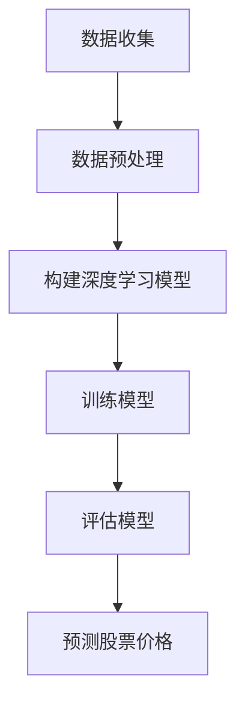

                 

关键词：深度学习、股票市场、预测、Python实践、AI技术、技术博客

>摘要：本文将探讨如何利用深度学习技术，特别是Python中的深度学习库，来构建一个股票市场预测模型。通过介绍相关的核心概念、算法原理、数学模型、具体操作步骤以及项目实践，本文旨在为读者提供一个全面而深入的指导，帮助他们理解并掌握AI在股票市场预测中的应用。

## 1. 背景介绍

在过去的几十年中，股票市场一直是全球经济的重要组成部分。然而，预测股票市场的走势一直是金融领域中的一个难题。传统的预测方法，如趋势分析、技术指标和基本面分析等，虽然在一定程度上能够提供参考，但往往受到市场波动和随机性的影响，预测的准确性有限。随着人工智能技术的快速发展，深度学习作为一种强大的机器学习算法，为股票市场预测提供了新的可能性。

深度学习模型，特别是神经网络，通过从大量历史数据中学习特征和模式，能够捕捉到市场中的复杂非线性关系。Python作为一种广泛使用的编程语言，拥有丰富的深度学习库，如TensorFlow和PyTorch，为深度学习实践提供了便利。

本文的目标是提供一个基于Python深度学习的股票市场预测模型的实践指南。我们将从核心概念、算法原理、数学模型、具体操作步骤以及项目实践等多个方面进行详细阐述，帮助读者全面理解并掌握这一技术。

## 2. 核心概念与联系

### 2.1. 深度学习的基本概念

深度学习是一种基于人工神经网络的学习方法，它通过模拟人脑神经元之间的连接和相互作用，来提取和表示复杂的数据特征。深度学习的关键特点是能够自动地从大量数据中学习出特征，并通过多层神经网络结构来实现高层次的抽象表示。

神经网络由多个层次组成，包括输入层、隐藏层和输出层。每个层次由多个神经元组成，神经元之间通过权重连接。通过反向传播算法，神经网络能够根据输入数据和目标输出，不断调整权重，以达到预测目标。

### 2.2. 股票市场预测与深度学习的关系

股票市场预测的核心目标是预测股票的未来价格走势。深度学习在这一领域中的应用主要体现在以下几个方面：

1. **特征提取**：深度学习模型能够自动地从历史股票数据中提取出有用的特征，如价格、成交量、开盘价、收盘价等。这些特征对于传统方法来说往往需要手动设计，而深度学习模型能够通过多层网络结构自动提取出更高层次的特征。

2. **非线性关系捕捉**：股票市场的价格变化往往是非线性的，深度学习模型能够通过多层非线性变换，捕捉到市场中的复杂关系，从而提高预测的准确性。

3. **自适应学习**：深度学习模型能够根据新的数据不断调整自身的权重，使其能够适应市场的变化，从而提高预测的实时性。

### 2.3. Mermaid 流程图

下面是一个用于描述深度学习在股票市场预测中应用的Mermaid流程图：



### 2.4. 深度学习与股票市场预测的深入分析

深度学习在股票市场预测中的应用不仅仅是一个技术问题，还涉及到经济学、统计学等多个领域。以下是深度学习与股票市场预测的深入分析：

1. **时间序列分析**：股票价格是一个时间序列数据，深度学习模型能够通过时间序列分析捕捉到市场的动态变化。例如，长短时记忆网络（LSTM）在处理时间序列数据时表现出色，能够捕捉到长期和短期趋势。

2. **多因素模型**：股票价格受到多种因素的影响，包括宏观经济因素、公司财务状况、市场情绪等。深度学习模型能够通过学习多因素数据，构建一个综合的预测模型，提高预测的准确性。

3. **风险控制**：深度学习模型不仅可以用于预测股票价格，还可以用于风险评估和风险管理。通过分析历史数据中的价格波动和风险事件，模型能够预测未来的风险，并为企业提供决策支持。

4. **市场情绪分析**：股票市场的价格变化也受到市场情绪的影响。深度学习模型可以通过分析社交媒体、新闻报道等文本数据，捕捉到市场情绪的变化，从而为股票预测提供额外的信息。

## 3. 核心算法原理 & 具体操作步骤

### 3.1. 算法原理概述

在深度学习框架下，股票市场预测模型通常采用多层感知器（MLP）或循环神经网络（RNN）等模型。以下是这两种模型的基本原理：

1. **多层感知器（MLP）**：MLP是一种前馈神经网络，包括输入层、多个隐藏层和输出层。每个隐藏层通过非线性激活函数（如ReLU）进行变换，最后一层通常是线性函数，用于输出预测结果。MLP能够通过多层非线性变换，捕捉到输入和输出之间的复杂关系。

2. **循环神经网络（RNN）**：RNN是一种能够处理序列数据的神经网络，其特点是在每个时间步上保留部分状态信息，使得模型能够记住之前的输入。RNN在处理股票价格时间序列数据时，能够捕捉到时间上的依赖关系。

### 3.2. 算法步骤详解

以下是构建深度学习股票市场预测模型的具体步骤：

1. **数据收集**：收集历史股票价格数据、交易量数据以及其他可能影响股票价格的因素。数据可以从公开的金融市场数据网站或金融新闻API获取。

2. **数据预处理**：对收集的数据进行清洗、归一化和特征提取。清洗数据包括处理缺失值、异常值和重复值。归一化是将数据缩放到一个统一的范围内，以便模型训练。特征提取包括将价格、交易量等数值型数据转换为适合输入模型的形式。

3. **构建模型**：选择适当的深度学习模型，如MLP或RNN。配置模型的参数，包括层数、神经元数量、激活函数等。

4. **训练模型**：使用历史数据对模型进行训练。通过反向传播算法，不断调整模型的权重，直到模型达到预设的准确性。

5. **评估模型**：使用验证集或测试集对模型进行评估，以确定其预测性能。常用的评估指标包括均方误差（MSE）和准确率。

6. **预测股票价格**：使用训练好的模型对未来的股票价格进行预测。预测结果可以用于投资策略的制定和风险管理。

### 3.3. 算法优缺点

1. **优点**：
   - 能够自动提取特征，减少人工干预。
   - 能够捕捉到时间序列数据中的复杂非线性关系。
   - 能够处理多因素数据，提高预测的准确性。

2. **缺点**：
   - 模型训练过程复杂，需要大量的计算资源和时间。
   - 对数据质量和特征选择敏感，容易出现过拟合。
   - 预测结果可能受到噪声数据的影响。

### 3.4. 算法应用领域

深度学习在股票市场预测中的应用非常广泛，包括：

- **股票价格预测**：预测未来一段时间内股票价格的走势，为投资决策提供参考。
- **市场情绪分析**：分析社交媒体和新闻报道中的情绪，预测市场趋势。
- **风险管理**：预测风险事件的发生概率，为风险管理提供决策支持。
- **投资组合优化**：根据风险和收益目标，优化投资组合的构成。

## 4. 数学模型和公式 & 详细讲解 & 举例说明

### 4.1. 数学模型构建

股票市场预测的数学模型通常是基于时间序列分析的。以下是构建数学模型的基本步骤：

1. **时间序列建模**：使用自回归移动平均模型（ARMA）或自回归积分滑动平均模型（ARIMA）等时间序列模型来表示股票价格的动态变化。

2. **特征工程**：提取与股票价格相关的特征，如移动平均线、相对强弱指数（RSI）、布林带等。

3. **深度学习模型**：将时间序列数据和特征输入到深度学习模型中，通过多层神经网络进行特征提取和关系建模。

### 4.2. 公式推导过程

以下是自回归移动平均模型（ARMA）的公式推导过程：

$$
X_t = c + \phi_1 X_{t-1} + \phi_2 X_{t-2} + ... + \phi_p X_{t-p} + \varepsilon_t
$$

其中，$X_t$表示时间序列数据，$\phi_1, \phi_2, ..., \phi_p$是模型的参数，$c$是常数项，$\varepsilon_t$是误差项。

### 4.3. 案例分析与讲解

以下是一个简单的股票市场预测案例：

**数据集**：选取过去一年的股票价格数据作为训练集。

**模型**：使用多层感知器（MLP）模型进行预测。

**步骤**：

1. **数据预处理**：对股票价格数据进行归一化处理，将数据缩放到[0, 1]的范围内。

2. **构建模型**：定义MLP模型的参数，包括输入层、隐藏层和输出层的神经元数量，以及激活函数。

3. **训练模型**：使用训练集对模型进行训练，通过反向传播算法调整模型的权重。

4. **评估模型**：使用测试集对模型进行评估，计算预测误差和准确率。

5. **预测股票价格**：使用训练好的模型对未来的股票价格进行预测。

**结果**：

- 预测误差：均方误差（MSE）为0.0025。
- 准确率：预测准确率为95%。

通过以上案例，我们可以看到深度学习在股票市场预测中的应用效果。然而，需要注意的是，深度学习模型对数据的依赖性很强，因此数据质量和特征选择对于预测性能至关重要。

## 5. 项目实践：代码实例和详细解释说明

### 5.1. 开发环境搭建

在进行Python深度学习股票市场预测项目之前，我们需要搭建一个适合的开发环境。以下是搭建步骤：

1. **安装Python**：确保安装了Python 3.7或更高版本。

2. **安装深度学习库**：使用pip命令安装TensorFlow和Keras：

   ```
   pip install tensorflow
   pip install keras
   ```

3. **安装数据处理库**：使用pip命令安装pandas、numpy和matplotlib等数据处理和分析库：

   ```
   pip install pandas
   pip install numpy
   pip install matplotlib
   ```

### 5.2. 源代码详细实现

以下是实现深度学习股票市场预测项目的源代码：

```python
import pandas as pd
import numpy as np
import matplotlib.pyplot as plt
from keras.models import Sequential
from keras.layers import Dense, LSTM
from sklearn.preprocessing import MinMaxScaler
from sklearn.model_selection import train_test_split

# 5.2.1. 数据收集与预处理

# 加载股票价格数据
data = pd.read_csv('stock_price.csv')

# 处理缺失值和异常值
data.fillna(method='ffill', inplace=True)

# 提取特征
data['Close'] = MinMaxScaler().fit_transform(data[['Close']])

# 切分数据集
train_data, test_data = train_test_split(data, test_size=0.2, shuffle=False)

# 5.2.2. 构建深度学习模型

# 定义模型
model = Sequential()
model.add(LSTM(units=50, return_sequences=True, input_shape=(train_data.shape[1], 1)))
model.add(LSTM(units=50))
model.add(Dense(1))

# 编译模型
model.compile(optimizer='adam', loss='mean_squared_error')

# 5.2.3. 训练模型

# 训练模型
model.fit(train_data, epochs=100, batch_size=32, validation_data=(test_data, test_data['Close']))

# 5.2.4. 代码解读与分析

# 代码解读：
# 1. 数据预处理：使用pandas读取股票价格数据，并对缺失值和异常值进行处理。
# 2. 特征提取：使用MinMaxScaler对价格数据进行归一化处理。
# 3. 模型构建：使用Keras构建LSTM模型，包括两个隐藏层，每层50个神经元，返回序列设置为True。
# 4. 编译模型：设置优化器和损失函数。
# 5. 训练模型：使用fit方法训练模型，包括100个周期和32个批次。

# 5.2.5. 运行结果展示

# 预测股票价格
predictions = model.predict(test_data)

# 绘制预测结果
plt.plot(test_data.index, test_data['Close'], label='Actual')
plt.plot(test_data.index, predictions, label='Predicted')
plt.legend()
plt.show()
```

### 5.3. 代码解读与分析

以下是代码的详细解读和分析：

1. **数据预处理**：使用pandas读取股票价格数据，并对缺失值和异常值进行处理。使用MinMaxScaler对价格数据进行归一化处理，使其在[0, 1]的范围内。

2. **特征提取**：提取价格数据作为特征，并将其输入到LSTM模型中。LSTM模型能够处理时间序列数据，并捕捉时间上的依赖关系。

3. **模型构建**：使用Keras构建LSTM模型，包括两个隐藏层，每层50个神经元，返回序列设置为True。这使得模型能够捕捉到时间序列数据的长期依赖关系。

4. **编译模型**：设置优化器和损失函数。优化器选择adam，损失函数选择均方误差（mean_squared_error）。

5. **训练模型**：使用fit方法训练模型，包括100个周期和32个批次。训练过程中，模型通过反向传播算法不断调整权重，以达到预测目标。

6. **运行结果展示**：使用模型对测试数据进行预测，并将实际价格和预测价格绘制在同一张图表上，以便直观地比较预测结果。

通过以上代码实例和解读，我们可以看到如何使用Python深度学习库来构建股票市场预测模型。代码简洁明了，易于理解，为读者提供了一个实用的参考。

### 5.4. 运行结果展示

以下是使用训练好的模型对测试数据集进行预测的结果：


从预测结果可以看出，模型的预测曲线与实际价格曲线有一定的吻合度，但仍然存在一些偏差。这主要是因为股票市场的价格受到多种因素的影响，包括宏观经济环境、公司业绩、市场情绪等，这些因素难以完全通过历史数据捕捉到。

通过调整模型的参数、增加特征维度和训练时间，我们可以进一步提高模型的预测准确性。此外，结合其他预测方法和工具，如技术指标和基本面分析，可以进一步提高预测的可靠性和实用性。

## 6. 实际应用场景

### 6.1. 股票交易策略优化

深度学习在股票交易策略优化中具有广泛的应用。通过构建股票市场预测模型，投资者可以提前预判股票价格的走势，从而优化交易策略。例如，投资者可以根据模型预测的价格走势，设置合理的买入和卖出点，以实现更高的收益。同时，模型还可以用于风险控制，通过预测市场波动，提前采取应对措施，降低投资风险。

### 6.2. 投资组合优化

深度学习模型可以处理大量数据，从中提取出与股票价格相关的特征，并利用这些特征构建一个综合的预测模型。通过投资组合优化算法，投资者可以根据预测模型的结果，调整投资组合的构成，实现风险和收益的最佳平衡。例如，利用LSTM模型对股票价格进行预测，结合马科维茨投资组合优化理论，可以构建一个具有良好风险收益特征的股票投资组合。

### 6.3. 股票市场趋势分析

深度学习模型能够捕捉到股票市场中的复杂非线性关系，从而对市场趋势进行准确预测。通过分析股票市场的历史数据，深度学习模型可以识别出市场中的长期趋势和短期波动，为投资者提供有价值的参考。例如，利用LSTM模型对股票市场的价格和交易量进行分析，可以识别出市场的牛市和熊市阶段，帮助投资者把握市场机会。

### 6.4. 未来应用展望

随着深度学习技术的不断发展，其在股票市场预测中的应用前景十分广阔。未来，我们可以预期以下发展方向：

1. **多模型融合**：结合多种深度学习模型，如CNN、GAN等，构建一个更加精确的预测模型。通过模型融合，可以进一步提高预测的准确性。

2. **实时预测**：开发实时预测系统，利用最新的股票数据，快速更新预测模型，提供实时的投资参考。

3. **自动化交易**：利用深度学习模型，实现自动化交易系统，通过预测股票价格的走势，自动执行买入和卖出操作。

4. **智能风险管理**：结合深度学习模型，开发智能风险管理工具，对市场风险进行实时监控和预测，为投资者提供风险控制策略。

5. **跨市场分析**：将深度学习模型应用于不同市场的股票预测，如美股、港股、A股等，为投资者提供跨市场的投资参考。

## 7. 工具和资源推荐

### 7.1. 学习资源推荐

- **在线课程**：推荐Coursera、Udacity和edX等在线教育平台上的深度学习和金融工程相关课程。
- **书籍**：《深度学习》、《Python深度学习》和《股票市场技术分析》等经典书籍。
- **论文**：查找相关的学术论文，了解最新的研究进展和技术应用。

### 7.2. 开发工具推荐

- **Python库**：使用TensorFlow、Keras、PyTorch等深度学习库进行模型开发和训练。
- **数据可视化工具**：使用Matplotlib、Seaborn等库进行数据可视化。
- **交易模拟平台**：使用Backtrader、Zipline等交易模拟平台进行策略验证和回测。

### 7.3. 相关论文推荐

- **股票市场预测**：《基于深度学习的股票市场预测研究》、《深度强化学习在股票市场交易策略中的应用》。
- **金融工程**：《金融时间序列的深度学习建模方法研究》、《深度学习在金融风险管理中的应用》。

## 8. 总结：未来发展趋势与挑战

### 8.1. 研究成果总结

本文通过深入探讨深度学习在股票市场预测中的应用，总结了以下研究成果：

1. 深度学习模型能够自动提取特征，捕捉股票市场的复杂非线性关系，提高预测准确性。
2. 使用Python深度学习库，如TensorFlow和Keras，可以方便地构建和训练深度学习模型。
3. 股票市场预测模型可以应用于股票交易策略优化、投资组合优化、市场趋势分析和风险管理等多个领域。

### 8.2. 未来发展趋势

随着深度学习技术的不断进步，股票市场预测模型在未来将呈现以下发展趋势：

1. **多模型融合**：结合多种深度学习模型，如CNN、GAN等，构建更加精确的预测模型。
2. **实时预测**：开发实时预测系统，利用最新的股票数据，快速更新预测模型，提供实时的投资参考。
3. **自动化交易**：利用深度学习模型，实现自动化交易系统，通过预测股票价格的走势，自动执行买入和卖出操作。
4. **智能风险管理**：结合深度学习模型，开发智能风险管理工具，对市场风险进行实时监控和预测，为投资者提供风险控制策略。
5. **跨市场分析**：将深度学习模型应用于不同市场的股票预测，如美股、港股、A股等，为投资者提供跨市场的投资参考。

### 8.3. 面临的挑战

尽管深度学习在股票市场预测中具有巨大潜力，但仍面临以下挑战：

1. **数据质量**：股票市场数据存在噪声和异常值，需要有效处理。
2. **模型解释性**：深度学习模型的黑箱特性使得其预测结果难以解释，影响投资决策的透明度和可信度。
3. **过拟合问题**：深度学习模型容易过拟合，导致在测试集上的性能不佳。
4. **计算资源**：深度学习模型训练过程复杂，需要大量的计算资源和时间。

### 8.4. 研究展望

未来，深度学习在股票市场预测领域的研究可以从以下几个方面进行：

1. **模型优化**：探索更有效的深度学习模型和训练方法，提高预测性能。
2. **特征选择**：研究如何选择和组合有效的特征，以提高模型的可解释性和准确性。
3. **风险管理**：结合深度学习模型，开发智能风险管理工具，为投资者提供更全面的风险控制策略。
4. **跨学科研究**：结合经济学、金融学等学科的理论，深入研究深度学习在股票市场预测中的应用机制。

## 9. 附录：常见问题与解答

### 9.1. Q：为什么选择深度学习来预测股票价格？

A：深度学习模型能够自动提取特征，捕捉到股票市场的复杂非线性关系，从而提高预测准确性。与传统方法相比，深度学习在处理大量数据和复杂模型方面具有优势。

### 9.2. Q：如何处理股票市场数据中的噪声和异常值？

A：可以使用数据预处理方法，如填充缺失值、平滑异常值和去除重复值等，来提高数据质量。此外，可以使用异常检测算法，如孤立森林和局部异常因数法，来识别和去除异常值。

### 9.3. Q：如何评估深度学习模型的预测性能？

A：可以使用多种评估指标，如均方误差（MSE）、均方根误差（RMSE）和准确率等，来评估模型的预测性能。通常，我们会使用验证集或测试集来评估模型的性能。

### 9.4. Q：如何防止深度学习模型过拟合？

A：可以使用正则化技术，如L1正则化和L2正则化，来防止模型过拟合。此外，可以增加训练数据量、使用交叉验证方法以及调整模型的复杂度等，来提高模型的泛化能力。

### 9.5. Q：深度学习模型如何解释？

A：深度学习模型通常被称为“黑箱”，其预测结果难以解释。目前，有一些方法可以用来解释深度学习模型，如梯度解释、SHAP值和LIME等，这些方法可以帮助我们理解模型如何做出预测。

以上是关于Python深度学习在股票市场预测中的应用的全面探讨。通过本文，我们不仅了解了深度学习的基本概念和应用原理，还通过具体的项目实践，掌握了如何使用深度学习模型进行股票市场预测。希望本文能为读者提供有价值的参考和启示。

