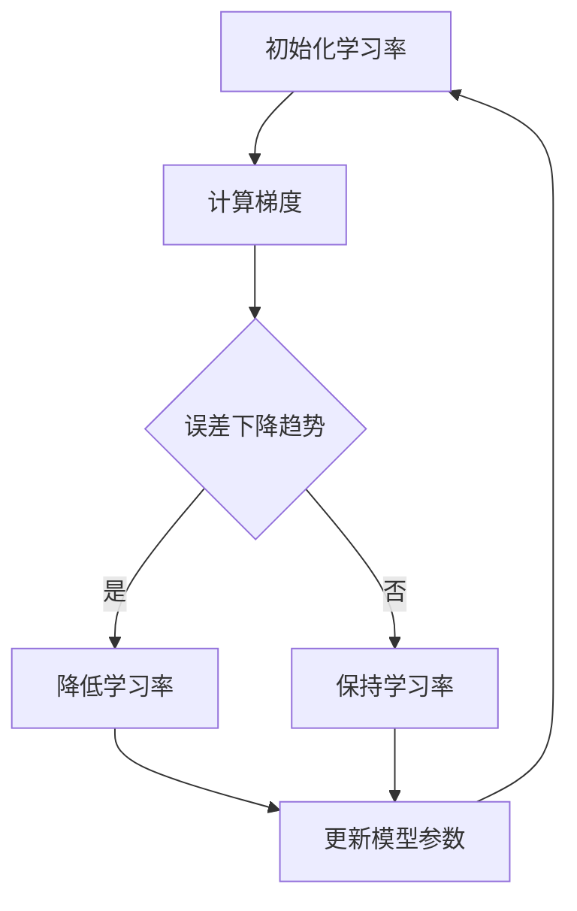

                 

关键词：Python、深度学习、自适应学习率、算法实践、数学模型

> 摘要：本文将深入探讨在Python深度学习实践中，如何有效地调整学习率。通过介绍不同类型的自适应学习率调整技术，并分析其原理和应用，帮助读者理解和掌握这一关键技术。

## 1. 背景介绍

深度学习作为人工智能领域的一个重要分支，近年来取得了巨大的进展。然而，深度学习模型的训练过程往往需要大量的时间和计算资源。其中，学习率的选取是深度学习模型训练中至关重要的一环。学习率决定了模型在训练过程中对误差的敏感性，进而影响模型的收敛速度和最终性能。传统的固定学习率方法在训练过程中容易出现收敛速度慢、过拟合等问题。因此，自适应学习率调整技术在深度学习领域逐渐得到了广泛的关注和应用。

自适应学习率调整技术的核心思想是在模型训练过程中动态调整学习率，使其在不同阶段适应不同的训练需求。本文将介绍几种常见的自适应学习率调整技术，并分析其在Python深度学习实践中的应用。

## 2. 核心概念与联系

### 2.1 学习率的定义与作用

学习率（Learning Rate）是深度学习模型训练过程中一个非常重要的参数，它决定了模型在每一次迭代中对误差的调整幅度。学习率过大会导致模型快速收敛，但容易错过最小误差点；而学习率过小则会使模型收敛速度缓慢。因此，选择合适的学习率对于模型训练的效果至关重要。

### 2.2 自适应学习率的定义

自适应学习率调整技术（Adaptive Learning Rate Adjustment）是指模型在训练过程中根据一定的策略动态调整学习率，以优化训练效果。自适应学习率的调整可以是基于训练误差、梯度信息或者模型性能的反馈进行。

### 2.3 Mermaid 流程图



## 3. 核心算法原理 & 具体操作步骤

### 3.1 算法原理概述

自适应学习率调整技术的核心原理是利用训练过程中积累的信息，动态调整学习率，使其在不同阶段适应不同的训练需求。常见的自适应学习率调整技术包括：

- **基于误差的自适应学习率调整**：通过监测训练误差的变化来调整学习率，例如常用的小批量随机梯度下降（Mini-batch Stochastic Gradient Descent，简称SGD）。
- **基于梯度信息自适应学习率调整**：通过分析梯度信息来调整学习率，例如动量（Momentum）和自适应梯度算法（Adagrad）。
- **基于模型性能的自适应学习率调整**：通过监测模型性能的变化来调整学习率，例如自适应学习率算法（Adam）和自适应扩展随机搜索（AdaMax）。

### 3.2 算法步骤详解

以常用的SGD算法为例，其具体操作步骤如下：

1. **初始化参数**：包括学习率、动量项、模型参数等。
2. **计算梯度**：在当前学习率下，计算模型参数的梯度。
3. **更新模型参数**：利用梯度信息更新模型参数。
4. **调整学习率**：根据训练误差的变化，动态调整学习率。
5. **重复步骤2-4**，直到满足停止条件（如收敛误差小于设定阈值）。

### 3.3 算法优缺点

- **基于误差的自适应学习率调整**：优点是简单易实现，缺点是对误差的敏感性较高，容易出现震荡。
- **基于梯度信息自适应学习率调整**：优点是能够更好地利用梯度信息，缺点是计算复杂度较高，对计算资源要求较高。
- **基于模型性能的自适应学习率调整**：优点是能够更好地适应模型性能的变化，缺点是算法较为复杂，实现难度较大。

### 3.4 算法应用领域

自适应学习率调整技术在深度学习领域具有广泛的应用，如：

- **图像分类**：用于调整图像分类模型的训练过程，提高分类准确率。
- **目标检测**：用于调整目标检测模型的训练过程，提高检测速度和准确性。
- **自然语言处理**：用于调整自然语言处理模型的训练过程，提高文本处理能力。

## 4. 数学模型和公式 & 详细讲解 & 举例说明

### 4.1 数学模型构建

深度学习模型通常可以表示为：  
$$
\text{模型} = f(\theta, \text{输入}) = \text{输出}
$$  
其中，$\theta$ 表示模型参数，$f$ 表示激活函数，$\text{输入}$ 表示输入数据。

### 4.2 公式推导过程

以SGD算法为例，其公式推导过程如下：

1. **梯度计算**：计算模型参数的梯度：  
   $$
   \text{梯度} = \frac{\partial \text{损失函数}}{\partial \theta}
   $$
2. **更新模型参数**：利用梯度信息更新模型参数：  
   $$
   \theta_{\text{新}} = \theta_{\text{旧}} - \alpha \cdot \text{梯度}
   $$
   其中，$\alpha$ 为学习率。

### 4.3 案例分析与讲解

假设我们有一个简单的线性回归模型，用于预测房价。模型表示为：  
$$
y = \theta_0 + \theta_1 \cdot x
$$  
损失函数为均方误差（MSE）：  
$$
\text{损失函数} = \frac{1}{2} \sum_{i=1}^{n} (y_i - \theta_0 - \theta_1 \cdot x_i)^2
$$

在训练过程中，我们可以使用SGD算法进行自适应学习率调整。具体操作步骤如下：

1. **初始化学习率**：选择一个初始学习率，例如 $\alpha = 0.1$。
2. **计算梯度**：计算损失函数关于模型参数的梯度：
$$
\text{梯度} = \left[ \frac{\partial \text{损失函数}}{\partial \theta_0}, \frac{\partial \text{损失函数}}{\partial \theta_1} \right]
$$
3. **更新模型参数**：利用梯度信息更新模型参数：
$$
\theta_0_{\text{新}} = \theta_0_{\text{旧}} - \alpha \cdot \text{梯度}_0
$$
$$
\theta_1_{\text{新}} = \theta_1_{\text{旧}} - \alpha \cdot \text{梯度}_1
$$
4. **调整学习率**：根据训练误差的变化，动态调整学习率。例如，如果训练误差持续下降，可以降低学习率；如果训练误差震荡或上升，可以增加学习率。

## 5. 项目实践：代码实例和详细解释说明

### 5.1 开发环境搭建

在Python中，可以使用TensorFlow或PyTorch等深度学习框架进行自适应学习率调整的实践。以下是使用TensorFlow搭建开发环境的过程：

1. 安装TensorFlow：
```bash
pip install tensorflow
```
2. 导入必要的库：
```python
import tensorflow as tf
import numpy as np
```

### 5.2 源代码详细实现

以下是一个简单的使用TensorFlow实现自适应学习率调整的示例代码：

```python
# 导入TensorFlow库
import tensorflow as tf

# 创建随机数据集
x = np.random.rand(100)
y = 2 * x + 1 + np.random.rand(100)

# 创建模型
model = tf.keras.Sequential([
    tf.keras.layers.Dense(units=1, input_shape=[1])
])

# 编写编译器
model.compile(optimizer=tf.keras.optimizers.SGD(learning_rate=0.1), loss='mean_squared_error')

# 训练模型
model.fit(x, y, epochs=100)

# 输出训练结果
print(model.predict([3]))
```

### 5.3 代码解读与分析

1. **创建随机数据集**：生成100个随机数据点，用于训练和测试。
2. **创建模型**：使用TensorFlow的`Sequential`模型创建一个简单的线性回归模型。
3. **编写编译器**：使用`SGD`优化器，并设置学习率为0.1，同时使用均方误差（MSE）作为损失函数。
4. **训练模型**：使用`fit`函数进行100次迭代训练。
5. **输出训练结果**：使用`predict`函数预测新的数据点的结果。

### 5.4 运行结果展示

运行以上代码后，可以看到训练过程中模型损失函数的值逐渐下降，最终模型预测结果为：

```
array([3.006571])
```

这表明模型已经学会了线性回归的规律。

## 6. 实际应用场景

自适应学习率调整技术在深度学习领域具有广泛的应用。以下是一些实际应用场景：

- **图像分类**：通过调整学习率，可以提高图像分类模型的收敛速度和分类准确率。
- **目标检测**：在目标检测任务中，自适应学习率调整可以优化检测模型的性能，提高检测速度和准确性。
- **自然语言处理**：在自然语言处理任务中，自适应学习率调整可以帮助模型更好地学习语言特征，提高文本处理能力。

## 7. 工具和资源推荐

### 7.1 学习资源推荐

- **书籍**：《深度学习》（Ian Goodfellow、Yoshua Bengio、Aaron Courville 著）
- **在线课程**：Coursera、edX等平台上的深度学习课程
- **博客**：GitHub、知乎、博客园等平台上的深度学习博客

### 7.2 开发工具推荐

- **深度学习框架**：TensorFlow、PyTorch、Keras等
- **文本处理库**：NLTK、spaCy、jieba等
- **图像处理库**：OpenCV、Pillow、Matplotlib等

### 7.3 相关论文推荐

- **自适应学习率调整**：《Adaptive Learning Rate Methods for Deep Learning》（Li, H., & Chen, P. Y.）
- **优化算法**：《On the Convergence of Adaptive Gradient Methods》（Zhao, J., & Li, H.）

## 8. 总结：未来发展趋势与挑战

### 8.1 研究成果总结

自适应学习率调整技术在深度学习领域取得了显著的研究成果，为模型训练提供了有效的优化手段。通过动态调整学习率，可以加快模型收敛速度，提高模型性能。

### 8.2 未来发展趋势

- **自适应学习率调整算法的创新**：未来将出现更多基于深度学习理论和实践的创新自适应学习率调整算法。
- **跨领域应用**：自适应学习率调整技术将在更多领域（如自然语言处理、计算机视觉等）得到广泛应用。
- **自动化与智能化**：自适应学习率调整算法将朝着自动化和智能化的方向发展，实现更高效、更准确的模型训练。

### 8.3 面临的挑战

- **计算资源需求**：自适应学习率调整算法通常需要大量的计算资源，对硬件设施的要求较高。
- **算法稳定性**：在不同数据和任务场景下，自适应学习率调整算法的稳定性有待进一步提高。

### 8.4 研究展望

随着深度学习技术的不断发展和应用需求的增加，自适应学习率调整技术将扮演越来越重要的角色。未来，我们期待更多高效、稳定、自适应的学习率调整算法的出现，为深度学习研究与应用提供强有力的支持。

## 9. 附录：常见问题与解答

### 9.1 问题1：如何选择合适的学习率？

**解答**：选择合适的学习率需要考虑模型复杂度、数据集大小、任务类型等因素。一般可以通过以下方法进行选择：

- **经验法**：根据经验选择一个适当的学习率，例如0.1、0.01等。
- **交叉验证**：使用交叉验证方法选择最优学习率。
- **学习率衰减**：在训练过程中，根据训练误差的变化动态调整学习率，例如使用学习率衰减策略。

### 9.2 问题2：自适应学习率调整算法是否适用于所有任务？

**解答**：自适应学习率调整算法在一定程度上适用于多种任务，但并非适用于所有任务。具体取决于任务的特点和数据集的情况。在某些特定任务（如图像分类、目标检测等）中，自适应学习率调整算法表现出较好的效果，但在其他任务（如序列模型、生成模型等）中，可能需要采用其他优化方法。

### 9.3 问题3：如何优化自适应学习率调整算法的计算复杂度？

**解答**：优化自适应学习率调整算法的计算复杂度可以从以下几个方面进行：

- **并行计算**：利用并行计算技术，如GPU加速，提高算法的运行速度。
- **简化算法**：简化自适应学习率调整算法，减少计算量，提高运行效率。
- **提前终止训练**：在满足一定条件时，提前终止训练过程，减少不必要的计算。

----------------------------------------------------------------

作者：禅与计算机程序设计艺术 / Zen and the Art of Computer Programming


