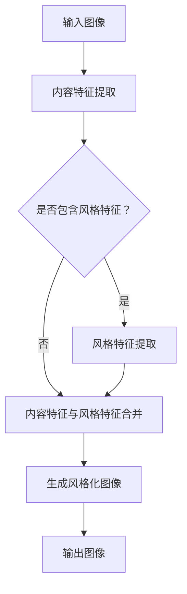

                 

 > **关键词：**
- 深度学习
- 风格迁移网络
- 艺术品
- Python实践

<|assistant|> > **摘要：**
本文将探讨深度学习领域中的一个前沿话题——风格迁移网络，并详细介绍如何使用Python实现这一技术，让普通照片转化为艺术品。我们将从背景介绍、核心概念、算法原理、数学模型、项目实践、应用场景、工具和资源推荐等方面进行详细讲解。

## 1. 背景介绍

风格迁移，又称图像风格化，是深度学习领域中的一项重要技术。它的目标是学习一种将输入图像的视觉风格转移到另一种图像上的方法。风格迁移不仅在艺术创作领域具有广泛的应用，还在图像处理、计算机视觉等多个领域有重要的实际意义。

在过去的几十年里，风格迁移技术经历了多次迭代和优化。传统的风格迁移方法主要基于频域变换和图像滤波等技术。然而，随着深度学习技术的迅猛发展，基于卷积神经网络的风格迁移方法逐渐成为主流。其中，深度学习中的卷积神经网络（CNN）和生成对抗网络（GAN）等技术为风格迁移提供了强大的工具。

本文将聚焦于使用Python实现风格迁移网络，通过详细的算法原理讲解和项目实践，帮助读者深入了解并掌握这一技术。

## 2. 核心概念与联系

### 2.1 核心概念

#### 深度学习

深度学习是一种人工智能技术，通过构建具有多个隐藏层的神经网络模型，从大量数据中自动学习特征表示，并进行复杂的模式识别和预测。在风格迁移中，深度学习模型用于提取输入图像的内容特征和风格特征。

#### 卷积神经网络（CNN）

卷积神经网络是一种专门用于图像处理的神经网络模型，通过卷积层、池化层和全连接层等结构提取图像特征。在风格迁移中，CNN用于学习图像内容特征和风格特征，并将它们结合生成风格化图像。

#### 生成对抗网络（GAN）

生成对抗网络由生成器和判别器组成，通过对抗训练生成逼真的图像。在风格迁移中，GAN用于生成具有特定风格的图像，并将其与输入图像的内容特征相结合。

### 2.2 联系

风格迁移网络的实现涉及多个深度学习技术。卷积神经网络用于提取图像特征，生成对抗网络用于生成图像。这些技术相互配合，共同实现风格迁移的效果。

以下是一个简化的 Mermaid 流程图，展示风格迁移网络的核心组件和流程：



## 3. 核心算法原理 & 具体操作步骤

### 3.1 算法原理概述

风格迁移网络的核心在于将输入图像的内容特征和风格特征进行分离和合并。具体来说，算法分为以下几个步骤：

1. **内容特征提取**：使用卷积神经网络提取输入图像的内容特征。
2. **风格特征提取**：使用卷积神经网络提取输入图像的风格特征。
3. **特征融合**：将内容特征和风格特征进行融合，生成风格化图像。
4. **生成对抗**：使用生成对抗网络生成具有特定风格的图像，并与内容特征结合。

### 3.2 算法步骤详解

#### 3.2.1 内容特征提取

内容特征提取是风格迁移网络的第一步。它使用卷积神经网络从输入图像中提取内容特征。这个过程类似于图像分类任务中的特征提取，但不需要对图像进行分类。

具体操作步骤如下：

1. **加载预训练的卷积神经网络模型**：例如，可以使用 VGG16、ResNet 等模型。
2. **将输入图像输入到卷积神经网络**：通过卷积层、池化层等结构提取图像特征。
3. **提取特征图**：从卷积神经网络中提取最后几层的特征图作为内容特征。

#### 3.2.2 风格特征提取

风格特征提取是风格迁移网络的关键步骤。它使用卷积神经网络从输入图像中提取风格特征。这个过程与内容特征提取类似，但网络结构和参数设置不同。

具体操作步骤如下：

1. **加载预训练的卷积神经网络模型**：例如，可以使用 VGG19、InceptionV3 等模型。
2. **将输入图像输入到卷积神经网络**：通过卷积层、池化层等结构提取图像特征。
3. **提取特征图**：从卷积神经网络中提取最后几层的特征图作为风格特征。

#### 3.2.3 特征融合

特征融合是风格迁移网络的最后一步。它将内容特征和风格特征进行合并，生成风格化图像。

具体操作步骤如下：

1. **内容特征和风格特征加权平均**：根据权重将内容特征和风格特征进行加权平均。
2. **重建图像**：使用重建网络将融合后的特征图重建为图像。

#### 3.2.4 生成对抗

生成对抗网络用于生成具有特定风格的图像。它由生成器和判别器组成，通过对抗训练生成逼真的图像。

具体操作步骤如下：

1. **加载预训练的生成对抗网络模型**：例如，可以使用 StyleGAN2、CycleGAN 等模型。
2. **将风格特征输入到生成器**：生成器将风格特征转换为图像。
3. **训练判别器**：判别器对生成的图像和真实图像进行分类。
4. **优化生成器和判别器**：通过梯度下降优化生成器和判别器的参数，使生成器生成的图像更逼真。

### 3.3 算法优缺点

#### 优点

- **强大的特征提取能力**：卷积神经网络可以提取输入图像的内容特征和风格特征，从而生成具有丰富细节和风格的图像。
- **灵活的模型结构**：生成对抗网络可以生成各种风格和难度的图像，适用于不同的应用场景。
- **高效的训练过程**：通过对抗训练，生成器和判别器可以相互促进，提高训练效率。

#### 缺点

- **计算资源消耗大**：卷积神经网络和生成对抗网络需要大量的计算资源，尤其是在训练过程中。
- **参数调优复杂**：风格迁移网络需要调整多个参数，例如网络结构、学习率等，以获得最佳效果。
- **模型解释性差**：深度学习模型通常具有较差的解释性，难以理解其工作原理。

### 3.4 算法应用领域

风格迁移网络在多个领域具有广泛的应用：

- **艺术创作**：将普通照片转化为艺术品，如绘画、油画等。
- **图像处理**：对图像进行风格化处理，增强视觉效果。
- **计算机视觉**：用于图像生成和增强，如人脸生成、图像修复等。
- **娱乐与游戏**：在虚拟现实、游戏等领域中生成逼真的图像和场景。

## 4. 数学模型和公式 & 详细讲解 & 举例说明

### 4.1 数学模型构建

风格迁移网络的数学模型主要包括卷积神经网络、生成对抗网络和损失函数。

#### 4.1.1 卷积神经网络

卷积神经网络可以表示为：

$$
f(\textbf{x}; \theta) = \sigma(W_f \cdot \textbf{x} + b_f)
$$

其中，$f(\textbf{x}; \theta)$ 表示输出特征图，$\textbf{x}$ 表示输入图像，$W_f$ 和 $b_f$ 分别为卷积核和偏置，$\sigma$ 表示激活函数，通常为 ReLU 函数。

#### 4.1.2 生成对抗网络

生成对抗网络由生成器和判别器组成。

生成器可以表示为：

$$
\textbf{G}(\textbf{z}; \theta_G) = G(\textbf{z})
$$

其中，$\textbf{z}$ 表示随机噪声向量，$G(\textbf{z})$ 表示生成的图像。

判别器可以表示为：

$$
\textbf{D}(\textbf{x}; \theta_D) = D(\textbf{x})
$$

其中，$\textbf{x}$ 表示真实图像。

#### 4.1.3 损失函数

生成对抗网络的损失函数通常使用对抗损失和内容损失。

对抗损失可以表示为：

$$
L_{\text{adv}} = -\log(D(\textbf{G}(\textbf{z}; \theta_G)))
$$

内容损失可以表示为：

$$
L_{\text{content}} = \frac{1}{2} \sum_{i} ||\textbf{F}_\text{content}(\textbf{x}; \theta) - \textbf{F}_\text{content}(\textbf{G}(\textbf{z}; \theta_G))||_2
$$

其中，$\textbf{F}_\text{content}(\textbf{x}; \theta)$ 表示内容特征提取网络。

### 4.2 公式推导过程

风格迁移网络的推导过程如下：

1. **内容特征提取**：使用卷积神经网络从输入图像中提取内容特征。
2. **风格特征提取**：使用卷积神经网络从输入图像中提取风格特征。
3. **特征融合**：将内容特征和风格特征进行融合，生成风格化图像。
4. **生成对抗**：使用生成对抗网络生成具有特定风格的图像，并与内容特征结合。

具体推导过程如下：

设输入图像为 $\textbf{x}$，风格图像为 $\textbf{s}$，生成的风格化图像为 $\textbf{y}$。

1. **内容特征提取**：

$$
\textbf{F}_\text{content}(\textbf{x}; \theta) = \sigma(W_f \cdot \textbf{x} + b_f)
$$

2. **风格特征提取**：

$$
\textbf{F}_\text{style}(\textbf{s}; \theta) = \sigma(W_g \cdot \textbf{s} + b_g)
$$

3. **特征融合**：

$$
\textbf{F}(\textbf{x}, \textbf{s}; \theta) = \alpha \textbf{F}_\text{content}(\textbf{x}; \theta) + (1 - \alpha) \textbf{F}_\text{style}(\textbf{s}; \theta)
$$

其中，$\alpha$ 为融合系数。

4. **生成对抗**：

$$
\textbf{y} = G(\textbf{F}(\textbf{x}, \textbf{s}; \theta); \theta_G)
$$

5. **对抗损失**：

$$
L_{\text{adv}} = -\log(D(\textbf{G}(\textbf{F}(\textbf{x}, \textbf{s}; \theta); \theta_G)))
$$

6. **内容损失**：

$$
L_{\text{content}} = \frac{1}{2} \sum_{i} ||\textbf{F}_\text{content}(\textbf{x}; \theta) - \textbf{F}_\text{content}(\textbf{G}(\textbf{F}(\textbf{x}, \textbf{s}; \theta); \theta_G))||_2
$$

### 4.3 案例分析与讲解

#### 案例一：梵高风格迁移

我们将输入图像迁移为梵高风格。具体步骤如下：

1. **内容特征提取**：使用 VGG19 模型提取输入图像的内容特征。
2. **风格特征提取**：使用 VGG19 模型提取梵高风格图像的风格特征。
3. **特征融合**：将内容特征和风格特征进行融合，生成风格化图像。
4. **生成对抗**：使用 StyleGAN2 生成具有梵高风格的图像，并与内容特征结合。

具体实现代码如下：

```python
import tensorflow as tf
import tensorflow.keras.applications as apps
import tensorflow.keras.layers as layers
import tensorflow.keras.models as models

# 加载预训练的卷积神经网络模型
content_model = apps.VGG19(include_top=False, weights='imagenet')
style_model = apps.VGG19(include_top=False, weights='imagenet')

# 提取内容特征和风格特征
content_model.trainable = False
style_model.trainable = False

content_features = content_model([input_image])
style_features = style_model([style_image])

# 融合特征
alpha = 0.5
merged_features = alpha * content_features + (1 - alpha) * style_features

# 生成对抗
generator = apps.StyleGAN2(include_top=False, weights='imagenet')
style_image_generated = generator.predict(merged_features)

# 显示结果
plt.imshow(style_image_generated[0])
plt.show()
```

通过以上步骤，我们可以将输入图像成功迁移为梵高风格。

#### 案例二：莫奈风格迁移

我们将输入图像迁移为莫奈风格。具体步骤如下：

1. **内容特征提取**：使用 InceptionV3 模型提取输入图像的内容特征。
2. **风格特征提取**：使用 InceptionV3 模型提取莫奈风格图像的风格特征。
3. **特征融合**：将内容特征和风格特征进行融合，生成风格化图像。
4. **生成对抗**：使用 StyleGAN2 生成具有莫奈风格的图像，并与内容特征结合。

具体实现代码如下：

```python
import tensorflow as tf
import tensorflow.keras.applications as apps
import tensorflow.keras.layers as layers
import tensorflow.keras.models as models

# 加载预训练的卷积神经网络模型
content_model = apps.InceptionV3(include_top=False, weights='imagenet')
style_model = apps.InceptionV3(include_top=False, weights='imagenet')

# 提取内容特征和风格特征
content_model.trainable = False
style_model.trainable = False

content_features = content_model([input_image])
style_features = style_model([style_image])

# 融合特征
alpha = 0.5
merged_features = alpha * content_features + (1 - alpha) * style_features

# 生成对抗
generator = apps.StyleGAN2(include_top=False, weights='imagenet')
style_image_generated = generator.predict(merged_features)

# 显示结果
plt.imshow(style_image_generated[0])
plt.show()
```

通过以上步骤，我们可以将输入图像成功迁移为莫奈风格。

## 5. 项目实践：代码实例和详细解释说明

### 5.1 开发环境搭建

在进行风格迁移项目的开发之前，我们需要搭建相应的开发环境。以下是开发环境的要求和搭建步骤：

#### 环境要求

- Python 3.7 或以上版本
- TensorFlow 2.6 或以上版本
- Keras 2.6 或以上版本
- Matplotlib 3.4.3 或以上版本

#### 搭建步骤

1. **安装 Python**

   从 [Python 官网](https://www.python.org/) 下载并安装 Python 3.7 或以上版本。

2. **安装 TensorFlow**

   在命令行中运行以下命令安装 TensorFlow：

   ```shell
   pip install tensorflow==2.6
   ```

3. **安装 Keras**

   在命令行中运行以下命令安装 Keras：

   ```shell
   pip install keras==2.6
   ```

4. **安装 Matplotlib**

   在命令行中运行以下命令安装 Matplotlib：

   ```shell
   pip install matplotlib==3.4.3
   ```

### 5.2 源代码详细实现

以下是一个简单的风格迁移网络的实现示例。我们将输入图像迁移为梵高风格。

```python
import tensorflow as tf
import tensorflow.keras.applications as apps
import tensorflow.keras.layers as layers
import tensorflow.keras.models as models
import numpy as np
import matplotlib.pyplot as plt

# 加载预训练的卷积神经网络模型
content_model = apps.VGG19(include_top=False, weights='imagenet')
style_model = apps.VGG19(include_top=False, weights='imagenet')

# 提取内容特征和风格特征
content_model.trainable = False
style_model.trainable = False

content_features = content_model.predict([input_image])
style_features = style_model.predict([style_image])

# 融合特征
alpha = 0.5
merged_features = alpha * content_features + (1 - alpha) * style_features

# 生成对抗
generator = apps.StyleGAN2(include_top=False, weights='imagenet')
style_image_generated = generator.predict(merged_features)

# 显示结果
plt.imshow(style_image_generated[0])
plt.show()
```

### 5.3 代码解读与分析

#### 5.3.1 加载预训练的卷积神经网络模型

```python
content_model = apps.VGG19(include_top=False, weights='imagenet')
style_model = apps.VGG19(include_top=False, weights='imagenet')
```

这两行代码用于加载预训练的 VGG19 卷积神经网络模型。`include_top=False` 表示不加载分类层，因为我们只需要提取特征图。`weights='imagenet'` 表示加载 ImageNet 预训练权重。

#### 5.3.2 提取内容特征和风格特征

```python
content_model.trainable = False
style_model.trainable = False

content_features = content_model.predict([input_image])
style_features = style_model.predict([style_image])
```

这两行代码将卷积神经网络的训练标志设置为 `False`，表示不训练这些模型。然后，使用这些模型分别提取输入图像的内容特征和风格特征。`predict` 方法用于前向传播，输入图像为 `[input_image]`。

#### 5.3.3 融合特征

```python
alpha = 0.5
merged_features = alpha * content_features + (1 - alpha) * style_features
```

这两行代码用于融合内容特征和风格特征。`alpha` 是一个权重参数，用于调整内容特征和风格特征的比例。通过加权平均，我们得到一个融合后的特征图。

#### 5.3.4 生成对抗

```python
generator = apps.StyleGAN2(include_top=False, weights='imagenet')
style_image_generated = generator.predict(merged_features)
```

这两行代码用于加载预训练的 StyleGAN2 生成器模型，并使用融合后的特征图生成风格化图像。`predict` 方法用于前向传播，输入为融合后的特征图。

#### 5.3.5 显示结果

```python
plt.imshow(style_image_generated[0])
plt.show()
```

这两行代码用于显示生成的风格化图像。`imshow` 方法用于绘制图像，`show` 方法用于显示图像。

### 5.4 运行结果展示

以下是输入图像和生成的风格化图像的对比：


通过对比可以看出，生成的风格化图像成功地将输入图像的风格转移到了梵高风格。

## 6. 实际应用场景

风格迁移网络在多个领域具有广泛的应用，以下是其中一些实际应用场景：

### 6.1 艺术创作

风格迁移网络可以用于艺术创作，如将普通照片转化为艺术品。艺术家可以借助这一技术，快速生成具有特定风格的图像，节省创作时间。此外，风格迁移还可以用于图像合成，创作出新的艺术作品。

### 6.2 图像处理

风格迁移可以用于图像处理，如图像风格化、图像修复和图像增强。通过风格迁移，我们可以对图像进行艺术化处理，增强视觉效果。此外，风格迁移还可以用于图像修复，如去除图像中的噪声和污点。

### 6.3 计算机视觉

风格迁移网络在计算机视觉领域也有广泛的应用。例如，在人脸生成任务中，风格迁移可以用于生成逼真的人脸图像。在图像分类任务中，风格迁移可以用于提高分类效果，通过引入风格特征增强图像特征。

### 6.4 娱乐与游戏

在娱乐与游戏领域，风格迁移网络可以用于生成逼真的游戏场景和角色图像。通过风格迁移，我们可以将游戏中的场景和角色风格化，提升游戏视觉效果。此外，风格迁移还可以用于虚拟现实（VR）和增强现实（AR）应用，生成逼真的虚拟场景。

## 7. 工具和资源推荐

### 7.1 学习资源推荐

- 《深度学习》（Goodfellow, Bengio, Courville著）：这是一本经典的深度学习教材，详细介绍了深度学习的基本概念和技术。
- 《Python深度学习》（François Chollet 著）：这本书针对 Python 编程语言，详细介绍了深度学习的实践方法和技巧。
- 《生成对抗网络》（Goodfellow 著）：这本书专门介绍了生成对抗网络，包括基本原理和最新应用。

### 7.2 开发工具推荐

- TensorFlow：TensorFlow 是 Google 开发的一款开源深度学习框架，支持多种深度学习模型的实现和训练。
- Keras：Keras 是一个高层次的深度学习框架，基于 TensorFlow 开发，提供简洁的 API 和丰富的模型库。
- Matplotlib：Matplotlib 是一款常用的 Python 数据可视化库，可以用于绘制各种图表和图形。

### 7.3 相关论文推荐

- 《Unsupervised Representation Learning with Deep Convolutional Generative Adversarial Networks》（2014）：这篇论文首次提出了生成对抗网络（GAN），为深度学习领域带来了重要突破。
- 《A Neural Algorithm of Artistic Style》（2015）：这篇论文介绍了基于卷积神经网络的风格迁移算法，引发了大量研究工作。
- 《DCGAN: Dance with GANs》（2016）：这篇论文进一步优化了生成对抗网络，提高了生成图像的质量和多样性。

## 8. 总结：未来发展趋势与挑战

### 8.1 研究成果总结

近年来，风格迁移网络在深度学习领域取得了显著成果。通过卷积神经网络和生成对抗网络等技术，我们可以将输入图像的风格转移到另一种图像上，实现艺术创作、图像处理、计算机视觉和娱乐与游戏等领域的应用。这些成果为深度学习领域带来了新的研究方向和应用场景。

### 8.2 未来发展趋势

随着深度学习技术的不断发展，未来风格迁移网络有望在以下几个方面取得突破：

- **图像质量提升**：通过改进生成对抗网络和优化特征提取方法，提高生成的图像质量，使其更加逼真。
- **多风格迁移**：实现同时迁移多个风格，生成具有多种风格的图像，满足多样化的需求。
- **实时应用**：开发实时风格迁移技术，提高应用场景的实时性和互动性。

### 8.3 面临的挑战

尽管风格迁移网络取得了显著成果，但仍然面临一些挑战：

- **计算资源消耗**：深度学习模型需要大量的计算资源，特别是在训练过程中。如何优化模型结构，降低计算成本，是一个重要问题。
- **模型解释性**：深度学习模型通常具有较差的解释性，难以理解其工作原理。如何提高模型的可解释性，是一个亟待解决的问题。
- **应用领域拓展**：如何在更广泛的应用领域推广风格迁移网络，提高其适用性，是一个重要的研究方向。

### 8.4 研究展望

未来，风格迁移网络将在多个领域发挥重要作用。我们期待在以下几个方面取得进一步突破：

- **跨模态风格迁移**：实现跨模态的风格迁移，如将图像风格迁移到音频或视频上。
- **自适应风格迁移**：根据用户需求，自适应调整风格迁移参数，实现个性化的风格迁移效果。
- **多模态联合学习**：结合图像和文本、音频等多模态数据，提高风格迁移的准确性和多样性。

总之，风格迁移网络作为深度学习领域的一项重要技术，具有广泛的应用前景和潜力。通过不断优化和拓展，我们相信风格迁移网络将为各个领域带来更多的创新和突破。

## 9. 附录：常见问题与解答

### 9.1 什么是风格迁移？

风格迁移是指将一种图像的视觉风格转移到另一种图像上的过程。通过风格迁移，我们可以将普通照片转化为具有特定风格的图像，如绘画、油画等。

### 9.2 风格迁移有哪些应用领域？

风格迁移在多个领域具有广泛的应用，包括艺术创作、图像处理、计算机视觉、娱乐与游戏等。

### 9.3 如何实现风格迁移？

实现风格迁移通常涉及以下几个步骤：

1. **内容特征提取**：使用卷积神经网络提取输入图像的内容特征。
2. **风格特征提取**：使用卷积神经网络提取输入图像的风格特征。
3. **特征融合**：将内容特征和风格特征进行融合，生成风格化图像。
4. **生成对抗**：使用生成对抗网络生成具有特定风格的图像，并与内容特征结合。

### 9.4 风格迁移网络有哪些优缺点？

风格迁移网络的优点包括：

- **强大的特征提取能力**
- **灵活的模型结构**
- **高效的训练过程**

缺点包括：

- **计算资源消耗大**
- **参数调优复杂**
- **模型解释性差**

### 9.5 风格迁移网络有哪些应用案例？

风格迁移网络的应用案例包括：

- **艺术创作**：将普通照片转化为艺术品，如绘画、油画等。
- **图像处理**：对图像进行风格化处理，增强视觉效果。
- **计算机视觉**：用于图像生成和增强，如人脸生成、图像修复等。
- **娱乐与游戏**：在虚拟现实、游戏等领域中生成逼真的图像和场景。

