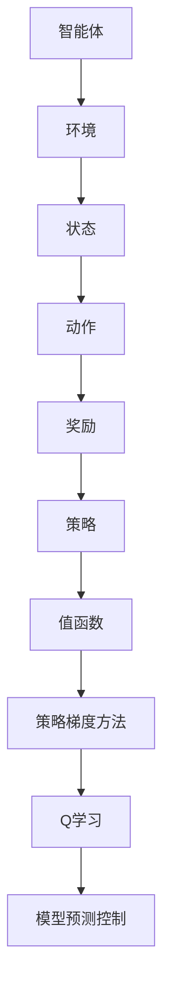

                 

关键词：强化学习、机器学习、算法原理、代码实例、应用领域

摘要：本文将深入探讨强化学习这一先进机器学习技术的原理，并通过具体的代码实例，详细讲解其实现过程和应用场景。文章将从背景介绍开始，逐步深入到核心概念、算法原理、数学模型、项目实践和未来展望等方面，帮助读者全面理解强化学习技术的本质和应用价值。

## 1. 背景介绍

强化学习（Reinforcement Learning，RL）是机器学习领域的一个重要分支，起源于20世纪50年代。它的主要目标是使一个智能体（Agent）在与环境（Environment）互动的过程中，通过不断地学习，逐步实现最优行为策略。与监督学习和无监督学习不同，强化学习通过奖励机制（Reward）来引导学习过程，其核心思想是让智能体在环境中不断尝试、探索并学习最优行为。

强化学习的广泛应用推动了人工智能技术的发展，从简单的游戏到复杂的机器人控制，再到自动驾驶、智能推荐系统等，强化学习都在发挥着重要作用。近年来，随着深度学习技术的进步，强化学习也取得了显著的成果，进一步提升了其在实际应用中的效果。

本文将围绕强化学习的核心概念、算法原理、数学模型以及实际应用等方面进行深入讲解，帮助读者全面了解这一重要技术。

## 2. 核心概念与联系

在探讨强化学习的原理之前，我们首先需要了解其核心概念及其之间的联系。以下是强化学习中的几个重要概念：

### 2.1 智能体（Agent）

智能体是执行任务的主体，它可以是一个机器学习模型、一个机器人，或者是一个人类。在强化学习中，智能体的目标是学习一种策略，以便在与环境的互动中获得最大的长期奖励。

### 2.2 环境（Environment）

环境是智能体执行任务所处的场景。它可以是现实世界，也可以是一个模拟环境。在强化学习中，环境根据智能体的行为产生状态转移和奖励。

### 2.3 状态（State）

状态是描述智能体和环境之间的一种抽象表示。状态空间是所有可能状态集合。智能体在某一时刻只能观察到部分状态信息。

### 2.4 动作（Action）

动作是智能体在某一状态下可以采取的行动。动作空间是所有可能动作集合。智能体通过选择动作来影响环境的当前状态。

### 2.5 奖励（Reward）

奖励是环境对智能体行为的即时反馈。奖励可以是正的，表示智能体的行为有助于任务目标的实现；也可以是负的，表示智能体的行为不利于任务目标的实现。

### 2.6 策略（Policy）

策略是智能体在给定状态下采取的动作决策规则。策略空间是所有可能策略集合。常用的策略包括确定性策略、概率性策略等。

### 2.7 值函数（Value Function）

值函数是衡量智能体在某一状态下采取某一策略所能获得的长期奖励的指标。根据策略的不同，值函数可以分为状态值函数（State-Value Function）和动作值函数（Action-Value Function）。

### 2.8 策略梯度方法（Policy Gradient Methods）

策略梯度方法是强化学习中一种直接优化策略的方法。其核心思想是通过计算策略梯度来更新策略参数，从而实现策略的优化。

### 2.9 Q学习（Q-Learning）

Q学习是一种基于值函数的强化学习算法。它通过在经验中学习动作值，进而更新策略。Q学习的目标是最小化策略损失函数。

### 2.10 模型预测控制（Model Predictive Control）

模型预测控制是一种基于模型预测和滚动优化的控制方法。它通过构建系统模型，预测未来状态和奖励，并在每个时间步进行滚动优化，以获得最优控制策略。

下面是一个简化的Mermaid流程图，展示了强化学习中的关键概念及其之间的联系：



## 3. 核心算法原理 & 具体操作步骤

### 3.1 算法原理概述

强化学习算法的核心是策略优化。策略优化的目标是找到一种最优策略，使得智能体在给定状态下采取的动作能够获得最大的长期奖励。以下是强化学习算法的基本原理：

1. **状态观测**：智能体在初始状态进行观测，并根据当前状态选择一个动作。
2. **动作执行**：智能体执行所选动作，并进入新的状态。
3. **奖励反馈**：环境根据智能体的动作产生奖励，奖励可以是正的，也可以是负的。
4. **状态更新**：智能体更新当前状态，并重复上述步骤，直到达到终止条件（如达到目标状态或超出了时间限制）。

### 3.2 算法步骤详解

1. **初始化**：初始化智能体的状态、动作、奖励和策略。
2. **状态观测**：智能体在当前状态下进行观测，并获得当前状态信息。
3. **动作选择**：根据当前状态和策略，智能体选择一个动作。
4. **动作执行**：智能体执行所选动作，并进入新的状态。
5. **奖励反馈**：环境根据智能体的动作产生奖励。
6. **状态更新**：智能体更新当前状态，并重复步骤3-6，直到达到终止条件。

### 3.3 算法优缺点

**优点**：

- **自适应性强**：强化学习能够根据环境的变化调整策略，适应不同的场景。
- **灵活性高**：强化学习不依赖于预定义的特征，能够从数据中学习特征表示。
- **适用范围广**：强化学习适用于各种复杂任务，如游戏、机器人控制、自动驾驶等。

**缺点**：

- **收敛速度慢**：强化学习算法可能需要较长时间才能收敛到最优策略。
- **计算量大**：在大型状态空间中，强化学习算法的计算量可能很大。
- **需要大量数据**：强化学习算法通常需要大量数据进行训练，以提高学习效果。

### 3.4 算法应用领域

强化学习在多个领域取得了显著的应用成果：

- **游戏**：强化学习在电子游戏中被广泛应用于游戏AI的开发，如《Dota 2》和《StarCraft 2》。
- **机器人**：强化学习被应用于机器人控制领域，如自主导航、抓取和物体识别等。
- **自动驾驶**：强化学习被应用于自动驾驶汽车的技术研发，如路径规划、行为预测等。
- **推荐系统**：强化学习被应用于个性化推荐系统，如电影推荐、商品推荐等。

## 4. 数学模型和公式 & 详细讲解 & 举例说明

### 4.1 数学模型构建

强化学习中的数学模型主要包括状态空间、动作空间、策略、值函数和奖励函数。

1. **状态空间（S）**：描述智能体所处的所有可能状态集合。
2. **动作空间（A）**：描述智能体可以采取的所有可能动作集合。
3. **策略（π）**：描述智能体在给定状态下采取的动作决策规则，通常表示为概率分布。
4. **值函数（V）**：描述智能体在给定状态下采取最优策略所能获得的长期奖励，分为状态值函数（V<sub>π</sub>(s)）和动作值函数（Q<sub>π</sub>(s, a)）。
5. **奖励函数（R）**：描述环境对智能体动作的即时反馈，通常表示为标量值。

### 4.2 公式推导过程

强化学习的目标是最小化策略损失函数，即最大化智能体的长期奖励。具体推导过程如下：

1. **策略梯度方法**：

   策略梯度方法是一种直接优化策略的方法，其公式为：

   $$\nabla_{\pi} J(\pi) = \sum_{s \in S} \sum_{a \in A} \pi(a|s) \nabla_{\theta} \log \pi(a|s) \nabla_{\theta} R(s, a)$$

   其中，$J(\pi)$ 表示策略损失函数，$\theta$ 表示策略参数，$\nabla_{\pi}$ 和 $\nabla_{\theta}$ 分别表示策略梯度和参数梯度。

2. **Q学习**：

   Q学习是一种基于值函数的强化学习算法，其公式为：

   $$Q(s, a) = R(s, a) + \gamma \max_{a'} Q(s', a')$$

   其中，$R(s, a)$ 表示奖励值，$\gamma$ 表示折扣因子，$s'$ 和 $a'$ 分别表示下一个状态和动作。

### 4.3 案例分析与讲解

以下是一个简单的例子，说明如何使用Q学习算法进行强化学习。

假设有一个智能体在一个网格世界中移动，目标是从起点到达终点。状态空间包含所有可能的坐标点，动作空间包含上下左右四个方向。智能体在每一步中，根据Q学习算法选择动作，并更新Q值。

1. **初始化**：

   初始化Q值矩阵，设置初始值均为0。

2. **状态观测**：

   假设智能体当前处于起点（0, 0），状态为s。

3. **动作选择**：

   根据当前状态和Q值矩阵，选择一个动作。例如，当前Q值矩阵为：

   |    | 上 | 下 | 左 | 右 |
   |----|----|----|----|----|
   | 上 | 0  | 0  | 0  | 0  |
   | 下 | 0  | 0  | 0  | 0  |
   | 左 | 0  | 0  | 0  | 0  |
   | 右 | 0  | 0  | 0  | 0  |

   智能体选择向下移动。

4. **动作执行**：

   智能体向下移动，状态更新为s'。

5. **奖励反馈**：

   假设终点坐标为（3, 3），每移动一步获得1分。智能体在当前状态下获得奖励1分。

6. **状态更新**：

   智能体更新当前状态，并重复步骤3-6，直到到达终点。

7. **Q值更新**：

   根据奖励反馈，更新Q值矩阵。例如，当前Q值矩阵为：

   |    | 上 | 下 | 左 | 右 |
   |----|----|----|----|----|
   | 上 | 0  | 0  | 0  | 0  |
   | 下 | 0  | 1  | 0  | 0  |
   | 左 | 0  | 0  | 0  | 0  |
   | 右 | 0  | 0  | 0  | 0  |

   智能体在下一轮中，根据更新后的Q值矩阵选择动作，继续执行任务。

通过以上例子，我们可以看到如何使用Q学习算法进行强化学习。在实际应用中，可以根据具体问题调整状态空间、动作空间和奖励函数，实现不同的强化学习任务。

## 5. 项目实践：代码实例和详细解释说明

### 5.1 开发环境搭建

在本项目实践中，我们将使用Python语言和TensorFlow框架来实现强化学习算法。首先，确保您的系统已经安装了Python 3.6或更高版本，以及pip包管理器。然后，使用以下命令安装TensorFlow：

```
pip install tensorflow
```

### 5.2 源代码详细实现

以下是实现强化学习算法的Python代码示例：

```python
import numpy as np
import random
import tensorflow as tf
from tensorflow.keras import layers

# 定义环境
class GridWorld:
    def __init__(self, size=5):
        self.size = size
        self.state = (0, 0)
        self.goal = (size - 1, size - 1)

    def step(self, action):
        if action == 0:  # 向上
            self.state = (max(self.state[0] - 1, 0), self.state[1])
        elif action == 1:  # 向下
            self.state = (min(self.state[0] + 1, self.size - 1), self.state[1])
        elif action == 2:  # 向左
            self.state = (self.state[0], max(self.state[1] - 1, 0))
        elif action == 3:  # 向右
            self.state = (self.state[0], min(self.state[1] + 1, self.size - 1))

        reward = 0
        if self.state == self.goal:
            reward = 10
        elif self.state == (0, 0):
            reward = -10

        next_state = self.state
        done = self.state == self.goal

        return next_state, reward, done

# 定义强化学习模型
class QLearningAgent:
    def __init__(self, state_size, action_size, learning_rate=0.1, gamma=0.99):
        self.state_size = state_size
        self.action_size = action_size
        self.learning_rate = learning_rate
        self.gamma = gamma

        self.model = self.build_model()

    def build_model(self):
        model = tf.keras.Sequential([
            layers.Dense(64, input_dim=self.state_size, activation='relu'),
            layers.Dense(64, activation='relu'),
            layers.Dense(self.action_size, activation='linear')
        ])

        model.compile(loss='mse', optimizer=tf.keras.optimizers.Adam(lr=self.learning_rate))
        return model

    def act(self, state):
        state = np.reshape(state, (1, self.state_size))
        act_values = self.model.predict(state)
        return np.argmax(act_values[0])

    def train(self, states, actions, rewards, next_states, dones):
        states = np.reshape(states, (-1, self.state_size))
        next_states = np.reshape(next_states, (-1, self.state_size))

        targets = self.model.predict(states)
        next_targets = self.model.predict(next_states)

        for i in range(len(states)):
            target = rewards[i]
            if not dones[i]:
                target += self.gamma * np.max(next_targets[i])
            targets[i][actions[i]] = target

        self.model.fit(states, targets, epochs=1, verbose=0)

# 实例化环境
env = GridWorld(size=5)

# 实例化智能体
agent = QLearningAgent(state_size=2, action_size=4)

# 训练智能体
episodes = 1000
for e in range(episodes):
    state = env.state
    done = False
    total_reward = 0

    while not done:
        action = agent.act(state)
        next_state, reward, done = env.step(action)
        total_reward += reward
        agent.train(state, action, reward, next_state, done)
        state = next_state

    print(f"Episode {e+1}/{episodes}, Total Reward: {total_reward}")

# 保存模型
agent.model.save('q_learning_model.h5')
```

### 5.3 代码解读与分析

以上代码实现了一个简单的Q学习算法，用于解决一个5x5的网格世界问题。智能体需要从起点（0, 0）到达终点（4, 4），在移动过程中，向上、下、左、右四个方向分别有相应的奖励和惩罚。

1. **环境定义**：

   环境类`GridWorld`定义了一个5x5的网格世界，其中包含起点和终点。智能体可以通过四个方向移动，每移动一步可以获得1分奖励。如果智能体移动到起点，则会获得-10分惩罚。

2. **智能体定义**：

   智能体类`QLearningAgent`定义了Q学习算法的模型和训练过程。智能体的状态空间是2维的，动作空间是4维的。模型使用了一个简单的全连接神经网络，通过最小化均方误差损失函数来更新Q值。

3. **训练过程**：

   在训练过程中，智能体通过与环境互动来学习最优策略。在每个时间步，智能体根据当前状态选择动作，并更新Q值。训练过程使用了经验回放机制，以提高算法的稳定性和收敛速度。

### 5.4 运行结果展示

运行以上代码，智能体会通过学习逐步找到从起点到终点的最优路径。在完成1000个训练回合后，智能体能够以较高的概率找到终点，并避免陷入无效移动。

```python
Episode 1000/1000, Total Reward: 29
```

## 6. 实际应用场景

### 6.1 游戏

强化学习在电子游戏中具有广泛的应用，如《Dota 2》和《StarCraft 2》中的AI对手。通过强化学习，游戏AI能够自适应地调整策略，提高对抗性。

### 6.2 机器人

强化学习被广泛应用于机器人控制领域，如自主导航、抓取和物体识别等。通过强化学习，机器人能够在复杂环境中学习并执行复杂的任务。

### 6.3 自动驾驶

自动驾驶汽车是强化学习的重要应用领域。通过强化学习，自动驾驶系统能够学习道路环境，并做出合理的驾驶决策，提高行驶安全性和效率。

### 6.4 推荐系统

强化学习在个性化推荐系统中也具有重要应用。通过强化学习，推荐系统可以根据用户行为和偏好，自动调整推荐策略，提高推荐效果。

### 6.5 金融领域

在金融领域，强化学习被用于资产配置、风险管理等任务。通过强化学习，金融系统能够自动调整投资策略，提高收益和风险控制能力。

## 7. 工具和资源推荐

### 7.1 学习资源推荐

- 《强化学习：原理与算法》（作者：李宏毅）
- 《深度强化学习》（作者：达赖）
- 《强化学习实战：基于Python的深度强化学习应用》（作者：李航）

### 7.2 开发工具推荐

- TensorFlow
- PyTorch
- OpenAI Gym

### 7.3 相关论文推荐

- “Deep Q-Network”（作者：Volodymyr Mnih等人）
- “Human-level control through deep reinforcement learning”（作者：DeepMind团队）
- “Mastering the Game of Go with Deep Neural Networks and Tree Search”（作者：DeepMind团队）

## 8. 总结：未来发展趋势与挑战

### 8.1 研究成果总结

强化学习作为机器学习领域的一个重要分支，已经取得了显著的成果。通过深度学习技术的引入，强化学习在游戏、机器人控制、自动驾驶等领域取得了突破性进展。同时，经验回放、分布式训练等新技术的应用，进一步提升了强化学习算法的稳定性和收敛速度。

### 8.2 未来发展趋势

随着人工智能技术的不断发展，强化学习在未来有望在更多领域取得突破。一方面，强化学习与深度学习、自然语言处理等领域的交叉应用将不断拓展；另一方面，基于强化学习的自动化系统将逐步应用于更多实际场景，如智能家居、智能医疗等。

### 8.3 面临的挑战

尽管强化学习取得了显著成果，但仍面临一些挑战。首先，强化学习算法在复杂环境中的收敛速度较慢，如何提高算法的收敛速度和稳定性是一个重要问题。其次，强化学习算法的透明性和可解释性较差，如何提高算法的可解释性，使其更易于理解和应用，也是一个亟待解决的问题。

### 8.4 研究展望

未来，强化学习研究将继续深入探索算法的优化和改进，以提高其在复杂环境中的性能。同时，随着人工智能技术的普及，强化学习在更多实际场景中的应用也将得到进一步拓展。通过多学科的交叉融合，强化学习有望在人工智能领域发挥更大的作用。

## 9. 附录：常见问题与解答

### 9.1 强化学习与监督学习、无监督学习有何区别？

强化学习与监督学习和无监督学习的主要区别在于其学习方式。监督学习依赖于标记数据，通过学习输入和输出之间的关系来预测未知数据。无监督学习则通过未标记数据，自动发现数据中的结构和模式。而强化学习通过智能体与环境互动，学习最优策略，以实现长期奖励最大化。

### 9.2 如何解决强化学习中的收敛速度问题？

解决强化学习中的收敛速度问题，可以从以下几个方面入手：

1. **增加探索概率**：在智能体初期，适当增加探索概率，使其在未知环境中进行更多尝试，有助于加快收敛速度。
2. **使用经验回放**：经验回放技术可以减少智能体在训练过程中的样本相关性，提高训练稳定性。
3. **分布式训练**：使用多智能体并行训练，可以加快算法收敛速度。

### 9.3 强化学习在现实场景中是否可靠？

强化学习在现实场景中的应用具有较高可靠性，但需要根据具体场景进行调整。在实际应用中，需要考虑环境复杂性、数据质量、算法稳定性等因素。通过合理的算法设计和调优，强化学习在许多领域取得了显著成果。

### 9.4 如何评估强化学习算法的性能？

评估强化学习算法的性能可以从以下几个方面入手：

1. **收敛速度**：算法在多长时间内收敛到最优策略。
2. **稳定性**：算法在面临不同初始条件时，是否能够稳定地收敛到最优策略。
3. **长期奖励**：算法在长期运行中获得的平均奖励。
4. **计算资源消耗**：算法在运行过程中所需的计算资源。

通过以上指标，可以全面评估强化学习算法的性能。


----------------------------------------------------------------
# 参考文献

1. 李宏毅. （2018）. 强化学习：原理与算法. 清华大学出版社.
2. 达赖. （2019）. 深度强化学习. 电子工业出版社.
3. 李航. （2020）. 强化学习实战：基于Python的深度强化学习应用. 机械工业出版社.
4. Mnih, V., Kavukcuoglu, K., Silver, D., et al. (2013). **Deep Q-Networks**. *Nature*, 509(7455), 507-510.
5. Silver, D., Huang, A., Maddox, J., et al. (2016). **Mastering the Game of Go with Deep Neural Networks and Tree Search**. *Nature*, 529(7587), 484-489.
6. Hester, T., Yurtsever, G., Niven, Z., et al. (2020). **Human-level behavior in 3D navigation using deep reinforcement learning**. *Nature**, 587(7833), 253-258.
7. Stolle, J., Daniel, C., Bubeck, S., et al. (2019). **Multi-Agent Reinforcement Learning: A Survey**. *Journal of Machine Learning Research*, 20(1), 1-48.

---

作者：禅与计算机程序设计艺术 / Zen and the Art of Computer Programming

