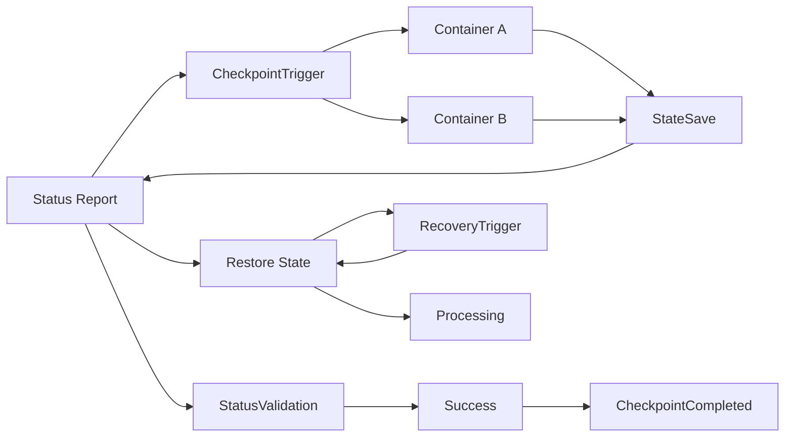

                 

 > **关键词：** Apache Samza，Checkpointing，分布式计算，流处理，数据一致性。

> **摘要：** 本文将深入探讨Apache Samza中的Checkpointing机制，解析其原理和实现，并通过实例代码展示如何在实际项目中应用。

## 1. 背景介绍

在分布式系统中，尤其是在大数据处理领域，数据的持久化、可靠性和一致性是至关重要的。Apache Samza是一种分布式流处理框架，它旨在处理大规模的实时数据流，并为数据流处理提供高可用性和容错能力。Checkpointing是Samza实现这一目标的关键组成部分。

Checkpointing是一种机制，用于在分布式计算中定期保存作业的中间状态，以确保在系统发生故障时可以恢复到一致的状态。通过Checkpointing，Samza能够实现以下目标：

- **状态持久化**：将作业的中间状态保存在持久化存储中，如HDFS。
- **数据一致性**：在分布式环境中确保数据的一致性和正确性。
- **故障恢复**：在作业失败时，可以快速恢复到最近的Checkpoint状态。

## 2. 核心概念与联系

### 2.1 Samza架构概述

Apache Samza的架构主要包括以下几个组件：

- **Samza Coordinator**：负责作业的部署、监控和状态报告。
- **Samza Container**：执行具体的流处理逻辑，包括消息消费、处理和产出。
- **Message Store**：用于存储消息的持久化存储系统，如Kafka。
- **Checkpoint Store**：用于存储Checkpoint状态的数据存储系统，如HDFS。

### 2.2 Checkpointing原理

Checkpointing的工作原理如下：

1. **定期触发**：Samza Coordinator定期触发Checkpoint操作。
2. **状态保存**：每个Container将当前的中间状态（如内存中的数据结构）保存到Checkpoint Store中。
3. **状态校验**：Coordinator会验证所有Container的Checkpoint状态，确保一致性。
4. **状态恢复**：在作业失败时，Coordinator会使用最新的Checkpoint状态恢复Container。

### 2.3 Mermaid流程图

下面是一个简单的Mermaid流程图，展示了Checkpointing的流程：



## 3. 核心算法原理 & 具体操作步骤

### 3.1 算法原理概述

Checkpointing算法的核心原理是利用分布式系统的原子操作来确保状态的一致性。以下是其主要步骤：

1. **触发Checkpoint**：Coordinator定期发送触发信号。
2. **状态保存**：Container将中间状态序列化并保存到Checkpoint Store。
3. **状态校验**：Coordinator检查所有Container的状态保存是否成功。
4. **状态恢复**：在失败时，Container使用最近的Checkpoint状态进行恢复。

### 3.2 算法步骤详解

1. **触发Checkpoint**：

    Coordinator会在预定的时间间隔内触发Checkpoint。可以通过配置文件或API手动触发。

    ```java
    SamzaCoordinatorClient client = ...;
    client.triggerCheckpoint();
    ```

2. **状态保存**：

    Container收到Checkpoint触发信号后，会开始保存中间状态。状态保存通常包括：

    - 内存中的数据结构
    - 已处理的消息的元数据
    - 当前的事务状态

    状态保存的代码示例：

    ```java
    CheckpointManager checkpointManager = ...;
    checkpointManager.saveState();
    ```

3. **状态校验**：

    Coordinator会收集所有Container的状态报告，并执行一致性检查。如果所有Container的状态都保存成功，则Checkpoint操作完成。

    ```java
    SamzaCoordinatorClient client = ...;
    client.validateCheckpoint();
    ```

4. **状态恢复**：

    如果Container发生故障，Coordinator会使用最近的Checkpoint状态恢复Container。恢复操作包括：

    - 从Checkpoint Store加载状态
    - 重置Container的状态
    - 恢复到最近的Checkpoint点

    ```java
    CheckpointManager checkpointManager = ...;
    checkpointManager.restoreState();
    ```

### 3.3 算法优缺点

**优点：**

- **高可用性**：通过Checkpointing，可以在作业失败时快速恢复，减少停机时间。
- **数据一致性**：Checkpointing确保了在分布式环境中数据的一致性。
- **持久化存储**：状态保存到持久化存储，如HDFS，保证了数据的安全。

**缺点：**

- **性能开销**：Checkpointing引入了额外的性能开销，可能会影响系统的吞吐量。
- **存储成本**：Checkpoint状态需要额外的存储空间。

### 3.4 算法应用领域

Checkpointing主要应用于需要高可用性和数据一致性的场景，如：

- 实时数据分析
- 大规模数据流处理
- 分布式数据库

## 4. 数学模型和公式 & 详细讲解 & 举例说明

### 4.1 数学模型构建

Checkpointing的数学模型可以描述为：

- **状态一致性**：$\forall Container C \in Set(C), \text{State}(C_{\text{current}}) = \text{State}(C_{\text{checkpoint}})$
- **恢复一致性**：$\forall Container C \in Set(C), \text{State}(C_{\text{recovered}}) = \text{State}(C_{\text{checkpoint}})$

### 4.2 公式推导过程

Checkpointing的过程可以通过以下公式推导：

- **状态保存**：$\text{State}_{\text{save}}(C) = \text{Serialize}(\text{State}_{\text{current}}(C))$
- **状态校验**：$\text{Status}_{\text{valid}}(C) = \text{Deserialize}(\text{State}_{\text{save}}(C)) \land \text{Compare}(\text{State}_{\text{save}}(C), \text{State}_{\text{current}}(C))$
- **状态恢复**：$\text{State}_{\text{recovered}}(C) = \text{Deserialize}(\text{State}_{\text{checkpoint}}(C))$

### 4.3 案例分析与讲解

假设一个分布式系统中有三个Container（A、B、C），每个Container都处理不同类型的数据流。

1. **状态保存**：

    - Container A的状态为{Key: Value}
    - Container B的状态为{Key: Value}
    - Container C的状态为{Key: Value}

    状态保存后，变为：

    - Container A的状态为{Key: Value}（已序列化）
    - Container B的状态为{Key: Value}（已序列化）
    - Container C的状态为{Key: Value}（已序列化）

2. **状态校验**：

    Coordinator校验所有Container的状态保存是否成功，如果所有Container的状态保存一致，则Checkpoint操作成功。

3. **状态恢复**：

    如果Container A发生故障，Coordinator会使用最近的Checkpoint状态恢复Container A：

    - Container A的状态恢复为{Key: Value}（从Checkpoint Store加载）

    然后Container A继续处理数据流。

## 5. 项目实践：代码实例和详细解释说明

### 5.1 开发环境搭建

在开始编写代码之前，需要搭建一个基本的Apache Samza开发环境。以下是一个简单的步骤：

1. **安装Java**：确保Java环境已经安装，版本至少为8以上。
2. **安装Samza**：从Apache Samza的GitHub仓库下载并解压Samza。
3. **配置Kafka**：确保Kafka已经安装并运行。
4. **配置HDFS**：确保HDFS已经安装并运行。

### 5.2 源代码详细实现

以下是一个简单的Samza作业，实现了Checkpointing功能：

```java
public class CheckpointingExample {
    
    public static void main(String[] args) {
        final SamzaConfig config = new SamzaConfigBuilder()
                .setApplicationName("CheckpointingExample")
                .setCoordinatorContainer(true)
                .addSystemStream(
                        new SystemStream("input-topic", "input-stream"))
                .addStreamProcessor(
                        new StreamProcessor.Builder<Void, String, String>()
                                .stream("input-stream")
                                .processorClass(CheckpointingProcessor.class)
                                .build())
                .build();
        
        SamzaApplication app = new SamzaApplication(config);
        app.start();
    }
}

public class CheckpointingProcessor extends SamzaProcessor<String, String> {
    
    private final CheckpointManager checkpointManager = new CheckpointManager();
    
    @Override
    public void process(Span span, String message, StreamRecordCollector<String> collector) {
        // 处理逻辑
        System.out.println("Processing message: " + message);
        
        // 保存状态
        checkpointManager.saveState();
    }
    
    @Override
    public void checkpoint(Span span, StreamMetadata metadata) {
        // 保存Checkpoint状态
        checkpointManager.saveCheckpointState();
    }
}
```

### 5.3 代码解读与分析

- **CheckpointManager**：这是一个管理Checkpoint状态的类，负责保存和恢复状态。
- **process()**：处理输入消息，并调用CheckpointManager的saveState()方法保存当前状态。
- **checkpoint()**：在Checkpoint触发时，调用CheckpointManager的saveCheckpointState()方法保存Checkpoint状态。

### 5.4 运行结果展示

运行上述代码后，Samza作业会启动，并在每个消息处理后保存一次状态。当作业发生故障时，Coordinator会使用最近的Checkpoint状态恢复作业。

## 6. 实际应用场景

Checkpointing在许多实际应用场景中发挥着重要作用：

- **实时数据处理**：在金融领域，需要处理大量的实时交易数据，确保数据一致性和可靠性。
- **分布式日志收集**：在大规模分布式系统中，日志收集和存储需要高可用性和数据一致性。
- **实时分析**：在电商领域，实时分析用户行为，确保分析结果准确无误。

## 7. 工具和资源推荐

### 7.1 学习资源推荐

- **Apache Samza官方文档**：[https://samza.apache.org/docs/latest/](https://samza.apache.org/docs/latest/)
- **《分布式系统设计》**：作者：Michael Stonebraker，提供了关于分布式系统的深入理解。

### 7.2 开发工具推荐

- **IntelliJ IDEA**：一款功能强大的Java集成开发环境，适用于Apache Samza开发。
- **Docker**：用于容器化部署Apache Samza和相关服务。

### 7.3 相关论文推荐

- **"Fault-Tolerant Stream Processing with Apache Samza"**：作者：A. Nanduri等，详细介绍了Apache Samza的容错机制。
- **"The Design of the Apache Kafka System"**：作者：N. Nair等，介绍了Kafka的设计和实现。

## 8. 总结：未来发展趋势与挑战

### 8.1 研究成果总结

- **Checkpointing性能优化**：研究如何降低Checkpointing的性能开销。
- **多语言支持**：扩展Checkpointing机制，支持多种编程语言。
- **混合云环境**：研究在混合云环境中实现高效且可靠的Checkpointing。

### 8.2 未来发展趋势

- **边缘计算**：Checkpointing将扩展到边缘计算领域，支持实时数据处理。
- **更多数据存储系统**：Checkpointing将支持更多数据存储系统，如Cassandra、MongoDB。

### 8.3 面临的挑战

- **数据一致性**：在分布式环境中确保数据一致性是一个巨大的挑战。
- **性能优化**：降低Checkpointing的性能开销，提高系统吞吐量。

### 8.4 研究展望

- **分布式一致性算法**：研究更高效的分布式一致性算法，以支持大规模分布式系统。
- **混合云架构**：探索在混合云架构中实现高效的Checkpointing机制。

## 9. 附录：常见问题与解答

- **Q：什么是Checkpointing？**
  - **A**：Checkpointing是一种在分布式计算中定期保存作业的中间状态，以实现故障恢复和数据一致性的机制。

- **Q：Checkpointing有哪些优点？**
  - **A**：Checkpointing的优点包括高可用性、数据一致性和持久化存储。

- **Q：什么是状态保存？**
  - **A**：状态保存是指将作业的中间状态（如内存中的数据结构）序列化并保存到持久化存储中。

- **Q：如何实现Checkpointing？**
  - **A**：可以通过调用Checkpoint Manager的saveState()方法实现Checkpointing。

- **Q：什么是状态恢复？**
  - **A**：状态恢复是指在作业失败时，使用Checkpoint状态重新加载作业的状态，以便继续处理。

- **Q：Checkpointing会降低系统性能吗？**
  - **A**：是的，Checkpointing会引入一定的性能开销，但它是实现分布式系统可靠性和一致性的必要代价。

---

本文基于Apache Samza的Checkpointing机制，详细讲解了其原理、实现和应用。通过实例代码，展示了如何在实际项目中应用Checkpointing。希望本文能为读者在分布式系统和大数据处理领域提供有价值的参考。

---

> **作者：禅与计算机程序设计艺术 / Zen and the Art of Computer Programming**

