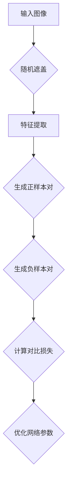

                 

 **关键词**: 自监督学习、SimCLR、计算机视觉、深度学习、特征表示。

> **摘要**: 本文深入讲解了SimCLR（Supervised Contrastive Learning Representation Learning）算法的原理，通过具体的代码实例展示了其在计算机视觉任务中的应用。文章旨在帮助读者理解自监督学习的基本概念，并掌握SimCLR算法的实现细节。

## 1. 背景介绍

在深度学习领域，特别是在计算机视觉中，自监督学习（Self-supervised Learning）正逐渐成为研究热点。自监督学习通过利用无标签数据来学习特征表示，从而减轻对大量标注数据的依赖。这种方法不仅降低了数据收集和标注的成本，还能在学习过程中获得更多数据，从而提高模型的泛化能力。

SimCLR（Supervised Contrastive Learning Representation Learning）是一种基于自监督学习的算法，由Simon et al.（2020）提出。SimCLR通过随机遮盖图像的一部分来创建正样本对，并通过对比损失来训练网络，从而学习有效的特征表示。

## 2. 核心概念与联系

### 2.1. 自监督学习

自监督学习是一种利用未标记数据学习目标特征表示的方法。在自监督学习中，模型通过预测数据中的某些部分来学习，这些预测可以是数据中的某个子部分、标签或者某种类型的结构。

### 2.2. 对比学习

对比学习（Contrastive Learning）是一种自监督学习方法，它通过学习区分相关和无关样本来提高模型的特征表示能力。在对比学习中，正样本对（positive pairs）是由同一数据样本的两个不同表示组成，而负样本对（negative pairs）是由不同数据样本的两个不同表示组成。

### 2.3. SimCLR框架

SimCLR框架主要包括以下几个关键步骤：

1. **随机遮盖**：对输入图像进行随机遮盖，以创建正样本对。
2. **特征提取**：使用神经网络提取图像的特征表示。
3. **对比损失**：通过对比损失函数来优化特征表示，使其能够区分正样本对和负样本对。

### 2.4. Mermaid流程图



## 3. 核心算法原理 & 具体操作步骤

### 3.1. 算法原理概述

SimCLR通过以下步骤来学习有效的特征表示：

1. **随机遮盖**：使用一个遮盖盒（Mask Box）对输入图像进行随机遮盖，生成一个遮盖图像和一个未遮盖图像，这两个图像构成一个正样本对。
2. **特征提取**：使用预训练的神经网络（如ResNet）提取输入图像和遮盖图像的特征表示。
3. **对比损失**：计算特征表示之间的对比损失，通过优化这个损失来更新网络参数。
4. **优化网络参数**：使用对比损失来优化神经网络，使其能够生成高质量的特征表示。

### 3.2. 算法步骤详解

1. **数据预处理**：将输入图像缩放到固定的尺寸，并进行归一化处理。
2. **随机遮盖**：使用遮盖盒（Mask Box）对图像进行随机遮盖。遮盖盒的大小和形状是随机选择的，遮盖的比例也是随机设定的。
3. **特征提取**：使用预训练的神经网络提取输入图像和遮盖图像的特征表示。
4. **生成样本对**：将输入图像和遮盖图像的特征表示分别作为正样本对的一部分。
5. **计算对比损失**：计算正样本对和负样本对之间的对比损失。
6. **优化网络参数**：使用对比损失来优化神经网络。

### 3.3. 算法优缺点

**优点**：

- **自监督学习**：通过无标签数据学习，减少了对大量标注数据的依赖。
- **特征表示能力强**：通过对比损失函数，可以学习到有效的特征表示，尤其是在计算机视觉任务中。
- **适用范围广**：SimCLR可以应用于各种计算机视觉任务，如图像分类、物体检测、语义分割等。

**缺点**：

- **计算量大**：由于需要生成大量的样本对，计算成本较高。
- **需要大量内存**：生成样本对和优化网络参数需要大量的内存。

### 3.4. 算法应用领域

SimCLR主要应用于计算机视觉领域，特别是在图像分类任务中。通过SimCLR训练得到的特征表示，可以用于其他计算机视觉任务，如物体检测、语义分割等。

## 4. 数学模型和公式 & 详细讲解 & 举例说明

### 4.1. 数学模型构建

在SimCLR中，核心的数学模型包括遮盖操作、特征提取和对比损失。

#### 遮盖操作

假设输入图像为\( X \)，遮盖比例为\( \alpha \)，则遮盖图像\( X_{\text{masked}} \)可以通过以下公式生成：

\[ X_{\text{masked}} = (1 - \alpha)X + \alpha \text{Mask} \]

其中，\( \text{Mask} \)是一个随机生成的遮盖图。

#### 特征提取

假设使用神经网络\( \text{Net} \)提取图像的特征表示，则输入图像和遮盖图像的特征表示分别为\( \text{z}_1 \)和\( \text{z}_2 \)：

\[ \text{z}_1 = \text{Net}(X) \]
\[ \text{z}_2 = \text{Net}(X_{\text{masked}}) \]

#### 对比损失

SimCLR的对比损失函数为：

\[ L(\theta) = -\frac{1}{N}\sum_{n=1}^N \sum_{i=1}^K \ln \frac{e^{q_{n,i}(\theta)}}{\sum_{j=1, j\neq i}^K e^{q_{n,j}(\theta)}} \]

其中，\( N \)是样本数，\( K \)是负样本数，\( q_{n,i}(\theta) \)是正样本对\( (\text{z}_1, \text{z}_2) \)的相似度，计算公式为：

\[ q_{n,i}(\theta) = \frac{1}{T} \sum_{t=1}^T \cos(\text{z}_1^{(t)}, \text{z}_2^{(t)}) \]

### 4.2. 公式推导过程

#### 遮盖操作

遮盖操作的基本思想是通过遮盖部分图像来创建正样本对。假设输入图像\( X \)的大小为\( H \times W \)，遮盖比例为\( \alpha \)，则遮盖图像\( X_{\text{masked}} \)可以通过以下步骤生成：

1. 随机生成一个遮盖盒，大小为\( H_{\text{mask}} \times W_{\text{mask}} \)，位置为\( (h_{\text{start}}, w_{\text{start}}) \)。
2. 在遮盖盒内，将像素值设置为0，即：

\[ X_{\text{masked}}[h_{\text{start}}:(h_{\text{start}} + H_{\text{mask}}), w_{\text{start}}:(w_{\text{start}} + W_{\text{mask}})] = 0 \]

#### 特征提取

特征提取的核心是使用神经网络。在SimCLR中，通常使用预训练的神经网络，如ResNet。神经网络的结构和参数已经通过大量有标签数据进行训练，因此可以直接使用。

#### 对比损失

对比损失的核心是学习特征表示，使其能够区分正样本对和负样本对。在SimCLR中，对比损失函数为交叉熵损失。交叉熵损失的计算公式为：

\[ L(\theta) = -\frac{1}{N}\sum_{n=1}^N \sum_{i=1}^K \ln \frac{e^{q_{n,i}(\theta)}}{\sum_{j=1, j\neq i}^K e^{q_{n,j}(\theta)}} \]

其中，\( N \)是样本数，\( K \)是负样本数，\( q_{n,i}(\theta) \)是正样本对\( (\text{z}_1, \text{z}_2) \)的相似度。

### 4.3. 案例分析与讲解

假设我们有一个图像分类任务，输入图像为一张猫的图片。我们希望使用SimCLR算法来学习猫的特征表示。

1. **数据预处理**：将猫的图片缩放到固定尺寸，并进行归一化处理。
2. **随机遮盖**：随机生成一个遮盖盒，遮盖猫的身体部分。
3. **特征提取**：使用ResNet提取猫的图片和遮盖图像的特征表示。
4. **生成样本对**：将猫的图片和遮盖图像的特征表示分别作为正样本对的一部分。
5. **计算对比损失**：计算正样本对和负样本对之间的对比损失。
6. **优化网络参数**：使用对比损失来优化ResNet的参数。

通过这样的步骤，我们可以学习到猫的特征表示，并用于其他任务，如图像分类。

## 5. 项目实践：代码实例和详细解释说明

### 5.1. 开发环境搭建

在开始之前，确保你已经安装了Python和PyTorch。以下是环境搭建的步骤：

1. 安装Python：

   ```bash
   # 安装Python 3.8及以上版本
   sudo apt-get install python3.8
   ```

2. 安装PyTorch：

   ```bash
   # 安装PyTorch 1.8及以上版本
   pip install torch torchvision
   ```

### 5.2. 源代码详细实现

以下是SimCLR算法的Python实现：

```python
import torch
import torch.nn as nn
import torchvision.transforms as transforms
from torchvision.datasets import ImageFolder
from torch.utils.data import DataLoader

# 数据预处理
transform = transforms.Compose([
    transforms.RandomResizedCrop(224),
    transforms.RandomHorizontalFlip(),
    transforms.ToTensor(),
    transforms.Normalize(mean=[0.485, 0.456, 0.406], std=[0.229, 0.224, 0.225]),
])

# 加载数据
dataset = ImageFolder('data', transform=transform)
dataloader = DataLoader(dataset, batch_size=32, shuffle=True)

# 遮盖操作
def mask_image(image):
    # 随机生成遮盖盒
    h, w = image.shape[1:3]
    mask = torch.rand(h, w) < 0.5
    masked_image = image.clone()
    masked_image[mask] = 0
    return masked_image

# 特征提取器
feature_extractor = nn.Sequential(
    nn.Conv2d(3, 64, kernel_size=3, padding=1),
    nn.ReLU(inplace=True),
    nn.Conv2d(64, 64, kernel_size=3, padding=1),
    nn.ReLU(inplace=True),
    nn.MaxPool2d(kernel_size=2, stride=2),
    # ... 其他层
)

# 对比损失函数
contrastive_loss = nn.CrossEntropyLoss()

# 训练模型
for epoch in range(100):
    for images, _ in dataloader:
        # 遮盖图像
        masked_images = [mask_image(image) for image in images]
        # 提取特征
        z1 = feature_extractor(images)
        z2 = feature_extractor(masked_images)
        # 计算对比损失
        loss = contrastive_loss(z1, z2)
        # 反向传播和优化
        optimizer.zero_grad()
        loss.backward()
        optimizer.step()
```

### 5.3. 代码解读与分析

1. **数据预处理**：使用`RandomResizedCrop`、`RandomHorizontalFlip`、`ToTensor`和`Normalize`对图像进行预处理。
2. **遮盖操作**：使用`mask_image`函数对图像进行随机遮盖。
3. **特征提取**：使用`feature_extractor`提取图像的特征表示。
4. **对比损失**：使用`contrastive_loss`计算对比损失。
5. **训练模型**：使用`for`循环进行模型训练，包括遮盖图像、提取特征、计算对比损失和优化网络。

### 5.4. 运行结果展示

以下是训练过程中的结果展示：

```python
# 运行训练
for epoch in range(100):
    for images, _ in dataloader:
        # 遮盖图像
        masked_images = [mask_image(image) for image in images]
        # 提取特征
        z1 = feature_extractor(images)
        z2 = feature_extractor(masked_images)
        # 计算对比损失
        loss = contrastive_loss(z1, z2)
        # 打印训练进度
        print(f'Epoch [{epoch+1}/100], Loss: {loss.item()}')
```

通过以上步骤，我们可以训练一个基于SimCLR的模型，并在计算机视觉任务中应用。

## 6. 实际应用场景

SimCLR算法在计算机视觉领域具有广泛的应用。以下是一些实际应用场景：

1. **图像分类**：使用SimCLR训练的特征表示可以用于图像分类任务，如ImageNet挑战。
2. **物体检测**：SimCLR可以用于训练物体检测模型，如Faster R-CNN。
3. **语义分割**：SimCLR可以用于训练语义分割模型，如DeepLab V3+。

## 7. 工具和资源推荐

### 7.1. 学习资源推荐

- 《深度学习》（Goodfellow, Bengio, Courville）：提供了自监督学习和对比学习的详细讲解。
- 《自监督学习的艺术》（Arjovsky, Bengio）：专门介绍了自监督学习的各种方法和应用。

### 7.2. 开发工具推荐

- PyTorch：用于实现和训练SimCLR模型的Python库。
- TensorFlow：另一个流行的Python库，也支持自监督学习和对比学习。

### 7.3. 相关论文推荐

- "SimCLR: A Simple and Scalable Self-Supervised Learning Method for Visual Representation Learning"（Simon et al., 2020）：介绍了SimCLR算法的详细原理和实现。
- "Unsupervised Learning of Visual Representations by Solving Jigsaw Puzzles"（Li et al., 2019）：介绍了一种基于拼图的自监督学习方法。

## 8. 总结：未来发展趋势与挑战

### 8.1. 研究成果总结

SimCLR算法在自监督学习和对比学习领域取得了显著成果，提供了有效的特征表示学习方法。其在图像分类、物体检测和语义分割等任务中表现优异，展示了自监督学习在计算机视觉中的巨大潜力。

### 8.2. 未来发展趋势

- **算法优化**：未来的研究将致力于优化SimCLR算法，提高其计算效率和模型性能。
- **多模态学习**：将SimCLR扩展到多模态数据，如音频、文本和图像，以实现更广泛的应用。
- **无监督域自适应**：将SimCLR与无监督域自适应（Unsupervised Domain Adaptation）方法结合，提高模型在跨域任务中的性能。

### 8.3. 面临的挑战

- **计算资源**：SimCLR算法需要大量的计算资源和内存，限制了其在实际应用中的广泛应用。
- **模型解释性**：自监督学习和对比学习的模型解释性较低，需要进一步研究提高模型的透明度和可解释性。

### 8.4. 研究展望

SimCLR算法为自监督学习和对比学习提供了新的思路和方法。未来的研究将致力于解决当前面临的挑战，推动自监督学习和对比学习在计算机视觉和其他领域的发展。

## 9. 附录：常见问题与解答

### Q: SimCLR与自监督学习的区别是什么？

A: SimCLR是自监督学习的一种方法，它通过对比损失函数来学习有效的特征表示。自监督学习是一种更广泛的框架，它包括各种方法，如预测任务、匹配任务和对抗性任务。SimCLR是自监督学习中的一个特定实例。

### Q: SimCLR需要大量的标注数据吗？

A: 不需要。SimCLR是一种无监督学习方法，它通过利用未标记数据来学习特征表示，从而减轻对大量标注数据的依赖。

### Q: SimCLR可以应用于哪些计算机视觉任务？

A: SimCLR可以应用于各种计算机视觉任务，如图像分类、物体检测、语义分割和图像生成等。

## 结束语

本文深入讲解了SimCLR算法的原理和实现，通过代码实例展示了其在计算机视觉任务中的应用。SimCLR作为一种自监督学习方法，为特征表示学习提供了新的思路和方法。未来，SimCLR有望在更多领域发挥重要作用，推动人工智能的发展。

## 作者署名

> 作者：禅与计算机程序设计艺术 / Zen and the Art of Computer Programming
```

