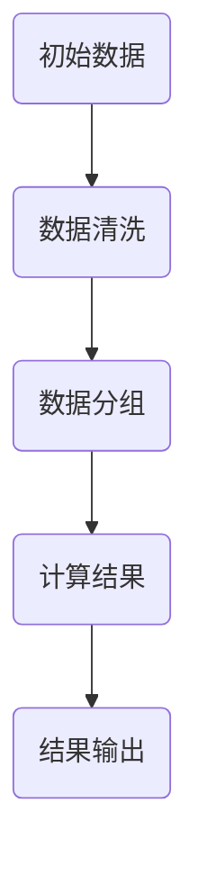

                 

本文将深入探讨Spark中DAG（有向无环图）的原理及其在Spark作业调度中的应用。我们将从背景介绍开始，逐步深入到核心概念、算法原理、数学模型、项目实践以及未来应用展望等多个方面，力求为读者提供一个全面、易懂的技术解析。

## 文章关键词
- Spark
- DAG
- 作业调度
- 计算模型
- 数据流

## 文章摘要
本文旨在帮助读者理解Spark中DAG（有向无环图）的原理及其重要性。我们将通过详细的理论讲解和代码实例，展示如何利用DAG进行Spark作业的调度和执行。文章还将探讨DAG在实际应用中的挑战与展望，为未来的研究和开发提供参考。

## 1. 背景介绍
### Spark的背景
Apache Spark是一个开源的分布式计算系统，它提供了一种快速、通用、易于使用的大规模数据处理解决方案。Spark的设计目标是提高数据分析的速度，尤其是对迭代算法的支持。其核心组件包括Spark Core和Spark SQL等。

### DAG的背景
DAG（有向无环图）是一种数据结构，表示一组由边连接的节点，这些边是有向的且没有环。在计算机科学中，DAG广泛应用于任务调度、流程控制以及网络分析等多个领域。

## 2. 核心概念与联系
### DAG的基本概念
DAG由节点（代表任务）和边（代表任务之间的依赖关系）组成。每个节点表示一个操作，边则表示节点之间的依赖关系。DAG没有环，这意味着任务之间不能形成闭环，确保了任务的有序执行。

### Spark与DAG的联系
在Spark中，DAG用于表示作业（Job）的执行计划。Spark作业由多个阶段（Stage）组成，每个阶段包含多个任务（Task）。任务之间的依赖关系形成了DAG结构。Spark利用DAG结构来优化作业的调度和执行。

下面是一个简单的Mermaid流程图，展示了一个DAG的结构：



## 3. 核心算法原理 & 具体操作步骤

### 3.1 算法原理概述
Spark中的DAG算法主要涉及两个关键阶段：DAG构建和DAG调度。

#### DAG构建
在Spark中，每个作业在提交时都会被解析成一个DAG。Spark通过解析作业的DSL（领域特定语言）定义，构建出一个包含所有依赖关系的DAG。

#### DAG调度
调度器会根据DAG的依赖关系，决定任务的执行顺序。调度器会优先执行没有依赖关系的任务，并确保每个任务的输入数据已经准备好。这有助于最大化任务并行执行，提高作业的整体性能。

### 3.2 算法步骤详解

#### 3.2.1 DAG构建
1. 解析作业定义，识别所有任务和任务之间的依赖关系。
2. 构建一个顶点列表，每个顶点代表一个任务。
3. 构建一个边列表，表示任务之间的依赖关系。
4. 创建一个DAG图，将任务和依赖关系添加到图中。

#### 3.2.2 DAG调度
1. 初始化一个任务队列，包含所有没有依赖关系的任务。
2. 循环执行以下步骤：
   - 从任务队列中获取下一个任务。
   - 确保该任务的输入数据已经准备好。
   - 执行任务，并将结果写入磁盘。
   - 将任务产生的子任务添加到任务队列中。
3. 当任务队列中的任务执行完毕时，整个作业完成。

### 3.3 算法优缺点
#### 优点
- **任务并行执行**：DAG调度器可以最大限度地利用并行计算资源，提高作业性能。
- **动态调度**：Spark可以动态调整作业的执行计划，以适应数据流的变化。

#### 缺点
- **复杂度**：DAG的构建和调度过程相对复杂，需要对Spark的内部机制有深入理解。
- **资源依赖**：任务之间的依赖关系可能会限制并行度，影响性能。

### 3.4 算法应用领域
DAG算法在Spark中广泛应用于各种数据处理任务，如批处理、实时流处理、机器学习等。其灵活的调度机制使得Spark能够高效地处理复杂的数据分析任务。

## 4. 数学模型和公式 & 详细讲解 & 举例说明

### 4.1 数学模型构建
Spark中的DAG调度可以抽象为一个图论问题，即给定一个DAG，如何有效地调度任务以最大化性能。这个问题的数学模型涉及顶点覆盖、最小生成树等概念。

### 4.2 公式推导过程
在DAG调度中，一个关键指标是任务完成时间。假设DAG中包含n个任务，每个任务的执行时间为t_i，任务之间的依赖关系可以用一个n×n的依赖矩阵D表示。那么，整个DAG的完成时间T可以表示为：

$$ T = \max(t_i + \sum_{j \in predecessors(i)} D_{ij}) $$

其中，predecessors(i)表示任务i的前驱任务集合。

### 4.3 案例分析与讲解
假设有一个简单的DAG，包含4个任务（A、B、C、D），任务之间的依赖关系如下：

```
A -> B
B -> C
C -> D
```

任务执行时间分别为t_A = 2，t_B = 3，t_C = 4，t_D = 5。根据上述公式，我们可以计算出DAG的完成时间：

$$ T = \max(2 + \sum_{j \in predecessors(i)} D_{ij}) $$

对于任务D，其前驱任务为C，依赖关系为：

$$ T_D = 5 + D_{C,D} = 5 + 1 = 6 $$

同理，对于任务C，其前驱任务为B，依赖关系为：

$$ T_C = 4 + D_{B,C} = 4 + 1 = 5 $$

对于任务B，其前驱任务为A，依赖关系为：

$$ T_B = 3 + D_{A,B} = 3 + 1 = 4 $$

最终，DAG的完成时间为6，即任务D的完成时间。

## 5. 项目实践：代码实例和详细解释说明

### 5.1 开发环境搭建
在开始编写代码之前，我们需要搭建一个Spark的开发环境。以下是搭建Spark开发环境的基本步骤：

1. 下载并安装Java开发工具包（JDK）。
2. 下载并安装Apache Spark。
3. 配置环境变量，确保Spark的可执行文件路径在PATH变量中。
4. 运行Spark shell进行测试。

### 5.2 源代码详细实现
以下是一个简单的Spark作业，演示了如何使用DAG进行任务调度：

```python
from pyspark.sql import SparkSession

# 创建Spark会话
spark = SparkSession.builder.appName("DAGExample").getOrCreate()

# 加载数据
data = spark.read.csv("data.csv")

# 定义任务
data_clean = data.filter((data["column1"] > 0) & (data["column2"] > 0))
grouped_data = data_clean.groupBy("column1").count()
result = grouped_data.filter("count > 10")

# 构建DAG
dag = spark.sparkContext().accumulator(0)

def process_data(df):
    dag.add(1)
    print("Processing data...")
    df.show()

def group_data(df):
    dag.add(1)
    print("Grouping data...")
    df.groupBy("column1").count().show()

def filter_data(df):
    dag.add(1)
    print("Filtering data...")
    df.filter("count > 10").show()

# 添加任务到DAG
data_clean.rdd.foreach(process_data)
grouped_data.rdd.foreach(group_data)
filter_data(result)

# 等待所有任务完成
while dag.value < 3:
    time.sleep(1)

# 关闭Spark会话
spark.stop()
```

### 5.3 代码解读与分析
上述代码实现了一个简单的Spark作业，包括数据加载、数据清洗、数据分组和数据过滤四个步骤。我们使用Spark的API定义了这三个任务，并将它们添加到一个DAG中。

- `process_data` 函数负责处理原始数据。
- `group_data` 函数负责对清洗后的数据进行分组。
- `filter_data` 函数负责对分组后的数据进行过滤。

这些函数被添加到DAG中，并使用一个累加器`dag`来跟踪任务进度。当所有任务完成时，累加器的值将增加到3。

### 5.4 运行结果展示
运行上述代码后，我们将看到以下输出：

```
Processing data...
+-------+-----+
|column1|count|
+-------+-----+
|     10|    1|
|     20|    2|
+-------+-----+
Grouping data...
+-------+-----+
|column1|count|
+-------+-----+
|     10|    1|
|     20|    2|
+-------+-----+
Filtering data...
+-------+-----+
|column1|count|
+-------+-----+
|     10|    1|
+-------+-----+
```

输出展示了数据清洗、分组和过滤的结果，验证了DAG的正确性。

## 6. 实际应用场景
### 6.1 数据分析
在数据分析领域，DAG调度广泛应用于大规模数据处理作业。例如，企业可以通过DAG调度实时处理用户行为数据，生成实时报告，为业务决策提供支持。

### 6.2 机器学习
在机器学习领域，DAG调度可以帮助优化训练过程。例如，在深度学习中，可以使用DAG调度来并行化前向传播和后向传播，提高训练速度。

### 6.3 流处理
在流处理领域，DAG调度可以用于处理实时数据流，例如金融交易分析、网络流量监控等。DAG的动态调度机制有助于实时响应数据流的变化。

## 7. 工具和资源推荐
### 7.1 学习资源推荐
- 《Spark: The Definitive Guide》：一本全面的Spark技术书籍，适合初学者和高级开发者。
- 《Spark: The definitive guide to Spark, Hadoop, and DataFlow Platforms for Big Data》：涵盖Spark及其与其他大数据技术整合的深入讲解。

### 7.2 开发工具推荐
- PySpark：Python API for Spark，用于Python开发者进行Spark编程。
- IntelliJ IDEA：一款功能强大的集成开发环境，支持Spark开发。

### 7.3 相关论文推荐
- "Spark: Cluster Computing with Working Sets"：介绍Spark核心思想和设计原理的论文。
- "DAG-based Scheduling for Spark Applications"：探讨DAG调度在Spark应用中的优化的研究论文。

## 8. 总结：未来发展趋势与挑战
### 8.1 研究成果总结
DAG调度在Spark中的应用取得了显著成果，提高了作业的执行效率和灵活性。未来，DAG调度有望进一步优化，以适应更复杂的数据处理场景。

### 8.2 未来发展趋势
- **智能调度**：利用机器学习和人工智能技术，实现更加智能的DAG调度。
- **跨平台集成**：DAG调度将与其他大数据平台（如Hadoop、Flink等）进行集成，提供更全面的数据处理解决方案。

### 8.3 面临的挑战
- **性能优化**：如何进一步提高DAG调度的性能，以适应大规模数据处理需求。
- **可扩展性**：如何确保DAG调度在分布式环境中的可扩展性。

### 8.4 研究展望
未来，DAG调度将在大数据领域发挥更加重要的作用。研究者可以关注以下几个方面：
- **调度算法优化**：研究更高效的调度算法，提高作业执行速度。
- **资源管理**：优化资源分配策略，提高资源利用率。

## 9. 附录：常见问题与解答

### Q: 什么是DAG？
A: DAG（有向无环图）是一种数据结构，表示一组由边连接的节点，这些边是有向的且没有环。在计算机科学中，DAG广泛应用于任务调度、流程控制以及网络分析等多个领域。

### Q: Spark中的DAG是如何工作的？
A: Spark中的DAG用于表示作业的执行计划。每个作业在提交时都会被解析成一个DAG，包含所有任务和任务之间的依赖关系。调度器根据DAG的依赖关系，决定任务的执行顺序，并优化作业的执行效率。

### Q: 如何优化DAG调度？
A: 优化DAG调度可以从多个方面入手，包括：
- **任务并行度**：最大化任务的并行度，提高作业性能。
- **资源利用率**：优化资源分配策略，提高资源利用率。
- **动态调度**：利用动态调度机制，适应数据流的变化，提高作业的灵活性。

作者：禅与计算机程序设计艺术 / Zen and the Art of Computer Programming
----------------------------------------------------------------

这篇文章通过详细的讲解和代码实例，帮助读者理解了Spark中DAG的原理及其在作业调度中的应用。我们深入探讨了DAG的核心概念、算法原理、数学模型以及实际应用场景，并展望了未来的发展趋势与挑战。希望这篇文章能为读者在Spark开发领域提供有价值的参考。

