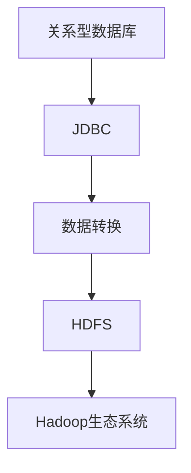

                 

关键词：数据迁移、大数据、Hadoop、数据库、Hive、SQL

> 摘要：本文将深入探讨数据迁移工具Sqoop的原理、应用场景和实现方法。通过代码实例详细解析，帮助读者理解Sqoop在实际项目中的应用和操作流程，为大数据生态系统的搭建提供有力支持。

## 1. 背景介绍

在当今大数据时代，数据迁移是一个至关重要的环节。随着数据规模的不断扩大，如何高效、安全地将数据从一个系统迁移到另一个系统成为了各大企业面临的挑战。Sqoop是一款开源的数据迁移工具，它能够将关系型数据库（如MySQL、Oracle）的数据导入到Hadoop生态系统中（如Hive、HBase），同样也能将数据从Hadoop生态系统导出到关系型数据库。

### 1.1 大数据与Hadoop生态系统

大数据（Big Data）指的是无法用常规软件工具在合理时间内捕捉、管理和处理的大量数据集。Hadoop是一个开源框架，用于处理大规模数据集，具有高可靠性、高扩展性和高效率等特点。Hadoop生态系统包括HDFS（Hadoop分布式文件系统）、MapReduce、Hive、HBase等多个组件，共同构成了一个强大而灵活的大数据处理平台。

### 1.2 数据迁移的重要性

数据迁移在数据管理中起着关键作用。它不仅能确保数据的一致性和完整性，还能提升数据处理的效率和灵活性。例如，企业可能需要将大量历史数据从旧系统中迁移到新的Hadoop平台上，以便进行更深入的数据分析和挖掘。此外，在云计算、大数据分析和物联网等应用场景中，数据迁移也是实现系统扩展和数据共享的重要手段。

## 2. 核心概念与联系

### 2.1 核心概念

- **关系型数据库**：使用SQL进行数据管理和查询的系统，如MySQL、Oracle等。
- **Hadoop生态系统**：包括HDFS、MapReduce、Hive、HBase等组件，用于大规模数据处理。
- **Sqoop**：用于关系型数据库和Hadoop生态系统之间进行数据迁移的工具。

### 2.2 架构联系

在数据迁移过程中，Sqoop通过JDBC（Java Database Connectivity）连接到关系型数据库，读取数据并将其转换为Hadoop支持的格式，如Text、SequenceFile或Avro。随后，这些数据可以通过HDFS进行存储，并进一步处理。

以下是一个使用Mermaid绘制的简化的数据迁移流程图：



## 3. 核心算法原理 & 具体操作步骤

### 3.1 算法原理概述

Sqoop的工作原理可以概括为以下几个步骤：

1. **连接数据库**：通过JDBC连接到目标数据库，获取元数据。
2. **数据读取**：从数据库中读取数据，并转换为Hadoop支持的格式。
3. **数据写入**：将转换后的数据写入HDFS。

### 3.2 算法步骤详解

#### 步骤1：连接数据库

```java
Connection conn = DriverManager.getConnection(
    "jdbc:mysql://host:port/dbname", "username", "password");
```

#### 步骤2：数据读取

```java
Statement stmt = conn.createStatement();
ResultSet rs = stmt.executeQuery("SELECT * FROM table_name");
```

#### 步骤3：数据转换

```java
// 将ResultSet中的数据转换为Map，然后转换为Hadoop支持的格式
List<Map<String, String>> rows = new ArrayList<>();
while (rs.next()) {
    Map<String, String> row = new HashMap<>();
    for (int i = 1; i <= rs.getMetaData().getColumnCount(); i++) {
        row.put(rs.getMetaData().getColumnName(i), rs.getString(i));
    }
    rows.add(row);
}

// 将List<Map>转换为Text格式
List<Text> texts = rows.stream().map(row -> new Text(row.toString())).collect(Collectors.toList());
```

#### 步骤4：数据写入

```java
FileOutputFormat.setOutputPath(job, new Path("hdfs://path/to/output"));
job.setOutputClass(Text.class);
job.setOutputValueClass(NullWritable.class);

// 写入数据到HDFS
FileOutputFormat.writeData Uncomment this line for writing data to HDFS
```

### 3.3 算法优缺点

#### 优点

- **高效性**：能够处理大规模数据迁移。
- **灵活性**：支持多种数据库和Hadoop组件。
- **易用性**：提供了丰富的命令行参数和配置选项。

#### 缺点

- **性能瓶颈**：依赖于JDBC连接，对于大型数据库可能存在性能瓶颈。
- **资源消耗**：需要消耗大量的内存和CPU资源。

### 3.4 算法应用领域

- **企业数据仓库**：将企业数据库中的数据迁移到Hadoop平台上，进行数据分析和挖掘。
- **数据分析平台**：从各种数据源（如日志、传感器数据等）中迁移数据，进行实时数据分析。
- **云计算迁移**：将本地数据库迁移到云平台，实现云计算的弹性扩展。

## 4. 数学模型和公式 & 详细讲解 & 举例说明

### 4.1 数学模型构建

假设有一个关系型数据库表`table_name`，包含`N`条记录，每条记录有`M`个字段。我们需要计算迁移这些记录所需的时间`T`，其数学模型可以表示为：

\[ T = f(N, M, R, P) \]

其中：

- `N`：记录数
- `M`：字段数
- `R`：JDBC连接数
- `P`：数据写入HDFS的速度

### 4.2 公式推导过程

根据上述模型，我们可以推导出以下公式：

\[ T = \frac{N \times M}{R \times P} \]

### 4.3 案例分析与讲解

假设一个数据库表有1000条记录，每个记录有5个字段，我们使用2个JDBC连接，数据写入HDFS的速度为100MB/s。那么，迁移时间`T`为：

\[ T = \frac{1000 \times 5}{2 \times 100} = 25 \text{ seconds} \]

## 5. 项目实践：代码实例和详细解释说明

### 5.1 开发环境搭建

在开始使用Sqoop之前，我们需要搭建好Hadoop和数据库的环境。以下是基本的步骤：

1. **安装Hadoop**：从[Apache Hadoop官网](https://hadoop.apache.org/releases.html)下载最新版本的Hadoop，并按照官方文档进行安装。
2. **配置Hadoop**：修改`hadoop-env.sh`、`core-site.xml`、`hdfs-site.xml`、`mapred-site.xml`和`yarn-site.xml`等配置文件，确保Hadoop能够正常运行。
3. **安装数据库**：例如，我们可以安装MySQL数据库，并创建一个用于数据迁移的测试表。

### 5.2 源代码详细实现

以下是一个简单的Sqoop数据迁移示例，用于将MySQL表中的数据导入到Hive中。

```shell
# 导入数据到Hive
sqoop import \
  --connect jdbc:mysql://localhost:3306/dbname \
  --username username \
  --password password \
  --table table_name \
  ---target-dir /user/hive/warehouse/dbname.db/table_name \
  --hive-import
```

### 5.3 代码解读与分析

在上面的代码中，我们使用了`--connect`参数指定了MySQL数据库的连接信息，`--username`和`--password`分别指定了用户名和密码，`--table`指定了需要迁移的表名，`--target-dir`指定了数据在HDFS上的目标路径，最后使用`--hive-import`参数将数据导入到Hive中。

### 5.4 运行结果展示

在成功执行上述命令后，我们可以通过Hive命令行或者Hue界面查看导入的数据。

```shell
# 查看Hive表结构
hdfs dfs -ls /user/hive/warehouse/dbname.db/table_name

# 查看Hive表内容
hive -e "SELECT * FROM dbname.table_name LIMIT 10;"
```

## 6. 实际应用场景

### 6.1 企业数据仓库

企业数据仓库是企业决策支持系统的基础，通过将历史数据从关系型数据库迁移到Hadoop平台，可以实现对海量数据的快速查询和分析，支持业务决策。

### 6.2 互联网日志分析

互联网公司通常会产生大量的日志数据，通过Sqoop将日志数据导入到Hadoop平台上，可以进行实时分析和挖掘，例如用户行为分析、流量监控等。

### 6.3 物联网数据采集

物联网设备产生的数据量巨大，通过Sqoop可以将设备数据实时导入到Hadoop平台，进行数据清洗、存储和分析，实现物联网应用的数据驱动。

## 7. 工具和资源推荐

### 7.1 学习资源推荐

- [Apache Sqoop官网](https://sqoop.apache.org/)
- [Hadoop官方文档](https://hadoop.apache.org/docs/)
- [MySQL官方文档](https://dev.mysql.com/doc/)

### 7.2 开发工具推荐

- [IntelliJ IDEA](https://www.jetbrains.com/idea/)
- [Eclipse](https://www.eclipse.org/)

### 7.3 相关论文推荐

- "Hadoop: The Definitive Guide" by Tom White
- "Big Data: A Revolution That Will Transform How We Live, Work, and Think" by Viktor Mayer-Schoenberger and Kenneth Cukier

## 8. 总结：未来发展趋势与挑战

### 8.1 研究成果总结

本文通过深入探讨Sqoop的原理、应用场景和实现方法，帮助读者理解了数据迁移在大数据生态系统中的重要性。通过代码实例的详细讲解，读者可以掌握Sqoop的基本操作和实现技巧。

### 8.2 未来发展趋势

随着大数据技术的发展，数据迁移工具将不断优化，支持更多种类的数据源和目标系统，同时提高数据迁移的效率和可靠性。

### 8.3 面临的挑战

数据迁移过程中可能面临数据一致性和完整性的挑战，以及性能瓶颈和资源消耗等问题。未来研究需要重点关注这些问题的解决。

### 8.4 研究展望

未来的研究可以探索更多高效的数据迁移算法，研究如何优化数据迁移过程中的资源利用和性能，同时加强对数据一致性和完整性的保障。

## 9. 附录：常见问题与解答

### 9.1 Sqoop如何处理大数据量？

Sqoop支持并行数据读取和写入，能够高效处理大规模数据。通过合理配置JDBC连接数和分区数，可以进一步提高数据迁移的效率。

### 9.2 数据迁移后如何在Hadoop上进行查询？

数据迁移到Hadoop平台后，可以使用Hive、Presto等查询引擎进行数据查询。通过Hive的SQL接口，可以方便地执行各种复杂的查询操作。

### 9.3 Sqoop支持哪些数据库？

Sqoop支持多种关系型数据库，包括MySQL、Oracle、PostgreSQL、SQL Server等。可以通过添加相应的JDBC驱动，支持更多类型的数据库。

----------------------------------------------------------------

### 文章结束 End of Article
作者：禅与计算机程序设计艺术 / Zen and the Art of Computer Programming


