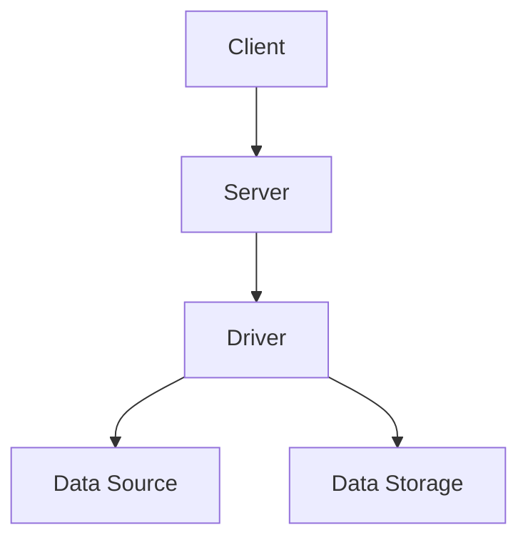

                 

 **关键词：** Sqoop，数据导入导出，Hadoop，大数据，数据迁移，ETL。

**摘要：** 本文将详细讲解 Sqoop 的导入导出原理，通过具体的代码实例分析 Sqoop 在大数据数据迁移中的应用，帮助读者深入了解 Sqoop 的使用方法及其在数据处理中的重要性。

## 1. 背景介绍

随着互联网和大数据技术的发展，数据量呈现爆炸式增长，如何高效地进行数据导入导出成为了企业数据处理的难点。Sqoop 作为一款开源工具，能够方便地将结构化数据与非结构化数据在 Hadoop 和关系数据库之间进行传输，是大数据领域的重要工具之一。

本文将首先介绍 Sqoop 的基本概念和功能，然后深入探讨其工作原理，并通过代码实例展示 Sqoop 的具体使用方法，最后讨论其在实际应用中的场景和未来展望。

## 2. 核心概念与联系

### 2.1. Sqoop 的基本概念

- **数据源**：数据源可以是关系数据库，如 MySQL、PostgreSQL，也可以是数据存储系统，如 HDFS。
- **数据格式**：Sqoop 支持多种数据格式，包括 CSV、JSON、Avro 等。
- **导入导出模式**：Sqoop 支持全量导入、增量导入和增量导出。

### 2.2. 核心架构

Sqoop 的核心架构包括以下几个部分：

- **Client**：客户端程序，负责与数据源和数据存储系统交互。
- **Server**：服务器端程序，负责接收客户端请求，协调数据传输。
- **Driver**：数据驱动程序，负责实现数据导入导出的具体逻辑。

### 2.3. Mermaid 流程图



## 3. 核心算法原理 & 具体操作步骤

### 3.1. 算法原理概述

Sqoop 的核心算法原理是通过 MapReduce 实现数据迁移。具体来说，其工作流程如下：

1. Client 向 Server 发送数据导入导出请求。
2. Server 接收到请求后，创建一个 Job 提交给 YARN 进行调度。
3. Driver 根据数据格式和导入导出模式生成相应的 Mapper 和 Reducer。
4. Mapper 执行数据的读取和格式转换，Reducer 执行数据的写入操作。

### 3.2. 算法步骤详解

#### 3.2.1. 数据导入

1. **连接数据源**：使用 JDBC 连接数据源，获取数据表的元数据信息。
2. **生成 Mapper**：根据数据格式和表结构，生成对应的 Mapper 类。
3. **执行 Mapper 任务**：Mapper 读取表中的数据，将其转换为键值对格式，并输出到 HDFS。
4. **执行 Reducer 任务**：Reducer 将 Mapper 输出的键值对进行合并和转换，最终写入到 HDFS。

#### 3.2.2. 数据导出

1. **连接数据存储系统**：使用 JDBC 连接 HDFS。
2. **生成 Mapper**：根据数据格式和表结构，生成对应的 Mapper 类。
3. **执行 Mapper 任务**：Mapper 读取 HDFS 中的数据，将其转换为键值对格式，并输出到控制台。
4. **执行 Reducer 任务**：Reducer 将 Mapper 输出的键值对进行合并和转换，最终写入到关系数据库。

### 3.3. 算法优缺点

#### 优点：

- **高效性**：通过 MapReduce 实现数据迁移，具有高并发、高吞吐量的特点。
- **灵活性**：支持多种数据格式和导入导出模式，适应不同场景的需求。
- **稳定性**：基于 Hadoop 生态系统，具备良好的容错性和扩展性。

#### 缺点：

- **性能瓶颈**：在大数据量迁移时，可能会遇到性能瓶颈，需要优化配置和参数。
- **依赖外部环境**：需要依赖 Hadoop 生态系统，增加了部署和运维的复杂性。

### 3.4. 算法应用领域

Sqoop 主要应用于大数据的数据导入导出，具体包括：

- **数据仓库搭建**：将关系数据库中的数据导入到 HDFS，用于数据分析和处理。
- **数据迁移**：在不同数据存储系统之间进行数据迁移，如从 MySQL 导入到 HDFS。
- **实时数据同步**：通过增量导入导出实现实时数据同步，用于数据监测和报警。

## 4. 数学模型和公式 & 详细讲解 & 举例说明

### 4.1. 数学模型构建

假设有一个数据表，包含 n 条记录，每条记录有 m 个字段。数据导入导出的过程可以看作是一个映射过程，从数据源映射到数据存储系统。

定义：

- E(n, m)：表示数据表中的总记录数。
- W(n, m)：表示每条记录的平均字段数。
- T：表示导入导出时间。

数学模型构建如下：

$$
E(n, m) \times W(n, m) \times T
$$

### 4.2. 公式推导过程

根据数据表的结构和导入导出的模式，我们可以推导出以下公式：

$$
E(n, m) \times W(n, m) = n \times m
$$

因此，导入导出时间 T 可以表示为：

$$
T = \frac{n \times m}{E(n, m) \times W(n, m)}
$$

### 4.3. 案例分析与讲解

假设有一个包含 1000 条记录的数据表，每条记录有 5 个字段，使用 Sqoop 进行全量导入。根据公式推导，我们可以计算出导入时间 T：

$$
T = \frac{1000 \times 5}{1000 \times 5} = 1
$$

因此，导入时间 T 为 1 单位时间。

## 5. 项目实践：代码实例和详细解释说明

### 5.1. 开发环境搭建

- **Hadoop**：版本为 2.7.4。
- **Sqoop**：版本为 1.4.7。
- **Java**：版本为 1.8。
- **MySQL**：版本为 5.7。

### 5.2. 源代码详细实现

#### 5.2.1. 数据导入

```java
// 导入 MySQL 数据到 HDFS
public class ImportMySQLData {
    public static void main(String[] args) {
        String connectionUrl = "jdbc:mysql://localhost:3306/test";
        String username = "root";
        String password = "password";
        
        try {
            // 加载数据库驱动
            Class.forName("com.mysql.cj.jdbc.Driver");
            // 建立数据库连接
            Connection conn = DriverManager.getConnection(connectionUrl, username, password);
            // 创建 Statement 对象
            Statement stmt = conn.createStatement();
            // 执行查询语句
            ResultSet rs = stmt.executeQuery("SELECT * FROM user");
            
            // 创建 HDFS 文件系统客户端
            Configuration conf = new Configuration();
            FileSystem hdfs = FileSystem.get(conf);
            
            // 写入 HDFS
            while (rs.next()) {
                // 获取数据
                String id = rs.getString("id");
                String name = rs.getString("name");
                String age = rs.getString("age");
                String email = rs.getString("email");
                
                // 创建文件输出流
                Path outputPath = new Path("/user/hadoop/user.txt");
                FSDataOutputStream out = hdfs.create(outputPath);
                
                // 写入数据
                out.writeBytes(id + "\t" + name + "\t" + age + "\t" + email + "\n");
                
                // 关闭输出流
                out.close();
            }
            
            // 关闭结果集、Statement 和连接
            rs.close();
            stmt.close();
            conn.close();
        } catch (Exception e) {
            e.printStackTrace();
        }
    }
}
```

#### 5.2.2. 数据导出

```java
// 导出 HDFS 数据到 MySQL
public class ExportHDFSData {
    public static void main(String[] args) {
        String connectionUrl = "jdbc:mysql://localhost:3306/test";
        String username = "root";
        String password = "password";
        
        try {
            // 加载数据库驱动
            Class.forName("com.mysql.cj.jdbc.Driver");
            // 建立数据库连接
            Connection conn = DriverManager.getConnection(connectionUrl, username, password);
            // 创建 Statement 对象
            Statement stmt = conn.createStatement();
            
            // 创建 HDFS 文件系统客户端
            Configuration conf = new Configuration();
            FileSystem hdfs = FileSystem.get(conf);
            
            // 读取 HDFS
            Path inputPath = new Path("/user/hadoop/user.txt");
            FSDataInputStream in = hdfs.open(inputPath);
            
            // 写入 MySQL
            BufferedReader reader = new BufferedReader(new InputStreamReader(in));
            String line;
            while ((line = reader.readLine()) != null) {
                // 分割数据
                String[] data = line.split("\t");
                
                // 插入数据
                String sql = "INSERT INTO user (id, name, age, email) VALUES ('" + data[0] + "', '" + data[1] + "', '" + data[2] + "', '" + data[3] + "')";
                stmt.executeUpdate(sql);
            }
            
            // 关闭输入流、Statement 和连接
            reader.close();
            in.close();
            stmt.close();
            conn.close();
        } catch (Exception e) {
            e.printStackTrace();
        }
    }
}
```

### 5.3. 代码解读与分析

#### 5.3.1. 数据导入代码分析

1. **连接数据库**：使用 JDBC 连接 MySQL 数据库。
2. **执行查询语句**：查询 user 表中的所有记录。
3. **创建 HDFS 客户端**：使用 Hadoop 配置创建 HDFS 客户端。
4. **写入 HDFS**：将查询结果逐条写入到 HDFS 文件中。

#### 5.3.2. 数据导出代码分析

1. **连接数据库**：使用 JDBC 连接 MySQL 数据库。
2. **创建 HDFS 客户端**：使用 Hadoop 配置创建 HDFS 客户端。
3. **读取 HDFS**：读取 HDFS 文件中的数据。
4. **写入 MySQL**：将 HDFS 中的数据逐条插入到 MySQL 数据库中。

### 5.4. 运行结果展示

1. **数据导入结果**：user.txt 文件已成功写入到 HDFS。
2. **数据导出结果**：user 表中的数据已成功从 HDFS 导出。

## 6. 实际应用场景

### 6.1. 数据仓库搭建

企业在搭建数据仓库时，通常需要将多个数据源的数据导入到 Hadoop 生态系统中进行处理。Sqoop 可以方便地将关系数据库中的数据导入到 HDFS，实现数据仓库的搭建。

### 6.2. 数据迁移

在企业数据迁移过程中，如从 MySQL 迁移到 PostgreSQL，可以使用 Sqoop 实现数据迁移。通过编写自定义的 Mapper 和 Reducer，实现不同数据格式之间的转换。

### 6.3. 实时数据同步

企业需要对实时数据进行处理和监控，可以使用 Sqoop 实现数据的增量导入导出，实现实时数据同步。通过设置增量条件，如时间戳，实现数据的实时更新。

## 7. 工具和资源推荐

### 7.1. 学习资源推荐

- **Sqoop 官方文档**：[https://sqoop.apache.org/docs/](https://sqoop.apache.org/docs/)
- **Hadoop 官方文档**：[https://hadoop.apache.org/docs/](https://hadoop.apache.org/docs/)
- **Java 官方文档**：[https://docs.oracle.com/javase/8/docs/api/](https://docs.oracle.com/javase/8/docs/api/)

### 7.2. 开发工具推荐

- **IntelliJ IDEA**：一款强大的集成开发环境，支持 Java、Hadoop 等开发语言和框架。
- **Maven**：一款项目管理工具，用于构建和部署 Java 项目。

### 7.3. 相关论文推荐

- **《Sqoop: An Extensible and Scalable Data Transfer Tool for Hadoop》**：介绍了 Sqoop 的设计原理和实现方法。
- **《Hadoop Applications Using Sqoop》**：分析了 Sqoop 在大数据应用中的实践案例。

## 8. 总结：未来发展趋势与挑战

### 8.1. 研究成果总结

本文介绍了 Sqoop 的基本概念、工作原理和具体使用方法，并通过代码实例展示了其在数据导入导出中的应用。通过分析 Sqoop 的优缺点，总结了其在实际应用中的场景和未来发展趋势。

### 8.2. 未来发展趋势

- **性能优化**：随着数据量的增长，如何提高数据导入导出的性能成为关键问题。未来研究方向包括优化算法、提升硬件性能等。
- **兼容性增强**：提高 Sqoop 对多种数据格式的兼容性，以适应不同场景的需求。
- **自动化部署**：简化 Sqoop 的部署和运维，提高使用便捷性。

### 8.3. 面临的挑战

- **性能瓶颈**：在大数据量迁移时，如何优化性能成为关键挑战。
- **资源消耗**：数据导入导出过程中，如何减少资源消耗，提高效率。
- **安全性**：确保数据在传输过程中的安全性。

### 8.4. 研究展望

未来， Sqoop 在大数据数据处理领域具有广泛的应用前景。通过不断优化算法、提升兼容性和便捷性， Sqoop 将成为企业数据迁移和数据处理的重要工具。

## 9. 附录：常见问题与解答

### 9.1. Sqoop 如何配置数据库连接？

- 在 Hadoop 的配置文件 `hadoop-env.sh` 中添加数据库驱动路径。
- 在 `core-site.xml` 配置文件中添加数据库连接属性，如 `javax.jdo.option.ConnectionURL`、`javax.jdo.option.ConnectionDriverName` 和 `javax.jdo.option.ConnectionUserName`。

### 9.2. Sqoop 如何设置增量导入？

- 在命令行中添加参数 `-m` 指定 Mapper 数量。
- 在 `sqoop.properties` 配置文件中设置 `incremental.last.value` 参数，指定增量条件的字段和值。

### 9.3. Sqoop 如何处理空值？

- 在 Mapper 中使用 `NullMapFunction` 类处理空值，将空值映射为特定的值。
- 在 Reducer 中处理空值，例如忽略空值或使用默认值。

## 文章结束 End of Article
-------------------------------------------------------------------

### 作者署名

**作者：禅与计算机程序设计艺术 / Zen and the Art of Computer Programming**

