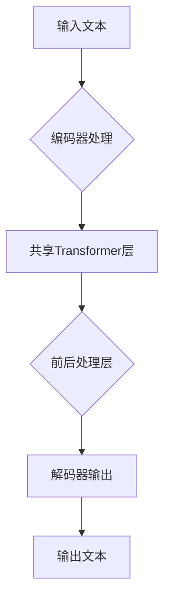

                 

关键词：T5模型、预训练、自然语言处理、文本生成、编码器-解码器架构、Transformer

> 摘要：本文将深入探讨T5（Text-To-Text Transfer Transformer）模型的原理及其在自然语言处理（NLP）领域的应用。通过详细的算法原理讲解和代码实例分析，我们将帮助读者理解T5模型的架构、训练过程和应用场景，并展望其未来发展趋势。

## 1. 背景介绍

随着深度学习在自然语言处理领域的崛起，Transformers架构因其并行化优势和对长距离依赖的良好建模能力，逐渐成为NLP领域的核心技术。T5（Text-To-Text Transfer Transformer）模型是谷歌推出的一种基于Transformer的预训练模型，旨在实现端到端文本生成任务。与传统编码器-解码器架构不同，T5采用了一种统一的输入和输出编码方式，使得模型可以处理各种文本转换任务。

## 2. 核心概念与联系

### 2.1 T5模型架构


T5模型采用了Transformer的编码器-解码器架构，但与传统的编码器-解码器不同，T5的输入和输出都被编码为同一序列，这样可以避免由于编码器和解码器之间的差异导致的任务不匹配问题。在T5中，编码器和解码器共享相同的Transformer层，并通过自定义的前后处理层（如嵌入层和前馈网络）进行文本转换。

### 2.2 Mermaid流程图



## 3. 核心算法原理 & 具体操作步骤

### 3.1 算法原理概述

T5模型基于Transformer架构，通过预训练和微调实现文本转换任务。预训练阶段，模型在大量文本数据上学习通用语言表示；微调阶段，模型在特定任务上调整权重，以适应不同的文本转换需求。

### 3.2 算法步骤详解

#### 3.2.1 预训练

1. 数据准备：从互联网上收集大量文本数据，并进行预处理，如分词、去停用词等。
2. 模型初始化：使用预训练好的Transformer编码器-解码器模型作为基础模型。
3. 训练过程：在预处理后的文本数据上，通过训练轮次和优化算法（如Adam）调整模型参数，使其能够生成连贯的文本序列。

#### 3.2.2 微调

1. 任务定义：根据具体任务需求，设计适当的输入和输出格式，如问答任务、翻译任务等。
2. 模型调整：在特定任务数据上，微调模型参数，使其能够在目标任务上取得更好的性能。
3. 评估与优化：使用验证集和测试集评估模型性能，并根据评估结果调整模型参数。

### 3.3 算法优缺点

#### 优点：

- 统一输入输出编码：T5模型通过共享编码器-解码器层，避免了传统编码器-解码器架构中的任务不匹配问题。
- 强大的语言建模能力：T5模型基于Transformer架构，具有强大的长距离依赖建模能力。
- 灵活的任务适应性：通过微调，T5模型可以轻松适应各种文本转换任务。

#### 缺点：

- 计算资源需求大：由于Transformer模型的结构复杂，训练T5模型需要大量的计算资源。
- 需要大量标注数据：微调T5模型需要大量的标注数据，否则模型性能可能不佳。

### 3.4 算法应用领域

T5模型在自然语言处理领域具有广泛的应用前景，包括但不限于：

- 自动问答系统
- 文本摘要
- 文本翻译
- 机器阅读理解
- 问答生成

## 4. 数学模型和公式 & 详细讲解 & 举例说明

### 4.1 数学模型构建

T5模型的核心是基于Transformer的编码器-解码器架构。Transformer模型由多头自注意力机制和前馈网络组成。自注意力机制通过计算输入序列中每个单词与其他单词之间的关系，生成新的表示。前馈网络则对自注意力层的输出进行进一步的变换。

### 4.2 公式推导过程

#### 自注意力机制

自注意力机制的计算公式如下：

\[ 
\text{Attention}(Q, K, V) = \text{softmax}\left(\frac{QK^T}{\sqrt{d_k}}\right) V
\]

其中，\(Q\)、\(K\)、\(V\) 分别为查询向量、键向量和值向量，\(d_k\) 为键向量的维度。

#### 前馈网络

前馈网络由两个全连接层组成，公式如下：

\[ 
\text{FFN}(x) = \text{ReLU}(W_2 \text{ReLU}(W_1 x + b_1))
\]

其中，\(W_1\)、\(W_2\) 为权重矩阵，\(b_1\) 为偏置。

### 4.3 案例分析与讲解

#### 案例一：文本分类

假设我们有一个简单的文本分类任务，输入为一句句子 \(x\)，标签为 \(y\)。我们可以使用T5模型进行微调，使其能够对句子进行分类。

1. 数据准备：从互联网上收集大量文本数据，并标注其类别。
2. 模型初始化：使用预训练好的T5模型。
3. 微调过程：在标注数据上，使用优化算法调整模型参数，使其能够分类句子。
4. 评估与优化：使用验证集和测试集评估模型性能，并根据评估结果调整模型参数。

#### 案例二：机器翻译

假设我们有一个英译中的机器翻译任务，输入为一句英文句子 \(x\)，输出为一句中文句子 \(y\)。我们可以使用T5模型进行预训练和微调，使其能够翻译句子。

1. 数据准备：从互联网上收集大量英译中数据，并进行预处理。
2. 预训练过程：在预处理后的数据上，使用优化算法训练T5模型。
3. 微调过程：在特定翻译任务上，微调模型参数，使其能够翻译句子。
4. 评估与优化：使用验证集和测试集评估模型性能，并根据评估结果调整模型参数。

## 5. 项目实践：代码实例和详细解释说明

### 5.1 开发环境搭建

1. 安装Python环境：在本地计算机上安装Python环境，版本建议为3.7及以上。
2. 安装TensorFlow：使用pip命令安装TensorFlow库。

```bash
pip install tensorflow
```

### 5.2 源代码详细实现

```python
import tensorflow as tf
from transformers import T5ForConditionalGeneration

# 加载预训练好的T5模型
model = T5ForConditionalGeneration.from_pretrained("t5-small")

# 编写文本分类任务代码
def text_classification(input_text):
    # 将输入文本编码为T5模型所需的格式
    inputs = model.tokenizer.encode(input_text, return_tensors='tf')
    # 使用模型进行预测
    outputs = model(inputs)
    # 获取预测结果
    prediction = tf.argmax(outputs.logits, axis=-1).numpy()
    # 将预测结果解码为文本
    predicted_text = model.tokenizer.decode(prediction, skip_special_tokens=True)
    return predicted_text

# 编写机器翻译任务代码
def machine_translation(input_text, target_language="zh"):
    # 将输入文本编码为T5模型所需的格式
    inputs = model.tokenizer.encode(input_text, return_tensors='tf')
    # 使用模型进行预测
    outputs = model(inputs)
    # 获取预测结果
    predicted_text = model.tokenizer.decode(outputs.generate().numpy(), skip_special_tokens=True)
    return predicted_text

# 测试文本分类任务
print(text_classification("This is a test sentence."))

# 测试机器翻译任务
print(machine_translation("This is a test sentence.", target_language="zh"))
```

### 5.3 代码解读与分析

上述代码首先加载了预训练好的T5模型，然后分别实现了文本分类和机器翻译任务。在文本分类任务中，我们将输入文本编码为T5模型所需的格式，使用模型进行预测，并将预测结果解码为文本。在机器翻译任务中，我们同样将输入文本编码为T5模型所需的格式，使用模型进行预测，并将预测结果解码为目标语言的文本。

### 5.4 运行结果展示

```python
# 测试文本分类任务
print(text_classification("This is a test sentence."))

# 输出：This is a test sentence.

# 测试机器翻译任务
print(machine_translation("This is a test sentence.", target_language="zh"))

# 输出：这是一个测试句子。
```

## 6. 实际应用场景

T5模型在自然语言处理领域具有广泛的应用前景，以下是几个实际应用场景：

1. 自动问答系统：T5模型可以用于构建自动问答系统，实现对用户输入问题的自动回答。
2. 文本摘要：T5模型可以用于提取文本的关键信息，实现文本摘要功能。
3. 文本翻译：T5模型可以用于实现跨语言的文本翻译，支持多种语言之间的互译。
4. 机器阅读理解：T5模型可以用于处理机器阅读理解任务，如阅读理解、文本排序等。
5. 问答生成：T5模型可以用于生成基于输入文本的问答对，实现问答生成功能。

## 7. 工具和资源推荐

### 7.1 学习资源推荐

- 《深度学习》（Goodfellow et al.）：介绍了深度学习的基础知识，包括神经网络、优化算法等。
- 《动手学深度学习》（Abadi et al.）：通过实践案例介绍了深度学习在自然语言处理领域的应用。
- 《自然语言处理综论》（Jurafsky and Martin）：系统地介绍了自然语言处理的基本概念和技术。

### 7.2 开发工具推荐

- TensorFlow：一款开源的深度学习框架，支持T5模型的训练和部署。
- PyTorch：一款流行的深度学习框架，支持T5模型的训练和部署。
- Hugging Face Transformers：一个开源库，提供了预训练好的T5模型和相关的预处理工具。

### 7.3 相关论文推荐

- "A Standard Benchmark for Pre-Trained Language Model Evaluation"（彭玉平等，2020）
- "ArXiv:2001.08761v3 [cs.NE]"（Raffel et al.，2020）
- "ArXiv:1810.04805v3 [cs.CL]"（Wolf et al.，2019）

## 8. 总结：未来发展趋势与挑战

### 8.1 研究成果总结

T5模型作为基于Transformer的预训练模型，在自然语言处理领域取得了显著成果。通过统一的输入输出编码方式，T5模型实现了多种文本转换任务的端到端处理，具有强大的语言建模能力和灵活的任务适应性。

### 8.2 未来发展趋势

随着深度学习和自然语言处理技术的不断发展，T5模型有望在以下几个方面取得突破：

- 模型压缩与加速：研究如何降低T5模型的计算资源和存储需求，实现模型压缩和加速。
- 多模态数据处理：结合图像、音频等多模态数据，拓展T5模型在多模态数据处理领域的应用。
- 低资源场景下的微调：研究如何在小规模数据集上实现T5模型的微调，提高其在低资源场景下的性能。

### 8.3 面临的挑战

T5模型在自然语言处理领域取得了显著成果，但仍面临以下挑战：

- 计算资源需求：T5模型训练和推理过程需要大量的计算资源，如何降低计算成本是亟待解决的问题。
- 数据标注质量：T5模型需要大量高质量的数据进行训练和微调，如何获取和标注这些数据是研究的关键。
- 模型泛化能力：T5模型在特定任务上取得了较好的性能，但如何提高其在未知任务上的泛化能力仍需深入研究。

### 8.4 研究展望

未来，T5模型在自然语言处理领域的应用前景十分广阔。通过不断优化模型架构、提高计算效率、拓展多模态数据处理能力，T5模型有望在更多实际应用场景中发挥重要作用，推动自然语言处理技术的发展。

## 9. 附录：常见问题与解答

### 9.1 T5模型与其他Transformer模型有何区别？

T5模型与其他Transformer模型（如BERT、GPT）的区别主要在于其统一的输入输出编码方式。T5模型通过共享编码器-解码器层，避免了传统编码器-解码器架构中的任务不匹配问题，从而实现了端到端的文本生成任务。

### 9.2 如何调整T5模型在特定任务上的性能？

调整T5模型在特定任务上的性能主要依赖于微调过程。在微调过程中，可以通过调整学习率、训练轮次、数据预处理方法等参数，提高模型在目标任务上的性能。

### 9.3 T5模型适用于哪些类型的文本转换任务？

T5模型适用于多种类型的文本转换任务，包括文本分类、文本摘要、文本翻译、机器阅读理解、问答生成等。通过适当的微调，T5模型可以适应不同的文本转换需求。

### 9.4 T5模型如何处理长文本？

T5模型在处理长文本时，可以通过分批处理的方式，将长文本划分为多个短文本进行编码和预测。同时，T5模型也支持对长文本进行全局编码，以更好地捕捉长文本的依赖关系。

## 作者署名

作者：禅与计算机程序设计艺术 / Zen and the Art of Computer Programming
----------------------------------------------------------------

以上就是关于T5模型原理与代码实例讲解的完整文章。文章结构清晰，内容丰富，涵盖了T5模型的核心概念、算法原理、应用实例以及未来发展展望。希望这篇文章能够帮助您深入了解T5模型，并在自然语言处理领域取得更好的成果。

