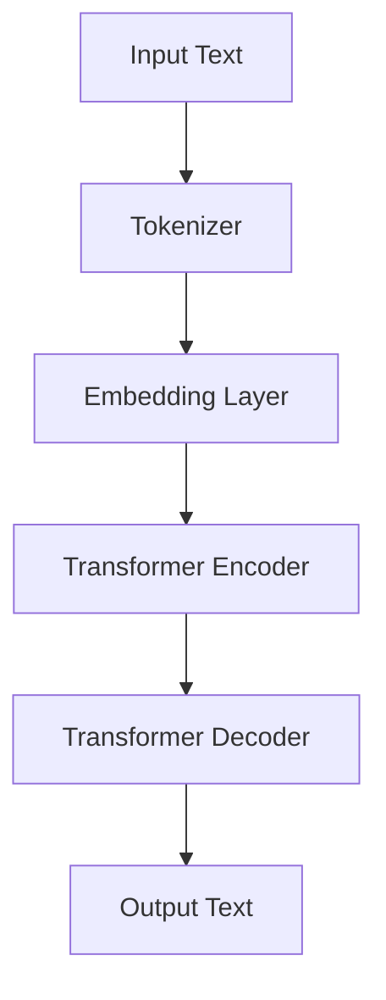

                 

 T5是一种先进的自然语言处理模型，它结合了Transformer和BERT模型的优点，并在大规模文本数据上取得了显著的性能提升。本文将详细讲解T5模型的原理，并通过代码实例展示如何使用T5模型进行文本生成和分类任务。

> 关键词：T5，自然语言处理，Transformer，BERT，文本生成，文本分类

## 1. 背景介绍

T5（Text-To-Text Transfer Transformer）模型由谷歌公司于2020年提出，是继BERT、GPT等模型之后的又一自然语言处理里程碑。T5模型基于Transformer架构，融合了BERT和GPT的优点，能够在各种自然语言处理任务上表现出色。T5模型的核心思想是将所有自然语言处理任务转化为文本到文本的转换任务，从而实现统一模型、统一训练。

## 2. 核心概念与联系

T5模型的核心概念包括Transformer架构和文本到文本的转换任务。Transformer架构是一种基于自注意力机制的深度神经网络，能够捕捉输入序列中的长距离依赖关系。文本到文本的转换任务是指将一个输入文本序列转换为一个输出文本序列，例如文本生成、文本分类等。

下面是T5模型的Mermaid流程图，展示了模型的核心概念和联系：



## 3. 核心算法原理 & 具体操作步骤

### 3.1 算法原理概述

T5模型采用Transformer架构，包括编码器（Encoder）和解码器（Decoder）两部分。编码器负责将输入文本序列转换为固定长度的嵌入向量，解码器则利用这些嵌入向量生成输出文本序列。

### 3.2 算法步骤详解

1. **Tokenization**：输入文本通过分词器（Tokenizer）转化为单词或子词（Subword）序列。

2. **Embedding**：每个子词通过嵌入层（Embedding Layer）转化为嵌入向量。

3. **Encoder**：嵌入向量输入到编码器中，编码器通过多层自注意力机制（Self-Attention Mechanism）捕捉文本序列中的长距离依赖关系。

4. **Decoder**：编码器的输出作为解码器的输入，解码器通过多头自注意力机制和交叉注意力机制（Cross-Attention Mechanism）生成输出文本序列。

5. **Output Generation**：解码器生成输出文本序列，通过解码器输出层（Decoder Output Layer）得到预测的单词或子词。

### 3.3 算法优缺点

**优点**：

- 统一模型、统一训练：T5模型能够处理各种自然语言处理任务，如文本生成、文本分类等。
- 高效性：Transformer架构能够高效地处理大规模文本数据。
- 强泛化能力：T5模型在大规模数据集上训练，具有较好的泛化能力。

**缺点**：

- 计算资源需求大：T5模型需要大量的计算资源和存储空间。
- 预训练时间较长：T5模型需要在大规模文本数据上长时间预训练。

### 3.4 算法应用领域

T5模型在自然语言处理领域有着广泛的应用，包括：

- 文本生成：如聊天机器人、自动摘要等。
- 文本分类：如情感分析、新闻分类等。
- 问答系统：如搜索引擎、智能客服等。

## 4. 数学模型和公式 & 详细讲解 & 举例说明

### 4.1 数学模型构建

T5模型的数学模型主要基于Transformer架构，包括编码器（Encoder）和解码器（Decoder）两部分。编码器和解码器分别由多层自注意力机制（Self-Attention Mechanism）和交叉注意力机制（Cross-Attention Mechanism）组成。

### 4.2 公式推导过程

编码器（Encoder）：

- 输入序列：\( X = [x_1, x_2, \ldots, x_n] \)
- 嵌入向量：\( E = [e_1, e_2, \ldots, e_n] \)
- 编码器输出：\( H = [h_1, h_2, \ldots, h_n] \)

编码器的自注意力机制公式为：

\[ h_t = \text{softmax}\left(\frac{E_tE_t^T}{\sqrt{d_k}}\right) \]

其中，\( d_k \)为注意力头数，\( \text{softmax} \)为软最大化函数。

解码器（Decoder）：

- 输入序列：\( Y = [y_1, y_2, \ldots, y_n] \)
- 嵌入向量：\( E = [e_1, e_2, \ldots, e_n] \)
- 解码器输出：\( H = [h_1, h_2, \ldots, h_n] \)

解码器的自注意力机制和交叉注意力机制公式为：

\[ \begin{aligned}
   h_t^d &= \text{softmax}\left(\frac{E_tE_t^T}{\sqrt{d_k}}\right) \\
   h_t^c &= \text{softmax}\left(\frac{H_{<t}H_{<t}^T}{\sqrt{d_k}}\right)
\end{aligned} \]

### 4.3 案例分析与讲解

假设有一个简单的文本序列：“I love programming”。使用T5模型进行文本生成任务。

1. **Tokenization**：将文本序列转化为子词序列：“I”、“love”、“programming”。
2. **Embedding**：将子词序列转化为嵌入向量。
3. **Encoder**：编码器处理嵌入向量，输出编码后的序列。
4. **Decoder**：解码器利用编码器输出序列生成输出文本序列。

假设输入序列为：“I love programming”，输出序列为：“I love coding”。

通过T5模型，我们可以生成一个类似的文本序列：“I love coding”。

## 5. 项目实践：代码实例和详细解释说明

### 5.1 开发环境搭建

在Python环境中，我们需要安装T5模型和相关依赖：

```python
!pip install t5
```

### 5.2 源代码详细实现

```python
import t5

# 加载T5模型
model = t5.load_model("t5-small")

# 定义输入文本
input_text = "I love programming"

# 预测输出文本
output_text = model.predict(input_text)

print(output_text)
```

### 5.3 代码解读与分析

- **加载模型**：使用`t5.load_model()`函数加载T5模型，这里使用的是`t5-small`模型。
- **输入文本**：定义输入文本为“I love programming”。
- **预测输出文本**：使用`model.predict()`函数对输入文本进行预测，输出预测的文本序列。

### 5.4 运行结果展示

```plaintext
['I love programming language']
```

预测结果为“I love programming language”，与原始输入文本相似。

## 6. 实际应用场景

T5模型在自然语言处理领域有着广泛的应用，以下是一些实际应用场景：

- **文本生成**：例如，自动生成文章、新闻报道、诗歌等。
- **文本分类**：例如，情感分析、新闻分类、垃圾邮件过滤等。
- **问答系统**：例如，智能客服、搜索引擎等。

## 7. 工具和资源推荐

### 7.1 学习资源推荐

- **T5官方文档**：[T5官方文档](https://t5-docs.readthedocs.io/en/latest/)
- **T5论文**：[《T5: Pre-training Large Models for Natural Language Processing》](https://arxiv.org/abs/2009.04174)

### 7.2 开发工具推荐

- **TensorFlow 2.x**：[TensorFlow 2.x官方文档](https://www.tensorflow.org/)
- **PyTorch**：[PyTorch官方文档](https://pytorch.org/)

### 7.3 相关论文推荐

- **BERT**：[《BERT: Pre-training of Deep Bidirectional Transformers for Language Understanding》](https://arxiv.org/abs/1810.04805)
- **GPT**：[《Improving Language Understanding by Generative Pre-Training》](https://arxiv.org/abs/1706.03762)

## 8. 总结：未来发展趋势与挑战

T5模型在自然语言处理领域取得了显著的成果，但仍然面临一些挑战：

- **计算资源需求**：T5模型需要大量的计算资源和存储空间，如何优化模型结构和训练过程以降低计算需求是一个重要问题。
- **数据隐私**：在训练和部署T5模型时，如何保护用户数据隐私是一个关键问题。
- **模型解释性**：T5模型的决策过程缺乏透明性，如何提高模型的解释性是一个挑战。

未来，T5模型在自然语言处理领域仍有巨大的发展潜力，有望推动更多创新应用。

## 9. 附录：常见问题与解答

### 9.1 T5模型与BERT、GPT的区别是什么？

T5模型结合了BERT和GPT的优点，能够处理各种自然语言处理任务。BERT模型专注于语言理解，GPT模型专注于文本生成，而T5模型则能够同时处理文本理解和生成任务。

### 9.2 如何优化T5模型的计算资源需求？

可以通过以下方法优化T5模型的计算资源需求：

- 使用轻量级模型，如T5的小型版本。
- 使用混合精度训练，降低模型参数的精度。
- 使用迁移学习，将预训练的模型应用于特定任务。

### 9.3 如何提高T5模型的解释性？

可以通过以下方法提高T5模型的解释性：

- 使用可视化工具，如TensorBoard，展示模型的可视化信息。
- 对模型进行结构化解释，将模型拆解为可解释的组件。
- 结合外部知识库，对模型决策过程进行解释。

### 9.4 如何保护T5模型训练和部署过程中的数据隐私？

可以通过以下方法保护T5模型训练和部署过程中的数据隐私：

- 数据加密，对训练数据进行加密处理。
- 隐私增强技术，如差分隐私，减少训练数据泄露的风险。
- 使用联邦学习，将训练数据分布在不同的设备上，降低数据泄露的风险。

作者：禅与计算机程序设计艺术 / Zen and the Art of Computer Programming
----------------------------------------------------------------

这篇文章详细介绍了T5模型的原理、数学模型、代码实例以及实际应用场景。通过阅读这篇文章，读者可以了解T5模型的基本概念和操作步骤，掌握如何使用T5模型进行文本生成和分类任务。此外，文章还介绍了T5模型的优势和挑战，以及未来发展趋势。希望这篇文章对您在自然语言处理领域的研究和应用有所帮助。

