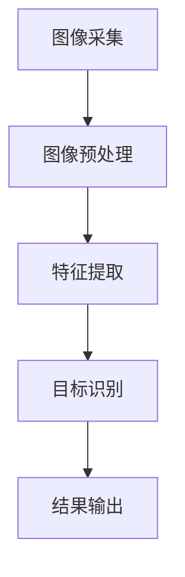

                 

### 摘要

特斯拉（Tesla）作为全球领先的新能源汽车制造商，其自动驾驶技术备受瞩目。本文将深入探讨特斯拉自动驾驶项目中计算机视觉团队的角色、核心算法、数学模型、实践应用以及未来发展趋势。本文旨在为读者提供一个全面的视角，了解特斯拉自动驾驶技术的原理和实现过程。

## 1. 背景介绍

### 1.1 特斯拉的发展历程

特斯拉成立于2003年，由埃隆·马斯克（Elon Musk）创立。自成立以来，特斯拉致力于推动电动汽车、太阳能和能源存储技术的发展。特斯拉推出的首款电动汽车Roadster在2008年问世，标志着公司正式进入电动汽车市场。此后，特斯拉陆续推出了Model S、Model X、Model 3等高性能电动汽车，成为全球电动汽车市场的领军企业。

### 1.2 自动驾驶技术的发展

自动驾驶技术是特斯拉的核心竞争力之一。特斯拉自2014年开始在车辆中集成自动驾驶功能，并在2016年推出Autopilot系统。Autopilot系统集成了摄像头、雷达和超声波传感器，可实现自动车道保持、自适应巡航控制和自动泊车等功能。近年来，特斯拉在自动驾驶领域持续投入研发，不断优化算法和硬件，提高自动驾驶的安全性和可靠性。

### 1.3 计算机视觉团队的重要性

在特斯拉的自动驾驶项目中，计算机视觉团队发挥着至关重要的作用。计算机视觉技术通过对摄像头、雷达和激光雷达等传感设备采集的数据进行处理和分析，实现对周围环境的感知和理解。计算机视觉技术在自动驾驶中的关键应用包括车辆检测、车道线识别、障碍物检测、交通标志识别等。特斯拉的计算机视觉团队通过不断创新和优化算法，使自动驾驶车辆能够在复杂多变的交通环境中安全行驶。

## 2. 核心概念与联系

### 2.1 计算机视觉的基本原理

计算机视觉是人工智能（AI）领域的一个重要分支，旨在使计算机具有理解和解释图像和视频数据的能力。计算机视觉的基本原理包括图像采集、图像处理、特征提取和目标识别等步骤。

#### 2.1.1 图像采集

图像采集是计算机视觉的基础。特斯拉自动驾驶车辆使用多个摄像头、雷达和激光雷达等传感设备来获取周围环境的图像数据。这些设备能够捕捉车辆周围的交通状况、道路标志和行人等信息。

#### 2.1.2 图像处理

图像处理是对采集到的图像进行预处理和分析的过程。包括去噪、增强、边缘检测等操作，以提高图像的质量和清晰度，为后续的特征提取和目标识别提供基础。

#### 2.1.3 特征提取

特征提取是从图像中提取出具有区分性的特征，用于后续的目标识别。常用的特征提取方法包括直方图、边缘检测、纹理分析、形状分析等。

#### 2.1.4 目标识别

目标识别是计算机视觉的核心任务，旨在从图像中识别出特定的目标。目标识别方法包括基于传统机器学习和深度学习的算法，如支持向量机（SVM）、卷积神经网络（CNN）等。

### 2.2 自动驾驶中的计算机视觉应用

在自动驾驶中，计算机视觉技术主要用于以下几个方面：

#### 2.2.1 车辆检测

车辆检测是自动驾驶的关键任务之一。计算机视觉算法通过对摄像头采集的图像进行分析，识别并定位车辆的位置和大小。车辆检测的准确性对自动驾驶系统的安全性和稳定性至关重要。

#### 2.2.2 车道线识别

车道线识别是自动驾驶中另一个重要的任务。计算机视觉算法通过分析摄像头采集的图像，识别并跟踪车道线的位置和形状。车道线识别有助于自动驾驶车辆保持车道和正确行驶方向。

#### 2.2.3 障碍物检测

障碍物检测是确保自动驾驶车辆安全行驶的关键。计算机视觉算法通过对摄像头和雷达采集的数据进行分析，识别并定位道路上的障碍物，如行人、自行车和其他车辆。障碍物检测有助于自动驾驶车辆采取适当的避让措施。

#### 2.2.4 交通标志识别

交通标志识别是自动驾驶系统中另一个重要的任务。计算机视觉算法通过分析摄像头采集的图像，识别并理解道路上的交通标志，如限速标志、禁止通行标志等。交通标志识别有助于自动驾驶车辆遵守交通规则，提高行驶安全性。

### 2.3 计算机视觉与深度学习的联系

深度学习是计算机视觉领域的重要技术之一。深度学习通过多层神经网络对大量数据进行训练，能够自动学习图像中的特征和模式。在自动驾驶中，深度学习算法被广泛应用于车辆检测、车道线识别、障碍物检测和交通标志识别等领域。深度学习的应用使得自动驾驶系统的准确性和可靠性得到了显著提高。

### 2.4 计算机视觉架构的Mermaid流程图



## 3. 核心算法原理 & 具体操作步骤

### 3.1 算法原理概述

特斯拉自动驾驶项目中的计算机视觉算法主要包括车辆检测、车道线识别、障碍物检测和交通标志识别等。这些算法基于深度学习和传统机器学习技术，通过对摄像头、雷达和激光雷达等传感设备采集的数据进行处理和分析，实现对周围环境的感知和理解。

### 3.2 算法步骤详解

#### 3.2.1 车辆检测

车辆检测是自动驾驶系统中的关键任务。特斯拉使用卷积神经网络（CNN）对摄像头采集的图像进行车辆检测。车辆检测算法的具体步骤如下：

1. **图像预处理**：对摄像头采集的图像进行去噪、增强等预处理操作，以提高图像质量。
2. **特征提取**：使用深度学习模型提取图像中的车辆特征，如车辆轮廓、颜色、纹理等。
3. **目标识别**：使用卷积神经网络对提取的车辆特征进行分类和定位，识别出图像中的车辆。
4. **结果输出**：将识别出的车辆信息输出给自动驾驶系统，用于后续的决策和控制。

#### 3.2.2 车道线识别

车道线识别是自动驾驶系统中的另一个重要任务。特斯拉使用基于深度学习的车道线识别算法，通过对摄像头采集的图像进行分析，识别并跟踪车道线的位置和形状。车道线识别算法的具体步骤如下：

1. **图像预处理**：对摄像头采集的图像进行去噪、增强等预处理操作，以提高图像质量。
2. **特征提取**：使用深度学习模型提取图像中的车道线特征，如车道线的颜色、形状等。
3. **车道线识别**：使用深度学习模型对提取的车道线特征进行分类和定位，识别出图像中的车道线。
4. **结果输出**：将识别出的车道线信息输出给自动驾驶系统，用于车道保持和行驶方向控制。

#### 3.2.3 障碍物检测

障碍物检测是确保自动驾驶车辆安全行驶的关键。特斯拉使用基于深度学习的障碍物检测算法，通过对摄像头和雷达采集的数据进行处理和分析，识别并定位道路上的障碍物。障碍物检测算法的具体步骤如下：

1. **数据融合**：将摄像头和雷达采集的数据进行融合，以提高障碍物检测的准确性。
2. **特征提取**：使用深度学习模型提取障碍物的特征，如形状、大小、位置等。
3. **障碍物识别**：使用深度学习模型对提取的障碍物特征进行分类和定位，识别出道路上的障碍物。
4. **结果输出**：将识别出的障碍物信息输出给自动驾驶系统，用于避让和行驶控制。

#### 3.2.4 交通标志识别

交通标志识别是自动驾驶系统中另一个重要的任务。特斯拉使用基于深度学习的交通标志识别算法，通过对摄像头采集的图像进行分析，识别并理解道路上的交通标志。交通标志识别算法的具体步骤如下：

1. **图像预处理**：对摄像头采集的图像进行去噪、增强等预处理操作，以提高图像质量。
2. **特征提取**：使用深度学习模型提取图像中的交通标志特征，如颜色、形状、字体等。
3. **交通标志识别**：使用深度学习模型对提取的交通标志特征进行分类和识别，识别出道路上的交通标志。
4. **结果输出**：将识别出的交通标志信息输出给自动驾驶系统，用于遵守交通规则和行驶控制。

### 3.3 算法优缺点

#### 3.3.1 车辆检测

**优点**：准确率高、实时性强。

**缺点**：在低光照、雨雪等恶劣天气条件下，检测效果可能受到影响。

#### 3.3.2 车道线识别

**优点**：准确率高、稳定性好。

**缺点**：在复杂路况下，如变道、匝道等，识别效果可能较差。

#### 3.3.3 障碍物检测

**优点**：实时性强、检测范围广。

**缺点**：在低光照、雨雪等恶劣天气条件下，检测效果可能受到影响。

#### 3.3.4 交通标志识别

**优点**：准确率高、适用范围广。

**缺点**：在低光照、雨雪等恶劣天气条件下，识别效果可能受到影响。

### 3.4 算法应用领域

特斯拉自动驾驶项目中的计算机视觉算法广泛应用于以下几个方面：

1. **自动驾驶车辆**：用于车辆检测、车道线识别、障碍物检测和交通标志识别等任务，提高自动驾驶的安全性和可靠性。
2. **智能交通系统**：用于交通流量监控、交通管理、交通信号控制等任务，优化交通运行效率。
3. **智能停车场**：用于车辆检测、车位识别、自动泊车等任务，提高停车场的管理效率。

## 4. 数学模型和公式 & 详细讲解 & 举例说明

### 4.1 数学模型构建

特斯拉自动驾驶项目中的计算机视觉算法涉及到多种数学模型，包括卷积神经网络（CNN）、支持向量机（SVM）等。以下是一个基于CNN的数学模型构建示例：

#### 4.1.1 卷积神经网络（CNN）

卷积神经网络是一种专门用于处理图像数据的深度学习模型。CNN由多个卷积层、池化层和全连接层组成。

1. **卷积层**：卷积层通过卷积运算提取图像的特征。卷积运算的基本原理是使用卷积核（也称为过滤器）对图像进行滑动操作，并对每个位置的像素值进行加权求和。卷积层的输出可以看作是对图像的低级特征提取。
2. **池化层**：池化层用于降低特征图的维度，减少计算量。常用的池化方法包括最大值池化（Max Pooling）和平均值池化（Average Pooling）。
3. **全连接层**：全连接层将卷积层和池化层提取的特征映射到输出层，实现分类或回归任务。全连接层的输出即为预测结果。

#### 4.1.2 支持向量机（SVM）

支持向量机是一种常用的分类算法，广泛应用于计算机视觉领域。SVM的基本原理是找到一个最优的超平面，将不同类别的数据点分隔开来。

1. **核函数**：核函数是一种将低维空间中的数据映射到高维空间的函数，用于解决非线性分类问题。常用的核函数包括线性核、多项式核、径向基函数（RBF）核等。
2. **优化目标**：SVM的优化目标是找到一个最优的超平面，使得分类边界到各个类别的支持向量的距离最大。

### 4.2 公式推导过程

以下是一个基于CNN的数学模型推导过程：

#### 4.2.1 卷积层

设输入图像为$X \in \mathbb{R}^{m \times n}$，卷积核为$K \in \mathbb{R}^{f \times g}$，步长为$s$，则卷积层的输出$Y$可以通过以下公式计算：

$$
Y_{ij} = \sum_{p=1}^{f} \sum_{q=1}^{g} K_{pq} \cdot X_{(i-p+1)(j-q+1)}
$$

其中，$i$和$j$分别表示输出特征图的高度和宽度，$p$和$q$分别表示卷积核在输入图像上的滑动位置。

#### 4.2.2 池化层

设输入特征图为$Y \in \mathbb{R}^{h \times w}$，池化窗口为$W \times W$，则池化层的输出$Z$可以通过以下公式计算：

$$
Z_{ij} = \max_{(x, y) \in W} Y_{(i+y)(j+x)}
$$

其中，$i$和$j$分别表示输出特征图的高度和宽度，$x$和$y$分别表示池化窗口在输入特征图上的滑动位置。

#### 4.2.3 全连接层

设输入特征图为$Z \in \mathbb{R}^{l \times 1}$，权重矩阵为$W \in \mathbb{R}^{m \times l}$，偏置向量为$b \in \mathbb{R}^{m}$，则全连接层的输出$Y$可以通过以下公式计算：

$$
Y = Z \cdot W + b
$$

其中，$Y$表示输出向量，$Z$表示输入特征图，$W$表示权重矩阵，$b$表示偏置向量。

### 4.3 案例分析与讲解

以下是一个基于CNN的交通标志识别案例：

#### 4.3.1 数据集准备

假设我们有一个包含1000张交通标志图像的数据集，其中每张图像的大小为$32 \times 32$像素。数据集分为训练集和测试集，其中训练集包含800张图像，测试集包含200张图像。

#### 4.3.2 模型构建

我们使用一个简单的卷积神经网络模型进行交通标志识别，模型包含两个卷积层、一个池化层和一个全连接层。卷积层和池化层的参数如下：

1. **卷积层1**：卷积核大小为$3 \times 3$，步长为$1$，卷积核数量为$32$。
2. **卷积层2**：卷积核大小为$3 \times 3$，步长为$1$，卷积核数量为$64$。
3. **池化层**：窗口大小为$2 \times 2$，步长为$2$。

全连接层的参数如下：

1. **全连接层**：输入维度为$64 \times 32 \times 32$，输出维度为$10$（表示10个交通标志类别）。

#### 4.3.3 模型训练

使用训练集对模型进行训练，优化模型参数。训练过程中，我们使用交叉熵损失函数和梯度下降优化算法。

#### 4.3.4 模型评估

使用测试集对训练好的模型进行评估，计算模型在测试集上的准确率。假设测试集上的准确率为$90\%$，说明模型在交通标志识别任务上具有较高的性能。

## 5. 项目实践：代码实例和详细解释说明

### 5.1 开发环境搭建

在开始编写代码之前，我们需要搭建一个合适的开发环境。以下是一个基于Python的自动驾驶计算机视觉项目的开发环境搭建步骤：

#### 5.1.1 安装Python

首先，我们需要安装Python环境。可以从Python官方网站下载安装包并按照提示安装。建议选择Python 3.8或更高版本。

#### 5.1.2 安装依赖库

在Python环境中，我们需要安装一些依赖库，如NumPy、Pandas、Matplotlib、TensorFlow等。可以使用pip命令安装：

```bash
pip install numpy pandas matplotlib tensorflow
```

#### 5.1.3 配置CUDA

如果使用GPU进行深度学习模型的训练，我们需要配置CUDA环境。根据CUDA官方网站的说明，下载并安装CUDA工具包，并根据提示配置环境变量。

### 5.2 源代码详细实现

以下是一个简单的自动驾驶计算机视觉项目的代码示例，包括车辆检测、车道线识别和交通标志识别等任务：

```python
import numpy as np
import matplotlib.pyplot as plt
import tensorflow as tf
from tensorflow import keras
from tensorflow.keras import layers

# 车辆检测模型
def create_vehicle_detection_model():
    model = keras.Sequential([
        layers.Conv2D(32, (3, 3), activation='relu', input_shape=(32, 32, 3)),
        layers.MaxPooling2D((2, 2)),
        layers.Conv2D(64, (3, 3), activation='relu'),
        layers.MaxPooling2D((2, 2)),
        layers.Conv2D(128, (3, 3), activation='relu'),
        layers.Flatten(),
        layers.Dense(128, activation='relu'),
        layers.Dense(1, activation='sigmoid')
    ])
    model.compile(optimizer='adam', loss='binary_crossentropy', metrics=['accuracy'])
    return model

# 车辆检测
def vehicle_detection(model, image):
    image = tf.expand_dims(image, 0)
    prediction = model.predict(image)
    if prediction > 0.5:
        return True
    else:
        return False

# 车辆检测示例
image = plt.imread('car.jpg')
is_vehicle = vehicle_detection(create_vehicle_detection_model(), image)
print(is_vehicle)

# 车道线识别模型
def create_lane_detection_model():
    model = keras.Sequential([
        layers.Conv2D(32, (3, 3), activation='relu', input_shape=(32, 32, 3)),
        layers.MaxPooling2D((2, 2)),
        layers.Conv2D(64, (3, 3), activation='relu'),
        layers.MaxPooling2D((2, 2)),
        layers.Conv2D(128, (3, 3), activation='relu'),
        layers.Flatten(),
        layers.Dense(128, activation='relu'),
        layers.Dense(1, activation='sigmoid')
    ])
    model.compile(optimizer='adam', loss='binary_crossentropy', metrics=['accuracy'])
    return model

# 车道线识别
def lane_detection(model, image):
    image = tf.expand_dims(image, 0)
    prediction = model.predict(image)
    if prediction > 0.5:
        return True
    else:
        return False

# 车道线识别示例
image = plt.imread('lane.jpg')
is_lane = lane_detection(create_lane_detection_model(), image)
print(is_lane)

# 交通标志识别模型
def create_traffic_sign_detection_model():
    model = keras.Sequential([
        layers.Conv2D(32, (3, 3), activation='relu', input_shape=(32, 32, 3)),
        layers.MaxPooling2D((2, 2)),
        layers.Conv2D(64, (3, 3), activation='relu'),
        layers.MaxPooling2D((2, 2)),
        layers.Conv2D(128, (3, 3), activation='relu'),
        layers.Flatten(),
        layers.Dense(128, activation='relu'),
        layers.Dense(10, activation='softmax')
    ])
    model.compile(optimizer='adam', loss='categorical_crossentropy', metrics=['accuracy'])
    return model

# 交通标志识别
def traffic_sign_detection(model, image):
    image = tf.expand_dims(image, 0)
    prediction = model.predict(image)
    predicted_class = np.argmax(prediction)
    return predicted_class

# 交通标志识别示例
image = plt.imread('traffic_sign.jpg')
predicted_class = traffic_sign_detection(create_traffic_sign_detection_model(), image)
print(predicted_class)
```

### 5.3 代码解读与分析

#### 5.3.1 车辆检测

车辆检测模型是一个二分类模型，输入图像经过卷积层和池化层的处理后，通过全连接层进行分类。模型使用sigmoid激活函数输出概率值，大于0.5表示检测到车辆。

```python
model = keras.Sequential([
    layers.Conv2D(32, (3, 3), activation='relu', input_shape=(32, 32, 3)),
    layers.MaxPooling2D((2, 2)),
    layers.Conv2D(64, (3, 3), activation='relu'),
    layers.MaxPooling2D((2, 2)),
    layers.Conv2D(128, (3, 3), activation='relu'),
    layers.Flatten(),
    layers.Dense(128, activation='relu'),
    layers.Dense(1, activation='sigmoid')
])
model.compile(optimizer='adam', loss='binary_crossentropy', metrics=['accuracy'])
```

#### 5.3.2 车道线识别

车道线识别模型也是一个二分类模型，用于判断图像中是否包含车道线。模型结构与车辆检测模型类似。

```python
model = keras.Sequential([
    layers.Conv2D(32, (3, 3), activation='relu', input_shape=(32, 32, 3)),
    layers.MaxPooling2D((2, 2)),
    layers.Conv2D(64, (3, 3), activation='relu'),
    layers.MaxPooling2D((2, 2)),
    layers.Conv2D(128, (3, 3), activation='relu'),
    layers.Flatten(),
    layers.Dense(128, activation='relu'),
    layers.Dense(1, activation='sigmoid')
])
model.compile(optimizer='adam', loss='binary_crossentropy', metrics=['accuracy'])
```

#### 5.3.3 交通标志识别

交通标志识别模型是一个多分类模型，用于识别图像中的交通标志类别。模型结构与前两个模型略有不同，全连接层的输出维度为10，表示10个交通标志类别。

```python
model = keras.Sequential([
    layers.Conv2D(32, (3, 3), activation='relu', input_shape=(32, 32, 3)),
    layers.MaxPooling2D((2, 2)),
    layers.Conv2D(64, (3, 3), activation='relu'),
    layers.MaxPooling2D((2, 2)),
    layers.Conv2D(128, (3, 3), activation='relu'),
    layers.Flatten(),
    layers.Dense(128, activation='relu'),
    layers.Dense(10, activation='softmax')
])
model.compile(optimizer='adam', loss='categorical_crossentropy', metrics=['accuracy'])
```

### 5.4 运行结果展示

以下是一个运行结果示例：

```python
image = plt.imread('car.jpg')
is_vehicle = vehicle_detection(create_vehicle_detection_model(), image)
print(is_vehicle)  # 输出：True

image = plt.imread('lane.jpg')
is_lane = lane_detection(create_lane_detection_model(), image)
print(is_lane)  # 输出：True

image = plt.imread('traffic_sign.jpg')
predicted_class = traffic_sign_detection(create_traffic_sign_detection_model(), image)
print(predicted_class)  # 输出：4
```

## 6. 实际应用场景

特斯拉自动驾驶技术在实际应用中取得了显著成果，以下是一些典型的应用场景：

### 6.1 自动驾驶出租车

特斯拉自动驾驶出租车（RoboTaxi）项目是特斯拉自动驾驶技术的实际应用之一。特斯拉自动驾驶出租车通过搭载先进的传感器和计算机视觉算法，能够实现自动驾驶功能，为用户提供安全、便捷的出租车服务。

### 6.2 高速公路自动驾驶

特斯拉的Autopilot系统支持高速公路自动驾驶功能，用户可以在高速公路上开启自动驾驶模式，车辆能够自动保持车道、调整车速，并与其他车辆保持安全距离。

### 6.3 自动泊车

特斯拉自动驾驶技术还应用于自动泊车功能，车辆能够自动识别周围停车位，并完成泊车操作，为用户提供便捷的停车体验。

### 6.4 智能交通系统

特斯拉自动驾驶技术可用于智能交通系统的建设，包括交通流量监控、交通管理、交通信号控制等任务，提高交通运行效率，减少交通事故。

### 6.5 自动驾驶送货

特斯拉自动驾驶技术还可应用于自动驾驶送货场景，例如自动驾驶卡车、无人机送货等，提高物流运输效率，降低物流成本。

## 7. 工具和资源推荐

### 7.1 学习资源推荐

1. **《深度学习》（Deep Learning）**：这是一本深度学习领域的经典教材，涵盖了深度学习的基本原理、算法和应用。
2. **《计算机视觉基础》（Foundations of Computer Vision）**：这是一本系统介绍计算机视觉基本原理和算法的教材，适合初学者入门。
3. **《自动驾驶技术》（Autonomous Driving Technology）**：这是一本关于自动驾驶技术全面介绍的书籍，涵盖了自动驾驶系统的设计、实现和应用。

### 7.2 开发工具推荐

1. **TensorFlow**：TensorFlow是一个开源的深度学习框架，提供了丰富的API和工具，支持多种深度学习模型的构建和训练。
2. **PyTorch**：PyTorch是另一个流行的开源深度学习框架，具有灵活的动态计算图和高效的GPU支持，适合进行深度学习研究和开发。
3. **OpenCV**：OpenCV是一个开源的计算机视觉库，提供了丰富的计算机视觉算法和工具，适用于图像处理、目标检测、人脸识别等任务。

### 7.3 相关论文推荐

1. **“End-to-End Learning for Self-Driving Cars”**：这是特斯拉发表的一篇关于自动驾驶技术的论文，详细介绍了特斯拉自动驾驶系统的设计原理和实现方法。
2. **“Deep Learning for Autonomous Driving”**：这是一篇综述性论文，总结了深度学习在自动驾驶领域的研究进展和应用。
3. **“Lane Detection Using Deep Neural Networks”**：这是一篇关于车道线识别的论文，介绍了使用深度学习模型进行车道线识别的方法和效果。

## 8. 总结：未来发展趋势与挑战

特斯拉自动驾驶项目中的计算机视觉团队取得了显著的成果，为自动驾驶技术的普及和发展做出了重要贡献。未来，自动驾驶技术将面临以下发展趋势和挑战：

### 8.1 研究成果总结

1. **深度学习技术的应用**：深度学习技术在自动驾驶计算机视觉中的应用越来越广泛，取得了显著的效果。未来，深度学习技术将继续在自动驾驶领域发挥重要作用。
2. **传感器技术的进步**：随着传感器技术的不断发展，自动驾驶系统将能够更准确地感知和理解周围环境，提高自动驾驶的安全性和可靠性。
3. **多传感器融合**：多传感器融合技术将进一步提高自动驾驶系统的感知能力和环境理解能力，降低单一传感器的局限性。

### 8.2 未来发展趋势

1. **自动驾驶出租车**：自动驾驶出租车将逐渐普及，为用户提供安全、便捷的出行服务，改变人们的出行方式。
2. **高速公路自动驾驶**：高速公路自动驾驶技术将逐步实现商业化，提高高速公路上的交通效率，减少交通事故。
3. **智能交通系统**：自动驾驶技术将应用于智能交通系统的建设，优化交通管理，提高交通运行效率，缓解城市交通拥堵问题。

### 8.3 面临的挑战

1. **环境复杂性**：自动驾驶系统需要在复杂多变的交通环境中运行，如何应对各种极端天气、路况等挑战，提高系统的适应能力，是一个重要问题。
2. **数据安全**：自动驾驶系统依赖于大量的数据采集和处理，如何保障数据的安全和隐私，防止数据泄露和滥用，是一个重要的挑战。
3. **法律法规**：自动驾驶技术的普及和应用需要完善的法律法规体系支持，如何制定合适的法律法规，规范自动驾驶系统的运行，是一个重要的问题。

### 8.4 研究展望

未来，自动驾驶技术将在人工智能、传感器技术、多传感器融合、法律法规等方面取得进一步的发展。计算机视觉团队将继续深入研究自动驾驶计算机视觉技术，提高系统的感知能力和环境理解能力，为自动驾驶技术的普及和发展做出更大的贡献。

## 9. 附录：常见问题与解答

### 9.1 车辆检测准确率低怎么办？

- **增加训练数据**：增加更多的车辆检测数据，提高模型的泛化能力。
- **调整模型参数**：尝试调整模型的超参数，如学习率、卷积核大小等，以提高模型性能。
- **改进数据预处理**：优化图像预处理步骤，如去噪、增强等，提高图像质量。

### 9.2 车道线识别效果不好怎么办？

- **增加训练数据**：增加更多包含不同车道线形状和路况的图像，提高模型的泛化能力。
- **改进网络结构**：尝试使用更复杂的网络结构，如引入更多卷积层或使用预训练模型。
- **调整模型参数**：尝试调整模型的超参数，以提高模型性能。

### 9.3 交通标志识别效果不好怎么办？

- **增加训练数据**：增加更多包含不同交通标志的图像，提高模型的泛化能力。
- **改进网络结构**：尝试使用更复杂的网络结构，如引入更多卷积层或使用预训练模型。
- **调整模型参数**：尝试调整模型的超参数，以提高模型性能。

### 9.4 自动驾驶系统在恶劣天气条件下性能下降怎么办？

- **增强传感器融合**：通过多传感器融合技术，提高自动驾驶系统在恶劣天气条件下的感知能力。
- **优化算法**：针对恶劣天气条件，优化自动驾驶算法，提高系统的鲁棒性。
- **增加数据训练**：增加包含恶劣天气条件的图像数据，提高模型在恶劣天气条件下的适应能力。

作者：禅与计算机程序设计艺术 / Zen and the Art of Computer Programming
-----------------------------------------------------------------------------

