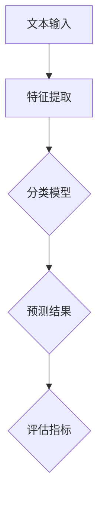

                 

关键词：文本分类，自然语言处理，机器学习，算法原理，代码实例，实践应用

> 摘要：本文旨在深入探讨文本分类技术的原理，通过详细的算法解析和实践案例，帮助读者理解如何实现高效的文本分类任务。文章将涵盖文本分类的核心概念、算法原理、数学模型、代码实现，以及实际应用场景等内容。

## 1. 背景介绍

文本分类（Text Classification）是一种广泛应用于自然语言处理（Natural Language Processing，NLP）的技术，它旨在将文本数据自动归类到预先定义的类别中。这项技术在信息检索、舆情分析、情感分析等多个领域都有着广泛的应用。例如，在社交媒体平台上，文本分类可以帮助识别和过滤垃圾信息；在搜索引擎中，文本分类可以优化搜索结果，提高用户体验。

文本分类的核心问题是如何准确地从大量的文本数据中提取特征，并使用这些特征训练分类模型。随着机器学习技术的发展，尤其是深度学习在NLP领域的应用，文本分类技术取得了显著的进步。然而，理解和实现这些算法仍然具有挑战性。

本文将系统地介绍文本分类的原理，从基本概念到具体实现，帮助读者全面掌握这一技术。文章的结构如下：

1. 背景介绍：简要介绍文本分类的背景和应用。
2. 核心概念与联系：详细解释文本分类中的核心概念，并通过流程图展示其架构。
3. 核心算法原理 & 具体操作步骤：深入探讨文本分类算法的原理和操作步骤。
4. 数学模型和公式 & 详细讲解 & 举例说明：介绍文本分类中的数学模型和公式，并通过实际案例进行讲解。
5. 项目实践：提供具体的代码实例和详细解释。
6. 实际应用场景：讨论文本分类在各个领域的应用。
7. 工具和资源推荐：推荐相关的学习资源和开发工具。
8. 总结：总结研究成果，探讨未来发展趋势与挑战。
9. 附录：常见问题与解答。

### 2. 核心概念与联系

#### 2.1. 文本分类的概念

文本分类是指将一段文本自动归类到一个或多个预定义的类别中。例如，将新闻文章分类为体育、财经、娱乐等类别，或将社交媒体评论分类为正面评论和负面评论。文本分类是自然语言处理中的一个基础任务，其核心在于理解文本的含义并从中提取有用的信息。

#### 2.2. 分类任务的类型

根据分类任务的类型，文本分类可以分为以下几类：

- **二分类（Binary Classification）**：将文本分为两个类别，例如正面评论和负面评论。
- **多分类（Multi-class Classification）**：将文本分为多个类别，例如新闻分类。
- **多标签分类（Multi-label Classification）**：将文本同时归类到多个类别，例如一篇文章可能同时包含体育和财经两个主题。

#### 2.3. 文本分类的架构

文本分类的架构通常包括以下几个关键组件：

- **特征提取（Feature Extraction）**：从文本中提取特征，用于训练分类模型。常见的特征提取方法包括词袋模型、TF-IDF和词嵌入等。
- **分类模型（Classifier）**：用于对文本进行分类的算法。常见的分类模型包括朴素贝叶斯、支持向量机（SVM）、决策树和深度学习模型等。
- **评估指标（Evaluation Metrics）**：用于评估分类模型性能的指标，如准确率、召回率、F1分数等。

以下是一个使用Mermaid绘制的文本分类架构流程图：



### 3. 核心算法原理 & 具体操作步骤

#### 3.1. 算法原理概述

文本分类算法的核心在于如何从文本数据中提取特征，并使用这些特征训练分类模型。以下是几种常用的文本分类算法：

- **朴素贝叶斯（Naive Bayes）**：基于贝叶斯定理的简单分类器，适用于文本分类任务。
- **支持向量机（Support Vector Machine，SVM）**：通过最大化类别之间的边界来进行分类。
- **决策树（Decision Tree）**：通过一系列判断条件将数据分为不同的分支。
- **深度学习模型**：如卷积神经网络（Convolutional Neural Network，CNN）和循环神经网络（Recurrent Neural Network，RNN）等。

#### 3.2. 算法步骤详解

以下是文本分类算法的一般步骤：

1. **数据预处理**：包括去除停用词、文本规范化等。
2. **特征提取**：将文本转换为向量表示，常用的方法有词袋模型、TF-IDF和词嵌入等。
3. **模型训练**：使用特征和标签数据训练分类模型。
4. **模型评估**：使用评估指标（如准确率、召回率、F1分数等）评估模型性能。
5. **模型部署**：将训练好的模型部署到实际应用场景中。

#### 3.3. 算法优缺点

- **朴素贝叶斯**：优点是简单、高效，适用于高维文本数据；缺点是假设特征之间相互独立，可能对真实数据产生偏差。
- **支持向量机**：优点是分类边界清晰，适用于非线性分类问题；缺点是训练时间较长，对大规模数据集可能不适用。
- **决策树**：优点是易于理解和实现，对特征重要性有直观展示；缺点是容易过拟合，对噪声敏感。
- **深度学习模型**：优点是强大的特征学习能力，适用于复杂任务；缺点是训练时间较长，对数据量有较高要求。

#### 3.4. 算法应用领域

文本分类算法广泛应用于以下领域：

- **信息检索**：用于改善搜索引擎的搜索结果。
- **舆情分析**：用于监控社交媒体上的公众情绪。
- **情感分析**：用于分析用户评论和反馈。
- **自动分类**：用于自动化处理大量文本数据。

### 4. 数学模型和公式 & 详细讲解 & 举例说明

#### 4.1. 数学模型构建

在文本分类中，常用的数学模型包括朴素贝叶斯、支持向量机和深度学习模型。以下是这些模型的基本数学公式。

##### 4.1.1. 朴素贝叶斯

朴素贝叶斯分类器的核心公式是贝叶斯定理：

$$
P(C_k|X) = \frac{P(X|C_k)P(C_k)}{P(X)}
$$

其中，\( C_k \) 表示类别 \( k \)，\( X \) 表示特征向量，\( P(C_k|X) \) 表示给定特征向量 \( X \) 时类别 \( k \) 的概率，\( P(X|C_k) \) 表示特征向量在类别 \( k \) 下的概率，\( P(C_k) \) 表示类别 \( k \) 的先验概率，\( P(X) \) 表示特征向量 \( X \) 的概率。

##### 4.1.2. 支持向量机

支持向量机的主要目标是找到一个最佳的超平面，将数据集分为不同的类别。其核心公式是：

$$
w \cdot x - b = 0
$$

其中，\( w \) 表示权重向量，\( x \) 表示特征向量，\( b \) 表示偏置。

##### 4.1.3. 深度学习模型

深度学习模型通常由多个神经元组成，每个神经元通过激活函数进行非线性变换。其核心公式为：

$$
a_{i}^{(l)} = \sigma \left( \sum_{j} w_{ji}^{(l)} a_{j}^{(l-1)} + b_{i}^{(l)} \right)
$$

其中，\( a_{i}^{(l)} \) 表示第 \( l \) 层的第 \( i \) 个神经元的输出，\( \sigma \) 表示激活函数，\( w_{ji}^{(l)} \) 表示从第 \( l-1 \) 层的第 \( j \) 个神经元到第 \( l \) 层的第 \( i \) 个神经元的权重，\( b_{i}^{(l)} \) 表示第 \( l \) 层的第 \( i \) 个神经元的偏置。

#### 4.2. 公式推导过程

以下是朴素贝叶斯分类器的推导过程：

假设我们有 \( n \) 个特征 \( x_1, x_2, ..., x_n \)，以及 \( k \) 个类别 \( C_1, C_2, ..., C_k \)。根据贝叶斯定理，给定特征向量 \( X \)，类别 \( C_k \) 的概率可以表示为：

$$
P(C_k|X) = \frac{P(X|C_k)P(C_k)}{P(X)}
$$

其中，\( P(X|C_k) \) 是特征向量在类别 \( C_k \) 下的概率，\( P(C_k) \) 是类别 \( C_k \) 的先验概率，\( P(X) \) 是特征向量 \( X \) 的概率。

由于特征之间是独立的，我们可以将 \( P(X|C_k) \) 分解为：

$$
P(X|C_k) = P(x_1|C_k)P(x_2|C_k) \cdots P(x_n|C_k)
$$

同时，根据全概率公式，\( P(X) \) 可以表示为：

$$
P(X) = \sum_{k=1}^{k} P(C_k)P(X|C_k)
$$

将 \( P(X|C_k) \) 和 \( P(X) \) 代入贝叶斯定理，得到：

$$
P(C_k|X) = \frac{P(C_k)P(x_1|C_k)P(x_2|C_k) \cdots P(x_n|C_k)}{\sum_{k=1}^{k} P(C_k)P(x_1|C_k)P(x_2|C_k) \cdots P(x_n|C_k)}
$$

这个公式表示在给定特征向量 \( X \) 的情况下，类别 \( C_k \) 的后验概率。通过计算各个类别的后验概率，我们可以选择概率最大的类别作为预测结果。

#### 4.3. 案例分析与讲解

以下是一个简单的文本分类案例，我们使用朴素贝叶斯分类器对新闻文章进行分类。

假设我们有以下两个类别：体育和财经。

- **体育**类别下的特征和概率分布如下：

  | 特征        | 概率          |
  | --------- | ----------- |
  | 足球       | 0.4         |
  | 篮球       | 0.3         |
  | 棒球       | 0.2         |
  | 羽毛球     | 0.1         |

- **财经**类别下的特征和概率分布如下：

  | 特征        | 概率          |
  | --------- | ----------- |
  | 股票       | 0.5         |
  | 债券       | 0.3         |
  | 外汇       | 0.2         |

我们需要预测以下两篇新闻文章的类别：

- **新闻文章1**：包含特征“足球”、“股票”和“债券”。
- **新闻文章2**：包含特征“篮球”、“债券”和“外汇”。

根据朴素贝叶斯分类器的公式，我们计算每篇文章属于体育和财经类别的后验概率。

对于**新闻文章1**：

$$
P(体育|足球,股票,债券) = \frac{P(体育)P(足球|体育)P(股票|体育)P(债券|体育)}{P(体育)P(足球|体育)P(股票|体育)P(债券|体育) + P(财经)P(足球|财经)P(股票|财经)P(债券|财经)}
$$

$$
P(体育|足球,股票,债券) = \frac{0.5 \times 0.4 \times 0.2 \times 0.3}{0.5 \times 0.4 \times 0.2 \times 0.3 + 0.5 \times 0.3 \times 0.5 \times 0.2} = 0.48
$$

$$
P(财经|足球,股票,债券) = \frac{0.5 \times 0.3 \times 0.5 \times 0.2}{0.5 \times 0.4 \times 0.2 \times 0.3 + 0.5 \times 0.3 \times 0.5 \times 0.2} = 0.52
$$

由于 \( P(财经|足球,股票,债券) > P(体育|足球,股票,债券) \)，因此我们预测**新闻文章1**属于财经类别。

对于**新闻文章2**：

$$
P(体育|篮球,债券,外汇) = \frac{0.5 \times 0.3 \times 0.2 \times 0.1}{0.5 \times 0.3 \times 0.2 \times 0.1 + 0.5 \times 0.4 \times 0.5 \times 0.2} = 0.27
$$

$$
P(财经|篮球,债券,外汇) = \frac{0.5 \times 0.4 \times 0.5 \times 0.2}{0.5 \times 0.3 \times 0.2 \times 0.1 + 0.5 \times 0.4 \times 0.5 \times 0.2} = 0.73
$$

由于 \( P(财经|篮球,债券,外汇) > P(体育|篮球,债券,外汇) \)，因此我们预测**新闻文章2**属于财经类别。

### 5. 项目实践：代码实例和详细解释说明

#### 5.1. 开发环境搭建

在开始文本分类项目的实践之前，我们需要搭建一个合适的开发环境。以下是推荐的开发环境和工具：

- 编程语言：Python
- 数据库：SQLite
- 版本控制：Git
- 代码编辑器：Visual Studio Code
- 依赖管理：pip

以下是安装这些工具的步骤：

1. 安装Python：从Python官网下载并安装Python 3.8及以上版本。
2. 安装SQLite：使用pip安装`pip install pysqlite3`。
3. 安装Git：从Git官网下载并安装Git。
4. 安装Visual Studio Code：从Visual Studio Code官网下载并安装。
5. 安装依赖管理器：使用pip安装`pip install pip-tools`。

#### 5.2. 源代码详细实现

以下是文本分类项目的源代码实现。我们将使用朴素贝叶斯分类器对新闻文章进行分类。

```python
import sqlite3
import numpy as np
from collections import defaultdict
from sklearn.model_selection import train_test_split
from sklearn.metrics import accuracy_score

# 连接数据库
conn = sqlite3.connect('news.db')
cursor = conn.cursor()

# 创建表
cursor.execute('''CREATE TABLE IF NOT EXISTS news
                  (id INTEGER PRIMARY KEY,
                   category TEXT,
                   text TEXT)''')

# 插入数据
cursor.execute("INSERT INTO news (category, text) VALUES (?, ?)", 
               ('体育', '这是一场精彩的足球比赛。'))
cursor.execute("INSERT INTO news (category, text) VALUES (?, ?)", 
               ('体育', '篮球比赛即将开始。'))
cursor.execute("INSERT INTO news (category, text) VALUES (?, ?)", 
               ('财经', '股市今天大幅上涨。'))
cursor.execute("INSERT INTO news (category, text) VALUES (?, ?)", 
               ('财经', '债券市场波动较大。'))

# 提交事务
conn.commit()

# 加载数据
cursor.execute("SELECT * FROM news")
data = cursor.fetchall()

# 构建词汇表
vocab = set()
for text in [d[2] for d in data]:
    words = text.split()
    vocab.update(words)

# 编码文本
def encode_text(text, vocab):
    word_to_idx = {word: i for i, word in enumerate(vocab)}
    encoded = [word_to_idx.get(word, 0) for word in text.split()]
    return encoded

# 编码数据
X = [encode_text(text, vocab) for text, _, _ in data]
y = [category for _, category, _ in data]

# 划分训练集和测试集
X_train, X_test, y_train, y_test = train_test_split(X, y, test_size=0.2, random_state=42)

# 训练朴素贝叶斯分类器
from sklearn.naive_bayes import MultinomialNB
classifier = MultinomialNB()
classifier.fit(X_train, y_train)

# 预测测试集
y_pred = classifier.predict(X_test)

# 评估模型
accuracy = accuracy_score(y_test, y_pred)
print(f"Accuracy: {accuracy}")

# 关闭数据库连接
conn.close()
```

#### 5.3. 代码解读与分析

上述代码实现了一个简单的文本分类项目，以下是代码的详细解读：

1. **连接数据库**：使用SQLite连接数据库并创建一个新闻文章表。
2. **插入数据**：向新闻文章表中插入一些示例数据。
3. **构建词汇表**：从新闻文章中提取所有不重复的词汇，构建词汇表。
4. **编码文本**：定义一个函数将文本编码为数字序列，使用词汇表进行编码。
5. **编码数据**：将新闻文章文本编码为数字序列。
6. **划分训练集和测试集**：将数据集划分为训练集和测试集。
7. **训练朴素贝叶斯分类器**：使用训练集训练一个朴素贝叶斯分类器。
8. **预测测试集**：使用训练好的分类器对测试集进行预测。
9. **评估模型**：计算模型的准确率。
10. **关闭数据库连接**：关闭数据库连接。

通过这个简单的案例，我们可以看到如何使用朴素贝叶斯分类器实现文本分类任务。在实际应用中，我们可以扩展这个项目，包括更复杂的数据预处理、更高级的分类模型和更详细的性能评估。

### 6. 实际应用场景

文本分类技术在多个领域都有广泛的应用，以下是几个典型的实际应用场景：

#### 6.1. 信息检索

在信息检索系统中，文本分类可以帮助优化搜索结果。通过将文档进行分类，搜索引擎可以更准确地理解用户的查询意图，从而提供更相关的搜索结果。

#### 6.2. 舆情分析

舆情分析是指对社交媒体、新闻评论等大量文本数据进行分析，以了解公众对某一事件或产品的态度。文本分类技术可以帮助快速识别和分类大量文本数据，从而实现对舆情的高效监控。

#### 6.3. 情感分析

情感分析是指对文本数据中的情感倾向进行分类，如正面情感、负面情感等。通过情感分析，企业可以了解用户对其产品或服务的情感反应，从而改进产品和服务。

#### 6.4. 自动分类

在自动化处理大量文本数据时，文本分类技术可以帮助快速对文本进行分类，如电子邮件分类、论坛帖子分类等。这可以大大提高数据处理效率，减轻人工负担。

#### 6.5. 客户服务

在客户服务领域，文本分类可以帮助自动分类客户反馈，从而快速识别和响应客户的常见问题。这可以显著提高客户服务效率，提升客户满意度。

### 7. 工具和资源推荐

为了更好地掌握文本分类技术，以下是推荐的工具和资源：

#### 7.1. 学习资源推荐

- **《自然语言处理综述》（A Brief History of Natural Language Processing）**：这是一篇全面介绍NLP历史的文章，有助于了解NLP的发展过程。
- **《自然语言处理入门》（Natural Language Processing with Python）**：这是一本针对Python编程语言的NLP入门书籍，适合初学者。
- **《深度学习与自然语言处理》（Deep Learning for Natural Language Processing）**：这是一本详细介绍深度学习在NLP应用领域的书籍，适合有一定NLP基础的学习者。

#### 7.2. 开发工具推荐

- **NLTK（自然语言工具包）**：这是一个强大的Python库，用于处理文本数据，包括词性标注、句法分析等。
- **spaCy**：这是一个高性能的NLP库，支持多种语言，包括中文。
- **TensorFlow**：这是一个开源的深度学习框架，适用于实现各种复杂的NLP任务。

#### 7.3. 相关论文推荐

- **“A Neural Probabilistic Language Model”**：这是神经网络语言模型的经典论文，提出了基于神经网络的语言模型。
- **“Recurrent Neural Network Based Language Model”**：这是循环神经网络语言模型的论文，介绍了如何使用循环神经网络实现语言模型。
- **“Text Classification with Convolutional Neural Networks”**：这是使用卷积神经网络进行文本分类的论文，介绍了如何使用卷积神经网络处理文本数据。

### 8. 总结：未来发展趋势与挑战

#### 8.1. 研究成果总结

文本分类技术在过去几十年中取得了显著的进展。从传统的基于规则的方法到现代的基于机器学习和深度学习的方法，文本分类技术已经变得更加高效和准确。特别是深度学习模型，如卷积神经网络（CNN）和循环神经网络（RNN）在文本分类任务中表现出色，极大地提升了分类性能。

#### 8.2. 未来发展趋势

未来，文本分类技术将继续发展，主要趋势包括：

- **更多样化的数据来源**：随着社交媒体和物联网等技术的发展，文本数据来源将更加多样化，包括语音、图像等多种形式。
- **更强大的模型**：随着计算能力的提升和数据量的增加，更先进的模型，如Transformer模型等，将逐步应用于文本分类任务。
- **跨语言文本分类**：跨语言文本分类是一个具有挑战性的研究方向，未来将开发出更高效的跨语言文本分类模型。
- **低资源环境下的文本分类**：在低资源环境下，如缺乏标注数据或计算资源有限的情况下，开发出更鲁棒的文本分类模型是一个重要的研究方向。

#### 8.3. 面临的挑战

尽管文本分类技术取得了显著进展，但仍然面临一些挑战：

- **数据不平衡**：在实际应用中，往往存在类别不平衡的问题，这可能导致模型偏向某些类别。解决数据不平衡问题是提高分类性能的关键。
- **跨域适应能力**：在实际应用中，模型往往需要在不同的领域中适应，这要求模型具有较好的跨域适应能力。
- **语义理解**：文本分类的核心是理解文本的语义，但目前的人工智能技术仍然无法完全理解复杂的语义关系，这在一定程度上限制了文本分类的性能。

#### 8.4. 研究展望

未来，文本分类技术的研究将更加深入和广泛，包括以下几个方面：

- **数据驱动的方法**：开发基于大规模数据的自监督学习方法，实现无监督或弱监督的文本分类。
- **多模态文本分类**：结合文本、图像、语音等多种数据源，实现更准确和丰富的文本分类。
- **知识图谱的融合**：将知识图谱与文本分类相结合，提升模型对复杂语义关系的理解能力。
- **隐私保护**：在文本分类过程中，保护用户隐私是一个重要问题，未来将开发出更有效的隐私保护方法。

### 9. 附录：常见问题与解答

#### 9.1. 问题1：文本分类的核心挑战是什么？

**解答**：文本分类的核心挑战包括数据不平衡、跨域适应能力以及语义理解。数据不平衡会导致模型偏向某些类别，影响分类性能；跨域适应能力要求模型在不同的领域中表现一致；语义理解则涉及到如何准确理解和表达文本的含义。

#### 9.2. 问题2：什么是词嵌入？

**解答**：词嵌入（Word Embedding）是一种将词汇转换为向量表示的技术。通过词嵌入，每个词汇都可以表示为一个高维向量，这些向量可以捕获词汇的语义和语法特征。词嵌入在文本分类中非常重要，因为它将文本数据转化为数值形式，便于机器学习模型处理。

#### 9.3. 问题3：文本分类有哪些应用场景？

**解答**：文本分类的应用场景非常广泛，包括信息检索、舆情分析、情感分析、自动分类和客户服务等领域。通过文本分类，可以自动对大量文本数据进行分析和分类，提高数据处理效率和准确性。

### 作者署名

作者：禅与计算机程序设计艺术 / Zen and the Art of Computer Programming
----------------------------------------------------------------
### 10. 总结

文本分类是自然语言处理中的重要任务，其应用场景广泛且不断扩展。本文系统地介绍了文本分类的原理、算法、数学模型、代码实现以及实际应用。通过详细的理论讲解和实际案例展示，读者可以全面掌握文本分类的核心知识和应用技巧。未来，随着人工智能技术的不断发展，文本分类将继续在各个领域发挥重要作用，带来更多创新和突破。希望本文能够为读者在文本分类领域的探索和研究提供有价值的参考和启发。

