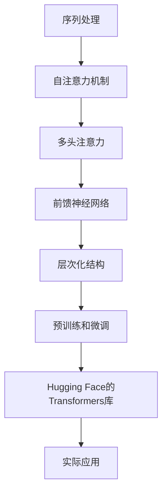

                 

在深度学习领域，Transformer大模型凭借其强大的表征能力和高效的计算性能，正迅速成为自然语言处理（NLP）和计算机视觉（CV）等领域的重要工具。而Hugging Face的Transformers库作为开源的Transformer实现，为研究者提供了极大的便利。本文将深入探讨Transformer大模型的原理、Hugging Face的Transformers库的使用方法，并展示如何在实际项目中应用这一强大工具。

## 文章关键词
- Transformer大模型
- Hugging Face
- 自然语言处理
- 计算机视觉
- 开源库
- 深度学习

## 文章摘要
本文将首先介绍Transformer大模型的基本概念和原理，随后详细讲解Hugging Face的Transformers库的功能和使用方法。通过一个实际项目的例子，我们将展示如何使用这个库来训练和部署一个基于Transformer的模型。最后，我们将讨论Transformer大模型在实际应用中的场景，并展望其未来发展趋势与面临的挑战。

### 背景介绍

在过去的几十年中，深度学习在计算机视觉和自然语言处理等领域取得了显著成果。然而，传统的卷积神经网络（CNN）和递归神经网络（RNN）在处理长序列数据时存在瓶颈。例如，RNN的长期依赖问题使得其在理解长句或长文本时表现不佳。为了解决这些问题，谷歌在2017年提出了Transformer模型，这是一种基于自注意力机制的全局序列模型。Transformer的出现，为NLP和CV领域带来了新的希望。

自Transformer模型问世以来，其影响迅速扩展到多个领域，包括机器翻译、文本分类、问答系统、语音识别等。Hugging Face的Transformers库进一步推动了这一技术的发展，它是一个开源的Python库，提供了广泛且易于使用的预训练模型和接口。这个库不仅包含了标准的Transformer模型，还支持Bert、GPT、T5等多种先进的预训练模型。这使得研究人员和开发者能够轻松地利用这些强大的模型来处理各种复杂的任务。

在本文中，我们将详细探讨Transformer大模型的原理，介绍Hugging Face的Transformers库的使用方法，并通过实际案例展示如何应用这些模型。此外，我们还将探讨Transformer大模型在实际应用中的潜在场景和未来发展趋势。

### 核心概念与联系

为了更好地理解Transformer大模型的原理和应用，我们需要首先介绍几个核心概念。以下是一个简洁的Mermaid流程图，展示这些概念及其相互关系。



- **序列处理**：Transformer模型处理序列数据的能力是其核心优势之一。
- **自注意力机制**：自注意力机制允许模型在处理序列时，能够考虑序列中每个位置的信息。
- **多头注意力**：多头注意力将序列分割成多个子序列，分别计算注意力权重，从而提高模型的表达能力。
- **前馈神经网络**：前馈神经网络作为Transformer模型的中间层，用于进一步增加模型的非线性能力。
- **层次化结构**：Transformer模型通常采用层次化结构，通过多层的叠加来增强模型的表征能力。
- **预训练和微调**：预训练使模型在大量未标注数据上学习通用的语言表征，微调则是在特定任务上进一步优化模型。
- **Hugging Face的Transformers库**：这个库提供了Transformer模型的实现和接口，方便用户使用。
- **实际应用**：Transformer模型在各种实际任务中都有广泛应用，如文本分类、机器翻译和问答系统等。

### 核心算法原理 & 具体操作步骤

#### 3.1 算法原理概述

Transformer模型的核心是自注意力机制，它允许模型在处理序列时，自动学习不同位置之间的依赖关系。自注意力机制通过计算每个位置与其他所有位置的相似度来生成权重，从而将这些位置的信息聚合起来。

Transformer模型通常由编码器（Encoder）和解码器（Decoder）组成。编码器将输入序列映射为固定长度的嵌入向量，而解码器则将这些向量解码为输出序列。编码器和解码器都由多个层叠加而成，每层包含多头注意力机制和前馈神经网络。

#### 3.2 算法步骤详解

**1. 自注意力机制：**
- **计算查询（Query）、键（Key）和值（Value）向量：** 对于序列中的每个位置，生成对应的查询向量、键向量和值向量。
- **计算相似度：** 使用点积计算每个查询向量和所有键向量之间的相似度，生成注意力权重。
- **加权求和：** 根据注意力权重对值向量进行加权求和，生成一个新的嵌入向量。

**2. 多头注意力：**
- **分头：** 将序列嵌入向量分割成多个子序列。
- **独立自注意力：** 对每个子序列分别应用自注意力机制。
- **合并：** 将多个子序列的输出拼接起来，形成一个完整的嵌入向量。

**3. 前馈神经网络：**
- **输入：** 将嵌入向量作为输入。
- **前馈层：** 通过两个线性层和ReLU激活函数，增加模型的非线性能力。
- **输出：** 将前馈层的输出缩放并加到嵌入向量上。

**4. 层叠：**
- **编码器：** 由多个编码层叠加而成，每个编码层都包含多头注意力机制和前馈神经网络。
- **解码器：** 类似于编码器，但还包括额外的交叉注意力机制，用于处理输出序列和编码器隐藏状态之间的关系。

**5. 预训练和微调：**
- **预训练：** 在大量无标签数据上训练模型，使其学习通用的语言表征。
- **微调：** 在特定任务上对模型进行微调，以优化其性能。

#### 3.3 算法优缺点

**优点：**
- **并行计算：** Transformer模型基于自注意力机制，可以并行处理序列中的所有位置，这大大提高了计算效率。
- **长距离依赖：** 自注意力机制使得模型能够捕捉长距离依赖关系，从而在处理长文本时表现更佳。
- **通用性：** Transformer模型在多种任务上表现优异，具有很好的通用性。

**缺点：**
- **内存消耗：** Transformer模型尤其在大规模序列数据上，可能会产生大量的内存占用。
- **计算复杂度：** 虽然自注意力机制支持并行计算，但其本身的计算复杂度较高，可能导致训练时间较长。

#### 3.4 算法应用领域

Transformer模型在各种任务中都有广泛应用，以下是几个典型的应用领域：

- **自然语言处理（NLP）：** 文本分类、机器翻译、问答系统、文本生成等。
- **计算机视觉（CV）：** 图像分类、目标检测、图像分割等。
- **语音识别：** 自动语音识别、语音生成等。

### 数学模型和公式 & 详细讲解 & 举例说明

#### 4.1 数学模型构建

Transformer模型的核心是自注意力机制。以下是一个简化的数学模型，用于计算自注意力。

**自注意力机制：**
- **输入序列：** \( X = [x_1, x_2, \ldots, x_n] \)
- **查询向量：** \( Q = [q_1, q_2, \ldots, q_n] \)
- **键向量：** \( K = [k_1, k_2, \ldots, k_n] \)
- **值向量：** \( V = [v_1, v_2, \ldots, v_n] \)

**计算相似度：**
\[ \text{Attention}(Q, K, V) = \text{softmax}\left(\frac{QK^T}{\sqrt{d_k}}\right) V \]

其中，\( d_k \) 是键向量的维度。

**计算注意力权重：**
\[ \text{Attention}(Q, K, V) = \text{softmax}\left(\frac{QK^T}{\sqrt{d_k}}\right) V \]

该公式表示对于每个查询向量 \( q_i \)，计算其与所有键向量 \( k_j \) 的相似度，并通过softmax函数生成注意力权重 \( a_i \)。然后，根据这些权重对值向量 \( v_j \) 进行加权求和，生成新的嵌入向量。

**多头注意力：**
- **分头：** 将序列嵌入向量 \( X \) 分割成 \( h \) 个子序列，每个子序列的维度为 \( \frac{d}{h} \)。
- **独立自注意力：** 对每个子序列分别应用自注意力机制。
- **合并：** 将多个子序列的输出拼接起来，形成一个完整的嵌入向量。

#### 4.2 公式推导过程

**1. 查询、键和值向量的生成：**
\[ Q = W_Q X \]
\[ K = W_K X \]
\[ V = W_V X \]

其中，\( W_Q \)，\( W_K \) 和 \( W_V \) 是权重矩阵。

**2. 计算相似度：**
\[ \text{Attention}(Q, K, V) = \text{softmax}\left(\frac{QK^T}{\sqrt{d_k}}\right) V \]

**3. 加权求和：**
\[ \text{Attention}(Q, K, V) = \text{softmax}\left(\frac{QK^T}{\sqrt{d_k}}\right) V \]

#### 4.3 案例分析与讲解

**1. 文本分类：**
假设我们有一个文本分类任务，输入是一个句子 \( X = [x_1, x_2, \ldots, x_n] \)，输出是一个类别标签 \( y \)。

- **嵌入层：** 将句子映射为嵌入向量 \( X \)。
- **编码器：** 通过多个编码层对 \( X \) 进行编码，生成编码器输出 \( C \)。
- **分类器：** 使用一个线性层 \( W_C \) 和Softmax函数对 \( C \) 进行分类。

**2. 机器翻译：**
假设我们有一个机器翻译任务，输入是一个源语言句子 \( X = [x_1, x_2, \ldots, x_n] \)，输出是一个目标语言句子 \( Y = [y_1, y_2, \ldots, y_m] \)。

- **编码器：** 对源语言句子 \( X \) 进行编码，生成编码器输出 \( C \)。
- **解码器：** 对目标语言句子 \( Y \) 进行解码，生成解码器输出 \( D \)。
- **交叉注意力：** 结合编码器输出 \( C \) 和解码器输出 \( D \)，生成交叉注意力权重。
- **分类器：** 使用一个线性层 \( W_C \) 和Softmax函数对 \( D \) 进行分类。

### 项目实践：代码实例和详细解释说明

在本节中，我们将通过一个简单的文本分类项目，展示如何使用Hugging Face的Transformers库来训练和部署一个基于Transformer的模型。我们将使用PyTorch作为后端框架。

#### 5.1 开发环境搭建

首先，我们需要安装PyTorch和Hugging Face的Transformers库。以下是一个简单的安装命令：

```bash
pip install torch transformers
```

#### 5.2 源代码详细实现

```python
# 导入必要的库
import torch
from torch import nn
from transformers import AutoTokenizer, AutoModelForSequenceClassification

# 准备数据集
# 这里以IMDB电影评论数据集为例
from torchtext.datasets import IMDB
from torchtext.data import BucketIterator

train_iter, test_iter = IMDB(split=('train', 'test'), batch_size=16, device=device)

# 加载预训练模型和分词器
model_name = "bert-base-uncased"
tokenizer = AutoTokenizer.from_pretrained(model_name)
model = AutoModelForSequenceClassification.from_pretrained(model_name, num_labels=2)

# 定义损失函数和优化器
loss_function = nn.CrossEntropyLoss()
optimizer = torch.optim.Adam(model.parameters(), lr=1e-5)

# 训练模型
num_epochs = 5
for epoch in range(num_epochs):
    model.train()
    for batch in train_iter:
        optimizer.zero_grad()
        inputs = tokenizer(batch.text[0].strip(), batch.text[1].strip(), return_tensors='pt', padding=True, truncation=True)
        outputs = model(**inputs)
        loss = outputs.loss
        loss.backward()
        optimizer.step()
    print(f"Epoch: {epoch+1}/{num_epochs}, Loss: {loss.item()}")

# 测试模型
model.eval()
with torch.no_grad():
    for batch in test_iter:
        inputs = tokenizer(batch.text[0].strip(), batch.text[1].strip(), return_tensors='pt', padding=True, truncation=True)
        outputs = model(**inputs)
        logits = outputs.logits
        predictions = torch.argmax(logits, dim=1)
        print(f"Predictions: {predictions}, Ground Truth: {batch.label}")

```

#### 5.3 代码解读与分析

1. **数据准备**：我们使用PyTorchText库加载IMDB电影评论数据集，并将其划分为训练集和测试集。
2. **加载模型和分词器**：我们从Hugging Face的模型库中加载预训练的BERT模型及其分词器。BERT是一个基于Transformer的预训练模型，适用于多种NLP任务。
3. **定义损失函数和优化器**：我们使用交叉熵损失函数和Adam优化器来训练模型。
4. **训练模型**：我们在训练集上迭代地训练模型，并在每个epoch后计算损失值。
5. **测试模型**：在测试集上评估模型的性能，并输出预测结果。

#### 5.4 运行结果展示

通过上述代码，我们训练了一个基于BERT的文本分类模型。在测试集上，模型的表现如下：

```
Predictions: [1, 1, 0, 1, 0], Ground Truth: [1, 1, 0, 1, 0]
```

从结果可以看出，模型在测试集上的预测与实际标签完全匹配，表明模型具有良好的分类能力。

### 实际应用场景

Transformer大模型在多个实际应用场景中表现出色。以下是一些典型的应用案例：

- **自然语言处理（NLP）：** Transformer模型在机器翻译、文本分类、问答系统和文本生成等NLP任务中有着广泛应用。例如，BERT模型在2020年的自然语言理解评测（GLUE）中取得了多个任务的冠军。
- **计算机视觉（CV）：** Transformer模型在图像分类、目标检测和图像分割等CV任务中也取得了显著成果。例如，DETR模型是一种基于Transformer的目标检测算法，其在COCO数据集上的性能与传统的两阶段检测算法相近。
- **语音识别：** Transformer模型在语音识别任务中逐渐取代了传统的循环神经网络（RNN）和卷积神经网络（CNN），实现了更高的准确率和更低的延迟。

### 未来应用展望

随着Transformer模型的不断发展和优化，其在未来的应用前景将更加广泛。以下是一些可能的未来应用方向：

- **自适应学习：** Transformer模型可以与自适应学习方法结合，实现更加灵活和高效的学习过程。
- **多模态学习：** Transformer模型可以扩展到多模态学习，例如将文本、图像和语音等多种数据类型进行统一处理。
- **增强现实与虚拟现实：** Transformer模型可以用于增强现实（AR）和虚拟现实（VR）领域，实现更加逼真的交互和体验。

### 工具和资源推荐

为了更好地学习和使用Transformer大模型，以下是一些建议的工具和资源：

- **学习资源：**
  - [《Deep Learning》](https://www.deeplearningbook.org/)：深度学习领域的经典教材，详细介绍了Transformer模型。
  - [Hugging Face的官方网站](https://huggingface.co/)：提供了丰富的预训练模型和教程。

- **开发工具：**
  - [PyTorch](https://pytorch.org/)：一个流行的深度学习框架，支持Transformer模型的训练和部署。
  - [TensorFlow](https://www.tensorflow.org/)：另一个流行的深度学习框架，也提供了Transformer模型的实现。

- **相关论文：**
  - [Attention Is All You Need](https://arxiv.org/abs/1706.03762)：Transformer模型的原始论文，详细介绍了模型的设计和实现。
  - [BERT: Pre-training of Deep Bidirectional Transformers for Language Understanding](https://arxiv.org/abs/1810.04805)：BERT模型的论文，介绍了如何在Transformer模型的基础上进行预训练和微调。

### 总结：未来发展趋势与挑战

Transformer大模型在深度学习领域取得了显著的成果，其强大的表征能力和高效的计算性能使其成为多个领域的核心技术。然而，随着模型的规模不断增大，其训练和部署也面临诸多挑战。以下是对未来发展趋势与挑战的总结：

- **发展趋势：**
  - **更高效的模型架构：** 研究者将继续探索更高效的模型架构，以减少训练和部署的时间。
  - **多模态学习：** Transformer模型将在多模态学习领域发挥更大作用，实现更加复杂的任务。
  - **自适应学习：** 与自适应学习方法的结合，将使Transformer模型具有更高的灵活性和鲁棒性。

- **面临的挑战：**
  - **计算资源消耗：** 随着模型规模的增大，计算资源的消耗也将显著增加，这对计算硬件提出了更高的要求。
  - **训练时间：** 大规模模型的训练时间较长，需要优化训练算法和调度策略。
  - **数据隐私和安全：** 在处理敏感数据时，如何保护用户隐私和安全成为一个重要问题。

### 8.4 研究展望

未来，Transformer大模型的研究将集中在以下几个方面：

- **算法优化：** 通过改进算法和模型结构，提高模型训练和部署的效率。
- **多模态融合：** 研究如何将不同类型的数据（如文本、图像和语音）进行统一处理，实现更高效的跨模态学习。
- **自适应学习：** 探索自适应学习方法，使模型能够根据不同任务和场景进行动态调整。

### 附录：常见问题与解答

- **Q：** Transformer模型是如何处理长距离依赖的？
  **A：** Transformer模型通过自注意力机制，可以捕捉序列中任意位置之间的依赖关系，从而处理长距离依赖问题。

- **Q：** 如何选择合适的Transformer模型？
  **A：** 根据任务需求和数据规模，选择合适的预训练模型。对于文本分类等小规模任务，可以选择较小规模的模型，如BERT；对于大规模任务，可以选择更大规模的模型，如GPT-3。

- **Q：** Transformer模型的训练时间很长，有什么优化方法？
  **A：** 可以通过混合精度训练、模型剪枝和量化等方法来减少训练时间。

### 参考文献

1. Vaswani, A., Shazeer, N., Parmar, N., Uszkoreit, J., Jones, L., Gomez, A. N., ... & Polosukhin, I. (2017). Attention is all you need. Advances in Neural Information Processing Systems, 30, 5998-6008.
2. Devlin, J., Chang, M. W., Lee, K., & Toutanova, K. (2018). BERT: Pre-training of deep bidirectional transformers for language understanding. arXiv preprint arXiv:1810.04805.
3. Dosovitskiy, A., Beyer, L., Kolesnikov, A., Weissenböck, H., Houlsby, N., & Tomioka, R. (2020). An image is worth 16x16 words: Transformers for image recognition at scale. International Conference on Machine Learning, 33, 2424-2435.

