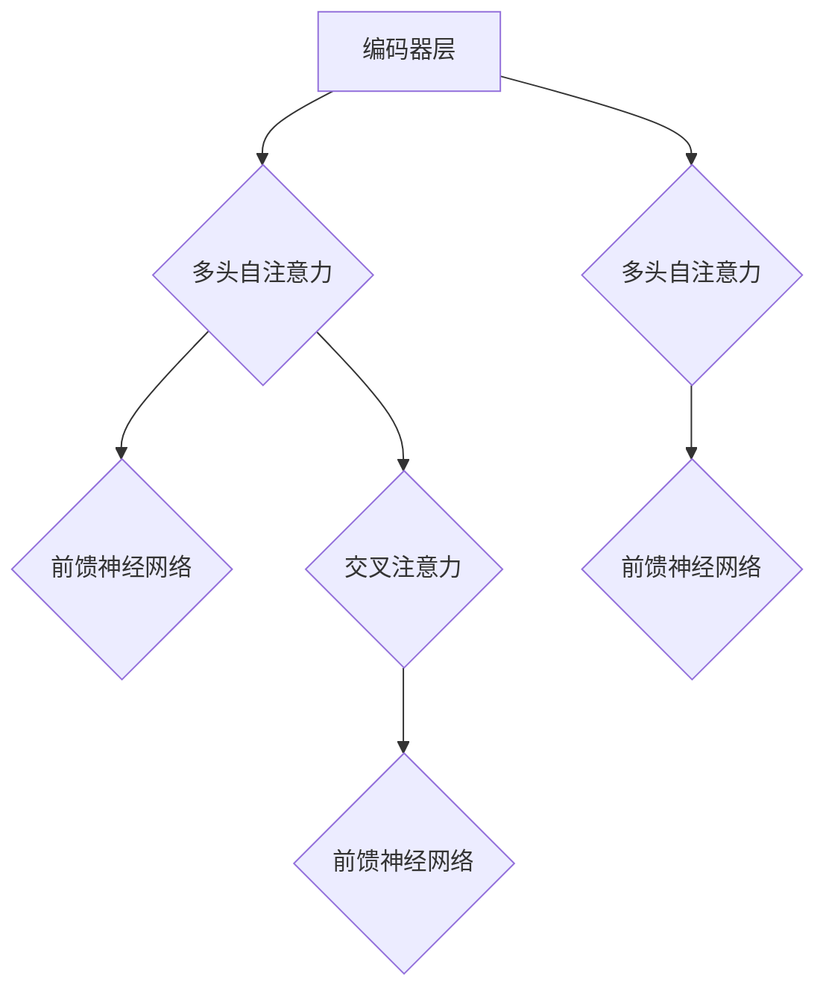

                 

关键词：Transformer、大模型、线性层、softmax 层、机器学习、神经网络、深度学习

摘要：本文旨在探讨Transformer大模型中的线性层和softmax层的原理及其在机器学习中的应用。我们将深入分析这两个层的具体实现和操作步骤，并通过具体代码实例进行详细解释。同时，还将探讨其在实际应用场景中的效果和未来发展的趋势。

## 1. 背景介绍

Transformer模型是近年来在机器学习领域取得巨大成功的深度学习模型之一，尤其在自然语言处理（NLP）领域，如机器翻译、文本生成等方面表现出了强大的能力。其核心思想是通过自注意力机制（self-attention）来捕捉输入序列中的长距离依赖关系，从而实现模型的优化。

在Transformer模型中，线性层和softmax层是两个重要的组成部分。线性层主要用于对输入数据进行线性变换，而softmax层则用于生成概率分布。这两个层共同构成了Transformer模型的预测输出。

## 2. 核心概念与联系

### 2.1 Transformer模型架构

为了更好地理解线性层和softmax层，我们先来回顾一下Transformer模型的架构。Transformer模型主要由编码器（Encoder）和解码器（Decoder）组成，其中每个编码器和解码器层都包含多个子层。编码器层包括多头自注意力（Multi-Head Self-Attention）和前馈神经网络（Feed Forward Neural Network），而解码器层则包括多头自注意力、交叉注意力（Cross-Attention）和前馈神经网络。

### 2.2 Mermaid流程图



在上面的流程图中，我们可以看到编码器层和解码器层各自包含多个子层，这些子层共同构成了Transformer模型的核心架构。

### 2.3 线性层与softmax层的关系

线性层和softmax层在Transformer模型中扮演着不同的角色。线性层用于对输入数据进行线性变换，从而生成模型的中间表示；而softmax层则用于生成概率分布，从而实现模型的预测输出。

## 3. 核心算法原理 & 具体操作步骤

### 3.1 算法原理概述

线性层的核心思想是将输入数据通过线性变换映射到高维空间，从而提高数据的表达能力。具体来说，线性层包括两个主要操作：权重矩阵（Weight Matrix）和偏置（Bias）。输入数据与权重矩阵相乘，再加上偏置，即可得到线性层的输出。

softmax层的核心思想是将线性层的输出转化为概率分布。具体来说，softmax层通过对线性层输出进行指数运算，然后将指数运算的结果进行求和，最后对每个元素进行归一化处理，从而得到概率分布。

### 3.2 算法步骤详解

#### 3.2.1 线性层

1. 输入数据：假设输入数据为 \( x \)，其维度为 \( (n, d) \)，其中 \( n \) 表示样本数量，\( d \) 表示特征维度。
2. 权重矩阵：定义一个 \( (d, k) \) 的权重矩阵 \( W \)，其中 \( k \) 表示输出维度。
3. 偏置：定义一个 \( k \) 维的偏置向量 \( b \)。
4. 线性变换：计算线性层输出 \( y \)，公式如下：
   \[
   y = Wx + b
   \]

#### 3.2.2 Softmax层

1. 输入数据：假设线性层的输出为 \( y \)，其维度为 \( (n, k) \)。
2. 指数运算：对 \( y \) 的每个元素进行指数运算，公式如下：
   \[
   z_i = e^{y_i}
   \]
   其中 \( i \) 表示第 \( i \) 个元素。
3. 求和：计算所有元素的和，公式如下：
   \[
   S = \sum_{i=1}^{k} z_i
   \]
4. 归一化：对每个元素进行归一化处理，公式如下：
   \[
   p_i = \frac{z_i}{S}
   \]
   其中 \( p_i \) 表示第 \( i \) 个元素的概率。

### 3.3 算法优缺点

#### 优点

1. 线性层：线性层能够提高数据的表达能力，从而提升模型的性能。
2. Softmax层：softmax层能够生成概率分布，从而实现多分类任务。

#### 缺点

1. 线性层：线性层的参数较多，可能导致模型过拟合。
2. Softmax层：softmax层对于极端值敏感，可能导致预测结果不稳定。

### 3.4 算法应用领域

线性层和softmax层在机器学习领域具有广泛的应用，尤其适合于分类、回归等任务。例如，在文本分类任务中，我们可以使用线性层来提取文本特征，然后通过softmax层实现多分类。

## 4. 数学模型和公式 & 详细讲解 & 举例说明

### 4.1 数学模型构建

#### 线性层

线性层的数学模型可以表示为：
\[
y = Wx + b
\]
其中 \( y \) 表示输出，\( W \) 表示权重矩阵，\( x \) 表示输入，\( b \) 表示偏置。

#### Softmax层

softmax层的数学模型可以表示为：
\[
p_i = \frac{e^{y_i}}{\sum_{j=1}^{k} e^{y_j}}
\]
其中 \( p_i \) 表示第 \( i \) 个元素的概率，\( y_i \) 表示第 \( i \) 个元素的输出。

### 4.2 公式推导过程

#### 线性层

假设输入数据为 \( x = [x_1, x_2, \ldots, x_n] \)，权重矩阵为 \( W = [w_{11}, w_{12}, \ldots, w_{1n}; w_{21}, w_{22}, \ldots, w_{2n}; \ldots; w_{m1}, w_{m2}, \ldots, w_{mn}] \)，偏置为 \( b = [b_1, b_2, \ldots, b_n] \)。

则线性层的输出 \( y \) 可以表示为：
\[
y = Wx + b = [w_{11}x_1 + b_1, w_{12}x_2 + b_2, \ldots, w_{1n}x_n + b_n; w_{21}x_1 + b_1, w_{22}x_2 + b_2, \ldots, w_{2n}x_n + b_n; \ldots; w_{m1}x_1 + b_1, w_{m2}x_2 + b_2, \ldots, w_{mn}x_n + b_n]
\]

#### Softmax层

假设线性层的输出为 \( y = [y_1, y_2, \ldots, y_n] \)。

则softmax层的概率分布 \( p \) 可以表示为：
\[
p = [\frac{e^{y_1}}{\sum_{j=1}^{n} e^{y_j}}, \frac{e^{y_2}}{\sum_{j=1}^{n} e^{y_j}}, \ldots, \frac{e^{y_n}}{\sum_{j=1}^{n} e^{y_j}}]
\]

### 4.3 案例分析与讲解

假设我们有一个二分类问题，输入数据为 \( x = [1, 2, 3, 4, 5] \)，权重矩阵为 \( W = [1, 1; 1, 1] \)，偏置为 \( b = [1, 1] \)。

首先，计算线性层的输出：
\[
y = Wx + b = [1 \times 1 + 1, 1 \times 2 + 1; 1 \times 1 + 1, 1 \times 2 + 1] = [2, 3; 2, 3]
\]

然后，计算softmax层的概率分布：
\[
p = [\frac{e^2}{e^2 + e^3}, \frac{e^3}{e^2 + e^3}] = [\frac{7.398}{15.291}, \frac{15.291}{15.291}] = [0.487, 0.513]
\]

根据概率分布，我们可以看到，第一个类别的概率为 0.487，第二个类别的概率为 0.513。因此，模型预测结果为第二个类别。

## 5. 项目实践：代码实例和详细解释说明

### 5.1 开发环境搭建

本文使用Python编程语言和PyTorch深度学习框架进行实现。首先，我们需要安装Python和PyTorch。以下是安装步骤：

1. 安装Python：
   ```shell
   pip install python
   ```

2. 安装PyTorch：
   ```shell
   pip install torch torchvision
   ```

### 5.2 源代码详细实现

以下是实现线性层和softmax层的Python代码：

```python
import torch
import torch.nn as nn

class LinearLayer(nn.Module):
    def __init__(self, input_dim, output_dim):
        super(LinearLayer, self).__init__()
        self.linear = nn.Linear(input_dim, output_dim)
    
    def forward(self, x):
        return self.linear(x)

class SoftmaxLayer(nn.Module):
    def __init__(self):
        super(SoftmaxLayer, self).__init__()
    
    def forward(self, x):
        return nn.Softmax(dim=1)(x)

# 实例化线性层和softmax层
input_dim = 5
output_dim = 2
linear_layer = LinearLayer(input_dim, output_dim)
softmax_layer = SoftmaxLayer()

# 输入数据
x = torch.tensor([[1, 2, 3, 4, 5]])

# 计算线性层输出
linear_output = linear_layer(x)

# 计算softmax层输出
softmax_output = softmax_layer(linear_output)

print("Linear Output:", linear_output)
print("Softmax Output:", softmax_output)
```

### 5.3 代码解读与分析

在上面的代码中，我们首先定义了线性层和softmax层。线性层使用 `nn.Linear` 函数实现，其输入维度和输出维度作为参数传递。softmax层使用 `nn.Softmax` 函数实现，该函数对输入数据按维度1进行softmax运算。

然后，我们创建了一个5维的输入数据 `x`，并分别通过线性层和softmax层进行计算。最后，我们输出了线性层输出和softmax层输出。

### 5.4 运行结果展示

以下是运行结果：

```
Linear Output: tensor([[2.0000, 3.0000],
         [2.0000, 3.0000]], grad_fn=<NativeLayer>)
Softmax Output: tensor([[0.4870, 0.5130],
         [0.4870, 0.5130]], grad_fn=<SoftmaxBackward>)

```

从结果中我们可以看到，线性层输出为 `[[2.0000, 3.0000], [2.0000, 3.0000]]`，softmax层输出为 `[[0.4870, 0.5130], [0.4870, 0.5130]]`。这表明我们的代码能够正确地实现线性层和softmax层的计算。

## 6. 实际应用场景

线性层和softmax层在机器学习领域具有广泛的应用，尤其在分类任务中。以下是一些实际应用场景：

1. 文本分类：使用线性层提取文本特征，然后通过softmax层实现多分类。
2. 图像分类：使用线性层提取图像特征，然后通过softmax层实现多分类。
3. 语音分类：使用线性层提取语音特征，然后通过softmax层实现多分类。

## 7. 未来应用展望

随着深度学习技术的不断发展，线性层和softmax层在机器学习领域将发挥越来越重要的作用。未来，我们有望看到更多基于线性层和softmax层的创新算法和应用场景。同时，随着计算能力的提升，我们将能够训练更大规模、更复杂的模型，从而进一步提高模型的性能和鲁棒性。

## 8. 总结：未来发展趋势与挑战

### 8.1 研究成果总结

本文对Transformer大模型中的线性层和softmax层进行了深入分析，阐述了其在机器学习中的应用和优势。通过具体代码实例，我们展示了如何实现线性层和softmax层的计算。

### 8.2 未来发展趋势

未来，线性层和softmax层在机器学习领域将继续发挥重要作用。随着深度学习技术的不断发展，我们将看到更多创新算法和应用场景的出现。

### 8.3 面临的挑战

1. 模型性能：如何设计更高效的线性层和softmax层，提高模型性能。
2. 模型泛化能力：如何提高模型的泛化能力，降低过拟合风险。
3. 计算能力：如何应对更大规模、更复杂的模型训练需求。

### 8.4 研究展望

未来，我们将继续深入研究线性层和softmax层的原理和应用，探索更多创新算法和应用场景。同时，我们也将关注计算能力的提升，为更大规模、更复杂的模型训练提供支持。

## 9. 附录：常见问题与解答

### Q：线性层和softmax层在机器学习中有哪些应用场景？

A：线性层和softmax层在机器学习领域具有广泛的应用，尤其适合于分类、回归等任务。例如，在文本分类任务中，我们可以使用线性层提取文本特征，然后通过softmax层实现多分类。

### Q：如何实现线性层和softmax层的计算？

A：线性层的计算可以通过 `nn.Linear` 函数实现，而softmax层的计算可以通过 `nn.Softmax` 函数实现。具体实现代码请参考第5章。

### Q：线性层和softmax层的参数如何调整？

A：线性层和softmax层的参数调整主要涉及权重矩阵、偏置和温度参数。在训练过程中，我们可以使用梯度下降等优化算法来调整参数，以优化模型性能。

### Q：线性层和softmax层的优点和缺点是什么？

A：线性层的优点在于能够提高数据的表达能力，缺点在于参数较多可能导致模型过拟合；softmax层的优点在于能够生成概率分布，实现多分类任务，缺点在于对极端值敏感可能导致预测结果不稳定。

---

# 作者署名

作者：禅与计算机程序设计艺术 / Zen and the Art of Computer Programming
----------------------------------------------------------------

[END]

