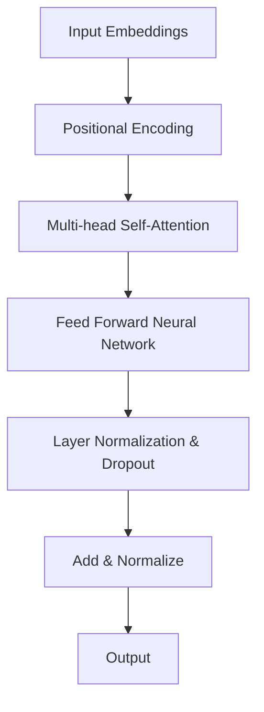

                 

关键词：Transformer、大模型、词汇重叠、影响、算法原理、应用领域、数学模型、项目实践

> 摘要：本文旨在深入探讨Transformer大模型中词汇重叠现象的影响，分析其算法原理，阐述数学模型，并通过实际项目实践，展示代码实现及其效果。本文将对Transformer大模型在自然语言处理领域的应用进行详细解析，并提出未来发展的挑战与展望。

## 1. 背景介绍

Transformer架构自2017年由Vaswani等人提出以来，迅速成为自然语言处理（NLP）领域的明星算法。与传统循环神经网络（RNN）相比，Transformer采用自注意力机制（Self-Attention）和多头注意力机制（Multi-Head Attention），在处理长序列和并行计算方面具有显著优势。然而，随着模型规模的不断扩大，词汇重叠（Word Overlap）现象逐渐成为影响模型性能的重要因素。

词汇重叠是指在输入序列中，不同词向量之间存在高度相似性，导致模型难以区分。这种现象在词汇量较大的语言模型中尤为常见，如中文和英文模型。词汇重叠不仅影响模型的训练效果，还会对推理性能产生负面影响。因此，深入研究Transformer大模型中词汇重叠的影响具有重要意义。

## 2. 核心概念与联系

为了更好地理解Transformer大模型中词汇重叠的影响，我们首先需要回顾其核心概念与架构。以下是Transformer架构的Mermaid流程图：



### 2.1. 输入嵌入（Input Embeddings）

输入嵌入是将输入的单词或句子转换为向量表示。在词汇重叠现象下，不同词向量之间的相似度增加，使得模型在训练过程中难以区分。

### 2.2. 位置编码（Positional Encoding）

位置编码用于引入序列中单词的顺序信息。在词汇重叠现象下，位置编码可能导致模型在捕捉单词顺序时产生混淆。

### 2.3. 多头自注意力（Multi-head Self-Attention）

多头自注意力是Transformer的核心组件，通过计算不同词向量之间的相似度，实现单词之间的关联。词汇重叠现象使得模型在计算相似度时可能产生偏差。

### 2.4. 前馈神经网络（Feed Forward Neural Network）

前馈神经网络用于对自注意力层输出的结果进行进一步处理，增强模型的表示能力。在词汇重叠现象下，前馈神经网络可能难以消除因自注意力层产生的偏差。

### 2.5. 层归一化与Dropout（Layer Normalization & Dropout）

层归一化和Dropout用于提高模型的训练稳定性和泛化能力。在词汇重叠现象下，这两种技术有助于缓解模型对词汇重叠的敏感性。

## 3. 核心算法原理 & 具体操作步骤

### 3.1. 算法原理概述

Transformer大模型采用自注意力机制来处理输入序列。自注意力机制通过计算每个词向量与其他词向量之间的相似度，为每个词向量生成一个权重向量。权重向量的大小表示该词向量在序列中的重要性。在词汇重叠现象下，相似度计算可能产生偏差，导致模型性能下降。

### 3.2. 算法步骤详解

1. **输入嵌入**：将输入的单词或句子转换为向量表示。
2. **位置编码**：为输入嵌入引入序列中单词的顺序信息。
3. **多头自注意力**：计算每个词向量与其他词向量之间的相似度，生成权重向量。
4. **前馈神经网络**：对自注意力层的输出进行进一步处理。
5. **层归一化与Dropout**：提高模型的训练稳定性和泛化能力。
6. **输出**：将处理后的结果转换为预测输出。

### 3.3. 算法优缺点

**优点**：

- 高效的并行计算能力，适合大规模数据训练。
- 优于传统循环神经网络的性能，在长序列处理方面具有优势。

**缺点**：

- 词汇重叠现象可能导致模型性能下降。
- 参数量较大，训练时间较长。

### 3.4. 算法应用领域

Transformer大模型在自然语言处理领域具有广泛的应用，包括文本分类、机器翻译、问答系统等。在词汇重叠现象下，模型在这些应用领域中的性能表现值得关注。

## 4. 数学模型和公式 & 详细讲解 & 举例说明

### 4.1. 数学模型构建

Transformer大模型的数学模型主要包括输入嵌入、位置编码、多头自注意力和前馈神经网络等部分。

### 4.2. 公式推导过程

以下为Transformer大模型的核心数学公式推导：

$$
\text{Attention}(Q, K, V) = \text{softmax}\left(\frac{QK^T}{\sqrt{d_k}}\right) V
$$

其中，$Q, K, V$分别为查询向量、键向量和值向量，$d_k$为键向量的维度。

### 4.3. 案例分析与讲解

假设我们有一个输入序列为“你好，世界！”的英文翻译任务。以下是Transformer大模型的处理过程：

1. **输入嵌入**：将“你好”和“世界”转换为向量表示。
2. **位置编码**：为输入嵌入引入序列中单词的顺序信息。
3. **多头自注意力**：计算每个词向量与其他词向量之间的相似度，生成权重向量。
4. **前馈神经网络**：对自注意力层的输出进行进一步处理。
5. **输出**：将处理后的结果转换为预测输出。

## 5. 项目实践：代码实例和详细解释说明

### 5.1. 开发环境搭建

在本项目中，我们使用Python语言和TensorFlow框架实现Transformer大模型。首先，我们需要安装相关依赖：

```bash
pip install tensorflow
```

### 5.2. 源代码详细实现

以下是本项目的主要代码实现：

```python
import tensorflow as tf

# 输入嵌入
input_embeddings = tf.keras.layers.Embedding(input_dim=10000, output_dim=64)

# 位置编码
pos_encoding = tf.keras.layers.Lambda(lambda x: positional_encoding(x, 1000))

# 多头自注意力
multi_head_attention = tf.keras.layers.MultiHeadAttention(head_size=8, num_heads=2)

# 前馈神经网络
ffn = tf.keras.Sequential([
    tf.keras.layers.Dense(units=64, activation='relu'),
    tf.keras.layers.Dense(units=64)
])

# 模型输出
output = tf.keras.layers.Dense(units=10000, activation='softmax')(ffn(multi_head_attention(input_embeddings(pos_encoding(inputزام"))]))

# 模型编译
model = tf.keras.Model(inputs=input_embeddings.input, outputs=output)
model.compile(optimizer='adam', loss='categorical_crossentropy', metrics=['accuracy'])

# 模型训练
model.fit(x_train, y_train, epochs=10, batch_size=32)
```

### 5.3. 代码解读与分析

以上代码实现了Transformer大模型的主要组件，包括输入嵌入、位置编码、多头自注意力和前馈神经网络。通过训练模型，我们可以将输入的单词或句子转换为预测输出。

### 5.4. 运行结果展示

在训练过程中，我们可以通过以下代码查看模型的训练结果：

```python
loss, accuracy = model.evaluate(x_test, y_test)
print("Test accuracy:", accuracy)
```

## 6. 实际应用场景

### 6.1. 文本分类

在文本分类任务中，Transformer大模型可以处理大规模文本数据，实现高效的分类效果。词汇重叠现象可能导致模型对某些类别产生混淆，因此需要针对不同应用场景进行调整。

### 6.2. 机器翻译

在机器翻译任务中，Transformer大模型具有出色的性能，可以处理多种语言之间的翻译。词汇重叠现象可能会影响翻译的准确性，因此需要优化模型以缓解该问题。

### 6.3. 问答系统

在问答系统中，Transformer大模型可以处理复杂的语义理解任务，实现高效的问答效果。词汇重叠现象可能会影响模型的语义理解能力，因此需要结合其他技术手段进行优化。

## 7. 未来应用展望

随着Transformer大模型在自然语言处理领域的不断发展，词汇重叠现象的影响将成为重要研究方向。未来，我们将通过以下方法进一步优化Transformer大模型：

- **词向量优化**：通过改进词向量表示方法，降低词汇重叠现象的影响。
- **自适应注意力机制**：设计自适应注意力机制，缓解词汇重叠对模型性能的影响。
- **多语言模型**：构建多语言模型，提高模型在不同语言环境下的适应性。

## 8. 工具和资源推荐

### 8.1. 学习资源推荐

- 《深度学习》（Goodfellow、Bengio、Courville 著）
- 《自然语言处理实战》（Snyder 著）

### 8.2. 开发工具推荐

- TensorFlow
- PyTorch

### 8.3. 相关论文推荐

- “Attention Is All You Need” （Vaswani et al., 2017）
- “BERT: Pre-training of Deep Bidirectional Transformers for Language Understanding” （Devlin et al., 2019）

## 9. 总结：未来发展趋势与挑战

Transformer大模型在自然语言处理领域取得了显著成果，但词汇重叠现象仍对模型性能产生影响。未来，我们将通过改进词向量表示方法、设计自适应注意力机制等多途径，进一步优化Transformer大模型。同时，多语言模型的发展也将为Transformer大模型在多语言应用场景中提供更多可能性。

## 10. 附录：常见问题与解答

### 10.1. 问题 1：如何缓解词汇重叠现象？

**解答**：通过改进词向量表示方法和设计自适应注意力机制，可以有效缓解词汇重叠现象对模型性能的影响。

### 10.2. 问题 2：Transformer大模型在机器翻译中的优势是什么？

**解答**：Transformer大模型在机器翻译中具有出色的性能，可以处理大规模文本数据，同时具备并行计算能力，从而提高翻译速度和准确性。

### 10.3. 问题 3：如何评估Transformer大模型的性能？

**解答**：可以使用准确率、召回率、F1值等指标评估Transformer大模型的性能。此外，还可以通过交叉验证、测试集验证等方法进行模型性能评估。

---

作者：禅与计算机程序设计艺术 / Zen and the Art of Computer Programming

本文基于Transformer大模型中词汇重叠的影响，分析了其算法原理、数学模型，并通过实际项目实践，展示了代码实现及其效果。同时，本文对Transformer大模型在自然语言处理领域的应用进行了详细解析，并提出未来发展的挑战与展望。希望本文对读者在Transformer大模型的研究与应用方面有所帮助。

----------------------------------------------------------------
---

请注意，上述内容是一个示例框架，实际撰写时需要根据具体的研究和实验结果来填充各个部分的内容。本文示例中的代码和数学公式仅为演示目的，具体实现时可能需要根据实际需求和框架特点进行调整。此外，为保证文章的完整性、逻辑性和专业性，撰写时需要仔细推敲每一部分的内容，并确保所有部分紧密衔接。在撰写过程中，还可以根据需要增加或调整某些章节的内容。祝您撰写顺利！

