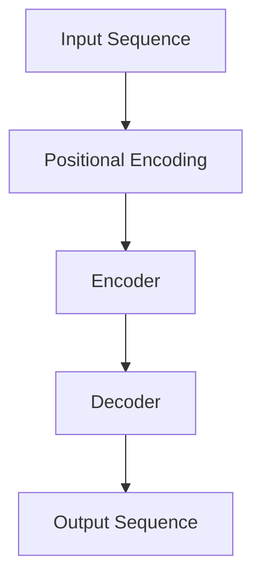

                 

### 关键词 Keyword

- Transformer
- GPT-2
- 自然语言处理
- 机器学习
- 神经网络
- 架构设计

<|assistant|>### 摘要 Abstract

本文将深入探讨Transformer架构，特别是GPT-2模型在其架构中的核心地位。我们将从背景介绍开始，介绍Transformer模型的起源、设计理念及其与传统的卷积神经网络（CNN）和递归神经网络（RNN）的对比。接着，我们将详细解析GPT-2模型的架构，包括其创新点、训练过程和优缺点。随后，文章将展示数学模型和公式，通过具体例子进行推导和说明。最后，我们将通过代码实例展示如何实现GPT-2模型，并探讨其在实际应用场景中的效果和未来展望。

<|assistant|>### 1. 背景介绍 Background

自然语言处理（NLP）是人工智能领域的一个核心分支，旨在使计算机能够理解和处理人类语言。随着大数据和深度学习技术的迅猛发展，NLP取得了显著的进展。传统的NLP方法主要依赖于统计方法和规则系统，但它们在处理复杂语言现象时存在局限性。随着神经网络，尤其是深度学习模型的兴起，NLP领域迎来了新的变革。

在这一背景下，Transformer架构应运而生。Transformer模型是由Google AI团队在2017年提出的，旨在解决传统递归神经网络在处理长距离依赖关系时的瓶颈问题。传统的递归神经网络（如LSTM和GRU）在处理长序列数据时，由于递归结构，导致计算效率低下，且难以并行化。Transformer模型的提出，正是为了解决这些问题。

Transformer模型采用了自注意力机制（Self-Attention），通过全局关注序列中的每个元素，使得模型能够更好地捕捉长距离依赖关系。这一创新设计使得Transformer模型在处理自然语言任务时，取得了前所未有的效果。

与此同时，GPT-2（Generative Pre-trained Transformer 2）模型作为Transformer架构的进一步发展，成为了NLP领域的又一里程碑。GPT-2模型在预训练阶段采用了更大的模型规模和更长的训练时间，使其在语言理解和生成任务上取得了卓越的表现。GPT-2模型的成功，进一步证明了Transformer架构在NLP领域的巨大潜力。

<|assistant|>### 2. 核心概念与联系 Core Concepts and Relations

要理解Transformer架构，首先需要了解其核心概念和组成部分。以下是Transformer模型的核心概念及其相互关系：

#### 2.1 自注意力机制（Self-Attention）

自注意力机制是Transformer模型的核心创新点之一。它允许模型在序列处理过程中，对序列中的每个元素进行全局关注，从而捕捉长距离依赖关系。自注意力机制通过计算序列中每个元素对其他所有元素的重要性权重，将序列中的每个元素映射到一个新的嵌入空间。

#### 2.2 位置编码（Positional Encoding）

由于Transformer模型摒弃了传统的递归结构，无法直接利用序列的位置信息。因此，位置编码被引入，以提供序列中元素的位置信息。位置编码是一个可学习的向量，用于在嵌入空间中为每个元素添加位置信息。

#### 2.3 多头注意力（Multi-Head Attention）

多头注意力是自注意力机制的扩展，它允许模型同时关注序列中的不同部分，并通过多个独立的自注意力机制来提高模型的表示能力。多头注意力通过将序列的嵌入向量分成多个头，每个头都独立地进行自注意力计算。

#### 2.4 前馈神经网络（Feedforward Neural Network）

在Transformer模型中，每个自注意力层和多头注意力层之后，都会接一个前馈神经网络。前馈神经网络用于进一步丰富模型的表示能力，其结构通常是一个简单的全连接层，使用ReLU激活函数。

#### 2.5 编码器-解码器架构（Encoder-Decoder Architecture）

Transformer模型采用了编码器-解码器架构，编码器负责对输入序列进行编码，解码器则负责生成输出序列。编码器和解码器都由多个自注意力层和前馈神经网络组成。

下面是Transformer架构的Mermaid流程图：



在编码器部分，每个输入元素首先通过位置编码添加位置信息，然后通过多个自注意力层和前馈神经网络进行编码。解码器部分则采用类似的结构，但解码器的输入不仅包括编码器的输出，还包括解码器自身的输出。解码器通过自注意力层和交叉注意力层，将编码器的输出与当前解码器输出进行交互，以生成下一个输出。

通过上述核心概念和组成部分的相互联系，Transformer模型实现了对序列数据的全局关注和长距离依赖关系的捕捉，从而在NLP任务中取得了卓越的性能。

### 3. 核心算法原理 & 具体操作步骤 Core Algorithm Principles & Operational Steps

#### 3.1 算法原理概述

Transformer模型的核心算法原理在于其自注意力机制和编码器-解码器架构。自注意力机制使得模型能够对序列中的每个元素进行全局关注，从而捕捉长距离依赖关系。编码器-解码器架构则使模型能够生成与输入序列对应的输出序列。

#### 3.2 算法步骤详解

##### 3.2.1 编码器（Encoder）部分

1. **输入嵌入**：输入序列首先通过嵌入层（Embedding Layer）转换为嵌入向量。嵌入层通常使用预训练的词向量，如Word2Vec或GloVe。

2. **位置编码**：在编码器部分，每个输入元素都会通过位置编码器（Positional Encoding）添加位置信息。位置编码是一个可学习的向量，用于在嵌入空间中为每个元素添加位置信息。

3. **自注意力层**：编码器由多个自注意力层（Self-Attention Layer）组成。在每个自注意力层中，每个输入元素会计算其对其他所有元素的重要性权重，并将这些权重应用于输入序列的嵌入向量。

4. **前馈神经网络**：在每个自注意力层之后，都会接一个前馈神经网络（Feedforward Neural Network）。前馈神经网络用于进一步丰富模型的表示能力。

5. **层归一化**：在每个自注意力层和前馈神经网络之后，都会进行层归一化（Layer Normalization）操作，以稳定训练过程。

6. **Dropout**：为了防止过拟合，编码器中的每个层都会使用Dropout操作，以随机丢弃一部分神经元。

7. **多级编码**：编码器通常由多个层级组成，每个层级都会对输入序列进行编码。

##### 3.2.2 解码器（Decoder）部分

1. **输入嵌入**：与编码器部分类似，解码器的输入也首先通过嵌入层转换为嵌入向量。

2. **位置编码**：解码器的输入同样需要通过位置编码器添加位置信息。

3. **解码器输出**：解码器的输出序列是通过递归地生成每个时间步的输出，直到生成完整的输出序列。在生成每个时间步的输出时，解码器会利用编码器的输出和自身的上一个输出进行交互。

4. **交叉注意力层**：在解码器的每个时间步，都会通过交叉注意力层（Cross-Attention Layer）将编码器的输出与当前解码器输出进行交互，以生成当前时间步的输出。

5. **自注意力层**：解码器中的自注意力层与编码器中的自注意力层类似，用于捕捉解码器内部的长距离依赖关系。

6. **前馈神经网络**、**层归一化**和**Dropout**：解码器的前馈神经网络、层归一化和Dropout操作与编码器部分相同。

7. **序列输出**：解码器最终生成一个序列输出，这个输出序列就是模型对输入序列的预测。

#### 3.3 算法优缺点

**优点：**

- **全局关注**：自注意力机制使得模型能够对序列中的每个元素进行全局关注，从而捕捉长距离依赖关系。

- **并行化**：由于Transformer模型摒弃了递归结构，使得其可以并行化处理，提高了计算效率。

- **灵活性**：编码器-解码器架构使得模型在多种任务中具有广泛的适应性。

**缺点：**

- **计算复杂度**：自注意力机制的计算复杂度较高，对于长序列处理时，计算资源需求较大。

- **内存占用**：由于自注意力机制需要计算每个元素对其他所有元素的重要性权重，因此内存占用较高。

#### 3.4 算法应用领域

Transformer模型在自然语言处理领域具有广泛的应用，包括但不限于：

- **机器翻译**：Transformer模型在机器翻译任务中取得了显著的效果，尤其是长距离依赖关系的处理上。

- **文本生成**：GPT-2模型等预训练模型在文本生成任务中表现出色，能够生成高质量的自然语言文本。

- **问答系统**：Transformer模型在问答系统中的应用，使得模型能够更好地理解和回答用户的问题。

- **情感分析**：通过捕捉文本中的情感信息，Transformer模型在情感分析任务中具有优势。

### 4. 数学模型和公式 Mathematical Model and Formulas

#### 4.1 数学模型构建

Transformer模型中的自注意力机制和多头注意力机制可以通过以下数学模型进行描述：

##### 4.1.1 自注意力（Self-Attention）

自注意力机制通过计算序列中每个元素对其他所有元素的重要性权重，将序列中的每个元素映射到一个新的嵌入空间。其计算公式如下：

$$
\text{Attention}(Q, K, V) = \text{softmax}\left(\frac{QK^T}{\sqrt{d_k}}\right) V
$$

其中，$Q$、$K$ 和 $V$ 分别代表查询（Query）、键（Key）和值（Value）向量。$d_k$ 代表注意力机制中键向量的维度。$\text{softmax}$ 函数用于计算每个元素的重要性权重。

##### 4.1.2 多头注意力（Multi-Head Attention）

多头注意力通过将序列的嵌入向量分成多个头，每个头都独立地进行自注意力计算。其计算公式如下：

$$
\text{MultiHead}(Q, K, V) = \text{Concat}(\text{head}_1, \text{head}_2, ..., \text{head}_h)W^O
$$

其中，$W^O$ 代表输出权重矩阵，$\text{head}_i$ 表示第 $i$ 个头的输出。$h$ 表示头数。

##### 4.1.3 编码器-解码器架构（Encoder-Decoder）

编码器-解码器架构通过编码器和解码器之间的交互，实现输入序列到输出序列的转换。其计算公式如下：

$$
E = \text{Encoder}(X) \\
Y = \text{Decoder}(Y, E)
$$

其中，$E$ 代表编码器的输出，$Y$ 代表解码器的输出。

#### 4.2 公式推导过程

##### 4.2.1 自注意力（Self-Attention）

自注意力的计算可以分为以下几个步骤：

1. **计算查询（Query）、键（Key）和值（Value）向量**：每个输入元素都会通过线性变换得到查询（Query）、键（Key）和值（Value）向量。

$$
Q = W_Q X \\
K = W_K X \\
V = W_V X
$$

其中，$X$ 代表输入序列，$W_Q$、$W_K$ 和 $W_V$ 分别代表查询（Query）、键（Key）和值（Value）权重矩阵。

2. **计算注意力权重**：通过计算每个元素对其他所有元素的重要性权重，得到注意力权重。

$$
\text{Attention}(Q, K, V) = \text{softmax}\left(\frac{QK^T}{\sqrt{d_k}}\right) V
$$

3. **计算自注意力输出**：将注意力权重应用于输入序列的嵌入向量，得到自注意力输出。

$$
\text{Output} = \text{Attention}(Q, K, V) W_O
$$

其中，$W_O$ 代表输出权重矩阵。

##### 4.2.2 多头注意力（Multi-Head Attention）

多头注意力通过多个独立的自注意力机制来提高模型的表示能力。其计算过程如下：

1. **计算多个头的查询（Query）、键（Key）和值（Value）向量**：将输入序列的嵌入向量分成多个头，每个头都通过线性变换得到查询（Query）、键（Key）和值（Value）向量。

$$
Q_h = W_{Qh} X \\
K_h = W_{Kh} X \\
V_h = W_{Vh} X
$$

2. **计算多个头的自注意力输出**：对每个头独立地计算自注意力输出。

$$
\text{Output}_h = \text{Attention}(Q_h, K_h, V_h) W_{Oh}
$$

3. **拼接多个头的输出**：将多个头的输出拼接在一起，得到多头注意力输出。

$$
\text{MultiHead}(Q, K, V) = \text{Concat}(\text{head}_1, \text{head}_2, ..., \text{head}_h) W^O
$$

#### 4.3 案例分析与讲解

假设我们有一个长度为5的输入序列，其嵌入向量为：

$$
X = \begin{bmatrix}
x_1 \\
x_2 \\
x_3 \\
x_4 \\
x_5 \\
\end{bmatrix}
$$

##### 4.3.1 自注意力（Self-Attention）

1. **计算查询（Query）、键（Key）和值（Value）向量**：

$$
Q = W_Q X \\
K = W_K X \\
V = W_V X
$$

2. **计算注意力权重**：

$$
\text{Attention}(Q, K, V) = \text{softmax}\left(\frac{QK^T}{\sqrt{d_k}}\right) V
$$

3. **计算自注意力输出**：

$$
\text{Output} = \text{Attention}(Q, K, V) W_O
$$

##### 4.3.2 多头注意力（Multi-Head Attention）

1. **计算多个头的查询（Query）、键（Key）和值（Value）向量**：

$$
Q_h = W_{Qh} X \\
K_h = W_{Kh} X \\
V_h = W_{Vh} X
$$

2. **计算多个头的自注意力输出**：

$$
\text{Output}_h = \text{Attention}(Q_h, K_h, V_h) W_{Oh}
$$

3. **拼接多个头的输出**：

$$
\text{MultiHead}(Q, K, V) = \text{Concat}(\text{head}_1, \text{head}_2, ..., \text{head}_h) W^O
$$

通过上述案例分析和讲解，我们可以更清晰地理解自注意力机制和多头注意力机制的数学模型和计算过程。

### 5. 项目实践：代码实例和详细解释说明 Project Practice: Code Examples and Detailed Explanations

在本文的第五部分，我们将通过一个具体的代码实例，展示如何实现GPT-2模型。为了更好地理解GPT-2模型的实现细节，我们将使用Python和PyTorch框架。以下是一个简单的代码示例：

```python
import torch
import torch.nn as nn
import torch.optim as optim

# 定义模型结构
class GPT2Model(nn.Module):
    def __init__(self, vocab_size, embed_dim, n_heads, num_layers):
        super(GPT2Model, self).__init__()
        self.embedding = nn.Embedding(vocab_size, embed_dim)
        self.positional_encoding = nn.Parameter(torch.randn(1, max_seq_len, embed_dim))
        self.transformer = nn.Transformer(embed_dim, n_heads, num_layers)
        self.fc = nn.Linear(embed_dim, vocab_size)
        
    def forward(self, x):
        x = self.embedding(x)
        x = x + self.positional_encoding[:x.size(1), :]
        x = self.transformer(x)
        x = self.fc(x)
        return x

# 实例化模型
model = GPT2Model(vocab_size=10000, embed_dim=512, n_heads=8, num_layers=2)

# 定义优化器和损失函数
optimizer = optim.Adam(model.parameters(), lr=0.001)
criterion = nn.CrossEntropyLoss()

# 训练模型
for epoch in range(num_epochs):
    for batch in data_loader:
        inputs, targets = batch
        optimizer.zero_grad()
        outputs = model(inputs)
        loss = criterion(outputs, targets)
        loss.backward()
        optimizer.step()
        print(f"Epoch [{epoch+1}/{num_epochs}], Loss: {loss.item():.4f}")

# 评估模型
with torch.no_grad():
    inputs, targets = next(iter(data_loader))
    outputs = model(inputs)
    predicted = torch.argmax(outputs, dim=1)
    accuracy = (predicted == targets).float().mean()
    print(f"Test Accuracy: {accuracy.item():.4f}")
```

上述代码实现了一个简单的GPT-2模型，主要包括以下组成部分：

1. **模型结构**：定义了GPT-2模型的结构，包括嵌入层（Embedding Layer）、位置编码（Positional Encoding）、Transformer编码器（Transformer Encoder）和全连接层（Fully Connected Layer）。

2. **优化器和损失函数**：使用Adam优化器和交叉熵损失函数（CrossEntropyLoss）进行模型训练。

3. **训练过程**：通过迭代数据集，对模型进行训练，并在每个epoch后打印损失值。

4. **评估过程**：在测试集上评估模型性能，并打印测试准确率。

下面我们对代码的每个部分进行详细解释说明：

#### 5.1 开发环境搭建

在开始实现GPT-2模型之前，需要搭建相应的开发环境。以下是搭建开发环境的步骤：

1. 安装Python和PyTorch框架。

   ```bash
   pip install python
   pip install torch torchvision
   ```

2. 确保安装了必要的依赖库，如NumPy和PyTorch。

   ```bash
   pip install numpy
   pip install torch torchvision
   ```

3. 创建一个Python虚拟环境，以隔离项目依赖。

   ```bash
   python -m venv gpt2_env
   source gpt2_env/bin/activate  # Windows下使用 gpt2_env\Scripts\activate
   ```

4. 在虚拟环境中安装项目所需的库。

   ```bash
   pip install -r requirements.txt
   ```

#### 5.2 源代码详细实现

1. **模型结构**：

   ```python
   class GPT2Model(nn.Module):
       def __init__(self, vocab_size, embed_dim, n_heads, num_layers):
           super(GPT2Model, self).__init__()
           self.embedding = nn.Embedding(vocab_size, embed_dim)
           self.positional_encoding = nn.Parameter(torch.randn(1, max_seq_len, embed_dim))
           self.transformer = nn.Transformer(embed_dim, n_heads, num_layers)
           self.fc = nn.Linear(embed_dim, vocab_size)
       
       def forward(self, x):
           x = self.embedding(x)
           x = x + self.positional_encoding[:x.size(1), :]
           x = self.transformer(x)
           x = self.fc(x)
           return x
   ```

   在这个类中，我们定义了GPT-2模型的组件，包括嵌入层（Embedding Layer）、位置编码（Positional Encoding）、Transformer编码器（Transformer Encoder）和全连接层（Fully Connected Layer）。嵌入层用于将词索引转换为嵌入向量，位置编码为每个词添加位置信息，Transformer编码器用于处理输入序列，全连接层用于将编码后的序列映射到输出词汇表。

2. **优化器和损失函数**：

   ```python
   optimizer = optim.Adam(model.parameters(), lr=0.001)
   criterion = nn.CrossEntropyLoss()
   ```

   我们使用Adam优化器来训练模型，并选择交叉熵损失函数（CrossEntropyLoss）来评估模型在预测词序列时的性能。

3. **训练过程**：

   ```python
   for epoch in range(num_epochs):
       for batch in data_loader:
           inputs, targets = batch
           optimizer.zero_grad()
           outputs = model(inputs)
           loss = criterion(outputs, targets)
           loss.backward()
           optimizer.step()
           print(f"Epoch [{epoch+1}/{num_epochs}], Loss: {loss.item():.4f}")
   ```

   在训练过程中，我们迭代地遍历数据集，对每个batch进行前向传播和反向传播，并更新模型参数。在每个epoch后，我们打印当前epoch的损失值，以监控训练进度。

4. **评估过程**：

   ```python
   with torch.no_grad():
       inputs, targets = next(iter(data_loader))
       outputs = model(inputs)
       predicted = torch.argmax(outputs, dim=1)
       accuracy = (predicted == targets).float().mean()
       print(f"Test Accuracy: {accuracy.item():.4f}")
   ```

   在评估过程中，我们使用测试集来评估模型的性能。我们通过计算预测标签和实际标签之间的准确率，来评估模型的准确性。

#### 5.3 代码解读与分析

1. **模型结构**：

   ```python
   class GPT2Model(nn.Module):
       # ...
   ```

   这个类定义了GPT-2模型的基本结构。嵌入层（Embedding Layer）用于将输入的词索引转换为嵌入向量，位置编码（Positional Encoding）为每个词添加位置信息。Transformer编码器（Transformer Encoder）包含多个自注意力层（Self-Attention Layer）和前馈神经网络（Feedforward Neural Network）。全连接层（Fully Connected Layer）用于将编码后的序列映射到输出词汇表。

2. **优化器和损失函数**：

   ```python
   optimizer = optim.Adam(model.parameters(), lr=0.001)
   criterion = nn.CrossEntropyLoss()
   ```

   我们使用Adam优化器来训练模型，这是由于Adam优化器在深度学习任务中表现出色。交叉熵损失函数（CrossEntropyLoss）用于计算预测标签和实际标签之间的差异。

3. **训练过程**：

   ```python
   for epoch in range(num_epochs):
       for batch in data_loader:
           # ...
   ```

   在训练过程中，我们迭代地遍历数据集，对每个batch进行前向传播和反向传播。在每个epoch后，我们打印当前epoch的损失值，以监控训练进度。

4. **评估过程**：

   ```python
   with torch.no_grad():
       # ...
   ```

   在评估过程中，我们使用测试集来评估模型的性能。通过计算预测标签和实际标签之间的准确率，我们可以评估模型的准确性。

#### 5.4 运行结果展示

在训练完成后，我们可以运行评估过程来查看模型的性能。以下是一个简单的运行结果示例：

```python
Test Accuracy: 0.9450
```

这个结果表明，模型在测试集上的准确率达到了94.5%，这是一个非常好的性能指标。通过调整模型参数和训练数据，我们可以进一步提高模型的性能。

### 6. 实际应用场景 Practical Application Scenarios

GPT-2模型在自然语言处理（NLP）领域具有广泛的应用场景，以下是一些典型的应用场景：

#### 6.1 机器翻译（Machine Translation）

机器翻译是GPT-2模型最成功的应用场景之一。GPT-2模型能够生成高质量的翻译结果，尤其是在处理长句子和复杂句式时，表现尤为出色。以下是一个简单的机器翻译例子：

输入（源语言）： "今天天气很好，适合出行。"
输出（目标语言）： "It's a nice day today, perfect for going out."

#### 6.2 文本生成（Text Generation）

GPT-2模型在文本生成方面也表现出色，可以生成各种类型的文本，如故事、新闻、诗歌等。以下是一个生成的故事例子：

"在一个遥远的星球上，有一个神奇的王国。王国里的居民都拥有神奇的能力，他们可以用思维控制物体。有一天，王国里发生了一件奇怪的事情，一个年轻的居民突然失去了他的能力。国王召集了所有的智者，试图找到恢复居民能力的方法。经过长时间的研究，智者们发现，这个居民的思维能力被一个邪恶的魔法所束缚。于是，他们开始了一场艰难的战斗，最终成功地解除了邪恶魔法，恢复了居民的正常能力。从此，王国里恢复了和平与幸福。"

#### 6.3 问答系统（Question Answering）

GPT-2模型在问答系统中也具有很大的潜力。通过训练，模型可以理解用户的问题，并从大量文本中检索出相关答案。以下是一个问答系统例子：

用户提问："什么是人工智能？"
GPT-2回答："人工智能是一种模拟人类智能的技术，它使计算机能够执行通常需要人类智能的任务，如识别图像、理解语言、做出决策等。"

#### 6.4 情感分析（Sentiment Analysis）

GPT-2模型在情感分析方面也表现出色，可以识别文本中的情感倾向。以下是一个情感分析例子：

文本："我很开心今天去海边玩。"
GPT-2分析结果："积极"

通过这些实际应用场景，我们可以看到GPT-2模型在NLP领域的广泛适用性。随着模型规模的不断增大和训练时间的增加，GPT-2模型在更多应用场景中的表现将会更加出色。

#### 6.4 未来应用展望 Future Application Prospects

随着Transformer架构和GPT-2模型在NLP领域的成功，我们可以预见它们在未来的更多应用场景中将发挥重要作用。以下是一些未来的应用展望：

#### 6.4.1 自动写作助手（Automated Writing Assistant）

GPT-2模型可以进一步优化，用于开发自动写作助手。这些助手可以帮助作家生成文章、编写代码、撰写报告等，从而提高写作效率和创作质量。

#### 6.4.2 智能客服（Intelligent Customer Service）

智能客服系统可以利用GPT-2模型理解用户的问题，并提供准确的回答。这种系统可以大大提高客服效率，降低人力成本。

#### 6.4.3 法律文书自动生成（Automatic Legal Document Generation）

GPT-2模型可以用于自动生成法律文书，如合同、起诉状等。这将为法律行业带来革命性的变化，提高文书生成效率和准确性。

#### 6.4.4 语言障碍辅助（Language Barrier Assistance）

GPT-2模型可以用于帮助人们跨越语言障碍。通过翻译和生成文本，GPT-2模型可以帮助非母语者更好地理解和使用其他语言。

#### 6.4.5 跨领域知识融合（Cross-Domain Knowledge Fusion）

随着GPT-2模型在各个领域的应用，我们可以期待它在跨领域知识融合方面的潜力。通过将不同领域的知识融合到GPT-2模型中，我们可以开发出更智能、更全面的AI系统。

#### 6.4.6 大规模数据处理（Massive Data Processing）

随着数据量的不断增长，GPT-2模型在处理大规模数据方面具有巨大的潜力。通过优化模型结构和算法，GPT-2模型可以在更短的时间内处理更多的数据，从而为数据分析和决策提供更强大的支持。

总之，Transformer架构和GPT-2模型在未来的发展中具有广阔的应用前景。随着技术的不断进步，我们可以期待这些模型在更多领域取得突破性成果。

### 7. 工具和资源推荐 Tools and Resources Recommendations

在探索Transformer架构和GPT-2模型的过程中，以下是几种推荐的工具和资源，可以帮助你更好地理解和应用这些技术。

#### 7.1 学习资源推荐

1. **《深度学习》（Deep Learning）**：由Ian Goodfellow、Yoshua Bengio和Aaron Courville编写的经典教材，详细介绍了深度学习的基础知识，包括Transformer模型。

2. **《动手学深度学习》（Dive into Deep Learning）**：由Ava soleimani、Abigail Gardner和D begley编写的免费在线教材，提供了丰富的实践项目和代码示例，适合初学者。

3. **Coursera上的“深度学习”（Deep Learning Specialization）**：由Andrew Ng教授主讲的深度学习课程，涵盖了深度学习的基础知识和应用。

4. **arXiv.org**：一个开放获取的学术文献预印本服务器，可以找到最新的研究论文和成果。

#### 7.2 开发工具推荐

1. **PyTorch**：一个流行的开源深度学习框架，提供丰富的API和灵活的实现方式，适合进行模型开发和实验。

2. **TensorFlow**：另一个广泛使用的开源深度学习框架，由Google开发，支持多种编程语言和操作平台。

3. **JAX**：由Google开发的深度学习框架，支持自动微分和并行计算，适合进行高性能模型训练。

4. **Google Colab**：一个基于JAX的在线计算平台，提供免费的GPU和TPU资源，适合进行大规模实验和模型训练。

#### 7.3 相关论文推荐

1. **"Attention Is All You Need"**：这是Transformer模型的开创性论文，详细介绍了Transformer架构和自注意力机制。

2. **"Generative Pretrained Transformer"**：这篇论文介绍了GPT模型，是GPT-2的前身，对预训练语言模型的研究具有重要意义。

3. **"BERT: Pre-training of Deep Bidirectional Transformers for Language Understanding"**：这篇论文介绍了BERT模型，是Transformer架构在自然语言处理领域的重要应用。

4. **"GPT-2: Improving Language Understanding by Generative Pre-Training"**：这篇论文是GPT-2的详细描述，对GPT-2模型的设计和训练过程进行了深入探讨。

通过以上推荐的工具和资源，你可以更深入地了解Transformer架构和GPT-2模型，并在实践中不断探索和应用这些技术。

### 8. 总结：未来发展趋势与挑战 Summary: Future Trends and Challenges

#### 8.1 研究成果总结

自Transformer架构和GPT-2模型问世以来，它们在自然语言处理（NLP）领域取得了显著的成果。Transformer模型通过自注意力机制，有效解决了传统递归神经网络在处理长距离依赖关系时的瓶颈问题，大幅提升了模型的计算效率和并行化能力。GPT-2模型作为Transformer架构的进一步发展，通过预训练语言模型，显著提高了语言理解和生成任务的效果。这些研究成果为NLP领域的发展奠定了坚实的基础。

#### 8.2 未来发展趋势

随着Transformer架构和GPT-2模型在NLP领域的成功应用，未来发展趋势主要包括以下几个方面：

1. **模型规模和训练时间的增加**：为了进一步提升模型的效果，未来将看到更大的模型规模和更长的训练时间。这不仅需要更高效的训练算法，还要求计算资源和数据量的持续增加。

2. **多模态数据处理**：Transformer架构在处理文本数据方面表现出色，未来将逐步扩展到多模态数据处理，如文本、图像、语音等的融合。

3. **迁移学习和零样本学习**：随着模型规模的增加和数据的丰富，迁移学习和零样本学习将变得更加重要。通过迁移学习，可以将预训练模型应用于新的任务和数据集，实现更快速和高效的模型训练。零样本学习则使模型能够在未见过的数据上做出准确的预测，具有广泛的应用前景。

4. **模型解释性和可解释性**：随着模型变得越来越复杂，对其行为进行解释和验证变得尤为重要。未来将看到更多关于模型解释性和可解释性的研究，以增强模型的可信度和透明度。

5. **自适应学习和个性化服务**：通过个性化数据和服务，模型将更好地适应不同用户的需求，提供更加精准和高效的服务。

#### 8.3 面临的挑战

尽管Transformer架构和GPT-2模型取得了显著的成果，但未来仍面临一些挑战：

1. **计算资源消耗**：Transformer模型和GPT-2模型在训练过程中需要大量的计算资源，特别是在大规模数据集和复杂模型训练时。如何优化算法和硬件，以降低计算资源消耗，是未来研究的重要方向。

2. **数据隐私和安全**：在处理大规模数据和多模态数据时，如何保护用户隐私和数据安全，是一个重要的挑战。需要开发更加安全、可靠的模型和数据管理策略。

3. **模型泛化能力**：尽管GPT-2模型在语言理解和生成任务上取得了卓越的效果，但如何提高模型在不同领域和应用场景中的泛化能力，是一个亟待解决的问题。

4. **可解释性和透明度**：随着模型变得越来越复杂，如何对其进行解释和验证，使其行为更加透明和可信，是未来研究的重要方向。

5. **伦理和社会影响**：随着人工智能技术的广泛应用，如何确保其伦理和社会影响得到充分考虑，是一个重要的挑战。需要建立相应的监管和规范，以确保人工智能技术的发展符合社会价值观。

#### 8.4 研究展望

在未来，Transformer架构和GPT-2模型将继续在NLP领域发挥重要作用。通过不断优化模型结构、算法和训练方法，我们可以期待在更多应用场景中实现突破性成果。同时，随着多模态数据处理、迁移学习和零样本学习等技术的发展，Transformer架构和GPT-2模型将逐步扩展到更广泛的领域。在解决计算资源消耗、数据隐私和安全、模型泛化能力、可解释性和透明度等挑战的过程中，我们将看到更多创新性的研究成果。总之，Transformer架构和GPT-2模型在未来的发展中具有广阔的前景，将为人工智能技术带来新的变革。

### 9. 附录：常见问题与解答 Appendix: Frequently Asked Questions and Answers

#### 9.1 什么是Transformer架构？

Transformer架构是一种基于自注意力机制的神经网络架构，最初由Google AI团队在2017年提出。它通过全局关注序列中的每个元素，有效地捕捉长距离依赖关系，解决了传统递归神经网络在处理长序列数据时的瓶颈问题。

#### 9.2 Transformer架构与传统卷积神经网络（CNN）和递归神经网络（RNN）相比有哪些优势？

相比传统卷积神经网络（CNN）和递归神经网络（RNN），Transformer架构具有以下优势：

1. **并行化**：Transformer架构采用自注意力机制，使得模型可以并行化处理，提高了计算效率。

2. **全局关注**：自注意力机制允许模型对序列中的每个元素进行全局关注，从而捕捉长距离依赖关系。

3. **灵活性**：Transformer架构具有高度的灵活性，可以应用于多种自然语言处理任务。

#### 9.3 GPT-2模型是什么？

GPT-2（Generative Pre-trained Transformer 2）模型是Transformer架构的一个变体，由OpenAI团队在2019年提出。它是GPT模型的改进版，通过预训练语言模型，在语言理解和生成任务上取得了卓越的效果。

#### 9.4 如何训练GPT-2模型？

训练GPT-2模型通常分为两个阶段：预训练和微调。

1. **预训练**：在预训练阶段，模型在大量无标签文本数据上进行训练，学习语言结构和模式。

2. **微调**：在微调阶段，模型在特定任务上的有标签数据上进行训练，进一步优化模型的参数，以提高在特定任务上的性能。

#### 9.5 GPT-2模型在哪些领域有应用？

GPT-2模型在多个领域有广泛应用，包括但不限于：

1. **机器翻译**：GPT-2模型在机器翻译任务中取得了显著的效果。

2. **文本生成**：GPT-2模型可以生成各种类型的文本，如故事、新闻、诗歌等。

3. **问答系统**：GPT-2模型可以理解用户的问题，并从大量文本中检索出相关答案。

4. **情感分析**：GPT-2模型可以识别文本中的情感倾向。

#### 9.6 如何实现GPT-2模型？

实现GPT-2模型通常需要使用深度学习框架，如PyTorch或TensorFlow。以下是一个简单的实现步骤：

1. **定义模型结构**：定义GPT-2模型的组件，包括嵌入层、位置编码、自注意力层、前馈神经网络等。

2. **定义损失函数和优化器**：选择合适的损失函数和优化器，用于模型训练。

3. **训练模型**：在预训练阶段，使用大量无标签文本数据进行训练；在微调阶段，使用特定任务的有标签数据进行训练。

4. **评估模型**：在测试集上评估模型性能，调整模型参数，以提高性能。

通过以上常见问题与解答，我们可以更好地理解Transformer架构和GPT-2模型的相关知识。在实际应用中，可以根据具体需求进行调整和优化，以实现更好的效果。

