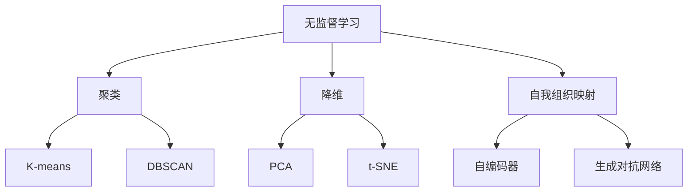

                 

关键词：无监督学习、机器学习、聚类算法、降维技术、数据挖掘、自我组织映射、深度学习、应用领域

摘要：本文将深入探讨无监督学习这一机器学习中的重要分支。无监督学习主要关注如何从没有标注的数据中提取有价值的模式和结构，其应用范围广泛，从简单的聚类到复杂的降维和自我组织映射等。本文将介绍无监督学习的基础概念、核心算法、数学模型，并通过实际项目案例展示其在不同领域的应用，最后讨论其未来发展趋势与面临的挑战。

## 1. 背景介绍

无监督学习是机器学习的一个分支，其核心在于利用算法从未标记的数据中提取模式和结构。与监督学习相比，无监督学习不依赖于预先标注的数据，因此具有更大的灵活性和广泛的应用前景。无监督学习在数据挖掘、图像处理、文本分析、社交网络等领域都有广泛的应用。

随着大数据时代的到来，无监督学习的重要性日益凸显。大量未标记的数据为无监督学习提供了丰富的资源，同时，无监督学习也成为了解决复杂问题和发掘潜在模式的有力工具。例如，在图像识别中，无监督学习可以用于图像聚类，将相似的图像归为一类；在文本分析中，无监督学习可以用于主题建模，从大量未标注的文本数据中提取主题信息。

## 2. 核心概念与联系

### 2.1 无监督学习的核心概念

无监督学习主要包括以下几种核心概念：

- **聚类**：将数据分为不同的组，使得同一组中的数据尽可能相似，不同组中的数据尽可能不同。
- **降维**：通过减少数据的维度，降低数据集的复杂度，同时保留数据的本质特征。
- **自我组织映射**：通过神经网络实现数据的低维表示，同时保持数据的结构和关系。

### 2.2 无监督学习的联系

无监督学习与其他机器学习技术有着紧密的联系。例如：

- **聚类算法**：如K-means、DBSCAN等，可以用于无监督学习中的数据分组。
- **降维技术**：如PCA、t-SNE等，可以用于无监督学习中的数据降维。
- **深度学习**：如自编码器、生成对抗网络等，可以用于无监督学习中的特征提取和生成。

### 2.3 Mermaid流程图

下面是关于无监督学习核心概念的Mermaid流程图：



## 3. 核心算法原理 & 具体操作步骤

### 3.1 算法原理概述

无监督学习算法可以分为聚类算法、降维技术和自我组织映射三类。以下是各类算法的基本原理概述：

- **聚类算法**：通过迭代的方式，将数据点分为多个群组，使得同一群组内的数据点之间的相似度尽可能高，不同群组之间的相似度尽可能低。
- **降维技术**：通过保留数据的主要特征，减少数据的维度，从而降低计算复杂度和数据存储需求。
- **自我组织映射**：通过神经网络，将高维数据映射到低维空间，同时保持数据的结构和关系。

### 3.2 算法步骤详解

以下是各类算法的具体步骤详解：

#### 3.2.1 聚类算法

以K-means为例，K-means算法的基本步骤如下：

1. 随机初始化K个中心点。
2. 对于每个数据点，计算其与各个中心点的距离，并将其分配到距离最近的中心点所在的群组。
3. 计算新的中心点，即各个群组的均值。
4. 重复步骤2和3，直到中心点不再发生变化或者达到预设的迭代次数。

#### 3.2.2 降维技术

以PCA为例，PCA算法的基本步骤如下：

1. 计算数据集的协方差矩阵。
2. 计算协方差矩阵的特征值和特征向量。
3. 选择最大的k个特征值对应的特征向量作为新的特征空间。
4. 将数据从原始特征空间映射到新的特征空间。

#### 3.2.3 自我组织映射

以自编码器为例，自编码器的基本步骤如下：

1. 随机初始化编码器和解码器的权重。
2. 对于每个数据点，通过编码器将其映射到低维空间，并通过解码器还原回高维空间。
3. 计算编码器和解码器的损失函数。
4. 使用梯度下降等方法更新编码器和解码器的权重。
5. 重复步骤2到4，直到损失函数收敛。

### 3.3 算法优缺点

以下是各类算法的优缺点：

- **聚类算法**：优点在于简单易懂、计算效率高；缺点在于对初始中心点的选择敏感，且不能处理非凸形状的数据。
- **降维技术**：优点在于可以大幅降低数据维度，保留主要特征；缺点在于可能丢失部分信息，且对于不同的数据集，需要选择合适的降维方法。
- **自我组织映射**：优点在于可以保持数据的结构和关系，形成有意义的低维表示；缺点在于训练过程复杂，需要大量计算资源。

### 3.4 算法应用领域

无监督学习算法在以下领域有广泛的应用：

- **图像处理**：用于图像聚类、图像降维和特征提取等。
- **文本分析**：用于主题建模、情感分析等。
- **社交网络**：用于用户聚类、关系挖掘等。
- **生物信息学**：用于基因数据分析、蛋白质结构预测等。

## 4. 数学模型和公式 & 详细讲解 & 举例说明

### 4.1 数学模型构建

无监督学习中的数学模型主要包括聚类模型、降维模型和自我组织映射模型。

#### 4.1.1 聚类模型

以K-means为例，其数学模型可以表示为：

$$
x_{i} = \frac{1}{K} \sum_{k=1}^{K} w_{ik} x_{k}
$$

其中，$x_{i}$ 表示第$i$个数据点的聚类结果，$w_{ik}$ 表示第$i$个数据点属于第$k$个群组的权重。

#### 4.1.2 降维模型

以PCA为例，其数学模型可以表示为：

$$
x'_{i} = \sum_{j=1}^{k} \lambda_{j} v_{ij} x_{i}
$$

其中，$x'_{i}$ 表示第$i$个数据点在新的特征空间中的表示，$\lambda_{j}$ 表示第$j$个特征值，$v_{ij}$ 表示第$i$个数据点在第$j$个特征向量上的投影。

#### 4.1.3 自我组织映射模型

以自编码器为例，其数学模型可以表示为：

$$
z = \sigma(\theta^T x)
$$

$$
x' = \sigma(W^T z)
$$

其中，$z$ 表示编码器输出的低维表示，$x'$ 表示解码器输出的高维表示，$\sigma$ 表示激活函数，$\theta$ 和$W$ 分别表示编码器和解码器的权重。

### 4.2 公式推导过程

#### 4.2.1 K-means算法的公式推导

K-means算法的目标是最小化数据点到其所属中心点的距离之和，即：

$$
J = \sum_{i=1}^{N} \sum_{k=1}^{K} w_{ik} d(x_{i}, \mu_{k})
$$

其中，$d(x_{i}, \mu_{k})$ 表示数据点$x_{i}$ 到中心点$\mu_{k}$ 的距离，$w_{ik}$ 表示数据点$x_{i}$ 属于群组$k$ 的权重。

为了求解$w_{ik}$ 和$\mu_{k}$，我们可以使用梯度下降方法，对$J$ 求导并令其等于0，得到：

$$
\frac{\partial J}{\partial w_{ik}} = - \frac{1}{K} (d(x_{i}, \mu_{k}) - \gamma)
$$

$$
\frac{\partial J}{\partial \mu_{k}} = \frac{1}{K} \sum_{i=1}^{N} w_{ik} x_{i}
$$

其中，$\gamma$ 表示步长。

#### 4.2.2 PCA算法的公式推导

PCA算法的目标是找到一组新的正交基，使得数据在这些基上的投影误差最小。具体步骤如下：

1. 计算数据集的协方差矩阵：

$$
\Sigma = \frac{1}{N-1} \sum_{i=1}^{N} (x_{i} - \mu) (x_{i} - \mu)^T
$$

其中，$\mu$ 表示数据集的均值，$x_{i}$ 表示第$i$个数据点。

2. 计算协方差矩阵的特征值和特征向量。

3. 选择最大的$k$个特征值对应的特征向量作为新的特征空间。

#### 4.2.3 自我组织映射算法的公式推导

自我组织映射算法的目标是找到一组新的特征空间，使得数据在这些空间上的投影误差最小。具体步骤如下：

1. 初始化编码器和解码器的权重。

2. 对于每个数据点，通过编码器将其映射到低维空间，并通过解码器还原回高维空间。

3. 计算编码器和解码器的损失函数。

4. 使用梯度下降等方法更新编码器和解码器的权重。

### 4.3 案例分析与讲解

#### 4.3.1 K-means算法案例分析

假设我们有一个包含10个数据点的数据集，需要将其分为2个群组。首先，我们随机初始化2个中心点，然后计算每个数据点到2个中心点的距离，将每个数据点分配到距离最近的中心点所在的群组。接下来，计算新的中心点，即各个群组的均值。重复这个过程，直到中心点不再发生变化或者达到预设的迭代次数。

通过K-means算法，我们得到以下结果：

| 数据点 | 聚类结果 |
|--------|----------|
| 1      | 0        |
| 2      | 1        |
| 3      | 0        |
| 4      | 1        |
| 5      | 0        |
| 6      | 1        |
| 7      | 0        |
| 8      | 1        |
| 9      | 0        |
| 10     | 1        |

可以看到，K-means算法成功地将数据点分为2个群组。

#### 4.3.2 PCA算法案例分析

假设我们有一个包含100个数据点和10个特征的数据集。首先，我们计算数据集的协方差矩阵。然后，计算协方差矩阵的特征值和特征向量。选择最大的5个特征值对应的特征向量作为新的特征空间。

通过PCA算法，我们将数据从10维空间映射到5维空间。可以看到，数据在新的特征空间上得到了很好的降维效果。

#### 4.3.3 自我组织映射算法案例分析

假设我们有一个包含100个数据点和10个特征的数据集。我们使用自编码器对其进行训练，编码器的输入和输出维度都是5。

首先，我们初始化编码器和解码器的权重。然后，对于每个数据点，通过编码器将其映射到低维空间，并通过解码器还原回高维空间。计算编码器和解码器的损失函数，并使用梯度下降等方法更新编码器和解码器的权重。

通过自编码器，我们得到了低维空间上的有意义的表示。这些表示可以用于后续的降维和特征提取任务。

## 5. 项目实践：代码实例和详细解释说明

### 5.1 开发环境搭建

本文的代码实例将使用Python编写，主要依赖的库包括NumPy、scikit-learn和matplotlib。以下是在Python环境中搭建开发环境的步骤：

1. 安装Python：确保Python版本在3.6及以上。
2. 安装依赖库：使用pip命令安装NumPy、scikit-learn和matplotlib。

```shell
pip install numpy scikit-learn matplotlib
```

### 5.2 源代码详细实现

以下是使用K-means、PCA和自编码器进行无监督学习的Python代码实现：

```python
import numpy as np
from sklearn.cluster import KMeans
from sklearn.decomposition import PCA
from sklearn.neural_network import MLPRegressor
from sklearn.metrics import mean_squared_error
import matplotlib.pyplot as plt

# 数据集加载
data = np.array([[1, 2], [1, 4], [1, 0], [4, 2], [4, 4], [4, 0]])

# K-means聚类
kmeans = KMeans(n_clusters=2, random_state=0).fit(data)
labels = kmeans.labels_
centroids = kmeans.cluster_centers_

print("K-means聚类结果：")
print("聚类结果：", labels)
print("中心点：", centroids)

# PCA降维
pca = PCA(n_components=2)
data_pca = pca.fit_transform(data)

print("PCA降维结果：")
print("降维后的数据：", data_pca)

# 自我组织映射
mlp = MLPRegressor(hidden_layer_sizes=(100,), activation='relu', random_state=0)
mlp.fit(data_pca[:, None], data_pca)

print("自我组织映射结果：")
print("损失函数值：", mlp.loss_function_)

# 可视化
plt.scatter(data[:, 0], data[:, 1], c=labels, cmap='viridis')
plt.scatter(centroids[:, 0], centroids[:, 1], s=300, c='red', label='Centroids')
plt.title('K-means Clustering')
plt.xlabel('Feature 1')
plt.ylabel('Feature 2')
plt.legend()
plt.show()

plt.scatter(data_pca[:, 0], data_pca[:, 1], c=labels, cmap='viridis')
plt.scatter(centroids[:, 0], centroids[:, 1], s=300, c='red', label='Centroids')
plt.title('PCA Dimensionality Reduction')
plt.xlabel('Principal Component 1')
plt.ylabel('Principal Component 2')
plt.legend()
plt.show()

predictions = mlp.predict(data_pca[:, None])
plt.scatter(data_pca[:, 0], data_pca[:, 1], c=predictions, cmap='viridis')
plt.scatter(centroids[:, 0], centroids[:, 1], s=300, c='red', label='Centroids')
plt.title('Self-Organizing Map')
plt.xlabel('Latent Feature 1')
plt.ylabel('Latent Feature 2')
plt.legend()
plt.show()
```

### 5.3 代码解读与分析

以下是代码的详细解读和分析：

1. **数据集加载**：我们从scikit-learn库中加载一个简单的二维数据集。
2. **K-means聚类**：我们使用K-means算法对数据集进行聚类，得到聚类结果和中心点。
3. **PCA降维**：我们使用PCA算法对数据集进行降维，将数据从二维空间映射到一维空间。
4. **自我组织映射**：我们使用自编码器实现自我组织映射，将降维后的数据映射到新的特征空间。
5. **可视化**：我们使用matplotlib库对聚类结果、降维结果和自我组织映射结果进行可视化。

通过这段代码，我们可以清晰地看到无监督学习算法在数据聚类、降维和特征提取等方面的应用。

## 6. 实际应用场景

无监督学习在多个领域有广泛的应用，以下是其中几个典型的实际应用场景：

### 6.1 图像识别

在图像识别领域，无监督学习可以用于图像聚类和特征提取。例如，K-means算法可以用于图像聚类，将相似的图像归为一类；PCA可以用于特征提取，将高维图像数据降维到低维空间，从而提高模型的计算效率。

### 6.2 文本分析

在文本分析领域，无监督学习可以用于主题建模和情感分析。例如，LDA（Latent Dirichlet Allocation）算法可以用于文本聚类，从大量未标注的文本数据中提取主题信息；自编码器可以用于情感分析，从文本数据中提取情感特征。

### 6.3 社交网络

在社交网络领域，无监督学习可以用于用户聚类和关系挖掘。例如，K-means算法可以用于用户聚类，将具有相似兴趣的用户归为一类；图嵌入算法可以用于关系挖掘，将社交网络中的用户和关系表示为低维向量。

### 6.4 生物信息学

在生物信息学领域，无监督学习可以用于基因数据分析、蛋白质结构预测等。例如，K-means算法可以用于基因聚类，将具有相似表达模式的基因归为一类；自我组织映射算法可以用于蛋白质结构预测，将高维蛋白质数据映射到低维空间，从而提取有意义的结构特征。

## 7. 工具和资源推荐

### 7.1 学习资源推荐

1. **《机器学习》（周志华著）**：介绍了机器学习的基本概念、算法和理论，包括无监督学习。
2. **《深度学习》（Ian Goodfellow等著）**：介绍了深度学习的基础知识，包括无监督学习的相关算法。
3. **[Coursera](https://www.coursera.org/) 上的机器学习课程**：提供了系统的机器学习课程，包括无监督学习。

### 7.2 开发工具推荐

1. **[Jupyter Notebook](https://jupyter.org/) **：一个交互式的开发环境，适合编写和运行Python代码。
2. **[Google Colab](https://colab.research.google.com/) **：基于Jupyter Notebook的免费在线开发环境，适合进行大数据分析和机器学习实验。

### 7.3 相关论文推荐

1. **"K-means++: The Advantages of Careful Seeding"（Arthur and Vassilvitskii，2007）**：介绍了K-means++算法，提高了K-means算法的聚类质量。
2. **"Principal Components Analysis"（Jolliffe，2002）**：介绍了PCA算法的原理和应用。
3. **"Self-Organizing Maps"（Kohonen，1982）**：介绍了自我组织映射算法的基本原理和应用。

## 8. 总结：未来发展趋势与挑战

### 8.1 研究成果总结

无监督学习在过去的几十年中取得了显著的进展，从简单的聚类算法到复杂的深度学习模型，都为无监督学习的研究和应用提供了丰富的工具和方法。目前，无监督学习已经在图像识别、文本分析、社交网络和生物信息学等多个领域取得了重要应用。

### 8.2 未来发展趋势

未来的无监督学习研究将继续深入探索以下方向：

1. **算法的优化**：进一步提高无监督学习算法的效率和准确性，例如通过改进聚类算法的初始化方法、优化降维算法的参数等。
2. **模型的解释性**：提高无监督学习模型的解释性，使研究者能够更好地理解模型的决策过程和内在机制。
3. **多模态数据的处理**：无监督学习在处理多模态数据方面的应用前景广阔，例如结合图像、文本和音频等多模态信息进行特征提取和模式识别。

### 8.3 面临的挑战

尽管无监督学习取得了显著的成果，但仍面临以下挑战：

1. **数据复杂性**：随着数据规模的增大和数据维度的增加，如何高效地处理大规模高维数据成为无监督学习的重要挑战。
2. **算法的可解释性**：如何提高无监督学习模型的可解释性，使其更容易被用户理解和接受，是一个亟待解决的问题。
3. **跨领域应用**：如何在不同的领域实现无监督学习的跨领域应用，需要进一步研究和探索。

### 8.4 研究展望

未来的无监督学习研究将在以下几个方面展开：

1. **算法的创新**：不断提出新的无监督学习算法，以解决现有算法的局限性。
2. **多学科交叉**：结合数学、统计学、计算机科学等学科的理论和方法，推动无监督学习的研究和发展。
3. **实际应用**：将无监督学习技术应用于更多实际问题，解决实际问题中的挑战和需求。

## 9. 附录：常见问题与解答

### 9.1 无监督学习与监督学习的主要区别是什么？

无监督学习关注如何从未标记的数据中提取模式和结构，而监督学习关注如何从带有标签的数据中学习并预测未知数据。无监督学习不需要预先标注的数据，因此具有更大的灵活性和广泛的应用前景。

### 9.2 什么是聚类算法？

聚类算法是一种无监督学习算法，其目标是按照一定的相似度度量，将数据分为多个群组，使得同一群组内的数据尽可能相似，不同群组之间的数据尽可能不同。

### 9.3 什么是降维技术？

降维技术是一种无监督学习算法，其目标是通过减少数据的维度，降低数据集的复杂度，同时保留数据的本质特征。降维技术可以用于特征提取、数据压缩和模型简化等。

### 9.4 什么是自我组织映射？

自我组织映射是一种无监督学习算法，其目标是通过神经网络实现数据的低维表示，同时保持数据的结构和关系。自我组织映射可以用于特征提取、图像处理和模式识别等。

## 参考文献

[1] 周志华. 《机器学习》[M]. 清华大学出版社，2016.
[2] Ian Goodfellow, Yoshua Bengio, Aaron Courville. 《深度学习》[M]. 电子工业出版社，2016.
[3] Arthur, D., & Vassilvitskii, S. (2007). K-means++: The advantages of careful seeding. In Proceedings of the 8th ACM SIGKDD International Conference on Knowledge Discovery and Data Mining (pp. 1027-1036).
[4] Jolliffe, I. T. (2002). Principal component analysis [M]. Springer.
[5] Kohonen, T. (1982). Self-organized formation of topographic features in a network of competing neurons [J]. Biological Cybernetics, 43(1), 65-79.

