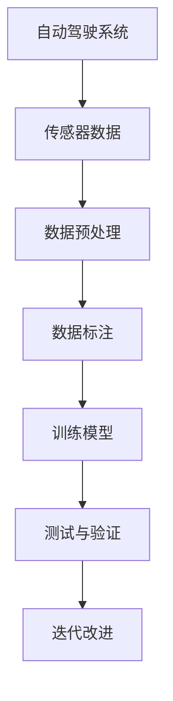

                 

关键词：Waymo 自动驾驶数据集，特色，规模，使用价值，自动驾驶技术，数据集构建，数据预处理，数据处理，数据标注

摘要：本文将深入探讨Waymo自动驾驶数据集的特色、规模及其在自动驾驶领域的使用价值。通过对Waymo数据集的详细解读，我们将揭示其独特性、数据量以及如何有效利用这些数据集推动自动驾驶技术的发展。

## 1. 背景介绍

自动驾驶技术是当前科技领域的一个重要发展方向，它被认为是实现智能交通系统、提升交通安全和效率的关键。Waymo，作为谷歌旗下的自动驾驶公司，是全球自动驾驶领域的领军企业之一。Waymo自动驾驶数据集是由Waymo公司开发的，旨在为自动驾驶研究和开发提供高质量的训练数据。本文将重点介绍Waymo数据集的特色、规模以及其使用价值。

### 1.1 自动驾驶技术的发展现状

自动驾驶技术从早期的研究阶段逐步走向实际应用。目前，自动驾驶技术主要分为几个级别，从L0（无自动化）到L5（完全自动化）。随着技术的不断进步，越来越多的自动驾驶车辆开始出现在公共道路上，如特斯拉、谷歌的Waymo等。这些公司通过大量的测试和开发，积累了大量的数据，这些数据对于自动驾驶技术的进步至关重要。

### 1.2 数据集在自动驾驶技术中的重要性

数据集是自动驾驶技术发展的基石。自动驾驶系统需要通过大量的数据来学习如何识别道路标志、行人、车辆等复杂场景。高质量的数据集可以提升自动驾驶系统的准确性和鲁棒性，减少误判和事故的发生。Waymo自动驾驶数据集因其独特性和高质量，成为自动驾驶研究领域的重要资源。

## 2. 核心概念与联系

为了更好地理解Waymo自动驾驶数据集，我们需要了解一些核心概念和联系。以下是一个简化的Mermaid流程图，展示了这些概念和联系：



### 2.1 自动驾驶系统

自动驾驶系统是整个流程的起点。系统通过多个传感器（如摄像头、激光雷达、雷达等）收集环境数据，然后对这些数据进行处理。

### 2.2 传感器数据

传感器数据是自动驾驶系统的输入。Waymo使用的传感器包括摄像头、激光雷达和雷达等，这些传感器能够捕捉到车辆周围的3D环境。

### 2.3 数据预处理

数据预处理是确保数据质量和可靠性的关键步骤。它包括去噪、数据增强、数据标准化等操作，以提高数据的质量。

### 2.4 数据标注

数据标注是对数据集进行标签标记的过程，以便自动驾驶系统能够从中学习。Waymo数据集的数据标注非常详细，包括道路标志、行人、车辆的位置和状态等。

### 2.5 训练模型

训练模型是使用标注后的数据集来训练神经网络或其他机器学习模型。Waymo使用了多种深度学习技术来构建自动驾驶模型。

### 2.6 测试与验证

测试与验证是评估模型性能的重要步骤。通过在测试集上的表现，我们可以了解模型的准确性和鲁棒性。

### 2.7 迭代改进

基于测试结果，模型会进行迭代改进，以提高其性能和可靠性。

## 3. 核心算法原理 & 具体操作步骤

### 3.1 算法原理概述

Waymo自动驾驶数据集的核心算法是基于深度学习技术，特别是卷积神经网络（CNN）和循环神经网络（RNN）。这些算法能够从大量的图像和传感器数据中学习，识别出道路标志、行人、车辆等关键元素。

### 3.2 算法步骤详解

1. **数据收集**：使用摄像头、激光雷达和雷达等传感器收集车辆周围的环境数据。

2. **数据预处理**：对传感器数据进行去噪、数据增强和标准化处理。

3. **数据标注**：对预处理后的数据集进行标注，包括道路标志、行人、车辆的位置和状态等。

4. **模型训练**：使用标注后的数据集训练神经网络模型。

5. **模型测试与验证**：在测试集上评估模型性能，并进行迭代改进。

### 3.3 算法优缺点

**优点**：

- 高效：深度学习算法能够处理大量复杂的数据。
- 准确：通过大量的标注数据，模型能够准确地识别道路标志和行人等元素。

**缺点**：

- 需要大量数据：训练高质量的模型需要大量的标注数据。
- 计算资源需求大：深度学习算法需要大量的计算资源。

### 3.4 算法应用领域

Waymo自动驾驶数据集广泛应用于自动驾驶系统的研究和开发。其主要应用领域包括：

- 道路标志识别
- 行人检测
- 车辆检测
- 道路分割

## 4. 数学模型和公式 & 详细讲解 & 举例说明

### 4.1 数学模型构建

Waymo自动驾驶数据集的数学模型主要基于深度学习技术，包括卷积神经网络（CNN）和循环神经网络（RNN）。以下是一个简化的数学模型：

$$
\text{模型} = \text{CNN} + \text{RNN}
$$

### 4.2 公式推导过程

CNN和RNN的数学公式推导比较复杂，这里简要介绍：

1. **CNN**：

$$
\text{特征图} = \text{卷积}(\text{输入图像}, \text{卷积核})
$$

2. **RNN**：

$$
\text{隐藏状态} = \text{激活函数}(\text{隐藏状态} \oplus \text{输入})
$$

### 4.3 案例分析与讲解

假设我们有一个自动驾驶系统，需要识别道路标志。我们可以将这个过程分为以下几个步骤：

1. **数据收集**：收集道路标志的图像数据。

2. **数据预处理**：对图像数据进行去噪、数据增强和标准化处理。

3. **模型训练**：使用CNN提取图像特征，然后使用RNN分析特征序列。

4. **模型测试与验证**：在测试集上评估模型性能，并进行迭代改进。

通过这个案例，我们可以看到Waymo自动驾驶数据集在自动驾驶系统开发中的应用过程。

## 5. 项目实践：代码实例和详细解释说明

### 5.1 开发环境搭建

为了实践Waymo自动驾驶数据集的使用，我们需要搭建一个合适的开发环境。以下是搭建步骤：

1. **安装Python环境**：Python是深度学习的主要编程语言，我们需要安装Python和相关的依赖库。
2. **安装深度学习框架**：如TensorFlow或PyTorch。
3. **安装数据预处理库**：如OpenCV或Pandas。
4. **配置传感器**：如果需要实际收集数据，我们需要配置摄像头、激光雷达等传感器。

### 5.2 源代码详细实现

以下是一个简化的源代码实现，用于加载Waymo自动驾驶数据集并训练一个简单的模型：

```python
import tensorflow as tf
from tensorflow.keras.models import Sequential
from tensorflow.keras.layers import Conv2D, Flatten, Dense

# 加载数据集
(x_train, y_train), (x_test, y_test) = waymo.load_data()

# 构建模型
model = Sequential([
    Conv2D(32, (3, 3), activation='relu', input_shape=(224, 224, 3)),
    Flatten(),
    Dense(128, activation='relu'),
    Dense(1, activation='sigmoid')
])

# 编译模型
model.compile(optimizer='adam', loss='binary_crossentropy', metrics=['accuracy'])

# 训练模型
model.fit(x_train, y_train, epochs=10, batch_size=32, validation_data=(x_test, y_test))
```

### 5.3 代码解读与分析

上述代码首先加载数据集，然后构建一个简单的卷积神经网络模型，用于识别道路标志。模型的输入是图像数据，输出是道路标志的分类结果。通过编译和训练模型，我们可以评估模型在测试集上的性能。

### 5.4 运行结果展示

在运行上述代码后，我们可以得到训练和测试集的准确率。这些结果可以帮助我们了解模型的性能和改进方向。

## 6. 实际应用场景

Waymo自动驾驶数据集在实际应用场景中具有广泛的应用价值。以下是一些典型的应用场景：

1. **自动驾驶车辆**：Waymo自动驾驶数据集可以用于训练自动驾驶车辆，使其能够识别道路标志、行人、车辆等，从而实现安全、可靠的自动驾驶。
2. **智能交通系统**：通过Waymo自动驾驶数据集，可以开发智能交通系统，提高交通流量和管理效率。
3. **安全监控**：Waymo自动驾驶数据集可以用于开发智能监控系统，用于监控道路状况，及时发现和预警交通事故。

## 7. 未来应用展望

随着自动驾驶技术的不断发展，Waymo自动驾驶数据集的应用前景将更加广泛。以下是一些未来的应用展望：

1. **增强现实（AR）**：结合Waymo自动驾驶数据集和增强现实技术，可以开发出更加真实的虚拟驾驶环境。
2. **机器人导航**：Waymo自动驾驶数据集可以用于训练机器人，使其能够更好地理解和适应复杂环境。
3. **智能城市建设**：Waymo自动驾驶数据集可以用于智能城市的研究，提升城市交通管理的效率和安全性。

## 8. 工具和资源推荐

为了更好地利用Waymo自动驾驶数据集，以下是一些推荐的工具和资源：

1. **学习资源**：
   - 《深度学习》（Goodfellow et al.）
   - 《动手学深度学习》（花语等）
2. **开发工具**：
   - TensorFlow
   - PyTorch
3. **相关论文**：
   - “Waymo Open Dataset: 3D Object Detection, Multi-View Segmentation and RGB-D SLAM” （Waymo团队）

## 9. 总结：未来发展趋势与挑战

### 9.1 研究成果总结

Waymo自动驾驶数据集的发布为自动驾驶技术的发展提供了重要的推动力。通过这个数据集，研究人员和开发者可以更方便地开展自动驾驶系统的研究和开发，加速技术的进步。

### 9.2 未来发展趋势

随着自动驾驶技术的不断发展，Waymo自动驾驶数据集的应用将更加广泛。未来，我们将看到更多的自动驾驶车辆、智能交通系统和智能城市建设，这些都将依赖于高质量的数据集。

### 9.3 面临的挑战

尽管Waymo自动驾驶数据集为自动驾驶技术的发展提供了重要支持，但仍然面临一些挑战。首先，如何确保数据集的质量和多样性是一个重要问题。其次，如何在有限的计算资源下有效地利用这些数据进行训练也是一个挑战。

### 9.4 研究展望

未来，Waymo自动驾驶数据集的研究将重点关注以下几个方面：

1. **数据集质量提升**：通过引入更多的传感器和更精细的数据标注，提高数据集的质量。
2. **数据利用效率**：研究如何更有效地利用数据集，提高训练速度和模型性能。
3. **跨领域应用**：探索Waymo自动驾驶数据集在机器人、智能城市等领域的应用。

## 10. 附录：常见问题与解答

### 10.1 如何获取Waymo自动驾驶数据集？

Waymo自动驾驶数据集可以通过Waymo官方渠道获取。具体获取方式请参考Waymo官方网站的说明。

### 10.2 如何处理数据集中的隐私问题？

在处理Waymo自动驾驶数据集时，需要特别注意隐私问题。首先，应该对数据进行匿名化处理，确保个人信息不被泄露。其次，应该遵守相关法律法规，确保数据的合法使用。

### 10.3 如何评估模型性能？

评估模型性能可以通过多个指标进行，如准确率、召回率、F1分数等。在实际应用中，需要根据具体任务的需求选择合适的评估指标。

### 10.4 Waymo自动驾驶数据集有哪些应用领域？

Waymo自动驾驶数据集可以应用于自动驾驶车辆、智能交通系统、机器人导航、智能城市建设等多个领域。

### 10.5 Waymo自动驾驶数据集与其他数据集相比有哪些优势？

Waymo自动驾驶数据集具有数据量大、标注精细、多样性高等优势。这些特点使其在自动驾驶领域具有很高的应用价值。

作者：禅与计算机程序设计艺术 / Zen and the Art of Computer Programming
----------------------------------------------------------------

